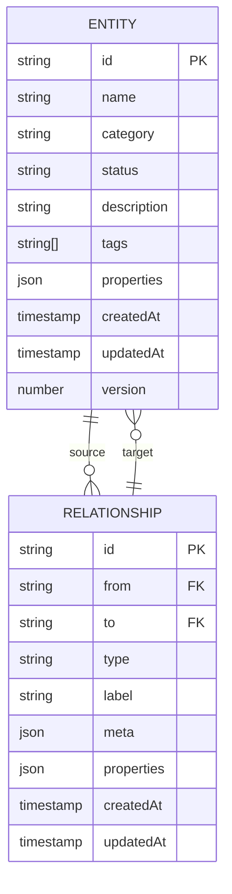
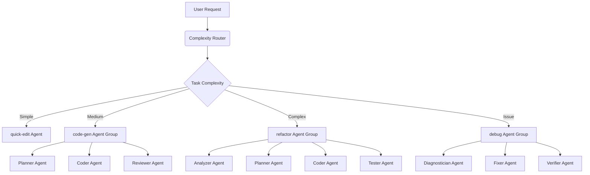
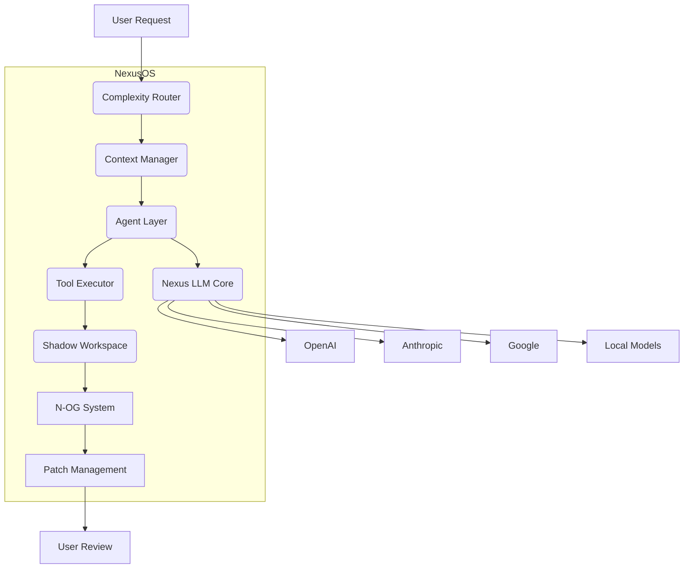

# AI Integration

<cite>
**Referenced Files in This Document**   
- [bridge.ts](file://packages/nexus-reactor/src/mcp/bridge.ts)
- [tools.ts](file://packages/nexus-reactor/src/mcp/tools.ts)
- [resources.ts](file://packages/nexus-reactor/src/mcp/resources.ts)
- [graph.ts](file://packages/nexus-protocol/src/nog/graph.ts)
- [entity.ts](file://packages/nexus-protocol/src/nog/entity.ts)
- [relationship.ts](file://packages/nexus-protocol/src/nog/relationship.ts)
- [patch.ts](file://packages/nexus-protocol/src/nog/patch.ts)
- [state.ts](file://packages/nexus-reactor/src/state/store.ts)
- [types.ts](file://packages/nexus-reactor/src/core/types.ts)
- [nexusos-obj.md](file://docs/05_nexusos-obj.md)
</cite>

## Table of Contents
1. [MCP Bridge and Bidirectional Communication](#mcp-bridge-and-bidirectional-communication)
2. [Patch Proposal Workflow](#patch-proposal-workflow)
3. [Nexus Object Graph (N-OG) Knowledge Representation](#nexus-object-graph-n-og-knowledge-representation)
4. [Agent Layer Architecture](#agent-layer-architecture)
5. [AI-Assisted Development Scenarios](#ai-assisted-development-scenarios)
6. [Security Considerations](#security-considerations)
7. [Integration with NexusOS Architecture](#integration-with-nexusos-architecture)

## MCP Bridge and Bidirectional Communication

The Model Context Protocol (MCP) bridge enables bidirectional communication between Nexus and Large Language Model (LLM) systems, allowing AI agents to inspect panel state and propose modifications. The MCP bridge exposes panel tools and state to AI agents through standardized interfaces. It provides methods to retrieve available tools, access panel resources, and execute tool calls, facilitating seamless interaction between AI systems and the Nexus environment.

The `createMCPBridge` function initializes the bridge with the panel's Abstract Syntax Tree (AST), state store, and a tool execution handler. This bridge allows AI agents to retrieve tools via `getTools()`, which converts NXML tool definitions into MCP-compatible tool descriptions with JSON Schema input specifications. Agents can access panel resources such as state, computed values, and metadata through `getResources()` and `readResource()` methods, enabling comprehensive context awareness.

AI agents can inspect the current panel state by reading the `nexus://<panelId>/state` resource, which returns a JSON snapshot of all state variables. Similarly, computed values are accessible via `nexus://<panelId>/computed`, allowing AI to understand derived data. The bridge also provides utility functions like `generateStateSchema()` to create JSON Schemas describing the panel's state structure and `getToolsDescription()` to generate formatted descriptions of available tools for AI context.

**Section sources**
- [bridge.ts](file://packages/nexus-reactor/src/mcp/bridge.ts#L1-L167)
- [tools.ts](file://packages/nexus-reactor/src/mcp/tools.ts#L1-L170)
- [resources.ts](file://packages/nexus-reactor/src/mcp/resources.ts#L1-L169)

## Patch Proposal Workflow

The patch proposal workflow governs how AI suggestions are transformed into user-approved changes. When an AI agent proposes modifications, these changes are encapsulated as patches in the Nexus Object Graph (NOG) system. Patches represent atomic operations such as entity creation, updates, deletions, or view-level changes, and enter a "Pending Review" state before application.

Each patch contains metadata including the operation type, source and target panels, human-readable description, AI-generated reasoning, confidence score, and creation timestamp. The workflow begins when a user modifies a panel, triggering the NexusOS to update the NOG and calculate affected panels. The system then generates patch proposals for these panels, which are presented to the user for review.

Users can approve, reject, or modify patches through a review interface. Approved patches are applied atomically to target panels, while rejected patches are discarded. The system maintains previous states for undo operations and tracks patch status through lifecycle events (pending, approved, rejected, applied, failed, expired). Patch sets group related patches for coordinated review and application, with overall status determined by individual patch states.

**Section sources**
- [patch.ts](file://packages/nexus-protocol/src/nog/patch.ts#L1-L473)

## Nexus Object Graph (N-OG) Knowledge Representation

The Nexus Object Graph (N-OG) serves as the "Runtime Semantic Truth" of a project, maintaining the semantic structure across all panels in a workspace. It represents entities and their relationships as a directed graph, enabling impact analysis and change propagation. The N-OG tracks entity relationships to understand how modifications in one panel affect others, providing the foundation for intelligent AI assistance.

Entities in the N-OG represent semantic concepts such as components, data models, actions, and constraints. Each entity has a unique ID, name, category, status, description, tags, properties, and lifecycle metadata. The graph supports various entity categories including 'concept', 'component', 'data', 'action', 'resource', 'constraint', and 'milestone', with specialized properties for each type.

Relationships define semantic connections between entities using standardized types such as 'contains', 'implements', 'depends_on', 'uses', 'produces', and 'consumes'. These directed edges include metadata like strength, confidence, source (user, AI, or system), and notes. The graph supports queries to find connected entities, calculate impact paths, and analyze dependencies, enabling AI agents to understand the broader implications of proposed changes.

**Diagram sources**
- [graph.ts](file://packages/nexus-protocol/src/nog/graph.ts#L1-L446)
- [entity.ts](file://packages/nexus-protocol/src/nog/entity.ts#L1-L327)
- [relationship.ts](file://packages/nexus-protocol/src/nog/relationship.ts#L1-L321)

## Agent Layer Architecture

The agent layer architecture consists of specialized agents designed for specific development tasks, orchestrated through the NexusOS Agent Layer. These agents leverage the Model Context Protocol to interact with the Nexus environment, each optimized for particular types of operations. The architecture follows a compositional model where agent groups combine multiple specialized agents to handle complex workflows.

Specialized agents include:
- **Code Generation Agent**: Creates new panels, components, and tools based on requirements
- **Refactoring Agent**: Analyzes code structure and proposes improvements for maintainability
- **Debugging Agent**: Diagnoses issues, identifies root causes, and suggests fixes
- **Planning Agent**: Breaks down complex tasks into executable steps
- **Reviewer Agent**: Performs code reviews and quality assurance checks

Agent groups define configurations for specific use cases, such as 'code-gen' for new feature development, 'refactor' for large-scale restructuring, 'debug' for issue resolution, and 'quick-edit' for simple modifications. Each agent group specifies composition, orchestration strategy, token budget, timeout, and model preferences for different phases of execution.

The complexity router automatically selects the appropriate agent group based on task characteristics, including request semantics, scope, change type, domain complexity, and historical success rates. This intelligent routing ensures optimal resource allocation and quality outcomes while minimizing costs.

**Diagram sources**
- [nexusos-obj.md](file://docs/05_nexusos-obj.md#L270-L370)

## AI-Assisted Development Scenarios

AI-assisted development scenarios leverage the MCP bridge and N-OG system to enhance productivity across various workflows. In code generation scenarios, AI agents analyze requirements and generate complete panel implementations with appropriate state, logic, and view components. The agents can create new tools with proper argument validation and handler code, ensuring adherence to platform conventions.

For refactoring tasks, AI agents analyze existing code structure and propose improvements such as component extraction, state management optimization, or performance enhancements. The N-OG enables impact analysis, showing how proposed changes affect related entities across panels. Agents can suggest breaking down monolithic components, improving naming conventions, or optimizing data flow patterns.

In debugging scenarios, AI agents diagnose issues by analyzing error patterns, examining state transitions, and tracing execution flows. They can propose fixes for common problems such as state synchronization issues, incorrect bindings, or logic errors. The patch system ensures these suggestions undergo user review before application, maintaining control over code changes.

Other scenarios include documentation generation, where AI creates comprehensive documentation based on code structure and comments; test generation, where AI produces test cases covering various scenarios; and accessibility improvements, where AI suggests UI enhancements for better usability.

**Section sources**
- [nexusos-obj.md](file://docs/05_nexusos-obj.md#L308-L370)

## Security Considerations

Security considerations for automated code changes focus on maintaining system integrity while enabling AI assistance. The MCP bridge implements capability-based security, where AI agents only access resources and tools explicitly exposed through the protocol. This principle of least privilege prevents unauthorized access to sensitive functionality.

The explicit sync workflow ensures user approval before any changes are applied, preventing uncontrolled modifications. Patch proposals are isolated in shadow branches where they can be validated and tested before merging. This shadow workspace allows safe execution of AI-generated code without affecting the main codebase.

AI-generated changes undergo automated validation through schema checking, type validation, and security scanning. The system detects and blocks potentially harmful patterns such as injection vulnerabilities, insecure API usage, or privacy violations. All AI interactions are logged for audit purposes, providing transparency into decision-making processes.

Rate limiting and budget controls prevent abuse of AI resources, while content filtering protects against malicious inputs. The system also implements PII detection to prevent sensitive data from being sent to external AI providers, ensuring compliance with data protection regulations.

**Section sources**
- [nexusos-obj.md](file://docs/05_nexusos-obj.md#L252-L263)

## Integration with NexusOS Architecture

The AI integration components are tightly integrated with the NexusOS architecture, leveraging key components such as the complexity router and context manager. The complexity router analyzes incoming requests to determine appropriate agent groups and model tiers based on task complexity, latency requirements, and cost sensitivity. This intelligent routing optimizes resource utilization and ensures quality outcomes.

The context manager handles the challenge of limited context windows by prioritizing relevant information. It employs semantic relevance scoring, recency weighting, and dependency graph analysis to select the most pertinent code, documentation, and conversation history for AI interactions. This ensures AI agents operate with comprehensive context while staying within token limits.

The architecture follows a layered approach where the Nexus LLM Core (NLC) provides provider-agnostic access to multiple LLM providers, with automatic failover and cost optimization. The Agent Layer builds on NLC to provide Nexus-specific capabilities, including tool calling, state inspection, and patch management.

**Diagram sources**
- [nexusos-obj.md](file://docs/05_nexusos-obj.md#L508-L561)