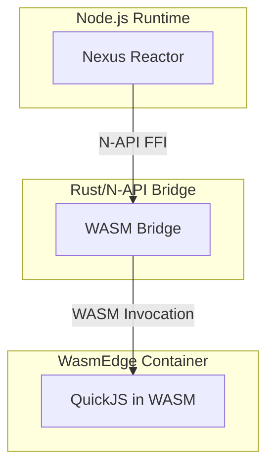
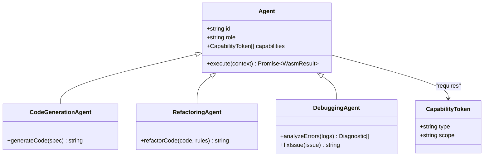
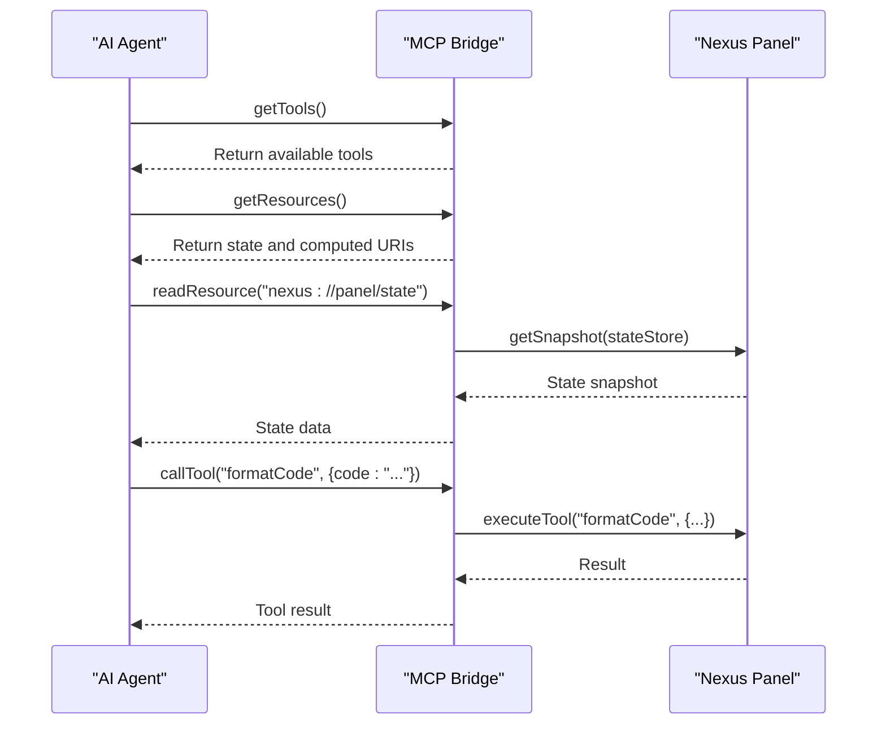
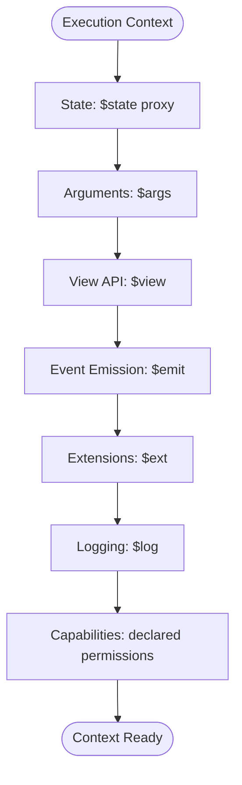
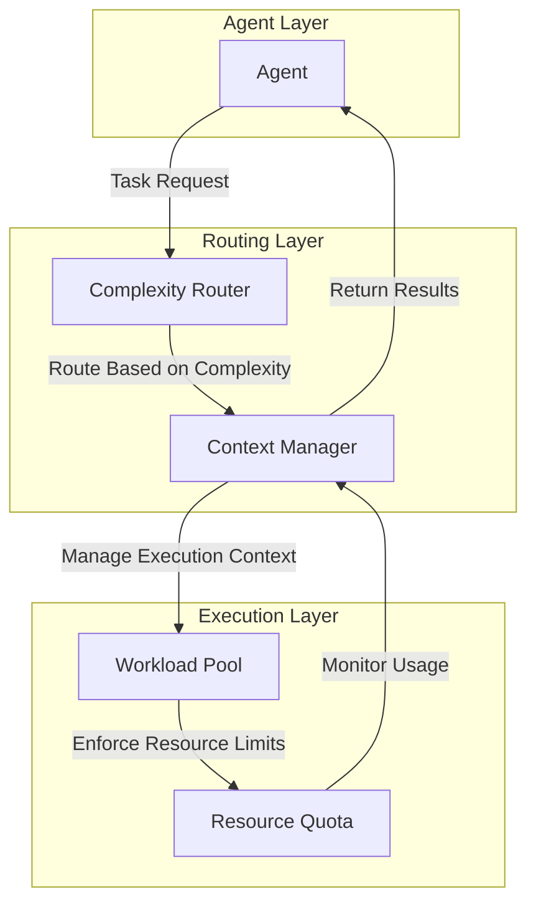
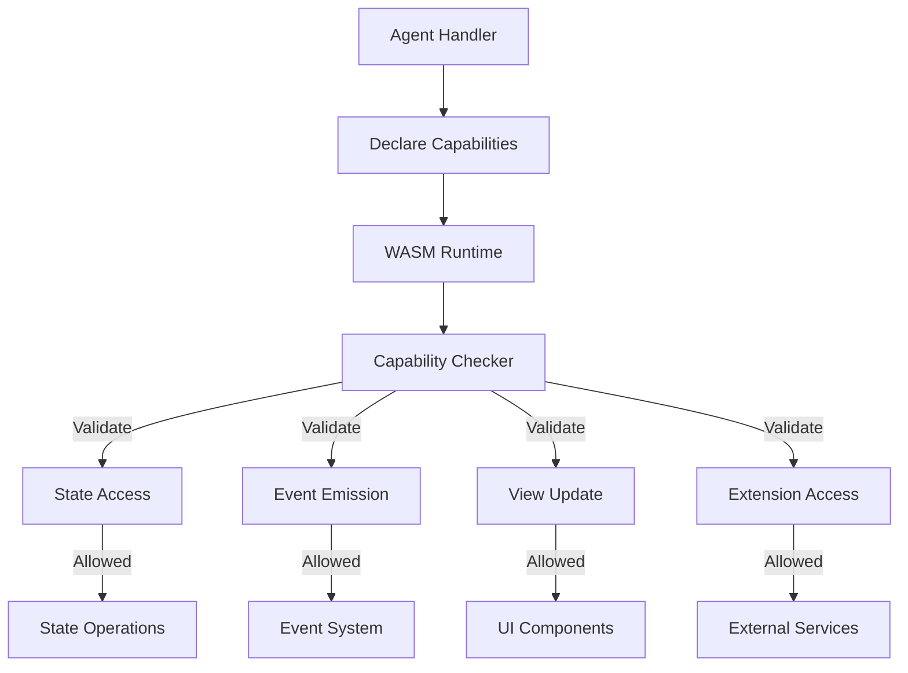

# Agent Layer Architecture

<cite>
**Referenced Files in This Document**   
- [executor-wasm.ts](file://packages/nexus-reactor/src/sandbox/executor-wasm.ts)
- [bridge.ts](file://packages/nexus-reactor/src/mcp/bridge.ts)
- [wasm-bridge.types.ts](file://packages/nexus-reactor/src/sandbox/wasm-bridge.types.ts)
- [context.ts](file://packages/nexus-reactor/src/sandbox/context.ts)
- [types.ts](file://packages/nexus-reactor/src/core/types.ts)
- [reactor.ts](file://packages/nexus-reactor/src/reactor.ts)
- [lib.rs](file://runtime/nexus-wasm-bridge/src/lib.rs)
- [capability.rs](file://runtime/nexus-wasm-bridge/src/capability.rs)
- [context.rs](file://runtime/nexus-wasm-bridge/src/context.rs)
- [engine/mod.rs](file://runtime/nexus-wasm-bridge/src/engine/mod.rs)
- [store.ts](file://packages/nexus-reactor/src/state/store.ts)
</cite>

## Table of Contents
1. [Introduction](#introduction)
2. [WASM Execution Environment](#wasm-execution-environment)
3. [Agent Role Specialization](#agent-role-specialization)
4. [MCP Bridge Integration](#mcp-bridge-integration)
5. [Execution Context](#execution-context)
6. [Message Routing Architecture](#message-routing-architecture)
7. [Deployment and Scaling](#deployment-and-scaling)
8. [Security Boundaries](#security-boundaries)
9. [Agent Coordination Patterns](#agent-coordination-patterns)
10. [Failure Handling Strategies](#failure-handling-strategies)

## Introduction
The Nexus agent layer provides a secure, isolated environment for AI agents to operate within the Nexus platform. This architecture leverages WebAssembly (WASM) execution through WasmEdge to ensure true sandboxing, enabling safe execution of code generation, refactoring, and debugging agents. The system integrates with the Model Context Protocol (MCP) bridge to expose panel tools and state to AI agents while maintaining strict security boundaries. Agents operate within a well-defined execution context that provides access to the knowledge graph, panel state, and controlled external resources through capability-based security.

**Section sources**
- [executor-wasm.ts](file://packages/nexus-reactor/src/sandbox/executor-wasm.ts#L1-L397)
- [lib.rs](file://runtime/nexus-wasm-bridge/src/lib.rs#L1-L71)

## WASM Execution Environment
The agent execution environment is built on WasmEdge with QuickJS, providing true isolation through WASM sandboxing. Each agent runs in a separate WASM instance with defined memory limits and execution constraints. The execution model supports async operations through a suspend/resume mechanism that allows agents to perform I/O operations while maintaining state consistency.

The WASM runtime implements instance pooling and compilation caching for performance optimization. Handlers are pre-compiled when possible, with bytecode cached to disk for faster subsequent executions. The default configuration limits each instance to 32MB of memory and 1MB of stack space, with configurable limits based on agent requirements.

**Diagram sources**
- [lib.rs](file://runtime/nexus-wasm-bridge/src/lib.rs#L1-L71)
- [executor-wasm.ts](file://packages/nexus-reactor/src/sandbox/executor-wasm.ts#L1-L397)

**Section sources**
- [executor-wasm.ts](file://packages/nexus-reactor/src/sandbox/executor-wasm.ts#L1-L397)
- [lib.rs](file://runtime/nexus-wasm-bridge/src/lib.rs#L1-L71)
- [engine/mod.rs](file://runtime/nexus-wasm-bridge/src/engine/mod.rs#L1-L244)

## Agent Role Specialization
AI agents in Nexus are specialized by function, with distinct roles for code generation, refactoring, and debugging. Each agent type has specific capabilities and access patterns tailored to its purpose:

- **Code Generation Agents**: Specialized in creating new code based on requirements, with read access to the knowledge graph and write access to code state
- **Refactoring Agents**: Focused on improving existing code structure, with read/write access to code state and analysis tools
- **Debugging Agents**: Designed to identify and fix issues, with access to error logs, execution traces, and diagnostic tools

Agents declare their required capabilities in their handler definitions, which are enforced by the runtime. The capability system uses a token-based approach with fine-grained permissions for state access, event emission, view updates, and extension usage.

**Diagram sources**
- [types.ts](file://packages/nexus-reactor/src/core/types.ts#L1-L446)
- [capability.rs](file://runtime/nexus-wasm-bridge/src/capability.rs#L1-L384)

**Section sources**
- [types.ts](file://packages/nexus-reactor/src/core/types.ts#L1-L446)
- [capability.rs](file://runtime/nexus-wasm-bridge/src/capability.rs#L1-L384)

## MCP Bridge Integration
The MCP bridge serves as the interface between AI agents and the Nexus panel environment, exposing tools and state resources while maintaining security boundaries. It implements the MCP specification to provide a standardized way for agents to access panel functionality.

The bridge exposes panel state and computed values as MCP resources with specific URIs, allowing agents to read the current state of the application. Tools defined in the panel are exposed as MCP tools with JSON Schema definitions that describe their input parameters and requirements.

**Diagram sources**
- [bridge.ts](file://packages/nexus-reactor/src/mcp/bridge.ts#L1-L167)
- [reactor.ts](file://packages/nexus-reactor/src/reactor.ts#L1-L260)

**Section sources**
- [bridge.ts](file://packages/nexus-reactor/src/mcp/bridge.ts#L1-L167)
- [reactor.ts](file://packages/nexus-reactor/src/reactor.ts#L1-L260)

## Execution Context
Agents execute within a well-defined context that provides access to essential resources while maintaining isolation. The execution context includes references to the panel state, arguments, view API, event emission function, extensions, and logging functionality.

The context is structured to support reactive programming patterns, with state mutations applied immediately during async operations to prevent the "blind interval" problem. This ensures that UI updates occur as soon as state changes are determined, even before async operations complete.

**Diagram sources**
- [context.ts](file://packages/nexus-reactor/src/sandbox/context.ts#L1-L113)
- [wasm-bridge.types.ts](file://packages/nexus-reactor/src/sandbox/wasm-bridge.types.ts#L1-L332)

**Section sources**
- [context.ts](file://packages/nexus-reactor/src/sandbox/context.ts#L1-L113)
- [wasm-bridge.types.ts](file://packages/nexus-reactor/src/sandbox/wasm-bridge.types.ts#L1-L332)
- [store.ts](file://packages/nexus-reactor/src/state/store.ts#L1-L255)

## Message Routing Architecture
The message routing system connects agents with the complexity router and context manager through a structured communication pattern. Messages are routed based on agent type, capability requirements, and resource availability.

The complexity router evaluates the computational requirements of agent tasks and routes them to appropriate execution environments based on resource quotas and performance characteristics. The context manager maintains the execution state and ensures consistency across agent interactions.

**Diagram sources**
- [reactor.ts](file://packages/nexus-reactor/src/reactor.ts#L1-L260)
- [executor-wasm.ts](file://packages/nexus-reactor/src/sandbox/executor-wasm.ts#L1-L397)

**Section sources**
- [reactor.ts](file://packages/nexus-reactor/src/reactor.ts#L1-L260)
- [executor-wasm.ts](file://packages/nexus-reactor/src/sandbox/executor-wasm.ts#L1-L397)

## Deployment and Scaling
The agent layer supports horizontal scaling through workload distribution across multiple execution nodes. Each node runs a Nexus Reactor instance with its own WASM runtime pool, allowing for parallel agent execution.

Resource quotas are managed at both the individual agent level and the cluster level. Memory, CPU, and execution time limits are enforced to prevent resource exhaustion. The system supports dynamic scaling based on workload demand, with new nodes added to the pool as needed.

Deployment configurations include Kubernetes manifests for containerized deployment, with resource requests and limits defined for each pod. The system monitors execution metrics such as cache hit rate, average execution time, and memory usage to optimize performance.

**Section sources**
- [executor-wasm.ts](file://packages/nexus-reactor/src/sandbox/executor-wasm.ts#L1-L397)
- [engine/mod.rs](file://runtime/nexus-wasm-bridge/src/engine/mod.rs#L1-L244)

## Security Boundaries
The agent execution environment enforces strict security boundaries through multiple mechanisms:

1. **WASM Sandboxing**: True isolation using WasmEdge containers prevents access to host system resources
2. **Capability-Based Security**: Fine-grained permissions control access to state, events, and extensions
3. **Global Variable Shadowing**: Forbidden globals like window, document, and fetch are shadowed to prevent access
4. **Resource Limits**: Memory, stack size, and execution time limits prevent resource exhaustion

The capability system uses a token-based approach where agents must declare required capabilities in their handler definitions. The runtime enforces these capabilities at every host function call, denying access to unauthorized operations.

**Diagram sources**
- [capability.rs](file://runtime/nexus-wasm-bridge/src/capability.rs#L1-L384)
- [executor-wasm.ts](file://packages/nexus-reactor/src/sandbox/executor-wasm.ts#L1-L397)

**Section sources**
- [capability.rs](file://runtime/nexus-wasm-bridge/src/capability.rs#L1-L384)
- [constants.ts](file://packages/nexus-reactor/src/core/constants.ts#L1-L283)
- [executor-wasm.ts](file://packages/nexus-reactor/src/sandbox/executor-wasm.ts#L1-L397)

## Agent Coordination Patterns
Complex development tasks are handled through coordinated agent workflows where multiple agents collaborate on a single task. The system supports several coordination patterns:

- **Sequential Processing**: Agents process tasks in sequence, with each agent building on the output of the previous agent
- **Parallel Processing**: Multiple agents work on different aspects of a task simultaneously, with results combined at the end
- **Hybrid Processing**: Combination of sequential and parallel patterns for complex workflows

For example, a code refactoring task might involve a code generation agent creating new code, a refactoring agent optimizing the structure, and a debugging agent verifying correctness - all coordinated through the MCP bridge and context manager.

**Section sources**
- [reactor.ts](file://packages/nexus-reactor/src/reactor.ts#L1-L260)
- [bridge.ts](file://packages/nexus-reactor/src/mcp/bridge.ts#L1-L167)

## Failure Handling Strategies
The agent layer implements comprehensive failure handling strategies to ensure reliability and resilience:

1. **Partial Failure Recovery**: When an agent fails, the system preserves completed work and allows retrying only the failed portion
2. **State Consistency**: The suspend/resume model ensures state mutations are applied immediately, preventing data loss during async operations
3. **Error Propagation**: Errors are captured with full context and propagated to the appropriate handlers
4. **Fallback Mechanisms**: Alternative agents or approaches can be invoked when primary agents fail

The system logs detailed execution metrics and error information, enabling debugging and optimization of agent performance. Resource limits prevent cascading failures due to resource exhaustion.

**Section sources**
- [executor-wasm.ts](file://packages/nexus-reactor/src/sandbox/executor-wasm.ts#L1-L397)
- [wasm-bridge.types.ts](file://packages/nexus-reactor/src/sandbox/wasm-bridge.types.ts#L1-L332)