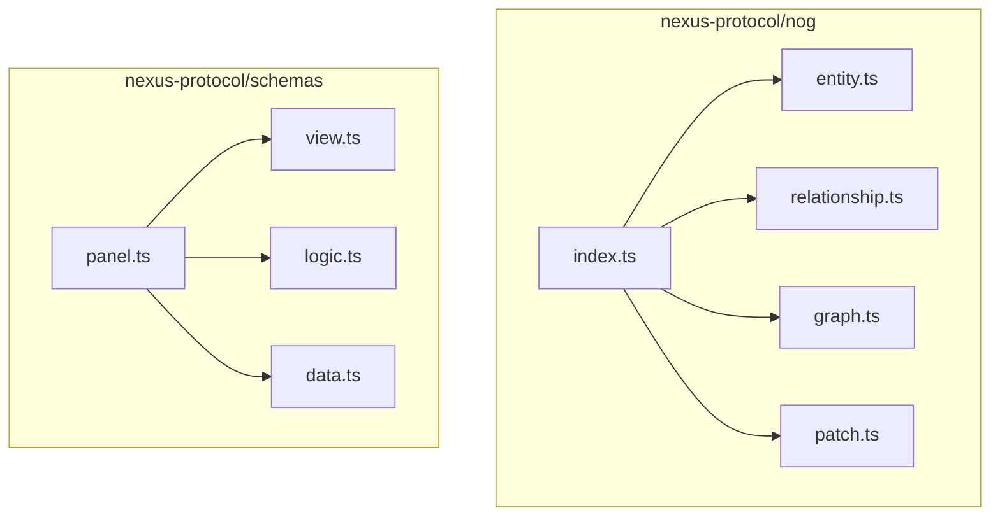
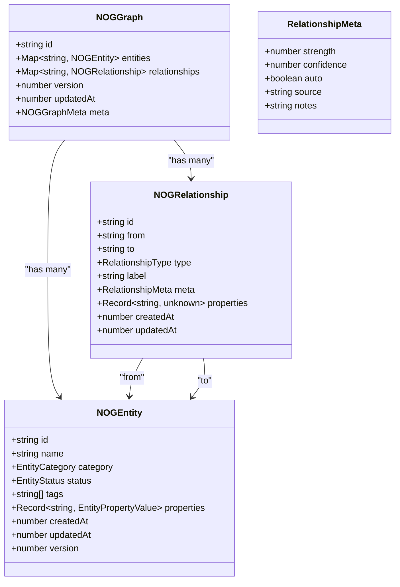
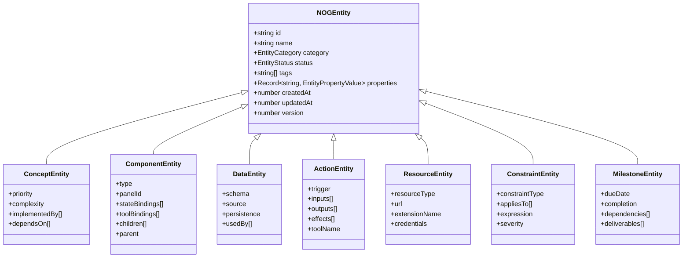
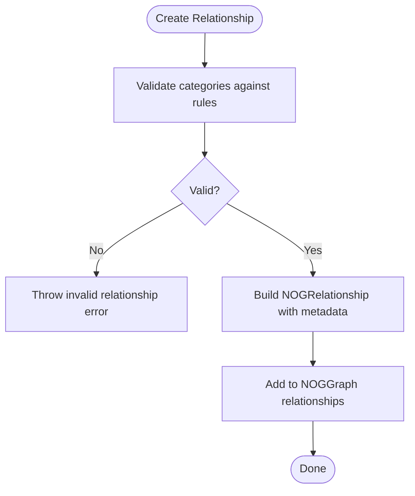
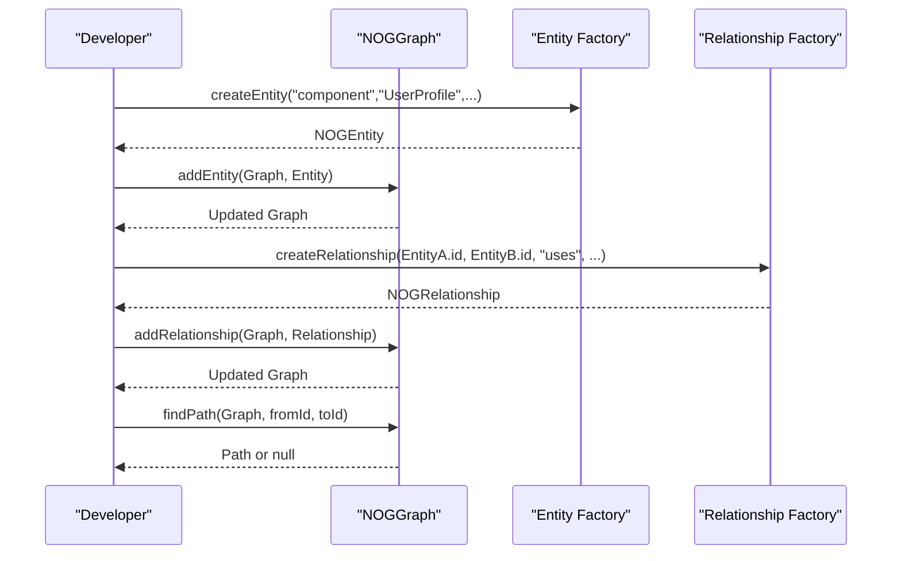
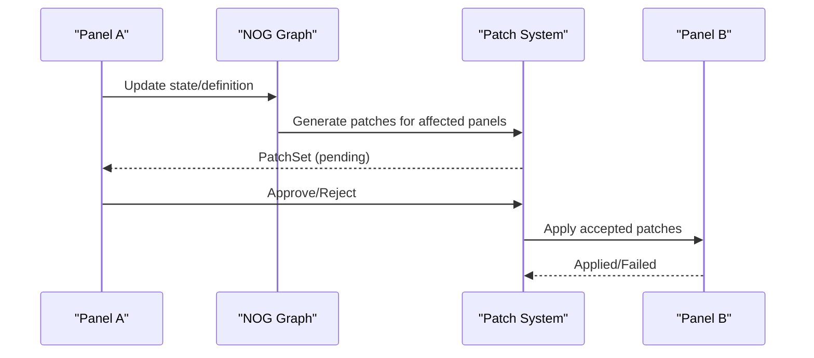
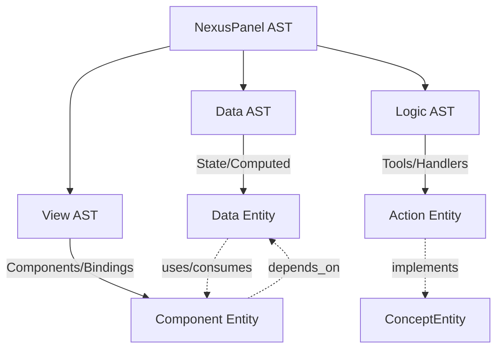
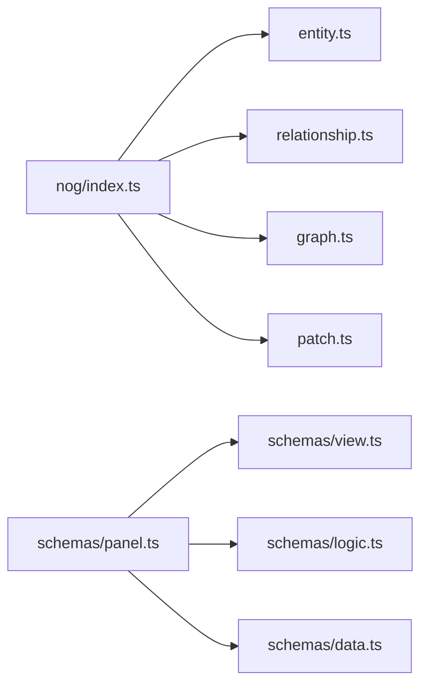

# Knowledge Graph (N-OG)

<cite>
**Referenced Files in This Document**
- [graph.ts](file://packages/nexus-protocol/src/nog/graph.ts)
- [entity.ts](file://packages/nexus-protocol/src/nog/entity.ts)
- [relationship.ts](file://packages/nexus-protocol/src/nog/relationship.ts)
- [index.ts](file://packages/nexus-protocol/src/nog/index.ts)
- [patch.ts](file://packages/nexus-protocol/src/nog/patch.ts)
- [README.md](file://packages/nexus-protocol/README.md)
- [panel.ts](file://packages/nexus-protocol/src/schemas/panel.ts)
- [view.ts](file://packages/nexus-protocol/src/schemas/view.ts)
- [logic.ts](file://packages/nexus-protocol/src/schemas/logic.ts)
- [data.ts](file://packages/nexus-protocol/src/schemas/data.ts)
- [01_protocol_spec.md](file://docs/01_protocol_spec.md)
- [03_state_engine_spec.md](file://docs/03_state_engine_spec.md)
</cite>

## Table of Contents
1. [Introduction](#introduction)
2. [Project Structure](#project-structure)
3. [Core Components](#core-components)
4. [Architecture Overview](#architecture-overview)
5. [Detailed Component Analysis](#detailed-component-analysis)
6. [Dependency Analysis](#dependency-analysis)
7. [Performance Considerations](#performance-considerations)
8. [Troubleshooting Guide](#troubleshooting-guide)
9. [Conclusion](#conclusion)
10. [Appendices](#appendices)

## Introduction
This document provides comprehensive data model documentation for the Nexus Object Graph (N-OG). The N-OG is the “Runtime Semantic Truth” of a project, capturing the semantic structure across all panels in a workspace. It models concepts, components, data, actions, and other semantic categories as entities, and expresses relationships such as depends_on, implements, and produces. The graph enables AI agents to understand context, reason about panel interdependencies, and assess the impact of changes through explicit synchronization and patch workflows.

## Project Structure
The N-OG lives in the protocol package under the nog module. It is complemented by validation schemas for panels, views, logic, and data, which inform how panels are structured and how their semantics map into the knowledge graph.

**Diagram sources**
- [index.ts](file://packages/nexus-protocol/src/nog/index.ts#L1-L129)
- [entity.ts](file://packages/nexus-protocol/src/nog/entity.ts#L1-L327)
- [relationship.ts](file://packages/nexus-protocol/src/nog/relationship.ts#L1-L321)
- [graph.ts](file://packages/nexus-protocol/src/nog/graph.ts#L1-L446)
- [patch.ts](file://packages/nexus-protocol/src/nog/patch.ts#L1-L473)
- [panel.ts](file://packages/nexus-protocol/src/schemas/panel.ts#L1-L275)
- [view.ts](file://packages/nexus-protocol/src/schemas/view.ts#L1-L359)
- [logic.ts](file://packages/nexus-protocol/src/schemas/logic.ts#L1-L283)
- [data.ts](file://packages/nexus-protocol/src/schemas/data.ts#L1-L198)

**Section sources**
- [README.md](file://packages/nexus-protocol/README.md#L1-L335)
- [index.ts](file://packages/nexus-protocol/src/nog/index.ts#L1-L129)

## Core Components
- NOGGraph: The central graph structure containing entities, relationships, metadata, versioning, and timestamps.
- NOGEntity: A semantic entity with category, status, tags, properties, and lifecycle fields.
- NOGRelationship: A directed edge between entities with type, metadata, and optional custom properties.
- NOGGraph operations: Creation, serialization/deserialization, entity and relationship CRUD, queries, pathfinding, and statistics.
- Patch system: Explicit sync workflow representing changes to the graph across panels.

**Section sources**
- [graph.ts](file://packages/nexus-protocol/src/nog/graph.ts#L1-L446)
- [entity.ts](file://packages/nexus-protocol/src/nog/entity.ts#L1-L327)
- [relationship.ts](file://packages/nexus-protocol/src/nog/relationship.ts#L1-L321)
- [patch.ts](file://packages/nexus-protocol/src/nog/patch.ts#L1-L473)

## Architecture Overview
The N-OG architecture centers around a typed, immutable graph with deterministic operations. Panels (Data, Logic, View) are validated and transformed into semantic entities and relationships. The graph supports:
- Entity categorization and specialized properties
- Relationship typing with directionality and inverse rules
- Graph queries (by category, tag, panel, connected components)
- Pathfinding and impact analysis
- Serialization and versioning for distributed synchronization
- Patch-based explicit sync workflow

**Diagram sources**
- [graph.ts](file://packages/nexus-protocol/src/nog/graph.ts#L1-L120)
- [entity.ts](file://packages/nexus-protocol/src/nog/entity.ts#L1-L120)
- [relationship.ts](file://packages/nexus-protocol/src/nog/relationship.ts#L1-L125)

## Detailed Component Analysis

### Entity Model
- Categories: concept, component, data, action, resource, constraint, milestone, custom.
- Status: draft, active, deprecated, archived.
- Properties: free-form record plus EntityRef arrays for linking to other entities.
- Specialized entities:
  - Concept: priorities, complexity, implementedBy, dependsOn
  - Component: type, panelId, stateBindings, toolBindings, children, parent
  - Data: schema, source, persistence, usedBy
  - Action: trigger, inputs, outputs, effects, toolName
  - Resource: resourceType, url, extensionName, credentials
  - Constraint: constraintType, appliesTo, expression, severity
  - Milestone: dueDate, completion, dependencies, deliverables

**Diagram sources**
- [entity.ts](file://packages/nexus-protocol/src/nog/entity.ts#L1-L228)

**Section sources**
- [entity.ts](file://packages/nexus-protocol/src/nog/entity.ts#L1-L327)

### Relationship Model
- Relationship types include structural (contains, part_of, extends, implements), dependencies (depends_on, required_by, uses, used_by), data flow (produces, consumes, transforms), associations (related_to, similar_to, conflicts_with), temporal (precedes, follows, triggers), and custom.
- Metadata supports strength/confidence, auto-generation flag, source, and notes.
- Relationship rules define valid category combinations and inverse relationships.

**Diagram sources**
- [relationship.ts](file://packages/nexus-protocol/src/nog/relationship.ts#L1-L180)
- [relationship.ts](file://packages/nexus-protocol/src/nog/relationship.ts#L181-L321)

**Section sources**
- [relationship.ts](file://packages/nexus-protocol/src/nog/relationship.ts#L1-L321)

### NOGGraph Interface and Operations
- Construction: createNOGGraph initializes an empty graph with metadata and version.
- Serialization: serializeNOGGraph converts to JSON; deserializeNOGGraph reconstructs from JSON.
- Mutation: addEntity, removeEntity, updateEntityInGraph, addRelationship, removeRelationship.
- Queries: findEntitiesByCategory, findEntitiesByTag, findEntitiesByPanel, getEntityWithRelationships, findConnectedEntities (BFS), findPath (BFS).
- Statistics: calculateGraphStats computes counts, averages, and orphaned entities.

**Diagram sources**
- [graph.ts](file://packages/nexus-protocol/src/nog/graph.ts#L107-L153)
- [graph.ts](file://packages/nexus-protocol/src/nog/graph.ts#L162-L256)
- [graph.ts](file://packages/nexus-protocol/src/nog/graph.ts#L262-L390)
- [entity.ts](file://packages/nexus-protocol/src/nog/entity.ts#L265-L327)
- [relationship.ts](file://packages/nexus-protocol/src/nog/relationship.ts#L186-L245)

**Section sources**
- [graph.ts](file://packages/nexus-protocol/src/nog/graph.ts#L1-L446)
- [README.md](file://packages/nexus-protocol/README.md#L169-L205)

### Patch System and Explicit Sync
- Patches represent atomic changes to entities, relationships, or view-level diffs.
- PatchSet groups related patches across panels with status tracking.
- Approval workflow: pending -> approved/rejected -> applied/failed.
- Integrates with the graph to propose and apply changes across panels.

**Diagram sources**
- [patch.ts](file://packages/nexus-protocol/src/nog/patch.ts#L1-L242)
- [patch.ts](file://packages/nexus-protocol/src/nog/patch.ts#L243-L473)
- [README.md](file://packages/nexus-protocol/README.md#L206-L231)

**Section sources**
- [patch.ts](file://packages/nexus-protocol/src/nog/patch.ts#L1-L473)
- [README.md](file://packages/nexus-protocol/README.md#L206-L231)

### Panel Semantics and Mapping to N-OG
Panels combine Data, Logic, and View namespaces. Cross-namespace references are validated to ensure correctness. These semantics map into N-OG entities and relationships:
- Data nodes (state/computed) become data entities.
- Logic tools and handlers become action entities.
- View components and bindings become component entities.
- Cross-references drive relationship creation (uses, depends_on, implements).

**Diagram sources**
- [panel.ts](file://packages/nexus-protocol/src/schemas/panel.ts#L1-L120)
- [view.ts](file://packages/nexus-protocol/src/schemas/view.ts#L220-L359)
- [logic.ts](file://packages/nexus-protocol/src/schemas/logic.ts#L1-L170)
- [data.ts](file://packages/nexus-protocol/src/schemas/data.ts#L1-L120)
- [entity.ts](file://packages/nexus-protocol/src/nog/entity.ts#L1-L228)

**Section sources**
- [panel.ts](file://packages/nexus-protocol/src/schemas/panel.ts#L1-L275)
- [view.ts](file://packages/nexus-protocol/src/schemas/view.ts#L1-L359)
- [logic.ts](file://packages/nexus-protocol/src/schemas/logic.ts#L1-L283)
- [data.ts](file://packages/nexus-protocol/src/schemas/data.ts#L1-L198)
- [entity.ts](file://packages/nexus-protocol/src/nog/entity.ts#L1-L228)

## Dependency Analysis
- NOG module exports:
  - Entities and relationships: types and factory/query helpers
  - Graph: construction, mutation, queries, stats
  - Patches: patch types, sets, and workflow operations
- Panel schemas depend on view, logic, and data schemas for cross-validation.

**Diagram sources**
- [index.ts](file://packages/nexus-protocol/src/nog/index.ts#L1-L129)
- [panel.ts](file://packages/nexus-protocol/src/schemas/panel.ts#L1-L120)

**Section sources**
- [index.ts](file://packages/nexus-protocol/src/nog/index.ts#L1-L129)
- [panel.ts](file://packages/nexus-protocol/src/schemas/panel.ts#L1-L120)

## Performance Considerations
- Graph representation:
  - Entities and relationships are stored in maps for O(1) insertion and lookup.
  - Queries iterate over collections; complexity scales with entity count for filters and with relationship count for adjacency scans.
- Pathfinding and connected components:
  - Breadth-first search is used; complexity is proportional to explored nodes and edges up to maxDepth.
- Recommendations:
  - Index frequently queried attributes (e.g., tags, sourcePanel) in-memory for faster filtering.
  - Cache results of expensive queries (e.g., connected components) when panels are static.
  - Limit maxDepth in pathfinding and connected searches for large graphs.
  - Prefer batched updates and incremental rebuilds when adding/removing many entities/relationships.
  - Use snapshots for read-heavy workloads and apply writes atomically.

[No sources needed since this section provides general guidance]

## Troubleshooting Guide
- Adding relationships fails:
  - Ensure both from and to entities exist in the graph before adding a relationship.
  - Check relationship validity against category rules.
- Query returns unexpected results:
  - Confirm entity categories and tags are set correctly.
  - Verify sourcePanel filtering aligns with where entities were created.
- Pathfinding yields null:
  - Increase maxDepth or adjust relationship types to reflect actual connections.
  - Validate that relationships are directed appropriately and not missing inverses.
- Patch application issues:
  - Review patch status transitions and reasons for failures.
  - Ensure patch sets are approved before applying.

**Section sources**
- [graph.ts](file://packages/nexus-protocol/src/nog/graph.ts#L224-L256)
- [relationship.ts](file://packages/nexus-protocol/src/nog/relationship.ts#L247-L266)
- [patch.ts](file://packages/nexus-protocol/src/nog/patch.ts#L388-L457)

## Conclusion
The N-OG provides a robust, typed semantic model for panels and their interdependencies. Its entity and relationship types, combined with graph operations and the explicit sync patch workflow, enable AI agents to reason about context and assess change impact. By leveraging validation schemas and careful indexing, teams can scale the knowledge graph while maintaining correctness and performance.

[No sources needed since this section summarizes without analyzing specific files]

## Appendices

### Example Workflows and References
- Constructing and traversing the graph:
  - See the quick-start example in the package README for creating entities, relationships, and querying paths.
- Protocol specification references:
  - Graph operations and types are documented in the protocol spec.

**Section sources**
- [README.md](file://packages/nexus-protocol/README.md#L169-L205)
- [01_protocol_spec.md](file://docs/01_protocol_spec.md#L1186-L1213)