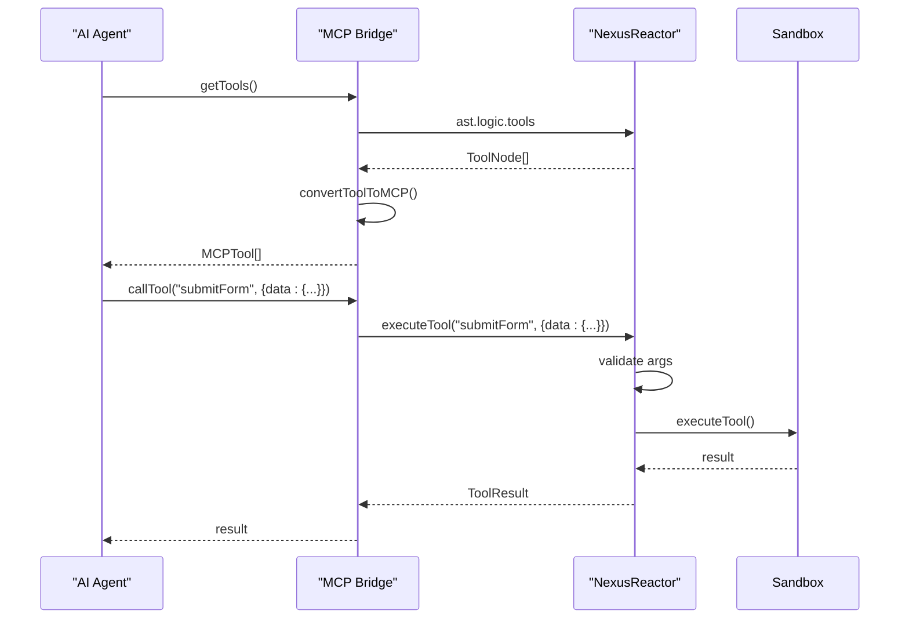
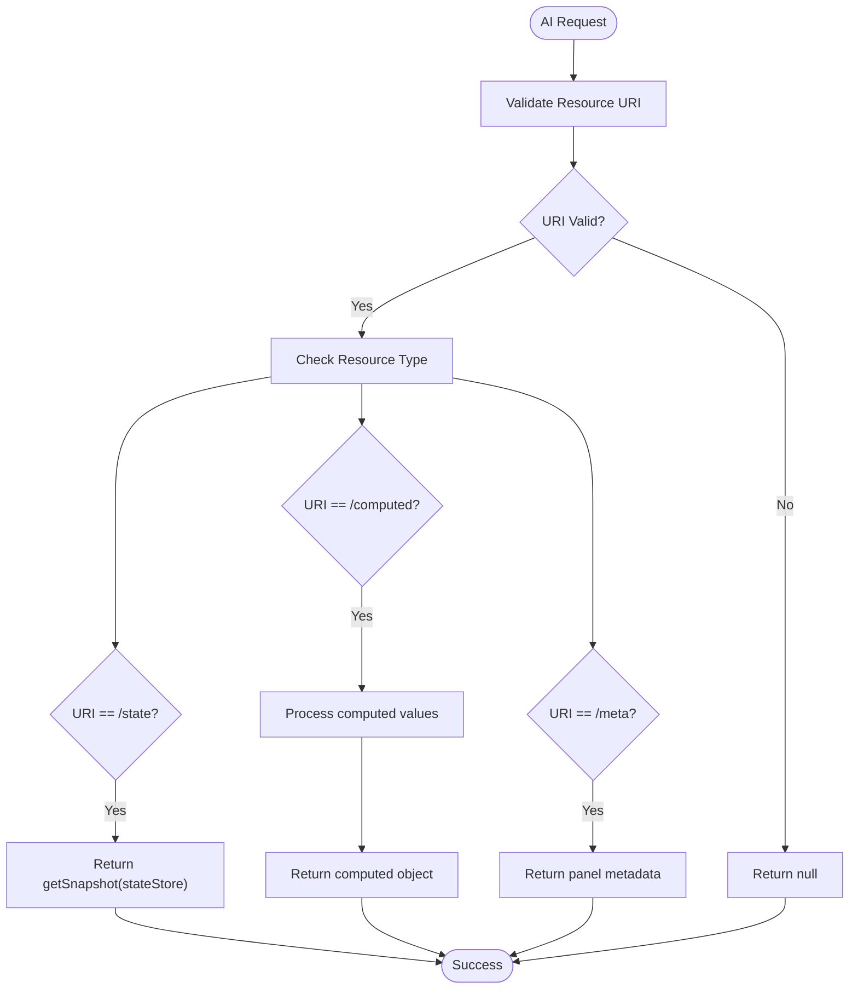
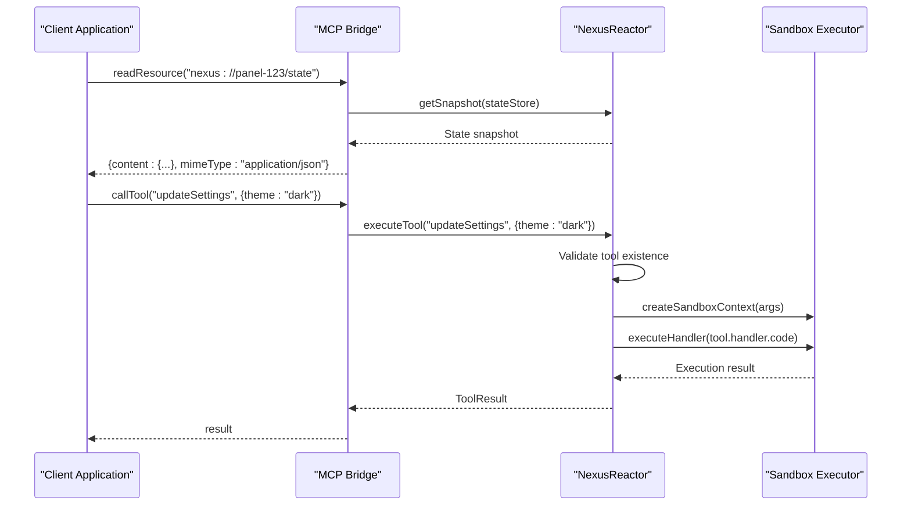
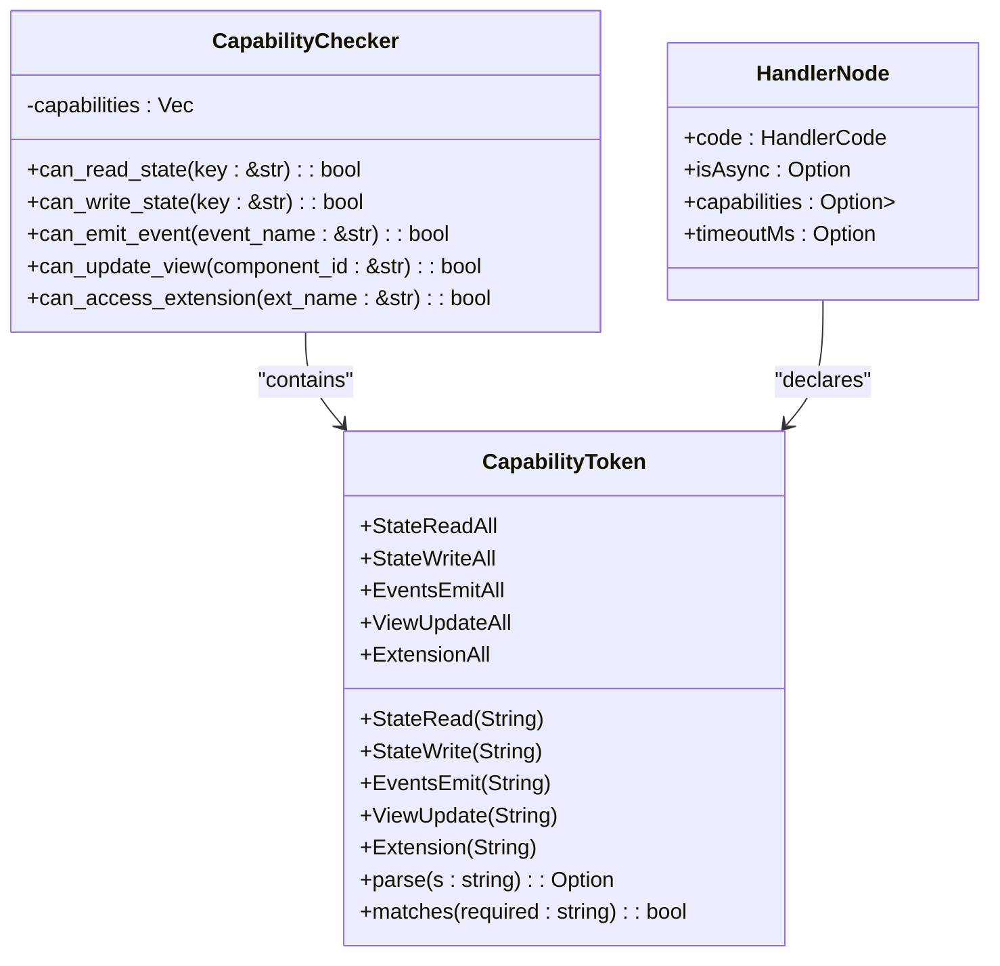
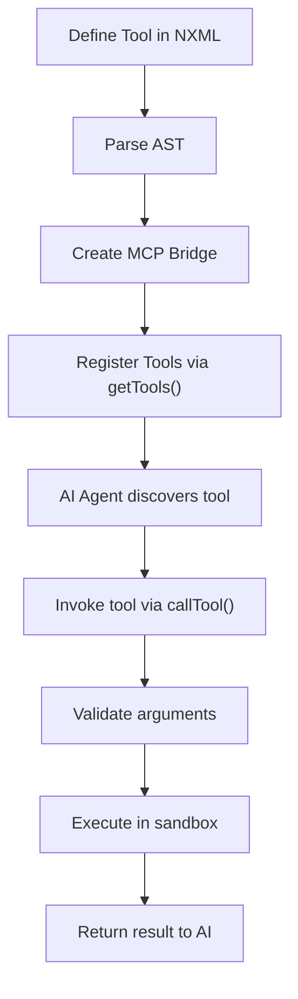
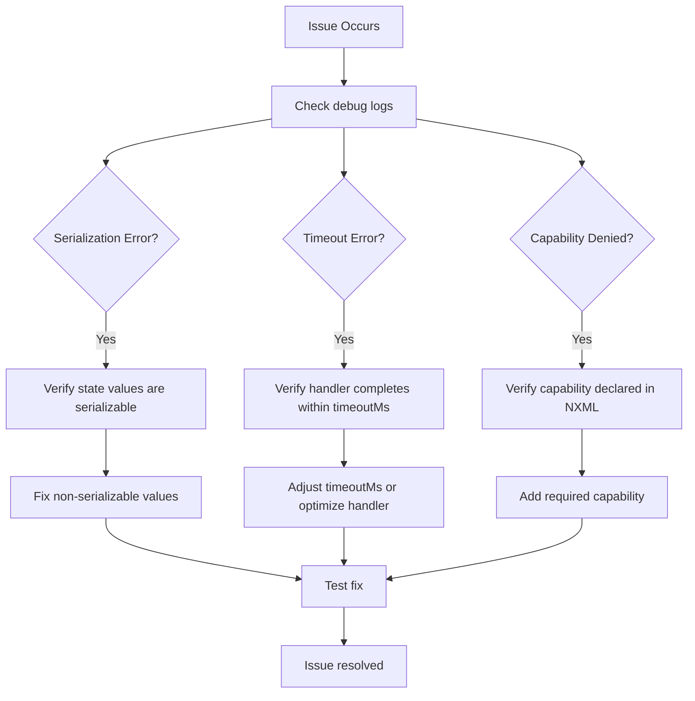

# MCP Integration

<cite>
**Referenced Files in This Document**   
- [bridge.ts](file://packages/nexus-reactor/src/mcp/bridge.ts)
- [tools.ts](file://packages/nexus-reactor/src/mcp/tools.ts)
- [resources.ts](file://packages/nexus-reactor/src/mcp/resources.ts)
- [reactor.ts](file://packages/nexus-reactor/src/reactor.ts)
- [types.ts](file://packages/nexus-reactor/src/core/types.ts)
- [capability.rs](file://runtime/nexus-wasm-bridge/src/capability.rs)
- [executor.ts](file://packages/nexus-reactor/src/sandbox/executor.ts)
</cite>

## Table of Contents
1. [Introduction](#introduction)
2. [MCP Bridge Architecture](#mcp-bridge-architecture)
3. [Tool Registration and Exposure](#tool-registration-and-exposure)
4. [Resource Access and State Exposure](#resource-access-and-state-exposure)
5. [Request/Response Lifecycle](#requestresponse-lifecycle)
6. [Security and Capability-Based Access Control](#security-and-capability-based-access-control)
7. [Extending MCP with Custom Tools](#extending-mcp-with-custom-tools)
8. [Debugging and Common Issues](#debugging-and-common-issues)

## Introduction
The Model Context Protocol (MCP) integration enables bidirectional communication between Nexus panels and external Large Language Model (LLM) systems. The MCP bridge serves as the interface that exposes panel state, computed values, and executable tools to AI agents through standardized resources and tool definitions. This documentation details the implementation of the MCP bridge, its integration with the Nexus Reactor, and the mechanisms for secure, capability-gated execution of AI-initiated actions.

## MCP Bridge Architecture

The MCP bridge is implemented as a TypeScript interface and factory function within the `nexus-reactor` package. It is initialized during the Reactor instantiation and provides a standardized API for external AI systems to interact with the panel.

```mermaid
classDiagram
class MCPBridge {
+getTools() : MCPTool[]
+getResources() : MCPResource[]
+readResource(uri : string) : { content : unknown; mimeType : string } | null
+callTool(name : string, args? : Record<string, unknown>) : Promise<unknown>
}
class NexusReactor {
-ast : NexusPanelAST
-state : StateStore
-sandbox : SandboxExecutor
-mcp : MCPBridge
+executeTool(name : string, args : Record<string, unknown>) : Promise<ToolResult>
}
MCPBridge --> NexusReactor : "uses executeTool"
NexusReactor --> MCPBridge : "creates"
```

**Diagram sources**
- [bridge.ts](file://packages/nexus-reactor/src/mcp/bridge.ts#L14-L19)
- [reactor.ts](file://packages/nexus-reactor/src/reactor.ts#L29-L34)

**Section sources**
- [bridge.ts](file://packages/nexus-reactor/src/mcp/bridge.ts#L1-L167)
- [reactor.ts](file://packages/nexus-reactor/src/reactor.ts#L29-L91)

## Tool Registration and Exposure

Tools defined in the NXML LogicAST are automatically exposed to AI agents through the MCP bridge. The `getTools()` method maps each `ToolNode` to an `MCPTool` with a JSON Schema describing its input parameters.



**Diagram sources**
- [bridge.ts](file://packages/nexus-reactor/src/mcp/bridge.ts#L27-L29)
- [tools.ts](file://packages/nexus-reactor/src/mcp/tools.ts#L11-L32)
- [reactor.ts](file://packages/nexus-reactor/src/reactor.ts#L147-L180)

**Section sources**
- [bridge.ts](file://packages/nexus-reactor/src/mcp/bridge.ts#L27-L29)
- [tools.ts](file://packages/nexus-reactor/src/mcp/tools.ts#L11-L32)
- [reactor.ts](file://packages/nexus-reactor/src/reactor.ts#L147-L180)

## Resource Access and State Exposure

The MCP bridge exposes panel state and metadata as standardized resources accessible via URI. These resources allow AI agents to inspect the current execution context before taking actions.



**Diagram sources**
- [bridge.ts](file://packages/nexus-reactor/src/mcp/bridge.ts#L47-L70)
- [resources.ts](file://packages/nexus-reactor/src/mcp/resources.ts#L13-L31)
- [state/store.ts](file://packages/nexus-reactor/src/state/store.ts#L15-L25)

**Section sources**
- [bridge.ts](file://packages/nexus-reactor/src/mcp/bridge.ts#L47-L70)
- [resources.ts](file://packages/nexus-reactor/src/mcp/resources.ts#L13-L31)

## Request/Response Lifecycle

The request/response lifecycle between the client, MCP bridge, and AI system follows a standardized flow for tool invocation and resource access.



**Diagram sources**
- [bridge.ts](file://packages/nexus-reactor/src/mcp/bridge.ts#L73-L76)
- [reactor.ts](file://packages/nexus-reactor/src/reactor.ts#L147-L180)
- [executor.ts](file://packages/nexus-reactor/src/sandbox/executor.ts#L24-L67)

**Section sources**
- [bridge.ts](file://packages/nexus-reactor/src/mcp/bridge.ts#L73-L76)
- [reactor.ts](file://packages/nexus-reactor/src/reactor.ts#L147-L180)

## Security and Capability-Based Access Control

Security is enforced through a capability-based access control system that restricts what operations a tool handler can perform. Capabilities must be explicitly declared in the NXML definition and are enforced at runtime.



**Diagram sources**
- [capability.rs](file://runtime/nexus-wasm-bridge/src/capability.rs#L10-L33)
- [types.ts](file://packages/nexus-reactor/src/core/types.ts#L169-L180)
- [executor.ts](file://packages/nexus-reactor/src/sandbox/executor.ts#L6-L7)

**Section sources**
- [capability.rs](file://runtime/nexus-wasm-bridge/src/capability.rs#L1-L384)
- [types.ts](file://packages/nexus-reactor/src/core/types.ts#L169-L180)

## Extending MCP with Custom Tools

Custom tools can be added to a panel by defining them in the NXML LogicAST. The MCP bridge automatically exposes these tools with their input schemas and handles execution through the Reactor's execution pipeline.



**Diagram sources**
- [bridge.ts](file://packages/nexus-reactor/src/mcp/bridge.ts#L27-L29)
- [tools.ts](file://packages/nexus-reactor/src/mcp/tools.ts#L11-L32)
- [reactor.ts](file://packages/nexus-reactor/src/reactor.ts#L147-L180)

**Section sources**
- [bridge.ts](file://packages/nexus-reactor/src/mcp/bridge.ts#L27-L29)
- [tools.ts](file://packages/nexus-reactor/src/mcp/tools.ts#L11-L32)

## Debugging and Common Issues

Common issues in MCP integration include context serialization errors, tool timeout handling, and capability permission denials. The system provides debugging utilities to diagnose these issues.



**Diagram sources**
- [bridge.ts](file://packages/nexus-reactor/src/mcp/bridge.ts#L12-L13)
- [executor.ts](file://packages/nexus-reactor/src/sandbox/executor.ts#L6-L7)
- [debug.ts](file://packages/nexus-reactor/src/utils/debug.ts#L1-L10)

**Section sources**
- [bridge.ts](file://packages/nexus-reactor/src/mcp/bridge.ts#L12-L13)
- [executor.ts](file://packages/nexus-reactor/src/sandbox/executor.ts#L30-L34)
- [debug.ts](file://packages/nexus-reactor/src/utils/debug.ts#L1-L20)