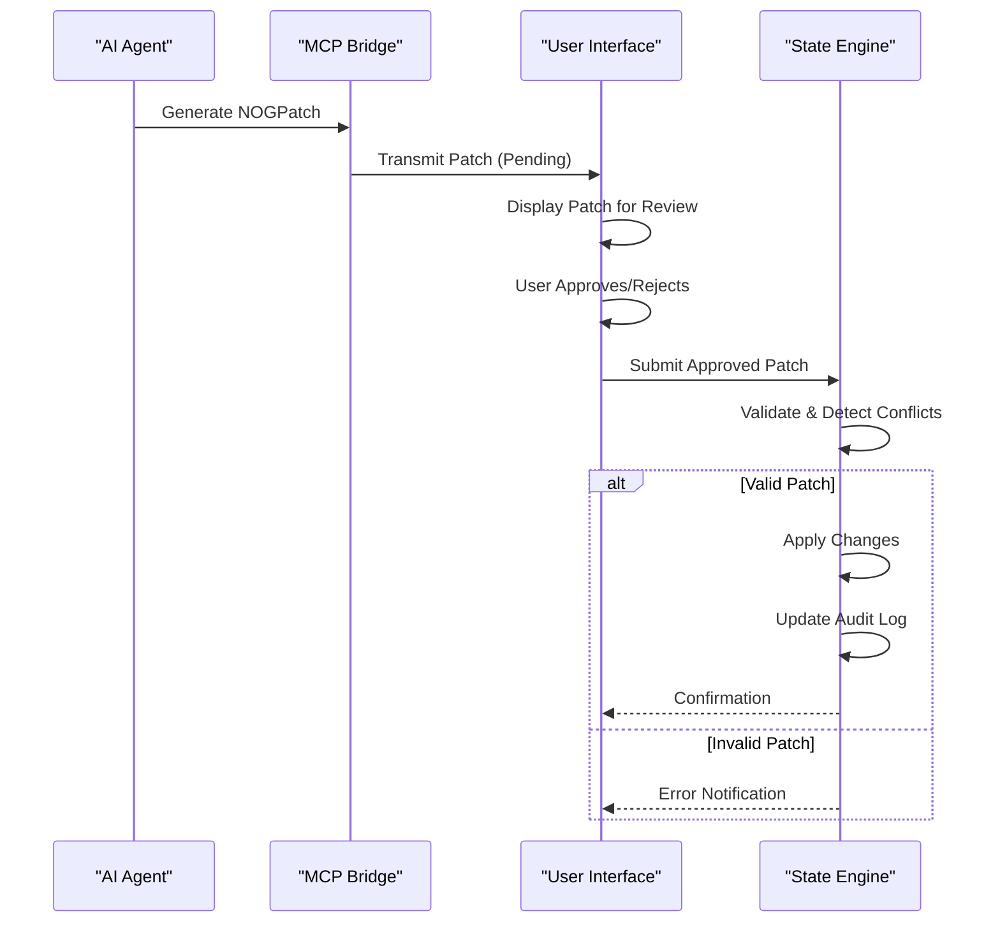
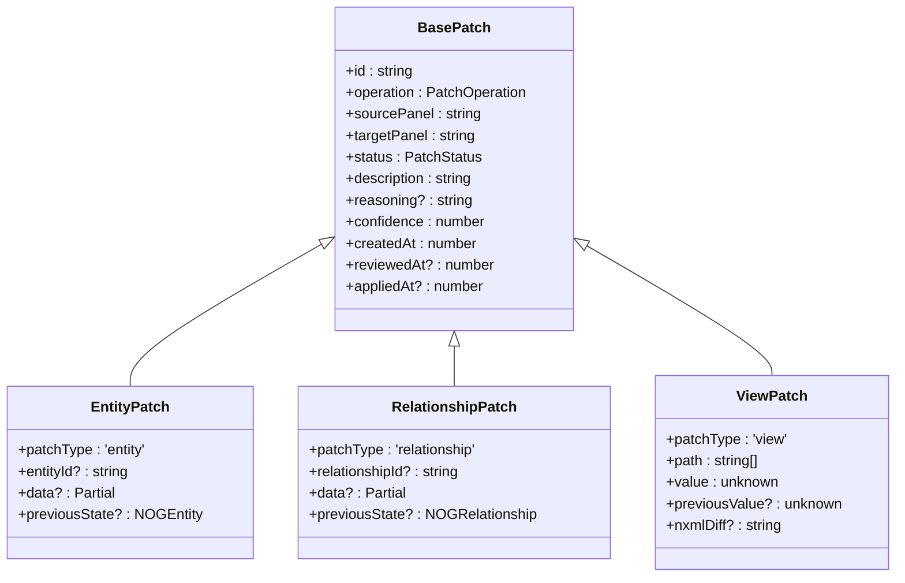
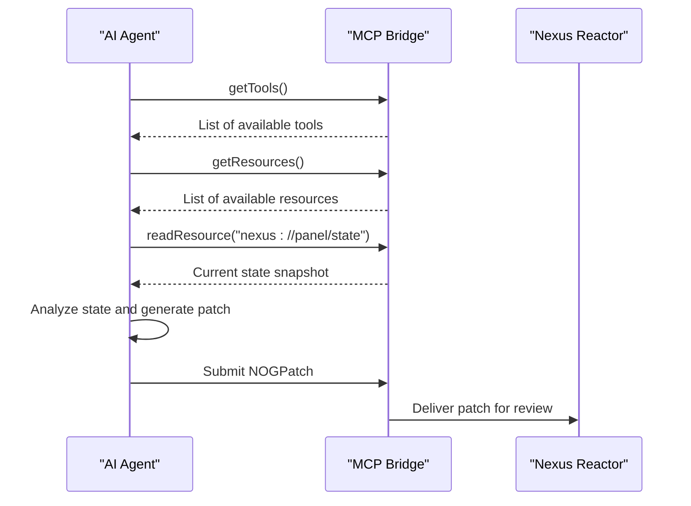
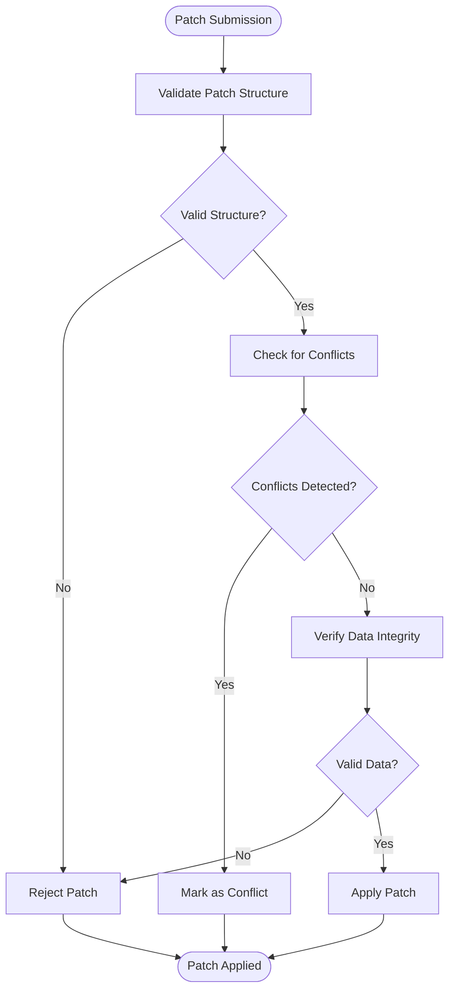
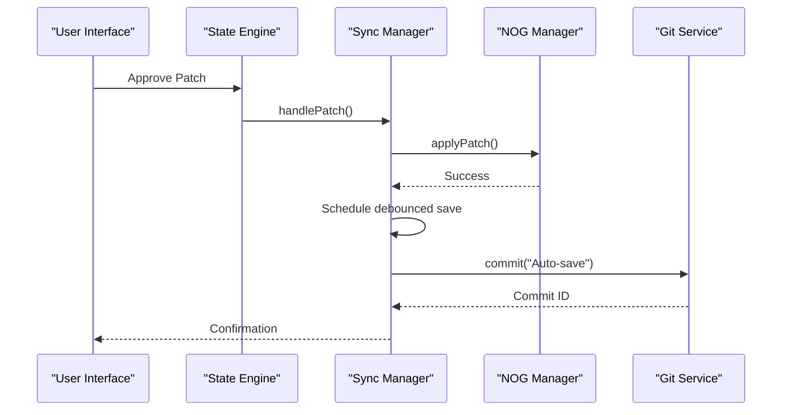

# Patch Proposals

<cite>
**Referenced Files in This Document**   
- [patch.ts](file://packages/nexus-protocol/src/nog/patch.ts)
- [entity.ts](file://packages/nexus-protocol/src/nog/entity.ts)
- [relationship.ts](file://packages/nexus-protocol/src/nog/relationship.ts)
- [bridge.ts](file://packages/nexus-reactor/src/mcp/bridge.ts)
- [tools.ts](file://packages/nexus-reactor/src/mcp/tools.ts)
- [types.ts](file://packages/nexus-reactor/src/core/types.ts)
- [store.ts](file://packages/nexus-reactor/src/state/store.ts)
- [parser.ts](file://packages/nexus-reactor/src/parser/parser.ts)
- [01_protocol_spec.md](file://docs/01_protocol_spec.md)
- [PATCHES_APPLIED.md](file://docs/PATCHES_APPLIED.md)
- [03_state_engine_spec.md](file://docs/03_state_engine_spec.md)
</cite>

## Table of Contents
1. [Introduction](#introduction)
2. [AI-Driven Patch Proposal Workflow](#ai-driven-patch-proposal-workflow)
3. [NOGPatch Data Structure](#nogpatch-data-structure)
4. [Patch Serialization and MCP Transmission](#patch-serialization-and-mcp-transmission)
5. [Real-World Patch Scenarios](#real-world-patch-scenarios)
6. [Validation and Conflict Detection](#validation-and-conflict-detection)
7. [User Interface for Patch Review](#user-interface-for-patch-review)
8. [Patch Application and Rollback](#patch-application-and-rollback)
9. [Audit Logging and Patch History](#audit-logging-and-patch-history)
10. [Best Practices for AI Agents](#best-practices-for-ai-agents)
11. [Conclusion](#conclusion)

## Introduction

The Nexus platform employs an AI-driven patch proposal workflow to facilitate safe, transparent, and user-controlled modifications to the Nexus Object Graph (NOG). This workflow ensures that all changes, whether initiated by users or AI agents, undergo explicit review before application. The system is built around the NOGPatch data structure, which encapsulates proposed changes to entities, relationships, or view components. Patches are serialized and transmitted via the Model Context Protocol (MCP), presented to users for approval, and only applied after explicit consent. This document provides a comprehensive overview of the entire patch lifecycle, from suggestion generation to final application, including the underlying data structures, validation mechanisms, user interface components, and best practices for designing AI agents that generate safe and effective patches.

**Section sources**
- [01_protocol_spec.md](file://docs/01_protocol_spec.md#L1214-L1274)
- [PATCHES_APPLIED.md](file://docs/PATCHES_APPLIED.md#L1-L242)

## AI-Driven Patch Proposal Workflow

The AI-driven patch proposal workflow in Nexus is a multi-stage process designed to ensure that all changes to the system are safe, transparent, and under user control. The workflow begins when an AI agent, operating within the constraints of the Model Context Protocol (MCP), analyzes the current state of the Nexus Object Graph (NOG) and identifies potential improvements or necessary changes. The AI agent then generates a NOGPatch, which is a structured representation of the proposed modification. This patch is serialized and transmitted to the user interface via MCP, where it is presented to the user for review. The user can examine the proposed changes, including a detailed diff and the AI's reasoning, before deciding to approve or reject the patch. Once approved, the patch undergoes validation and conflict detection before being applied to the NOG. If the application is successful, the changes are persisted, and an audit log entry is created. This workflow ensures that AI agents can suggest improvements without compromising system stability or user autonomy.

**Diagram sources**
- [patch.ts](file://packages/nexus-protocol/src/nog/patch.ts#L1-L473)
- [bridge.ts](file://packages/nexus-reactor/src/mcp/bridge.ts#L1-L167)
- [03_state_engine_spec.md](file://docs/03_state_engine_spec.md#L44-L86)

## NOGPatch Data Structure

The NOGPatch data structure is the core component of the Nexus patch proposal system. It is a TypeScript interface that defines the format for all proposed changes to the Nexus Object Graph (NOG). The structure is designed to be flexible, supporting modifications to entities, relationships, and view components. A NOGPatch extends the BasePatch interface, which contains common properties such as a unique ID, operation type, source and target panels, status, description, AI-generated reasoning, confidence score, and timestamps. There are three primary variants of NOGPatch: EntityPatch, RelationshipPatch, and ViewPatch. EntityPatch is used to modify NOGEntity objects, containing fields for the target entity ID, new data, and previous state for undo operations. RelationshipPatch serves a similar purpose for NOGRelationship objects. ViewPatch is used for changes to the NXML view layer, containing a JSON path to the modified element, the new value, and an optional NXML diff for code review. This structure ensures that all patches are self-contained and can be safely reviewed and applied.

**Diagram sources**
- [patch.ts](file://packages/nexus-protocol/src/nog/patch.ts#L52-L183)
- [entity.ts](file://packages/nexus-protocol/src/nog/entity.ts#L38-L93)
- [relationship.ts](file://packages/nexus-protocol/src/nog/relationship.ts#L80-L125)

**Section sources**
- [patch.ts](file://packages/nexus-protocol/src/nog/patch.ts#L1-L473)
- [entity.ts](file://packages/nexus-protocol/src/nog/entity.ts#L1-L327)
- [relationship.ts](file://packages/nexus-protocol/src/nog/relationship.ts#L1-L321)

## Patch Serialization and MCP Transmission

Patches are serialized and transmitted via the Model Context Protocol (MCP), which serves as the communication layer between AI agents and the Nexus runtime. The MCP bridge, implemented in the `createMCPBridge` function, exposes panel tools and state to AI agents, allowing them to generate and submit patches. When an AI agent creates a patch, it is serialized into a JSON format that can be transmitted over the MCP. The `getTools()` and `getResources()` methods of the MCP bridge provide the AI with the necessary context to understand the current state of the system and the available actions. The `readResource()` method allows the AI to inspect the current state and computed values, while the `callTool()` method enables it to execute actions that may result in patch generation. Once a patch is created, it is sent to the user interface through the MCP, where it is deserialized and presented to the user for review. This process ensures that patches are generated in a secure and controlled environment, with all necessary context available to the AI agent.

**Diagram sources**
- [bridge.ts](file://packages/nexus-reactor/src/mcp/bridge.ts#L14-L77)
- [tools.ts](file://packages/nexus-reactor/src/mcp/tools.ts#L12-L33)
- [types.ts](file://packages/nexus-reactor/src/core/types.ts#L335-L339)

**Section sources**
- [bridge.ts](file://packages/nexus-reactor/src/mcp/bridge.ts#L1-L167)
- [tools.ts](file://packages/nexus-reactor/src/mcp/tools.ts#L1-L170)

## Real-World Patch Scenarios

The Nexus patch system is designed to handle a variety of real-world scenarios, from simple component refactoring to complex dependency updates. One common scenario is component refactoring, where an AI agent identifies a UI component that can be improved for performance or usability. The agent generates an EntityPatch to update the component's properties, such as changing its layout strategy or adding new state bindings. Another scenario is dependency updates, where the AI detects that a panel is using an outdated version of a library or service. In this case, the agent creates a RelationshipPatch to update the relationship between the panel and the dependency, specifying the new version. A third scenario involves schema migrations, where changes to a data entity require corresponding updates to all dependent components. The AI generates a PatchSet containing multiple EntityPatches and ViewPatches to ensure that all affected parts of the system are updated consistently. These scenarios demonstrate the flexibility and power of the patch system in maintaining a coherent and up-to-date project state.

**Section sources**
- [PATCHES_APPLIED.md](file://docs/PATCHES_APPLIED.md#L13-L123)
- [patch.ts](file://packages/nexus-protocol/src/nog/patch.ts#L364-L382)

## Validation and Conflict Detection

Before a patch is applied, it undergoes rigorous validation and conflict detection to ensure system integrity. The validation process checks the patch against the current state of the NOG to verify that all referenced entities and relationships exist and that the proposed changes are valid. For example, when applying an EntityPatch, the system verifies that the target entity ID is valid and that the new data conforms to the entity's schema. Conflict detection is performed by comparing the patch's proposed changes with the current state of the target panel. If another user or process has modified the same entity or relationship since the patch was generated, a conflict is detected, and the patch is marked as having a 'conflict' status. The system also checks for logical inconsistencies, such as creating a relationship that violates the defined relationship rules. This comprehensive validation and conflict detection process ensures that only safe and consistent changes are applied to the system.

**Diagram sources**
- [patch.ts](file://packages/nexus-protocol/src/nog/patch.ts#L435-L456)
- [03_state_engine_spec.md](file://docs/03_state_engine_spec.md#L298-L320)

**Section sources**
- [patch.ts](file://packages/nexus-protocol/src/nog/patch.ts#L389-L456)
- [03_state_engine_spec.md](file://docs/03_state_engine_spec.md#L294-L331)

## User Interface for Patch Review

The user interface for patch review is designed to provide users with a clear and comprehensive view of proposed changes, enabling informed decision-making. When a patch is submitted, it is displayed in a dedicated review panel that shows the patch's description, AI-generated reasoning, confidence score, and a detailed diff of the changes. For EntityPatches and RelationshipPatches, the interface highlights the specific fields that are being modified, added, or removed. For ViewPatches, an NXML diff is displayed, showing the exact changes to the view structure. Users can approve or reject the patch with a single click, and their decision is immediately reflected in the patch's status. The interface also provides options to view the patch's history, including when it was created and reviewed, and to see any conflicts that were detected during validation. This user-friendly interface ensures that users remain in control of their system while benefiting from AI-driven suggestions.

**Section sources**
- [PATCHES_APPLIED.md](file://docs/PATCHES_APPLIED.md#L13-L123)
- [01_protocol_spec.md](file://docs/01_protocol_spec.md#L1266-L1273)

## Patch Application and Rollback

Once a patch is approved, it is applied to the target panel through a controlled and atomic process. The State Engine, acting as the coordinator, receives the approved patch and initiates the application sequence. The patch is first applied to the in-memory representation of the NOG, updating the relevant entities, relationships, or view components. This change is then propagated to the persistent storage through the Sync Manager, which uses a debounced save strategy to group multiple rapid changes into a single commit. If the application is successful, the patch's status is updated to 'applied', and the change is broadcast to all connected clients. In the event of a failure, the patch is marked as 'failed', and the system remains in its previous state. Rollback is achieved by applying a reverse patch, which restores the previous state of the modified components. This reverse patch is generated from the 'previousState' field in the original patch, ensuring that rollbacks are accurate and reliable.

**Diagram sources**
- [03_state_engine_spec.md](file://docs/03_state_engine_spec.md#L298-L331)
- [store.ts](file://packages/nexus-reactor/src/state/store.ts#L241-L245)

**Section sources**
- [03_state_engine_spec.md](file://docs/03_state_engine_spec.md#L294-L389)
- [store.ts](file://packages/nexus-reactor/src/state/store.ts#L1-L255)

## Audit Logging and Patch History

Nexus maintains a comprehensive audit log of all patch activities, providing a complete history of changes to the system. Each patch, regardless of its outcome, is recorded in the audit log with detailed metadata, including the patch ID, operation type, source and target panels, description, reasoning, confidence score, and all relevant timestamps. The log also records the user who approved or rejected the patch, if applicable. This information is stored in a dedicated audit trail that can be queried for troubleshooting, compliance, or historical analysis. The PATCHES_APPLIED.md document serves as a human-readable summary of significant patches that have been applied to the system, providing context and justification for major changes. This robust audit logging system ensures transparency and accountability, allowing users to understand the evolution of their project over time.

**Section sources**
- [PATCHES_APPLIED.md](file://docs/PATCHES_APPLIED.md#L1-L242)
- [patch.ts](file://packages/nexus-protocol/src/nog/patch.ts#L96-L106)

## Best Practices for AI Agents

Designing AI agents that generate safe, minimal, and well-documented patches is critical to the success of the Nexus platform. AI agents should follow several best practices to ensure their suggestions are beneficial and trustworthy. First, patches should be minimal, changing only what is necessary to achieve the desired outcome. This reduces the risk of unintended side effects and makes the changes easier to review. Second, AI agents should provide clear and concise reasoning for each patch, explaining why the change is needed and how it improves the system. This reasoning should be included in the patch's 'reasoning' field and presented to the user in the review interface. Third, AI agents should prioritize safety by thoroughly validating their proposed changes against the current state of the NOG and checking for potential conflicts. Finally, AI agents should be transparent about their confidence in each suggestion, using the 'confidence' field to indicate the level of certainty. By following these best practices, AI agents can become valuable collaborators in the development process, helping users build better systems with less effort.

**Section sources**
- [patch.ts](file://packages/nexus-protocol/src/nog/patch.ts#L86-L91)
- [01_protocol_spec.md](file://docs/01_protocol_spec.md#L1231-L1232)

## Conclusion

The AI-driven patch proposal workflow in Nexus represents a sophisticated and user-centric approach to system modification. By leveraging the NOGPatch data structure, the Model Context Protocol, and a robust validation and review process, the system enables AI agents to suggest improvements while maintaining user control and system integrity. The workflow is designed to be transparent, with every change documented and presented for user approval. This balance of automation and human oversight ensures that the system can evolve and improve over time without compromising stability or security. The comprehensive audit logging and rollback capabilities further enhance the system's reliability, providing a safety net for all modifications. As AI technology continues to advance, this workflow will serve as a foundation for increasingly intelligent and autonomous development assistants, empowering users to build complex systems with greater efficiency and confidence.