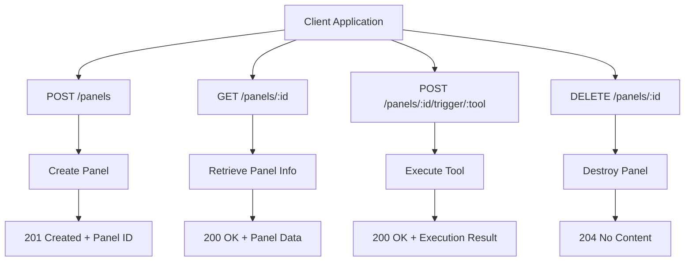
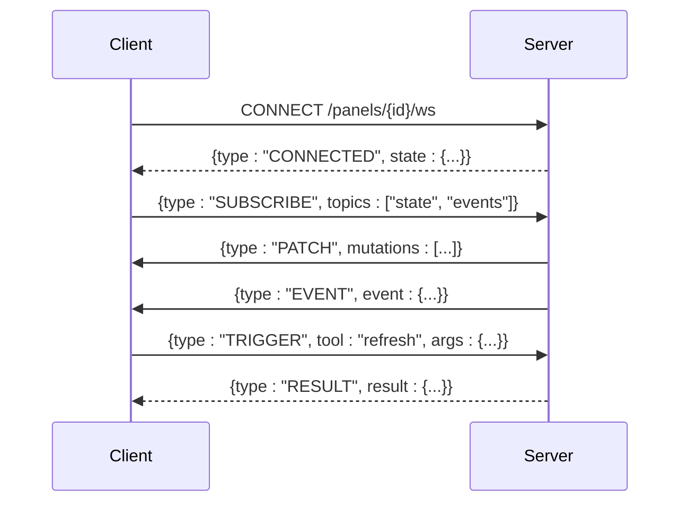
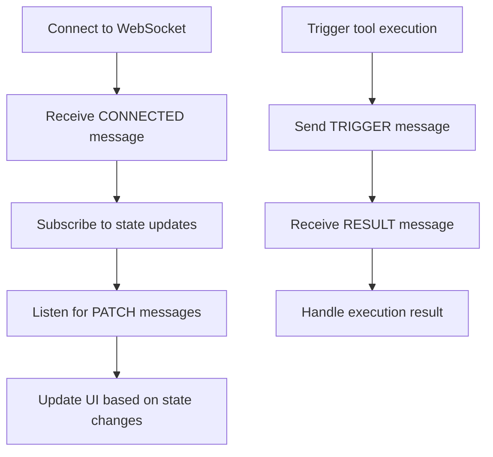
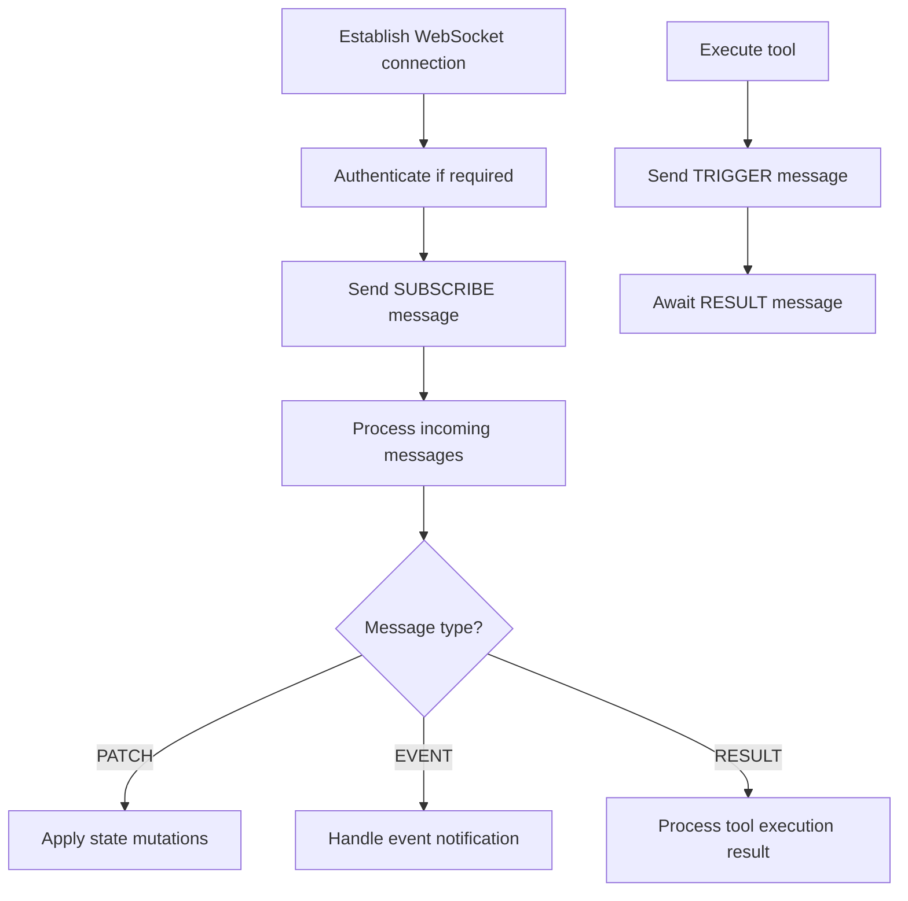

# APIs and Integration

<cite>
**Referenced Files in This Document**   
- [server.ts](file://runtime/workspace-kernel/src/server.ts)
- [config.ts](file://runtime/workspace-kernel/src/config.ts)
- [panel.ts](file://runtime/workspace-kernel/src/panel.ts)
- [bridge.ts](file://packages/nexus-reactor/src/mcp/bridge.ts)
- [types.ts](file://runtime/workspace-kernel/src/types.ts)
- [index.ts](file://packages/nexus-reactor/src/index.ts)
- [core/types.ts](file://packages/nexus-reactor/src/core/types.ts)
</cite>

## Table of Contents
1. [Introduction](#introduction)
2. [HTTP API](#http-api)
3. [WebSocket API](#websocket-api)
4. [MCP Interface](#mcp-interface)
5. [Client Implementation Examples](#client-implementation-examples)
6. [Rate Limiting and Versioning](#rate-limiting-and-versioning)
7. [Error Handling Strategies](#error-handling-strategies)
8. [Debugging Tools](#debugging-tools)

## Introduction
The Nexus system provides three primary interfaces for integration: an HTTP API for panel management and state retrieval, a WebSocket API for real-time interaction, and the Model Context Protocol (MCP) for AI collaboration. The HTTP API operates on port 3000, while the WebSocket API uses port 3001. These interfaces enable programmatic creation, manipulation, and monitoring of Nexus panels, which are interactive applications defined using NXML (Nexus Extensible Markup Language). The MCP interface allows AI agents to inspect panel state and invoke tools, facilitating collaborative workflows between humans and AI systems.

## HTTP API
The HTTP API provides RESTful endpoints for managing Nexus panels, retrieving their state, and triggering tool execution. All endpoints require authentication via Bearer tokens when authentication is enabled in the configuration. The API follows standard HTTP status codes for responses and uses JSON for request and response payloads.



**Diagram sources**
- [server.ts](file://runtime/workspace-kernel/src/server.ts#L140-L145)
- [panel.ts](file://runtime/workspace-kernel/src/panel.ts#L49-L77)

**Section sources**
- [server.ts](file://runtime/workspace-kernel/src/server.ts#L133-L642)
- [config.ts](file://runtime/workspace-kernel/src/config.ts#L8-L37)

### Panel Management Endpoints
The HTTP API provides endpoints for creating, listing, retrieving, and deleting panels. Panel creation requires a valid NXML configuration in the request body, which defines the panel's structure, state, and behavior. Each panel is assigned a unique identifier upon creation, which is used for subsequent operations.

**Section sources**
- [server.ts](file://runtime/workspace-kernel/src/server.ts#L140-L143)
- [panel.ts](file://runtime/workspace-kernel/src/panel.ts#L49-L77)

### State Retrieval and Configuration Updates
The API allows clients to retrieve the current state of a panel through the `/panels/:id/state` endpoint. This returns a JSON representation of all state variables and their current values. Configuration updates are performed by triggering tools that modify the panel's state, rather than direct state manipulation, ensuring that all changes go through the defined business logic.

**Section sources**
- [server.ts](file://runtime/workspace-kernel/src/server.ts#L144-L145)
- [panel.ts](file://runtime/workspace-kernel/src/panel.ts#L146-L173)

## WebSocket API
The WebSocket API enables real-time, bidirectional communication between clients and Nexus panels. Clients establish a WebSocket connection to receive state updates, event notifications, and progress information. The API uses JSON-based messages with a type field that determines the message structure and purpose.



**Diagram sources**
- [server.ts](file://runtime/workspace-kernel/src/server.ts#L196-L295)
- [server.ts](file://runtime/workspace-kernel/src/server.ts#L297-L382)

**Section sources**
- [server.ts](file://runtime/workspace-kernel/src/server.ts#L61-L63)
- [server.ts](file://runtime/workspace-kernel/src/server.ts#L196-L494)

### Connection Lifecycle
WebSocket connections follow a defined lifecycle beginning with connection establishment and authentication. Upon successful connection, the server sends a CONNECTED message containing the current panel state. Clients can then subscribe to specific topics such as state changes, events, or logs. The connection remains open until either the client or server closes it, with proper cleanup of resources.

**Section sources**
- [server.ts](file://runtime/workspace-kernel/src/server.ts#L196-L247)
- [panel.ts](file://runtime/workspace-kernel/src/panel.ts#L124-L131)

### Message Formats and Event Types
All WebSocket messages are JSON objects with a "type" field that identifies the message category. The API supports several message types including TRIGGER for executing tools, SUBSCRIBE and UNSUBSCRIBE for managing topic subscriptions, PING/PONG for heartbeat monitoring, and various server-to-client messages like PATCH for state updates and EVENT for notifications.

**Section sources**
- [server.ts](file://runtime/workspace-kernel/src/server.ts#L252-L295)
- [types.ts](file://runtime/workspace-kernel/src/types.ts)

## MCP Interface
The Model Context Protocol (MCP) interface enables AI agents to interact with Nexus panels by exposing tools and state for inspection and manipulation. The MCP bridge provides methods to retrieve available tools, access panel state, and execute tool functions, facilitating collaborative workflows between AI systems and human users.

```mermaid
classDiagram
class MCPBridge {
+getTools() MCPTool[]
+getResources() MCPResource[]
+readResource(uri) {content, mimeType}
+callTool(name, args) Promise~unknown~
}
class MCPTool {
+name string
+description string
+inputSchema JSONSchema
}
class MCPResource {
+uri string
+name string
+mimeType string
}
class JSONSchema {
+type string
+description string
+properties Record~string, JSONSchema~
+required string[]
}
MCPBridge --> MCPTool : "exposes"
MCPBridge --> MCPResource : "provides"
MCPResource --> JSONSchema : "describes"
```

**Diagram sources**
- [bridge.ts](file://packages/nexus-reactor/src/mcp/bridge.ts#L14-L19)
- [core/types.ts](file://packages/nexus-reactor/src/core/types.ts#L335-L343)

**Section sources**
- [bridge.ts](file://packages/nexus-reactor/src/mcp/bridge.ts)
- [index.ts](file://packages/nexus-reactor/src/index.ts#L111-L117)

### Tool Exposure Mechanisms
The MCP interface exposes panel tools through the getTools() method, which returns an array of MCPTool objects. Each tool includes its name, description, and input schema defining the required and optional parameters. This allows AI agents to understand the available actions and their requirements before invocation.

**Section sources**
- [bridge.ts](file://packages/nexus-reactor/src/mcp/bridge.ts#L27-L29)
- [tools.ts](file://packages/nexus-reactor/src/mcp/tools.ts)

### State Inspection APIs
The MCP interface provides state inspection capabilities through the getResources() and readResource() methods. These allow AI agents to access the current panel state and computed values by reading from predefined URIs. The state is exposed in JSON format, enabling AI systems to analyze the current application state and make informed decisions.

**Section sources**
- [bridge.ts](file://packages/nexus-reactor/src/mcp/bridge.ts#L31-L45)
- [bridge.ts](file://packages/nexus-reactor/src/mcp/bridge.ts#L47-L71)

### AI Collaboration Workflows
The MCP interface facilitates AI collaboration by allowing AI agents to both observe panel state and trigger actions through tool execution. This creates a feedback loop where AI systems can monitor application state, decide on appropriate actions, and execute tools to achieve desired outcomes, all while maintaining transparency with human users.

**Section sources**
- [bridge.ts](file://packages/nexus-reactor/src/mcp/bridge.ts#L73-L76)
- [core/types.ts](file://packages/nexus-reactor/src/core/types.ts#L353-L357)

## Client Implementation Examples
The following examples demonstrate how to implement clients for the Nexus system using JavaScript and Python. These examples cover connecting to the WebSocket API, subscribing to state changes, and triggering tool execution.

### JavaScript Client Example


**Diagram sources**
- [server.ts](file://runtime/workspace-kernel/src/server.ts#L223-L229)
- [server.ts](file://runtime/workspace-kernel/src/server.ts#L300-L382)

**Section sources**
- [server.ts](file://runtime/workspace-kernel/src/server.ts#L252-L295)
- [server.ts](file://runtime/workspace-kernel/src/server.ts#L300-L382)

### Python Client Example


**Diagram sources**
- [server.ts](file://runtime/workspace-kernel/src/server.ts#L261-L271)
- [server.ts](file://runtime/workspace-kernel/src/server.ts#L300-L382)

**Section sources**
- [server.ts](file://runtime/workspace-kernel/src/server.ts#L252-L295)
- [server.ts](file://runtime/workspace-kernel/src/server.ts#L300-L382)

## Rate Limiting and Versioning
The Nexus system implements rate limiting to prevent abuse and ensure fair resource allocation among clients. The API is versioned to maintain backward compatibility while allowing for future enhancements and improvements.

### Rate Limiting Strategy
The system applies rate limiting at multiple levels, including per-client connection limits and execution resource constraints. The runtime configuration specifies limits on memory usage, execution time, and host function calls, preventing individual panels from consuming excessive resources.

**Section sources**
- [config.ts](file://runtime/workspace-kernel/src/config.ts#L18-L25)
- [02_runtime_spec.md](file://docs/02_runtime_spec.md#L1031-L1058)

### API Versioning Approach
The Nexus API uses a combination of URL path versioning and semantic versioning of the underlying protocol. The HTTP and WebSocket APIs are considered version 1.0, with backward compatibility maintained within major versions. The Nexus Protocol version is tracked separately and exposed through the NEXUS_PROTOCOL_VERSION constant.

**Section sources**
- [config.ts](file://runtime/workspace-kernel/src/config.ts#L10-L11)
- [index.ts](file://packages/nexus-protocol/src/index.ts#L58-L63)

## Error Handling Strategies
The Nexus system employs comprehensive error handling strategies across all interfaces to ensure robustness and provide meaningful feedback to clients. Errors are categorized and reported with appropriate context to facilitate debugging and recovery.

### HTTP API Error Handling
The HTTP API returns appropriate status codes for different error conditions, with detailed error information in the response body. Client errors (4xx) indicate issues with the request, while server errors (5xx) indicate problems processing the request. Validation errors include details about the specific validation failures.

**Section sources**
- [server.ts](file://runtime/workspace-kernel/src/server.ts#L524-L528)
- [server.ts](file://runtime/workspace-kernel/src/server.ts#L633-L641)

### WebSocket API Error Handling
The WebSocket API uses dedicated ERROR message types to communicate problems to clients. These messages include error codes and descriptive messages that help clients understand and respond to different failure scenarios, such as unknown message types, parse errors, or execution failures.

**Section sources**
- [server.ts](file://runtime/workspace-kernel/src/server.ts#L278-L283)
- [server.ts](file://runtime/workspace-kernel/src/server.ts#L372-L381)

### MCP Interface Error Handling
The MCP interface returns structured error information when tool execution fails. The ToolResult interface includes both success status and error details, allowing AI agents to handle failures gracefully and potentially retry operations with modified parameters.

**Section sources**
- [core/types.ts](file://packages/nexus-reactor/src/core/types.ts#L353-L357)
- [bridge.ts](file://packages/nexus-reactor/src/mcp/bridge.ts#L73-L76)

## Debugging Tools
The Nexus system provides several debugging tools to help developers understand and troubleshoot panel behavior. These tools include logging facilities, execution metrics, and health monitoring endpoints.

### Logging and Monitoring
The system includes comprehensive logging at multiple levels, from debug information to error and fatal messages. Logs include contextual information such as panel IDs, client IDs, and operation details, making it easier to trace issues through the system.

**Section sources**
- [config.ts](file://runtime/workspace-kernel/src/config.ts#L33-L37)
- [server.ts](file://runtime/workspace-kernel/src/server.ts#L82-L97)

### Health and Metrics Endpoints
The API exposes health and metrics endpoints that provide insight into system performance and resource usage. The /health endpoint returns information about system status, panel counts, and runtime statistics, while the /metrics endpoint provides detailed performance metrics in a format suitable for monitoring systems.

**Section sources**
- [server.ts](file://runtime/workspace-kernel/src/server.ts#L135-L138)
- [server.ts](file://runtime/workspace-kernel/src/server.ts#L480-L502)