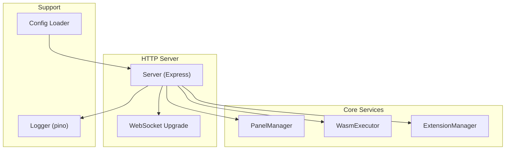
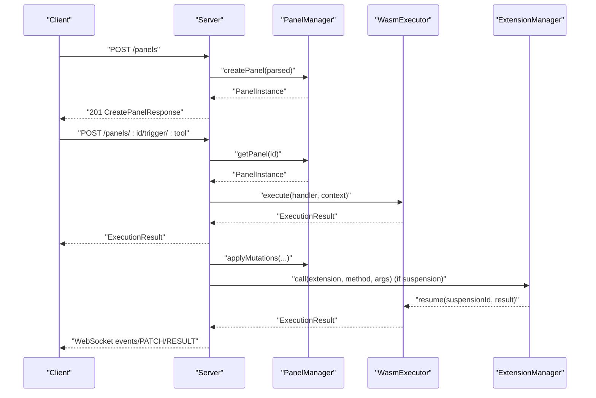
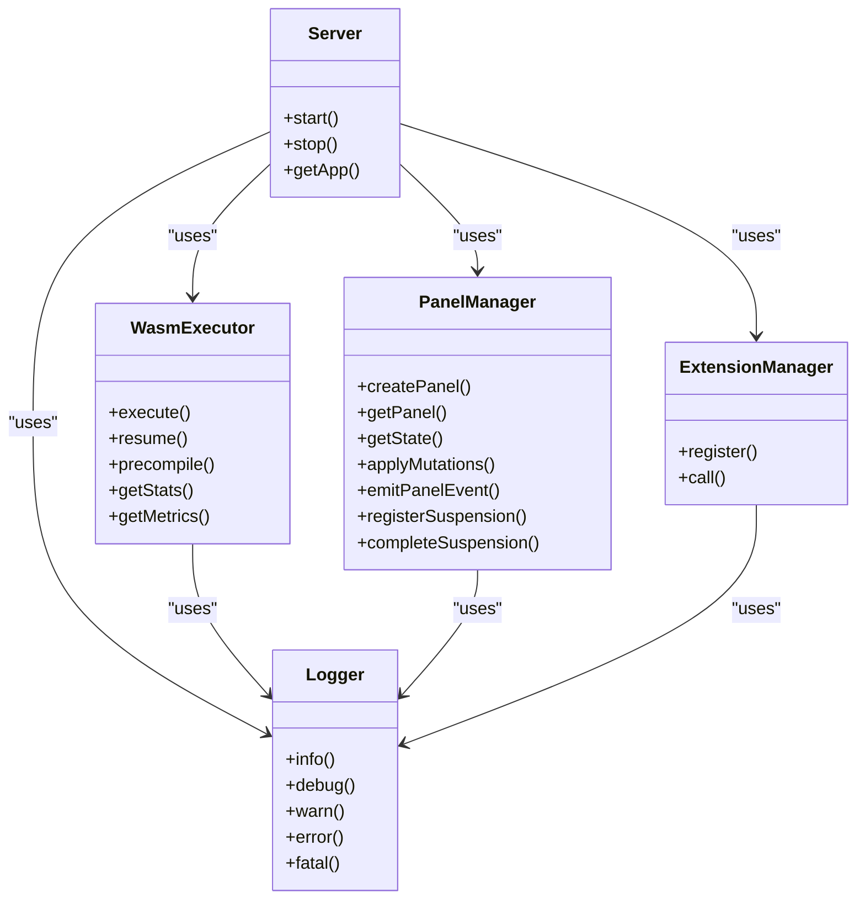

# HTTP API

<cite>
**Referenced Files in This Document**
- [server.ts](file://runtime/workspace-kernel/src/server.ts)
- [types.ts](file://runtime/workspace-kernel/src/types.ts)
- [config.ts](file://runtime/workspace-kernel/src/config.ts)
- [panel.ts](file://runtime/workspace-kernel/src/panel.ts)
- [executor.ts](file://runtime/workspace-kernel/src/executor.ts)
- [extensions.ts](file://runtime/workspace-kernel/src/extensions.ts)
- [logger.ts](file://runtime/workspace-kernel/src/logger.ts)
- [index.ts](file://runtime/workspace-kernel/src/index.ts)
</cite>

## Table of Contents
1. [Introduction](#introduction)
2. [Project Structure](#project-structure)
3. [Core Components](#core-components)
4. [Architecture Overview](#architecture-overview)
5. [Detailed Component Analysis](#detailed-component-analysis)
6. [Dependency Analysis](#dependency-analysis)
7. [Performance Considerations](#performance-considerations)
8. [Troubleshooting Guide](#troubleshooting-guide)
9. [Conclusion](#conclusion)
10. [Appendices](#appendices)

## Introduction
This document describes the HTTP API exposed by the Workspace Kernel on port 3000. It covers all endpoints for panel lifecycle management, state retrieval, and handler execution triggers. It also explains JWT-based authentication, CORS configuration, rate limiting considerations, error handling, and logging via pino. Monitoring endpoints include health and metrics.

## Project Structure
The HTTP server is implemented in a single class that wires middleware, routes, and WebSocket upgrades. Supporting components include:
- Panel lifecycle management
- WASM executor for handler execution
- Extension manager for external integrations
- Logger using pino
- Configuration loader and environment overrides

**Diagram sources**
- [server.ts](file://runtime/workspace-kernel/src/server.ts#L46-L149)
- [panel.ts](file://runtime/workspace-kernel/src/panel.ts#L46-L110)
- [executor.ts](file://runtime/workspace-kernel/src/executor.ts#L150-L210)
- [extensions.ts](file://runtime/workspace-kernel/src/extensions.ts#L1-L40)
- [config.ts](file://runtime/workspace-kernel/src/config.ts#L1-L40)
- [logger.ts](file://runtime/workspace-kernel/src/logger.ts#L1-L40)

**Section sources**
- [server.ts](file://runtime/workspace-kernel/src/server.ts#L46-L149)
- [index.ts](file://runtime/workspace-kernel/src/index.ts#L22-L58)

## Core Components
- Server: Express app with CORS, body parsing, request logging, JWT auth middleware, and route handlers.
- PanelManager: Stores panel configs, state, clients, and emits events; provides info and state retrieval.
- WasmExecutor: Bridges to the native WASM runtime (via N-API) to execute handlers and manage suspensions.
- ExtensionManager: Registers and dispatches extension methods (e.g., HTTP client).
- Logger: Pino-backed logger with configurable level and pretty printing.

**Section sources**
- [server.ts](file://runtime/workspace-kernel/src/server.ts#L69-L152)
- [panel.ts](file://runtime/workspace-kernel/src/panel.ts#L46-L110)
- [executor.ts](file://runtime/workspace-kernel/src/executor.ts#L150-L210)
- [extensions.ts](file://runtime/workspace-kernel/src/extensions.ts#L1-L40)
- [logger.ts](file://runtime/workspace-kernel/src/logger.ts#L1-L40)

## Architecture Overview
The HTTP server exposes REST endpoints and upgrades HTTP to WebSocket for real-time updates. Authentication is optional and enforced via JWT. Request bodies are validated using Zod schemas. Execution results propagate state mutations and events to WebSocket clients.

**Diagram sources**
- [server.ts](file://runtime/workspace-kernel/src/server.ts#L510-L642)
- [panel.ts](file://runtime/workspace-kernel/src/panel.ts#L143-L181)
- [executor.ts](file://runtime/workspace-kernel/src/executor.ts#L214-L303)
- [extensions.ts](file://runtime/workspace-kernel/src/extensions.ts#L67-L87)

## Detailed Component Analysis

### Authentication and CORS
- JWT-based authentication:
  - Middleware checks Authorization header for Bearer token.
  - Token verification uses the configured JWT secret.
  - Health endpoint is exempt from auth.
- CORS:
  - Configurable origins and credentials support.
- Body parsing:
  - JSON with configurable size limit.

**Section sources**
- [server.ts](file://runtime/workspace-kernel/src/server.ts#L71-L128)
- [config.ts](file://runtime/workspace-kernel/src/config.ts#L1-L40)
- [config.ts](file://runtime/workspace-kernel/src/config.ts#L73-L123)

### Health Endpoint
- Path: GET /health
- Purpose: Returns service health, version, uptime, panel counts, and runtime stats.
- Response: HealthResponse

**Section sources**
- [server.ts](file://runtime/workspace-kernel/src/server.ts#L480-L502)
- [types.ts](file://runtime/workspace-kernel/src/types.ts#L258-L273)

### Metrics Endpoint
- Path: GET /metrics
- Purpose: Exposes Prometheus-formatted metrics from the WASM runtime.
- Response: text/plain

**Section sources**
- [server.ts](file://runtime/workspace-kernel/src/server.ts#L504-L508)
- [executor.ts](file://runtime/workspace-kernel/src/executor.ts#L330-L338)

### Panel Endpoints

#### POST /panels (Create Panel)
- Method: POST
- URL: /panels
- Headers:
  - Authorization: Bearer <token> (when auth enabled)
  - Content-Type: application/json
- Request body schema: CreatePanelRequestSchema
  - id: string (optional)
  - kind: string
  - title: string (optional)
  - tools: array of tool definitions
    - name: string
    - handler: string (JavaScript code)
    - trigger: union of manual, interval, event, cron, state_change
    - description: string (optional)
    - capabilities: string[] (optional)
  - initialState: object (optional)
  - capabilities: string[] (optional)
  - metadata: object (optional)
- Query parameters: None
- Response status codes:
  - 201 Created: CreatePanelResponse
  - 400 Bad Request: Validation error (ZodError)
  - 401 Unauthorized: Missing/invalid token (when auth enabled)
  - 500 Internal Server Error: Unexpected error
- Response body structure: CreatePanelResponse
  - id: string
  - status: PanelStatus
  - wsUrl: string (WebSocket URL for the panel)

Example successful response:
- 201 Created
- Body: { id, status, wsUrl }

Example error response:
- 400 Bad Request
- Body: { error: "Invalid request body", details: ZodError }

**Section sources**
- [server.ts](file://runtime/workspace-kernel/src/server.ts#L510-L529)
- [types.ts](file://runtime/workspace-kernel/src/types.ts#L207-L229)
- [types.ts](file://runtime/workspace-kernel/src/types.ts#L232-L238)

#### GET /panels (List Panels)
- Method: GET
- URL: /panels
- Headers: Authorization: Bearer <token> (when auth enabled)
- Query parameters: None
- Response status codes:
  - 200 OK: ListPanelsResponse
  - 401 Unauthorized: Missing/invalid token (when auth enabled)
- Response body structure: ListPanelsResponse
  - panels: array of PanelInfoResponse
  - total: number

PanelInfoResponse fields:
- id, kind, title, status, state, tools[], createdAt, lastActivity, clientCount

**Section sources**
- [server.ts](file://runtime/workspace-kernel/src/server.ts#L532-L541)
- [types.ts](file://runtime/workspace-kernel/src/types.ts#L239-L256)
- [panel.ts](file://runtime/workspace-kernel/src/panel.ts#L345-L379)

#### GET /panels/:id (Retrieve Panel Info)
- Method: GET
- URL: /panels/:id
- Path parameters:
  - id: string (panel identifier)
- Headers: Authorization: Bearer <token> (when auth enabled)
- Query parameters: None
- Response status codes:
  - 200 OK: PanelInfoResponse
  - 404 Not Found: Panel does not exist
  - 401 Unauthorized: Missing/invalid token (when auth enabled)

**Section sources**
- [server.ts](file://runtime/workspace-kernel/src/server.ts#L543-L565)
- [panel.ts](file://runtime/workspace-kernel/src/panel.ts#L345-L365)

#### GET /panels/:id/state (Retrieve Panel State)
- Method: GET
- URL: /panels/:id/state
- Path parameters:
  - id: string (panel identifier)
- Headers: Authorization: Bearer <token> (when auth enabled)
- Query parameters: None
- Response status codes:
  - 200 OK: Panel state object
  - 404 Not Found: Panel does not exist
  - 401 Unauthorized: Missing/invalid token (when auth enabled)

**Section sources**
- [server.ts](file://runtime/workspace-kernel/src/server.ts#L555-L565)

#### DELETE /panels/:id (Delete Panel)
- Method: DELETE
- URL: /panels/:id
- Path parameters:
  - id: string (panel identifier)
- Headers: Authorization: Bearer <token> (when auth enabled)
- Query parameters: None
- Response status codes:
  - 204 No Content: Deletion succeeded
  - 404 Not Found: Panel does not exist
  - 401 Unauthorized: Missing/invalid token (when auth enabled)

Notes:
- Deleting a panel closes WebSocket connections and cleans up suspensions.

**Section sources**
- [server.ts](file://runtime/workspace-kernel/src/server.ts#L567-L577)
- [panel.ts](file://runtime/workspace-kernel/src/panel.ts#L110-L141)

#### POST /panels/:id/trigger/:tool (Trigger Handler Execution)
- Method: POST
- URL: /panels/:id/trigger/:tool
- Path parameters:
  - id: string (panel identifier)
  - tool: string (tool name)
- Headers:
  - Authorization: Bearer <token> (when auth enabled)
  - Content-Type: application/json
- Request body: Arbitrary JSON payload passed as args to the handler
- Query parameters: None
- Response status codes:
  - 200 OK: ExecutionResult
  - 404 Not Found: Panel or tool not found
  - 401 Unauthorized: Missing/invalid token (when auth enabled)
  - 500 Internal Server Error: Execution failure
- Response body structure: ExecutionResult
  - status: "success" | "suspended" | "error"
  - returnValue: any (optional)
  - stateMutations: array of StateMutation
  - events: array of EmittedEvent
  - viewCommands: array of ViewCommand
  - suspension: SuspensionDetails (optional)
  - error: ExecutionError (optional)
  - metrics: ExecutionMetrics

Notes:
- On success, state mutations are applied and broadcast to WebSocket clients.
- If suspended, the handler’s suspension is registered; the extension call is executed and the handler resumed asynchronously.

**Section sources**
- [server.ts](file://runtime/workspace-kernel/src/server.ts#L579-L642)
- [types.ts](file://runtime/workspace-kernel/src/types.ts#L84-L175)
- [panel.ts](file://runtime/workspace-kernel/src/panel.ts#L212-L247)
- [executor.ts](file://runtime/workspace-kernel/src/executor.ts#L282-L303)

### WebSocket Upgrade
- Path: GET /panels/:id/ws
- Query parameters:
  - token: Bearer token (when auth enabled)
- Behavior:
  - Validates panel existence and optional JWT token.
  - Accepts the upgrade and manages client subscriptions and messages.
  - Emits CONNECTED, PATCH, EVENT, RESULT, ERROR, PONG messages.

**Section sources**
- [server.ts](file://runtime/workspace-kernel/src/server.ts#L157-L201)
- [server.ts](file://runtime/workspace-kernel/src/server.ts#L203-L295)

## Dependency Analysis

**Diagram sources**
- [server.ts](file://runtime/workspace-kernel/src/server.ts#L46-L149)
- [panel.ts](file://runtime/workspace-kernel/src/panel.ts#L46-L110)
- [executor.ts](file://runtime/workspace-kernel/src/executor.ts#L150-L210)
- [extensions.ts](file://runtime/workspace-kernel/src/extensions.ts#L1-L40)
- [logger.ts](file://runtime/workspace-kernel/src/logger.ts#L1-L40)

**Section sources**
- [server.ts](file://runtime/workspace-kernel/src/server.ts#L46-L149)
- [panel.ts](file://runtime/workspace-kernel/src/panel.ts#L46-L110)
- [executor.ts](file://runtime/workspace-kernel/src/executor.ts#L150-L210)
- [extensions.ts](file://runtime/workspace-kernel/src/extensions.ts#L1-L40)
- [logger.ts](file://runtime/workspace-kernel/src/logger.ts#L1-L40)

## Performance Considerations
- Request body size limit is configurable.
- WASM runtime configuration controls instance limits, memory, timeouts, and host call limits.
- The executor exposes runtime statistics and Prometheus metrics for observability.
- Concurrency and timeouts for HTTP extension calls are configurable.

[No sources needed since this section provides general guidance]

## Troubleshooting Guide
Common error scenarios and their likely causes:
- 401 Unauthorized:
  - Missing Authorization header or invalid/expired JWT token.
- 400 Bad Request:
  - Request body fails Zod validation for CreatePanelRequestSchema.
- 404 Not Found:
  - Panel or tool not found when retrieving info, state, or triggering execution.
- 500 Internal Server Error:
  - Handler execution failure; check logs for error details.

Logging:
- All HTTP requests are logged with method, URL, status, and duration.
- Errors and fatal conditions are logged with structured context.

**Section sources**
- [server.ts](file://runtime/workspace-kernel/src/server.ts#L108-L128)
- [server.ts](file://runtime/workspace-kernel/src/server.ts#L510-L529)
- [server.ts](file://runtime/workspace-kernel/src/server.ts#L543-L577)
- [server.ts](file://runtime/workspace-kernel/src/server.ts#L579-L642)
- [logger.ts](file://runtime/workspace-kernel/src/logger.ts#L1-L40)

## Conclusion
The Workspace Kernel exposes a focused HTTP API for panel lifecycle and handler execution, with optional JWT authentication and CORS support. It integrates a WASM executor and extension system for robust handler execution and asynchronous workflows. Monitoring endpoints enable health and metrics visibility.

## Appendices

### Authentication Mechanism
- JWT verification is performed in middleware for all protected routes except /health.
- When authEnabled is true, a valid JWT signed by the configured secret is required.

**Section sources**
- [server.ts](file://runtime/workspace-kernel/src/server.ts#L108-L128)
- [config.ts](file://runtime/workspace-kernel/src/config.ts#L170-L183)

### CORS Configuration
- Origins and credentials are configurable; defaults allow any origin.

**Section sources**
- [server.ts](file://runtime/workspace-kernel/src/server.ts#L71-L76)
- [config.ts](file://runtime/workspace-kernel/src/config.ts#L1-L40)

### Rate Limiting
- Built-in rate limiting is not implemented in the HTTP server.
- Consider adding a rate limiter middleware at the Express layer if needed.
- The HTTP extension provides internal concurrency control for outbound requests.

**Section sources**
- [server.ts](file://runtime/workspace-kernel/src/server.ts#L69-L103)
- [extensions.ts](file://runtime/workspace-kernel/src/extensions.ts#L304-L333)

### Practical Usage Examples

#### JavaScript (fetch)
- Create a panel:
  - POST /panels with Authorization header and JSON body
- Retrieve panel info:
  - GET /panels/:id with Authorization header
- Retrieve state:
  - GET /panels/:id/state with Authorization header
- Delete a panel:
  - DELETE /panels/:id with Authorization header
- Trigger a handler:
  - POST /panels/:id/trigger/:tool with Authorization header and JSON body

#### Python (requests)
- Same patterns as above using requests.Session with Authorization header.

[No sources needed since this section provides general usage guidance]

### Monitoring Endpoints
- Health: GET /health
  - Returns service status, version, uptime, panel counts, and runtime stats.
- Metrics: GET /metrics
  - Returns Prometheus-formatted metrics.

**Section sources**
- [server.ts](file://runtime/workspace-kernel/src/server.ts#L480-L508)
- [executor.ts](file://runtime/workspace-kernel/src/executor.ts#L330-L338)