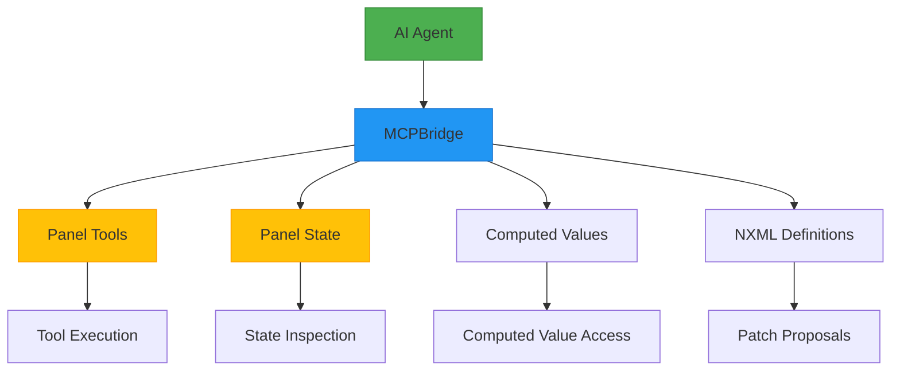
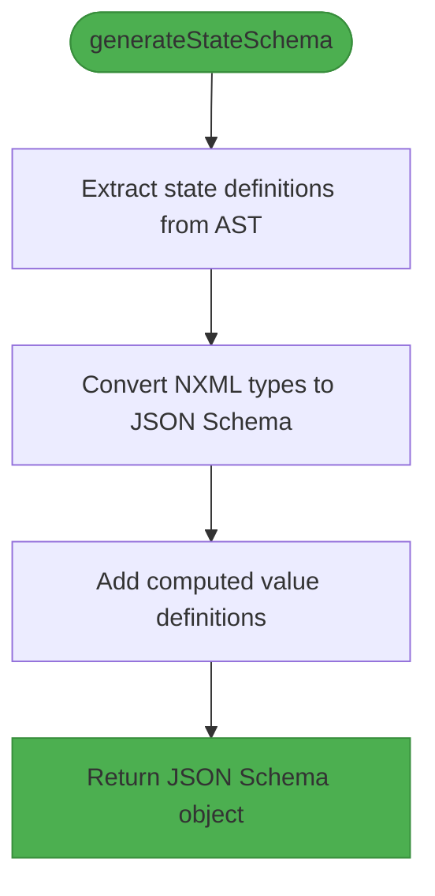
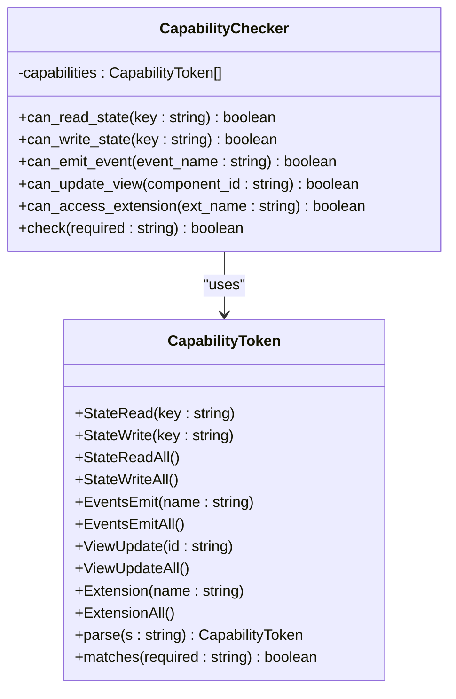

# Model Context Protocol (MCP) Integration

<cite>
**Referenced Files in This Document**   
- [bridge.ts](file://packages/nexus-reactor/src/mcp/bridge.ts)
- [resources.ts](file://packages/nexus-reactor/src/mcp/resources.ts)
- [tools.ts](file://packages/nexus-reactor/src/mcp/tools.ts)
- [types.ts](file://packages/nexus-reactor/src/core/types.ts)
- [reactor.ts](file://packages/nexus-reactor/src/reactor.ts)
- [capability.rs](file://runtime/nexus-wasm-bridge/src/capability.rs)
- [state.ts](file://packages/nexus-reactor/src/state/store.ts)
</cite>

## Table of Contents
1. [Introduction](#introduction)
2. [MCPBridge Architecture](#mcpbridge-architecture)
3. [Core Functions](#core-functions)
4. [State Schema Generation](#state-schema-generation)
5. [Tool Description and Exposure](#tool-description-and-exposure)
6. [AI Interaction Patterns](#ai-interaction-patterns)
7. [Security Model](#security-model)
8. [Implementation Examples](#implementation-examples)
9. [Reactor Sandbox Integration](#reactor-sandbox-integration)
10. [Usage Patterns](#usage-patterns)
11. [Conclusion](#conclusion)

## Introduction

The Model Context Protocol (MCP) integration enables AI collaboration within the Nexus system by providing a standardized interface for AI agents to interact with Nexus panels. This documentation explains how the MCPBridge facilitates bidirectional communication between AI systems and the Nexus runtime, allowing AI agents to inspect panel state, understand available actions, and propose changes to NXML definitions.

The MCP integration is designed to support AI-assisted development workflows, debugging scenarios, and intelligent automation by exposing panel functionality through a secure, capability-based interface. AI agents can leverage this protocol to understand the current state of a panel, discover available tools, and suggest modifications while operating under strict security constraints.

**Section sources**
- [bridge.ts](file://packages/nexus-reactor/src/mcp/bridge.ts#L1-L167)
- [reactor.ts](file://packages/nexus-reactor/src/reactor.ts#L24-L34)

## MCPBridge Architecture

The MCPBridge serves as the communication layer between AI agents and the Nexus runtime, providing a standardized interface for bidirectional interaction. It is implemented as a TypeScript class that exposes panel tools and state to AI systems through the Model Context Protocol.

The bridge architecture follows a mediator pattern, where the MCPBridge instance acts as an intermediary between external AI agents and the internal Nexus components. It provides methods for retrieving tools, accessing resources, reading state, and executing actions, all while maintaining the security and integrity of the underlying system.



**Diagram sources**
- [bridge.ts](file://packages/nexus-reactor/src/mcp/bridge.ts#L14-L19)
- [reactor.ts](file://packages/nexus-reactor/src/reactor.ts#L34-L34)

**Section sources**
- [bridge.ts](file://packages/nexus-reactor/src/mcp/bridge.ts#L14-L19)
- [reactor.ts](file://packages/nexus-reactor/src/reactor.ts#L34-L34)

## Core Functions

The MCP integration provides three core functions that enable AI collaboration: `createMCPBridge`, `generateStateSchema`, and `getToolsDescription`. These functions form the foundation of the AI interaction model, allowing AI agents to understand and interact with Nexus panels.

### createMCPBridge

The `createMCPBridge` function initializes the MCP bridge by creating an instance that connects AI agents to a specific panel's runtime environment. This function takes the panel's Abstract Syntax Tree (AST), state store, and a tool execution callback as parameters, establishing a secure communication channel.

The bridge instance provides methods for AI agents to:
- Retrieve available tools through `getTools()`
- Access panel resources via `getResources()`
- Read resource content with `readResource(uri)`
- Execute tools using `callTool(name, args)`

When an AI agent calls a tool, the bridge delegates execution to the provided callback function, ensuring proper context and security enforcement.

**Section sources**
- [bridge.ts](file://packages/nexus-reactor/src/mcp/bridge.ts#L21-L77)
- [index.ts](file://packages/nexus-reactor/src/mcp/index.ts#L6-L9)

### generateStateSchema

The `generateStateSchema` function creates a JSON Schema representation of a panel's state structure, exposing it to AI agents for inspection and understanding. This schema includes both declared state variables and computed values, providing AI systems with comprehensive knowledge of the panel's data model.

The function analyzes the panel's AST to extract state definitions, converting NXML primitive types to their JSON Schema equivalents. For computed values, it includes descriptive information about the computation logic, allowing AI agents to understand derived data relationships.



**Diagram sources**
- [bridge.ts](file://packages/nexus-reactor/src/mcp/bridge.ts#L121-L142)

**Section sources**
- [bridge.ts](file://packages/nexus-reactor/src/mcp/bridge.ts#L121-L142)
- [types.ts](file://packages/nexus-reactor/src/core/types.ts#L322-L330)

### getToolsDescription

The `getToolsDescription` function generates a human-readable description of all available tools in a panel, formatted for AI context consumption. This function creates a structured text representation that includes tool names, descriptions, arguments, and usage requirements.

The output format is designed to be easily parsed by AI systems, providing clear information about:
- Tool names and purposes
- Required and optional arguments
- Argument types and default values
- Parameter descriptions

This comprehensive tool description enables AI agents to understand the available actions and their proper usage patterns within the panel context.

**Section sources**
- [bridge.ts](file://packages/nexus-reactor/src/mcp/bridge.ts#L147-L167)
- [tools.ts](file://packages/nexus-reactor/src/mcp/tools.ts#L142-L148)

## State Schema Generation

The state schema generation process transforms the panel's state definitions into a standardized JSON Schema format that can be consumed by AI agents. This process enables AI systems to understand the structure, types, and relationships within the panel's data model.

### Schema Structure

The generated schema follows the JSON Schema specification, with the root object type containing properties for each state variable and computed value. Each property includes type information, default values, and descriptive metadata that helps AI agents understand the data semantics.

For state variables, the schema preserves the original NXML type information, converting it to the corresponding JSON Schema type:
- `string` → `string`
- `number` → `number` 
- `boolean` → `boolean`
- `list` → `array`
- `object` → `object`

Computed values are represented with type `string` and include a description field that contains the original computation expression, allowing AI agents to understand the derivation logic.

### Type Conversion

The type conversion process uses the `nxmlTypeToJsonType` utility function to map NXML primitive types to their JSON Schema equivalents. This ensures consistent type representation across different panels and provides AI agents with reliable type information for validation and inference.

The conversion handles edge cases by defaulting to `string` type for unrecognized NXML types, maintaining schema validity while preserving data integrity. This approach allows the system to gracefully handle custom or extended types while providing meaningful type information to AI consumers.

**Section sources**
- [bridge.ts](file://packages/nexus-reactor/src/mcp/bridge.ts#L121-L142)
- [state.ts](file://packages/nexus-reactor/src/state/store.ts#L25-L39)

## Tool Description and Exposure

The MCP integration provides comprehensive tool description and exposure capabilities, enabling AI agents to discover and understand available actions within a panel context. This functionality is critical for AI-assisted development and automation workflows.

### Tool Representation

Tools are represented using the `MCPTool` interface, which includes:
- `name`: Unique identifier for the tool
- `description`: Human-readable purpose and functionality
- `inputSchema`: JSON Schema defining expected arguments

The input schema provides detailed parameter information, including type constraints, required status, and default values. This structured representation allows AI agents to validate tool calls and generate appropriate arguments.

### Argument Schema Generation

The argument schema generation process converts NXML tool arguments into JSON Schema properties. For each argument, the system extracts:
- Name and type information
- Required status (defaulting to required unless explicitly marked optional)
- Default values
- Descriptive text

This information is compiled into a properties object within the tool's input schema, with required parameters listed in the `required` array. The resulting schema enables AI agents to understand parameter constraints and generate valid tool calls.

### Tool Discovery

AI agents can discover available tools through the MCPBridge's `getTools()` method, which returns an array of `MCPTool` objects. This discovery mechanism allows AI systems to dynamically adapt to different panel configurations and available functionality.

The `getToolsDescription` function provides an alternative, human-readable format that is optimized for AI context windows, presenting tool information in a structured text format that is easy to parse and understand.

**Section sources**
- [bridge.ts](file://packages/nexus-reactor/src/mcp/bridge.ts#L80-L105)
- [tools.ts](file://packages/nexus-reactor/src/mcp/tools.ts#L12-L33)
- [types.ts](file://packages/nexus-reactor/src/core/types.ts#L335-L339)

## AI Interaction Patterns

The MCP integration supports several key interaction patterns that enable AI agents to collaborate effectively with the Nexus system. These patterns facilitate inspection, action, and modification workflows while maintaining system security and integrity.

### State Inspection

AI agents can inspect the current panel state by accessing the `nexus://<panelId>/state` resource through the `readResource` method. This provides a complete snapshot of all state variables, allowing AI systems to understand the current application context.

Similarly, computed values can be accessed via the `nexus://<panelId>/computed` resource, giving AI agents insight into derived data and business logic. The metadata resource at `nexus://<panelId>/meta` provides additional context about the panel's title, description, and other identifying information.

### Action Understanding

By retrieving the list of available tools, AI agents can understand the actions that can be performed within the panel context. The tool descriptions provide comprehensive information about each action's purpose, parameters, and usage requirements.

This understanding enables AI agents to:
- Determine appropriate actions based on the current state
- Generate valid tool calls with correct parameters
- Predict the effects of tool execution
- Suggest alternative actions or workflows

### Patch Proposals

AI agents can propose modifications to NXML definitions by suggesting patches to the panel structure. These proposals follow a change request pattern, where the AI suggests modifications that require user approval before implementation.

The patch proposal system allows AI agents to:
- Suggest new components or layout changes
- Recommend tool enhancements or additions
- Propose state variable optimizations
- Identify potential improvements or fixes

All proposed changes are subject to user approval, ensuring that AI suggestions are reviewed before implementation.

**Section sources**
- [bridge.ts](file://packages/nexus-reactor/src/mcp/bridge.ts#L47-L71)
- [resources.ts](file://packages/nexus-reactor/src/mcp/resources.ts#L37-L77)
- [reactor.ts](file://packages/nexus-reactor/src/reactor.ts#L223-L225)

## Security Model

The MCP integration employs a robust security model based on capability-based restrictions and user approval requirements. This model ensures that AI agents can interact with the system safely while preventing unauthorized access or modifications.

### Capability-Based Restrictions

The security system implements capability-based access control, where AI agents operate under defined permissions that limit their actions. Each handler in the NXML definition can specify required capabilities, which are enforced at runtime.

Capabilities are defined as token strings with the format `domain:action:scope`, such as:
- `state:read:*` - Read all state variables
- `state:write:count` - Write to the "count" state variable
- `events:emit:toast` - Emit toast notifications
- `view:update:*` - Update any view component
- `ext:http` - Access the HTTP extension

The capability system uses a hierarchical permission model, where wildcard capabilities (e.g., `state:read:*`) grant broader access than specific ones (e.g., `state:read:count`).



**Diagram sources**
- [capability.rs](file://runtime/nexus-wasm-bridge/src/capability.rs#L12-L177)
- [types.ts](file://packages/nexus-reactor/src/core/types.ts#L170-L180)

**Section sources**
- [capability.rs](file://runtime/nexus-wasm-bridge/src/capability.rs#L12-L177)
- [types.ts](file://packages/nexus-reactor/src/core/types.ts#L170-L180)

### User Approval Requirements

All proposed changes to NXML definitions require explicit user approval before implementation. This approval process ensures that AI suggestions are reviewed by human operators, maintaining control over system modifications.

The approval workflow follows these steps:
1. AI agent analyzes the current panel and identifies potential improvements
2. AI generates a patch proposal describing the suggested changes
3. System presents the proposal to the user with impact analysis
4. User reviews and approves or rejects the proposal
5. If approved, the system applies the changes; otherwise, they are discarded

This process prevents unauthorized modifications while allowing beneficial AI suggestions to be implemented after human review.

### Sandboxed Execution

The reactor's sandbox execution environment provides an additional layer of security by isolating handler code from the host system. The sandbox:
- Prevents access to forbidden globals (window, document, etc.)
- Blocks network requests unless explicitly permitted
- Restricts file system access
- Limits execution time to prevent infinite loops
- Enforces capability checks on all host function calls

This isolation ensures that even if an AI agent executes a tool, the impact is contained within the defined capabilities and cannot compromise the broader system.

**Section sources**
- [capability.rs](file://runtime/nexus-wasm-bridge/src/capability.rs#L180-L224)
- [executor.ts](file://packages/nexus-reactor/src/sandbox/executor.ts#L69-L113)

## Implementation Examples

The following examples demonstrate how to expose panel functionality to AI agents and handle patch proposals using the MCP integration.

### Exposing Panel Functionality

To expose a panel's functionality to AI agents, initialize the MCPBridge with the panel's AST and state store:

```typescript
const mcpBridge = createMCPBridge(ast, stateStore, executeTool);
```

This creates a bridge instance that AI agents can use to:
- Retrieve available tools: `mcpBridge.getTools()`
- Access state: `mcpBridge.readResource('nexus://panel-id/state')`
- Execute actions: `mcpBridge.callTool('increment', { amount: 1 })`

The bridge automatically exposes all tools defined in the panel's logic namespace, making them available for AI discovery and use.

### Handling Patch Proposals

To handle patch proposals from AI agents, implement a proposal review system:

```typescript
function handlePatchProposal(proposal: MCPatchProposal) {
  // Display proposal to user with impact analysis
  showProposalDialog(proposal);
  
  // Wait for user approval
  if (await userApproves(proposal)) {
    // Apply the patch to the NXML definition
    applyPatch(proposal);
    return { success: true };
  }
  
  return { success: false, reason: 'user_rejected' };
}
```

The proposal system should provide users with clear information about:
- The changes being proposed
- The expected impact on panel behavior
- Any potential risks or side effects
- Alternative options or suggestions

**Section sources**
- [bridge.ts](file://packages/nexus-reactor/src/mcp/bridge.ts#L21-L77)
- [reactor.ts](file://packages/nexus-reactor/src/reactor.ts#L89-L90)

## Reactor Sandbox Integration

The MCP integration is tightly coupled with the reactor's sandbox execution environment, leveraging its security and isolation features to protect the system from potentially harmful AI interactions.

### Context Isolation

The sandbox provides isolated execution contexts for tool handlers, ensuring that AI-initiated actions cannot access unauthorized resources. Each handler executes in a context that includes:
- `$state`: Proxy to panel state (with capability-enforced access)
- `$args`: Tool arguments
- `$view`: API for view manipulation (capability-restricted)
- `$emit`: Event emission function
- `$ext`: Access to extensions (capability-controlled)
- `$log`: Safe logging function

This isolation prevents AI agents from bypassing security controls or accessing system resources outside their granted capabilities.

### Capability Enforcement

The sandbox integrates with the capability system to enforce access controls at the function call level. When a handler attempts to access a host function (e.g., state modification, event emission), the capability checker verifies that the handler has the required permission.

The enforcement process:
1. Handler attempts to modify state: `$state.count = 42`
2. Proxy intercepts the operation and checks capabilities
3. Capability checker validates `state:write:count` permission
4. Operation proceeds if permitted; otherwise, an error is thrown

This real-time enforcement ensures that all actions, whether initiated by UI interactions or AI agents, comply with the defined security policy.

**Section sources**
- [executor.ts](file://packages/nexus-reactor/src/sandbox/executor.ts#L12-L15)
- [context.ts](file://packages/nexus-reactor/src/sandbox/context.ts#L7-L27)

## Usage Patterns

The MCP integration supports several key usage patterns for AI-assisted development and debugging workflows.

### AI-Assisted Development

AI agents can assist in panel development by:
- Suggesting component layouts based on design principles
- Recommending state variable optimizations
- Generating tool implementations from natural language descriptions
- Identifying potential usability improvements
- Proposing accessibility enhancements

These suggestions are presented as patch proposals that developers can review and approve, accelerating the development process while maintaining code quality.

### Debugging Scenarios

AI agents can help diagnose and resolve issues by:
- Analyzing error logs and suggesting root causes
- Identifying state inconsistencies or invalid data
- Recommending fixes for common problems
- Simulating user interactions to reproduce issues
- Proposing test cases for edge conditions

The AI can access the current state and execution context to provide targeted debugging assistance, reducing troubleshooting time and improving application reliability.

### Automation Workflows

The MCP integration enables intelligent automation workflows where AI agents:
- Monitor panel state for specific conditions
- Execute predefined actions in response to events
- Optimize panel performance based on usage patterns
- Generate reports and insights from panel data
- Coordinate interactions between multiple panels

These workflows operate within defined capability boundaries, ensuring that automated actions are safe and predictable.

**Section sources**
- [README.md](file://packages/nexus-reactor/README.md#L32-L34)
- [App.tsx](file://packages/nexus-reactor/test/App.tsx#L10-L162)

## Conclusion

The Model Context Protocol integration provides a robust framework for AI collaboration within the Nexus system. By exposing panel functionality through the MCPBridge, AI agents can inspect state, understand available tools, and propose improvements while operating under strict security constraints.

The integration combines comprehensive state schema generation, detailed tool description, and secure bidirectional communication to enable powerful AI-assisted workflows. The capability-based security model ensures that AI interactions are safe and controlled, with all proposed changes requiring user approval.

This architecture supports a wide range of use cases, from AI-assisted development and debugging to intelligent automation, while maintaining the integrity and security of the underlying system. By providing standardized interfaces for AI collaboration, the MCP integration enhances the capabilities of the Nexus platform and enables new possibilities for intelligent application development and management.