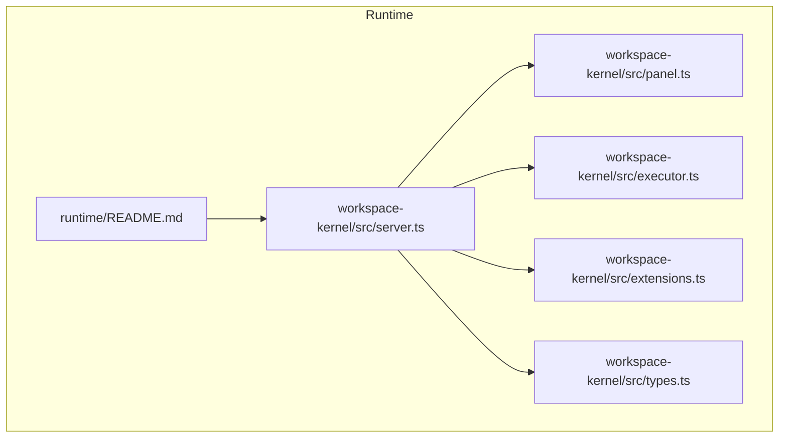
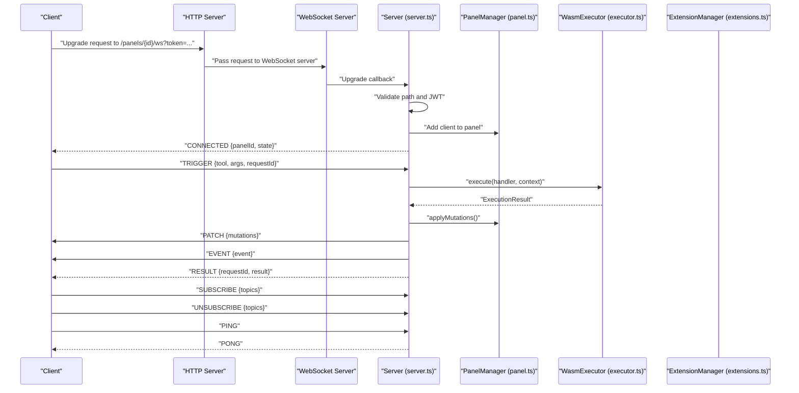
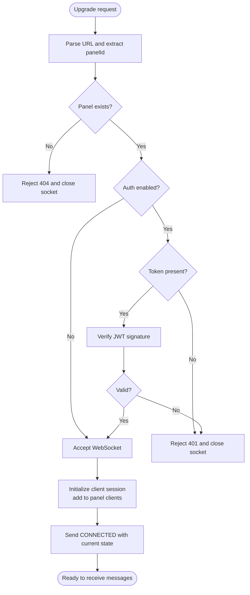
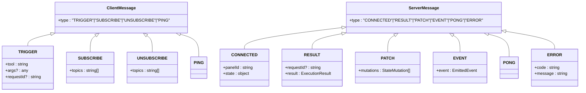
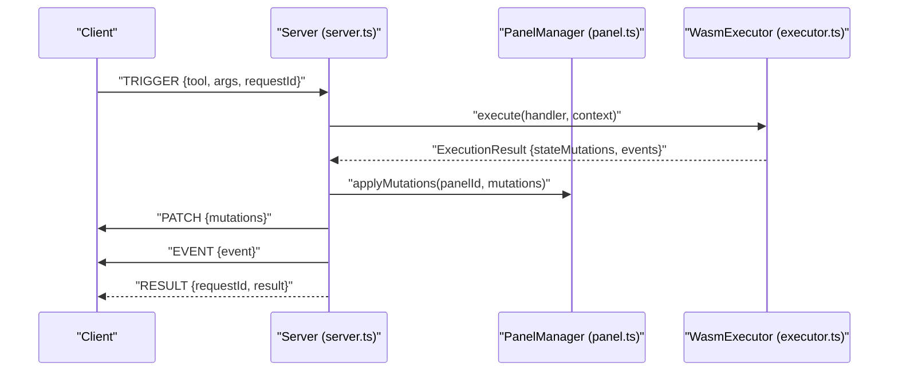
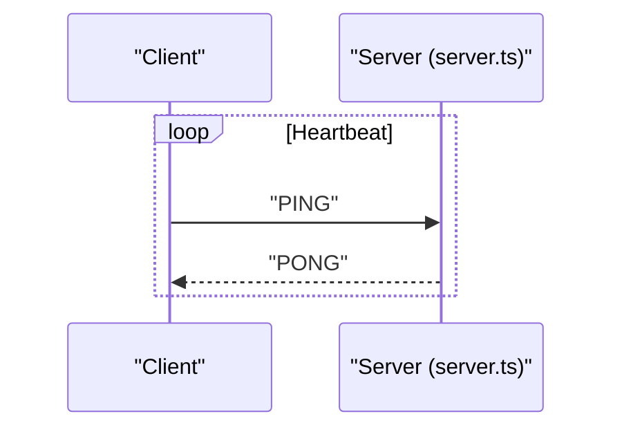
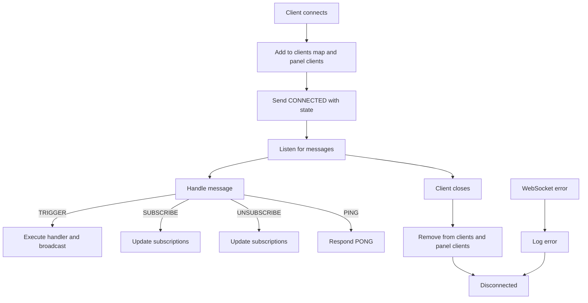
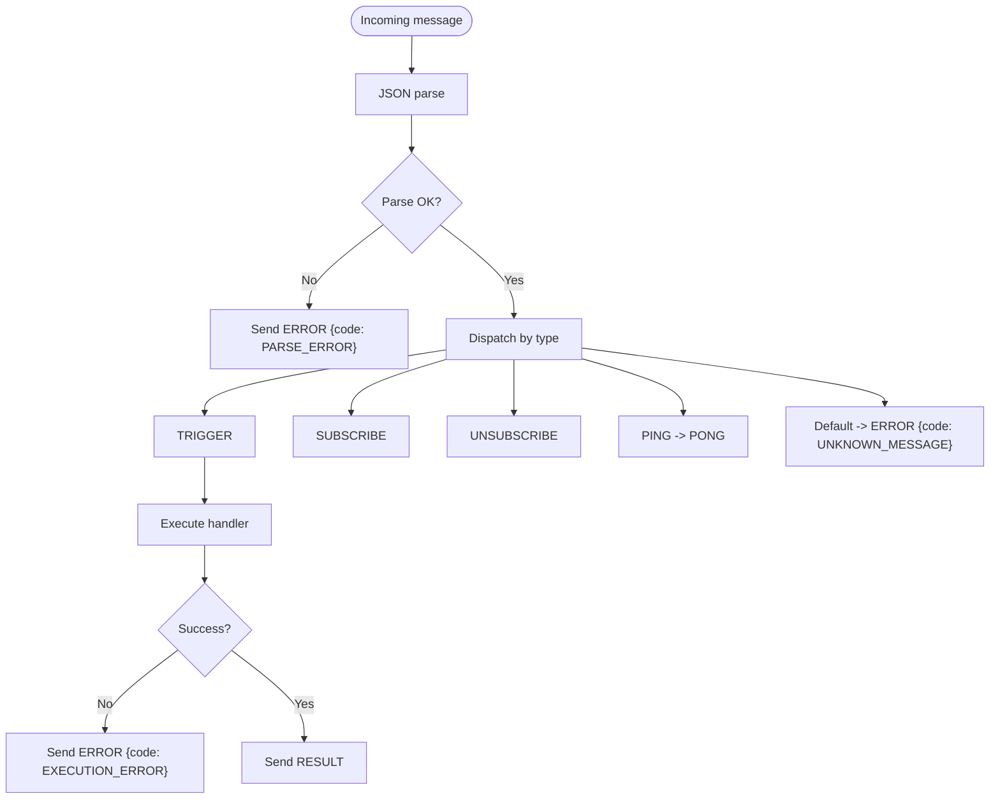
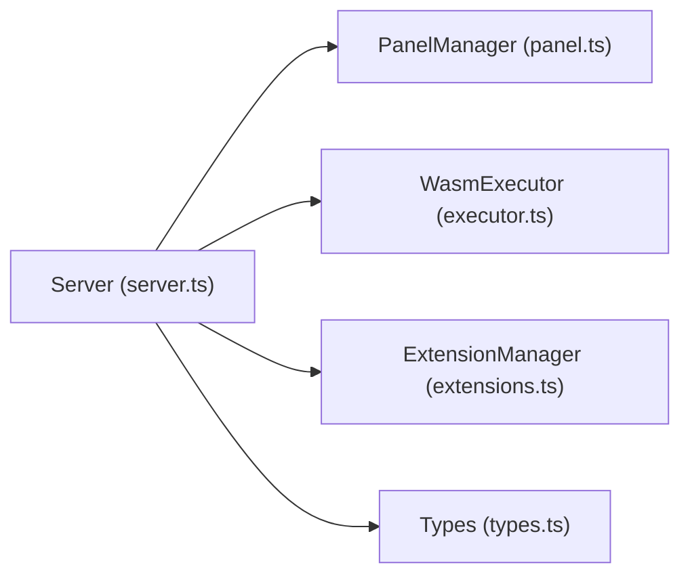

# WebSocket API

<cite>
**Referenced Files in This Document**
- [runtime/README.md](file://runtime/README.md)
- [runtime/workspace-kernel/src/server.ts](file://runtime/workspace-kernel/src/server.ts)
- [runtime/workspace-kernel/src/types.ts](file://runtime/workspace-kernel/src/types.ts)
- [runtime/workspace-kernel/src/panel.ts](file://runtime/workspace-kernel/src/panel.ts)
- [runtime/workspace-kernel/src/executor.ts](file://runtime/workspace-kernel/src/executor.ts)
- [runtime/workspace-kernel/src/extensions.ts](file://runtime/workspace-kernel/src/extensions.ts)
</cite>

## Table of Contents
1. [Introduction](#introduction)
2. [Project Structure](#project-structure)
3. [Core Components](#core-components)
4. [Architecture Overview](#architecture-overview)
5. [Detailed Component Analysis](#detailed-component-analysis)
6. [Dependency Analysis](#dependency-analysis)
7. [Performance Considerations](#performance-considerations)
8. [Troubleshooting Guide](#troubleshooting-guide)
9. [Conclusion](#conclusion)
10. [Appendices](#appendices)

## Introduction
This document describes the WebSocket API available on port 3001 for real-time interaction with panels. It explains how clients connect to the endpoint, how JWT token authentication works via query parameter, and the JSON message protocol used for bidirectional communication. It covers all client-to-server and server-to-client message types, including TRIGGER, SUBSCRIBE, UNSUBSCRIBE, PING, CONNECTED, RESULT, PATCH, EVENT, PONG, ERROR. It also details the real-time interaction model, heartbeat mechanism, connection lifecycle, error handling, and session cleanup.

## Project Structure
The WebSocket API is implemented in the workspace-kernel module. The key files involved are:
- Server entrypoint and routing: server.ts
- Type definitions for messages and execution: types.ts
- Panel lifecycle and state management: panel.ts
- WASM executor integration: executor.ts
- Extension system: extensions.ts
- High-level overview and port information: runtime/README.md

**Diagram sources**
- [runtime/workspace-kernel/src/server.ts](file://runtime/workspace-kernel/src/server.ts#L1-L200)
- [runtime/workspace-kernel/src/types.ts](file://runtime/workspace-kernel/src/types.ts#L176-L204)
- [runtime/workspace-kernel/src/panel.ts](file://runtime/workspace-kernel/src/panel.ts#L1-L120)
- [runtime/workspace-kernel/src/executor.ts](file://runtime/workspace-kernel/src/executor.ts#L1-L120)
- [runtime/workspace-kernel/src/extensions.ts](file://runtime/workspace-kernel/src/extensions.ts#L1-L120)
- [runtime/README.md](file://runtime/README.md#L128-L142)

**Section sources**
- [runtime/README.md](file://runtime/README.md#L128-L142)
- [runtime/workspace-kernel/src/server.ts](file://runtime/workspace-kernel/src/server.ts#L1-L120)
- [runtime/workspace-kernel/src/types.ts](file://runtime/workspace-kernel/src/types.ts#L176-L204)

## Core Components
- WebSocket server and upgrade handling: server.ts
- Message types and schemas: types.ts
- Panel lifecycle and state broadcasting: panel.ts
- Execution engine and suspension/resume: executor.ts
- Extension call orchestration: extensions.ts

Key responsibilities:
- Establish WebSocket connections at /panels/:id/ws with JWT token authentication via query parameter.
- Parse and route client messages (TRIGGER, SUBSCRIBE, UNSUBSCRIBE, PING).
- Execute handlers, apply state mutations, emit events, and broadcast updates to all subscribed clients.
- Manage client sessions, subscriptions, and cleanup on disconnect.

**Section sources**
- [runtime/workspace-kernel/src/server.ts](file://runtime/workspace-kernel/src/server.ts#L154-L201)
- [runtime/workspace-kernel/src/types.ts](file://runtime/workspace-kernel/src/types.ts#L176-L204)
- [runtime/workspace-kernel/src/panel.ts](file://runtime/workspace-kernel/src/panel.ts#L295-L340)
- [runtime/workspace-kernel/src/executor.ts](file://runtime/workspace-kernel/src/executor.ts#L214-L303)
- [runtime/workspace-kernel/src/extensions.ts](file://runtime/workspace-kernel/src/extensions.ts#L67-L87)

## Architecture Overview
The WebSocket API sits on top of the HTTP server and integrates with the panel manager, executor, and extension manager. The upgrade handler validates the path and JWT token, accepts the connection, and initializes a client session. Client messages are parsed and dispatched to appropriate handlers. Execution results are transformed into server messages and broadcast to all clients.

**Diagram sources**
- [runtime/workspace-kernel/src/server.ts](file://runtime/workspace-kernel/src/server.ts#L154-L295)
- [runtime/workspace-kernel/src/panel.ts](file://runtime/workspace-kernel/src/panel.ts#L143-L195)
- [runtime/workspace-kernel/src/executor.ts](file://runtime/workspace-kernel/src/executor.ts#L214-L303)
- [runtime/workspace-kernel/src/extensions.ts](file://runtime/workspace-kernel/src/extensions.ts#L67-L87)

## Detailed Component Analysis

### Connection Establishment and Authentication
- Endpoint: /panels/:id/ws
- Port: 3001 (as indicated in runtime/README.md)
- Authentication: Optional JWT verification via query parameter token. If authEnabled is true, the token must be present and valid.
- Panel existence: The server checks whether the panel exists before accepting the connection.
- Default subscriptions: On connect, clients subscribe to state and events by default.

**Diagram sources**
- [runtime/workspace-kernel/src/server.ts](file://runtime/workspace-kernel/src/server.ts#L154-L201)
- [runtime/workspace-kernel/src/server.ts](file://runtime/workspace-kernel/src/server.ts#L203-L247)

**Section sources**
- [runtime/README.md](file://runtime/README.md#L128-L142)
- [runtime/workspace-kernel/src/server.ts](file://runtime/workspace-kernel/src/server.ts#L154-L201)
- [runtime/workspace-kernel/src/server.ts](file://runtime/workspace-kernel/src/server.ts#L203-L247)

### Message Protocol and Semantics
All messages are JSON-encoded with a type field. The union types define the allowed shapes for client-to-server and server-to-client messages.

Client-to-server messages:
- TRIGGER: Execute a tool on the panel. Fields include tool, args, and optional requestId for correlation.
- SUBSCRIBE: Add topics to the client’s subscription set.
- UNSUBSCRIBE: Remove topics from the client’s subscription set.
- PING: Heartbeat request; server responds with PONG.

Server-to-client messages:
- CONNECTED: Sent upon successful connection with panelId and current state.
- RESULT: Sent in response to TRIGGER with requestId and execution result.
- PATCH: Broadcast state mutations to all subscribed clients.
- EVENT: Broadcast emitted events to all subscribed clients.
- PONG: Heartbeat response.
- ERROR: Error responses with code and message.

**Diagram sources**
- [runtime/workspace-kernel/src/types.ts](file://runtime/workspace-kernel/src/types.ts#L176-L204)

**Section sources**
- [runtime/workspace-kernel/src/types.ts](file://runtime/workspace-kernel/src/types.ts#L176-L204)

### Real-time Interaction Model
- State updates: When a handler executes and produces stateMutations, the server applies them to the panel state and broadcasts PATCH messages to all clients.
- Events: Emitted events are broadcast as EVENT messages to all clients.
- Subscriptions: Clients can manage subscriptions via SUBSCRIBE/UNSUBSCRIBE. Default subscriptions include state and events.
- Broadcast scope: All messages are sent to all clients connected to the same panel.

**Diagram sources**
- [runtime/workspace-kernel/src/server.ts](file://runtime/workspace-kernel/src/server.ts#L297-L382)
- [runtime/workspace-kernel/src/panel.ts](file://runtime/workspace-kernel/src/panel.ts#L143-L195)
- [runtime/workspace-kernel/src/executor.ts](file://runtime/workspace-kernel/src/executor.ts#L214-L303)

**Section sources**
- [runtime/workspace-kernel/src/server.ts](file://runtime/workspace-kernel/src/server.ts#L297-L382)
- [runtime/workspace-kernel/src/panel.ts](file://runtime/workspace-kernel/src/panel.ts#L143-L195)

### Heartbeat Mechanism (PING/PONG)
- Clients send PING to keep the connection alive.
- Server responds with PONG.
- This helps detect dead connections and maintain liveness.

**Diagram sources**
- [runtime/workspace-kernel/src/server.ts](file://runtime/workspace-kernel/src/server.ts#L250-L295)

**Section sources**
- [runtime/workspace-kernel/src/server.ts](file://runtime/workspace-kernel/src/server.ts#L250-L295)

### Connection Lifecycle and Cleanup
- On connect: A client record is created, added to the panel’s client set, and CONNECTED is sent with current state.
- On close: The client is removed from the client map and panel’s client set; logs indicate disconnection.
- On error: Errors are logged; the connection remains open until the client closes it.
- Graceful shutdown: On server stop, all WebSocket connections are closed and the WebSocket server is shut down.

**Diagram sources**
- [runtime/workspace-kernel/src/server.ts](file://runtime/workspace-kernel/src/server.ts#L203-L247)
- [runtime/workspace-kernel/src/server.ts](file://runtime/workspace-kernel/src/server.ts#L249-L295)

**Section sources**
- [runtime/workspace-kernel/src/server.ts](file://runtime/workspace-kernel/src/server.ts#L203-L247)
- [runtime/workspace-kernel/src/server.ts](file://runtime/workspace-kernel/src/server.ts#L249-L295)

### Error Handling Strategies
- Unknown message type: Server sends ERROR with code UNKNOWN_MESSAGE.
- Parse errors: Server sends ERROR with code PARSE_ERROR.
- Execution failures: Server sends ERROR with code EXECUTION_ERROR and includes a message.
- Tool not found: Server sends ERROR with code TOOL_NOT_FOUND.
- Panel not found: Server sends ERROR with code PANEL_NOT_FOUND.
- JWT verification failure: Upgrade handler rejects with 401 Unauthorized.
- Panel not found during upgrade: Upgrade handler rejects with 404 Not Found.

**Diagram sources**
- [runtime/workspace-kernel/src/server.ts](file://runtime/workspace-kernel/src/server.ts#L250-L295)
- [runtime/workspace-kernel/src/server.ts](file://runtime/workspace-kernel/src/server.ts#L297-L382)

**Section sources**
- [runtime/workspace-kernel/src/server.ts](file://runtime/workspace-kernel/src/server.ts#L250-L295)
- [runtime/workspace-kernel/src/server.ts](file://runtime/workspace-kernel/src/server.ts#L297-L382)

### Example Implementations

#### JavaScript (using WebSocket API)
- Establish connection: Open a WebSocket to ws://host:3001/panels/{panelId}/ws?token=...
- Send TRIGGER: JSON with type "TRIGGER", fields tool, args, and optional requestId.
- Subscribe/unsubscribe: JSON with type "SUBSCRIBE"/"UNSUBSCRIBE" and topics array.
- Handle PING/PONG: Respond to PING with PONG; periodically send PING to keep alive.
- Receive PATCH/EVENT: Apply state mutations and render events; broadcast to other clients.

Example snippet paths:
- [Establish connection](file://runtime/workspace-kernel/src/server.ts#L154-L201)
- [Handle TRIGGER](file://runtime/workspace-kernel/src/server.ts#L297-L382)
- [Handle PING](file://runtime/workspace-kernel/src/server.ts#L250-L295)
- [Broadcast PATCH/EVENT](file://runtime/workspace-kernel/src/server.ts#L340-L364)

#### Python (using websockets library)
- Connect to ws://host:3001/panels/{panelId}/ws?token=...
- Send JSON messages with type "TRIGGER", "SUBSCRIBE", "UNSUBSCRIBE", "PING".
- Receive JSON messages with types "CONNECTED", "RESULT", "PATCH", "EVENT", "PONG", "ERROR".
- Implement heartbeat: Send PING periodically and respond to PONG.

Example snippet paths:
- [Upgrade and accept](file://runtime/workspace-kernel/src/server.ts#L154-L201)
- [Message dispatch](file://runtime/workspace-kernel/src/server.ts#L250-L295)
- [Execution and broadcasting](file://runtime/workspace-kernel/src/server.ts#L297-L382)

**Section sources**
- [runtime/workspace-kernel/src/server.ts](file://runtime/workspace-kernel/src/server.ts#L154-L201)
- [runtime/workspace-kernel/src/server.ts](file://runtime/workspace-kernel/src/server.ts#L250-L295)
- [runtime/workspace-kernel/src/server.ts](file://runtime/workspace-kernel/src/server.ts#L297-L382)

## Dependency Analysis
The WebSocket server depends on:
- PanelManager for state, subscriptions, and client tracking.
- WasmExecutor for executing handlers and returning results.
- ExtensionManager for resolving suspension callbacks and resuming execution.
- Types for message schemas and execution result structures.

**Diagram sources**
- [runtime/workspace-kernel/src/server.ts](file://runtime/workspace-kernel/src/server.ts#L1-L120)
- [runtime/workspace-kernel/src/panel.ts](file://runtime/workspace-kernel/src/panel.ts#L1-L120)
- [runtime/workspace-kernel/src/executor.ts](file://runtime/workspace-kernel/src/executor.ts#L1-L120)
- [runtime/workspace-kernel/src/extensions.ts](file://runtime/workspace-kernel/src/extensions.ts#L1-L120)
- [runtime/workspace-kernel/src/types.ts](file://runtime/workspace-kernel/src/types.ts#L176-L204)

**Section sources**
- [runtime/workspace-kernel/src/server.ts](file://runtime/workspace-kernel/src/server.ts#L1-L120)
- [runtime/workspace-kernel/src/panel.ts](file://runtime/workspace-kernel/src/panel.ts#L1-L120)
- [runtime/workspace-kernel/src/executor.ts](file://runtime/workspace-kernel/src/executor.ts#L1-L120)
- [runtime/workspace-kernel/src/extensions.ts](file://runtime/workspace-kernel/src/extensions.ts#L1-L120)
- [runtime/workspace-kernel/src/types.ts](file://runtime/workspace-kernel/src/types.ts#L176-L204)

## Performance Considerations
- Message parsing and dispatch are lightweight JSON operations; ensure clients send minimal payloads.
- Broadcasting to all clients scales with the number of clients; consider limiting subscriptions to reduce traffic.
- Execution latency depends on the WASM executor; long-running handlers should use suspension/resume to keep UI responsive.
- Keep-alive PING/PONG reduces stale connections and resource leaks.

[No sources needed since this section provides general guidance]

## Troubleshooting Guide
Common issues and resolutions:
- 404 Not Found: The panel does not exist. Verify panelId.
- 401 Unauthorized: Missing or invalid token. Ensure token is present and valid.
- Unknown message type: Fix client message type to one of TRIGGER, SUBSCRIBE, UNSUBSCRIBE, PING.
- Parse error: Ensure messages are valid JSON and include required fields.
- Execution error: Inspect handler code and capabilities; verify tool availability.
- Panel not found: Confirm panel creation and ID correctness.
- Client disconnects unexpectedly: Check network stability and heartbeat intervals.

**Section sources**
- [runtime/workspace-kernel/src/server.ts](file://runtime/workspace-kernel/src/server.ts#L154-L201)
- [runtime/workspace-kernel/src/server.ts](file://runtime/workspace-kernel/src/server.ts#L250-L295)
- [runtime/workspace-kernel/src/server.ts](file://runtime/workspace-kernel/src/server.ts#L297-L382)

## Conclusion
The WebSocket API on port 3001 provides a robust, real-time channel for interacting with panels. It supports JWT authentication, structured JSON messaging, immediate state updates, event broadcasting, and heartbeat-based liveness checks. The server integrates tightly with the panel lifecycle, execution engine, and extension system to deliver a secure and responsive real-time experience.

[No sources needed since this section summarizes without analyzing specific files]

## Appendices

### Endpoint Summary
- Path: /panels/:id/ws
- Port: 3001
- Query parameter: token (JWT)
- Default subscriptions: state, events

**Section sources**
- [runtime/README.md](file://runtime/README.md#L128-L142)
- [runtime/workspace-kernel/src/server.ts](file://runtime/workspace-kernel/src/server.ts#L154-L201)

### Message Field Definitions
- TRIGGER
  - tool: string
  - args: any (optional)
  - requestId: string (optional)
- SUBSCRIBE/UNSUBSCRIBE
  - topics: string[]
- PING
  - (no fields)
- CONNECTED
  - panelId: string
  - state: object
- RESULT
  - requestId: string (optional)
  - result: ExecutionResult
- PATCH
  - mutations: StateMutation[]
- EVENT
  - event: EmittedEvent
- PONG
  - (no fields)
- ERROR
  - code: string
  - message: string

**Section sources**
- [runtime/workspace-kernel/src/types.ts](file://runtime/workspace-kernel/src/types.ts#L176-L204)