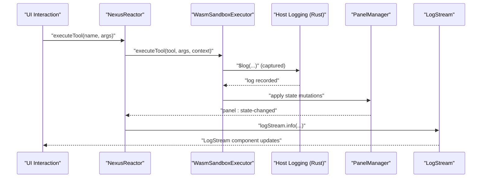
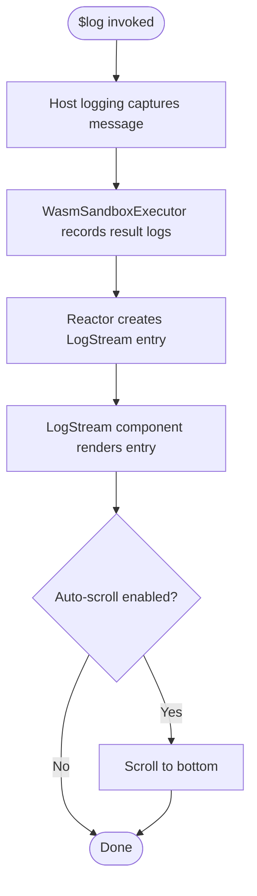
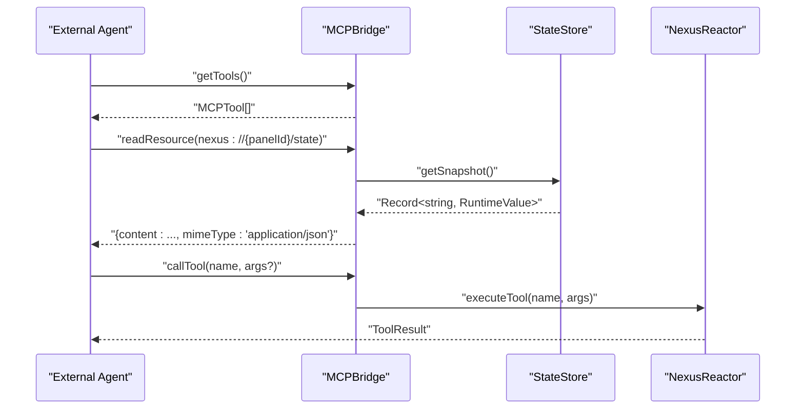
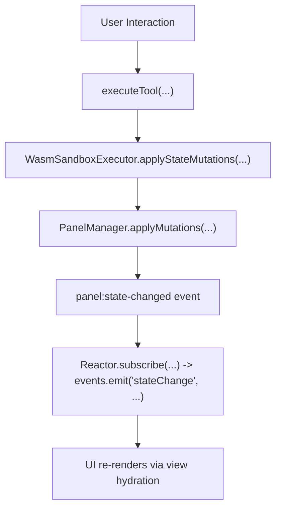
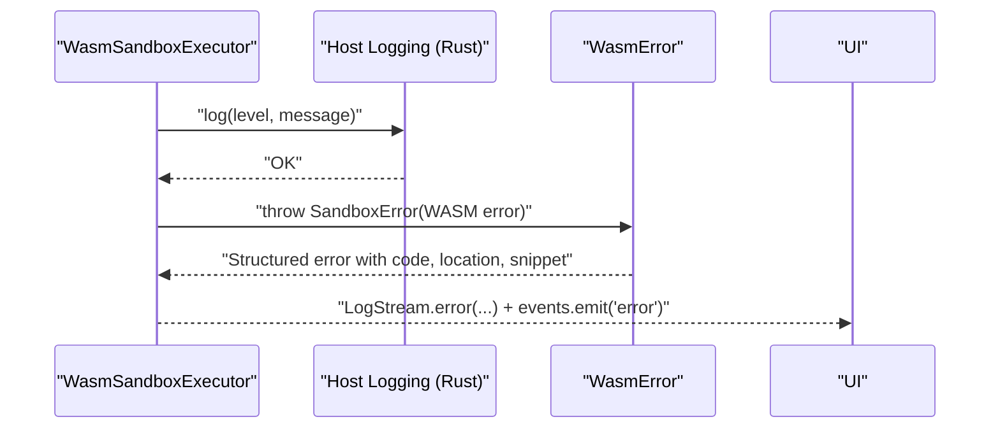
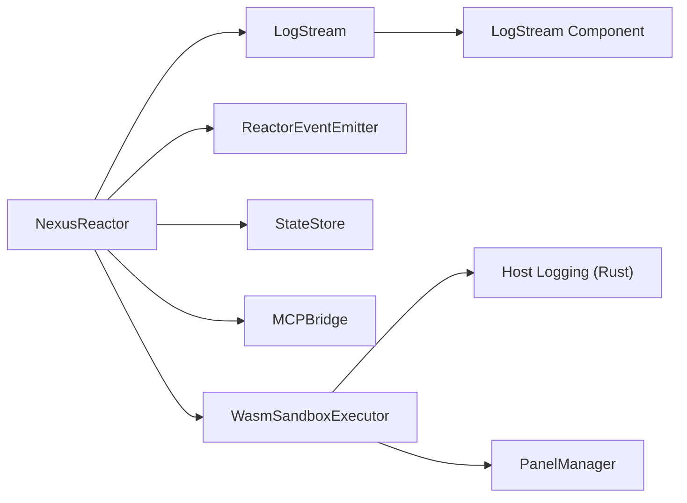

# Advanced Debugging

<cite>
**Referenced Files in This Document**
- [LogStream.tsx](file://packages/nexus-reactor/src/components/LogStream.tsx)
- [events.ts](file://packages/nexus-reactor/src/core/events.ts)
- [reactor.ts](file://packages/nexus-reactor/src/reactor.ts)
- [executor-wasm.ts](file://packages/nexus-reactor/src/sandbox/executor-wasm.ts)
- [debug.ts](file://packages/nexus-reactor/src/utils/debug.ts)
- [logging.rs](file://runtime/nexus-wasm-bridge/src/host_functions/logging.rs)
- [error.rs](file://runtime/nexus-wasm-bridge/src/error.rs)
- [panel.ts](file://runtime/workspace-kernel/src/panel.ts)
- [tools.ts](file://packages/nexus-reactor/src/mcp/tools.ts)
- [bridge.ts](file://packages/nexus-reactor/src/mcp/bridge.ts)
- [store.ts](file://packages/nexus-reactor/src/state/store.ts)
- [01_reactor_spec_VERIFICATION.md](file://docs/01_reactor_spec_VERIFICATION.md)
</cite>

## Table of Contents
1. [Introduction](#introduction)
2. [Project Structure](#project-structure)
3. [Core Components](#core-components)
4. [Architecture Overview](#architecture-overview)
5. [Detailed Component Analysis](#detailed-component-analysis)
6. [Dependency Analysis](#dependency-analysis)
7. [Performance Considerations](#performance-considerations)
8. [Troubleshooting Guide](#troubleshooting-guide)
9. [Conclusion](#conclusion)
10. [Appendices](#appendices)

## Introduction
This document provides advanced debugging techniques for Nexus, focusing on real-time monitoring of handler execution and state mutations, capturing $log statements, inspecting state via the MCP interface, tracing state changes across panel interactions, and diagnosing WASM execution issues including host function call errors and timeouts. It also covers practical debugging scenarios such as infinite loops, memory leaks, and capability permission denials, and explains how to leverage the verification tools described in the reactor specification to validate expected behavior.

## Project Structure
Nexus integrates several subsystems that contribute to debugging:
- Reactor orchestration and logging pipeline
- Sandbox execution with WASM bridge and host function logging
- MCP bridge for tool discovery and state inspection
- State store with reactive change tracking
- Workspace kernel for panel lifecycle and state mutation application

```mermaid
graph TB
subgraph "Frontend"
UI["React Components"]
LogStream["LogStream Component"]
end
subgraph "Reactor"
Reactor["NexusReactor"]
Events["ReactorEventEmitter"]
LogStreamCore["LogStream"]
State["StateStore"]
MCP["MCPBridge"]
end
subgraph "Sandbox"
WasmExec["WasmSandboxExecutor"]
HostLog["Host Logging (Rust)"]
end
subgraph "Kernel"
PanelMgr["PanelManager"]
end
UI --> Reactor
Reactor --> LogStreamCore
Reactor --> Events
Reactor --> State
Reactor --> MCP
Reactor --> WasmExec
WasmExec --> HostLog
WasmExec --> PanelMgr
LogStreamCore --> LogStream
```

**Diagram sources**
- [reactor.ts](file://packages/nexus-reactor/src/reactor.ts#L1-L260)
- [LogStream.tsx](file://packages/nexus-reactor/src/components/LogStream.tsx#L1-L125)
- [events.ts](file://packages/nexus-reactor/src/core/events.ts#L1-L276)
- [executor-wasm.ts](file://packages/nexus-reactor/src/sandbox/executor-wasm.ts#L1-L397)
- [logging.rs](file://runtime/nexus-wasm-bridge/src/host_functions/logging.rs#L1-L170)
- [panel.ts](file://runtime/workspace-kernel/src/panel.ts#L1-L437)

**Section sources**
- [reactor.ts](file://packages/nexus-reactor/src/reactor.ts#L1-L260)
- [LogStream.tsx](file://packages/nexus-reactor/src/components/LogStream.tsx#L1-L125)
- [events.ts](file://packages/nexus-reactor/src/core/events.ts#L1-L276)
- [executor-wasm.ts](file://packages/nexus-reactor/src/sandbox/executor-wasm.ts#L1-L397)
- [logging.rs](file://runtime/nexus-wasm-bridge/src/host_functions/logging.rs#L1-L170)
- [panel.ts](file://runtime/workspace-kernel/src/panel.ts#L1-L437)

## Core Components
- LogStream: A React component that renders a scrollable log buffer with timestamps, levels, and messages. It consumes entries from the internal LogStream.
- ReactorEventEmitter: Central event bus emitting lifecycle and error events; paired with LogStream for error capture.
- WasmSandboxExecutor: Executes handlers in a sandboxed WASM environment, applying state mutations and emitting events, and capturing metrics.
- Host Logging (Rust): Captures $log calls from handlers and records them in the execution context.
- MCPBridge: Exposes tools and state snapshots for inspection by external agents.
- StateStore: Reactive store with dependency tracking and recursion depth protection.

**Section sources**
- [LogStream.tsx](file://packages/nexus-reactor/src/components/LogStream.tsx#L1-L125)
- [events.ts](file://packages/nexus-reactor/src/core/events.ts#L1-L276)
- [reactor.ts](file://packages/nexus-reactor/src/reactor.ts#L1-L260)
- [executor-wasm.ts](file://packages/nexus-reactor/src/sandbox/executor-wasm.ts#L1-L397)
- [logging.rs](file://runtime/nexus-wasm-bridge/src/host_functions/logging.rs#L1-L170)
- [bridge.ts](file://packages/nexus-reactor/src/mcp/bridge.ts#L1-L167)
- [store.ts](file://packages/nexus-reactor/src/state/store.ts#L1-L255)

## Architecture Overview
The debugging pipeline connects handler execution, logging, state mutations, and UI rendering:



**Diagram sources**
- [reactor.ts](file://packages/nexus-reactor/src/reactor.ts#L144-L180)
- [executor-wasm.ts](file://packages/nexus-reactor/src/sandbox/executor-wasm.ts#L132-L199)
- [logging.rs](file://runtime/nexus-wasm-bridge/src/host_functions/logging.rs#L1-L170)
- [panel.ts](file://runtime/workspace-kernel/src/panel.ts#L150-L180)
- [LogStream.tsx](file://packages/nexus-reactor/src/components/LogStream.tsx#L1-L125)

## Detailed Component Analysis

### Real-time Monitoring with LogStream
- The LogStream component displays entries with timestamps, levels, and messages. It auto-scrolls and supports a compact monospace style.
- The internal LogStream collects entries and exposes subscription APIs. The Reactor wires $log calls to LogStream entries and also logs tool failures to the stream.



**Diagram sources**
- [logging.rs](file://runtime/nexus-wasm-bridge/src/host_functions/logging.rs#L1-L170)
- [executor-wasm.ts](file://packages/nexus-reactor/src/sandbox/executor-wasm.ts#L173-L199)
- [reactor.ts](file://packages/nexus-reactor/src/reactor.ts#L232-L254)
- [LogStream.tsx](file://packages/nexus-reactor/src/components/LogStream.tsx#L1-L125)

**Section sources**
- [LogStream.tsx](file://packages/nexus-reactor/src/components/LogStream.tsx#L1-L125)
- [events.ts](file://packages/nexus-reactor/src/core/events.ts#L126-L276)
- [reactor.ts](file://packages/nexus-reactor/src/reactor.ts#L232-L254)

### Using $log Statements in Handlers
- Handlers receive a $log function via the sandbox context. Calls to $log are captured by the host logging facility and forwarded to the LogStream.
- The host logging function accepts a level and message and records them in the execution context.

Practical tips:
- Use $log to trace handler entry/exit, key decisions, and intermediate values.
- Include contextual data objects to enrich logs without changing handler logic.

**Section sources**
- [reactor.ts](file://packages/nexus-reactor/src/reactor.ts#L232-L254)
- [logging.rs](file://runtime/nexus-wasm-bridge/src/host_functions/logging.rs#L1-L170)

### State Inspection via MCP
- The MCP bridge exposes two resources for inspection:
  - nexus://{panelId}/state: returns a JSON snapshot of the current state.
  - nexus://{panelId}/computed: returns computed values derived from the AST.
- Tools are exposed as MCPTool definitions with JSONSchema input schemas for argument validation and discovery.



**Diagram sources**
- [bridge.ts](file://packages/nexus-reactor/src/mcp/bridge.ts#L1-L167)
- [tools.ts](file://packages/nexus-reactor/src/mcp/tools.ts#L1-L170)
- [reactor.ts](file://packages/nexus-reactor/src/reactor.ts#L144-L180)
- [store.ts](file://packages/nexus-reactor/src/state/store.ts#L237-L240)

**Section sources**
- [bridge.ts](file://packages/nexus-reactor/src/mcp/bridge.ts#L1-L167)
- [tools.ts](file://packages/nexus-reactor/src/mcp/tools.ts#L1-L170)
- [store.ts](file://packages/nexus-reactor/src/state/store.ts#L237-L240)

### Tracing State Changes Across Panel Interactions
- The StateStore tracks dependencies and notifies subscribers on updates. A recursion depth guard prevents infinite loops.
- The PanelManager applies state mutations and emits panel:state-changed events. The Reactor listens to state changes and emits its own events.



**Diagram sources**
- [executor-wasm.ts](file://packages/nexus-reactor/src/sandbox/executor-wasm.ts#L330-L342)
- [panel.ts](file://runtime/workspace-kernel/src/panel.ts#L150-L180)
- [store.ts](file://packages/nexus-reactor/src/state/store.ts#L172-L202)
- [reactor.ts](file://packages/nexus-reactor/src/reactor.ts#L92-L96)

**Section sources**
- [store.ts](file://packages/nexus-reactor/src/state/store.ts#L172-L202)
- [panel.ts](file://runtime/workspace-kernel/src/panel.ts#L150-L180)
- [executor-wasm.ts](file://packages/nexus-reactor/src/sandbox/executor-wasm.ts#L330-L342)
- [reactor.ts](file://packages/nexus-reactor/src/reactor.ts#L92-L96)

### Debugging WASM Execution Issues
- Host function call errors: The host logging module records messages and logs to tracing. Errors from host functions (e.g., permission denials) propagate back to the JS layer as structured errors.
- Timeout exceptions: The executor enforces handler timeouts and records metrics. The kernel tracks suspension lifecycles and can cancel long-running suspensions.
- Capability permission denials: The runtime defines capability tokens and checks permissions for state reads/writes, event emissions, view updates, and extension access.



**Diagram sources**
- [logging.rs](file://runtime/nexus-wasm-bridge/src/host_functions/logging.rs#L1-L170)
- [error.rs](file://runtime/nexus-wasm-bridge/src/error.rs#L1-L395)
- [executor-wasm.ts](file://packages/nexus-reactor/src/sandbox/executor-wasm.ts#L173-L199)
- [reactor.ts](file://packages/nexus-reactor/src/reactor.ts#L168-L179)

**Section sources**
- [error.rs](file://runtime/nexus-wasm-bridge/src/error.rs#L1-L395)
- [logging.rs](file://runtime/nexus-wasm-bridge/src/host_functions/logging.rs#L1-L170)
- [executor-wasm.ts](file://packages/nexus-reactor/src/sandbox/executor-wasm.ts#L173-L199)
- [panel.ts](file://runtime/workspace-kernel/src/panel.ts#L212-L293)

### Common Debugging Scenarios

#### Infinite Loops
- Symptom: UI freezes or excessive CPU usage.
- Mechanisms:
  - Synchronous handler timeout enforced by the executor.
  - Reactive loop detection via recursion depth guard in the state store.
- Actionable steps:
  - Enable debug mode to capture detailed logs.
  - Inspect the LogStream for repeated entries indicating stuck handlers.
  - Reduce handler complexity or split into smaller handlers.

**Section sources**
- [executor-wasm.ts](file://packages/nexus-reactor/src/sandbox/executor-wasm.ts#L173-L199)
- [store.ts](file://packages/nexus-reactor/src/state/store.ts#L182-L202)
- [01_reactor_spec_VERIFICATION.md](file://docs/01_reactor_spec_VERIFICATION.md#L791-L800)

#### Memory Leaks
- Symptom: Increasing memory usage over time.
- Mechanisms:
  - The runtime defines memory limit error codes and can surface memory-related errors.
- Actionable steps:
  - Review handler code for large allocations or unbounded growth.
  - Use the LogStream to correlate memory spikes with specific tools.
  - Validate that handlers release references promptly.

**Section sources**
- [error.rs](file://runtime/nexus-wasm-bridge/src/error.rs#L1-L395)

#### Capability Permission Denials
- Symptom: Host function calls fail with permission errors.
- Mechanisms:
  - Capability tokens define allowed operations; the runtime checks permissions for state, events, view updates, and extension access.
- Actionable steps:
  - Inspect the error code and message to identify the required capability.
  - Adjust handler capabilities or grant appropriate tokens.
  - Verify that the handler’s declared capabilities match intended operations.

**Section sources**
- [error.rs](file://runtime/nexus-wasm-bridge/src/error.rs#L1-L395)

### Verification Tools for Expected Behavior
- The reactor specification outlines verification criteria and provides evidence paths for each requirement. Use these as a checklist to validate behavior during debugging.
- Key areas to verify:
  - Data flow and side-channel behavior
  - Tool discovery and state inspection
  - Error handling strategy and sandbox behavior
  - Infinite loop protections and timeouts

**Section sources**
- [01_reactor_spec_VERIFICATION.md](file://docs/01_reactor_spec_VERIFICATION.md#L1-L200)
- [01_reactor_spec_VERIFICATION.md](file://docs/01_reactor_spec_VERIFICATION.md#L741-L800)

## Dependency Analysis
The following diagram highlights key dependencies among debugging-critical components:



**Diagram sources**
- [reactor.ts](file://packages/nexus-reactor/src/reactor.ts#L1-L260)
- [LogStream.tsx](file://packages/nexus-reactor/src/components/LogStream.tsx#L1-L125)
- [events.ts](file://packages/nexus-reactor/src/core/events.ts#L1-L276)
- [executor-wasm.ts](file://packages/nexus-reactor/src/sandbox/executor-wasm.ts#L1-L397)
- [panel.ts](file://runtime/workspace-kernel/src/panel.ts#L1-L437)

**Section sources**
- [reactor.ts](file://packages/nexus-reactor/src/reactor.ts#L1-L260)
- [LogStream.tsx](file://packages/nexus-reactor/src/components/LogStream.tsx#L1-L125)
- [events.ts](file://packages/nexus-reactor/src/core/events.ts#L1-L276)
- [executor-wasm.ts](file://packages/nexus-reactor/src/sandbox/executor-wasm.ts#L1-L397)
- [panel.ts](file://runtime/workspace-kernel/src/panel.ts#L1-L437)

## Performance Considerations
- Use the debug utilities to measure handler execution time and identify hotspots.
- Prefer granular $log statements to minimize overhead.
- Avoid excessive state updates in tight loops; batch updates when possible.

**Section sources**
- [debug.ts](file://packages/nexus-reactor/src/utils/debug.ts#L80-L144)

## Troubleshooting Guide
- Enabling debug mode:
  - Set debug mode in the Reactor configuration to enable verbose logs across subsystems.
- Capturing errors:
  - Tool failures are logged to the LogStream and emitted as system errors; subscribe to the event bus to react to failures.
- Inspecting state:
  - Use MCP readResource to fetch state and computed values snapshots.
- Investigating WASM errors:
  - Look for structured error codes and locations; use source snippets to locate problematic lines.
- Handling timeouts:
  - Confirm handler timeout settings and reduce handler complexity or split long-running tasks.

**Section sources**
- [reactor.ts](file://packages/nexus-reactor/src/reactor.ts#L42-L67)
- [events.ts](file://packages/nexus-reactor/src/core/events.ts#L1-L121)
- [bridge.ts](file://packages/nexus-reactor/src/mcp/bridge.ts#L47-L71)
- [error.rs](file://runtime/nexus-wasm-bridge/src/error.rs#L1-L395)

## Conclusion
Nexus provides a comprehensive debugging toolkit: a real-time LogStream, robust event emission, MCP-based state inspection, and a sandboxed WASM execution environment with structured error reporting. By combining these tools—especially $log statements, state snapshots, and error inspection—you can quickly diagnose handler execution issues, trace state mutations, and validate expected behavior against the reactor specification.

## Appendices
- Practical debugging checklist:
  - Enable debug mode and review LogStream entries.
  - Use MCP to fetch state snapshots and computed values.
  - Inspect error codes and source locations for WASM failures.
  - Validate handler timeouts and recursion depth limits.
  - Verify capability tokens align with handler operations.