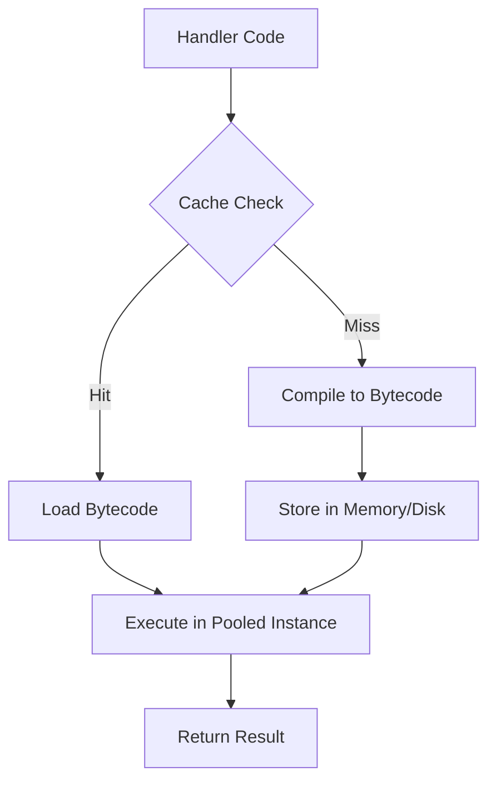
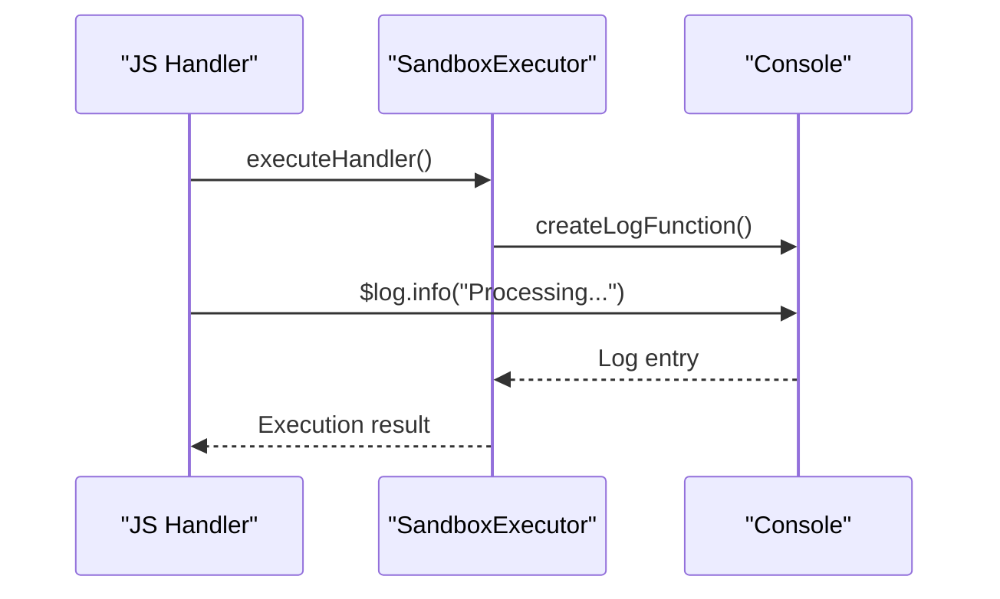
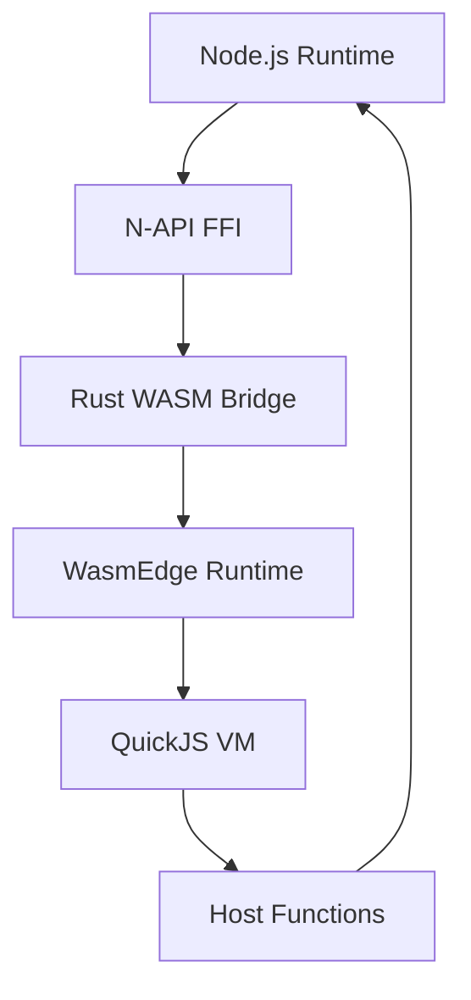

# Advanced Topics

<cite>
**Referenced Files in This Document**   
- [nexus_spec.md](file://docs/nexus_spec.md)
- [bridge.ts](file://packages/nexus-reactor/src/mcp/bridge.ts)
- [executor.ts](file://packages/nexus-reactor/src/sandbox/executor.ts)
- [registry.ts](file://packages/nexus-reactor/src/view/registry.ts)
- [store.ts](file://packages/nexus-reactor/src/state/store.ts)
- [debug.ts](file://packages/nexus-reactor/src/utils/debug.ts)
- [lib.rs](file://runtime/nexus-wasm-bridge/src/lib.rs)
- [mod.rs](file://runtime/nexus-wasm-bridge/src/engine/mod.rs)
- [compiler.rs](file://runtime/nexus-wasm-bridge/src/engine/compiler.rs)
- [pool.rs](file://runtime/nexus-wasm-bridge/src/engine/pool.rs)
- [napi.rs](file://runtime/nexus-wasm-bridge/src/napi.rs)
</cite>

## Table of Contents
1. [Custom Extension Development](#custom-extension-development)
2. [Performance Optimization for Large Panels](#performance-optimization-for-large-panels)
3. [Advanced Debugging Techniques](#advanced-debugging-techniques)
4. [WASM Bridge and Host Functions](#wasm-bridge-and-host-functions)
5. [Reusable Panel Templates and Business Logic](#reusable-panel-templates-and-business-logic)
6. [Internationalization and Accessibility](#internationalization-and-accessibility)

## Custom Extension Development

Nexus supports custom extension development through its plugin system, enabling developers to register new components and expose them via the MCP (Model Control Protocol) interface. The MCP bridge, implemented in `bridge.ts`, facilitates communication between panel tools and AI agents by exposing panel state and available tools as standardized resources.

Extensions are defined within the NXML specification under the `<Extension>` tag and must declare required capabilities such as state access, event emission, or view manipulation. These capabilities are enforced at runtime by the WASM sandbox using a capability-based security model. When a panel is initialized, the `createMCPBridge` function registers all declared tools and generates a JSON Schema representation of the panel’s state for AI context understanding.

Extensions can be embedded within panel templates and registered in a global extension registry, allowing secure integration with external services such as private LLM endpoints or local data sources. The host function system in the WASM bridge enables controlled access to these extensions through proxy objects that validate method calls and serialize arguments using MessagePack.

**Section sources**
- [nexus_spec.md](file://docs/nexus_spec.md#L59-L60)
- [bridge.ts](file://packages/nexus-reactor/src/mcp/bridge.ts#L1-L167)

## Performance Optimization for Large Panels

To ensure optimal performance in large-scale panels, Nexus implements several optimization strategies including lazy loading, state tree pruning, and WASM compilation caching.

Lazy loading is achieved through dynamic component registration in the view registry (`registry.ts`), where components are only instantiated when they enter the active scope. The `registerComponent` and `unregisterComponent` functions manage lifecycle hooks and transient prop overrides, minimizing memory footprint by deferring initialization until necessary.

State tree pruning leverages a reactive proxy system (`store.ts`) that tracks dependencies and invalidates computed values only when relevant state changes occur. This reduces unnecessary re-renders and ensures efficient updates across deeply nested data structures. Subscribers are notified selectively based on key access patterns, preventing cascading updates.

WASM compilation caching is managed by the `HandlerCompiler` in `compiler.rs`, which uses SHA-256 hashing of source code to generate cache keys. Both in-memory and optional disk-based caching store compiled QuickJS bytecode, significantly reducing handler execution latency on subsequent runs. The compiler also performs LRU eviction to maintain bounded memory usage.

Instance pooling, implemented in `pool.rs`, further enhances performance by reusing WASM instances across executions. A semaphore-controlled pool limits concurrent instances while maintaining pre-warmed instances for low-latency startup.

**Diagram sources **
- [compiler.rs](file://runtime/nexus-wasm-bridge/src/engine/compiler.rs#L1-L567)
- [pool.rs](file://runtime/nexus-wasm-bridge/src/engine/pool.rs#L1-L395)

**Section sources**
- [store.ts](file://packages/nexus-reactor/src/state/store.ts#L1-L255)
- [registry.ts](file://packages/nexus-reactor/src/view/registry.ts#L1-L187)

## Advanced Debugging Techniques

Nexus provides robust debugging capabilities through built-in log streaming and state inspection tools. The `LogStream` component in `executor.ts` captures execution traces from within the WASM sandbox and forwards them to the frontend via the `$log` API. Developers can use `createLogFunction` to inject structured logging into handler contexts, supporting debug, info, warn, and error levels.

The state inspection system allows real-time monitoring of the reactive state tree. By calling `getSnapshot` on the state store, developers can retrieve a serialized copy of the current state for analysis. The `trackAccess` utility enables fine-grained dependency tracking during computed value evaluation, helping identify unintended re-renders.

Debug mode is globally controlled via `setDebugMode`, which activates verbose console output across all subsystems. Namespaced debuggers created with `createDebugger` provide isolated logging channels for components such as "sandbox", "view-registry", and "mcp". Performance profiling is supported through `measureTime` and `measureTimeAsync`, which log execution duration for critical operations.

**Diagram sources **
- [executor.ts](file://packages/nexus-reactor/src/sandbox/executor.ts#L1-L161)
- [debug.ts](file://packages/nexus-reactor/src/utils/debug.ts#L1-L188)

**Section sources**
- [debug.ts](file://packages/nexus-reactor/src/utils/debug.ts#L1-L188)
- [executor.ts](file://packages/nexus-reactor/src/sandbox/executor.ts#L1-L161)

## WASM Bridge and Host Functions

The Nexus WASM bridge, implemented in Rust using WasmEdge and QuickJS, provides secure execution of JavaScript handlers through N-API integration. The bridge exposes a Node.js-compatible interface via `napi.rs`, allowing the Reactor runtime to invoke sandboxed code with full type safety and error handling.

Host functions are defined in the `host_functions` module and include operations for state manipulation (`__nexus_state_get/set`), event emission (`__nexus_emit_event`), view control (`__nexus_view_set_filter`), and extension calls (`__nexus_ext_call`). Each host function is subject to rate limiting and capability checks to prevent abuse.

The `WasmRuntime` in `mod.rs` manages the entire execution lifecycle, including compilation, instance pooling, and suspension/resumption of async operations via Asyncify. When a handler makes an asynchronous call (e.g., to an extension), the runtime suspends execution, returns control to Node.js, and resumes once the result is available.

Compilation caching is persistent across restarts when a cache directory is configured. The `precompile_handler` and `execute_compiled_handler` functions allow ahead-of-time compilation for frequently used handlers, reducing cold-start latency.

**Diagram sources **
- [lib.rs](file://runtime/nexus-wasm-bridge/src/lib.rs#L1-L71)
- [napi.rs](file://runtime/nexus-wasm-bridge/src/napi.rs#L1-L491)

**Section sources**
- [lib.rs](file://runtime/nexus-wasm-bridge/src/lib.rs#L1-L71)
- [napi.rs](file://runtime/nexus-wasm-bridge/src/napi.rs#L1-L491)

## Reusable Panel Templates and Business Logic

Panel templates in Nexus are defined using NXML, a semantic markup language that separates data, logic, and view concerns. Reusable templates can be created by parameterizing state definitions and tool handlers, allowing instantiation across multiple workspaces with different configurations.

Complex business logic is implemented through composable tool chains in the `<Logic>` section. Tools can trigger other tools via `$emit`, enabling event-driven workflows. Computed state values, defined in the `<Data>` section, allow derived state to be expressed declaratively and updated reactively.

Templates are version-controlled using Git, enabling collaboration and rollback. The state engine ensures consistency across instances by synchronizing changes through NOG (Nexus Object Graph) and applying patches only after user review.

**Section sources**
- [nexus_spec.md](file://docs/nexus_spec.md#L108-L184)

## Internationalization and Accessibility

Nexus supports internationalization through dynamic text binding in the view layer. Labels and messages in components can be bound to localized strings stored in state, enabling runtime language switching. The system does not currently provide built-in translation services but allows integration with external i18n providers via extensions.

Accessibility compliance is ensured through semantic component design and ARIA attribute support in all UI elements. The `Text`, `Button`, and `Input` components include accessibility props such as `aria-label`, `role`, and keyboard navigation support. Focus management is handled through the `$view.focus()` API, allowing programmatic control over screen reader flow.

Cross-browser compatibility is maintained by targeting modern ES2022+ standards and using WasmEdge for consistent execution across environments. The React-based rendering layer ensures compatibility with all major browsers that support WebAssembly.

**Section sources**
- [nexus_spec.md](file://docs/nexus_spec.md#L76-L78)
- [components/](file://packages/nexus-reactor/src/components/)