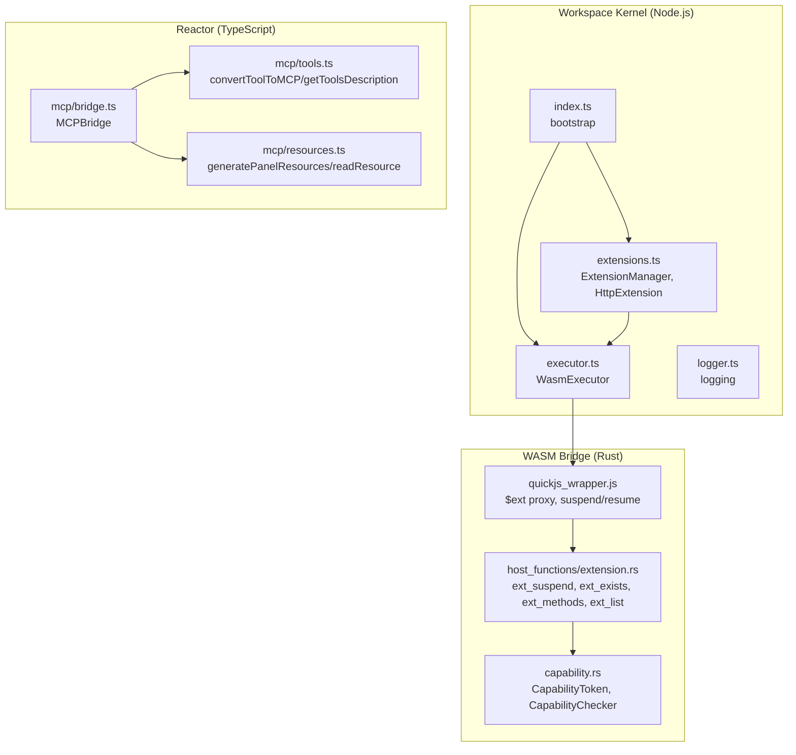
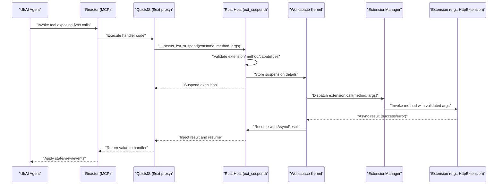
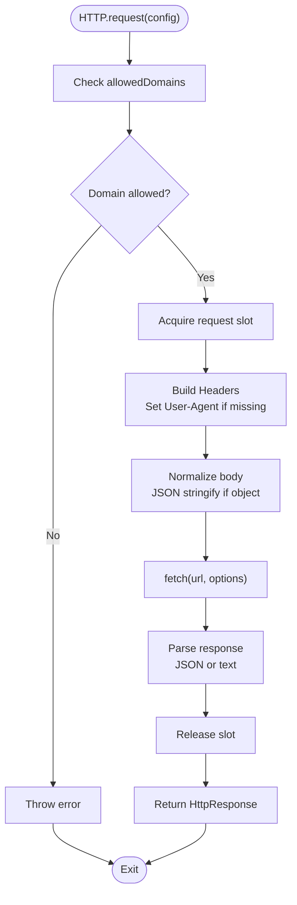
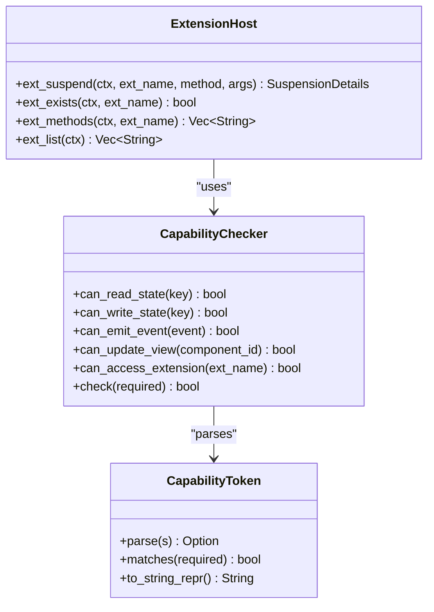
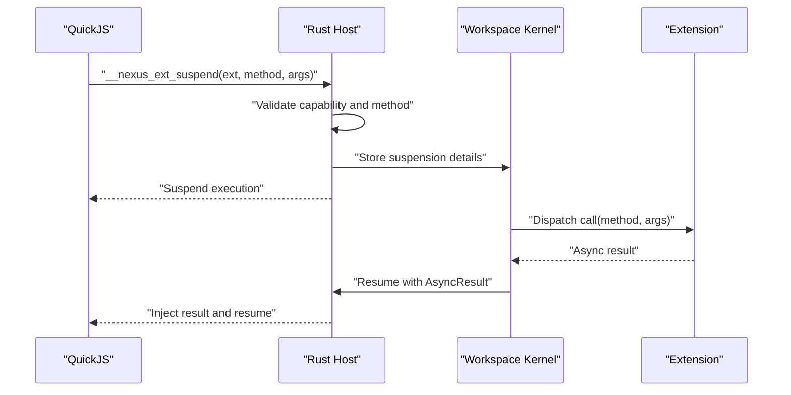
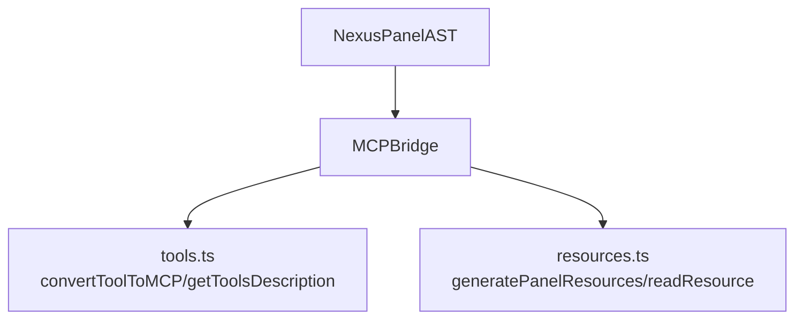
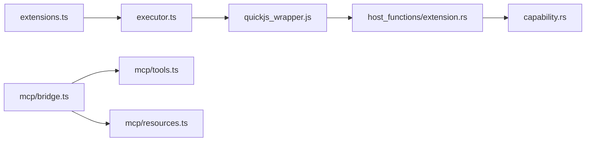

# Custom Extensions

<cite>
**Referenced Files in This Document**
- [extensions.ts](file://runtime/workspace-kernel/src/extensions.ts)
- [types.ts](file://runtime/workspace-kernel/src/types.ts)
- [index.ts](file://runtime/workspace-kernel/src/index.ts)
- [executor.ts](file://runtime/workspace-kernel/src/executor.ts)
- [logger.ts](file://runtime/workspace-kernel/src/logger.ts)
- [extension.rs](file://runtime/nexus-wasm-bridge/src/host_functions/extension.rs)
- [capability.rs](file://runtime/nexus-wasm-bridge/src/capability.rs)
- [quickjs_wrapper.js](file://runtime/nexus-wasm-bridge/src/quickjs_wrapper.js)
- [02_runtime_spec.md](file://docs/02_runtime_spec.md)
- [bridge.ts](file://packages/nexus-reactor/src/mcp/bridge.ts)
- [resources.ts](file://packages/nexus-reactor/src/mcp/resources.ts)
- [tools.ts](file://packages/nexus-reactor/src/mcp/tools.ts)
- [README.md](file://packages/nexus-reactor/README.md)
</cite>

## Table of Contents
1. [Introduction](#introduction)
2. [Project Structure](#project-structure)
3. [Core Components](#core-components)
4. [Architecture Overview](#architecture-overview)
5. [Detailed Component Analysis](#detailed-component-analysis)
6. [Dependency Analysis](#dependency-analysis)
7. [Performance Considerations](#performance-considerations)
8. [Troubleshooting Guide](#troubleshooting-guide)
9. [Conclusion](#conclusion)
10. [Appendices](#appendices)

## Introduction
This document explains how to develop custom extensions for Nexus and expose them through the MCP interface. It covers:
- How to create and register new extensions in the workspace-kernel
- How to define extension metadata, methods, and capability tokens
- How HTTP, database, and AI service integrations are implemented
- The lifecycle of an extension call from NXML declaration to host function invocation in the WASM sandbox
- Security considerations for capability-based access control and input validation
- Common issues around async handling with suspension/resume patterns and error propagation
- Best practices for designing reusable, composable extensions

## Project Structure
The extension system spans three layers:
- Workspace Kernel (Node.js): registers and dispatches extensions, initializes runtime, and exposes the MCP bridge
- WASM Bridge (Rust/QuickJS): hosts the sandbox, enforces capabilities, and suspends/resumes handlers for async extension calls
- Reactor (TypeScript): converts NXML tools/resources to MCP-compatible schemas and surfaces them to AI agents

**Diagram sources**
- [index.ts](file://runtime/workspace-kernel/src/index.ts#L1-L149)
- [extensions.ts](file://runtime/workspace-kernel/src/extensions.ts#L1-L397)
- [executor.ts](file://runtime/workspace-kernel/src/executor.ts#L1-L541)
- [logger.ts](file://runtime/workspace-kernel/src/logger.ts#L1-L90)
- [capability.rs](file://runtime/nexus-wasm-bridge/src/capability.rs#L1-L384)
- [extension.rs](file://runtime/nexus-wasm-bridge/src/host_functions/extension.rs#L1-L233)
- [quickjs_wrapper.js](file://runtime/nexus-wasm-bridge/src/quickjs_wrapper.js#L208-L285)
- [bridge.ts](file://packages/nexus-reactor/src/mcp/bridge.ts#L1-L167)
- [resources.ts](file://packages/nexus-reactor/src/mcp/resources.ts#L1-L169)
- [tools.ts](file://packages/nexus-reactor/src/mcp/tools.ts#L1-L170)

**Section sources**
- [index.ts](file://runtime/workspace-kernel/src/index.ts#L1-L149)
- [extensions.ts](file://runtime/workspace-kernel/src/extensions.ts#L1-L397)
- [executor.ts](file://runtime/workspace-kernel/src/executor.ts#L1-L541)
- [capability.rs](file://runtime/nexus-wasm-bridge/src/capability.rs#L1-L384)
- [extension.rs](file://runtime/nexus-wasm-bridge/src/host_functions/extension.rs#L1-L233)
- [quickjs_wrapper.js](file://runtime/nexus-wasm-bridge/src/quickjs_wrapper.js#L208-L285)
- [bridge.ts](file://packages/nexus-reactor/src/mcp/bridge.ts#L1-L167)
- [resources.ts](file://packages/nexus-reactor/src/mcp/resources.ts#L1-L169)
- [tools.ts](file://packages/nexus-reactor/src/mcp/tools.ts#L1-L170)

## Core Components
- ExtensionManager: central registry and dispatcher for extensions; validates existence and methods; logs lifecycle
- HttpExtension: built-in HTTP client with concurrency control, timeouts, domain restrictions, and response parsing
- WasmExecutor: bridges Node.js to the native WASM runtime; encodes/decodes contexts/results; handles suspend/resume
- Capability system: defines tokens and checks for state, events, view updates, and extension access
- QuickJS wrapper: injects $ext proxy; encodes/decodes args; suspends execution and resumes with results
- MCP bridge: converts NXML tools/resources to MCP-compatible schemas; surfaces panel state and computed values

**Section sources**
- [extensions.ts](file://runtime/workspace-kernel/src/extensions.ts#L1-L397)
- [types.ts](file://runtime/workspace-kernel/src/types.ts#L275-L368)
- [executor.ts](file://runtime/workspace-kernel/src/executor.ts#L1-L541)
- [capability.rs](file://runtime/nexus-wasm-bridge/src/capability.rs#L1-L384)
- [extension.rs](file://runtime/nexus-wasm-bridge/src/host_functions/extension.rs#L1-L233)
- [quickjs_wrapper.js](file://runtime/nexus-wasm-bridge/src/quickjs_wrapper.js#L208-L285)
- [bridge.ts](file://packages/nexus-reactor/src/mcp/bridge.ts#L1-L167)

## Architecture Overview
The extension call lifecycle from NXML to host function invocation:

**Diagram sources**
- [quickjs_wrapper.js](file://runtime/nexus-wasm-bridge/src/quickjs_wrapper.js#L208-L285)
- [extension.rs](file://runtime/nexus-wasm-bridge/src/host_functions/extension.rs#L1-L233)
- [extensions.ts](file://runtime/workspace-kernel/src/extensions.ts#L1-L397)
- [executor.ts](file://runtime/workspace-kernel/src/executor.ts#L1-L541)
- [02_runtime_spec.md](file://docs/02_runtime_spec.md#L560-L759)

## Detailed Component Analysis

### Extension Registration and Management
- Registration: Workspace Kernel initializes extensions and registers built-ins (e.g., HTTP). Extensions are stored in a map keyed by name.
- Dispatch: ExtensionManager validates extension existence and method presence before delegating to the extension’s call method.
- Lifecycle: init/shutdown are invoked on all registered extensions; logging tracks initialization and shutdown.

Implementation highlights:
- Registration and dispatch logic
- Concurrency-safe method lookup
- Initialization and shutdown orchestration

Security and validation:
- Throws explicit errors when extension or method is missing
- Logs extension registration and method invocations

**Section sources**
- [extensions.ts](file://runtime/workspace-kernel/src/extensions.ts#L1-L111)
- [extensions.ts](file://runtime/workspace-kernel/src/extensions.ts#L371-L397)
- [index.ts](file://runtime/workspace-kernel/src/index.ts#L36-L58)

### HTTP Extension Integration
The HTTP extension demonstrates:
- Configurable concurrency limits and timeouts
- Domain allow-list enforcement
- Request building with headers/body normalization
- Response parsing for JSON or text
- Slot acquisition/releasing with a pending queue

Key behaviors:
- URL domain validation against allowed list
- Timeout handling via AbortController
- Content-type inference and response parsing
- Concurrency control with acquire/release slots

**Diagram sources**
- [extensions.ts](file://runtime/workspace-kernel/src/extensions.ts#L223-L302)

**Section sources**
- [extensions.ts](file://runtime/workspace-kernel/src/extensions.ts#L113-L302)
- [types.ts](file://runtime/workspace-kernel/src/types.ts#L291-L301)

### Capability-Based Access Control
Capabilities are enforced at the host boundary:
- Tokens represent scoped permissions (state read/write, events emit, view update, extension access)
- CapabilityChecker determines whether a required capability is satisfied
- Extension access checks use tokens like “ext:name” or “ext:*”

Runtime enforcement:
- ext_suspend verifies extension existence and method availability
- Checks required capability “ext:name” or wildcard “ext:*”
- Returns permission denied when unauthorized

**Diagram sources**
- [capability.rs](file://runtime/nexus-wasm-bridge/src/capability.rs#L1-L384)
- [extension.rs](file://runtime/nexus-wasm-bridge/src/host_functions/extension.rs#L1-L112)

**Section sources**
- [capability.rs](file://runtime/nexus-wasm-bridge/src/capability.rs#L1-L384)
- [extension.rs](file://runtime/nexus-wasm-bridge/src/host_functions/extension.rs#L1-L112)

### WASM Sandbox and Suspension/Resume
The sandbox:
- Injects $ext proxy that encodes arguments and invokes __nexus_ext_suspend
- Suspends execution and waits for a resume signal
- Decodes results and propagates errors

Host-side enforcement:
- Validates extension/method/capabilities
- Stores suspension state and returns suspension details
- On resume, injects success/failure and value into the sandbox

**Diagram sources**
- [quickjs_wrapper.js](file://runtime/nexus-wasm-bridge/src/quickjs_wrapper.js#L208-L285)
- [extension.rs](file://runtime/nexus-wasm-bridge/src/host_functions/extension.rs#L1-L112)
- [executor.ts](file://runtime/workspace-kernel/src/executor.ts#L282-L303)

**Section sources**
- [quickjs_wrapper.js](file://runtime/nexus-wasm-bridge/src/quickjs_wrapper.js#L208-L285)
- [extension.rs](file://runtime/nexus-wasm-bridge/src/host_functions/extension.rs#L1-L112)
- [executor.ts](file://runtime/workspace-kernel/src/executor.ts#L282-L303)
- [02_runtime_spec.md](file://docs/02_runtime_spec.md#L560-L759)

### MCP Exposure of Tools and Resources
The MCP bridge:
- Converts NXML tools to MCPTool definitions with JSON schema input schemas
- Generates panel resources (state, computed, meta) with URIs
- Reads resources by URI and returns content/mime type
- Calls tools via the workspace kernel

**Diagram sources**
- [bridge.ts](file://packages/nexus-reactor/src/mcp/bridge.ts#L1-L167)
- [tools.ts](file://packages/nexus-reactor/src/mcp/tools.ts#L1-L170)
- [resources.ts](file://packages/nexus-reactor/src/mcp/resources.ts#L1-L169)

**Section sources**
- [bridge.ts](file://packages/nexus-reactor/src/mcp/bridge.ts#L1-L167)
- [tools.ts](file://packages/nexus-reactor/src/mcp/tools.ts#L1-L170)
- [resources.ts](file://packages/nexus-reactor/src/mcp/resources.ts#L1-L169)

### Creating a Custom Extension
Steps to build a custom extension:
1. Define metadata and methods
   - Implement the Extension interface with name, methods, and optional init/shutdown
   - Provide a call method that dispatches to the appropriate method
2. Register the extension
   - Use the ExtensionManager to register your extension
   - Initialize extensions during startup
3. Enforce capability tokens
   - Require “ext:name” or “ext:*” capability tokens in NXML
   - The host enforces capability checks on ext_suspend
4. Integrate with the sandbox
   - The $ext proxy automatically exposes your extension by name
   - Args are encoded/decoded via MessagePack
5. Surface tools via MCP
   - Add Tool nodes in NXML with Handler code that calls $ext
   - Use the MCP bridge to publish tools and resources

Concrete examples from the repository:
- Built-in HTTP extension demonstrates request/response handling, concurrency, and domain restrictions
- MCP bridge shows how to convert NXML tools to MCPTool definitions and generate resources

**Section sources**
- [extensions.ts](file://runtime/workspace-kernel/src/extensions.ts#L1-L111)
- [extensions.ts](file://runtime/workspace-kernel/src/extensions.ts#L371-L397)
- [index.ts](file://runtime/workspace-kernel/src/index.ts#L36-L58)
- [README.md](file://packages/nexus-reactor/README.md#L327-L371)

## Dependency Analysis
- Workspace Kernel depends on:
  - ExtensionManager for extension lifecycle
  - WasmExecutor for sandbox execution and suspend/resume
  - Logger for operational visibility
- WASM Bridge depends on:
  - Capability system for permission checks
  - QuickJS wrapper for $ext proxy and suspend/resume
- Reactor depends on:
  - MCP bridge for tool/resource exposure
  - Tools and resources utilities for schema generation

**Diagram sources**
- [extensions.ts](file://runtime/workspace-kernel/src/extensions.ts#L1-L397)
- [executor.ts](file://runtime/workspace-kernel/src/executor.ts#L1-L541)
- [quickjs_wrapper.js](file://runtime/nexus-wasm-bridge/src/quickjs_wrapper.js#L208-L285)
- [extension.rs](file://runtime/nexus-wasm-bridge/src/host_functions/extension.rs#L1-L233)
- [capability.rs](file://runtime/nexus-wasm-bridge/src/capability.rs#L1-L384)
- [bridge.ts](file://packages/nexus-reactor/src/mcp/bridge.ts#L1-L167)
- [tools.ts](file://packages/nexus-reactor/src/mcp/tools.ts#L1-L170)
- [resources.ts](file://packages/nexus-reactor/src/mcp/resources.ts#L1-L169)

**Section sources**
- [extensions.ts](file://runtime/workspace-kernel/src/extensions.ts#L1-L397)
- [executor.ts](file://runtime/workspace-kernel/src/executor.ts#L1-L541)
- [capability.rs](file://runtime/nexus-wasm-bridge/src/capability.rs#L1-L384)
- [extension.rs](file://runtime/nexus-wasm-bridge/src/host_functions/extension.rs#L1-L233)
- [quickjs_wrapper.js](file://runtime/nexus-wasm-bridge/src/quickjs_wrapper.js#L208-L285)
- [bridge.ts](file://packages/nexus-reactor/src/mcp/bridge.ts#L1-L167)
- [tools.ts](file://packages/nexus-reactor/src/mcp/tools.ts#L1-L170)
- [resources.ts](file://packages/nexus-reactor/src/mcp/resources.ts#L1-L169)

## Performance Considerations
- Concurrency control: The HTTP extension uses a slot-based queue to limit concurrent requests; tune maxConcurrent to balance throughput and resource usage.
- Timeouts: Configure defaultTimeout to prevent long-running requests from blocking slots; ensure AbortController aborts propagate as timeout errors.
- Serialization: MessagePack encoding/decoding minimizes overhead; keep argument shapes compact.
- Caching: Precompile handlers to bytecode to reduce JIT overhead; leverage cacheDir and maxCacheSizeBytes where supported.
- Logging: Use appropriate log levels to avoid excessive I/O during high-throughput scenarios.

[No sources needed since this section provides general guidance]

## Troubleshooting Guide
Common issues and resolutions:
- Permission denied when calling $ext.method
  - Ensure the handler declares the required capability “ext:name” or “ext:*”
  - Verify the extension is registered and methods are declared
- Unknown extension or method
  - Confirm extension name and method exist in the registry
  - Use $ext.list(), $ext.exists(), and $ext.methods() helpers
- Timeout errors
  - Increase defaultTimeout or per-request timeout
  - Check network connectivity and upstream service health
- Concurrency saturation
  - Reduce maxConcurrent or fan-out calls
  - Implement backoff and retry in the handler
- Error propagation
  - Inspect ExecutionError fields (code, message, location)
  - Use AsyncResult.success/error to propagate failures from host to sandbox

**Section sources**
- [extension.rs](file://runtime/nexus-wasm-bridge/src/host_functions/extension.rs#L1-L112)
- [executor.ts](file://runtime/workspace-kernel/src/executor.ts#L372-L413)
- [extensions.ts](file://runtime/workspace-kernel/src/extensions.ts#L223-L302)

## Conclusion
Nexus provides a robust, capability-driven extension framework:
- Extensions are registered centrally and dispatched by name
- The WASM sandbox enforces capability checks and supports suspension/resume for async calls
- MCP bridges NXML tools/resources to AI agents
- Built-in HTTP extension illustrates best practices for concurrency, timeouts, and input validation
Adhering to capability tokens and suspension semantics ensures secure, responsive, and composable extensions.

[No sources needed since this section summarizes without analyzing specific files]

## Appendices

### Best Practices for Custom Extensions
- Define minimal, focused methods; compose extensions rather than monolithic APIs
- Validate inputs early; reject invalid configurations before making external calls
- Use capability tokens to scope access; prefer least privilege
- Implement init/shutdown for resource cleanup and warm-up
- Provide clear error messages and distinguish transient vs permanent failures
- Use concurrency controls and timeouts to protect shared resources
- Keep argument shapes small and serializable; leverage MessagePack efficiently

[No sources needed since this section provides general guidance]