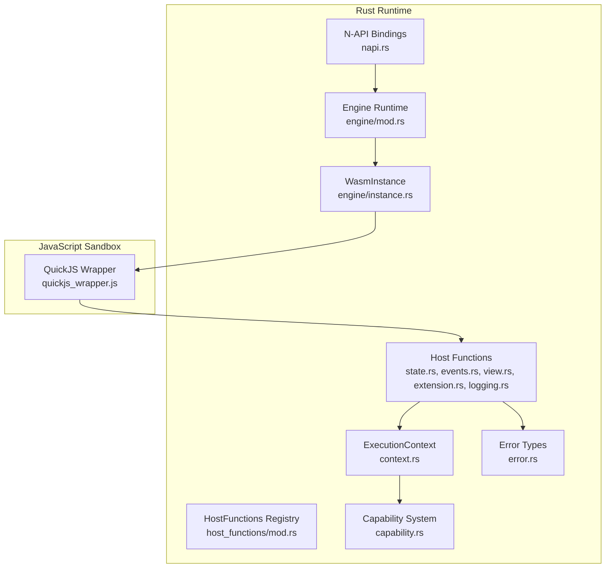
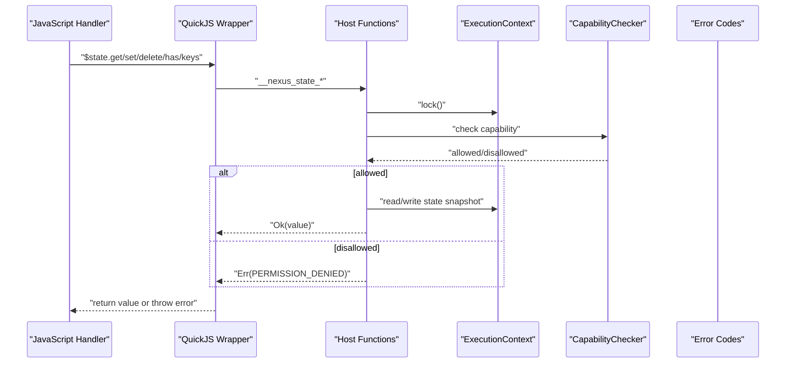
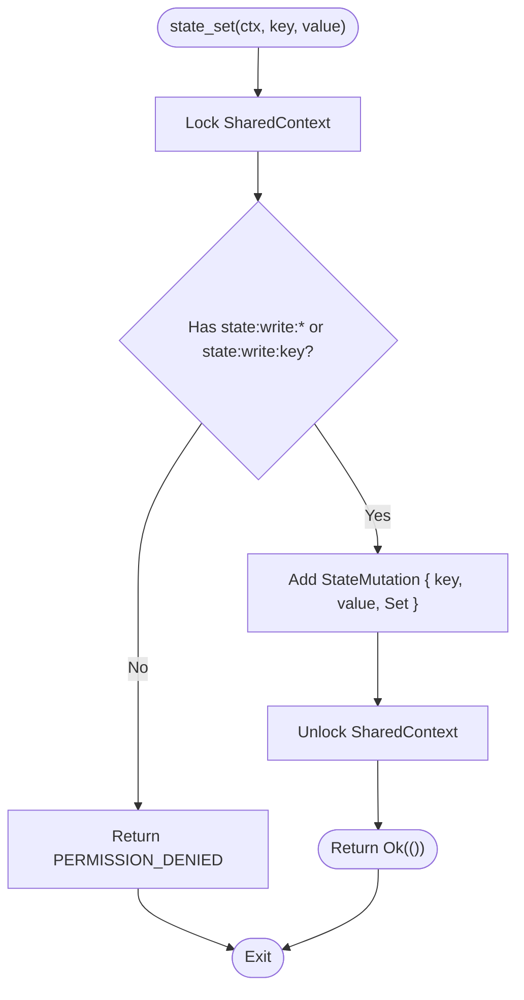
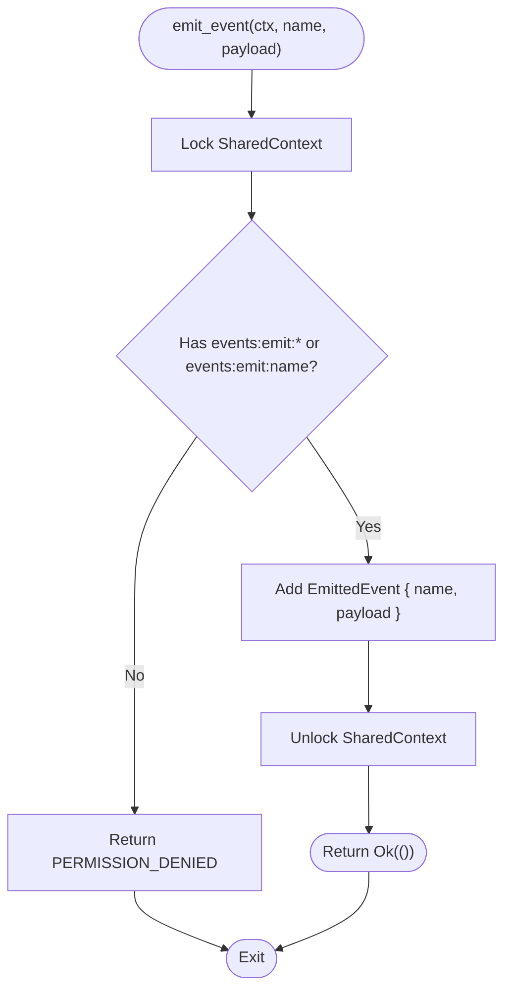
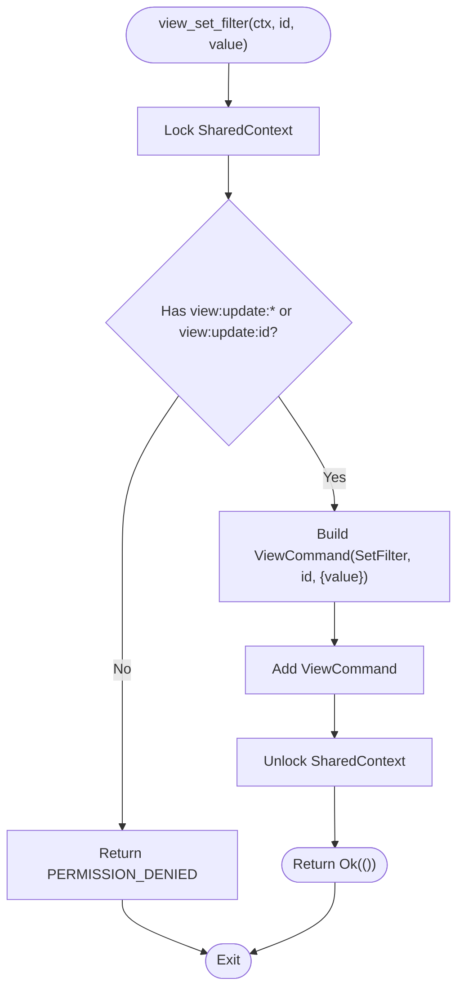
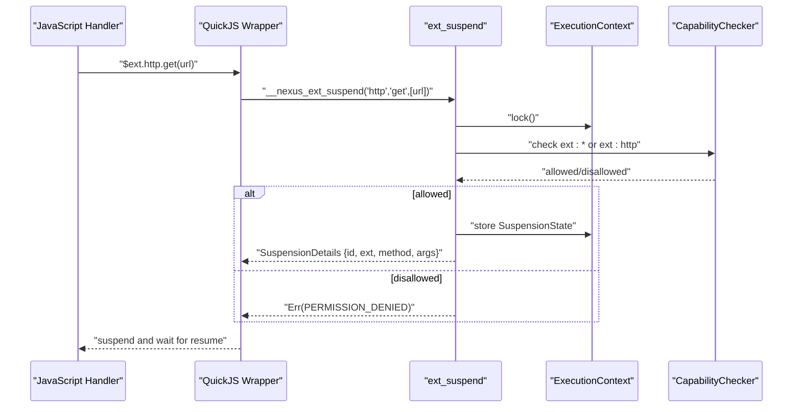
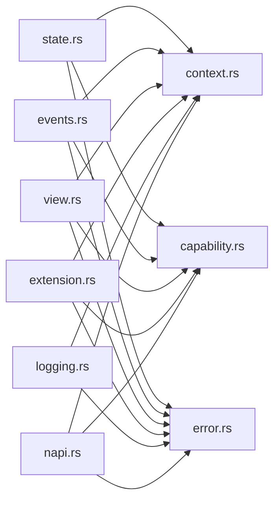

# Custom Host Functions

<cite>
**Referenced Files in This Document**
- [lib.rs](file://runtime/nexus-wasm-bridge/src/lib.rs)
- [Cargo.toml](file://runtime/nexus-wasm-bridge/Cargo.toml)
- [host_functions/mod.rs](file://runtime/nexus-wasm-bridge/src/host_functions/mod.rs)
- [host_functions/state.rs](file://runtime/nexus-wasm-bridge/src/host_functions/state.rs)
- [host_functions/events.rs](file://runtime/nexus-wasm-bridge/src/host_functions/events.rs)
- [host_functions/view.rs](file://runtime/nexus-wasm-bridge/src/host_functions/view.rs)
- [host_functions/extension.rs](file://runtime/nexus-wasm-bridge/src/host_functions/extension.rs)
- [host_functions/logging.rs](file://runtime/nexus-wasm-bridge/src/host_functions/logging.rs)
- [context.rs](file://runtime/nexus-wasm-bridge/src/context.rs)
- [capability.rs](file://runtime/nexus-wasm-bridge/src/capability.rs)
- [error.rs](file://runtime/nexus-wasm-bridge/src/error.rs)
- [napi.rs](file://runtime/nexus-wasm-bridge/src/napi.rs)
- [engine/mod.rs](file://runtime/nexus-wasm-bridge/src/engine/mod.rs)
- [engine/instance.rs](file://runtime/nexus-wasm-bridge/src/engine/instance.rs)
- [quickjs_wrapper.js](file://runtime/nexus-wasm-bridge/src/quickjs_wrapper.js)
</cite>

## Table of Contents
1. [Introduction](#introduction)
2. [Project Structure](#project-structure)
3. [Core Components](#core-components)
4. [Architecture Overview](#architecture-overview)
5. [Detailed Component Analysis](#detailed-component-analysis)
6. [Dependency Analysis](#dependency-analysis)
7. [Performance Considerations](#performance-considerations)
8. [Troubleshooting Guide](#troubleshooting-guide)
9. [Conclusion](#conclusion)
10. [Appendices](#appendices)

## Introduction
This document explains how to develop custom host functions in the Nexus WASM bridge. It focuses on the Rust-side implementation using the napi-rs framework, how host functions are exposed to the WASM sandbox, and how to integrate them securely with the capability-based access control system. It also covers error handling, data type conversions between WASM and JavaScript, and the Asyncify suspension model for async operations.

## Project Structure
The Nexus WASM bridge is implemented in Rust and exposes a Node.js-compatible N-API surface. The key areas for adding custom host functions are:
- Host function modules under runtime/nexus-wasm-bridge/src/host_functions
- The host function registry and trait definitions
- The QuickJS wrapper that injects host functions into the sandbox
- The N-API layer that bridges to Node.js

**Diagram sources**
- [host_functions/mod.rs](file://runtime/nexus-wasm-bridge/src/host_functions/mod.rs#L1-L93)
- [host_functions/state.rs](file://runtime/nexus-wasm-bridge/src/host_functions/state.rs#L1-L238)
- [host_functions/events.rs](file://runtime/nexus-wasm-bridge/src/host_functions/events.rs#L1-L155)
- [host_functions/view.rs](file://runtime/nexus-wasm-bridge/src/host_functions/view.rs#L1-L251)
- [host_functions/extension.rs](file://runtime/nexus-wasm-bridge/src/host_functions/extension.rs#L1-L233)
- [host_functions/logging.rs](file://runtime/nexus-wasm-bridge/src/host_functions/logging.rs#L1-L170)
- [context.rs](file://runtime/nexus-wasm-bridge/src/context.rs#L1-L695)
- [capability.rs](file://runtime/nexus-wasm-bridge/src/capability.rs#L1-L384)
- [error.rs](file://runtime/nexus-wasm-bridge/src/error.rs#L1-L395)
- [napi.rs](file://runtime/nexus-wasm-bridge/src/napi.rs#L1-L491)
- [engine/mod.rs](file://runtime/nexus-wasm-bridge/src/engine/mod.rs#L1-L244)
- [engine/instance.rs](file://runtime/nexus-wasm-bridge/src/engine/instance.rs#L1-L381)
- [quickjs_wrapper.js](file://runtime/nexus-wasm-bridge/src/quickjs_wrapper.js#L1-L411)

**Section sources**
- [lib.rs](file://runtime/nexus-wasm-bridge/src/lib.rs#L1-L71)
- [Cargo.toml](file://runtime/nexus-wasm-bridge/Cargo.toml#L1-L63)

## Core Components
- HostFunctions registry: central place to register and manage host function calls, track host call counts, and provide shared execution context.
- HostFunction trait: a lightweight contract for host functions (name and signature).
- ExecutionContext: mutable state for a single handler execution, including collected mutations, events, view commands, logs, and suspension state.
- Capability system: token-based permissions enforced at runtime for state, events, view updates, and extension access.
- Error system: unified error codes and structured error details for reporting to JavaScript.
- N-API bindings: Node.js integration layer that converts between JavaScript and Rust types, handles async results, and exposes runtime controls.

Key implementation references:
- HostFunctions registry and trait: [host_functions/mod.rs](file://runtime/nexus-wasm-bridge/src/host_functions/mod.rs#L1-L93)
- ExecutionContext and data types: [context.rs](file://runtime/nexus-wasm-bridge/src/context.rs#L1-L695)
- Capability tokens and checks: [capability.rs](file://runtime/nexus-wasm-bridge/src/capability.rs#L1-L384)
- Error codes and WasmError: [error.rs](file://runtime/nexus-wasm-bridge/src/error.rs#L1-L395)
- N-API conversions and runtime API: [napi.rs](file://runtime/nexus-wasm-bridge/src/napi.rs#L1-L491)

**Section sources**
- [host_functions/mod.rs](file://runtime/nexus-wasm-bridge/src/host_functions/mod.rs#L1-L93)
- [context.rs](file://runtime/nexus-wasm-bridge/src/context.rs#L1-L695)
- [capability.rs](file://runtime/nexus-wasm-bridge/src/capability.rs#L1-L384)
- [error.rs](file://runtime/nexus-wasm-bridge/src/error.rs#L1-L395)
- [napi.rs](file://runtime/nexus-wasm-bridge/src/napi.rs#L1-L491)

## Architecture Overview
The runtime architecture integrates Rust-hosted host functions with a JavaScript sandbox via WasmEdge and QuickJS. The QuickJS wrapper injects host function imports and exposes user-facing APIs ($state, $emit, $view, $ext, $log). Host functions enforce capability checks, record side effects, and can suspend execution for async operations.

**Diagram sources**
- [quickjs_wrapper.js](file://runtime/nexus-wasm-bridge/src/quickjs_wrapper.js#L1-L411)
- [host_functions/state.rs](file://runtime/nexus-wasm-bridge/src/host_functions/state.rs#L1-L238)
- [context.rs](file://runtime/nexus-wasm-bridge/src/context.rs#L1-L695)
- [capability.rs](file://runtime/nexus-wasm-bridge/src/capability.rs#L1-L384)
- [error.rs](file://runtime/nexus-wasm-bridge/src/error.rs#L1-L395)

## Detailed Component Analysis

### Host Functions Registry and Trait
- HostFunctions: holds a shared execution context and a maximum host call limit. It increments a call counter per host function invocation and returns a resource limit error when exceeded.
- HostFunction trait: minimal contract specifying function name and signature for documentation and tooling.
- SharedContext: Arc<Mutex<ExecutionContext>> to safely share mutable state across host function calls.

Implementation references:
- Registry and trait: [host_functions/mod.rs](file://runtime/nexus-wasm-bridge/src/host_functions/mod.rs#L1-L93)

**Section sources**
- [host_functions/mod.rs](file://runtime/nexus-wasm-bridge/src/host_functions/mod.rs#L1-L93)

### State Host Functions
Purpose: provide read/write access to the panel’s reactive state snapshot.

Patterns to follow:
- Capability enforcement: check state:read:* or state:read:{key} for reads; state:write:* or state:write:{key} for writes.
- Mutation recording: add StateMutation entries to the execution context for later application.
- Return types: Option<RuntimeValue> for reads; () for writes; Vec<String> for keys.

Examples:
- Read: [state_get](file://runtime/nexus-wasm-bridge/src/host_functions/state.rs#L1-L110)
- Write: [state_set](file://runtime/nexus-wasm-bridge/src/host_functions/state.rs#L42-L87)
- Delete: [state_delete](file://runtime/nexus-wasm-bridge/src/host_functions/state.rs#L70-L87)
- Exists: [state_has](file://runtime/nexus-wasm-bridge/src/host_functions/state.rs#L90-L109)
- Keys: [state_keys](file://runtime/nexus-wasm-bridge/src/host_functions/state.rs#L111-L128)

**Diagram sources**
- [host_functions/state.rs](file://runtime/nexus-wasm-bridge/src/host_functions/state.rs#L42-L87)
- [context.rs](file://runtime/nexus-wasm-bridge/src/context.rs#L1-L695)
- [capability.rs](file://runtime/nexus-wasm-bridge/src/capability.rs#L1-L384)
- [error.rs](file://runtime/nexus-wasm-bridge/src/error.rs#L1-L395)

**Section sources**
- [host_functions/state.rs](file://runtime/nexus-wasm-bridge/src/host_functions/state.rs#L1-L238)
- [context.rs](file://runtime/nexus-wasm-bridge/src/context.rs#L1-L695)
- [capability.rs](file://runtime/nexus-wasm-bridge/src/capability.rs#L1-L384)
- [error.rs](file://runtime/nexus-wasm-bridge/src/error.rs#L1-L395)

### Event Host Functions
Purpose: emit events from handlers to the host system.

Patterns:
- Capability enforcement: events:emit:* or events:emit:{name}.
- Event recording: add EmittedEvent to the execution context.

Examples:
- Emit event: [emit_event](file://runtime/nexus-wasm-bridge/src/host_functions/events.rs#L1-L35)
- Convenience toast: [emit_toast](file://runtime/nexus-wasm-bridge/src/host_functions/events.rs#L38-L63)

**Diagram sources**
- [host_functions/events.rs](file://runtime/nexus-wasm-bridge/src/host_functions/events.rs#L1-L63)
- [context.rs](file://runtime/nexus-wasm-bridge/src/context.rs#L1-L695)
- [capability.rs](file://runtime/nexus-wasm-bridge/src/capability.rs#L1-L384)
- [error.rs](file://runtime/nexus-wasm-bridge/src/error.rs#L1-L395)

**Section sources**
- [host_functions/events.rs](file://runtime/nexus-wasm-bridge/src/host_functions/events.rs#L1-L155)
- [context.rs](file://runtime/nexus-wasm-bridge/src/context.rs#L1-L695)
- [capability.rs](file://runtime/nexus-wasm-bridge/src/capability.rs#L1-L384)
- [error.rs](file://runtime/nexus-wasm-bridge/src/error.rs#L1-L395)

### View Host Functions
Purpose: issue imperative view commands (e.g., setFilter, scrollTo, focus).

Patterns:
- Capability enforcement: view:update:* or view:update:{component_id}.
- Command recording: add ViewCommand to the execution context.

Examples:
- Generic command: [view_command](file://runtime/nexus-wasm-bridge/src/host_functions/view.rs#L1-L36)
- Set filter: [view_set_filter](file://runtime/nexus-wasm-bridge/src/host_functions/view.rs#L38-L64)
- Scroll to: [view_scroll_to](file://runtime/nexus-wasm-bridge/src/host_functions/view.rs#L66-L92)
- Focus: [view_focus](file://runtime/nexus-wasm-bridge/src/host_functions/view.rs#L94-L111)
- Custom command: [view_custom](file://runtime/nexus-wasm-bridge/src/host_functions/view.rs#L113-L136)

**Diagram sources**
- [host_functions/view.rs](file://runtime/nexus-wasm-bridge/src/host_functions/view.rs#L1-L136)
- [context.rs](file://runtime/nexus-wasm-bridge/src/context.rs#L1-L695)
- [capability.rs](file://runtime/nexus-wasm-bridge/src/capability.rs#L1-L384)
- [error.rs](file://runtime/nexus-wasm-bridge/src/error.rs#L1-L395)

**Section sources**
- [host_functions/view.rs](file://runtime/nexus-wasm-bridge/src/host_functions/view.rs#L1-L251)
- [context.rs](file://runtime/nexus-wasm-bridge/src/context.rs#L1-L695)
- [capability.rs](file://runtime/nexus-wasm-bridge/src/capability.rs#L1-L384)
- [error.rs](file://runtime/nexus-wasm-bridge/src/error.rs#L1-L395)

### Extension Host Functions (Asyncify)
Purpose: suspend handler execution for async extension calls and resume later.

Patterns:
- Capability enforcement: ext:* or ext:{name}.
- Extension existence and method validation against the extension registry.
- Suspension creation and storage of SuspensionState; return SuspensionDetails to JavaScript.

Examples:
- Suspend: [ext_suspend](file://runtime/nexus-wasm-bridge/src/host_functions/extension.rs#L1-L67)
- Existence: [ext_exists](file://runtime/nexus-wasm-bridge/src/host_functions/extension.rs#L69-L81)
- Methods: [ext_methods](file://runtime/nexus-wasm-bridge/src/host_functions/extension.rs#L83-L99)
- List: [ext_list](file://runtime/nexus-wasm-bridge/src/host_functions/extension.rs#L101-L111)

**Diagram sources**
- [host_functions/extension.rs](file://runtime/nexus-wasm-bridge/src/host_functions/extension.rs#L1-L111)
- [context.rs](file://runtime/nexus-wasm-bridge/src/context.rs#L1-L695)
- [capability.rs](file://runtime/nexus-wasm-bridge/src/capability.rs#L1-L384)
- [error.rs](file://runtime/nexus-wasm-bridge/src/error.rs#L1-L395)
- [quickjs_wrapper.js](file://runtime/nexus-wasm-bridge/src/quickjs_wrapper.js#L208-L278)

**Section sources**
- [host_functions/extension.rs](file://runtime/nexus-wasm-bridge/src/host_functions/extension.rs#L1-L233)
- [context.rs](file://runtime/nexus-wasm-bridge/src/context.rs#L1-L695)
- [capability.rs](file://runtime/nexus-wasm-bridge/src/capability.rs#L1-L384)
- [error.rs](file://runtime/nexus-wasm-bridge/src/error.rs#L1-L395)
- [quickjs_wrapper.js](file://runtime/nexus-wasm-bridge/src/quickjs_wrapper.js#L208-L278)

### Logging Host Functions
Purpose: capture logs from handlers without requiring capabilities.

Patterns:
- Always allowed; records log messages in ExecutionContext.
- Utility now() returns current timestamp in milliseconds.

Examples:
- Log: [log](file://runtime/nexus-wasm-bridge/src/host_functions/logging.rs#L1-L59)
- Levels: [log_debug/info/warn/error](file://runtime/nexus-wasm-bridge/src/host_functions/logging.rs#L61-L79)
- Timestamp: [now](file://runtime/nexus-wasm-bridge/src/host_functions/logging.rs#L81-L96)

**Section sources**
- [host_functions/logging.rs](file://runtime/nexus-wasm-bridge/src/host_functions/logging.rs#L1-L170)
- [context.rs](file://runtime/nexus-wasm-bridge/src/context.rs#L1-L695)

### Data Type Conversions and Serialization
- RuntimeValue: a tagged union representing JS-compatible values (Null, Bool, Number, String, Array, Object) with convenient conversions and getters.
- MessagePack encoding/decoding: used in the QuickJS wrapper to pass values between host and sandbox; Rust N-API layer uses MessagePack buffers for state, args, scope, mutations, events, and view commands.
- N-API conversions: JsWasmContext/JsWasmResult map between JavaScript-friendly structures and Rust structs, handling decoding/encoding.

References:
- RuntimeValue and conversions: [context.rs](file://runtime/nexus-wasm-bridge/src/context.rs#L1-L120)
- N-API conversions: [napi.rs](file://runtime/nexus-wasm-bridge/src/napi.rs#L1-L221)

**Section sources**
- [context.rs](file://runtime/nexus-wasm-bridge/src/context.rs#L1-L120)
- [napi.rs](file://runtime/nexus-wasm-bridge/src/napi.rs#L1-L221)

### Security Implications and Capability-Based Access Control
- CapabilityToken variants cover state read/write, event emission, view updates, and extension access.
- CapabilityChecker enforces permissions at runtime by matching required capability strings against granted tokens.
- Static inference of capabilities from handler code is supported to aid declaration and review.

References:
- Tokens and matching: [capability.rs](file://runtime/nexus-wasm-bridge/src/capability.rs#L1-L224)
- Inference helpers: [capability.rs](file://runtime/nexus-wasm-bridge/src/capability.rs#L226-L327)

**Section sources**
- [capability.rs](file://runtime/nexus-wasm-bridge/src/capability.rs#L1-L384)

### Asyncify Suspension Model
- SuspensionDetails returned by host functions signal the host to suspend execution and await an async result.
- The engine resumes execution with AsyncResult injected into the sandbox, restoring the stack via Asyncify.
- The wrapper coordinates suspend/resume and decodes/encodes values.

References:
- Suspension types: [context.rs](file://runtime/nexus-wasm-bridge/src/context.rs#L425-L493)
- Engine resume: [engine/mod.rs](file://runtime/nexus-wasm-bridge/src/engine/mod.rs#L167-L194)
- Wrapper suspend/resume: [quickjs_wrapper.js](file://runtime/nexus-wasm-bridge/src/quickjs_wrapper.js#L208-L235)

**Section sources**
- [context.rs](file://runtime/nexus-wasm-bridge/src/context.rs#L425-L493)
- [engine/mod.rs](file://runtime/nexus-wasm-bridge/src/engine/mod.rs#L167-L194)
- [quickjs_wrapper.js](file://runtime/nexus-wasm-bridge/src/quickjs_wrapper.js#L208-L235)

## Dependency Analysis
The host functions depend on:
- ExecutionContext for state and side effects
- CapabilityChecker for permission enforcement
- Error codes for consistent error signaling
- N-API conversions for interoperability with Node.js

**Diagram sources**
- [host_functions/state.rs](file://runtime/nexus-wasm-bridge/src/host_functions/state.rs#L1-L238)
- [host_functions/events.rs](file://runtime/nexus-wasm-bridge/src/host_functions/events.rs#L1-L155)
- [host_functions/view.rs](file://runtime/nexus-wasm-bridge/src/host_functions/view.rs#L1-L251)
- [host_functions/extension.rs](file://runtime/nexus-wasm-bridge/src/host_functions/extension.rs#L1-L233)
- [host_functions/logging.rs](file://runtime/nexus-wasm-bridge/src/host_functions/logging.rs#L1-L170)
- [context.rs](file://runtime/nexus-wasm-bridge/src/context.rs#L1-L695)
- [capability.rs](file://runtime/nexus-wasm-bridge/src/capability.rs#L1-L384)
- [error.rs](file://runtime/nexus-wasm-bridge/src/error.rs#L1-L395)
- [napi.rs](file://runtime/nexus-wasm-bridge/src/napi.rs#L1-L491)

**Section sources**
- [host_functions/state.rs](file://runtime/nexus-wasm-bridge/src/host_functions/state.rs#L1-L238)
- [host_functions/events.rs](file://runtime/nexus-wasm-bridge/src/host_functions/events.rs#L1-L155)
- [host_functions/view.rs](file://runtime/nexus-wasm-bridge/src/host_functions/view.rs#L1-L251)
- [host_functions/extension.rs](file://runtime/nexus-wasm-bridge/src/host_functions/extension.rs#L1-L233)
- [host_functions/logging.rs](file://runtime/nexus-wasm-bridge/src/host_functions/logging.rs#L1-L170)
- [context.rs](file://runtime/nexus-wasm-bridge/src/context.rs#L1-L695)
- [capability.rs](file://runtime/nexus-wasm-bridge/src/capability.rs#L1-L384)
- [error.rs](file://runtime/nexus-wasm-bridge/src/error.rs#L1-L395)
- [napi.rs](file://runtime/nexus-wasm-bridge/src/napi.rs#L1-L491)

## Performance Considerations
- Host call limiting: the HostFunctions registry tracks and limits host calls per execution to prevent abuse.
- Instance pooling and compilation caching: the engine reuses instances and caches bytecode to reduce overhead.
- Asyncify minimizes overhead by suspending only necessary frames; ensure async boundaries are precise to avoid unnecessary stack rewinds.
- Logging: excessive logging can increase memory usage; use appropriate log levels.

[No sources needed since this section provides general guidance]

## Troubleshooting Guide
Common issues and resolutions:
- Permission denied errors: verify that the handler’s declared capabilities match the operations performed. Check CapabilityToken parsing and matching.
- Serialization failures: ensure values are serializable and within supported RuntimeValue variants; confirm MessagePack buffers are correctly encoded/decoded.
- Extension not found or method not found: confirm the extension is registered and the method exists in the extension registry.
- Timeout errors: adjust execution timeout or optimize handler logic; check resource limits.

References:
- Error codes and messages: [error.rs](file://runtime/nexus-wasm-bridge/src/error.rs#L1-L395)
- Capability enforcement: [capability.rs](file://runtime/nexus-wasm-bridge/src/capability.rs#L1-L384)
- N-API conversions: [napi.rs](file://runtime/nexus-wasm-bridge/src/napi.rs#L1-L221)

**Section sources**
- [error.rs](file://runtime/nexus-wasm-bridge/src/error.rs#L1-L395)
- [capability.rs](file://runtime/nexus-wasm-bridge/src/capability.rs#L1-L384)
- [napi.rs](file://runtime/nexus-wasm-bridge/src/napi.rs#L1-L221)

## Conclusion
Adding custom host functions follows established patterns: define a function that locks the shared execution context, enforces capabilities, performs the operation, records side effects, and returns a consistent error code on failure. Use the existing host function modules as templates, ensure capability checks align with the intended scope, and leverage the Asyncify suspension model for async operations. The N-API layer and QuickJS wrapper provide robust integration with Node.js and the sandbox.

[No sources needed since this section summarizes without analyzing specific files]

## Appendices

### Build and Testing Procedures
- Build the Rust crate with napi-rs to produce a Node-compatible binary:
  - See crate configuration and dependencies: [Cargo.toml](file://runtime/nexus-wasm-bridge/Cargo.toml#L1-L63)
- Run unit tests for host functions:
  - State: [host_functions/state.rs](file://runtime/nexus-wasm-bridge/src/host_functions/state.rs#L130-L237)
  - Events: [host_functions/events.rs](file://runtime/nexus-wasm-bridge/src/host_functions/events.rs#L65-L154)
  - View: [host_functions/view.rs](file://runtime/nexus-wasm-bridge/src/host_functions/view.rs#L138-L250)
  - Extension: [host_functions/extension.rs](file://runtime/nexus-wasm-bridge/src/host_functions/extension.rs#L113-L232)
  - Logging: [host_functions/logging.rs](file://runtime/nexus-wasm-bridge/src/host_functions/logging.rs#L98-L169)
- Integration tests:
  - N-API conversions and runtime operations: [napi.rs](file://runtime/nexus-wasm-bridge/src/napi.rs#L222-L490)
  - Engine execution and resume: [engine/mod.rs](file://runtime/nexus-wasm-bridge/src/engine/mod.rs#L55-L219)
  - Instance lifecycle and suspension: [engine/instance.rs](file://runtime/nexus-wasm-bridge/src/engine/instance.rs#L118-L289)
- Verify Asyncify behavior:
  - Suspension details and wrapper suspend/resume: [context.rs](file://runtime/nexus-wasm-bridge/src/context.rs#L425-L493), [quickjs_wrapper.js](file://runtime/nexus-wasm-bridge/src/quickjs_wrapper.js#L208-L235)

**Section sources**
- [Cargo.toml](file://runtime/nexus-wasm-bridge/Cargo.toml#L1-L63)
- [host_functions/state.rs](file://runtime/nexus-wasm-bridge/src/host_functions/state.rs#L130-L237)
- [host_functions/events.rs](file://runtime/nexus-wasm-bridge/src/host_functions/events.rs#L65-L154)
- [host_functions/view.rs](file://runtime/nexus-wasm-bridge/src/host_functions/view.rs#L138-L250)
- [host_functions/extension.rs](file://runtime/nexus-wasm-bridge/src/host_functions/extension.rs#L113-L232)
- [host_functions/logging.rs](file://runtime/nexus-wasm-bridge/src/host_functions/logging.rs#L98-L169)
- [napi.rs](file://runtime/nexus-wasm-bridge/src/napi.rs#L222-L490)
- [engine/mod.rs](file://runtime/nexus-wasm-bridge/src/engine/mod.rs#L55-L219)
- [engine/instance.rs](file://runtime/nexus-wasm-bridge/src/engine/instance.rs#L118-L289)
- [context.rs](file://runtime/nexus-wasm-bridge/src/context.rs#L425-L493)
- [quickjs_wrapper.js](file://runtime/nexus-wasm-bridge/src/quickjs_wrapper.js#L208-L235)