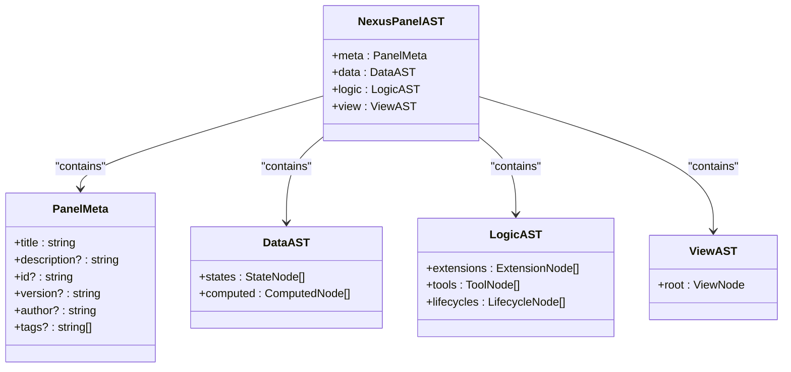
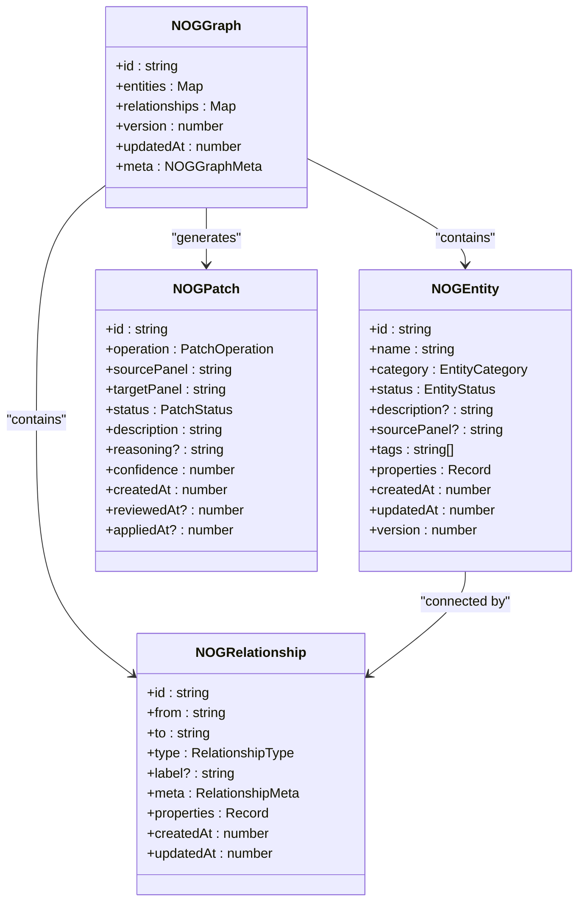
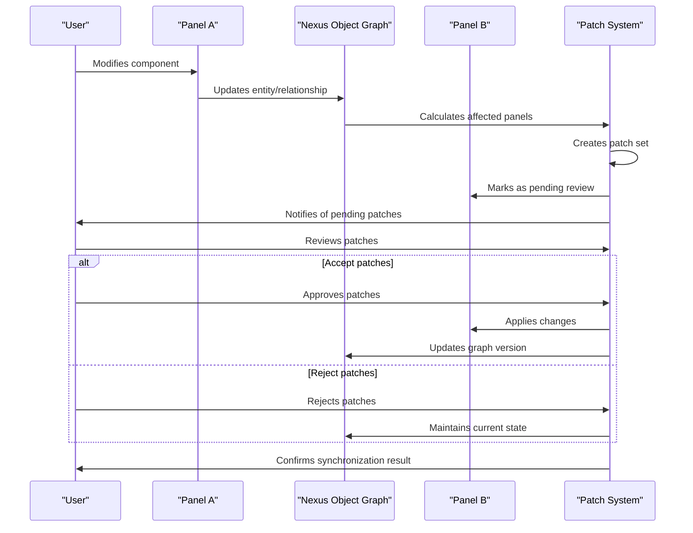
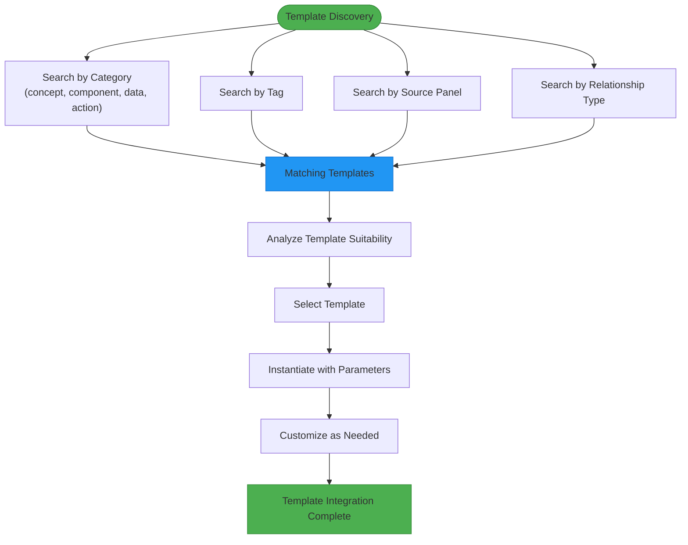
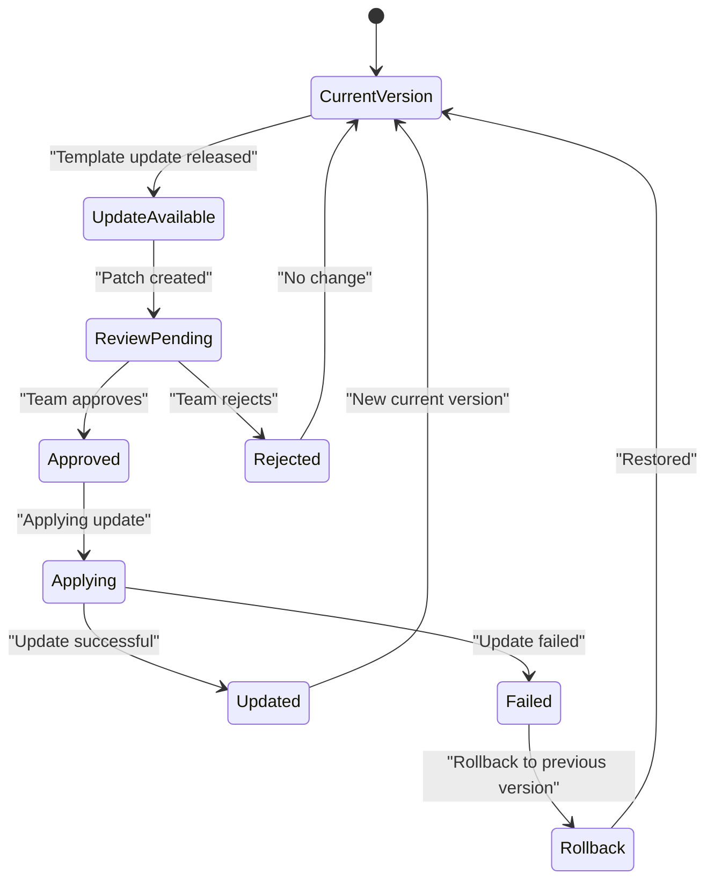
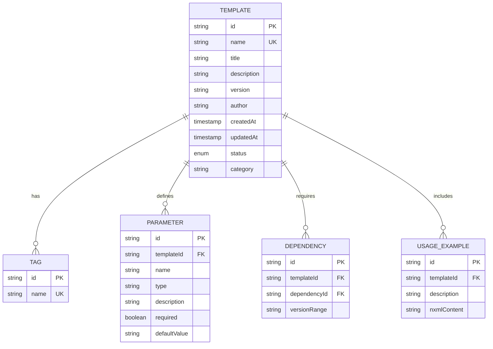

# Panel Templates and Reusability

<cite>
**Referenced Files in This Document**   
- [panel.ts](file://packages/nexus-protocol/src/ast/panel.ts)
- [panel.ts](file://packages/nexus-protocol/src/schemas/panel.ts)
- [entity.ts](file://packages/nexus-protocol/src/nog/entity.ts)
- [graph.ts](file://packages/nexus-protocol/src/nog/graph.ts)
- [relationship.ts](file://packages/nexus-protocol/src/nog/relationship.ts)
- [patch.ts](file://packages/nexus-protocol/src/nog/patch.ts)
- [05_nexusos-obj.md](file://docs/05_nexusos-obj.md)
</cite>

## Table of Contents
1. [Introduction](#introduction)
2. [NXML Structure and Parameterization](#nxml-structure-and-parameterization)
3. [Network of Graphs (Nog) System](#network-of-graphs-nog-system)
4. [Cross-Panel State Synchronization](#cross-panel-state-synchronization)
5. [Knowledge Graph for Template Discovery](#knowledge-graph-for-template-discovery)
6. [Versioning and Template Updates](#versioning-and-template-updates)
7. [Best Practices](#best-practices)
8. [Conclusion](#conclusion)

## Introduction
This document provides comprehensive guidance on creating reusable panel templates in Nexus. It covers the design of parameterized NXML structures, utilization of the Network of Graphs (Nog) system for representing reusable component graphs, implementation of complex business logic across multiple panels, and application of knowledge graph concepts for organizing and discovering reusable templates. The document also addresses challenges in versioning shared templates and outlines best practices for naming, documentation, and distribution of reusable panel components.

## NXML Structure and Parameterization
The NexusPanel Abstract Syntax Tree (AST) serves as the foundation for creating reusable templates. The structure combines data, logic, and view components into a single unit that can be parameterized and instantiated across multiple use cases.

The `NexusPanelAST` interface defines the complete structure with metadata, data namespace, logic namespace, and view namespace. Templates can be parameterized through the use of state variables, computed properties, and tools that accept arguments. The metadata section supports parameters such as title, description, version, and tags that can be customized during instantiation.

**Diagram sources**
- [panel.ts](file://packages/nexus-protocol/src/ast/panel.ts#L76-L98)

**Section sources**
- [panel.ts](file://packages/nexus-protocol/src/ast/panel.ts#L76-L98)

## Network of Graphs (Nog) System
The Network of Graphs (Nog) system in packages/nexus-protocol/src/nog/ provides a robust framework for representing reusable component graphs. The Nog system maintains the "Runtime Semantic Truth" of a project by tracking semantic relationships across all panels in a workspace.

The system consists of entities, relationships, and patches that enable sophisticated template management. Entities represent semantic concepts in the project, categorized as concepts, components, data, actions, resources, constraints, or milestones. Relationships define the connections between entities, with standard types including 'contains', 'implements', 'depends_on', 'uses', 'produces', and 'consumes'.

**Diagram sources**
- [entity.ts](file://packages/nexus-protocol/src/nog/entity.ts#L38-L93)
- [relationship.ts](file://packages/nexus-protocol/src/nog/relationship.ts#L80-L125)
- [graph.ts](file://packages/nexus-protocol/src/nog/graph.ts#L30-L55)
- [patch.ts](file://packages/nexus-protocol/src/nog/patch.ts#L52-L107)

**Section sources**
- [entity.ts](file://packages/nexus-protocol/src/nog/entity.ts#L16-L24)
- [relationship.ts](file://packages/nexus-protocol/src/nog/relationship.ts#L16-L45)
- [graph.ts](file://packages/nexus-protocol/src/nog/graph.ts#L30-L55)
- [patch.ts](file://packages/nexus-protocol/src/nog/patch.ts#L26-L43)

## Cross-Panel State Synchronization
Complex business logic that spans multiple panels requires robust state synchronization and cross-panel event handling. The Nog system facilitates this through its patch mechanism, which represents changes to the graph that need to be synchronized across panels.

When a user modifies a panel, the system updates the NOG and calculates patches for affected panels. These patches enter a "Pending Review" state where users can review and accept or reject them before they are applied. This explicit sync workflow ensures consistency while maintaining user control over changes.

The system supports various patch operations including create, update, delete, move, merge, and split. Each patch includes metadata such as source panel, target panel, status, description, reasoning, and confidence score. This comprehensive tracking enables reliable synchronization of state across multiple panels while preserving the integrity of the overall system.

**Diagram sources**
- [patch.ts](file://packages/nexus-protocol/src/nog/patch.ts#L26-L43)
- [graph.ts](file://packages/nexus-protocol/src/nog/graph.ts#L30-L55)

**Section sources**
- [patch.ts](file://packages/nexus-protocol/src/nog/patch.ts#L15-L14)
## Knowledge Graph for Template Discovery
The knowledge graph concepts from docs/05_nexusos-obj.md provide a powerful framework for organizing and discovering reusable templates. The Nexus Object Graph serves as the "Runtime Semantic Truth" of a project, maintaining semantic relationships across all panels in a workspace.

Templates can be discovered through various dimensions including entity categories, tags, source panels, and relationship types. The graph supports sophisticated queries such as finding entities by category, finding entities by tag, finding entities by source panel, and finding connected entities through relationships.

The system also supports path finding between entities, enabling users to understand the relationships and dependencies between different components. This capability is particularly valuable for discovering reusable templates that are related to current work but may not be immediately obvious.

**Diagram sources**
- [05_nexusos-obj.md](file://docs/05_nexusos-obj.md#L12-L24)
- [graph.ts](file://packages/nexus-protocol/src/nog/graph.ts#L272-L290)

**Section sources**
- [05_nexusos-obj.md](file://docs/05_nexusos-obj.md#L12-L24)
- [graph.ts](file://packages/nexus-protocol/src/nog/graph.ts#L262-L290)

## Versioning and Template Updates
Managing versioning and updates for shared templates across projects presents several challenges that the Nog system addresses through its comprehensive versioning and patch management capabilities.

Each entity and the overall graph maintain version numbers that increment with changes, enabling conflict resolution and change tracking. When templates are updated, the system generates patches that can be reviewed and applied across dependent panels. This approach ensures that updates are propagated consistently while allowing for manual review and intervention when necessary.

The patch system supports various statuses including pending, approved, rejected, applied, failed, and expired. This workflow enables teams to manage template updates systematically, with the ability to roll back changes if issues are discovered after deployment.

**Diagram sources**
- [patch.ts](file://packages/nexus-protocol/src/nog/patch.ts#L37-L43)
- [entity.ts](file://packages/nexus-protocol/src/nog/entity.ts#L92-L93)

**Section sources**
- [patch.ts](file://packages/nexus-protocol/src/nog/patch.ts#L37-L43)
- [entity.ts](file://packages/nexus-protocol/src/nog/entity.ts#L92-L93)

## Best Practices
Creating effective reusable panel templates requires adherence to several best practices in naming, documentation, and distribution.

For naming, use clear, descriptive names that indicate the template's purpose and functionality. Follow a consistent naming convention across all templates, such as using lowercase with hyphens for multi-word names. Include version information in the template metadata to facilitate tracking and updates.

Documentation should be comprehensive, including a clear description of the template's purpose, parameters, and usage examples. Document any dependencies or requirements for using the template. Include information about the template's author, creation date, and modification history.

For distribution, organize templates into logical categories based on their function or domain. Use tags to enable easy discovery through the knowledge graph system. Establish a review process for new templates to ensure quality and consistency. Consider implementing a template registry or marketplace where users can browse, rate, and provide feedback on templates.

**Diagram sources**
- [panel.ts](file://packages/nexus-protocol/src/ast/panel.ts#L27-L57)
- [entity.ts](file://packages/nexus-protocol/src/nog/entity.ts#L16-L24)

**Section sources**
- [panel.ts](file://packages/nexus-protocol/src/ast/panel.ts#L27-L57)

## Conclusion
Creating reusable panel templates in Nexus requires a comprehensive understanding of the NXML structure, the Network of Graphs system, and the knowledge graph concepts that enable template discovery and management. By leveraging parameterized NXML structures, organizations can create flexible templates that can be instantiated across multiple use cases.

The Nog system provides a robust foundation for representing reusable component graphs, enabling sophisticated state synchronization and cross-panel event handling. The knowledge graph concepts facilitate organized template discovery and management, while the versioning and patch system addresses the challenges of updating shared templates across projects.

Following best practices in naming, documentation, and distribution ensures that reusable templates are effective, maintainable, and easily discoverable by team members. By implementing these principles, organizations can maximize the reusability of their panel components, reducing development time and ensuring consistency across projects.