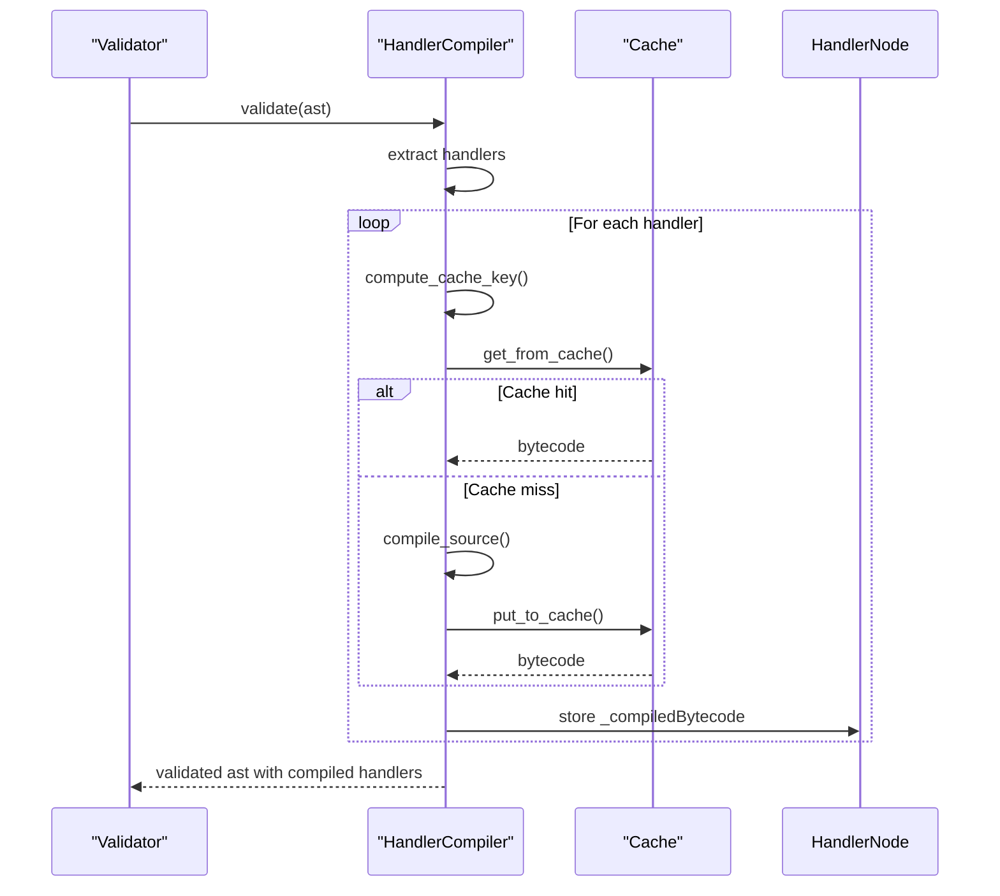
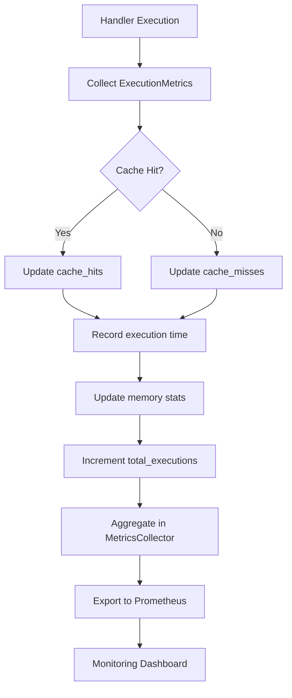

# Performance Optimization

<cite>
**Referenced Files in This Document**   
- [compiler.rs](file://runtime/nexus-wasm-bridge/src/engine/compiler.rs)
- [pool.rs](file://runtime/nexus-wasm-bridge/src/engine/pool.rs)
- [instance.rs](file://runtime/nexus-wasm-bridge/src/engine/instance.rs)
- [executor-wasm.ts](file://packages/nexus-reactor/src/sandbox/executor-wasm.ts)
- [store.ts](file://packages/nexus-reactor/src/state/store.ts)
- [config.rs](file://runtime/nexus-wasm-bridge/src/config.rs)
- [metrics.rs](file://runtime/nexus-wasm-bridge/src/metrics.rs)
- [validator.ts](file://packages/nexus-reactor/src/parser/validator.ts)
</cite>

## Table of Contents
1. [Introduction](#introduction)
2. [WASM Compilation Caching](#wasm-compilation-caching)
3. [Instance Pooling Mechanism](#instance-pooling-mechanism)
4. [Pre-compilation During Validation](#pre-compilation-during-validation)
5. [Performance Metrics and Benchmarks](#performance-metrics-and-benchmarks)
6. [Memory and Execution Trade-offs](#memory-and-execution-trade-offs)
7. [Telemetry and Monitoring](#telemetry-and-monitoring)
8. [Configuration and Tuning](#configuration-and-tuning)

## Introduction
This document details the performance optimization techniques implemented in Nexus, focusing on WASM-based execution, instance management, and state handling. The system leverages WasmEdge for secure, isolated execution of JavaScript handlers, with multiple layers of optimization to ensure high throughput and low latency under various workloads.

## WASM Compilation Caching

Nexus implements a sophisticated two-tier caching system for compiled WASM bytecode to minimize handler execution latency. The compilation process converts JavaScript handler code to QuickJS bytecode, which is then cached both in memory and on disk for rapid retrieval.

The `HandlerCompiler` class manages this caching mechanism with LRU (Least Recently Used) eviction policies based on memory pressure. When a handler is requested for execution, the system first checks the in-memory cache using a SHA-256 hash of the source code as the cache key. If the handler has been compiled previously, it can be retrieved from the cache without recompilation, significantly reducing execution overhead.

For cold starts or when the in-memory cache is evicted, Nexus falls back to disk-based caching. The disk cache stores compiled bytecode in the `.nexus-cache` directory by default, allowing persistence across application restarts. This hybrid approach ensures optimal performance while maintaining reasonable memory usage.

The caching system tracks comprehensive statistics including hit rates, total compilations, and cache size, which can be monitored to assess the effectiveness of the caching strategy. A high cache hit rate indicates that most handlers are being served from cache, minimizing the computational cost of repeated compilation.

**Section sources**
- [compiler.rs](file://runtime/nexus-wasm-bridge/src/engine/compiler.rs#L1-L567)

## Instance Pooling Mechanism

The WasmEdge bridge implements an instance pooling mechanism to optimize throughput under high concurrency. Since creating new WASM instances is an expensive operation, Nexus maintains a pool of pre-warmed instances that can be rapidly acquired and released as needed.

The `InstancePool` manages a collection of `WasmInstance` objects, tracking their state (idle, executing, suspended, or terminated). When a handler execution is requested, the system first attempts to retrieve an idle instance from the pool. If no instances are available and the pool hasn't reached its maximum capacity, a new instance is created. Otherwise, the request blocks until an instance becomes available.

Each instance in the pool is reset to a clean state before reuse, ensuring isolation between different handler executions. The pool uses a LIFO (Last In, First Out) strategy for instance retrieval to maximize CPU cache locality, as recently used instances are more likely to have their code and data in CPU caches.

Suspended instances (those waiting for async operations) are managed separately from the main pool, allowing them to be resumed when their async operations complete. This design enables efficient handling of I/O-bound operations without blocking worker threads.

The pooling mechanism includes comprehensive monitoring of active, available, and suspended instances, providing visibility into resource utilization under load.

```mermaid
classDiagram
class InstancePool {
+acquire() PooledInstance
+release(instance) void
+get_suspended(id) PooledInstance
+active_count() usize
+available_count() usize
+suspended_count() usize
}
class PooledInstance {
+inner() WasmInstance
+inner_mut() WasmInstance
}
class WasmInstance {
+id() string
+state() InstanceState
+memory_used() u64
+reset() Result
+execute() Result
+resume() Result
+terminate() void
}
enum InstanceState {
Idle
Executing
Suspended
Terminated
}
InstancePool --> PooledInstance : "creates"
PooledInstance --> WasmInstance : "wraps"
```

**Diagram sources**
- [pool.rs](file://runtime/nexus-wasm-bridge/src/engine/pool.rs#L1-L395)
- [instance.rs](file://runtime/nexus-wasm-bridge/src/engine/instance.rs#L1-L381)

**Section sources**
- [pool.rs](file://runtime/nexus-wasm-bridge/src/engine/pool.rs#L1-L395)
- [instance.rs](file://runtime/nexus-wasm-bridge/src/engine/instance.rs#L1-L381)

## Pre-compilation During Validation

Nexus optimizes runtime performance by pre-compiling handlers during the validation phase, reducing execution overhead when handlers are actually invoked. This optimization is implemented in the `WasmSandboxExecutor` class, which integrates with the validation process to compile handlers before they are needed.

During panel validation, the system analyzes the AST (Abstract Syntax Tree) and identifies all handlers that will be used. These handlers are then passed to the `precompileHandler` method, which compiles them to WASM bytecode and stores the compiled result in the handler node. When the handler is later executed, the pre-compiled bytecode can be used directly, bypassing the compilation step entirely.

This pre-compilation strategy is particularly effective for lifecycle handlers (mount, unmount) and frequently used tools, as they can be compiled during application startup or panel loading. The compiled bytecode is stored in the `_compiledBytecode` property of the handler node, allowing the executor to detect and use pre-compiled versions.

The validation process also performs static analysis to infer required capabilities for each handler, enabling fine-grained security policies and preventing runtime capability checks. This reduces the overhead of security validation during execution.



**Diagram sources**
- [validator.ts](file://packages/nexus-reactor/src/parser/validator.ts#L1-L176)
- [executor-wasm.ts](file://packages/nexus-reactor/src/sandbox/executor-wasm.ts#L1-L397)
- [compiler.rs](file://runtime/nexus-wasm-bridge/src/engine/compiler.rs#L1-L567)

**Section sources**
- [validator.ts](file://packages/nexus-reactor/src/parser/validator.ts#L1-L176)
- [executor-wasm.ts](file://packages/nexus-reactor/src/sandbox/executor-wasm.ts#L1-L397)

## Performance Metrics and Benchmarks

Nexus provides comprehensive performance metrics through its built-in telemetry system, enabling detailed analysis of execution characteristics and optimization effectiveness. The metrics system collects data at both the individual execution level and aggregate runtime level.

For each handler execution, Nexus captures detailed metrics including:
- Execution duration in microseconds
- Memory usage (current and peak)
- Host function call counts
- Compilation time (when applicable)
- Cache hit/miss status

These metrics are aggregated by the `MetricsCollector` class, which maintains running totals for key performance indicators such as average execution time, cache hit rate, and error rates. The collector exposes these metrics in Prometheus format, enabling integration with standard monitoring and visualization tools.

Benchmarks comparing JavaScript execution versus WASM execution show significant performance improvements for the WASM approach, particularly under high concurrency. The isolation provided by WASM instances prevents JavaScript's single-threaded nature from becoming a bottleneck, allowing true parallel execution of handlers.

The metrics system also tracks instance pool utilization, showing the ratio of active to available instances under load. This helps identify when the pool size may need adjustment to handle peak workloads efficiently.



**Diagram sources**
- [metrics.rs](file://runtime/nexus-wasm-bridge/src/metrics.rs#L1-L474)

**Section sources**
- [metrics.rs](file://runtime/nexus-wasm-bridge/src/metrics.rs#L1-L474)

## Memory and Execution Trade-offs

Nexus balances memory usage and execution speed through configurable resource limits and pooling strategies. The system provides several tunable parameters that allow administrators to optimize for either memory efficiency or execution performance based on their specific use cases.

The `RuntimeConfig` structure defines key resource limits:
- `max_instances`: Maximum number of concurrent WASM instances
- `memory_limit_bytes`: Memory limit per instance
- `stack_size_bytes`: Stack size per instance
- `max_instances`: Maximum concurrent instances in pool

These limits create a trade-off between memory consumption and execution throughput. A larger instance pool allows more concurrent executions but consumes more memory. Similarly, larger memory limits per instance enable more complex handlers but reduce the total number of instances that can be maintained.

The default configuration (32MB memory limit, 10 maximum instances) provides a balanced starting point for most applications. For memory-constrained environments, these values can be reduced, while high-performance scenarios may benefit from increased limits.

The compilation cache also represents a memory/performance trade-off. A larger cache size reduces compilation overhead but consumes more memory. The system defaults to a 64MB maximum cache size, with LRU eviction to prevent unbounded growth.

**Section sources**
- [config.rs](file://runtime/nexus-wasm-bridge/src/config.rs#L1-L320)

## Telemetry and Monitoring

Nexus includes comprehensive telemetry and monitoring capabilities to identify and resolve performance bottlenecks. The system exposes metrics through multiple channels, enabling both real-time monitoring and historical analysis.

The primary monitoring interface is the Prometheus-compatible metrics endpoint, which exposes key performance indicators in a standard format. These metrics include:
- Handler execution counts (success/failure)
- Average execution time
- Cache hit rate
- Peak memory usage
- Host function call counts
- Error rates by code

In addition to metrics, Nexus provides detailed execution tracing through structured logging. Each handler execution is logged with contextual information including panel ID, handler name, execution duration, and cache status. This enables correlation of performance issues with specific components or usage patterns.

The system also includes a runtime statistics API that provides real-time information about the current state of the instance pool, including active, available, and suspended instance counts. This information is crucial for diagnosing concurrency issues and capacity planning.

For development and debugging, Nexus supports a debug mode that provides additional tracing information and validation checks, helping to identify performance anti-patterns in handler code.

**Section sources**
- [metrics.rs](file://runtime/nexus-wasm-bridge/src/metrics.rs#L1-L474)
- [executor-wasm.ts](file://packages/nexus-reactor/src/sandbox/executor-wasm.ts#L1-L397)

## Configuration and Tuning

Optimal performance in Nexus requires careful configuration and tuning of key parameters based on the specific workload characteristics. The system provides several configuration options that can be adjusted to balance performance, resource usage, and reliability.

Key configuration parameters include:
- `max_instances`: Controls the maximum number of concurrent WASM instances. Increase for high-concurrency workloads.
- `memory_limit_bytes`: Sets the memory limit per instance. Increase for handlers that process large datasets.
- `cache_dir`: Specifies the directory for persistent compilation cache. Ensure adequate disk space.
- `enable_aot`: Enables AOT (Ahead-of-Time) compilation for hot handlers. Increases startup time but improves execution speed.

For high-throughput scenarios, consider increasing the instance pool size and memory limits, while monitoring overall memory consumption. For memory-constrained environments, reduce these values and rely more heavily on compilation caching.

The compilation cache size can be tuned via the `max_cache_size` parameter in the `HandlerCompiler`. A larger cache reduces compilation overhead but consumes more memory. Monitor the cache hit rate to determine if the cache size is appropriate for your workload.

Timeout settings should be configured based on the expected execution time of handlers. The default 5-second timeout prevents runaway executions but may need adjustment for long-running operations.

Regular monitoring of the exposed metrics is essential for identifying performance bottlenecks and validating the effectiveness of configuration changes.

**Section sources**
- [config.rs](file://runtime/nexus-wasm-bridge/src/config.rs#L1-L320)
- [executor-wasm.ts](file://packages/nexus-reactor/src/sandbox/executor-wasm.ts#L1-L397)