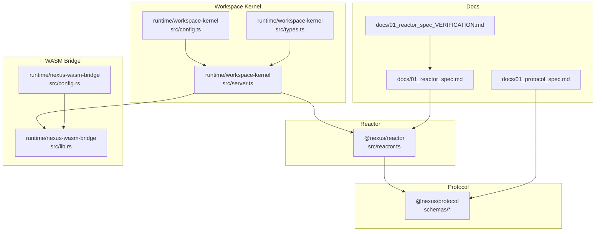
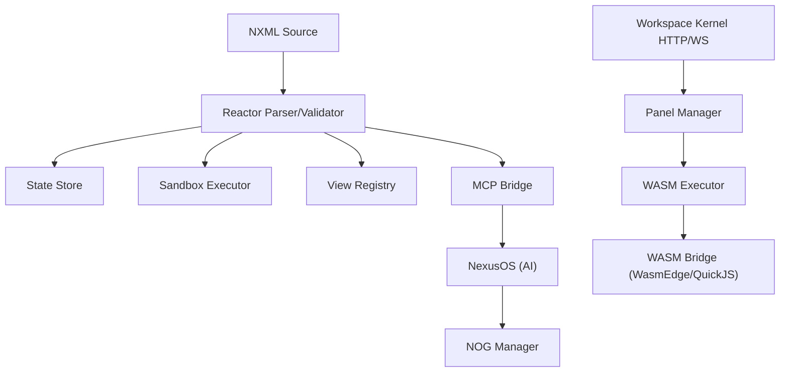
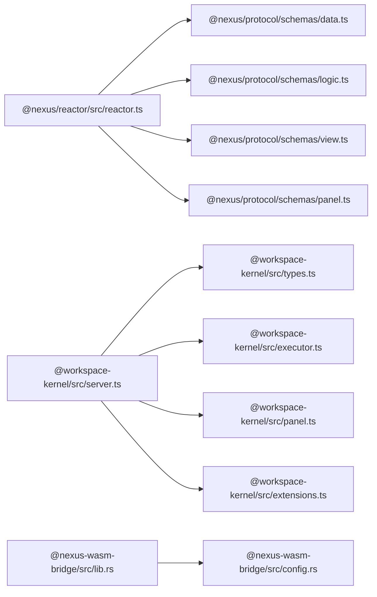

# Appendix

<cite>
**Referenced Files in This Document**
- [docs/nexus_spec.md](file://docs/nexus_spec.md)
- [docs/01_protocol_spec.md](file://docs/01_protocol_spec.md)
- [docs/01_reactor_spec.md](file://docs/01_reactor_spec.md)
- [docs/01_reactor_spec_VERIFICATION.md](file://docs/01_reactor_spec_VERIFICATION.md)
- [runtime/workspace-kernel/src/index.ts](file://runtime/workspace-kernel/src/index.ts)
- [runtime/workspace-kernel/src/server.ts](file://runtime/workspace-kernel/src/server.ts)
- [runtime/workspace-kernel/src/config.ts](file://runtime/workspace-kernel/src/config.ts)
- [runtime/workspace-kernel/src/types.ts](file://runtime/workspace-kernel/src/types.ts)
- [runtime/nexus-wasm-bridge/src/lib.rs](file://runtime/nexus-wasm-bridge/src/lib.rs)
- [runtime/nexus-wasm-bridge/src/config.rs](file://runtime/nexus-wasm-bridge/src/config.rs)
- [packages/nexus-protocol/src/schemas/data.ts](file://packages/nexus-protocol/src/schemas/data.ts)
- [packages/nexus-protocol/src/schemas/logic.ts](file://packages/nexus-protocol/src/schemas/logic.ts)
- [packages/nexus-protocol/src/schemas/view.ts](file://packages/nexus-protocol/src/schemas/view.ts)
- [packages/nexus-protocol/src/schemas/panel.ts](file://packages/nexus-protocol/src/schemas/panel.ts)
- [packages/nexus-reactor/src/reactor.ts](file://packages/nexus-reactor/src/reactor.ts)
</cite>

## Table of Contents
1. [Introduction](#introduction)
2. [Project Structure](#project-structure)
3. [Core Components](#core-components)
4. [Architecture Overview](#architecture-overview)
5. [Detailed Component Analysis](#detailed-component-analysis)
6. [Dependency Analysis](#dependency-analysis)
7. [Performance Considerations](#performance-considerations)
8. [Troubleshooting Guide](#troubleshooting-guide)
9. [Conclusion](#conclusion)
10. [Appendices](#appendices)

## Introduction
This appendix provides quick-access technical reference material for the Nexus platform. It consolidates:
- The complete NXML schema specification with all components, attributes, and valid values
- API endpoints for WorkspaceKernel with request/response examples and status codes
- Configuration options for WorkspaceKernel, WASM Bridge, and Reactor
- Environment variables with descriptions and defaults
- A glossary of technical terms
- Implementation verification metrics for feature completeness

## Project Structure
The Nexus monorepo is organized into:
- Protocol definitions and validation schemas
- Reactor runtime engine
- Workspace kernel (HTTP/WebSocket server, executor, extensions)
- WASM bridge for secure handler execution
- Documentation for specifications and verification

**Diagram sources**
- [packages/nexus-protocol/src/schemas/data.ts](file://packages/nexus-protocol/src/schemas/data.ts#L1-L198)
- [packages/nexus-protocol/src/schemas/logic.ts](file://packages/nexus-protocol/src/schemas/logic.ts#L1-L283)
- [packages/nexus-protocol/src/schemas/view.ts](file://packages/nexus-protocol/src/schemas/view.ts#L1-L359)
- [packages/nexus-protocol/src/schemas/panel.ts](file://packages/nexus-protocol/src/schemas/panel.ts#L1-L275)
- [packages/nexus-reactor/src/reactor.ts](file://packages/nexus-reactor/src/reactor.ts#L1-L260)
- [runtime/workspace-kernel/src/server.ts](file://runtime/workspace-kernel/src/server.ts#L1-L703)
- [runtime/workspace-kernel/src/config.ts](file://runtime/workspace-kernel/src/config.ts#L1-L233)
- [runtime/workspace-kernel/src/types.ts](file://runtime/workspace-kernel/src/types.ts#L1-L368)
- [runtime/nexus-wasm-bridge/src/lib.rs](file://runtime/nexus-wasm-bridge/src/lib.rs#L1-L71)
- [runtime/nexus-wasm-bridge/src/config.rs](file://runtime/nexus-wasm-bridge/src/config.rs#L1-L320)
- [docs/01_protocol_spec.md](file://docs/01_protocol_spec.md#L1-L1748)
- [docs/01_reactor_spec.md](file://docs/01_reactor_spec.md#L1-L491)
- [docs/01_reactor_spec_VERIFICATION.md](file://docs/01_reactor_spec_VERIFICATION.md#L1-L800)

**Section sources**
- [docs/01_protocol_spec.md](file://docs/01_protocol_spec.md#L1-L1748)
- [docs/01_reactor_spec.md](file://docs/01_reactor_spec.md#L1-L491)
- [docs/01_reactor_spec_VERIFICATION.md](file://docs/01_reactor_spec_VERIFICATION.md#L1-L800)
- [runtime/workspace-kernel/src/server.ts](file://runtime/workspace-kernel/src/server.ts#L1-L703)
- [runtime/workspace-kernel/src/config.ts](file://runtime/workspace-kernel/src/config.ts#L1-L233)
- [runtime/workspace-kernel/src/types.ts](file://runtime/workspace-kernel/src/types.ts#L1-L368)
- [runtime/nexus-wasm-bridge/src/lib.rs](file://runtime/nexus-wasm-bridge/src/lib.rs#L1-L71)
- [runtime/nexus-wasm-bridge/src/config.rs](file://runtime/nexus-wasm-bridge/src/config.rs#L1-L320)
- [packages/nexus-protocol/src/schemas/data.ts](file://packages/nexus-protocol/src/schemas/data.ts#L1-L198)
- [packages/nexus-protocol/src/schemas/logic.ts](file://packages/nexus-protocol/src/schemas/logic.ts#L1-L283)
- [packages/nexus-protocol/src/schemas/view.ts](file://packages/nexus-protocol/src/schemas/view.ts#L1-L359)
- [packages/nexus-protocol/src/schemas/panel.ts](file://packages/nexus-protocol/src/schemas/panel.ts#L1-L275)
- [packages/nexus-reactor/src/reactor.ts](file://packages/nexus-reactor/src/reactor.ts#L1-L260)

## Core Components
- NXML (Nexus Extensible Markup Language): Declarative language for panels with three namespaces: Data, Logic, View.
- Reactor: Isomorphic runtime that parses, validates, reacts, and renders NXML into interactive UIs.
- Workspace Kernel: HTTP/WebSocket server exposing panel lifecycle and tool execution APIs.
- WASM Bridge: Secure handler execution via WasmEdge and QuickJS with capability-based isolation.
- Protocol Schemas: Zod-based validation for Data, Logic, View, and complete Panel AST.

**Section sources**
- [docs/01_protocol_spec.md](file://docs/01_protocol_spec.md#L115-L186)
- [packages/nexus-reactor/src/reactor.ts](file://packages/nexus-reactor/src/reactor.ts#L1-L260)
- [runtime/workspace-kernel/src/server.ts](file://runtime/workspace-kernel/src/server.ts#L133-L201)
- [runtime/nexus-wasm-bridge/src/lib.rs](file://runtime/nexus-wasm-bridge/src/lib.rs#L1-L71)
- [packages/nexus-protocol/src/schemas/data.ts](file://packages/nexus-protocol/src/schemas/data.ts#L1-L198)
- [packages/nexus-protocol/src/schemas/logic.ts](file://packages/nexus-protocol/src/schemas/logic.ts#L1-L283)
- [packages/nexus-protocol/src/schemas/view.ts](file://packages/nexus-protocol/src/schemas/view.ts#L1-L359)
- [packages/nexus-protocol/src/schemas/panel.ts](file://packages/nexus-protocol/src/schemas/panel.ts#L1-L275)

## Architecture Overview
High-level runtime and integration architecture:
- NXML source is parsed and validated by the Reactor.
- Reactor creates a state store, sandbox executor, view registry, and MCP bridge.
- Workspace Kernel hosts HTTP and WebSocket endpoints for panel management and tool execution.
- WASM Bridge executes handlers in isolated environments with capability-based security.
- NOG (Nexus Object Graph) underpins cross-panel synchronization and AI context.

**Diagram sources**
- [packages/nexus-reactor/src/reactor.ts](file://packages/nexus-reactor/src/reactor.ts#L1-L260)
- [runtime/workspace-kernel/src/server.ts](file://runtime/workspace-kernel/src/server.ts#L1-L703)
- [runtime/nexus-wasm-bridge/src/lib.rs](file://runtime/nexus-wasm-bridge/src/lib.rs#L1-L71)
- [docs/nexus_spec.md](file://docs/nexus_spec.md#L82-L120)

**Section sources**
- [docs/nexus_spec.md](file://docs/nexus_spec.md#L82-L120)
- [docs/01_protocol_spec.md](file://docs/01_protocol_spec.md#L115-L186)

## Detailed Component Analysis

### NXML Schema Specification
Complete NXML specification with supported types, attributes, and component sets.

- Document structure
  - Root element: NexusPanel with attributes: title, version, id, etc.
  - Namespaces: Data, Logic, View

- Data namespace
  - State: name, type, default
  - Computed: name, value (expression)
  - Supported types: string, number, boolean, list, object
  - Default value coercion rules

- Logic namespace
  - Tools: name, description, args (name, type, required, default, description), handler (code)
  - Lifecycles: mount, unmount
  - Extensions: name (format: namespace.capability), alias, source
  - Sandbox API: $state, $args, $view, $ext, $emit, $log

- View namespace
  - Global attributes: id, trigger, args
  - Categories and components with props:
    - Layout: strategy, gap, align, justify
    - Container: title, variant
    - Control Flow: If (condition), Iterate (items, as, key)
    - Display: Text (content, variant), Metric (label, value, unit, trend), StatusBadge (label, status, value), LogStream (data, height, autoScroll), Chart (type, data, xKey, yKey, height)
    - Input: Input (bind, placeholder, inputType, disabled), Button (label, trigger, variant, args, disabled), Action (semantic alias requiring trigger), Switch (bind, label, disabled)

- Validation rules
  - Forbidden globals in handlers
  - Identifier validation
  - Uniqueness constraints (state names, tool names, view ids, extension aliases)
  - Cross-reference integrity (state refs, trigger refs, extension usage)
  - Warnings for unused state and tools

- NOG (Nexus Object Graph)
  - Entities and relationships for semantic synchronization
  - Patch types and explicit sync workflow

- Layout weights and algorithm
  - Component weights for 12-column grid
  - Tetris-style layout algorithm

- API reference
  - Factory and utility functions
  - Type guards and query helpers
  - Validation functions

**Section sources**
- [docs/01_protocol_spec.md](file://docs/01_protocol_spec.md#L115-L186)
- [docs/01_protocol_spec.md](file://docs/01_protocol_spec.md#L140-L216)
- [docs/01_protocol_spec.md](file://docs/01_protocol_spec.md#L238-L436)
- [docs/01_protocol_spec.md](file://docs/01_protocol_spec.md#L438-L843)
- [docs/01_protocol_spec.md](file://docs/01_protocol_spec.md#L847-L1051)
- [docs/01_protocol_spec.md](file://docs/01_protocol_spec.md#L1055-L1290)
- [docs/01_protocol_spec.md](file://docs/01_protocol_spec.md#L1293-L1351)
- [docs/01_protocol_spec.md](file://docs/01_protocol_spec.md#L1353-L1401)
- [docs/01_protocol_spec.md](file://docs/01_protocol_spec.md#L1537-L1593)
- [docs/01_protocol_spec.md](file://docs/01_protocol_spec.md#L1596-L1748)
- [packages/nexus-protocol/src/schemas/data.ts](file://packages/nexus-protocol/src/schemas/data.ts#L1-L198)
- [packages/nexus-protocol/src/schemas/logic.ts](file://packages/nexus-protocol/src/schemas/logic.ts#L1-L283)
- [packages/nexus-protocol/src/schemas/view.ts](file://packages/nexus-protocol/src/schemas/view.ts#L1-L359)
- [packages/nexus-protocol/src/schemas/panel.ts](file://packages/nexus-protocol/src/schemas/panel.ts#L1-L275)

### Reactor API and Behavior
- Reactor class orchestration
  - Constructor: parse, validate, process layout, create state store, sandbox, view registry, MCP bridge
  - Lifecycle: mount/unmount with lifecycle handlers
  - Tool execution: executeTool with sandbox context and error handling
  - Component retrieval: getComponent for rendering
  - Enhanced API: getState, setState, getTools, readResource, debug mode

- Implementation verification highlights
  - 99.5% compliance across major spec areas
  - Enhanced features: MCP bridge, event system, logging, unmount, debug flag

**Section sources**
- [packages/nexus-reactor/src/reactor.ts](file://packages/nexus-reactor/src/reactor.ts#L1-L260)
- [docs/01_reactor_spec.md](file://docs/01_reactor_spec.md#L1-L491)
- [docs/01_reactor_spec_VERIFICATION.md](file://docs/01_reactor_spec_VERIFICATION.md#L1-L800)

### Workspace Kernel API Reference
HTTP and WebSocket endpoints for panel management and tool execution.

- HTTP Endpoints
  - GET /health
    - Response: HealthResponse with status, version, uptime, panel counts, runtime metrics
    - Example response: see HealthResponse shape
    - Status codes: 200 OK
  - GET /metrics
    - Response: Plain text metrics
    - Status codes: 200 OK
  - POST /panels
    - Request body: CreatePanelRequest (kind, title, tools, initialState, capabilities, metadata)
    - Response: CreatePanelResponse (id, status, wsUrl)
    - Status codes: 201 Created, 400 Bad Request (Zod validation)
  - GET /panels
    - Response: ListPanelsResponse (panels[], total)
    - Status codes: 200 OK
  - GET /panels/:id
    - Response: PanelInfoResponse (id, kind, title, status, state, tools, timestamps, clientCount)
    - Status codes: 200 OK, 404 Not Found
  - GET /panels/:id/state
    - Response: Panel state object
    - Status codes: 200 OK, 404 Not Found
  - DELETE /panels/:id
    - Response: 204 No Content
    - Status codes: 204 No Content, 404 Not Found
  - POST /panels/:id/trigger/:tool
    - Request body: Tool arguments
    - Response: ExecutionResult (status, returnValue, stateMutations, events, viewCommands, suspension?, error?, metrics)
    - Status codes: 200 OK, 404 Not Found (panel/tool), 500 Internal Server Error

- WebSocket Endpoints
  - Upgrade path: /panels/:id/ws?token=...
  - Message types:
    - Client to server: TRIGGER (tool, args, requestId), SUBSCRIBE (topics), UNSUBSCRIBE (topics), PING
    - Server to client: CONNECTED (panelId, state), RESULT (requestId, result), PATCH (mutations), EVENT (event), PROGRESS (suspensionId, status, data?), ERROR (code, message), PONG
  - Behavior:
    - Authentication via JWT when enabled
    - Execution of tool handlers, immediate state mutation broadcasting, event emission, suspension handling, and resumption

- Error handling
  - Middleware logs requests and returns 401 for missing/invalid auth
  - Route handlers return structured errors with Zod validation details
  - WebSocket message parsing errors return ERROR with code PARSE_ERROR

**Section sources**
- [runtime/workspace-kernel/src/server.ts](file://runtime/workspace-kernel/src/server.ts#L133-L201)
- [runtime/workspace-kernel/src/server.ts](file://runtime/workspace-kernel/src/server.ts#L297-L451)
- [runtime/workspace-kernel/src/server.ts](file://runtime/workspace-kernel/src/server.ts#L478-L642)
- [runtime/workspace-kernel/src/types.ts](file://runtime/workspace-kernel/src/types.ts#L206-L274)
- [runtime/workspace-kernel/src/types.ts](file://runtime/workspace-kernel/src/types.ts#L177-L204)

### WASM Bridge and Runtime Configuration
- Rust library overview
  - Node.js N-API interface to invoke handlers
  - QuickJS wrapper injection of $state, $args, $emit, etc.
  - Instance pooling, capability-based security, suspend/resume, compilation caching

- Runtime configuration (Rust)
  - RuntimeConfig: max_instances, memory_limit_bytes, stack_size_bytes, enable_simd/bulk_memory, quickjs_module_path, enable_aot, cache_dir, debug
  - ResourceLimits: timeout_ms, memory_limit_bytes, stack_size_bytes, max_host_calls, max_state_mutations, max_events
  - Validation rules for minimum values

**Section sources**
- [runtime/nexus-wasm-bridge/src/lib.rs](file://runtime/nexus-wasm-bridge/src/lib.rs#L1-L71)
- [runtime/nexus-wasm-bridge/src/config.rs](file://runtime/nexus-wasm-bridge/src/config.rs#L1-L320)

### Reactor Implementation Verification Metrics
- Compliance summary
  - Architecture, Parser, State System, Sandbox, Layout Engine, View Hydration, Imperative Bridge, MCP Integration, Error Handling, Test Harness
  - Overall compliance: 99.5%
- Notable enhancements
  - MCP bridge, event system, logging, unmount lifecycle, debug flag

**Section sources**
- [docs/01_reactor_spec_VERIFICATION.md](file://docs/01_reactor_spec_VERIFICATION.md#L1-L800)

## Dependency Analysis
Component relationships and imports across modules.

**Diagram sources**
- [packages/nexus-reactor/src/reactor.ts](file://packages/nexus-reactor/src/reactor.ts#L1-L260)
- [packages/nexus-protocol/src/schemas/data.ts](file://packages/nexus-protocol/src/schemas/data.ts#L1-L198)
- [packages/nexus-protocol/src/schemas/logic.ts](file://packages/nexus-protocol/src/schemas/logic.ts#L1-L283)
- [packages/nexus-protocol/src/schemas/view.ts](file://packages/nexus-protocol/src/schemas/view.ts#L1-L359)
- [packages/nexus-protocol/src/schemas/panel.ts](file://packages/nexus-protocol/src/schemas/panel.ts#L1-L275)
- [runtime/workspace-kernel/src/server.ts](file://runtime/workspace-kernel/src/server.ts#L1-L703)
- [runtime/workspace-kernel/src/types.ts](file://runtime/workspace-kernel/src/types.ts#L1-L368)
- [runtime/nexus-wasm-bridge/src/lib.rs](file://runtime/nexus-wasm-bridge/src/lib.rs#L1-L71)
- [runtime/nexus-wasm-bridge/src/config.rs](file://runtime/nexus-wasm-bridge/src/config.rs#L1-L320)

**Section sources**
- [packages/nexus-reactor/src/reactor.ts](file://packages/nexus-reactor/src/reactor.ts#L1-L260)
- [runtime/workspace-kernel/src/server.ts](file://runtime/workspace-kernel/src/server.ts#L1-L703)
- [runtime/nexus-wasm-bridge/src/lib.rs](file://runtime/nexus-wasm-bridge/src/lib.rs#L1-L71)

## Performance Considerations
- Reactor
  - Fine-grained reactivity minimizes unnecessary renders
  - Layout engine computes deterministic geometry before first render
  - Imperative view bridge avoids polluting reactive state history
- Workspace Kernel
  - Instance pooling and resource limits for WASM runtime
  - Request body limits and CORS configuration
  - Graceful shutdown and signal handling
- WASM Bridge
  - Instance pool sizing, memory and stack limits
  - Compilation caching and AOT toggles
  - Capability-based isolation reduces overhead

[No sources needed since this section provides general guidance]

## Troubleshooting Guide
- Reactor
  - Validation failures: inspect validation errors and warnings; ensure unique identifiers and cross-references
  - Sandbox errors: caught and logged; check tool execution results and emitted events
  - Missing ErrorBoundary: consider adding for robust UI error handling
- Workspace Kernel
  - Authentication: ensure Authorization header with Bearer token when auth is enabled
  - WebSocket upgrades: verify token query param and panel existence
  - Handler execution: review ExecutionResult for stateMutations, events, suspension, and error details
- WASM Bridge
  - Configuration validation: confirm minimum values for memory and timeouts
  - Instance limits: adjust max_instances and memory_limit_bytes according to workload

**Section sources**
- [packages/nexus-reactor/src/reactor.ts](file://packages/nexus-reactor/src/reactor.ts#L144-L180)
- [docs/01_reactor_spec_VERIFICATION.md](file://docs/01_reactor_spec_VERIFICATION.md#L743-L800)
- [runtime/workspace-kernel/src/server.ts](file://runtime/workspace-kernel/src/server.ts#L105-L129)
- [runtime/workspace-kernel/src/server.ts](file://runtime/workspace-kernel/src/server.ts#L297-L451)
- [runtime/workspace-kernel/src/types.ts](file://runtime/workspace-kernel/src/types.ts#L96-L175)
- [runtime/nexus-wasm-bridge/src/config.rs](file://runtime/nexus-wasm-bridge/src/config.rs#L144-L169)

## Conclusion
This appendix consolidates the NXML schema, API endpoints, configuration options, environment variables, and verification metrics for rapid reference. Use the NXML specification to define panels, the Reactor to execute them, the Workspace Kernel to manage and run them, and the WASM Bridge for secure handler execution.

[No sources needed since this section summarizes without analyzing specific files]

## Appendices

### A. NXML Components and Attributes Reference
- Data
  - State: name, type, default
  - Computed: name, value
- Logic
  - Tool: name, description, args[], handler
  - Lifecycle: mount/unmount
  - Extension: name, alias, source
- View
  - Layout: strategy, gap, align, justify
  - Container: title, variant
  - Control Flow: If(condition), Iterate(items, as, key)
  - Display: Text(content, variant), Metric(label, value, unit, trend), StatusBadge(label, status, value), LogStream(data, height, autoScroll), Chart(type, data, xKey, yKey, height)
  - Input: Input(bind, placeholder, inputType, disabled), Button(label, trigger, variant, args, disabled), Action(label, trigger, variant, args, disabled), Switch(bind, label, disabled)

**Section sources**
- [docs/01_protocol_spec.md](file://docs/01_protocol_spec.md#L140-L216)
- [docs/01_protocol_spec.md](file://docs/01_protocol_spec.md#L238-L436)
- [docs/01_protocol_spec.md](file://docs/01_protocol_spec.md#L438-L843)
- [packages/nexus-protocol/src/schemas/data.ts](file://packages/nexus-protocol/src/schemas/data.ts#L1-L198)
- [packages/nexus-protocol/src/schemas/logic.ts](file://packages/nexus-protocol/src/schemas/logic.ts#L1-L283)
- [packages/nexus-protocol/src/schemas/view.ts](file://packages/nexus-protocol/src/schemas/view.ts#L1-L359)

### B. API Endpoints Reference
- HTTP
  - GET /health: HealthResponse
  - GET /metrics: text/plain metrics
  - POST /panels: CreatePanelRequest → CreatePanelResponse
  - GET /panels: ListPanelsResponse
  - GET /panels/:id: PanelInfoResponse
  - GET /panels/:id/state: Panel state
  - DELETE /panels/:id: 204 No Content
  - POST /panels/:id/trigger/:tool: ExecutionResult
- WebSocket
  - Upgrade: /panels/:id/ws?token=...
  - Messages: TRIGGER, SUBSCRIBE, UNSUBSCRIBE, PING → CONNECTED, RESULT, PATCH, EVENT, PROGRESS, ERROR, PONG

**Section sources**
- [runtime/workspace-kernel/src/server.ts](file://runtime/workspace-kernel/src/server.ts#L133-L201)
- [runtime/workspace-kernel/src/server.ts](file://runtime/workspace-kernel/src/server.ts#L297-L451)
- [runtime/workspace-kernel/src/server.ts](file://runtime/workspace-kernel/src/server.ts#L478-L642)
- [runtime/workspace-kernel/src/types.ts](file://runtime/workspace-kernel/src/types.ts#L177-L204)

### C. Configuration Options Reference
- Workspace Kernel (Node.js)
  - server: httpPort, wsPort, host, jwtSecret, authEnabled, corsOrigins, bodyLimit
  - runtime: maxInstances, minInstances, memoryLimitBytes, timeoutMs, maxHostCalls, cacheDir, maxCacheSizeBytes
  - extensions.http: maxConcurrent, defaultTimeout, allowedDomains, userAgent
  - logging: level, pretty
- WASM Bridge (Rust)
  - RuntimeConfig: max_instances, memory_limit_bytes, stack_size_bytes, enable_simd, enable_bulk_memory, quickjs_module_path, enable_aot, cache_dir, debug
  - ResourceLimits: timeout_ms, memory_limit_bytes, stack_size_bytes, max_host_calls, max_state_mutations, max_events

**Section sources**
- [runtime/workspace-kernel/src/config.ts](file://runtime/workspace-kernel/src/config.ts#L1-L233)
- [runtime/workspace-kernel/src/types.ts](file://runtime/workspace-kernel/src/types.ts#L303-L368)
- [runtime/nexus-wasm-bridge/src/config.rs](file://runtime/nexus-wasm-bridge/src/config.rs#L1-L320)

### D. Environment Variables Reference
- Workspace Kernel
  - HTTP_PORT, WS_PORT, HOST, JWT_SECRET, AUTH_ENABLED, CORS_ORIGINS, BODY_LIMIT
  - MAX_INSTANCES, MIN_INSTANCES, MEMORY_LIMIT_MB, TIMEOUT_MS, MAX_HOST_CALLS, CACHE_DIR
  - HTTP_MAX_CONCURRENT, HTTP_TIMEOUT, HTTP_ALLOWED_DOMAINS, LOG_LEVEL, LOG_PRETTY
- WASM Bridge (Rust)
  - RuntimeConfig defaults apply when not configured; cache_dir defaults to .nexus-cache

**Section sources**
- [runtime/workspace-kernel/src/config.ts](file://runtime/workspace-kernel/src/config.ts#L73-L123)
- [runtime/nexus-wasm-bridge/src/config.rs](file://runtime/nexus-wasm-bridge/src/config.rs#L1-L120)

### E. Glossary
- NXML: Nexus Extensible Markup Language for declarative panel definitions
- Reactor: Isomorphic runtime engine for NXML panels
- Workspace Kernel: HTTP/WebSocket server for panel lifecycle and tool execution
- WASM Bridge: Secure handler execution via WasmEdge and QuickJS
- NOG: Nexus Object Graph for semantic synchronization
- MCP: Model Context Protocol for AI integration
- ViewRegistry: Imperative view bridge for transient UI updates
- Suspensions: Asynchronous handler suspension and resumption

**Section sources**
- [docs/01_protocol_spec.md](file://docs/01_protocol_spec.md#L1-L1748)
- [docs/01_reactor_spec.md](file://docs/01_reactor_spec.md#L1-L491)
- [docs/01_reactor_spec_VERIFICATION.md](file://docs/01_reactor_spec_VERIFICATION.md#L1-L800)
- [runtime/workspace-kernel/src/server.ts](file://runtime/workspace-kernel/src/server.ts#L1-L703)
- [runtime/nexus-wasm-bridge/src/lib.rs](file://runtime/nexus-wasm-bridge/src/lib.rs#L1-L71)

### F. Implementation Verification Metrics
- Reactor
  - Compliance: 99.5% across major spec areas
  - Enhancements: MCP bridge, event system, logging, unmount, debug flag
- Workspace Kernel
  - HTTP/WebSocket endpoints implemented with validation and error handling
  - Suspension/resumption flow for async handlers
- WASM Bridge
  - Configuration validation and resource limits
  - Capability-based security model

**Section sources**
- [docs/01_reactor_spec_VERIFICATION.md](file://docs/01_reactor_spec_VERIFICATION.md#L1-L800)
- [runtime/workspace-kernel/src/server.ts](file://runtime/workspace-kernel/src/server.ts#L297-L451)
- [runtime/nexus-wasm-bridge/src/config.rs](file://runtime/nexus-wasm-bridge/src/config.rs#L144-L169)