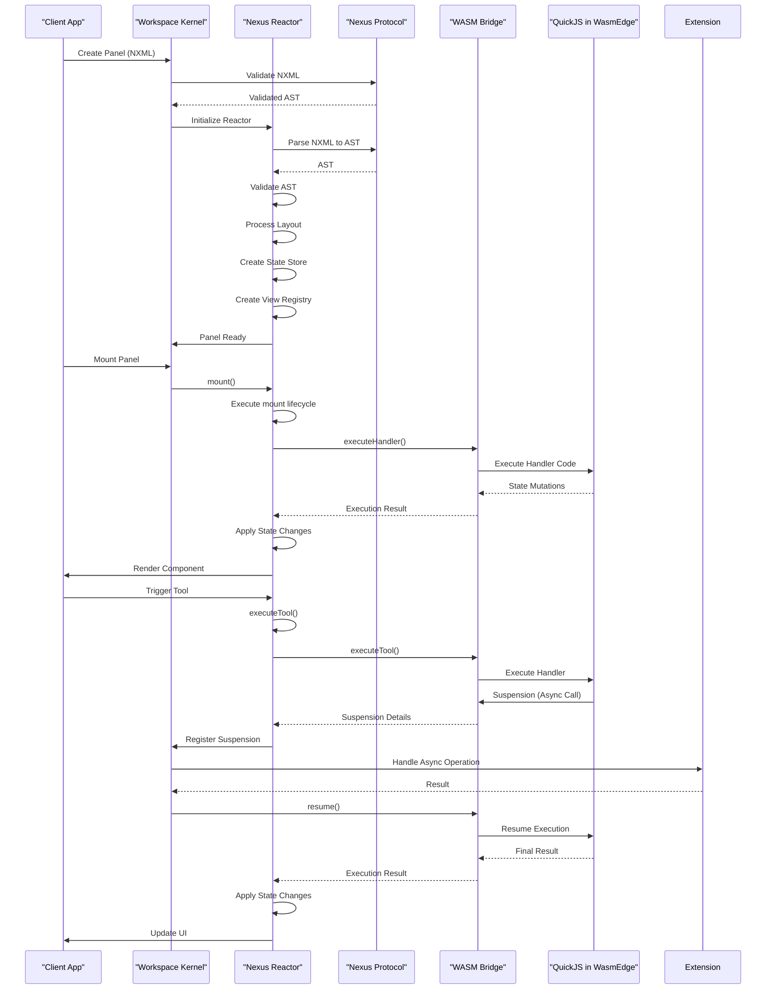

# Core Components

<cite>
**Referenced Files in This Document**   
- [nexus-protocol/src/index.ts](file://packages/nexus-protocol/src/index.ts)
- [nexus-protocol/src/ast/index.ts](file://packages/nexus-protocol/src/ast/index.ts)
- [nexus-protocol/src/nog/index.ts](file://packages/nexus-protocol/src/nog/index.ts)
- [nexus-reactor/src/index.ts](file://packages/nexus-reactor/src/index.ts)
- [nexus-reactor/src/reactor.ts](file://packages/nexus-reactor/src/reactor.ts)
- [nexus-reactor/src/state/store.ts](file://packages/nexus-reactor/src/state/store.ts)
- [nexus-reactor/src/sandbox/executor.ts](file://packages/nexus-reactor/src/sandbox/executor.ts)
- [nexus-reactor/src/view/hydrator.tsx](file://packages/nexus-reactor/src/view/hydrator.tsx)
- [runtime/workspace-kernel/src/index.ts](file://runtime/workspace-kernel/src/index.ts)
- [runtime/workspace-kernel/src/panel.ts](file://runtime/workspace-kernel/src/panel.ts)
- [runtime/workspace-kernel/src/executor.ts](file://runtime/workspace-kernel/src/executor.ts)
- [runtime/nexus-wasm-bridge/src/lib.rs](file://runtime/nexus-wasm-bridge/src/lib.rs)
- [runtime/nexus-wasm-bridge/Cargo.toml](file://runtime/nexus-wasm-bridge/Cargo.toml)
</cite>

## Table of Contents
1. [Nexus Protocol](#nexus-protocol)
2. [Nexus Reactor](#nexus-reactor)
3. [Workspace Kernel](#workspace-kernel)
4. [WASM Bridge](#wasm-bridge)
5. [Data Flow Sequence](#data-flow-sequence)

## Nexus Protocol

The Nexus Protocol serves as the foundational type system and AST (Abstract Syntax Tree) specification for the Nexus platform. It defines the structure, validation rules, and semantic relationships for NXML (Nexus Extensible Markup Language) panels through a modular architecture.

### Public Interfaces
The protocol exposes a comprehensive set of TypeScript types and utility functions through its main entry point:
- **AST Types**: `NexusPanelAST`, `DataAST`, `LogicAST`, `ViewAST` and their constituent nodes
- **Validation Schemas**: Zod-based schemas for runtime type checking with strict and basic variants
- **NOG System**: `createNOGGraph`, `addEntity`, `addRelationship`, `findPath` for semantic graph operations
- **Utilities**: `traverseViewTree`, `getAllBindings`, `validatePanelAST` for AST analysis

### Internal Architecture
The protocol is organized into four core modules:
1. **AST**: Defines the complete type hierarchy for NXML panels with strongly-typed interfaces for data, logic, and view components
2. **Schemas**: Implements Zod validation schemas with cross-reference checking between namespaces
3. **NOG (Nexus Object Graph)**: Maintains a semantic knowledge graph of entities and relationships across panels
4. **Utils**: Provides helper functions for AST manipulation, type coercion, and validation

The architecture enforces namespace isolation where Data, Logic, and View components interact only through explicit bindings (`$state.x`) and triggers (`trigger: 'toolName'`). All AST operations are immutable, returning new objects to enable reliable change detection.

### Integration Points
The protocol integrates with other components through:
- **Reactor**: Provides AST types and validation for NXML parsing
- **NOG System**: Enables cross-panel synchronization through semantic relationships
- **Workspace Kernel**: Supplies schema definitions for panel validation during creation

### Key Implementation Details
- **Immutable Operations**: All AST manipulation functions return new instances rather than mutating in place
- **Explicit Sync Workflow**: Changes to one panel generate patch proposals for related panels via the NOG system
- **Sandbox Security**: Validates handler code to block dangerous globals like `window`, `document`, and `eval`

### Performance Considerations
The protocol uses Zod for runtime validation with optimized schema compilation. The NOG graph implementation supports efficient pathfinding and relationship queries through indexed data structures. For large workspaces, incremental validation can be performed on modified panels rather than full workspace validation.

**Section sources**
- [nexus-protocol/src/index.ts](file://packages/nexus-protocol/src/index.ts#L1-L64)
- [nexus-protocol/src/ast/index.ts](file://packages/nexus-protocol/src/ast/index.ts#L1-L178)
- [nexus-protocol/src/nog/index.ts](file://packages/nexus-protocol/src/nog/index.ts#L1-L129)

## Nexus Reactor

The Nexus Reactor is the isomorphic execution engine that transforms NXML definitions into interactive React applications. It orchestrates parsing, state management, sandboxed execution, and view rendering.

### Public Interfaces
The reactor exposes the following main interfaces:
- **NexusReactor Class**: Primary entry point with methods like `mount()`, `unmount()`, `executeTool()`, and `getComponent()`
- **State API**: `createStateStore`, `subscribe`, `getSnapshot` for reactive state management
- **Parser API**: `parse`, `validate`, `validateOrThrow` for NXML processing
- **Sandbox API**: `createSandboxExecutor`, `createViewAPI` for secure execution
- **MCP Bridge**: `createMCPBridge`, `getToolsDescription` for AI integration

### Internal Architecture
The reactor is structured into six core modules:
1. **Core**: Contains fundamental types, constants, and error definitions
2. **Parser**: Implements lexer, parser, and validator for NXML source code
3. **State**: Manages reactive state through Proxy-based reactivity with computed values
4. **Sandbox**: Executes handler code in isolated environments with capability-based security
5. **Layout**: Processes view layouts using a 12-column grid system with automatic flow
6. **View**: Handles component hydration, registry, and imperative view manipulation

The reactor follows a pipeline architecture: NXML source → AST → validated AST → layout-enhanced AST → state store + sandbox + view registry → React component.

### Integration Points
The reactor integrates with:
- **Protocol**: Uses AST types and validation schemas
- **WASM Bridge**: Delegates handler execution to the secure WASM runtime
- **Workspace Kernel**: Receives execution commands and reports state changes
- **MCP System**: Exposes tools and state for AI interaction

### Key Implementation Details
- **Proxy-based Reactivity**: The state store uses JavaScript Proxies to track property access and automatically notify subscribers of changes
- **Computed Values**: Derived values are cached and invalidated when dependencies change
- **Sandbox Security**: Handler code runs in a strict mode environment with forbidden globals shadowed as `undefined`
- **Throttled Updates**: Prevents infinite loops by limiting maximum update depth to 50

### Performance Considerations
The reactor optimizes performance through:
- **Fine-grained Reactivity**: Only components that depend on changed state are re-rendered
- **Layout Caching**: Processed layout information is cached to avoid recalculation
- **Lazy Component Creation**: React components are created only when first requested
- **Batched Updates**: State changes are processed in batches to minimize re-renders

**Section sources**
- [nexus-reactor/src/index.ts](file://packages/nexus-reactor/src/index.ts#L1-L190)
- [nexus-reactor/src/reactor.ts](file://packages/nexus-reactor/src/reactor.ts#L1-L260)
- [nexus-reactor/src/state/store.ts](file://packages/nexus-reactor/src/state/store.ts#L1-L255)
- [nexus-reactor/src/sandbox/executor.ts](file://packages/nexus-reactor/src/sandbox/executor.ts#L1-L161)
- [nexus-reactor/src/view/hydrator.tsx](file://packages/nexus-reactor/src/view/hydrator.tsx#L1-L258)

## Workspace Kernel

The Workspace Kernel manages panel lifecycle, execution coordination, and real-time communication between components. It serves as the central orchestrator for the Nexus runtime environment.

### Public Interfaces
The kernel provides:
- **start()**: Initializes the kernel with configuration and returns a server instance
- **stop()**: Gracefully shuts down the kernel and all subsystems
- **getServer()**: Retrieves the current server instance
- **getPanelManager()**: Accesses the panel lifecycle manager
- **getExecutor()**: Obtains the WASM execution handler

### Internal Architecture
The kernel consists of three main subsystems:
1. **Panel Manager**: Tracks panel instances, their state, and lifecycle events
2. **WASM Executor**: Bridges to the Rust-based WASM runtime for secure execution
3. **Server**: Handles HTTP and WebSocket connections for client communication

The kernel uses an event-driven architecture with EventEmitter for inter-component communication. It manages resource limits, connection pooling, and graceful shutdown procedures.

### Integration Points
The kernel integrates with:
- **Reactor**: Coordinates panel execution and state synchronization
- **WASM Bridge**: Routes execution requests to the secure runtime
- **Panel Manager**: Manages creation, suspension, and destruction of panels
- **WebSocket Clients**: Provides real-time updates to connected clients

### Key Implementation Details
- **Real-time Communication**: Uses WebSocket connections to push state changes and events to clients
- **Suspension Management**: Tracks suspended handlers and manages their resumption
- **Resource Limits**: Enforces limits on concurrent instances, memory usage, and execution time
- **Graceful Shutdown**: Handles process signals (SIGTERM, SIGINT) to cleanly terminate all operations

### Performance Considerations
The kernel is designed for scalability with:
- **Connection Pooling**: Reuses WASM instances to minimize startup overhead
- **MessagePack Serialization**: Uses efficient binary serialization for inter-process communication
- **Asynchronous Processing**: Handles all I/O operations asynchronously to maximize throughput
- **Memory Management**: Monitors and limits memory usage per panel to prevent resource exhaustion

**Section sources**
- [runtime/workspace-kernel/src/index.ts](file://runtime/workspace-kernel/src/index.ts#L1-L149)
- [runtime/workspace-kernel/src/panel.ts](file://runtime/workspace-kernel/src/panel.ts#L1-L437)
- [runtime/workspace-kernel/src/executor.ts](file://runtime/workspace-kernel/src/executor.ts#L1-L541)

## WASM Bridge

The WASM Bridge provides secure, isolated execution of JavaScript handler code using WasmEdge and QuickJS. It acts as a security boundary between untrusted handler code and the host environment.

### Public Interfaces
The bridge exposes:
- **createRuntime()**: Initializes a new WASM runtime instance with configuration
- **execute()**: Runs handler code with execution context and timeout
- **executeCompiled()**: Executes pre-compiled bytecode for improved performance
- **precompile()**: Compiles handler code to bytecode for caching
- **resume()**: Resumes suspended asynchronous operations
- **getMetrics()**: Retrieves Prometheus-formatted performance metrics

### Internal Architecture
The bridge is implemented as a Rust library with N-API bindings for Node.js integration:
1. **Engine Module**: Manages WASM instance lifecycle, compilation, and execution
2. **Host Functions**: Implements secure APIs for state access, logging, and event emission
3. **Capability System**: Enforces capability-based security for extension access
4. **Context Management**: Handles execution context serialization and deserialization
5. **Metrics Collection**: Tracks performance metrics for monitoring and optimization

The architecture follows a microkernel pattern where the minimal trusted computing base runs in Rust, while JavaScript execution occurs in isolated WASM instances.

### Integration Points
The bridge integrates with:
- **Workspace Kernel**: Receives execution requests via N-API
- **Reactor**: Executes handler code and returns results
- **Extensions System**: Provides capability-limited access to external resources
- **QuickJS**: Runs JavaScript code within the WASM sandbox

### Key Implementation Details
- **Capability-based Security**: Handlers must declare required capabilities (e.g., `nexus.http`) to access external resources
- **True Isolation**: Each handler runs in a separate WASM instance with no access to Node.js globals
- **Suspend/Resume**: Uses Asyncify to pause execution during async operations and resume with results
- **Instance Pooling**: Maintains a pool of pre-initialized WASM instances for low-latency execution
- **Compilation Caching**: Stores compiled bytecode on disk to avoid recompilation

### Performance Considerations
The bridge optimizes performance through:
- **Bytecode Caching**: Compiled WASM modules are cached persistently
- **Instance Reuse**: WASM instances are pooled and reused across executions
- **Efficient Serialization**: Uses MessagePack for fast context serialization
- **Parallel Execution**: Multiple WASM instances can run concurrently within resource limits

**Section sources**
- [runtime/nexus-wasm-bridge/src/lib.rs](file://runtime/nexus-wasm-bridge/src/lib.rs#L1-L71)
- [runtime/nexus-wasm-bridge/Cargo.toml](file://runtime/nexus-wasm-bridge/Cargo.toml#L1-L63)

## Data Flow Sequence

The following sequence diagram illustrates the complete data flow from NXML input through parsing, execution, and rendering:

**Diagram sources**
- [nexus-protocol/src/index.ts](file://packages/nexus-protocol/src/index.ts#L1-L64)
- [nexus-reactor/src/reactor.ts](file://packages/nexus-reactor/src/reactor.ts#L1-L260)
- [runtime/workspace-kernel/src/index.ts](file://runtime/workspace-kernel/src/index.ts#L1-L149)
- [runtime/nexus-wasm-bridge/src/lib.rs](file://runtime/nexus-wasm-bridge/src/lib.rs#L1-L71)