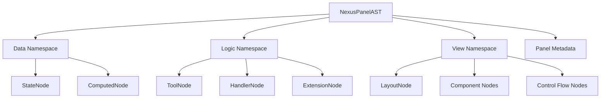
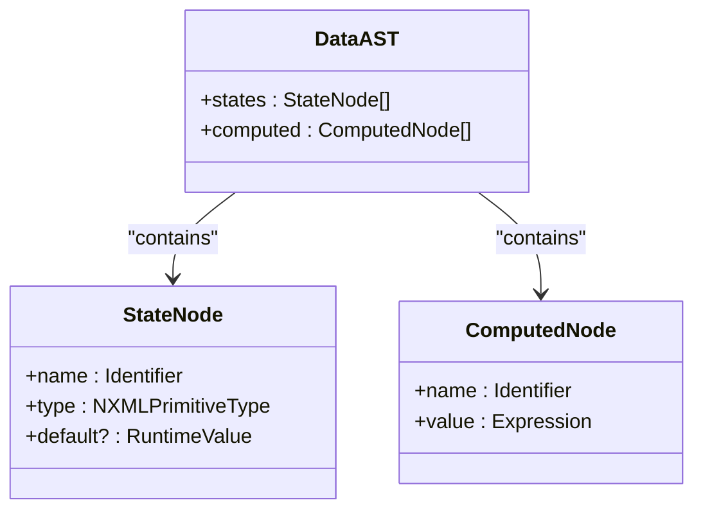
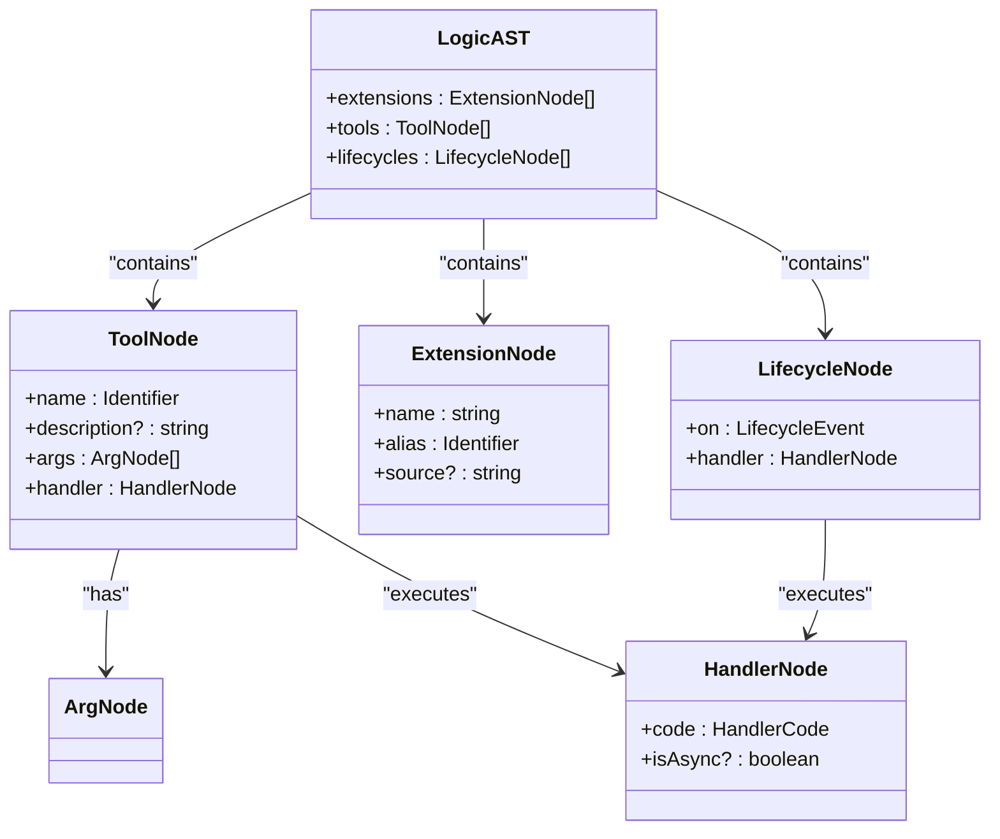
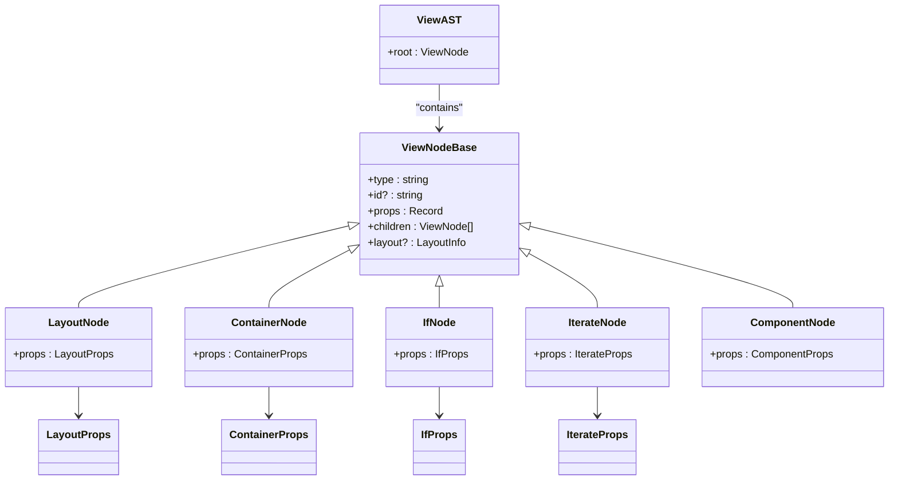
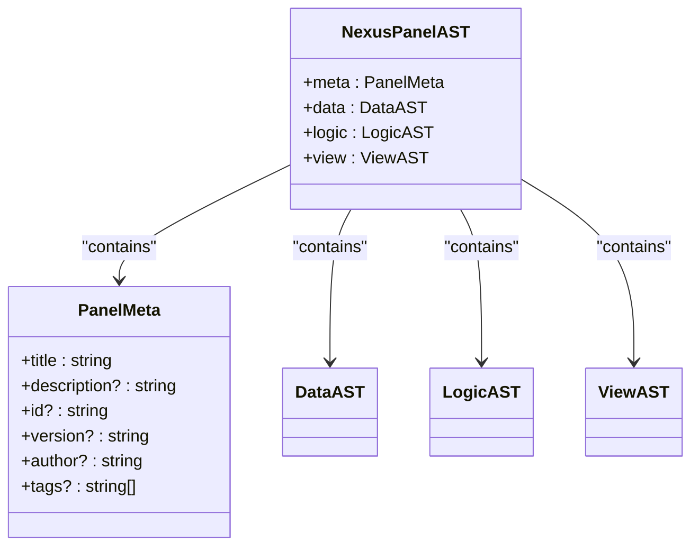
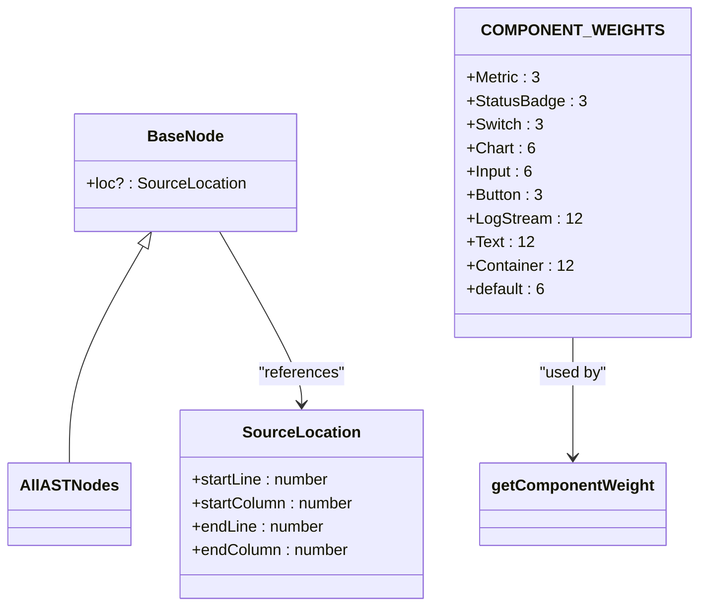
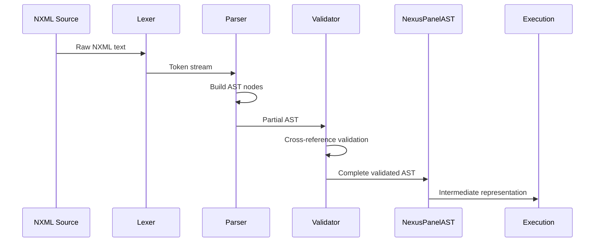
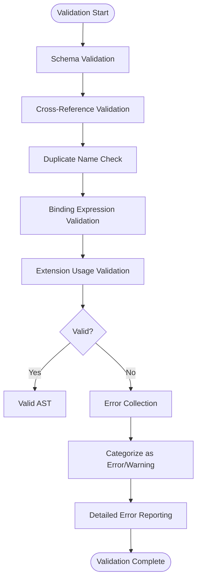
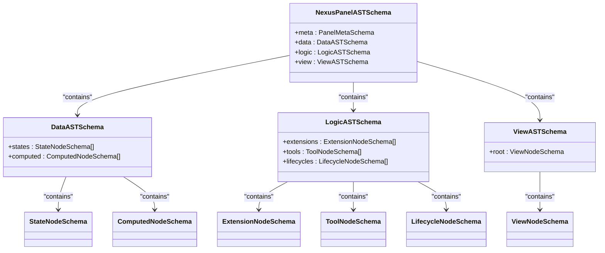

# Abstract Syntax Tree (AST)

<cite>
**Referenced Files in This Document**   
- [common.ts](file://packages/nexus-protocol/src/ast/common.ts)
- [data.ts](file://packages/nexus-protocol/src/ast/data.ts)
- [logic.ts](file://packages/nexus-protocol/src/ast/logic.ts)
- [view.ts](file://packages/nexus-protocol/src/ast/view.ts)
- [panel.ts](file://packages/nexus-protocol/src/ast/panel.ts)
- [index.ts](file://packages/nexus-protocol/src/ast/index.ts)
- [data.ts](file://packages/nexus-protocol/src/schemas/data.ts)
- [logic.ts](file://packages/nexus-protocol/src/schemas/logic.ts)
- [view.ts](file://packages/nexus-protocol/src/schemas/view.ts)
- [panel.ts](file://packages/nexus-protocol/src/schemas/panel.ts)
</cite>

## Table of Contents
1. [Introduction](#introduction)
2. [AST Structure Overview](#ast-structure-overview)
3. [Data Namespace](#data-namespace)
4. [Logic Namespace](#logic-namespace)
5. [View Namespace](#view-namespace)
6. [Panel (Root) Namespace](#panel-root-namespace)
7. [Common Types and Utilities](#common-types-and-utilities)
8. [AST Construction and Parsing Workflow](#ast-construction-and-parsing-workflow)
9. [Validation and Error Handling](#validation-and-error-handling)
10. [Integration with Schema Validation](#integration-with-schema-validation)
11. [Conclusion](#conclusion)

## Introduction

The Abstract Syntax Tree (AST) module in the Nexus Protocol serves as the intermediate representation between NXML source code and the execution engine. It provides a structured, typed representation of panel definitions that enables semantic analysis, validation, and code generation. The AST is organized into four primary namespaces: data, logic, view, and panel, each representing a distinct aspect of panel functionality.

This documentation provides a comprehensive overview of the AST structure, detailing how each namespace contributes to the overall panel definition. It explains how AST nodes represent NXML elements, the role of shared utilities in common.ts, and how the AST facilitates the transformation from declarative NXML to executable application logic. The content is designed to be accessible to beginners while providing sufficient technical depth for experienced developers working with the Nexus Protocol.

## AST Structure Overview

The Nexus Protocol AST is organized into a hierarchical structure with four main namespaces that correspond to different aspects of panel functionality. The AST serves as the intermediate representation between NXML source code and the execution engine, enabling semantic analysis, validation, and code generation.

**Diagram sources**
- [panel.ts](file://packages/nexus-protocol/src/ast/panel.ts#L76-L98)
- [data.ts](file://packages/nexus-protocol/src/ast/data.ts#L30-L54)
- [logic.ts](file://packages/nexus-protocol/src/ast/logic.ts#L121-L145)
- [view.ts](file://packages/nexus-protocol/src/ast/view.ts#L134-L137)

The AST structure follows a modular design where each namespace encapsulates related functionality. The Data namespace manages reactive state, the Logic namespace handles behavioral definitions, the View namespace defines UI structure, and the Panel namespace serves as the root container that combines all elements. This separation of concerns enables clear organization and facilitates independent validation and processing of each aspect of the panel definition.

**Section sources**
- [panel.ts](file://packages/nexus-protocol/src/ast/panel.ts#L76-L98)
- [index.ts](file://packages/nexus-protocol/src/ast/index.ts#L43-L177)

## Data Namespace

The Data namespace defines the reactive state of a NexusPanel, which drives all UI updates through the $state proxy. It consists of two primary node types: StateNode and ComputedNode, which are combined into a DataAST structure.

**Diagram sources**
- [data.ts](file://packages/nexus-protocol/src/ast/data.ts#L121-L133)
- [data.ts](file://packages/nexus-protocol/src/ast/data.ts#L30-L54)
- [data.ts](file://packages/nexus-protocol/src/ast/data.ts#L77-L92)

The StateNode represents mutable state variables with a name, type, and optional default value. The type system supports primitive types including string, number, boolean, list, and object. Default values are automatically coerced to the appropriate type during parsing. The ComputedNode represents read-only derived state that automatically updates when its dependencies change, defined by a JavaScript expression that can reference other state properties.

The DataAST serves as a container for all state definitions within a panel, organizing them into separate arrays for mutable states and computed properties. Utility functions like getStateNames and findDataNode facilitate working with the data structure, while getDefaultForType and parseDefaultValue handle type-specific default value management. This namespace forms the foundation of the reactive system, where changes to state values automatically propagate to dependent UI components and computed properties.

**Section sources**
- [data.ts](file://packages/nexus-protocol/src/ast/data.ts#L30-L242)
- [data.ts](file://packages/nexus-protocol/src/ast/data.ts#L121-L133)

## Logic Namespace

The Logic namespace defines the behavioral aspects of a NexusPanel, including tools, lifecycle hooks, and extensions. It enables panels to perform actions, respond to events, and interact with external capabilities through a secure sandbox environment.

**Diagram sources**
- [logic.ts](file://packages/nexus-protocol/src/ast/logic.ts#L257-L275)
- [logic.ts](file://packages/nexus-protocol/src/ast/logic.ts#L121-L145)
- [logic.ts](file://packages/nexus-protocol/src/ast/logic.ts#L79-L87)
- [logic.ts](file://packages/nexus-protocol/src/ast/logic.ts#L208-L229)
- [logic.ts](file://packages/nexus-protocol/src/ast/logic.ts#L171-L185)

The Logic namespace consists of three main components: tools, lifecycle hooks, and extensions. Tools represent atomic operations that can be triggered by UI elements or AI systems, defined with arguments and a handler code block. Lifecycle hooks provide mount and unmount events for initialization and cleanup operations. Extensions declare external capabilities like filesystem access or AI services that can be used within handler code.

Handler code executes in a restricted sandbox environment with access to specific globals ($state, $args, $emit, $ext, $view, console) but restricted from potentially harmful operations (window, document, fetch, eval). The namespace includes utility functions for working with logic definitions, such as getToolNames for retrieving all tool names, findTool for locating specific tools, and hasAsyncHandlers for detecting asynchronous operations. This structure enables secure, modular behavior definition while maintaining clear separation between different types of logic.

**Section sources**
- [logic.ts](file://packages/nexus-protocol/src/ast/logic.ts#L71-L414)
- [logic.ts](file://packages/nexus-protocol/src/ast/logic.ts#L257-L275)

## View Namespace

The View namespace defines the UI structure of a NexusPanel using semantic components rather than raw HTML. It supports layout components, control flow directives, and a standard component library (SCL) with reactive binding capabilities.

**Diagram sources**
- [view.ts](file://packages/nexus-protocol/src/ast/view.ts#L643-L650)
- [view.ts](file://packages/nexus-protocol/src/ast/view.ts#L37-L64)
- [view.ts](file://packages/nexus-protocol/src/ast/view.ts#L134-L137)
- [view.ts](file://packages/nexus-protocol/src/ast/view.ts#L169-L172)
- [view.ts](file://packages/nexus-protocol/src/ast/view.ts#L203-L206)
- [view.ts](file://packages/nexus-protocol/src/ast/view.ts#L243-L246)

The View namespace is organized around a hierarchical tree structure with ViewNodeBase as the common interface for all view elements. The namespace includes layout components (Layout, Container), control flow components (If, Iterate), and various UI components from the Standard Component Library (Text, Metric, Button, etc.). Each component supports reactive bindings through the {$state.x} syntax, enabling dynamic UI updates based on state changes.

The LayoutEngine enhances the AST by adding layout information such as column span and CSS classes during processing. Utility functions like traverseViewTree, findViewNodes, and getAllBindings facilitate working with the view structure, while isBindingExpression and extractExpression help process binding expressions. The namespace supports imperative view manipulation through component IDs, allowing direct access to elements via $view.getElementById(). This comprehensive structure enables rich, interactive UIs while maintaining a clear separation between presentation and logic.

**Section sources**
- [view.ts](file://packages/nexus-protocol/src/ast/view.ts#L34-L819)
- [view.ts](file://packages/nexus-protocol/src/ast/view.ts#L643-L650)

## Panel (Root) Namespace

The Panel namespace serves as the root AST node that combines data, logic, and view definitions into a complete NexusPanel. It provides metadata for panel identification and includes comprehensive validation and analysis capabilities.

**Diagram sources**
- [panel.ts](file://packages/nexus-protocol/src/ast/panel.ts#L76-L98)
- [panel.ts](file://packages/nexus-protocol/src/ast/panel.ts#L27-L57)

The NexusPanelAST is the top-level structure that encapsulates all aspects of a panel definition. It contains metadata in the PanelMeta interface, which includes the panel title, description, ID, version, author, and tags for categorization. The panel combines the three main namespaces—data, logic, and view—into a cohesive unit that can be serialized, validated, and executed.

The namespace provides essential functionality for panel management, including createNexusPanelAST for creating new panel instances, validatePanelAST for structural validation, and serializePanelAST/deserializePanelAST for persistence. Analysis utilities like analyzePanelAST and extractStateDependencies enable introspection of panel structure and dependencies. The validation process checks for critical issues such as duplicate state names, duplicate tool names, and duplicate view IDs, ensuring the integrity of the panel definition before execution.

**Section sources**
- [panel.ts](file://packages/nexus-protocol/src/ast/panel.ts#L76-L302)
- [panel.ts](file://packages/nexus-protocol/src/ast/panel.ts#L27-L57)

## Common Types and Utilities

The common.ts file defines shared types and utilities used across all AST namespaces. It provides foundational types for identifiers, expressions, and component properties, along with constants and functions for layout management.

**Diagram sources**
- [common.ts](file://packages/nexus-protocol/src/ast/common.ts#L141-L144)
- [common.ts](file://packages/nexus-protocol/src/ast/common.ts#L127-L136)
- [common.ts](file://packages/nexus-protocol/src/ast/common.ts#L214-L232)
- [common.ts](file://packages/nexus-protocol/src/ast/common.ts#L237-L239)

The common.ts file defines fundamental types used throughout the AST system. The BaseNode interface provides a common foundation for all AST nodes, optionally including source location information for error reporting and debugging. The SourceLocation interface captures position data in the source code, enabling precise error messages. The file also defines type aliases for primitive types, expressions, and component properties used across namespaces.

A key feature is the COMPONENT_WEIGHTS constant, which maps component types to column span values in a 12-column grid system. This enables intelligent auto-layout by determining how much horizontal space each component should occupy. The getComponentWeight function retrieves the appropriate weight for a given component type, with a fallback to the default value. These utilities support the LayoutEngine in creating responsive, well-proportioned UIs without requiring explicit layout configuration from developers.

**Section sources**
- [common.ts](file://packages/nexus-protocol/src/ast/common.ts#L1-L239)
- [common.ts](file://packages/nexus-protocol/src/ast/common.ts#L214-L239)

## AST Construction and Parsing Workflow

The AST construction process transforms NXML source code into a structured intermediate representation through a multi-stage parsing workflow. This process involves lexical analysis, syntactic parsing, and semantic validation to create a complete NexusPanelAST.

**Diagram sources**
- [index.ts](file://packages/nexus-protocol/src/ast/index.ts#L1-L178)
- [panel.ts](file://packages/nexus-protocol/src/ast/panel.ts#L76-L98)

The parsing workflow begins with lexical analysis, where the NXML source text is tokenized into meaningful units. The parser then constructs AST nodes from these tokens, creating appropriate node types for each NXML element. During this process, the parser maintains context and hierarchy information to ensure proper nesting and relationships between nodes.

After initial construction, the AST undergoes validation to ensure structural integrity and semantic correctness. This includes checking for duplicate names, validating type compatibility, and verifying cross-namespace references. The validation process leverages the schema definitions in the schemas module to enforce type constraints and business rules. Once validated, the complete NexusPanelAST serves as the intermediate representation for further processing by the execution engine, code generation, or other transformation pipelines.

**Section sources**
- [index.ts](file://packages/nexus-protocol/src/ast/index.ts#L1-L178)
- [panel.ts](file://packages/nexus-protocol/src/ast/panel.ts#L76-L98)

## Validation and Error Handling

The AST system implements comprehensive validation and error handling to ensure the integrity and correctness of panel definitions. Validation occurs at multiple levels, from individual node types to cross-namespace references, with detailed error reporting for debugging.

**Diagram sources**
- [panel.ts](file://packages/nexus-protocol/src/ast/panel.ts#L157-L221)
- [schemas/panel.ts](file://packages/nexus-protocol/src/schemas/panel.ts#L129-L265)

The validation system employs a multi-layered approach to ensure panel correctness. At the node level, each AST node type has associated validation rules that check property types, required fields, and format constraints. The DataAST validation checks for duplicate state names, while the LogicAST validation ensures unique tool names and extension aliases. The ViewAST validation confirms proper component usage and binding syntax.

Cross-namespace validation verifies references between different parts of the panel, such as ensuring that view bindings reference existing state variables and that triggered tools are properly defined. The system distinguishes between errors (which prevent execution) and warnings (which indicate potential issues but don't block execution). Error objects include detailed information such as error codes, human-readable messages, path information, and source locations to facilitate debugging. This comprehensive validation approach helps catch issues early in the development process and provides clear guidance for resolution.

**Section sources**
- [panel.ts](file://packages/nexus-protocol/src/ast/panel.ts#L157-L221)
- [schemas/panel.ts](file://packages/nexus-protocol/src/schemas/panel.ts#L129-L265)

## Integration with Schema Validation

The AST system integrates closely with the Zod-based schema validation layer to provide robust type checking and structural validation. This integration ensures that AST nodes conform to defined schemas and that cross-namespace references are valid.

**Diagram sources**
- [schemas/panel.ts](file://packages/nexus-protocol/src/schemas/panel.ts#L45-L52)
- [schemas/data.ts](file://packages/nexus-protocol/src/schemas/data.ts#L118-L128)
- [schemas/logic.ts](file://packages/nexus-protocol/src/schemas/logic.ts#L141-L147)
- [schemas/view.ts](file://packages/nexus-protocol/src/schemas/view.ts#L213-L217)

The schema validation system uses Zod to define type-safe schemas for each AST node type and namespace. These schemas provide runtime type checking and validation, ensuring that AST structures conform to expected formats. The validation process occurs at multiple levels, from individual node types to the complete NexusPanelAST, with specific schemas for each namespace.

The integration enables both quick validation (schema-only checks) and strict validation (including cross-reference checks). The strict validation schema includes refinements that verify relationships between different parts of the AST, such as ensuring that view bindings reference existing state variables and that triggered tools are properly defined. The system also provides detailed validation results with error codes, messages, and paths to facilitate debugging. This comprehensive validation approach ensures the integrity of panel definitions before they are executed.

**Section sources**
- [schemas/panel.ts](file://packages/nexus-protocol/src/schemas/panel.ts#L45-L275)
- [schemas/data.ts](file://packages/nexus-protocol/src/schemas/data.ts#L118-L198)
- [schemas/logic.ts](file://packages/nexus-protocol/src/schemas/logic.ts#L141-L283)
- [schemas/view.ts](file://packages/nexus-protocol/src/schemas/view.ts#L213-L359)

## Conclusion

The Abstract Syntax Tree (AST) module in the Nexus Protocol provides a robust, type-safe representation of panel definitions that serves as the foundation for the entire system. By organizing functionality into distinct namespaces—data, logic, view, and panel—the AST enables clear separation of concerns while maintaining the ability to integrate these aspects into a cohesive whole.

The modular design allows for independent validation and processing of each namespace, while the comprehensive validation system ensures structural integrity and semantic correctness. The integration with Zod-based schemas provides runtime type checking and detailed error reporting, helping developers catch issues early in the development process. The AST serves as a crucial intermediate representation between NXML source code and the execution engine, enabling semantic analysis, code generation, and other transformations.

For beginners, the AST provides a clear mental model of panel structure and behavior, with well-defined interfaces and type safety. For experienced developers, the system offers deep introspection capabilities, comprehensive utilities, and extensibility points for advanced use cases. The combination of strong typing, comprehensive validation, and clear organization makes the AST module a powerful foundation for building reliable, maintainable Nexus panels.