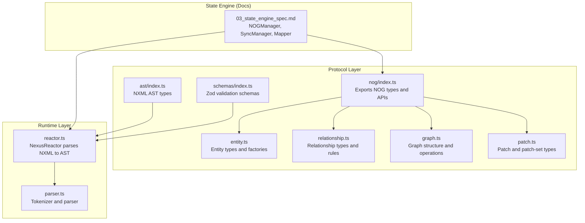
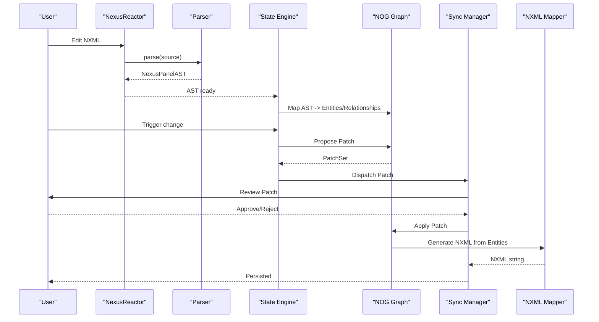
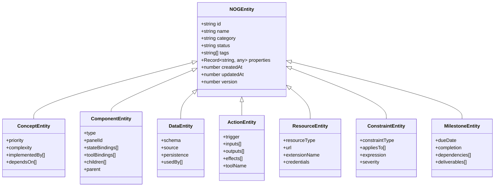
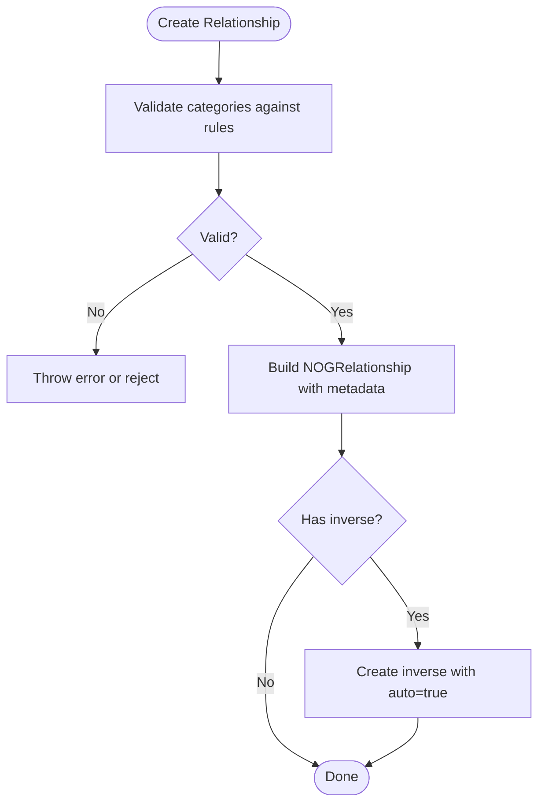
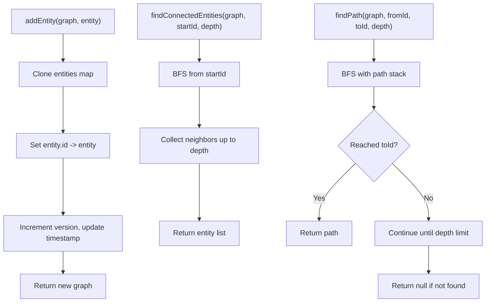
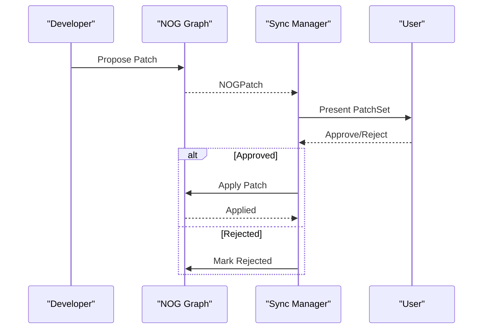
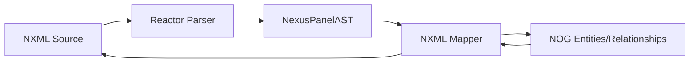
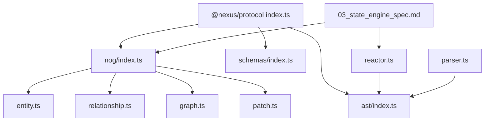

# Nexus Object Graph (NOG)

<cite>
**Referenced Files in This Document**
- [index.ts](file://packages/nexus-protocol/src/nog/index.ts)
- [entity.ts](file://packages/nexus-protocol/src/nog/entity.ts)
- [relationship.ts](file://packages/nexus-protocol/src/nog/relationship.ts)
- [graph.ts](file://packages/nexus-protocol/src/nog/graph.ts)
- [patch.ts](file://packages/nexus-protocol/src/nog/patch.ts)
- [index.ts](file://packages/nexus-protocol/src/index.ts)
- [index.ts](file://packages/nexus-protocol/src/ast/index.ts)
- [index.ts](file://packages/nexus-protocol/src/schemas/index.ts)
- [reactor.ts](file://packages/nexus-reactor/src/reactor.ts)
- [parser.ts](file://packages/nexus-reactor/src/parser/parser.ts)
- [01_protocol_spec.md](file://docs/01_protocol_spec.md)
- [03_state_engine_spec.md](file://docs/03_state_engine_spec.md)
</cite>

## Table of Contents
1. [Introduction](#introduction)
2. [Project Structure](#project-structure)
3. [Core Components](#core-components)
4. [Architecture Overview](#architecture-overview)
5. [Detailed Component Analysis](#detailed-component-analysis)
6. [Dependency Analysis](#dependency-analysis)
7. [Performance Considerations](#performance-considerations)
8. [Troubleshooting Guide](#troubleshooting-guide)
9. [Conclusion](#conclusion)
10. [Appendices](#appendices)

## Introduction
The Nexus Object Graph (NOG) is the semantic truth layer of the Nexus Protocol. It captures the cross-panel knowledge graph of a workspace, enabling:
- Cross-panel synchronization through explicit change proposals (patches)
- AI-assisted development by structuring knowledge and change proposals
- Bidirectional mapping between NXML structures and semantic meaning

NOG defines three pillars:
- Entities: semantic “nouns” representing concepts, components, data, actions, resources, constraints, and milestones
- Relationships: semantic “edges” modeling structural, dependency, data-flow, associative, and temporal links
- Patches: typed change proposals that drive the explicit sync workflow across panels

These mechanisms collectively enable structured collaboration, consistent graph evolution, and scalable knowledge representation.

## Project Structure
The NOG module lives under the protocol package and integrates with AST and schemas for NXML parsing and validation. The Reactor parses NXML into an AST, which the state engine maps into NOG entities and relationships, and then back to NXML for persistence.

**Diagram sources**
- [index.ts](file://packages/nexus-protocol/src/nog/index.ts#L1-L129)
- [entity.ts](file://packages/nexus-protocol/src/nog/entity.ts#L1-L327)
- [relationship.ts](file://packages/nexus-protocol/src/nog/relationship.ts#L1-L321)
- [graph.ts](file://packages/nexus-protocol/src/nog/graph.ts#L1-L446)
- [patch.ts](file://packages/nexus-protocol/src/nog/patch.ts#L1-L473)
- [index.ts](file://packages/nexus-protocol/src/ast/index.ts#L1-L178)
- [index.ts](file://packages/nexus-protocol/src/schemas/index.ts#L1-L143)
- [reactor.ts](file://packages/nexus-reactor/src/reactor.ts#L1-L260)
- [parser.ts](file://packages/nexus-reactor/src/parser/parser.ts#L1-L438)
- [03_state_engine_spec.md](file://docs/03_state_engine_spec.md#L200-L389)

**Section sources**
- [index.ts](file://packages/nexus-protocol/src/nog/index.ts#L1-L129)
- [index.ts](file://packages/nexus-protocol/src/index.ts#L1-L64)

## Core Components
- Entities: Typed semantic objects with category, status, tags, properties, and versioning for conflict resolution. Factories generate IDs, create, clone, and update entities.
- Relationships: Typed edges with metadata (strength, confidence, auto/source/notes), directionality, and inverse mapping via relationship rules.
- Graph: Immutable graph structure with entities and relationships, plus serialization/deserialization, mutation helpers, and traversal/statistics utilities.
- Patches: Typed change proposals (create/update/delete/move/merge/split) for entities, relationships, and view-level changes, with patch sets and lifecycle (pending/approved/rejected/applied/failed/expired).

**Section sources**
- [entity.ts](file://packages/nexus-protocol/src/nog/entity.ts#L1-L327)
- [relationship.ts](file://packages/nexus-protocol/src/nog/relationship.ts#L1-L321)
- [graph.ts](file://packages/nexus-protocol/src/nog/graph.ts#L1-L446)
- [patch.ts](file://packages/nexus-protocol/src/nog/patch.ts#L1-L473)

## Architecture Overview
NOG sits between NXML and the runtime:
- NXML is parsed into an AST by the Reactor
- The state engine maps AST nodes to NOG entities and relationships
- Changes propagate via patches; accepted patches mutate the graph and are persisted back to NXML

**Diagram sources**
- [reactor.ts](file://packages/nexus-reactor/src/reactor.ts#L1-L260)
- [parser.ts](file://packages/nexus-reactor/src/parser/parser.ts#L1-L438)
- [03_state_engine_spec.md](file://docs/03_state_engine_spec.md#L200-L389)
- [graph.ts](file://packages/nexus-protocol/src/nog/graph.ts#L127-L172)
- [patch.ts](file://packages/nexus-protocol/src/nog/patch.ts#L243-L382)

## Detailed Component Analysis

### Entities: Categories, Properties, and Factories
- Categories: concept, component, data, action, resource, constraint, milestone, custom
- Status lifecycle: draft, active, deprecated, archived
- Property typing supports primitives, arrays, and entity references
- Factories:
  - generateEntityId: deterministic unique IDs
  - createEntity: initializes with defaults and timestamps
  - cloneEntity: duplicates with new ID and reset timestamps
  - updateEntity: increments version and updates timestamps

**Diagram sources**
- [entity.ts](file://packages/nexus-protocol/src/nog/entity.ts#L1-L327)

**Section sources**
- [entity.ts](file://packages/nexus-protocol/src/nog/entity.ts#L1-L327)

### Relationships: Types, Rules, and Inverses
- Relationship types include structural (contains/part_of, extends/implements), dependencies (depends_on/required_by, uses/used_by), data flow (produces/consumes/transforms), associations (related_to/similar_to/conflicts_with), and temporal (precedes/follows/triggers)
- Metadata supports strength/confidence, auto flag, source, and notes
- Relationship rules define allowed directions and inverses; validity checks enforce category constraints
- Utilities: outgoing/incoming/entity/all relationship filters and direct lookup

**Diagram sources**
- [relationship.ts](file://packages/nexus-protocol/src/nog/relationship.ts#L1-L321)

**Section sources**
- [relationship.ts](file://packages/nexus-protocol/src/nog/relationship.ts#L1-L321)

### Graph: Structure, Serialization, and Traversal
- Graph stores entities and relationships with versioning and metadata
- Serialization/deserialization to/from JSON for transport/persistence
- Mutation helpers: add/remove entity, update entity, add/remove relationship
- Query helpers: find by category/tag/panel, get entity with relationships, connected entities (BFS), path finding (BFS), and statistics (counts, averages, orphans)

**Diagram sources**
- [graph.ts](file://packages/nexus-protocol/src/nog/graph.ts#L127-L446)

**Section sources**
- [graph.ts](file://packages/nexus-protocol/src/nog/graph.ts#L1-L446)

### Patches: Proposal, Review, and Application
- Patch operations: create, update, delete, move, merge, split
- Patch statuses: pending, approved, rejected, applied, failed, expired
- Patch types:
  - EntityPatch: targets entity ID and partial entity data
  - RelationshipPatch: targets relationship ID and partial relationship data
  - ViewPatch: targets JSON path within NXML with previous/new values and optional diff
- Patch sets: group related patches, derive target panels, compute overall status
- Lifecycle: approve/reject, mark applied/failed, update set status

**Diagram sources**
- [patch.ts](file://packages/nexus-protocol/src/nog/patch.ts#L1-L473)
- [03_state_engine_spec.md](file://docs/03_state_engine_spec.md#L293-L389)

**Section sources**
- [patch.ts](file://packages/nexus-protocol/src/nog/patch.ts#L1-L473)
- [01_protocol_spec.md](file://docs/01_protocol_spec.md#L1214-L1291)

### Bidirectional Mapping: NXML ↔ Semantic Meaning
- Parsing: Reactor parses NXML into AST; schemas validate structure
- Mapping: State engine maps AST nodes to NOG entities and relationships
- Reconstruction: Mapper generates NXML from entities; round-trip ensures lossless semantics

**Diagram sources**
- [reactor.ts](file://packages/nexus-reactor/src/reactor.ts#L1-L260)
- [parser.ts](file://packages/nexus-reactor/src/parser/parser.ts#L1-L438)
- [03_state_engine_spec.md](file://docs/03_state_engine_spec.md#L254-L293)

**Section sources**
- [reactor.ts](file://packages/nexus-reactor/src/reactor.ts#L1-L260)
- [parser.ts](file://packages/nexus-reactor/src/parser/parser.ts#L1-L438)
- [03_state_engine_spec.md](file://docs/03_state_engine_spec.md#L254-L293)

## Dependency Analysis
- NOG exports are re-exposed by the protocol index for easy consumption
- NOG depends on AST and schemas for NXML semantics and validation
- Reactor provides the AST consumed by the state engine’s mapper
- Patch and graph operations are pure functions operating on immutable structures

**Diagram sources**
- [index.ts](file://packages/nexus-protocol/src/index.ts#L1-L64)
- [index.ts](file://packages/nexus-protocol/src/nog/index.ts#L1-L129)
- [entity.ts](file://packages/nexus-protocol/src/nog/entity.ts#L1-L327)
- [relationship.ts](file://packages/nexus-protocol/src/nog/relationship.ts#L1-L321)
- [graph.ts](file://packages/nexus-protocol/src/nog/graph.ts#L1-L446)
- [patch.ts](file://packages/nexus-protocol/src/nog/patch.ts#L1-L473)
- [index.ts](file://packages/nexus-protocol/src/ast/index.ts#L1-L178)
- [index.ts](file://packages/nexus-protocol/src/schemas/index.ts#L1-L143)
- [reactor.ts](file://packages/nexus-reactor/src/reactor.ts#L1-L260)
- [parser.ts](file://packages/nexus-reactor/src/parser/parser.ts#L1-L438)
- [03_state_engine_spec.md](file://docs/03_state_engine_spec.md#L200-L389)

**Section sources**
- [index.ts](file://packages/nexus-protocol/src/index.ts#L1-L64)
- [index.ts](file://packages/nexus-protocol/src/nog/index.ts#L1-L129)

## Performance Considerations
- Graph operations:
  - BFS-based connected-entity and path-finding traversals scale with entity count and degree; consider limiting depth and caching frequent queries
  - Relationship filtering is linear in the number of relationships; consider indexing by type or category if needed
- Serialization:
  - Converting maps to arrays and back is O(n) for entities and relationships; keep graph snapshots minimal when broadcasting
- Patch sets:
  - Grouping related patches reduces network chatter; compute set status incrementally
- Mapping:
  - AST-to-NOG mapping is proportional to AST size; batch updates and avoid redundant recomputation
- Validation:
  - Use schemas to short-circuit invalid inputs early; leverage strict schemas for production

[No sources needed since this section provides general guidance]

## Troubleshooting Guide
- Graph consistency:
  - Ensure entities exist before creating relationships; the graph enforces existence and throws on missing entities
  - Use updateEntity to bump version and timestamps; this helps resolve conflicts during sync
- Patch conflicts:
  - Use patch sets to group related changes; update set status to reflect mixed approvals/rejections
  - For concurrent edits, rely on patch confidence and reasoning to guide user decisions
- Orphaned entities:
  - Use graph statistics to detect disconnected components; prune or connect as needed
- NXML reconstruction:
  - If mapping fails, validate AST with schemas and ensure all required fields are present
  - For complex view diffs, include nxmlDiff in view patches to aid review

**Section sources**
- [graph.ts](file://packages/nexus-protocol/src/nog/graph.ts#L223-L241)
- [patch.ts](file://packages/nexus-protocol/src/nog/patch.ts#L432-L457)
- [03_state_engine_spec.md](file://docs/03_state_engine_spec.md#L200-L389)

## Conclusion
NOG provides a robust, structured foundation for cross-panel synchronization and AI-assisted development. By modeling entities and relationships explicitly, enforcing semantic rules, and managing change proposals through patches, it enables consistent evolution of the workspace knowledge graph. Combined with NXML parsing and validation, it supports bidirectional mapping between declarative UI definitions and semantic meaning, fostering collaboration and scalability.

[No sources needed since this section summarizes without analyzing specific files]

## Appendices

### A. Explicit Sync Workflow (from spec)
- Steps: user modifies a panel → NOG updates → system detects dependencies → patch generated (pending) → user reviews → decision (approve/reject) → apply to target panel

**Section sources**
- [01_protocol_spec.md](file://docs/01_protocol_spec.md#L1214-L1291)

### B. Example Paths to Key Implementations
- Entity creation and updates: [entity.ts](file://packages/nexus-protocol/src/nog/entity.ts#L265-L327)
- Relationship creation and validation: [relationship.ts](file://packages/nexus-protocol/src/nog/relationship.ts#L186-L266)
- Graph mutations and traversal: [graph.ts](file://packages/nexus-protocol/src/nog/graph.ts#L159-L391)
- Patch creation and lifecycle: [patch.ts](file://packages/nexus-protocol/src/nog/patch.ts#L243-L473)
- NXML parsing and AST: [reactor.ts](file://packages/nexus-reactor/src/reactor.ts#L1-L260), [parser.ts](file://packages/nexus-reactor/src/parser/parser.ts#L1-L438)
- State engine mapping and sync: [03_state_engine_spec.md](file://docs/03_state_engine_spec.md#L200-L389)