# Nexus Protocol

<cite>
**Referenced Files in This Document**   
- [index.ts](file://packages/nexus-protocol/src/index.ts)
- [ast/index.ts](file://packages/nexus-protocol/src/ast/index.ts)
- [ast/common.ts](file://packages/nexus-protocol/src/ast/common.ts)
- [ast/data.ts](file://packages/nexus-protocol/src/ast/data.ts)
- [ast/logic.ts](file://packages/nexus-protocol/src/ast/logic.ts)
- [ast/view.ts](file://packages/nexus-protocol/src/ast/view.ts)
- [ast/panel.ts](file://packages/nexus-protocol/src/ast/panel.ts)
- [schemas/index.ts](file://packages/nexus-protocol/src/schemas/index.ts)
- [schemas/data.ts](file://packages/nexus-protocol/src/schemas/data.ts)
- [schemas/logic.ts](file://packages/nexus-protocol/src/schemas/logic.ts)
- [schemas/view.ts](file://packages/nexus-protocol/src/schemas/view.ts)
- [schemas/panel.ts](file://packages/nexus-protocol/src/schemas/panel.ts)
- [nog/index.ts](file://packages/nexus-protocol/src/nog/index.ts)
- [nog/entity.ts](file://packages/nexus-protocol/src/nog/entity.ts)
- [nog/relationship.ts](file://packages/nexus-protocol/src/nog/relationship.ts)
- [nog/graph.ts](file://packages/nexus-protocol/src/nog/graph.ts)
- [nog/patch.ts](file://packages/nexus-protocol/src/nog/patch.ts)
</cite>

## Table of Contents
1. [Introduction](#introduction)
2. [NXML Abstract Syntax Tree (AST)](#nxml-abstract-syntax-tree-ast)
3. [Zod-Based Validation Schemas](#zod-based-validation-schemas)
4. [Nexus Object Graph (NOG)](#nexus-object-graph-nog)
5. [Practical Examples](#practical-examples)
6. [Consistency Across Layers](#consistency-across-layers)
7. [Common Validation Errors](#common-validation-errors)
8. [Schema Extension Patterns](#schema-extension-patterns)

## Introduction

The Nexus Protocol serves as the foundational type system for the Nexus AI-assisted prototyping platform. It defines a structured, extensible framework for building interactive panels through NXML (Nexus Extensible Markup Language). The protocol ensures consistency across parsing, execution, and AI collaboration layers by providing a well-defined AST structure, robust validation mechanisms, and a semantic truth layer for cross-panel synchronization.

The protocol is organized into three primary namespaces—Data, Logic, and View—each with corresponding validation schemas and utility functions. At its core, the Nexus Object Graph (NOG) maintains semantic relationships across all panels in a workspace, enabling intelligent AI collaboration and change propagation through a patch-based synchronization system.

**Section sources**
- [index.ts](file://packages/nexus-protocol/src/index.ts#L6-L13)

## NXML Abstract Syntax Tree (AST)

The NXML AST is the structural foundation of the Nexus Protocol, defining the syntax and semantics of panel definitions. It is organized into four hierarchical components: data, logic, view, and panel (root).

### Data Namespace

The Data namespace defines the reactive state model of a panel. It includes two primary node types:

- **StateNode**: Represents mutable state variables with a name, type, and optional default value.
- **ComputedNode**: Represents derived state values computed from other state variables via JavaScript expressions.

The DataAST aggregates these nodes into a coherent state definition, supporting utilities for state name extraction, node lookup, and type-based default value generation.

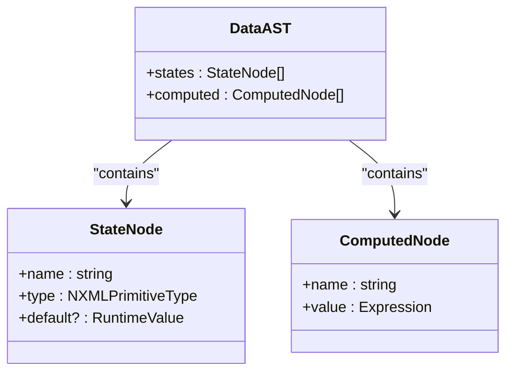

**Diagram sources**
- [ast/data.ts](file://packages/nexus-protocol/src/ast/data.ts#L30-L133)

### Logic Namespace

The Logic namespace defines behavioral elements of a panel, including tools, lifecycle hooks, and external capabilities. Key components include:

- **ToolNode**: Atomic operations that can be triggered by UI elements or AI, with arguments and handler code.
- **LifecycleNode**: Hooks for mount and unmount events, enabling initialization and cleanup logic.
- **ExtensionNode**: Declarations of external capabilities (e.g., filesystem, AI models) accessible via the `$ext` object.

The LogicAST organizes these elements, providing utilities for tool discovery, extension alias resolution, and async operation detection.

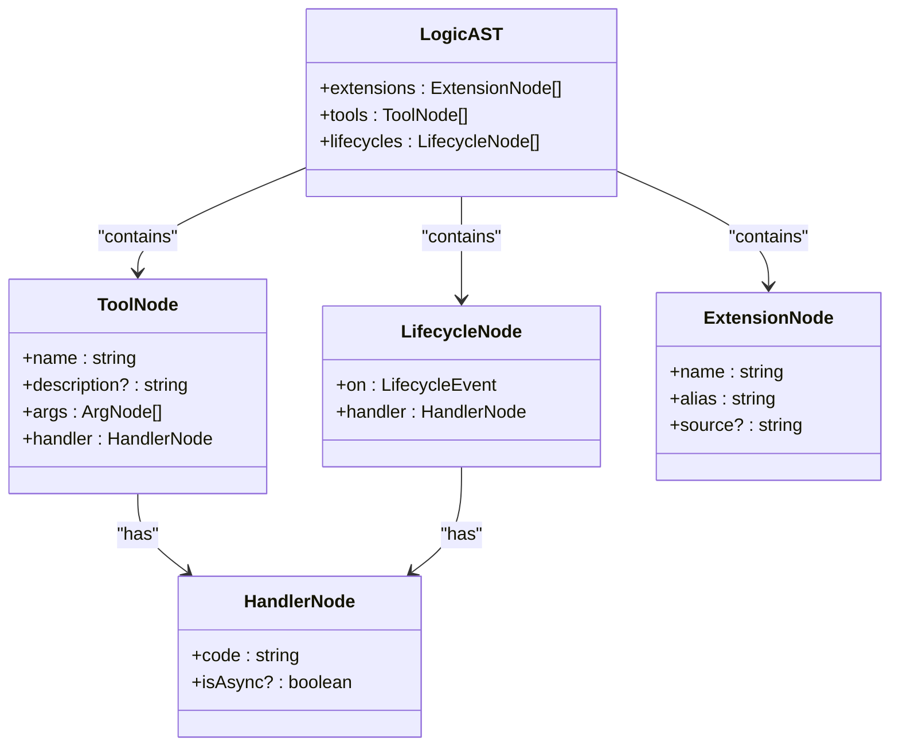

**Diagram sources**
- [ast/logic.ts](file://packages/nexus-protocol/src/ast/logic.ts#L121-L275)

### View Namespace

The View namespace defines the UI structure using semantic components. It supports layout components, control flow, and a standard component library (SCL). Key features include:

- **LayoutNode**: Arranges children using auto, stack, or row strategies.
- **Control Flow**: If and Iterate nodes for conditional rendering and list iteration.
- **SCL Components**: Pre-built components like Text, Button, Chart, and Input with reactive bindings.

The ViewAST represents the UI hierarchy, with utilities for binding extraction, trigger detection, and tree traversal.

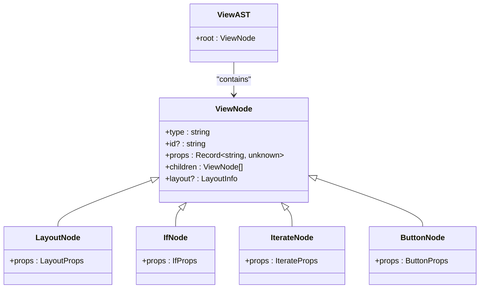

**Diagram sources**
- [ast/view.ts](file://packages/nexus-protocol/src/ast/view.ts#L643-L650)

### Panel (Root) Structure

The NexusPanelAST is the root node that combines Data, Logic, and View namespaces. It includes metadata for identification and display, and provides comprehensive validation to ensure internal consistency.

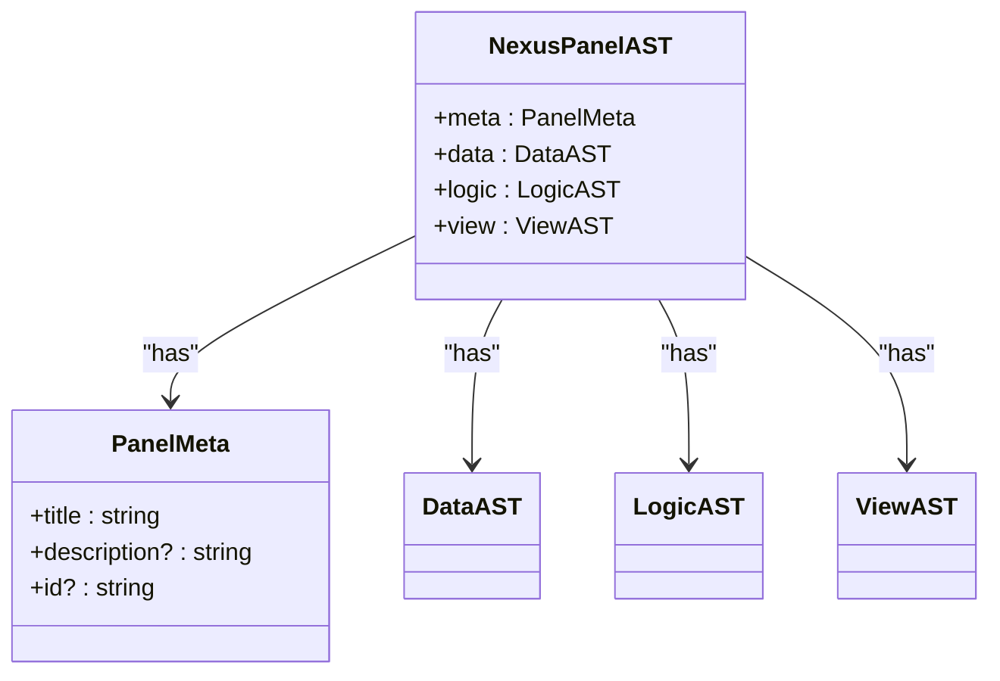

**Diagram sources**
- [ast/panel.ts](file://packages/nexus-protocol/src/ast/panel.ts#L76-L97)

## Zod-Based Validation Schemas

The Nexus Protocol uses Zod for runtime type checking, providing strict validation of AST structures. Each namespace has corresponding schemas that enforce structural integrity and semantic rules.

### Schema Organization

Validation schemas are organized in the `schemas` module, with dedicated files for each namespace. They export both schema definitions and type-safe input/output types.

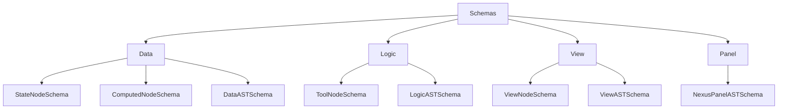

**Diagram sources**
- [schemas/index.ts](file://packages/nexus-protocol/src/schemas/index.ts#L12-L142)

### Cross-Namespace Validation

The `NexusPanelASTSchemaStrict` performs comprehensive validation, checking cross-namespace references such as:

- View bindings referencing valid state variables
- View triggers referencing valid tools
- Handler code using only declared extensions

This ensures that all interdependencies are valid before execution.

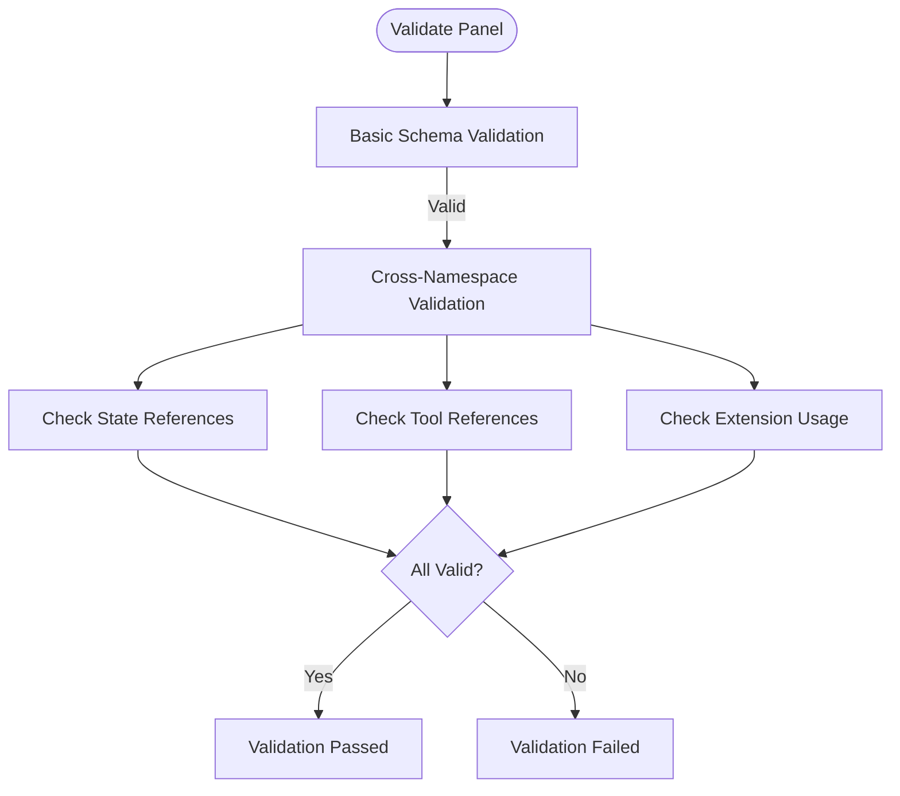

**Diagram sources**
- [schemas/panel.ts](file://packages/nexus-protocol/src/schemas/panel.ts#L57-L95)

## Nexus Object Graph (NOG)

The Nexus Object Graph (NOG) serves as the semantic truth layer for the workspace, maintaining relationships across all panels and enabling AI-driven collaboration.

### Entity System

Entities represent semantic concepts in the project, classified into categories such as concept, component, data, action, and resource. Each entity has metadata, properties, and lifecycle tracking.

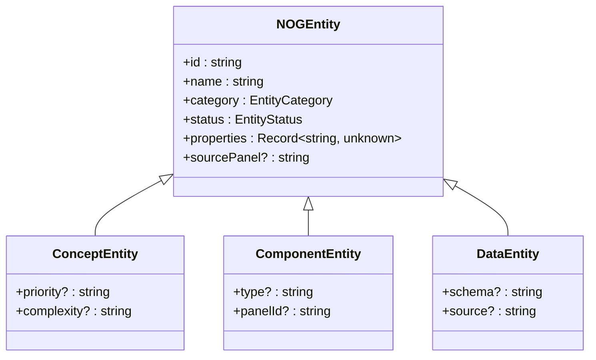

**Diagram sources**
- [nog/entity.ts](file://packages/nexus-protocol/src/nog/entity.ts#L38-L227)

### Relationship System

Relationships define semantic connections between entities, such as "implements", "depends_on", and "contains". The system enforces relationship rules to maintain consistency.

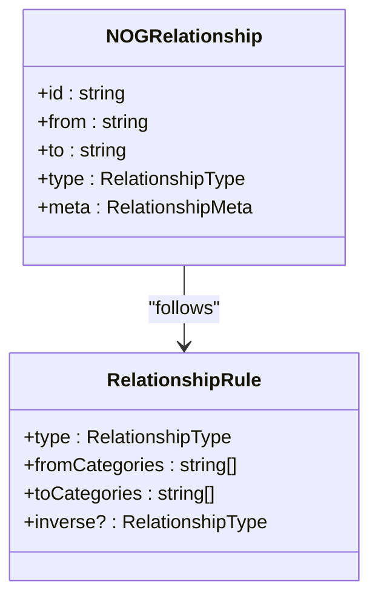

**Diagram sources**
- [nog/relationship.ts](file://packages/nexus-protocol/src/nog/relationship.ts#L80-L115)

### Graph Operations

The NOG provides a comprehensive API for graph manipulation, including entity/relationship management, path finding, and connected entity discovery.

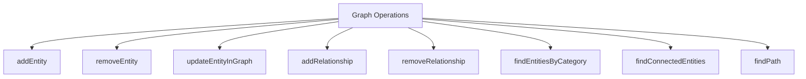

**Diagram sources**
- [nog/graph.ts](file://packages/nexus-protocol/src/nog/graph.ts#L30-L55)

### Patch Mechanism

Patches represent proposed changes to the NOG, following an explicit sync workflow:

1. User modifies a panel
2. NexusOS calculates patches for affected panels
3. Patches enter "Pending Review" state
4. User reviews and approves/rejects patches
5. Accepted patches are applied

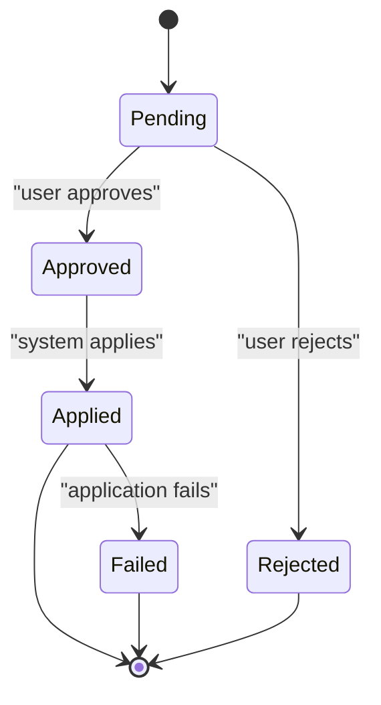

**Diagram sources**
- [nog/patch.ts](file://packages/nexus-protocol/src/nog/patch.ts#L46-L241)

## Practical Examples

### Creating a Valid NXML Structure

```typescript
import { 
  createNexusPanelAST,
  createStateNode,
  createComputedNode,
  createToolNode,
  createHandlerNode,
  createViewAST,
  createLayoutNode,
  createButtonNode,
  validateNexusPanelAST
} from '@nexus/protocol';

// Create panel with metadata
const panel = createNexusPanelAST({
  title: 'Counter Panel',
  description: 'A simple counter example'
});

// Define state
panel.data.states.push(
  createStateNode('count', 'number', 0),
  createStateNode('incrementBy', 'number', 1)
);

// Define computed
panel.data.computed.push(
  createComputedNode('doubleCount', '$state.count * 2')
);

// Define logic
panel.logic.tools.push(
  createToolNode(
    'increment',
    createHandlerNode('$state.count += $state.incrementBy'),
    { description: 'Increment the counter' }
  )
);

// Define view
panel.view = createViewAST();
panel.view.root = createLayoutNode(
  { gap: 'md' },
  [
    createButtonNode({
      label: 'Increment',
      trigger: 'increment'
    })
  ]
);

// Validate the structure
const result = validateNexusPanelAST(panel);
if (!result.valid) {
  console.error('Validation failed:', result.errors);
}
```

**Section sources**
- [ast/panel.ts](file://packages/nexus-protocol/src/ast/panel.ts#L107-L120)
- [ast/data.ts](file://packages/nexus-protocol/src/ast/data.ts#L142-L153)
- [ast/logic.ts](file://packages/nexus-protocol/src/ast/logic.ts#L313-L325)
- [ast/view.ts](file://packages/nexus-protocol/src/ast/view.ts#L698-L720)
- [schemas/panel.ts](file://packages/nexus-protocol/src/schemas/panel.ts#L129-L250)

## Consistency Across Layers

The Nexus Protocol ensures consistency across parsing, execution, and AI collaboration through several mechanisms:

### Parsing Layer

The AST structure provides a well-defined syntax that can be reliably parsed from NXML source. Factory functions ensure valid node creation, while type guards enable safe type checking.

### Execution Layer

Runtime validation using Zod schemas ensures that only valid structures are executed. The `$state` proxy provides reactive updates, while the sandboxed execution environment restricts access to unsafe globals.

### AI Collaboration Layer

The NOG serves as a shared semantic model that AI systems can understand and modify. The patch mechanism ensures that AI-proposed changes are reviewed before application, maintaining user control.

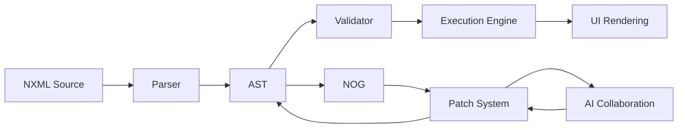

**Diagram sources**
- [index.ts](file://packages/nexus-protocol/src/index.ts#L27-L49)
- [nog/index.ts](file://packages/nexus-protocol/src/nog/index.ts#L9-L110)

## Common Validation Errors

The validation system identifies several common errors:

### Schema Errors
- Invalid node kinds
- Missing required fields
- Type mismatches

### Cross-Reference Errors
- View bindings referencing undefined state
- View triggers referencing undefined tools
- Handler code using undeclared extensions

### Semantic Errors
- Duplicate state or tool names
- Multiple mount/unmount lifecycles
- Invalid relationship types

The validation result includes detailed error objects with codes, messages, and paths for precise error reporting.

**Section sources**
- [schemas/panel.ts](file://packages/nexus-protocol/src/schemas/panel.ts#L101-L120)

## Schema Extension Patterns

The Nexus Protocol supports schema extension through several patterns:

### Custom Entity Categories
Users can define custom entity categories by extending the `EntityCategory` union type and creating corresponding entity interfaces.

### Custom Relationship Types
New relationship types can be added to the `RelationshipType` enum and registered in `RELATIONSHIP_RULES` with appropriate validation rules.

### Custom Components
The View system supports generic components through `GenericViewNode`, allowing integration of custom UI elements.

### Custom Validation
Additional validation rules can be added to existing schemas using Zod's `.refine()` method or by creating custom schema extensions.

**Section sources**
- [nog/entity.ts](file://packages/nexus-protocol/src/nog/entity.ts#L16-L24)
- [nog/relationship.ts](file://packages/nexus-protocol/src/nog/relationship.ts#L16-L45)
- [ast/view.ts](file://packages/nexus-protocol/src/ast/view.ts#L631-L634)