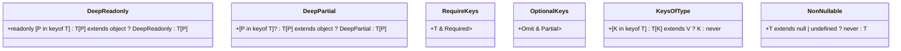
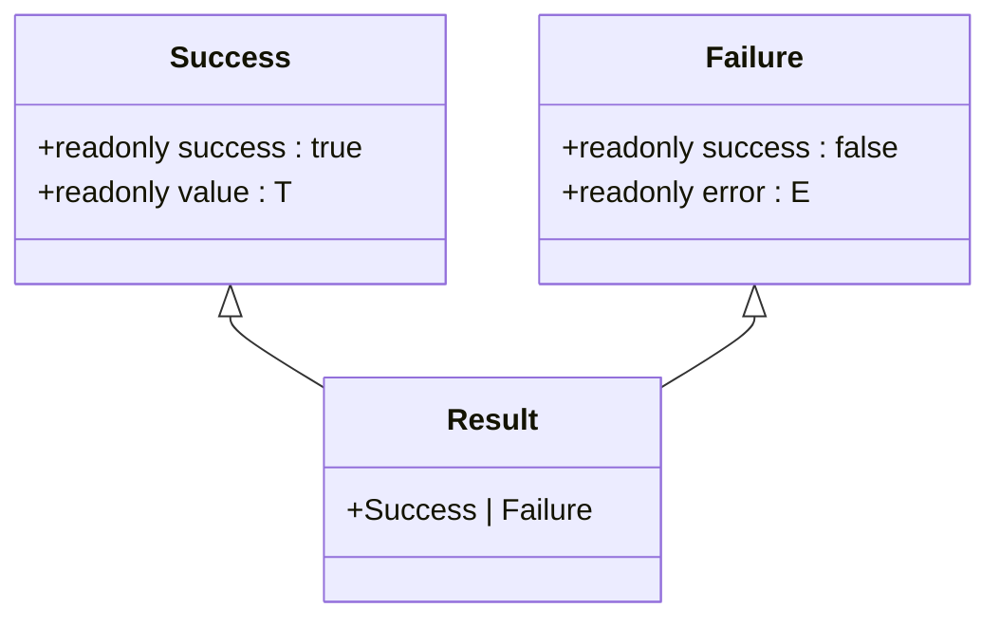
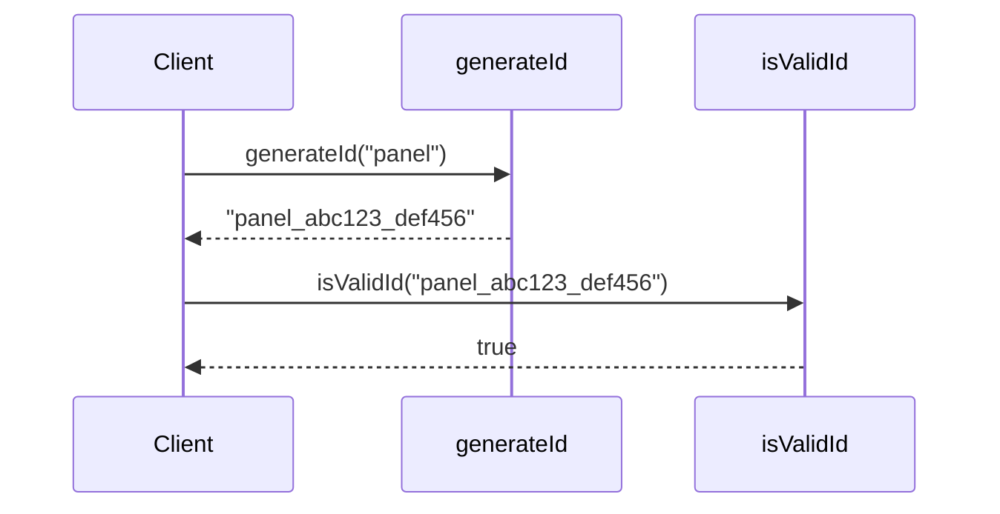
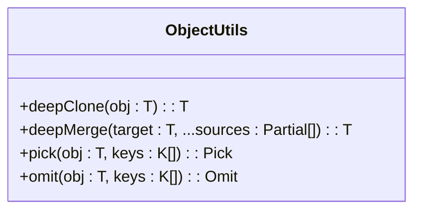
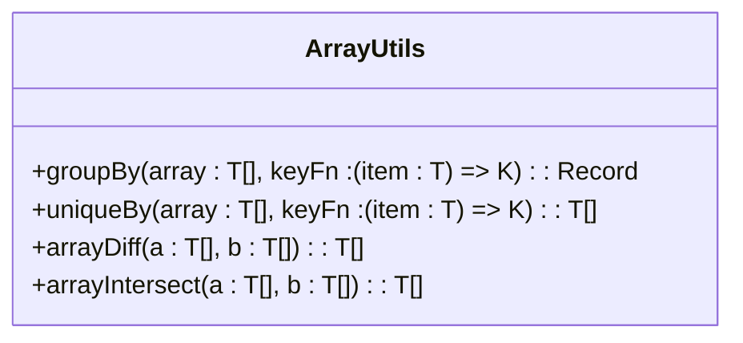
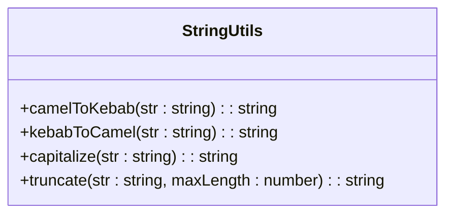
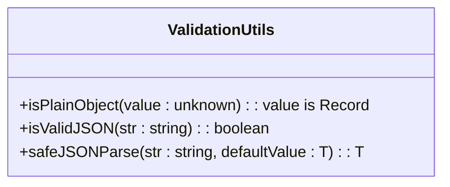
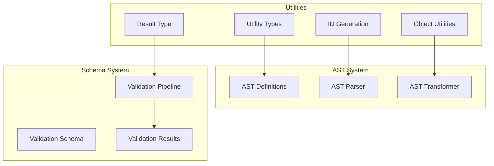
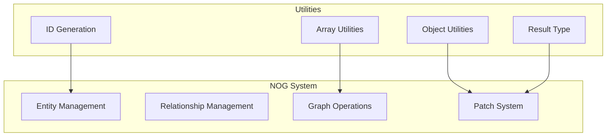

# Utilities

<cite>
**Referenced Files in This Document**   
- [index.ts](file://packages/nexus-protocol/src/utils/index.ts)
- [types.ts](file://packages/nexus-protocol/src/utils/types.ts)
- [ast/common.ts](file://packages/nexus-protocol/src/ast/common.ts)
- [ast/data.ts](file://packages/nexus-protocol/src/ast/data.ts)
- [ast/logic.ts](file://packages/nexus-protocol/src/ast/logic.ts)
- [ast/view.ts](file://packages/nexus-protocol/src/ast/view.ts)
- [nog/entity.ts](file://packages/nexus-protocol/src/nog/entity.ts)
- [nog/graph.ts](file://packages/nexus-protocol/src/nog/graph.ts)
- [nog/patch.ts](file://packages/nexus-protocol/src/nog/patch.ts)
- [schemas/data.ts](file://packages/nexus-protocol/src/schemas/data.ts)
- [schemas/logic.ts](file://packages/nexus-protocol/src/schemas/logic.ts)
- [schemas/view.ts](file://packages/nexus-protocol/src/schemas/view.ts)
</cite>

## Table of Contents
1. [Introduction](#introduction)
2. [Core Type System](#core-type-system)
3. [Result Type and Error Handling](#result-type-and-error-handling)
4. [ID Generation and Validation](#id-generation-and-validation)
5. [Object and Data Manipulation Utilities](#object-and-data-manipulation-utilities)
6. [Array and Collection Utilities](#array-and-collection-utilities)
7. [String and Formatting Utilities](#string-and-formatting-utilities)
8. [Validation and Type Checking](#validation-and-type-checking)
9. [Async and Flow Control Utilities](#async-and-flow-control-utilities)
10. [Integration with AST and Schema Systems](#integration-with-ast-and-schema-systems)
11. [Integration with NOG System](#integration-with-nog-system)
12. [Usage Patterns and Best Practices](#usage-patterns-and-best-practices)
13. [Performance Considerations](#performance-considerations)
14. [Common Pitfalls and Troubleshooting](#common-pitfalls-and-troubleshooting)
15. [Conclusion](#conclusion)

## Introduction

The Utilities module in the Nexus Protocol provides a comprehensive set of shared functions and type definitions that support core operations across the system. These utilities are designed to ensure type safety, promote code reuse, and simplify complex operations related to Abstract Syntax Tree (AST) manipulation, schema validation, and Nexus Object Graph (NOG) operations. The module is structured around two primary files: `index.ts`, which exports all utilities, and `types.ts`, which contains both type definitions and utility functions.

These utilities are foundational to the protocol, enabling consistent patterns across modules such as the reactor parser and validation pipeline. They are used extensively in protocol-level operations, from generating unique identifiers to safely handling asynchronous operations with retry logic. The design emphasizes developer accessibility while maintaining the technical rigor required for a robust system.

**Section sources**
- [index.ts](file://packages/nexus-protocol/src/utils/index.ts#L1-L38)
- [types.ts](file://packages/nexus-protocol/src/utils/types.ts#L1-L389)

## Core Type System

The Utilities module defines a powerful set of TypeScript utility types that enhance type safety and enable advanced type manipulation. These types are used throughout the Nexus Protocol to ensure correctness and prevent runtime errors.

The `DeepReadonly<T>` and `DeepPartial<T>` types allow for recursive application of readonly and partial modifiers, which is essential when working with nested AST structures. The `RequireKeys<T, K>` and `OptionalKeys<T, K>` types provide fine-grained control over object properties, enabling precise type definitions for configuration objects and API inputs.

The `KeysOfType<T, V>` utility extracts keys from an object type where the value extends a specific type, which is particularly useful in the validation pipeline when identifying properties that require special handling. These type utilities are leveraged in the schema validation system to provide accurate type checking for AST nodes.



**Diagram sources**
- [types.ts](file://packages/nexus-protocol/src/utils/types.ts#L10-L45)

**Section sources**
- [types.ts](file://packages/nexus-protocol/src/utils/types.ts#L10-L45)

## Result Type and Error Handling

The Utilities module implements a robust result type system for error handling that promotes functional programming patterns and eliminates the need for try-catch blocks in many scenarios. The `Result<T, E>` type is a discriminated union of `Success<T>` and `Failure<E>`, providing a type-safe way to handle operations that may fail.

This system is used extensively in the validation pipeline, where schema validation returns a `Result<ValidatedAST, ValidationError[]>` rather than throwing exceptions. The `success()` and `failure()` factory functions create instances of these types, while `isSuccess()` and `isFailure()` type guards allow for safe type narrowing.

The `mapResult()` function enables functional composition of operations that return results, allowing for clean, readable code when chaining multiple validation steps. This pattern is used in the reactor parser to transform and validate AST nodes in a pipeline fashion.



**Diagram sources**
- [types.ts](file://packages/nexus-protocol/src/utils/types.ts#L50-L97)

**Section sources**
- [types.ts](file://packages/nexus-protocol/src/utils/types.ts#L50-L111)

## ID Generation and Validation

The Utilities module provides reliable ID generation functions that ensure uniqueness and consistency across the system. The `generateId(prefix)` function creates unique identifiers with a timestamp and random component, while `generateShortId()` produces shorter UUID-like strings for cases where brevity is preferred.

These functions are critical for the AST system, where each node requires a unique identifier for reference and manipulation. The `isValidId(id)` function validates ID format using a regular expression, ensuring consistency in ID structure across the protocol.

In the NOG (Nexus Object Graph) system, these ID utilities are used to generate entity and relationship identifiers, maintaining referential integrity across the graph. The predictable format (prefix_timestamp_random) enables easy debugging and tracing of object lifecycles.



**Diagram sources**
- [types.ts](file://packages/nexus-protocol/src/utils/types.ts#L116-L137)

**Section sources**
- [types.ts](file://packages/nexus-protocol/src/utils/types.ts#L116-L137)

## Object and Data Manipulation Utilities

The Utilities module includes a comprehensive set of functions for object manipulation that are essential for AST operations. The `deepClone(obj)` function performs a deep copy of objects using JSON serialization, which is used when creating copies of AST nodes during transformation operations.

The `deepMerge(target, ...sources)` function recursively merges objects, preserving nested structure. This is particularly important in the schema validation system when combining default values with user-provided configuration. The merge logic handles nested objects but preserves arrays as-is, preventing unintended concatenation.

The `pick(obj, keys)` and `omit(obj, keys)` functions provide Lodash-like functionality for object property selection and exclusion. These are used in the view system when extracting specific props from component configurations and in the NOG system when creating partial entity representations.



**Diagram sources**
- [types.ts](file://packages/nexus-protocol/src/utils/types.ts#L143-L211)

**Section sources**
- [types.ts](file://packages/nexus-protocol/src/utils/types.ts#L143-L211)

## Array and Collection Utilities

The Utilities module provides powerful array manipulation functions that support complex data operations in the protocol. The `groupBy(array, keyFn)` function organizes array elements into a record based on a key-generating function, which is used in the NOG system to group entities by category.

The `uniqueBy(array, keyFn)` function filters arrays to remove duplicates based on a key function, maintaining referential integrity in the graph system. This is critical when processing relationship patches to prevent duplicate edges.

The `arrayDiff(a, b)` and `arrayIntersect(a, b)` functions implement set operations that are used in the validation pipeline to compare expected and actual AST structures. These functions leverage Set for O(n) performance, making them suitable for large datasets.



**Diagram sources**
- [types.ts](file://packages/nexus-protocol/src/utils/types.ts#L217-L267)

**Section sources**
- [types.ts](file://packages/nexus-protocol/src/utils/types.ts#L217-L267)

## String and Formatting Utilities

The Utilities module includes essential string manipulation functions that support various formatting needs across the system. The `camelToKebab(str)` and `kebabToCamel(str)` functions enable conversion between naming conventions, which is crucial for the AST system when mapping between XML attributes (kebab-case) and JavaScript properties (camelCase).

The `truncate(str, maxLength)` function safely shortens strings with an ellipsis, used in the view system for displaying metadata in limited space. The `capitalize(str)` function ensures consistent capitalization in user-facing strings.

These utilities are integrated into the parser system, where they handle the transformation of component names and property keys between different representations. The bidirectional conversion between camelCase and kebab-case ensures seamless interoperability between the declarative XML syntax and the underlying JavaScript implementation.



**Diagram sources**
- [types.ts](file://packages/nexus-protocol/src/utils/types.ts#L272-L299)

**Section sources**
- [types.ts](file://packages/nexus-protocol/src/utils/types.ts#L272-L299)

## Validation and Type Checking

The Utilities module provides runtime type checking functions that complement the static type system. The `isPlainObject(value)` function determines if a value is a plain JavaScript object, which is essential in the schema validation system when distinguishing between different types of node properties.

The `isValidJSON(str)` and `safeJSONParse(str, defaultValue)` functions handle JSON parsing with error recovery, used extensively in the data system when processing default values and configuration strings. The safe parse function returns a default value on failure, preventing cascading errors in the AST construction process.

These validation utilities are integrated into the schema system, where they perform runtime checks that complement the compile-time type checking provided by TypeScript. This dual-layer approach ensures robustness in the face of potentially malformed input.



**Diagram sources**
- [types.ts](file://packages/nexus-protocol/src/utils/types.ts#L305-L337)

**Section sources**
- [types.ts](file://packages/nexus-protocol/src/utils/types.ts#L305-L337)

## Async and Flow Control Utilities

The Utilities module includes sophisticated asynchronous utilities that handle common patterns in the protocol's event-driven architecture. The `retry(fn, options)` function implements exponential backoff retry logic for unreliable operations, such as network requests in extension handlers.

The `withTimeout(promise, ms, errorMessage)` function wraps promises with timeout functionality, preventing hanging operations in the sandboxed execution environment. This is critical for maintaining system responsiveness when executing user-defined handler code.

The `delay(ms)` function provides a simple way to introduce timing between operations, used in animation sequences and rate-limiting scenarios. These async utilities are designed to work seamlessly with the protocol's reactive state system, ensuring that asynchronous operations properly trigger UI updates.

```mermaid
classDiagram
class AsyncUtils {
+delay(ms : number) : Promise<void>
+retry<T>(fn : () => Promise<T>, options : { maxAttempts? : number; delay? : number }) : Promise<T>
+withTimeout<T>(promise : Promise<T>, ms : number, errorMessage : string) : Promise<T>
}
```

**Diagram sources**
- [types.ts](file://packages/nexus-protocol/src/utils/types.ts#L343-L388)

**Section sources**
- [types.ts](file://packages/nexus-protocol/src/utils/types.ts#L343-L388)

## Integration with AST and Schema Systems

The Utilities module is deeply integrated with the AST and schema validation systems, providing the foundational tools that enable type-safe manipulation of protocol structures. The utility types like `DeepReadonly` and `DeepPartial` are used in the AST definitions to ensure immutability where appropriate and optional properties in configuration objects.

The result type system is leveraged in the schema validation pipeline, where each validation step returns a `Result` that can be composed with subsequent operations. This enables a functional approach to validation that is both type-safe and easy to reason about.

The object manipulation utilities like `deepMerge` and `pick` are used in the AST transformation process, where nodes are modified and enhanced during parsing and compilation. The ID generation functions ensure that each AST node has a unique identifier, which is critical for tracking changes and maintaining references.



**Diagram sources**
- [types.ts](file://packages/nexus-protocol/src/utils/types.ts)
- [ast/common.ts](file://packages/nexus-protocol/src/ast/common.ts)
- [schemas/data.ts](file://packages/nexus-protocol/src/schemas/data.ts)

**Section sources**
- [types.ts](file://packages/nexus-protocol/src/utils/types.ts)
- [ast/common.ts](file://packages/nexus-protocol/src/ast/common.ts)
- [schemas/data.ts](file://packages/nexus-protocol/src/schemas/data.ts)
- [schemas/logic.ts](file://packages/nexus-protocol/src/schemas/logic.ts)
- [schemas/view.ts](file://packages/nexus-protocol/src/schemas/view.ts)

## Integration with NOG System

The Utilities module plays a crucial role in the NOG (Nexus Object Graph) system, providing the tools necessary for managing complex graph structures and relationships. The ID generation utilities are used to create unique identifiers for entities and relationships, ensuring global uniqueness across the graph.

The array utilities like `groupBy` and `uniqueBy` are essential for organizing and deduplicating graph data, particularly when processing patches and updates. The object manipulation functions support the merging of entity properties during graph operations.

The result type system is used extensively in NOG operations, where graph modifications return results that indicate success or failure with detailed error information. This enables robust error handling in the face of complex graph constraints and validation rules.



**Diagram sources**
- [types.ts](file://packages/nexus-protocol/src/utils/types.ts)
- [nog/entity.ts](file://packages/nexus-protocol/src/nog/entity.ts)
- [nog/graph.ts](file://packages/nexus-protocol/src/nog/graph.ts)
- [nog/patch.ts](file://packages/nexus-protocol/src/nog/patch.ts)

**Section sources**
- [types.ts](file://packages/nexus-protocol/src/utils/types.ts)
- [nog/entity.ts](file://packages/nexus-protocol/src/nog/entity.ts)
- [nog/graph.ts](file://packages/nexus-protocol/src/nog/graph.ts)
- [nog/patch.ts](file://packages/nexus-protocol/src/nog/patch.ts)

## Usage Patterns and Best Practices

The Utilities module encourages several best practices that promote robust and maintainable code across the Nexus Protocol. The result type pattern should be used for all operations that may fail, eliminating the need for try-catch blocks and enabling functional composition.

When working with AST nodes, the `deepClone` function should be used to create copies before modification, preserving immutability. The `deepMerge` function is preferred over object spread for merging nested configurations, as it handles deep properties correctly.

For async operations, the `retry` and `withTimeout` utilities should be used to handle transient failures and prevent hanging operations. These patterns are particularly important in extension handlers that interact with external systems.

The type utilities should be leveraged to create precise type definitions that accurately reflect the structure of data, reducing the need for type assertions and improving code safety.

## Performance Considerations

The Utilities module is designed with performance in mind, but certain functions have implications that developers should understand. The `deepClone` function uses JSON serialization, which is fast for most use cases but cannot handle circular references or non-serializable values like functions.

The `deepMerge` function has O(n) complexity relative to the size of the input objects, making it suitable for configuration objects but potentially expensive for very large data structures. For simple cases, object spread may be more efficient.

The `groupBy` and `arrayDiff` functions use loops and Set operations that are optimized for performance, but should be used judiciously with large arrays. The `uniqueBy` function maintains a Set of seen keys, using O(n) memory.

The async utilities add overhead due to promise creation and timing mechanisms, but this is generally negligible compared to the operations they wrap. The retry function with exponential backoff can significantly increase total execution time for failing operations.

## Common Pitfalls and Troubleshooting

Several common pitfalls can occur when using the Utilities module. The `deepClone` function will fail silently with circular references, so developers should ensure objects are acyclic before cloning. It also cannot preserve non-enumerable properties or property descriptors.

The `deepMerge` function does not merge arrays but replaces them, which may be unexpected. Developers should use array-specific utilities when combining lists. The function also does not handle Date objects or other special types specially.

The `retry` function may mask underlying issues if the maximum attempts is set too high, leading to long delays before failure. The `withTimeout` function may cause race conditions if not used carefully with operations that have side effects.

When using the result type system, developers should always check `isSuccess` or `isFailure` before accessing the value or error properties to avoid runtime errors.

## Conclusion

The Utilities module is a foundational component of the Nexus Protocol, providing essential tools for type safety, data manipulation, and error handling. Its comprehensive set of functions and types enables consistent, robust code across the system, from AST manipulation to NOG operations.

By leveraging these utilities, developers can write more reliable code with fewer bugs and better performance characteristics. The module's design emphasizes both developer experience and system reliability, making it easier to build complex applications while maintaining high quality standards.

The integration of these utilities with the AST, schema, and NOG systems demonstrates their central role in the protocol's architecture. As the system evolves, these utilities will continue to provide a stable foundation for new features and capabilities.