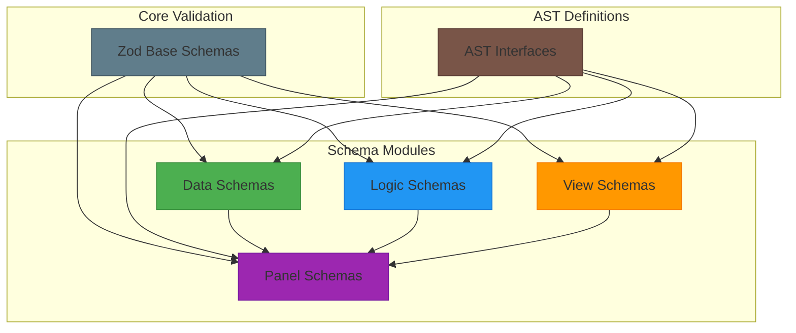
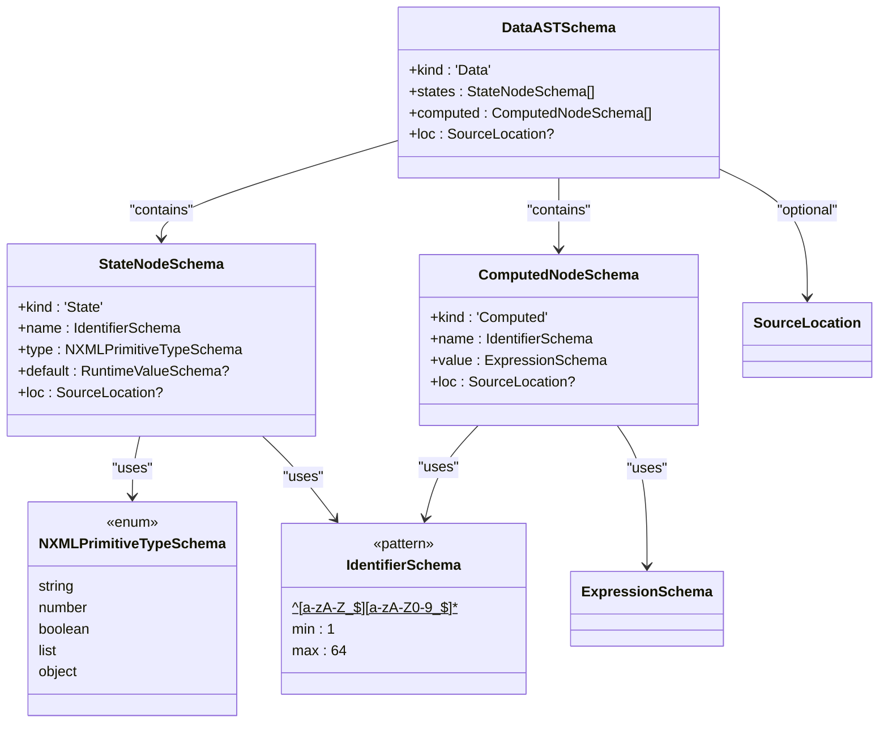
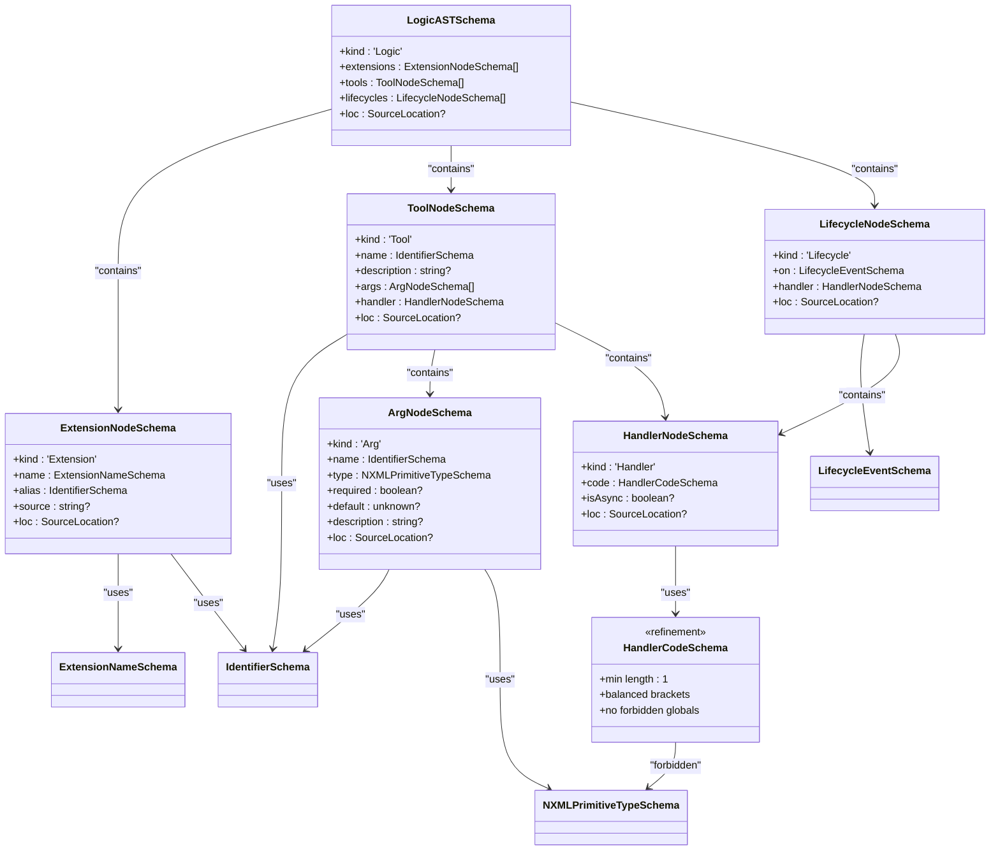
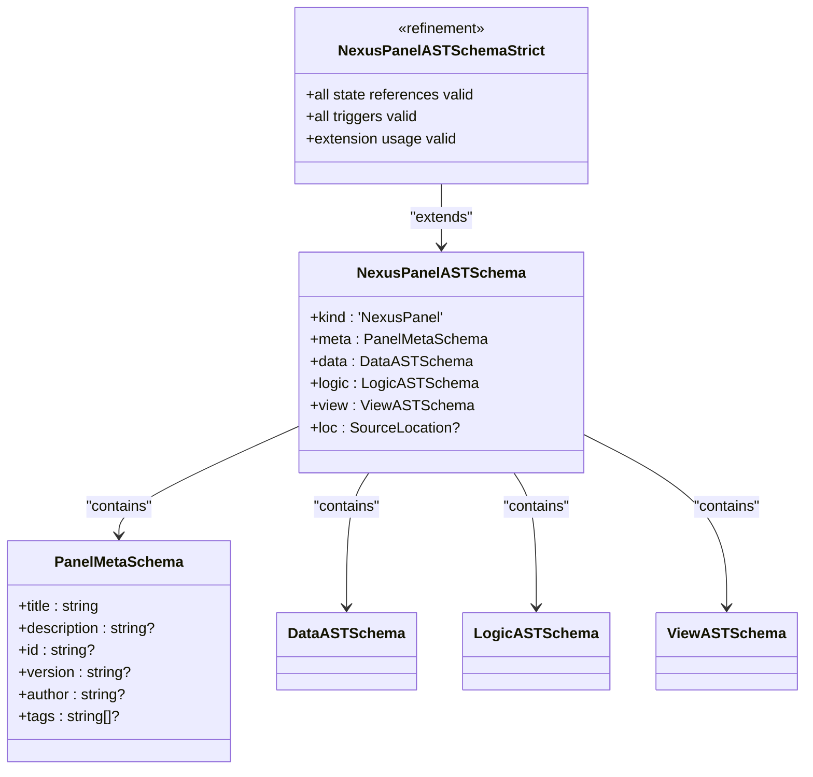
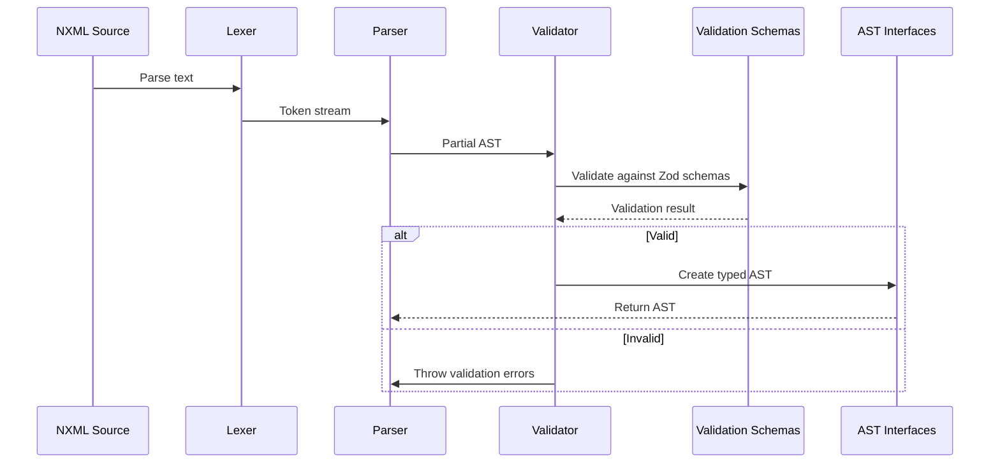
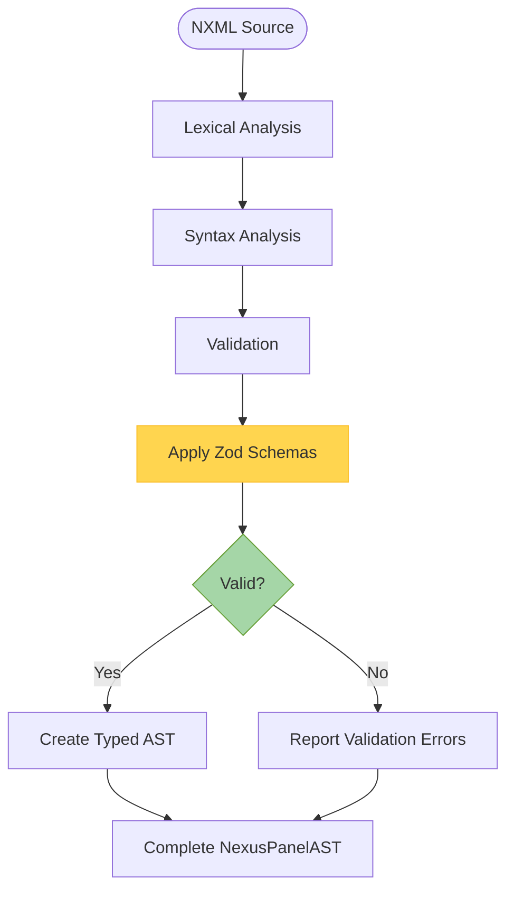

# Validation Schemas

<cite>
**Referenced Files in This Document**   
- [data.ts](file://packages/nexus-protocol/src/schemas/data.ts)
- [logic.ts](file://packages/nexus-protocol/src/schemas/logic.ts)
- [view.ts](file://packages/nexus-protocol/src/schemas/view.ts)
- [panel.ts](file://packages/nexus-protocol/src/schemas/panel.ts)
- [index.ts](file://packages/nexus-protocol/src/schemas/index.ts)
- [data.ts](file://packages/nexus-protocol/src/ast/data.ts)
- [logic.ts](file://packages/nexus-protocol/src/ast/logic.ts)
- [view.ts](file://packages/nexus-protocol/src/ast/view.ts)
- [panel.ts](file://packages/nexus-protocol/src/ast/panel.ts)
- [common.ts](file://packages/nexus-protocol/src/ast/common.ts)
- [validator.ts](file://packages/nexus-reactor/src/parser/validator.ts)
</cite>

## Table of Contents
1. [Introduction](#introduction)
2. [Core Schema Architecture](#core-schema-architecture)
3. [Data Namespace Schemas](#data-namespace-schemas)
4. [Logic Namespace Schemas](#logic-namespace-schemas)
5. [View Namespace Schemas](#view-namespace-schemas)
6. [Panel-Level Validation](#panel-level-validation)
7. [Schema-AST Relationship](#schema-ast-relationship)
8. [Validation Pipeline Integration](#validation-pipeline-integration)
9. [Common Validation Failures](#common-validation-failures)
10. [Schema Extension Patterns](#schema-extension-patterns)
11. [Conclusion](#conclusion)

## Introduction

The Validation Schemas module forms the foundation of structural integrity and type safety within the Nexus Protocol. Built on Zod, these schemas provide runtime type checking for NXML documents, ensuring that all AST nodes conform to their expected structure before execution. This comprehensive validation system operates at multiple levels—from individual node types to cross-namespace reference integrity—preventing invalid state mutations and runtime errors.

The schemas are organized by NXML namespace (data, logic, view, panel), with each schema defining the exact shape, type constraints, and validation rules for its corresponding AST nodes. These schemas not only validate syntax but also enforce semantic rules such as unique naming, valid references, and proper expression syntax. The validation process is deeply integrated into the reactor's parsing pipeline, acting as a gatekeeper that ensures only well-formed, type-safe panels are instantiated.

This document provides a detailed exploration of each schema, its validation rules, and its role in maintaining the integrity of the Nexus ecosystem. It also covers practical aspects such as debugging validation failures and extending schemas for custom components.

**Section sources**
- [data.ts](file://packages/nexus-protocol/src/schemas/data.ts#L1-L198)
- [logic.ts](file://packages/nexus-protocol/src/schemas/logic.ts#L1-L283)
- [view.ts](file://packages/nexus-protocol/src/schemas/view.ts#L1-L359)
- [panel.ts](file://packages/nexus-protocol/src/schemas/panel.ts#L1-L275)

## Core Schema Architecture

The validation system follows a hierarchical, composable architecture where each NXML namespace has its own dedicated schema file. These schemas are exported through a central index module and are designed to work both independently and in concert for comprehensive validation.



**Diagram sources**
- [data.ts](file://packages/nexus-protocol/src/schemas/data.ts#L1-L198)
- [logic.ts](file://packages/nexus-protocol/src/schemas/logic.ts#L1-L283)
- [view.ts](file://packages/nexus-protocol/src/schemas/view.ts#L1-L359)
- [panel.ts](file://packages/nexus-protocol/src/schemas/panel.ts#L1-L275)

The architecture is built on several key principles:

1. **Modularity**: Each namespace schema is self-contained and can be imported independently
2. **Composition**: Higher-level schemas (like Panel) compose lower-level ones (Data, Logic, View)
3. **Reusability**: Common types (Identifier, SourceLocation) are shared across schemas
4. **Extensibility**: Schemas can be extended or refined for custom validation needs

The `index.ts` file serves as the primary entry point, re-exporting all schema components and type definitions for convenient consumption. This design allows developers to import only the schemas they need while providing a unified interface for comprehensive validation.

**Section sources**
- [index.ts](file://packages/nexus-protocol/src/schemas/index.ts#L1-L143)

## Data Namespace Schemas

The Data namespace schemas define the structure and validation rules for state management in Nexus panels. These schemas ensure that all state declarations are properly typed, uniquely named, and contain valid default values.



**Diagram sources**
- [data.ts](file://packages/nexus-protocol/src/schemas/data.ts#L1-L198)

The Data schemas include several key components:

- **NXMLPrimitiveTypeSchema**: Enumerates the five primitive types (`string`, `number`, `boolean`, `list`, `object`) that can be used for state declarations
- **IdentifierSchema**: Validates JavaScript identifier syntax with length constraints (1-64 characters)
- **RuntimeValueSchema**: A recursive schema that validates any runtime value that can be stored in state, including nested objects and arrays
- **StateNodeSchema**: Validates individual state declarations with name, type, and optional default value
- **ComputedNodeSchema**: Validates computed properties with a name and expression value
- **DataASTSchema**: Validates the complete Data namespace, including a refinement rule that ensures no duplicate state or computed names exist

The schemas also include helper functions like `validateDefaultValueType()` which checks that a default value matches its declared type, and `validateDataAST()` which performs comprehensive validation of the entire Data structure.

**Section sources**
- [data.ts](file://packages/nexus-protocol/src/schemas/data.ts#L1-L198)
- [data.ts](file://packages/nexus-protocol/src/ast/data.ts#L1-L242)

## Logic Namespace Schemas

The Logic namespace schemas govern the validation of behavioral elements in Nexus panels, including tools, handlers, and lifecycle events. These schemas ensure that all executable code adheres to security constraints and that references between components are valid.



**Diagram sources**
- [logic.ts](file://packages/nexus-protocol/src/schemas/logic.ts#L1-L283)

Key features of the Logic schemas include:

- **HandlerCodeSchema**: A refined string schema that validates handler code by checking for balanced brackets and prohibiting forbidden globals (`window`, `document`, `eval`, `Function`, `fetch`, `XMLHttpRequest`)
- **ExtensionNameSchema**: Validates extension names using a dot-separated format (e.g., "nexus.fs", "org.ollama")
- **LogicASTSchema**: Includes multiple refinement rules that enforce business logic constraints:
  - No duplicate tool names
  - No duplicate extension aliases
  - At most one mount and one unmount lifecycle event

The schemas also provide utility functions like `detectAsyncHandler()` which checks for `async`/`await` patterns, and `validateExtensionUsage()` which ensures all extension references in handler code are properly declared.

**Section sources**
- [logic.ts](file://packages/nexus-protocol/src/schemas/logic.ts#L1-L283)
- [logic.ts](file://packages/nexus-protocol/src/ast/logic.ts#L1-L414)

## View Namespace Schemas

The View namespace schemas define the structure and validation rules for UI components in Nexus panels. These schemas ensure that all view nodes have valid properties and that bindings and triggers reference existing state and tools.

```mermaid
classDiagram
class BindingExpressionSchema {
<<refinement>>
+wrapped in {}
+or plain string
}
class LayoutPropsSchema {
+id : string?
+strategy : LayoutStrategySchema?
+gap : GapSizeSchema?
+align : AlignmentSchema?
+justify : AlignmentSchema?
}
class ContainerPropsSchema {
+id : string?
+title : string?
+variant : ContainerVariantSchema?
}
class IfPropsSchema {
+id : string?
+condition : BindingExpressionSchema
}
class IteratePropsSchema {
+id : string?
+items : BindingExpressionSchema
+as : string
+key : string?
}
class TextPropsSchema {
+id : string?
+content : string | BindingExpressionSchema
+variant : TextVariantSchema?
}
class ButtonPropsSchema {
+id : string?
+label : string
+trigger : string?
+variant : ButtonVariantSchema?
+args : BindingExpressionSchema?
+payload : string?
+disabled : boolean | BindingExpressionSchema?
}
class ViewNodeSchema {
+type : string
+id : string?
+props : Record~string,unknown~
+children : ViewNodeSchema[]
+layout : LayoutInfoSchema?
+loc : SourceLocation?
}
class ViewASTSchema {
+kind : 'View'
+root : ViewNodeSchema
+loc : SourceLocation?
}
ViewNodeSchema --> BindingExpressionSchema : "for props"
ViewNodeSchema --> LayoutInfoSchema : "optional"
ViewASTSchema --> ViewNodeSchema : "contains"
ButtonPropsSchema --> BindingExpressionSchema : "for args"
IfPropsSchema --> BindingExpressionSchema : "uses"
IteratePropsSchema --> BindingExpressionSchema : "uses"
TextPropsSchema --> BindingExpressionSchema : "uses"
```

**Diagram sources**
- [view.ts](file://packages/nexus-protocol/src/schemas/view.ts#L1-L359)

The View schemas are particularly sophisticated due to the hierarchical nature of UI components:

- **ViewNodeSchema**: A recursive schema that defines the base structure for all view nodes, including type, props, children, and optional layout information
- **Component-specific Props Schemas**: Each standard component (Text, Button, Chart, etc.) has its own props schema that validates component-specific properties
- **BindingExpressionSchema**: Validates binding syntax (`{$state.x}` or `{$scope.x}`) while allowing plain strings as alternatives

A key feature is the `validateViewNode()` function, which performs two-step validation:
1. Validates the base node structure using `ViewNodeSchema`
2. Applies type-specific props validation by looking up the appropriate props schema based on the node's type

The schemas also include utilities like `extractBindingReferences()` and `extractTriggerReferences()` which analyze a view tree to identify all state references and tool triggers, enabling cross-namespace validation.

**Section sources**
- [view.ts](file://packages/nexus-protocol/src/schemas/view.ts#L1-L359)
- [view.ts](file://packages/nexus-protocol/src/ast/view.ts#L1-L819)

## Panel-Level Validation

The Panel schemas provide the highest level of validation, ensuring that all namespaces work together cohesively. The `NexusPanelASTSchema` composes the individual namespace schemas and adds cross-namespace validation rules.



**Diagram sources**
- [panel.ts](file://packages/nexus-protocol/src/schemas/panel.ts#L1-L275)

The panel validation system includes three tiers of validation:

1. **Quick Validation** (`validateNexusPanelASTQuick`): Performs basic schema validation without cross-reference checks
2. **Standard Validation** (`validateNexusPanelAST`): Performs comprehensive validation with detailed error reporting
3. **Strict Validation** (`validateNexusPanelASTStrict`): Adds refinement rules that check cross-namespace references

The strict schema refinement ensures that:
- All state references in view bindings point to existing state or computed nodes
- All tool triggers reference existing tools
- All extension usages in handlers are properly declared

The `validateNexusPanelAST()` function returns a detailed `PanelValidationResult` with separate arrays for errors and warnings, enabling rich feedback for developers. Warnings include issues like unused state variables, unused tools, and missing mount lifecycles when extensions are used.

**Section sources**
- [panel.ts](file://packages/nexus-protocol/src/schemas/panel.ts#L1-L275)
- [panel.ts](file://packages/nexus-protocol/src/ast/panel.ts#L1-L302)

## Schema-AST Relationship

The validation schemas and AST definitions are closely related but serve different purposes. The AST interfaces define the TypeScript types for the in-memory representation, while the Zod schemas define the runtime validation rules for parsing.



**Diagram sources**
- [data.ts](file://packages/nexus-protocol/src/schemas/data.ts#L1-L198)
- [logic.ts](file://packages/nexus-protocol/src/schemas/logic.ts#L1-L283)
- [view.ts](file://packages/nexus-protocol/src/schemas/view.ts#L1-L359)
- [panel.ts](file://packages/nexus-protocol/src/schemas/panel.ts#L1-L275)
- [data.ts](file://packages/nexus-protocol/src/ast/data.ts#L1-L242)
- [logic.ts](file://packages/nexus-protocol/src/ast/logic.ts#L1-L414)
- [view.ts](file://packages/nexus-protocol/src/ast/view.ts#L1-L819)
- [panel.ts](file://packages/nexus-protocol/src/ast/panel.ts#L1-L302)

The relationship between schemas and ASTs follows these patterns:

- **Mirroring**: Each AST interface has a corresponding Zod schema with the same structure
- **Enhancement**: Schemas add validation rules not expressible in TypeScript (refinements, regex patterns)
- **Synchronization**: Changes to AST interfaces typically require corresponding updates to schemas
- **Separation of Concerns**: ASTs define the data model, while schemas define the validation rules

For example, the `StateNode` interface defines the shape of a state node in TypeScript, while `StateNodeSchema` adds runtime validation for the identifier pattern and type constraints. This dual system provides both compile-time type safety and runtime validation.

**Section sources**
- [data.ts](file://packages/nexus-protocol/src/schemas/data.ts#L1-L198)
- [data.ts](file://packages/nexus-protocol/src/ast/data.ts#L1-L242)
- [logic.ts](file://packages/nexus-protocol/src/schemas/logic.ts#L1-L283)
- [logic.ts](file://packages/nexus-protocol/src/ast/logic.ts#L1-L414)
- [view.ts](file://packages/nexus-protocol/src/schemas/view.ts#L1-L359)
- [view.ts](file://packages/nexus-protocol/src/ast/view.ts#L1-L819)
- [panel.ts](file://packages/nexus-protocol/src/schemas/panel.ts#L1-L275)
- [panel.ts](file://packages/nexus-protocol/src/ast/panel.ts#L1-L302)

## Validation Pipeline Integration

The validation schemas are tightly integrated into the reactor's parsing pipeline, where they serve as a critical checkpoint before AST instantiation. This integration ensures that only valid, type-safe panels are created.



**Diagram sources**
- [validator.ts](file://packages/nexus-reactor/src/parser/validator.ts#L1-L176)
- [parser.ts](file://packages/nexus-reactor/src/parser/parser.ts#L1-L438)

The validation process occurs in several phases:

1. **Tokenization**: The lexer converts NXML source into tokens
2. **Parsing**: The parser constructs a preliminary AST structure
3. **Validation**: The validator applies Zod schemas to check structural integrity
4. **Error Reporting**: Validation errors are collected and reported with source locations
5. **AST Creation**: A fully typed, validated AST is returned

The `validate()` function in the parser orchestrates this process, calling namespace-specific validators and aggregating results. It performs both structural validation (via Zod schemas) and semantic validation (cross-reference checks). The validation is designed to be comprehensive but efficient, providing detailed feedback while minimizing performance overhead.

**Section sources**
- [validator.ts](file://packages/nexus-reactor/src/parser/validator.ts#L1-L176)
- [parser.ts](file://packages/nexus-reactor/src/parser/parser.ts#L1-L438)

## Common Validation Failures

Understanding common validation failures is essential for effective debugging and development. The validation system provides detailed error messages that help identify and resolve issues quickly.

### Data Namespace Failures

Common data validation failures include:
- **Invalid identifiers**: State names that don't match the identifier pattern
- **Duplicate names**: Multiple states or computed nodes with the same name
- **Type mismatches**: Default values that don't match the declared type
- **Invalid expressions**: Computed node expressions with unbalanced brackets

### Logic Namespace Failures

Common logic validation failures include:
- **Forbidden globals**: Handler code that uses `window`, `document`, `eval`, etc.
- **Undeclared extensions**: Using `$ext.xxx` without declaring the extension
- **Duplicate names**: Multiple tools with the same name or extensions with duplicate aliases
- **Invalid lifecycle**: Multiple mount or unmount events

### View Namespace Failures

Common view validation failures include:
- **Invalid bindings**: Binding expressions with incorrect syntax
- **Undefined references**: Referencing non-existent state variables or tools
- **Duplicate IDs**: Multiple view nodes with the same ID
- **Scope errors**: Using `$scope.xxx` outside of an `<Iterate>` context

### Panel-Level Failures

Common panel validation issues include:
- **Cross-namespace references**: View bindings that reference non-existent state
- **Unused components**: State variables or tools that are never referenced
- **Missing initialization**: Extensions declared without a mount lifecycle

The validation system categorizes issues as errors (which prevent panel creation) or warnings (which allow creation but indicate potential problems). This distinction helps developers prioritize fixes while maintaining productivity.

**Section sources**
- [validator.ts](file://packages/nexus-reactor/src/parser/validator.ts#L1-L176)
- [data.ts](file://packages/nexus-protocol/src/schemas/data.ts#L1-L198)
- [logic.ts](file://packages/nexus-protocol/src/schemas/logic.ts#L1-L283)
- [view.ts](file://packages/nexus-protocol/src/schemas/view.ts#L1-L359)
- [panel.ts](file://packages/nexus-protocol/src/schemas/panel.ts#L1-L275)

## Schema Extension Patterns

While the core schemas cover the standard Nexus components, there are patterns for extending validation for custom components and behaviors.

### Custom Component Validation

To add validation for custom components, developers can:
1. Define a props schema for the custom component
2. Register it with the view validation system
3. Ensure the component is recognized in the AST

```typescript
// Example: Adding validation for a custom "Slider" component
const SliderPropsSchema = z.object({
  id: z.string().optional(),
  bind: z.string(),
  min: z.number().optional().default(0),
  max: z.number().optional().default(100),
  step: z.number().optional().default(1),
});

// Register with view validation
propsValidators['Slider'] = SliderPropsSchema;
```

### Custom Validation Rules

For complex validation needs, developers can:
- Add refinement rules to existing schemas
- Create custom validators that run alongside the standard validation
- Implement pre-processing steps that transform input before validation

### Third-Party Integration

When integrating third-party components or services:
- Define schemas for extension declarations
- Validate configuration parameters
- Ensure proper lifecycle handling
- Validate data contracts between components

These extension patterns maintain the integrity of the validation system while allowing for necessary flexibility in real-world applications.

**Section sources**
- [view.ts](file://packages/nexus-protocol/src/schemas/view.ts#L1-L359)
- [logic.ts](file://packages/nexus-protocol/src/schemas/logic.ts#L1-L283)

## Conclusion

The Validation Schemas module is a critical component of the Nexus Protocol, providing robust runtime type checking and structural validation for NXML documents. By leveraging Zod's powerful schema system, it ensures that all panels adhere to strict integrity rules before execution, preventing a wide range of potential errors.

The schemas are thoughtfully organized by namespace, with each level providing appropriate validation for its domain. From basic type checking in the Data namespace to complex cross-reference validation in the Panel namespace, the system provides comprehensive coverage of all structural and semantic rules.

The tight integration with the parsing pipeline ensures that validation is performed at the right time, providing immediate feedback to developers while maintaining performance. The detailed error reporting helps quickly identify and resolve issues, improving the development experience.

For beginners, the validation system provides guardrails that prevent common mistakes. For experienced developers, it offers extensibility patterns that allow customization while maintaining integrity. This balance of safety and flexibility makes the Validation Schemas module a cornerstone of the Nexus ecosystem.

As the protocol evolves, the schema system can be extended to support new features and components, ensuring that the foundation of type safety and structural integrity remains strong.

[No sources needed since this section summarizes without analyzing specific files]