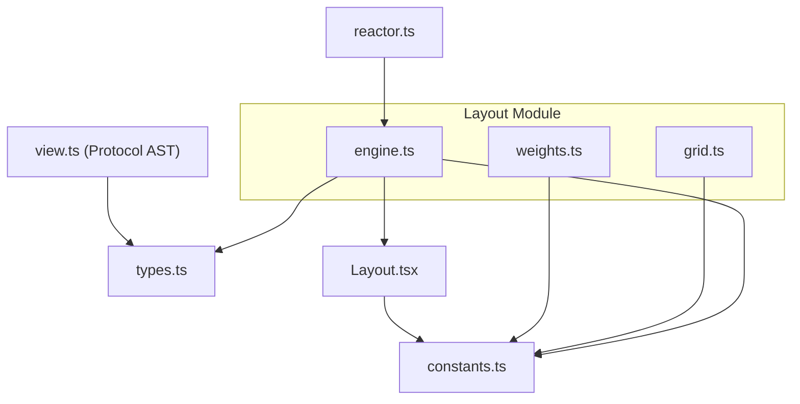
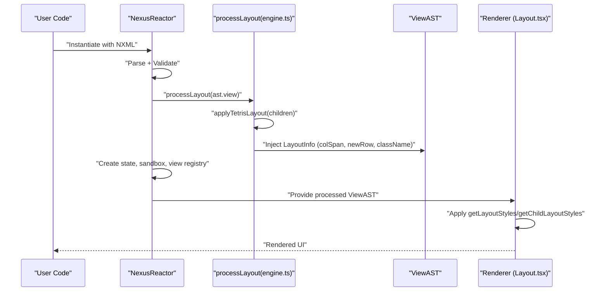
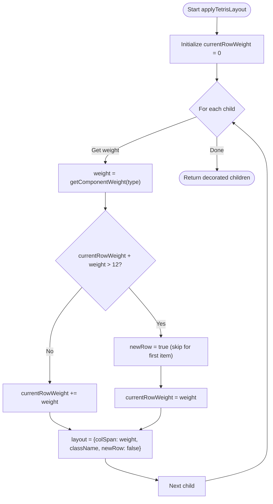
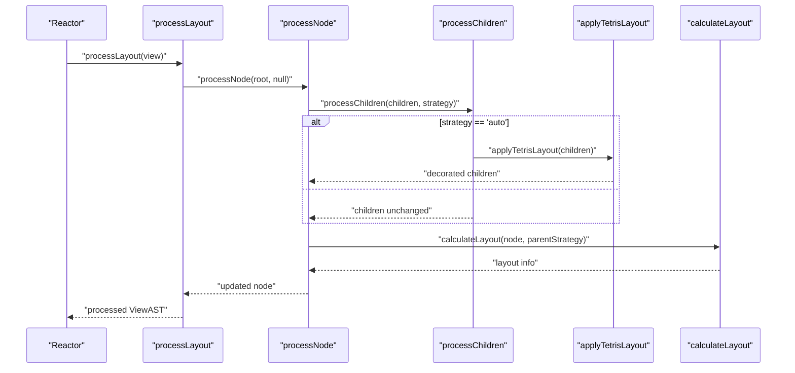
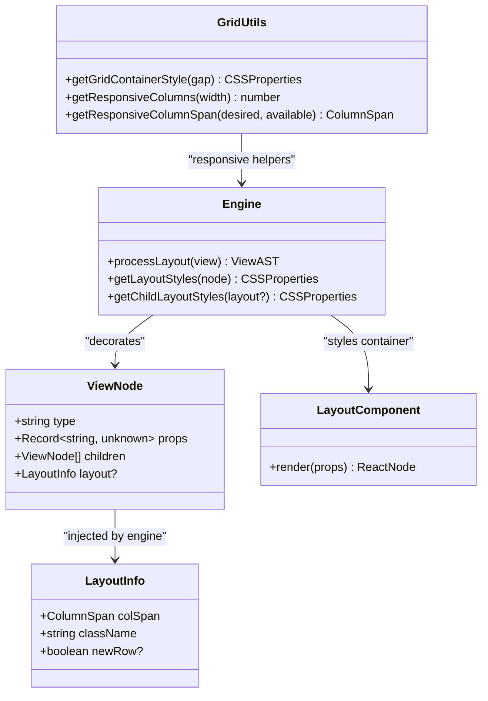
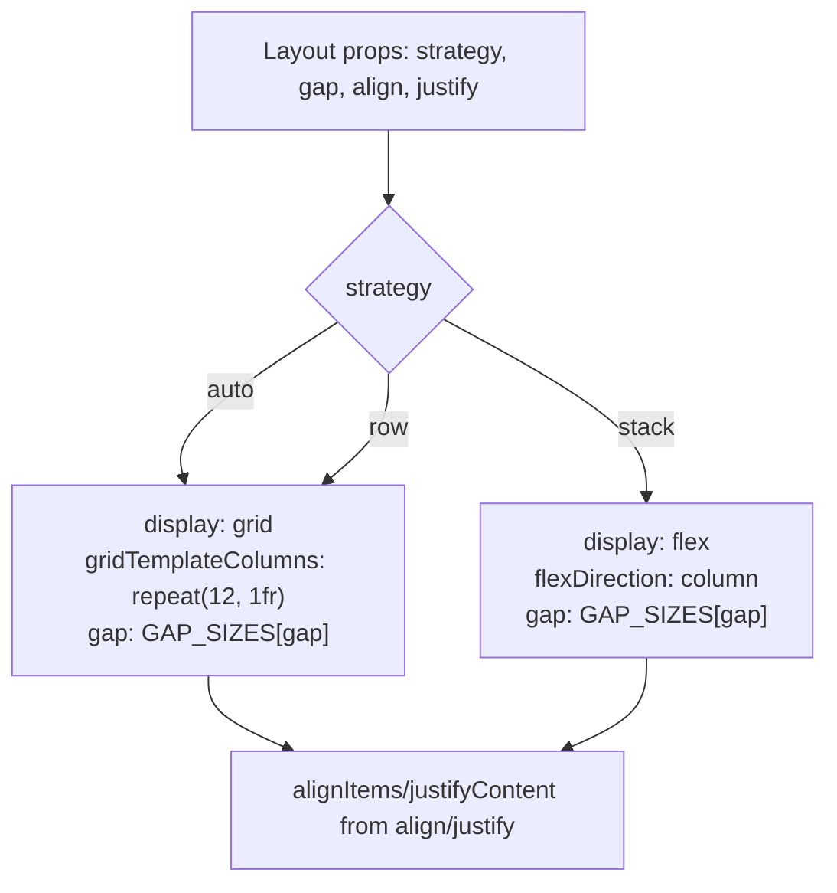
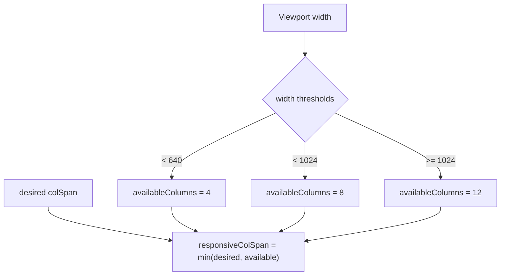
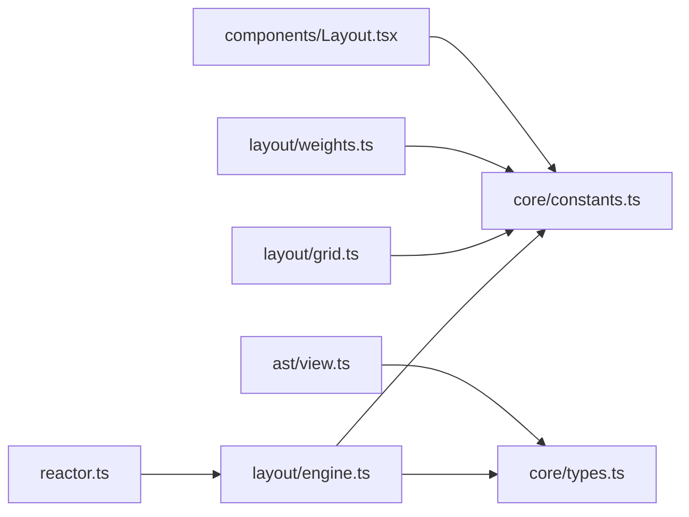

# Layout Engine

<cite>
**Referenced Files in This Document**
- [engine.ts](file://packages/nexus-reactor/src/layout/engine.ts)
- [grid.ts](file://packages/nexus-reactor/src/layout/grid.ts)
- [weights.ts](file://packages/nexus-reactor/src/layout/weights.ts)
- [constants.ts](file://packages/nexus-reactor/src/core/constants.ts)
- [types.ts](file://packages/nexus-reactor/src/core/types.ts)
- [reactor.ts](file://packages/nexus-reactor/src/reactor.ts)
- [index.ts](file://packages/nexus-reactor/src/index.ts)
- [Layout.tsx](file://packages/nexus-reactor/src/components/Layout.tsx)
- [view.ts](file://packages/nexus-protocol/src/ast/view.ts)
- [01_reactor_spec.md](file://docs/01_reactor_spec.md)
- [01_reactor_spec_VERIFICATION.md](file://docs/01_reactor_spec_VERIFICATION.md)
</cite>

## Table of Contents
1. [Introduction](#introduction)
2. [Project Structure](#project-structure)
3. [Core Components](#core-components)
4. [Architecture Overview](#architecture-overview)
5. [Detailed Component Analysis](#detailed-component-analysis)
6. [Dependency Analysis](#dependency-analysis)
7. [Performance Considerations](#performance-considerations)
8. [Troubleshooting Guide](#troubleshooting-guide)
9. [Conclusion](#conclusion)
10. [Appendices](#appendices)

## Introduction
This document explains the Layout Engine that calculates deterministic 12-column grid layouts for Nexus panels. It covers the “Tetris” algorithm that places view components according to predefined weights (e.g., Metric=3, Chart=6) under a 12-column constraint, the layout optimization performed during reactor initialization, and the integration with the AST and CSS grid system for responsive design. It also provides guidance on configuring weights, selecting layout strategies (auto, stack, row), setting gaps, and addressing common layout issues such as overflow, alignment, and responsive behavior across screen sizes. Finally, it outlines performance considerations around layout calculation timing and caching.

## Project Structure
The Layout Engine resides in the layout module and integrates with core types, constants, and the Reactor runtime. The key files are:
- Layout Engine: computes layout metadata and CSS classes/styles
- Grid utilities: compute responsive columns and CSS grid styles
- Weights: re-export component weights and grid columns
- Core constants and types: define weights, spans, strategies, and AST node shapes
- Reactor integration: applies layout during initialization
- Component wrapper: renders Layout with appropriate CSS grid/flex styles
- Protocol AST: defines the View AST and LayoutInfo shape

**Diagram sources**
- [engine.ts](file://packages/nexus-reactor/src/layout/engine.ts#L1-L232)
- [grid.ts](file://packages/nexus-reactor/src/layout/grid.ts#L1-L87)
- [weights.ts](file://packages/nexus-reactor/src/layout/weights.ts#L1-L14)
- [constants.ts](file://packages/nexus-reactor/src/core/constants.ts#L1-L283)
- [types.ts](file://packages/nexus-reactor/src/core/types.ts#L53-L120)
- [reactor.ts](file://packages/nexus-reactor/src/reactor.ts#L60-L75)
- [Layout.tsx](file://packages/nexus-reactor/src/components/Layout.tsx#L1-L62)
- [view.ts](file://packages/nexus-protocol/src/ast/view.ts#L66-L137)

**Section sources**
- [engine.ts](file://packages/nexus-reactor/src/layout/engine.ts#L1-L232)
- [grid.ts](file://packages/nexus-reactor/src/layout/grid.ts#L1-L87)
- [weights.ts](file://packages/nexus-reactor/src/layout/weights.ts#L1-L14)
- [constants.ts](file://packages/nexus-reactor/src/core/constants.ts#L1-L283)
- [types.ts](file://packages/nexus-reactor/src/core/types.ts#L53-L120)
- [reactor.ts](file://packages/nexus-reactor/src/reactor.ts#L60-L75)
- [Layout.tsx](file://packages/nexus-reactor/src/components/Layout.tsx#L1-L62)
- [view.ts](file://packages/nexus-protocol/src/ast/view.ts#L66-L137)

## Core Components
- Layout Engine (engine.ts): Applies the “Tetris” algorithm to place children in a 12-column grid, computes colSpan and newRow flags, and generates CSS class names. It also computes container styles for Layout and child styles for grid placement.
- Grid Utilities (grid.ts): Provides helpers for responsive breakpoints, column spans, CSS grid container styles, and gap conversions.
- Weights (weights.ts): Re-exports component weights and grid columns from constants.
- Core Constants (constants.ts): Defines component weights, grid columns, and gap sizes.
- Core Types (types.ts): Declares LayoutStrategy, GapSize, ColumnSpan, and LayoutInfo.
- Reactor Integration (reactor.ts): Calls processLayout during initialization to decorate the View AST with layout metadata.
- Layout Component (Layout.tsx): Renders a container with CSS grid or flex styles based on strategy, gap, and alignment props.
- Protocol AST (view.ts): Defines the View AST and the LayoutInfo shape injected by the engine.

**Section sources**
- [engine.ts](file://packages/nexus-reactor/src/layout/engine.ts#L1-L232)
- [grid.ts](file://packages/nexus-reactor/src/layout/grid.ts#L1-L87)
- [weights.ts](file://packages/nexus-reactor/src/layout/weights.ts#L1-L14)
- [constants.ts](file://packages/nexus-reactor/src/core/constants.ts#L1-L283)
- [types.ts](file://packages/nexus-reactor/src/core/types.ts#L53-L120)
- [reactor.ts](file://packages/nexus-reactor/src/reactor.ts#L60-L75)
- [Layout.tsx](file://packages/nexus-reactor/src/components/Layout.tsx#L1-L62)
- [view.ts](file://packages/nexus-protocol/src/ast/view.ts#L66-L137)

## Architecture Overview
The Layout Engine operates during reactor initialization to transform the raw View AST into a structured, deterministic grid layout. It computes layout metadata (colSpan, newRow, className) for each node and sets container styles for Layout nodes. The renderer consumes this metadata to produce CSS grid/flex layouts.

**Diagram sources**
- [reactor.ts](file://packages/nexus-reactor/src/reactor.ts#L60-L75)
- [engine.ts](file://packages/nexus-reactor/src/layout/engine.ts#L12-L102)
- [Layout.tsx](file://packages/nexus-reactor/src/components/Layout.tsx#L18-L52)

## Detailed Component Analysis

### “Tetris” Algorithm
The “Tetris” algorithm places children in a 12-column grid by scanning left-to-right and packing components according to their weights. When adding the next component would exceed 12 columns, it starts a new row and marks newRow accordingly. Each node receives colSpan equal to its weight and a CSS class name indicating column span and whether it begins a new row.

**Diagram sources**
- [engine.ts](file://packages/nexus-reactor/src/layout/engine.ts#L55-L84)
- [constants.ts](file://packages/nexus-reactor/src/core/constants.ts#L22-L46)

**Section sources**
- [engine.ts](file://packages/nexus-reactor/src/layout/engine.ts#L55-L102)
- [constants.ts](file://packages/nexus-reactor/src/core/constants.ts#L22-L46)
- [01_reactor_spec.md](file://docs/01_reactor_spec.md#L305-L318)
- [01_reactor_spec_VERIFICATION.md](file://docs/01_reactor_spec_VERIFICATION.md#L419-L456)

### Layout Optimization During Initialization
During reactor initialization, the engine decorates the View AST with layout metadata. The process traverses nodes, determines strategy from Layout props, applies the Tetris algorithm when appropriate, and computes CSS classes and styles.

**Diagram sources**
- [reactor.ts](file://packages/nexus-reactor/src/reactor.ts#L60-L75)
- [engine.ts](file://packages/nexus-reactor/src/layout/engine.ts#L12-L102)

**Section sources**
- [reactor.ts](file://packages/nexus-reactor/src/reactor.ts#L60-L75)
- [engine.ts](file://packages/nexus-reactor/src/layout/engine.ts#L12-L102)

### Integration with AST and CSS Grid System
- AST shape: The protocol defines ViewNode with a layout field that the engine injects. The engine augments nodes with colSpan, className, and newRow flags.
- CSS grid integration: The engine generates container styles for Layout nodes (CSS grid with repeat(12, 1fr)) and child styles (gridColumn span) based on computed layout metadata.
- Responsive behavior: Grid utilities compute responsive column counts and column spans based on viewport width.

**Diagram sources**
- [view.ts](file://packages/nexus-protocol/src/ast/view.ts#L66-L137)
- [engine.ts](file://packages/nexus-reactor/src/layout/engine.ts#L131-L173)
- [grid.ts](file://packages/nexus-reactor/src/layout/grid.ts#L19-L48)
- [Layout.tsx](file://packages/nexus-reactor/src/components/Layout.tsx#L18-L52)

**Section sources**
- [view.ts](file://packages/nexus-protocol/src/ast/view.ts#L66-L137)
- [engine.ts](file://packages/nexus-reactor/src/layout/engine.ts#L131-L173)
- [grid.ts](file://packages/nexus-reactor/src/layout/grid.ts#L19-L48)
- [Layout.tsx](file://packages/nexus-reactor/src/components/Layout.tsx#L18-L52)

### Weight Configuration and Strategy Selection
- Component weights: Defined in constants and used by the engine to compute colSpan and newRow. Unknown components fall back to a default weight.
- Strategy selection: Layout nodes accept strategy props. The engine switches between CSS grid (auto, row) and flex column (stack). Gap and alignment props control spacing and alignment.
- Gap sizing: Gap sizes map to CSS values and are applied consistently across grid and flex modes.

**Diagram sources**
- [engine.ts](file://packages/nexus-reactor/src/layout/engine.ts#L134-L162)
- [constants.ts](file://packages/nexus-reactor/src/core/constants.ts#L58-L63)
- [Layout.tsx](file://packages/nexus-reactor/src/components/Layout.tsx#L18-L52)

**Section sources**
- [constants.ts](file://packages/nexus-reactor/src/core/constants.ts#L22-L46)
- [engine.ts](file://packages/nexus-reactor/src/layout/engine.ts#L134-L162)
- [Layout.tsx](file://packages/nexus-reactor/src/components/Layout.tsx#L18-L52)

### Responsive Behavior Across Screen Sizes
- Responsive breakpoints: The grid utilities compute available columns based on viewport width (e.g., 4, 8, or 12).
- Responsive column span: Desired spans are clamped to available columns to prevent overflow.
- Integration: While the engine injects deterministic colSpan values, consumers can use responsive helpers to adapt spans at runtime.

**Diagram sources**
- [grid.ts](file://packages/nexus-reactor/src/layout/grid.ts#L30-L48)

**Section sources**
- [grid.ts](file://packages/nexus-reactor/src/layout/grid.ts#L30-L48)

## Dependency Analysis
The Layout Engine depends on core constants for weights and grid columns, and on core types for layout-related enums and shapes. It integrates with the Reactor at initialization and with the renderer via exported helpers.

**Diagram sources**
- [engine.ts](file://packages/nexus-reactor/src/layout/engine.ts#L1-L232)
- [grid.ts](file://packages/nexus-reactor/src/layout/grid.ts#L1-L87)
- [weights.ts](file://packages/nexus-reactor/src/layout/weights.ts#L1-L14)
- [constants.ts](file://packages/nexus-reactor/src/core/constants.ts#L1-L283)
- [types.ts](file://packages/nexus-reactor/src/core/types.ts#L53-L120)
- [reactor.ts](file://packages/nexus-reactor/src/reactor.ts#L60-L75)
- [Layout.tsx](file://packages/nexus-reactor/src/components/Layout.tsx#L1-L62)
- [view.ts](file://packages/nexus-protocol/src/ast/view.ts#L66-L137)

**Section sources**
- [engine.ts](file://packages/nexus-reactor/src/layout/engine.ts#L1-L232)
- [grid.ts](file://packages/nexus-reactor/src/layout/grid.ts#L1-L87)
- [weights.ts](file://packages/nexus-reactor/src/layout/weights.ts#L1-L14)
- [constants.ts](file://packages/nexus-reactor/src/core/constants.ts#L1-L283)
- [types.ts](file://packages/nexus-reactor/src/core/types.ts#L53-L120)
- [reactor.ts](file://packages/nexus-reactor/src/reactor.ts#L60-L75)
- [Layout.tsx](file://packages/nexus-reactor/src/components/Layout.tsx#L1-L62)
- [view.ts](file://packages/nexus-protocol/src/ast/view.ts#L66-L137)

## Performance Considerations
- Calculation timing: The engine runs once during reactor initialization, immediately after parsing and validating the AST. This ensures layout metadata is available for the renderer without additional passes.
- Complexity: The “Tetris” algorithm is linear in the number of children per container, O(n), with constant-time weight lookups.
- Rendering cost: CSS grid/flex calculations are handled by the browser; the engine’s contribution is minimal—applying colSpan and className.
- Caching: There is no explicit caching in the engine. If future scenarios require repeated layout recomputation, consider memoizing weight lookups and container style computations keyed by props.

[No sources needed since this section provides general guidance]

## Troubleshooting Guide
Common layout issues and remedies:
- Overflow: If a component’s weight exceeds available columns, it will start a new row. Verify component weights and consider switching to a full-width strategy (e.g., set strategy to stack or row) for dense content.
- Alignment: Use align and justify props on Layout to control flex alignment. For grid alignment, rely on CSS grid alignment utilities in the consuming renderer.
- Responsive behavior: For dynamic responsiveness, compute available columns based on viewport width and clamp desired spans. Ensure the consumer applies responsive spans at runtime when necessary.
- Deterministic rows: The engine marks newRow for items that cannot fit in the current row. If unexpected wrapping occurs, review weights and component ordering.

**Section sources**
- [engine.ts](file://packages/nexus-reactor/src/layout/engine.ts#L55-L102)
- [grid.ts](file://packages/nexus-reactor/src/layout/grid.ts#L30-L48)
- [Layout.tsx](file://packages/nexus-reactor/src/components/Layout.tsx#L18-L52)

## Conclusion
The Layout Engine provides a deterministic, weight-driven 12-column grid system for Nexus panels. It integrates tightly with the AST and renderer, computing colSpan, newRow, and CSS classes during initialization. The “Tetris” algorithm ensures efficient packing under the 12-column constraint, while the engine’s style helpers enable CSS grid and flex layouts. With clear strategy and gap controls, developers can achieve predictable, responsive designs across screen sizes.

[No sources needed since this section summarizes without analyzing specific files]

## Appendices

### Code Example Paths
- Weight configuration: See component weights in [constants.ts](file://packages/nexus-reactor/src/core/constants.ts#L22-L46).
- Strategy selection: Layout props and strategy handling in [engine.ts](file://packages/nexus-reactor/src/layout/engine.ts#L134-L162) and [Layout.tsx](file://packages/nexus-reactor/src/components/Layout.tsx#L18-L52).
- Gap sizing: Gap size mapping in [constants.ts](file://packages/nexus-reactor/src/core/constants.ts#L58-L63).
- Responsive behavior: Breakpoints and column span clamping in [grid.ts](file://packages/nexus-reactor/src/layout/grid.ts#L30-L48).
- Layout optimization timing: Initialization hook in [reactor.ts](file://packages/nexus-reactor/src/reactor.ts#L60-L75).

**Section sources**
- [constants.ts](file://packages/nexus-reactor/src/core/constants.ts#L22-L46)
- [engine.ts](file://packages/nexus-reactor/src/layout/engine.ts#L134-L162)
- [Layout.tsx](file://packages/nexus-reactor/src/components/Layout.tsx#L18-L52)
- [grid.ts](file://packages/nexus-reactor/src/layout/grid.ts#L30-L48)
- [reactor.ts](file://packages/nexus-reactor/src/reactor.ts#L60-L75)