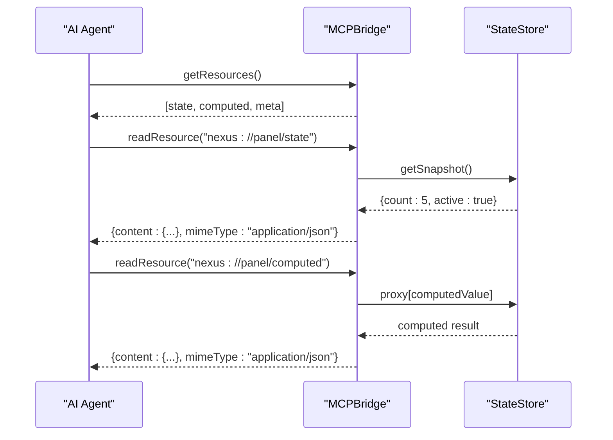
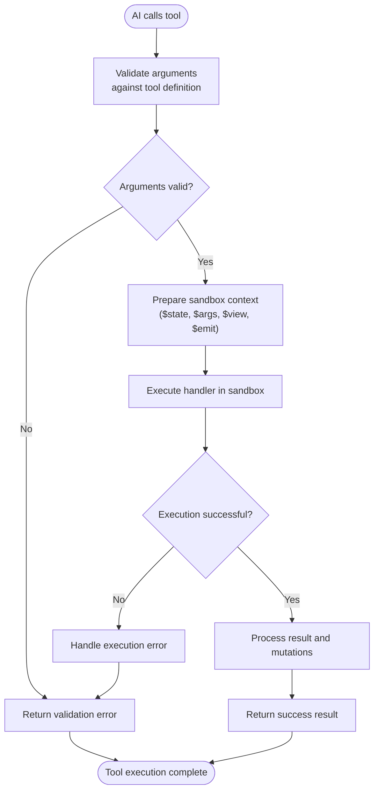

# MCP Integration

<cite>
**Referenced Files in This Document**   
- [bridge.ts](file://packages/nexus-reactor/src/mcp/bridge.ts)
- [tools.ts](file://packages/nexus-reactor/src/mcp/tools.ts)
- [resources.ts](file://packages/nexus-reactor/src/mcp/resources.ts)
- [types.ts](file://packages/nexus-reactor/src/core/types.ts)
- [state.ts](file://packages/nexus-reactor/src/state/store.ts)
- [executor.ts](file://packages/nexus-reactor/src/sandbox/executor.ts)
- [reactor.ts](file://packages/nexus-reactor/src/reactor.ts)
- [panel.ts](file://runtime/workspace-kernel/src/panel.ts)
</cite>

## Table of Contents
1. [Introduction](#introduction)
2. [MCPBridge Overview](#mcpbridge-overview)
3. [Tool Exposure and Discovery](#tool-exposure-and-discovery)
4. [Resource System and State Inspection](#resource-system-and-state-inspection)
5. [Tool Execution Flow](#tool-execution-flow)
6. [NXML Tool Definition and AI Interaction](#nxml-tool-definition-and-ai-interaction)
7. [Security Considerations](#security-considerations)
8. [Common Integration Issues and Debugging](#common-integration-issues-and-debugging)
9. [Performance Implications](#performance-implications)

## Introduction
The Model Context Protocol (MCP) Integration enables AI agents to interact with Nexus panels by exposing panel tools and state through a standardized interface. This integration is facilitated by the MCPBridge, which acts as a middleware layer between AI systems and the Nexus runtime. The MCPBridge generates JSON Schema representations of available tools, allowing AI agents to understand and invoke panel functionality. It also provides a resource system for AI agents to inspect panel state and metadata, enabling context-aware interactions. This document details the architecture, implementation, and usage patterns of the MCP integration, covering tool discovery, execution flow, state inspection, and security considerations.

## MCPBridge Overview
The MCPBridge is the core component that enables AI agents to interact with Nexus panels. It provides a standardized interface for tool discovery, state inspection, and tool execution. The bridge is created with a NexusPanelAST, state store, and an execution function, and exposes four primary methods: getTools(), getResources(), readResource(), and callTool(). These methods allow AI agents to discover available functionality, inspect panel state, and execute tools in a secure sandboxed environment. The MCPBridge converts NXML tool definitions into MCPTool objects with JSON Schema input definitions, making them accessible to AI systems. It also generates resource URIs for panel state, computed values, and metadata, enabling AI agents to maintain context awareness during interactions.

**Section sources**
- [bridge.ts](file://packages/nexus-reactor/src/mcp/bridge.ts#L1-L167)
- [types.ts](file://packages/nexus-reactor/src/core/types.ts#L316-L357)

## Tool Exposure and Discovery
The MCPBridge exposes panel tools to AI agents through the getTools() method, which returns an array of MCPTool objects. Each tool is converted from an NXML ToolNode using the convertToolToMCP function, which generates a JSON Schema representation of the tool's input parameters. The conversion process maps NXML primitive types to JSON Schema types and includes argument descriptions, default values, and required status. The getToolsDescription function provides a formatted string representation of available tools for AI context, including tool signatures and descriptions. This enables AI agents to understand the available functionality and construct valid tool calls. The tool discovery mechanism is essential for dynamic AI interactions, allowing agents to adapt their behavior based on the available tools in a panel.

```mermaid
classDiagram
class MCPBridge {
+getTools() : MCPTool[]
+getResources() : MCPResource[]
+readResource(uri : string) : { content : unknown; mimeType : string } | null
+callTool(name : string, args? : Record<string, unknown>) : Promise<unknown>
}
class MCPTool {
+name : string
+description? : string
+inputSchema : JSONSchema
}
class JSONSchema {
+type : string
+description? : string
+properties? : Record<string, JSONSchema>
+required? : string[]
+items? : JSONSchema
+default? : unknown
+enum? : unknown[]
}
class ToolNode {
+name : string
+description? : string
+args : ArgNode[]
+handler : HandlerNode
}
class ArgNode {
+name : string
+type : NXMLPrimitiveType
+required? : boolean
+default? : unknown
+description? : string
}
MCPBridge --> MCPTool : "returns"
MCPTool --> JSONSchema : "contains"
MCPBridge --> ToolNode : "converts"
ToolNode --> ArgNode : "contains"
```

**Diagram sources **
- [bridge.ts](file://packages/nexus-reactor/src/mcp/bridge.ts#L14-L19)
- [tools.ts](file://packages/nexus-reactor/src/mcp/tools.ts#L12-L32)
- [types.ts](file://packages/nexus-reactor/src/core/types.ts#L335-L339)

**Section sources**
- [bridge.ts](file://packages/nexus-reactor/src/mcp/bridge.ts#L27-L29)
- [tools.ts](file://packages/nexus-reactor/src/mcp/tools.ts#L12-L32)
- [types.ts](file://packages/nexus-reactor/src/core/types.ts#L182-L188)

## Resource System and State Inspection
The MCP integration provides a resource system that allows AI agents to inspect panel state and metadata through the getResources() and readResource() methods. The getResources() method returns an array of MCPResource objects, each representing a readable resource with a URI, name, and MIME type. Standard resources include panel state, computed values, and metadata, accessible via nexus:// URIs. The readResource() method retrieves the content of a specified resource, returning the current state snapshot, computed values, or panel metadata as JSON. This state inspection capability enables AI agents to maintain context awareness and make informed decisions during interactions. The resource system is extensible, allowing for additional resource types to be added as needed. State inspection is crucial for AI agents to understand the current panel context before executing tools or making recommendations.



**Diagram sources **
- [bridge.ts](file://packages/nexus-reactor/src/mcp/bridge.ts#L31-L44)
- [resources.ts](file://packages/nexus-reactor/src/mcp/resources.ts#L14-L31)
- [state.ts](file://packages/nexus-reactor/src/state/store.ts#L237-L239)

**Section sources**
- [bridge.ts](file://packages/nexus-reactor/src/mcp/bridge.ts#L31-L70)
- [resources.ts](file://packages/nexus-reactor/src/mcp/resources.ts#L14-L31)
- [state.ts](file://packages/nexus-reactor/src/state/store.ts#L237-L239)

## Tool Execution Flow
The tool execution flow in the MCP integration involves several steps: argument validation, sandbox execution, and result return. When an AI agent calls a tool through the callTool() method, the MCPBridge delegates the execution to the provided executeTool function. This function validates the arguments against the tool's definition, ensuring required parameters are present and default values are applied where necessary. The validated arguments are then passed to the sandbox executor, which creates a secure execution context with access to state, view API, event emission, and extensions. The handler code is executed in a sandboxed environment with restricted globals and capability-based security. The execution result is returned to the AI agent, either as a success with a value or as a failure with an error message. This flow ensures secure and reliable tool execution while maintaining isolation between the AI agent and the panel's internal state.



**Diagram sources **
- [bridge.ts](file://packages/nexus-reactor/src/mcp/bridge.ts#L73-L76)
- [executor.ts](file://packages/nexus-reactor/src/sandbox/executor.ts#L37-L67)
- [reactor.ts](file://packages/nexus-reactor/src/reactor.ts#L147-L179)

**Section sources**
- [bridge.ts](file://packages/nexus-reactor/src/mcp/bridge.ts#L73-L76)
- [executor.ts](file://packages/nexus-reactor/src/sandbox/executor.ts#L37-L67)
- [reactor.ts](file://packages/nexus-reactor/src/reactor.ts#L147-L179)

## NXML Tool Definition and AI Interaction
NXML tool definitions are structured elements within the Logic namespace of a Nexus panel, containing a name, description, arguments, and handler code. These definitions are parsed from NXML source and converted into MCPTool objects with JSON Schema input definitions. AI agents can discover available tools through the getTools() method and understand their usage through the generated JSON Schema. The interaction pattern involves the AI agent constructing a tool call with appropriate arguments based on the schema, which is then executed through the MCPBridge. The handler code runs in a sandboxed environment with access to panel state, view components, and extensions through the $state, $view, $ext, $emit, and $log APIs. This enables AI agents to modify state, update UI components, trigger events, and interact with external services in a controlled manner. The NXML tool definition system provides a declarative way to expose panel functionality to AI agents while maintaining security and type safety.

**Section sources**
- [parser.ts](file://packages/nexus-reactor/src/parser/parser.ts#L214-L251)
- [types.ts](file://packages/nexus-reactor/src/core/types.ts#L182-L188)
- [executor.ts](file://packages/nexus-reactor/src/sandbox/executor.ts#L69-L114)

## Security Considerations
The MCP integration incorporates several security mechanisms to protect panel state and functionality from unauthorized access. The sandbox executor restricts access to forbidden globals and enforces capability-based security for handler execution. Capability tokens control access to specific state keys, events, view components, and extensions, preventing privilege escalation. The MCPBridge itself acts as a secure gateway, validating tool calls and resource access requests before processing. Tool arguments are validated against the tool's definition, preventing injection attacks and ensuring type safety. The resource system limits state inspection to explicitly exposed resources, preventing unauthorized access to internal state. Additionally, the execution context is isolated, preventing direct access to the host environment. These security measures ensure that AI agents can interact with panels in a controlled and safe manner, maintaining the integrity of the application and user data.

**Section sources**
- [executor.ts](file://packages/nexus-reactor/src/sandbox/executor.ts#L6-L7)
- [types.ts](file://packages/nexus-reactor/src/core/types.ts#L169-L180)
- [constants.ts](file://packages/nexus-reactor/src/core/constants.ts#L145-L145)

## Common Integration Issues and Debugging
Common integration issues in the MCP system include tool discovery failures, argument validation errors, and sandbox execution exceptions. Debugging these issues involves checking the NXML tool definitions for correctness, verifying that required arguments are provided with appropriate types, and ensuring that handler code does not reference forbidden globals. The MCPBridge includes debug logging that can be enabled to trace tool calls and resource access. Validation errors should be handled gracefully, providing clear error messages to the AI agent. Performance issues may arise from frequent state inspection or complex handler execution, which can be mitigated through caching and optimization. Testing tool interactions with sample inputs and monitoring execution logs can help identify and resolve integration issues. The structured error handling in the MCP system provides detailed feedback for debugging, including validation errors and execution exceptions.

**Section sources**
- [bridge.ts](file://packages/nexus-reactor/src/mcp/bridge.ts#L12-L12)
- [executor.ts](file://packages/nexus-reactor/src/sandbox/executor.ts#L8-L8)
- [reactor.ts](file://packages/nexus-reactor/src/reactor.ts#L25-L25)

## Performance Implications
Frequent state inspection through the readResource() method can have performance implications, especially for large state objects or high-frequency AI interactions. Each state read involves creating a snapshot of the current state, which requires cloning the state object. Computed values are cached but recalculated when dependencies change, adding overhead to state mutations. Tool execution in the sandbox also incurs performance costs due to context creation and security checks. To optimize performance, AI agents should minimize unnecessary state reads and batch tool calls when possible. The MCP system could implement caching mechanisms for frequently accessed resources and optimize the state snapshot process. Monitoring execution times and resource usage can help identify performance bottlenecks. The impact of frequent state inspection should be considered when designing AI interaction patterns, balancing context awareness with performance requirements.

**Section sources**
- [state.ts](file://packages/nexus-reactor/src/state/store.ts#L237-L239)
- [bridge.ts](file://packages/nexus-reactor/src/mcp/bridge.ts#L54-L55)
- [resources.ts](file://packages/nexus-reactor/src/mcp/resources.ts#L47-L48)