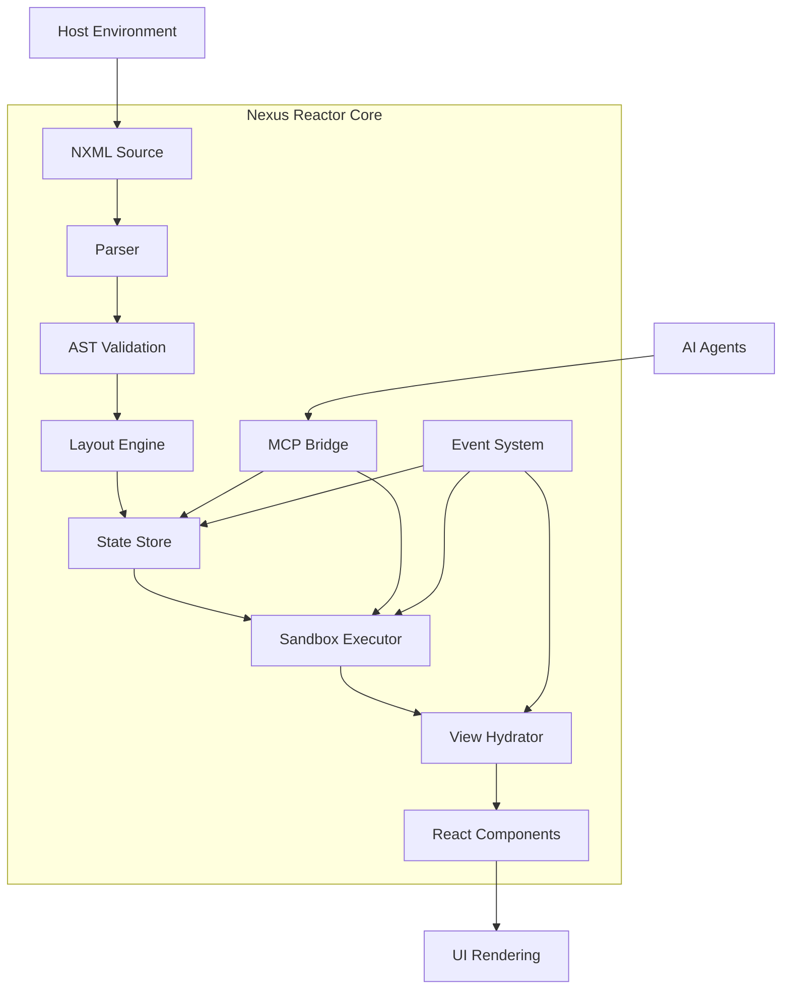
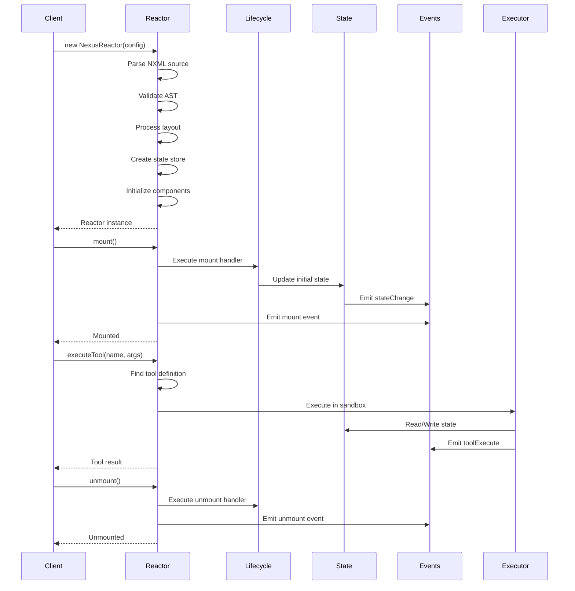
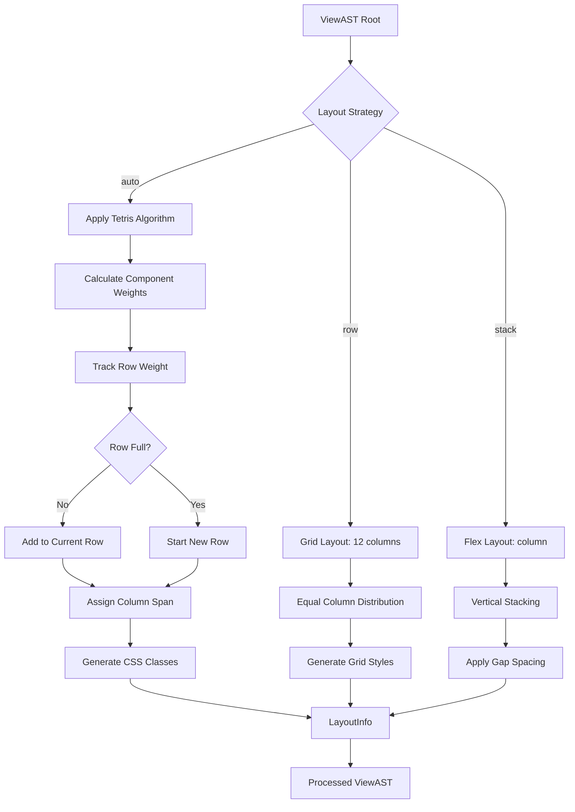
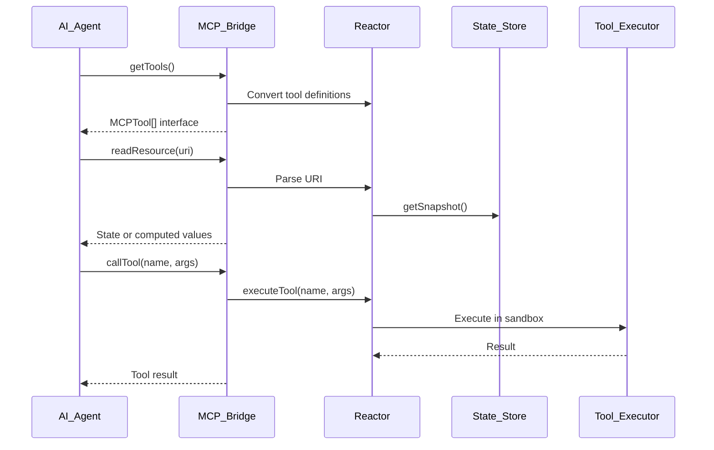
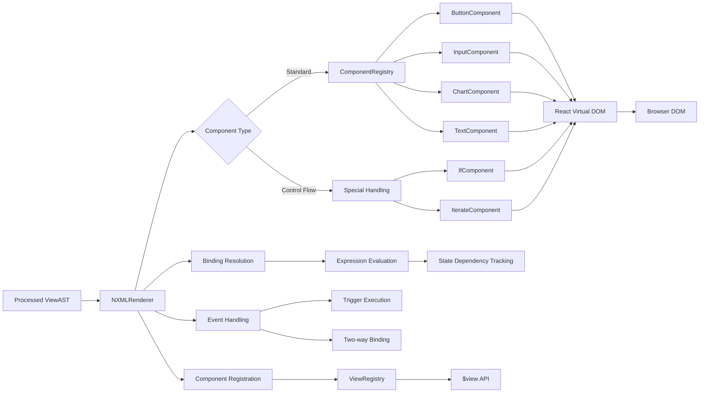
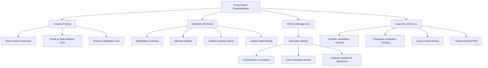
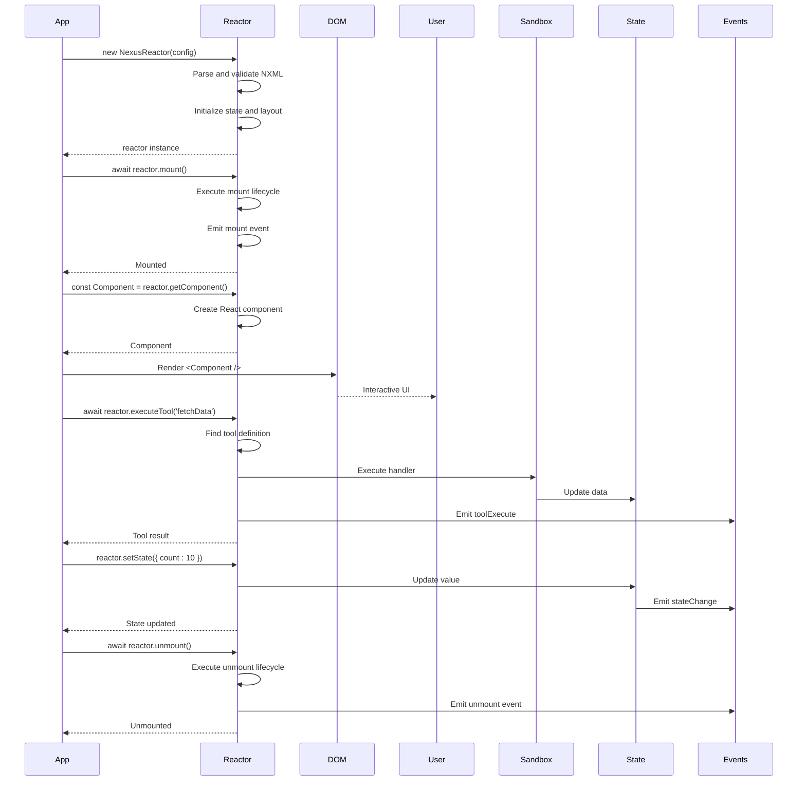

# Nexus Reactor

<cite>
**Referenced Files in This Document**   
- [reactor.ts](file://packages/nexus-reactor/src/reactor.ts)
- [store.ts](file://packages/nexus-reactor/src/state/store.ts)
- [proxy.ts](file://packages/nexus-reactor/src/state/proxy.ts)
- [engine.ts](file://packages/nexus-reactor/src/layout/engine.ts)
- [bridge.ts](file://packages/nexus-reactor/src/mcp/bridge.ts)
- [executor.ts](file://packages/nexus-reactor/src/sandbox/executor.ts)
- [types.ts](file://packages/nexus-reactor/src/core/types.ts)
- [constants.ts](file://packages/nexus-reactor/src/core/constants.ts)
- [expression.ts](file://packages/nexus-reactor/src/utils/expression.ts)
- [hydrator.tsx](file://packages/nexus-reactor/src/view/hydrator.tsx)
- [events.ts](file://packages/nexus-reactor/src/core/events.ts)
</cite>

## Table of Contents
1. [Introduction](#introduction)
2. [Core Architecture](#core-architecture)
3. [Reactor Lifecycle](#reactor-lifecycle)
4. [State Management System](#state-management-system)
5. [Layout Engine](#layout-engine)
6. [MCP Bridge Integration](#mcp-bridge-integration)
7. [Sandboxed Execution Model](#sandboxed-execution-model)
8. [View Rendering Pipeline](#view-rendering-pipeline)
9. [Event System](#event-system)
10. [Performance Considerations](#performance-considerations)
11. [Code Examples](#code-examples)

## Introduction

The Nexus Reactor is an isomorphic execution engine that transforms static NXML definitions into dynamic, interactive applications. It serves as the runtime core of the Nexus platform, orchestrating the complete lifecycle from parsing and validation to state management, layout calculation, and React component generation. The reactor operates as a self-contained unit that encapsulates all the necessary systems for executing Nexus panels, providing a secure and efficient environment for dynamic application behavior.

The reactor's architecture is designed around several key principles: reactivity, security, and extensibility. It implements a Proxy-based reactive state system that automatically tracks dependencies and updates components when state changes. The execution environment is sandboxed to prevent access to potentially harmful browser APIs while still providing controlled access to necessary functionality through a well-defined context. The MCP (Model Context Protocol) bridge enables integration with AI agents, allowing them to inspect state and execute tools programmatically.

This document provides a comprehensive analysis of the Nexus Reactor's architecture and functionality, covering its core components, execution model, and integration points.

## Core Architecture

The Nexus Reactor follows a modular architecture with clearly defined components that work together to transform NXML definitions into interactive applications. The core architecture consists of several interconnected systems: the reactor orchestrator, state management, layout engine, sandbox execution, MCP bridge, and view rendering pipeline.



**Diagram sources**
- [reactor.ts](file://packages/nexus-reactor/src/reactor.ts#L29-L255)
- [parser.ts](file://packages/nexus-reactor/src/parser/parser.ts#L35-L438)
- [validator.ts](file://packages/nexus-reactor/src/parser/validator.ts#L1-L200)
- [engine.ts](file://packages/nexus-reactor/src/layout/engine.ts#L13-L232)
- [store.ts](file://packages/nexus-reactor/src/state/store.ts#L25-L57)
- [executor.ts](file://packages/nexus-reactor/src/sandbox/executor.ts#L17-L22)
- [hydrator.tsx](file://packages/nexus-reactor/src/view/hydrator.tsx#L241-L258)

**Section sources**
- [reactor.ts](file://packages/nexus-reactor/src/reactor.ts#L1-L260)
- [types.ts](file://packages/nexus-reactor/src/core/types.ts#L1-L446)

## Reactor Lifecycle

The Nexus Reactor manages a well-defined lifecycle for panel execution, providing hooks for initialization, execution, and cleanup. The lifecycle is controlled through explicit mount and unmount operations that trigger corresponding lifecycle events in the NXML definition.



The reactor lifecycle begins with instantiation, where the NXML source is parsed into an Abstract Syntax Tree (AST) and validated for structural correctness. During this phase, the layout engine processes the view definition, the state store is initialized with default values, and all supporting systems are configured. The reactor does not automatically execute any user code during instantiation, ensuring a predictable setup phase.

Mounting the reactor triggers the execution of the `mount` lifecycle handler if defined in the NXML logic section. This provides an opportunity to perform initialization tasks such as data fetching or state population. The reactor emits a `mount` event to notify subscribers that the panel has been activated. Similarly, unmounting executes the `unmount` lifecycle handler for cleanup operations and emits an `unmount` event.

The reactor maintains an internal `mounted` flag to prevent duplicate mounting and ensure proper lifecycle management. All tool executions and state modifications are permitted regardless of mount status, but lifecycle handlers are only executed during the explicit mount/unmount transitions.

**Diagram sources**
- [reactor.ts](file://packages/nexus-reactor/src/reactor.ts#L101-L142)
- [events.ts](file://packages/nexus-reactor/src/core/events.ts#L67-L94)

**Section sources**
- [reactor.ts](file://packages/nexus-reactor/src/reactor.ts#L98-L142)

## State Management System

The Nexus Reactor implements a sophisticated state management system based on JavaScript Proxies for reactivity. This system provides automatic dependency tracking, computed properties, and fine-grained updates without requiring explicit subscription management from developers.

```mermaid
classDiagram
class StateStore {
+proxy : Record~string, RuntimeValue~
+target : Record~string, RuntimeValue~
+types : Map~string, NXMLPrimitiveType~
+computedDefs : Map~string, string~
+computedCache : Map~string, RuntimeValue~
+subscribers : Map~StateKey, Set~SubscriberId~~
+subscriberCallbacks : Map~SubscriberId, () => void~
+currentSubscriber : SubscriberId | null
+updateDepth : number
}
class DependencyTracker {
+activeSubscriber : SubscriberId | null
+dependencies : Map~StateKey, Set~SubscriberId~~
+subscriberDeps : Map~SubscriberId, Set~StateKey~~
+callbacks : Map~SubscriberId, () => void~
+updateDepth : number
}
class ComputedNode {
+name : Identifier
+value : Expression
}
StateStore --> DependencyTracker : "uses"
StateStore --> ComputedNode : "contains"
DependencyTracker --> StateStore : "notifies"
note right of StateStore
Central state container with
Proxy-based reactivity and
dependency tracking
end
note left of DependencyTracker
Tracks which subscribers depend
on which state keys for efficient
update propagation
end
```

**Diagram sources**
- [store.ts](file://packages/nexus-reactor/src/state/store.ts#L13-L57)
- [proxy.ts](file://packages/nexus-reactor/src/state/proxy.ts#L18-L29)
- [types.ts](file://packages/nexus-reactor/src/core/types.ts#L121-L134)

The state system is built around the `StateStore` interface, which contains a reactive `proxy` object that wraps the underlying `target` state. When components or computed properties access state values through the proxy, the system automatically tracks these dependencies using the `currentSubscriber` mechanism. This allows for precise update notifications when state changes.

Computed properties are defined in the NXML data section and are lazily evaluated and cached. When a computed property's dependencies change, its cache is invalidated, and the value is recalculated on the next access. This ensures that expensive computations are only performed when necessary and that the results are efficiently reused.

The state system includes several safeguards to prevent common issues. Type validation occurs on state updates when type information is available, with warnings issued for type mismatches. An update depth counter prevents infinite loops by throwing an error if the update recursion exceeds a configurable limit (default: 50). The system also performs shallow equality checks before notifying subscribers to avoid unnecessary updates.

State access follows a hierarchical pattern where parent objects track dependencies for their nested properties. This means that accessing a nested property like `$state.user.profile.name` will register a dependency on the entire `user` object, ensuring updates when any nested property changes. This approach balances reactivity precision with performance considerations.

**Section sources**
- [store.ts](file://packages/nexus-reactor/src/state/store.ts#L1-L255)
- [proxy.ts](file://packages/nexus-reactor/src/state/proxy.ts#L1-L393)
- [expression.ts](file://packages/nexus-reactor/src/utils/expression.ts#L80-L99)

## Layout Engine

The Nexus Reactor's layout engine implements a responsive 12-column grid system with intelligent component weighting and auto-layout capabilities. This system transforms abstract view definitions into concrete layout information that can be used for rendering.



**Diagram sources**
- [engine.ts](file://packages/nexus-reactor/src/layout/engine.ts#L13-L232)
- [constants.ts](file://packages/nexus-reactor/src/core/constants.ts#L16-L46)
- [grid.ts](file://packages/nexus-reactor/src/layout/grid.ts#L1-L87)

The layout engine operates on the ViewAST (Abstract Syntax Tree) structure, injecting `LayoutInfo` objects that contain column span information and CSS class names. The engine supports three layout strategies: `auto`, `row`, and `stack`. The default `auto` strategy uses a "Tetris" algorithm that packs components efficiently based on their weight.

Component weights are defined in the `COMPONENT_WEIGHTS` constant, assigning each component type a default column span in the 12-column grid. For example, `Metric` and `StatusBadge` components have a weight of 3 (occupying 1/4 of the width), `Chart` and `Input` have a weight of 6 (1/2 width), and `LogStream` and `Text` have a weight of 12 (full width). The algorithm tracks the current row weight and starts a new row when adding the next component would exceed the 12-column limit.

The layout engine also handles nested layouts, where a `Layout` component with a specific strategy can override the default behavior for its children. This allows for complex, multi-level layouts within a single panel. The engine preserves any manually specified layout information, only applying automatic layout when no explicit layout is provided.

For responsive design, the engine could be extended to adjust column spans based on viewport width, though the current implementation focuses on the desktop 12-column grid. The generated CSS class names (e.g., `col-span-6`, `new-row`) provide hooks for styling and can be used in conjunction with the framework's CSS system.

**Section sources**
- [engine.ts](file://packages/nexus-reactor/src/layout/engine.ts#L1-L232)
- [constants.ts](file://packages/nexus-reactor/src/core/constants.ts#L16-L46)

## MCP Bridge Integration

The MCP (Model Context Protocol) bridge provides a standardized interface for AI agents to interact with Nexus panels, enabling state inspection and tool execution. This integration transforms static panels into programmatically accessible components that can be manipulated by AI systems.



**Diagram sources**
- [bridge.ts](file://packages/nexus-reactor/src/mcp/bridge.ts#L21-L77)
- [reactor.ts](file://packages/nexus-reactor/src/reactor.ts#L147-L179)
- [types.ts](file://packages/nexus-reactor/src/core/types.ts#L335-L349)

The MCP bridge exposes two primary resources for each panel: the panel state and computed values. These are accessible via URIs in the format `nexus://<panelId>/state` and `nexus://<panelId>/computed`. When an AI agent reads these resources, the bridge returns the current state snapshot or computed values as JSON, enabling the agent to understand the panel's current condition.

Tool exposure follows the MCP specification, converting NXML tool definitions into the standardized `MCPTool` interface. This includes the tool name, description, and a JSON Schema defining the expected input parameters. The schema is generated from the tool's argument definitions, including type information, required status, and default values.

When an AI agent calls a tool through the MCP interface, the request is forwarded to the reactor's `executeTool` method, maintaining the same execution context and security model as user-initiated tool calls. This ensures consistent behavior regardless of whether a tool is executed by a user interaction or an AI agent.

The bridge also provides utility functions for generating human-readable descriptions of available tools, which can be included in AI context prompts. This helps AI agents understand the capabilities available to them when interacting with a particular panel.

**Section sources**
- [bridge.ts](file://packages/nexus-reactor/src/mcp/bridge.ts#L1-L167)
- [reactor.ts](file://packages/nexus-reactor/src/reactor.ts#L216-L225)

## Sandboxed Execution Model

The Nexus Reactor implements a secure sandboxed execution environment for running user-defined JavaScript code. This model prevents access to potentially harmful browser APIs while providing controlled access to panel state, components, and other functionality through a well-defined context.

```mermaid
classDiagram
class SandboxExecutor {
+executeHandler(code, context)
+executeTool(tool, args, context)
}
class SandboxContext {
+$state : Record~string, RuntimeValue~
+$args : Record~string, unknown~
+$view : ViewAPI
+$emit : EmitFunction
+$ext : Record~string, unknown~
+$log : LogFunction
}
class ViewAPI {
+getElementById(id)
}
class ViewHandle {
+setProp(prop, value)
+call(method, ...args)
}
class ForbiddenGlobals {
+window
+document
+fetch
+eval
+localStorage
+setTimeout
+etc.
}
SandboxExecutor --> SandboxContext : "provides"
SandboxContext --> ViewAPI : "contains"
ViewAPI --> ViewHandle : "returns"
SandboxExecutor --> ForbiddenGlobals : "blocks"
note right of SandboxContext
Secure execution context with
limited, controlled APIs for
safe code execution
end
note left of ForbiddenGlobals
List of browser APIs that are
shadowed (set to undefined) in
the sandbox environment
end
```

**Diagram sources**
- [executor.ts](file://packages/nexus-reactor/src/sandbox/executor.ts#L12-L22)
- [types.ts](file://packages/nexus-reactor/src/core/types.ts#L279-L303)
- [constants.ts](file://packages/nexus-reactor/src/core/constants.ts#L71-L113)

The sandbox execution model is built around the `SandboxExecutor` interface, which provides methods for executing handler code and tools. When code is executed, it runs in a Function constructor with a restricted set of parameters that correspond to the sandbox context properties (`$state`, `$args`, `$view`, etc.).

To prevent access to dangerous browser APIs, the system maintains a `FORBIDDEN_GLOBALS` list that includes `window`, `document`, `fetch`, `eval`, and other potentially harmful globals. During code compilation, these globals are shadowed by declaring them as `undefined` variables in the function scope, effectively making them inaccessible to the executed code.

The execution context provides several safe APIs for interacting with the panel:
- `$state`: Reactive state store for reading and writing panel state
- `$args`: Arguments passed to the handler or tool
- `$view`: API for imperative manipulation of components
- `$emit`: Function for sending events to the host environment
- `$ext`: Host-provided extensions and capabilities
- `$log`: Safe logging function

Each execution is subject to a timeout limit (default: 500ms) to prevent long-running or infinite loops. The system also includes recursion detection to prevent infinite update cycles in reactive computations.

Tool execution includes additional validation, ensuring that required arguments are provided and default values are applied when appropriate. This provides a robust execution environment that balances security with functionality.

**Section sources**
- [executor.ts](file://packages/nexus-reactor/src/sandbox/executor.ts#L1-L161)
- [constants.ts](file://packages/nexus-reactor/src/core/constants.ts#L71-L113)

## View Rendering Pipeline

The Nexus Reactor's view rendering pipeline transforms the processed ViewAST into React components through a hydration process. This pipeline handles binding resolution, event handling, and component registration, creating an interactive UI from the declarative NXML definition.



**Diagram sources**
- [hydrator.tsx](file://packages/nexus-reactor/src/view/hydrator.tsx#L90-L238)
- [registry.ts](file://packages/nexus-reactor/src/view/registry.ts#L31-L38)
- [components/](file://packages/nexus-reactor/src/components/)

The rendering pipeline begins with the `createPanelComponent` function, which returns a React functional component that serves as the entry point for the panel. This component wraps the rendering process in a `HydrationProvider` that supplies the necessary context (state store, view registry, tool execution) to all child components.

The `NXMLRenderer` component recursively processes the ViewAST nodes, resolving bindings and creating the appropriate React components from the `ComponentRegistry`. For each node, it:
1. Resolves property bindings by evaluating expressions in the current context
2. Subscribes to state changes to trigger re-renders when dependencies update
3. Registers components with IDs in the view registry for imperative access
4. Handles special cases for control flow components (If, Iterate)
5. Sets up event handlers for user interactions

Binding resolution is a critical part of the pipeline, where expressions like `{$state.count}` are evaluated against the current state and scope. The system tracks which state keys are accessed during binding evaluation, establishing dependencies that trigger updates when those keys change.

The pipeline also handles user interactions through the `onTrigger` prop, which executes tools when components like buttons are activated. Two-way binding is supported for input components, synchronizing component values with state properties.

Component registration enables the `$view` API, allowing handlers to imperatively manipulate components by ID. This includes setting properties and calling methods, providing a bridge between declarative UI and imperative control.

**Section sources**
- [hydrator.tsx](file://packages/nexus-reactor/src/view/hydrator.tsx#L1-L258)
- [registry.ts](file://packages/nexus-reactor/src/view/registry.ts#L1-L187)

## Event System

The Nexus Reactor implements a comprehensive event system that facilitates communication between components, tracks execution flow, and enables external monitoring. This system consists of a typed event emitter and a log stream that capture various runtime activities.

```mermaid
classDiagram
class ReactorEventEmitter {
+handlers : Map~ReactorEventType, Set~ReactorEventHandler~~
+allHandlers : Set~ReactorEventHandler~
+on(type, handler)
+onAll(handler)
+once(type, handler)
+off(type, handler)
+emit(type, payload)
+removeAllListeners(type)
}
class LogStream {
+logs : LogEntry[]
+listeners : Set~(entry : LogEntry) => void~
+log(level, message, data)
+debug(message, data)
+info(message, data)
+warn(message, data)
+error(message, data)
+subscribe(listener)
}
class ReactorEvent {
+type : ReactorEventType
+payload : unknown
+timestamp : number
}
class LogEntry {
+id : string
+timestamp : number
+level : LogLevel
+message : string
+data : unknown
}
ReactorEventEmitter --> ReactorEvent : "emits"
LogStream --> LogEntry : "contains"
ReactorEventEmitter --> LogStream : "logs events"
note right of ReactorEventEmitter
Typed event emitter for reactor
lifecycle and state changes with
subscription management
end
note left of LogStream
Circular buffer of log entries
with level filtering and
real-time subscription
end
```

**Diagram sources**
- [events.ts](file://packages/nexus-reactor/src/core/events.ts#L12-L106)
- [events.ts](file://packages/nexus-reactor/src/core/events.ts#L126-L229)
- [types.ts](file://packages/nexus-reactor/src/core/types.ts#L371-L375)

The event system is built around the `ReactorEventEmitter` class, which provides a type-safe interface for subscribing to and emitting events. It supports several event types defined in the `ReactorEventType` union:
- `mount` and `unmount`: Lifecycle events
- `stateChange`: Emitted when any state value changes
- `toolExecute`: Emitted when a tool begins execution
- `error`: Emitted when execution errors occur
- `emit`: Emitted when the `$emit` function is called

The emitter supports multiple subscription patterns: listening to specific event types, listening to all events, and one-time subscriptions. It includes safeguards to prevent memory leaks, such as automatic cleanup of removed listeners and protection against errors in event handlers.

Complementing the event emitter is the `LogStream` class, which maintains a circular buffer of log entries with configurable maximum size (default: 1000). The log stream captures messages at different levels (debug, info, warn, error) and supports real-time subscription for monitoring. It automatically captures certain events, such as tool execution failures, providing a comprehensive record of panel activity.

The global event bus (`globalEventBus`) enables cross-panel communication, allowing different reactor instances to coordinate and share information. This is particularly useful in complex dashboards with multiple interrelated panels.

The event system is integrated throughout the reactor, with key operations emitting events to notify subscribers of important state changes. For example, state updates trigger `stateChange` events, tool executions trigger `toolExecute` events, and lifecycle transitions trigger corresponding events.

**Section sources**
- [events.ts](file://packages/nexus-reactor/src/core/events.ts#L1-L276)
- [reactor.ts](file://packages/nexus-reactor/src/reactor.ts#L49-L51)

## Performance Considerations

The Nexus Reactor incorporates several performance optimizations to ensure efficient execution and responsive user interfaces. These considerations span instance management, reactivity overhead, and resource utilization.



**Diagram sources**
- [reactor.ts](file://packages/nexus-reactor/src/reactor.ts#L29-L255)
- [store.ts](file://packages/nexus-reactor/src/state/store.ts#L168-L170)
- [executor.ts](file://packages/nexus-reactor/src/sandbox/executor.ts#L102-L113)

Instance pooling is a key performance optimization, where reactor instances are reused rather than recreated for each use. This preserves the initialized state, component registry, and compiled handlers, significantly reducing the cost of subsequent activations. The reactor's design supports this pattern through explicit mount/unmount lifecycle methods that separate instance creation from activation.

Reactivity overhead is minimized through several mechanisms. The dependency tracking system ensures that only components depending on changed state values are updated, avoiding unnecessary re-renders. Computed properties are cached and only recalculated when their dependencies change. The system performs shallow equality checks before notifying subscribers to prevent updates when values haven't actually changed.

Memory management is handled through automatic cleanup during unmounting. Event listeners are unsubscribed, component registrations are removed from the view registry, and transient references are cleared. This prevents memory leaks in long-running applications with dynamic panel loading.

Execution efficiency is enhanced through caching at multiple levels. While the current implementation doesn't show handler compilation caching, the architecture supports it through the `_compiledBytecode` field in `HandlerNode`. Expression evaluation could be optimized with memoization, and layout results could be cached when the view structure doesn't change.

The system includes safeguards against performance issues, such as the 500ms timeout for handler execution and the 50-level recursion limit for reactive updates. These prevent long-running operations from blocking the main thread and infinite loops from consuming resources.

For high-frequency updates, the reactor could be extended with batching mechanisms that coalesce multiple state changes into a single update cycle, further reducing reactivity overhead in complex scenarios.

**Section sources**
- [reactor.ts](file://packages/nexus-reactor/src/reactor.ts#L27-L255)
- [store.ts](file://packages/nexus-reactor/src/state/store.ts#L168-L170)
- [constants.ts](file://packages/nexus-reactor/src/core/constants.ts#L118-L123)

## Code Examples

The following code examples demonstrate key operations with the Nexus Reactor, including initialization, tool execution, and component retrieval.



**Diagram sources**
- [reactor.ts](file://packages/nexus-reactor/src/reactor.ts#L42-L255)

The primary interaction pattern with the Nexus Reactor involves instantiation, mounting, component retrieval, and eventual unmounting. The reactor is created with a configuration object containing the NXML source, optional extensions, initial state, and debug settings.

```typescript
// Example: Reactor initialization and usage
const reactor = new NexusReactor({
  source: nxmlSource,
  initialState: { count: 0 },
  extensions: { api: apiClient },
  debug: true
});

// Mount the reactor to execute lifecycle handlers
await reactor.mount();

// Get the React component for rendering
const PanelComponent = reactor.getComponent();

// Use in React application
function App() {
  return <PanelComponent />;
}

// Execute tools programmatically
const result = await reactor.executeTool('submitForm', { 
  name: 'John', 
  email: 'john@example.com' 
});

// Read current state
const currentState = reactor.getState();

// Update state
reactor.setState({ count: currentState.count + 1 });

// Cleanup when done
await reactor.unmount();
```

Additional examples include accessing MCP tools for AI integration and reading resources:

```typescript
// Example: MCP bridge usage
const tools = reactor.getTools();
console.log('Available tools:', tools);

const stateResource = reactor.readResource(`nexus://${panelId}/state`);
console.log('Current state:', stateResource?.content);

// The MCP bridge enables AI agents to interact with the panel
// through a standardized interface for tool execution and state inspection
```

These examples illustrate the complete lifecycle of a Nexus Reactor instance, from creation to disposal, and demonstrate the key methods for interacting with the running panel.

**Section sources**
- [reactor.ts](file://packages/nexus-reactor/src/reactor.ts#L42-L255)
- [reactor.ts](file://packages/nexus-reactor/src/reactor.ts#L216-L225)