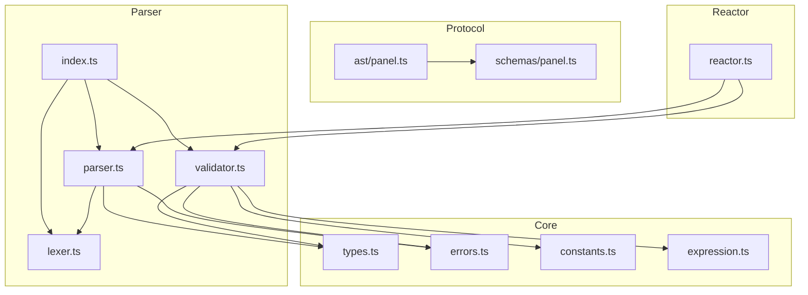
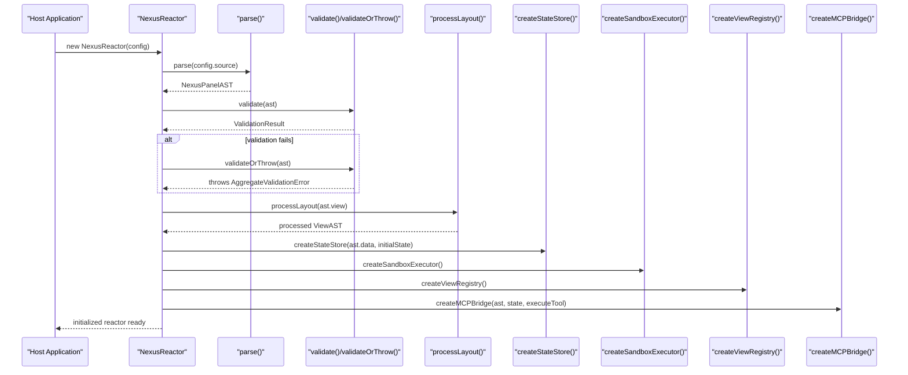
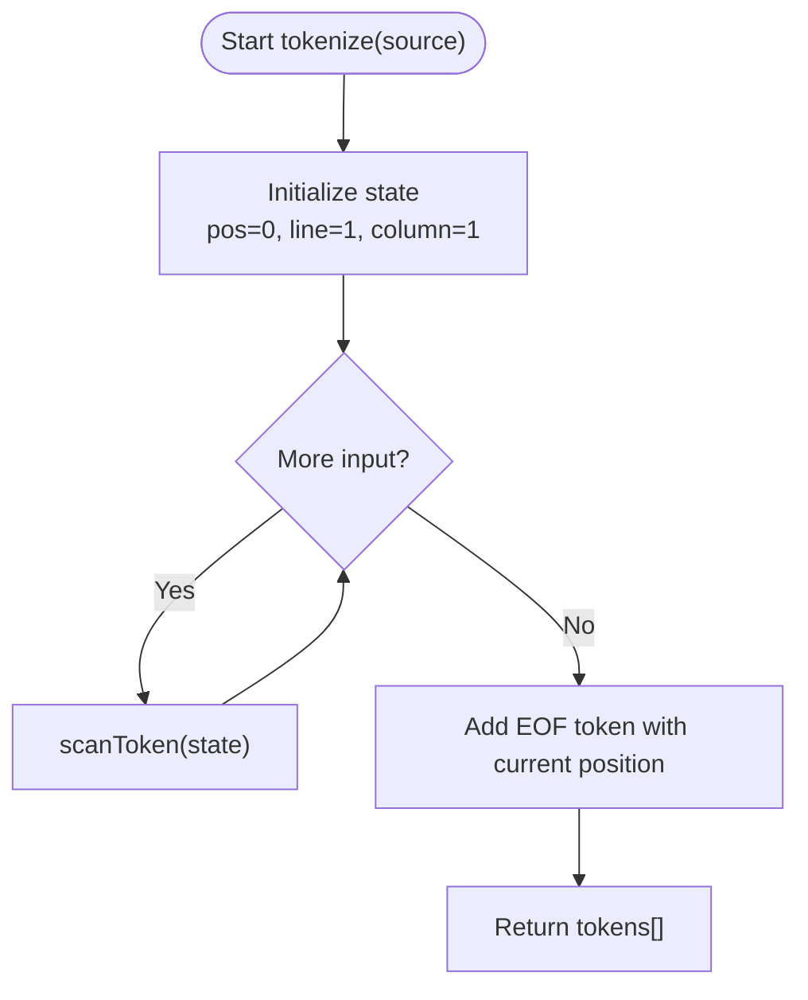
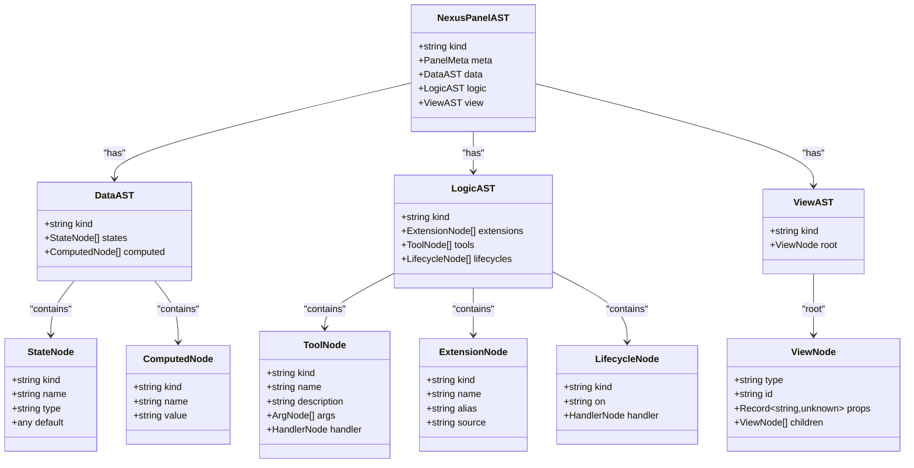
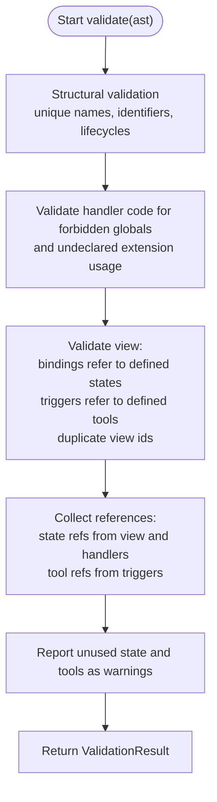
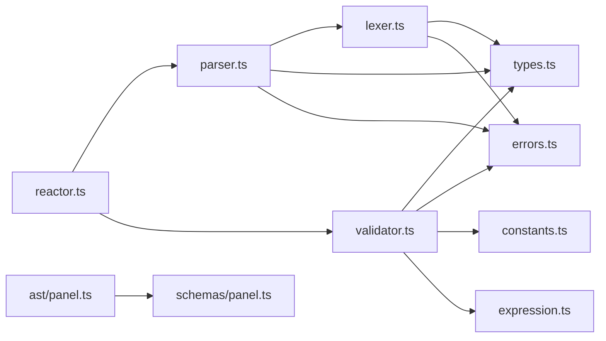

# Parser System

<cite>
**Referenced Files in This Document**
- [lexer.ts](file://packages/nexus-reactor/src/parser/lexer.ts)
- [parser.ts](file://packages/nexus-reactor/src/parser/parser.ts)
- [validator.ts](file://packages/nexus-reactor/src/parser/validator.ts)
- [index.ts](file://packages/nexus-reactor/src/parser/index.ts)
- [types.ts](file://packages/nexus-reactor/src/core/types.ts)
- [errors.ts](file://packages/nexus-reactor/src/core/errors.ts)
- [constants.ts](file://packages/nexus-reactor/src/core/constants.ts)
- [expression.ts](file://packages/nexus-reactor/src/utils/expression.ts)
- [reactor.ts](file://packages/nexus-reactor/src/reactor.ts)
- [panel.ts](file://packages/nexus-protocol/src/ast/panel.ts)
- [panel.ts (schemas)](file://packages/nexus-protocol/src/schemas/panel.ts)
</cite>

## Table of Contents
1. [Introduction](#introduction)
2. [Project Structure](#project-structure)
3. [Core Components](#core-components)
4. [Architecture Overview](#architecture-overview)
5. [Detailed Component Analysis](#detailed-component-analysis)
6. [Dependency Analysis](#dependency-analysis)
7. [Performance Considerations](#performance-considerations)
8. [Troubleshooting Guide](#troubleshooting-guide)
9. [Conclusion](#conclusion)
10. [Appendices](#appendices)

## Introduction
This document describes the Parser System that ingests and validates NXML source code into a structured Abstract Syntax Tree (AST). The system implements a three-stage pipeline:
- Lexing: tokenization with precise source location tracking
- Parsing: construction of the NexusPanelAST
- Validation: schema compliance and cross-reference checks

It also documents how the system integrates with the core reactor initialization flow, how Zod schemas from nexus-protocol are used for structural validation, and how link checks ensure trigger attributes reference valid tools. Guidance is provided for common parsing issues, error handling with source locations, and performance considerations.

## Project Structure
The Parser System resides under packages/nexus-reactor/src/parser and exposes a cohesive API for tokenization, parsing, and validation. It integrates with the core reactor initialization flow and leverages shared types, errors, and constants.

**Diagram sources**
- [index.ts](file://packages/nexus-reactor/src/parser/index.ts#L1-L7)
- [lexer.ts](file://packages/nexus-reactor/src/parser/lexer.ts#L1-L74)
- [parser.ts](file://packages/nexus-reactor/src/parser/parser.ts#L1-L40)
- [validator.ts](file://packages/nexus-reactor/src/parser/validator.ts#L1-L27)
- [types.ts](file://packages/nexus-reactor/src/core/types.ts#L97-L140)
- [errors.ts](file://packages/nexus-reactor/src/core/errors.ts#L72-L120)
- [constants.ts](file://packages/nexus-reactor/src/core/constants.ts#L134-L158)
- [expression.ts](file://packages/nexus-reactor/src/utils/expression.ts#L1-L20)
- [reactor.ts](file://packages/nexus-reactor/src/reactor.ts#L49-L66)
- [panel.ts](file://packages/nexus-protocol/src/ast/panel.ts#L63-L98)
- [panel.ts (schemas)](file://packages/nexus-protocol/src/schemas/panel.ts#L42-L52)

**Section sources**
- [index.ts](file://packages/nexus-reactor/src/parser/index.ts#L1-L7)
- [reactor.ts](file://packages/nexus-reactor/src/reactor.ts#L49-L66)

## Core Components
- Tokenizer (lexer): Converts NXML source into tokens with SourceLocation attached to each token.
- Parser: Consumes tokens to build the NexusPanelAST with metadata, Data, Logic, and View subtrees.
- Validator: Performs structural and cross-reference validation, reporting errors and warnings.

Key outputs:
- NexusPanelAST: The root AST containing meta, data, logic, and view.
- ValidationResult: Aggregated validation result with errors and warnings.

**Section sources**
- [lexer.ts](file://packages/nexus-reactor/src/parser/lexer.ts#L14-L33)
- [parser.ts](file://packages/nexus-reactor/src/parser/parser.ts#L35-L100)
- [validator.ts](file://packages/nexus-reactor/src/parser/validator.ts#L10-L18)

## Architecture Overview
The Parser System participates in the reactor initialization flow as follows:
- The reactor parses NXML source into an AST
- Validates the AST (both quick and full validation)
- Processes layout and initializes state, sandbox, view registry, and MCP bridge

**Diagram sources**
- [reactor.ts](file://packages/nexus-reactor/src/reactor.ts#L49-L96)
- [parser.ts](file://packages/nexus-reactor/src/parser/parser.ts#L35-L40)
- [validator.ts](file://packages/nexus-reactor/src/parser/validator.ts#L10-L27)

## Detailed Component Analysis

### Lexical Analysis (Tokenizer)
The tokenizer transforms NXML source into a stream of tokens, tracking source locations for precise error reporting. It recognizes:
- Tag boundaries: opening, closing, self-closing, and end tags
- Tag names, attribute names, equals signs, and quoted attribute values
- Text content, CDATA sections, and comments
- EOF sentinel

Source location tracking:
- Each Token carries a SourceLocation with startLine/startColumn and endLine/endColumn.
- The lexer computes line/column positions incrementally as it advances through the source.

Common error conditions surfaced with source locations:
- Unexpected tokens
- Unterminated strings
- Unclosed tags

**Diagram sources**
- [lexer.ts](file://packages/nexus-reactor/src/parser/lexer.ts#L53-L74)
- [lexer.ts](file://packages/nexus-reactor/src/parser/lexer.ts#L79-L115)
- [lexer.ts](file://packages/nexus-reactor/src/parser/lexer.ts#L364-L405)

**Section sources**
- [lexer.ts](file://packages/nexus-reactor/src/parser/lexer.ts#L14-L33)
- [lexer.ts](file://packages/nexus-reactor/src/parser/lexer.ts#L53-L74)
- [lexer.ts](file://packages/nexus-reactor/src/parser/lexer.ts#L116-L171)
- [lexer.ts](file://packages/nexus-reactor/src/parser/lexer.ts#L173-L215)
- [lexer.ts](file://packages/nexus-reactor/src/parser/lexer.ts#L217-L247)
- [lexer.ts](file://packages/nexus-reactor/src/parser/lexer.ts#L249-L318)
- [lexer.ts](file://packages/nexus-reactor/src/parser/lexer.ts#L319-L384)
- [lexer.ts](file://packages/nexus-reactor/src/parser/lexer.ts#L386-L405)
- [lexer.ts](file://packages/nexus-reactor/src/parser/lexer.ts#L409-L425)

### Parsing (AST Generation)
The parser consumes tokens to construct the NexusPanelAST. It enforces:
- Root element must be NexusPanel and must not be self-closing
- Exactly one Data, Logic, and View section
- Correct nesting and closing tags
- Attribute parsing and defaulting for Data/Logic/View nodes

Generated AST structure:
- NexusPanelAST: meta, data, logic, view
- DataAST: states and computed nodes
- LogicAST: extensions, tools, lifecycles
- ViewAST: root view node tree

**Diagram sources**
- [parser.ts](file://packages/nexus-reactor/src/parser/parser.ts#L35-L100)
- [parser.ts](file://packages/nexus-reactor/src/parser/parser.ts#L114-L145)
- [parser.ts](file://packages/nexus-reactor/src/parser/parser.ts#L147-L165)
- [parser.ts](file://packages/nexus-reactor/src/parser/parser.ts#L167-L202)
- [parser.ts](file://packages/nexus-reactor/src/parser/parser.ts#L204-L251)
- [parser.ts](file://packages/nexus-reactor/src/parser/parser.ts#L253-L284)
- [parser.ts](file://packages/nexus-reactor/src/parser/parser.ts#L286-L316)
- [parser.ts](file://packages/nexus-reactor/src/parser/parser.ts#L318-L363)
- [parser.ts](file://packages/nexus-reactor/src/parser/parser.ts#L339-L363)

**Section sources**
- [parser.ts](file://packages/nexus-reactor/src/parser/parser.ts#L35-L100)
- [parser.ts](file://packages/nexus-reactor/src/parser/parser.ts#L114-L145)
- [parser.ts](file://packages/nexus-reactor/src/parser/parser.ts#L147-L165)
- [parser.ts](file://packages/nexus-reactor/src/parser/parser.ts#L167-L202)
- [parser.ts](file://packages/nexus-reactor/src/parser/parser.ts#L204-L251)
- [parser.ts](file://packages/nexus-reactor/src/parser/parser.ts#L253-L284)
- [parser.ts](file://packages/nexus-reactor/src/parser/parser.ts#L286-L316)
- [parser.ts](file://packages/nexus-reactor/src/parser/parser.ts#L318-L363)

### Validation (Schema Compliance and Cross-References)
The validator performs two complementary validations:
- Structural validation: uniqueness checks, identifier validity, duplicate names, forbidden globals, and lifecycle constraints
- Cross-reference validation: ensures view bindings reference defined states, triggers reference defined tools, and detects unused state/tool definitions

Link checks:
- Trigger attributes on view nodes must reference a defined tool name
- Binding expressions in props are scanned for state references; references must exist in defined state/computed names
- Scope references ($scope) are validated to ensure they appear within Iterate contexts

Zod schemas from nexus-protocol:
- NexusPanelASTSchema: structural validation of the AST
- NexusPanelASTSchemaStrict: cross-reference validation enforcing that view bindings and triggers reference valid names and that extension usage is declared

**Diagram sources**
- [validator.ts](file://packages/nexus-reactor/src/parser/validator.ts#L10-L18)
- [validator.ts](file://packages/nexus-reactor/src/parser/validator.ts#L29-L49)
- [validator.ts](file://packages/nexus-reactor/src/parser/validator.ts#L51-L86)
- [validator.ts](file://packages/nexus-reactor/src/parser/validator.ts#L88-L103)
- [validator.ts](file://packages/nexus-reactor/src/parser/validator.ts#L104-L141)
- [validator.ts](file://packages/nexus-reactor/src/parser/validator.ts#L142-L171)
- [panel.ts (schemas)](file://packages/nexus-protocol/src/schemas/panel.ts#L42-L52)
- [panel.ts (schemas)](file://packages/nexus-protocol/src/schemas/panel.ts#L57-L95)

**Section sources**
- [validator.ts](file://packages/nexus-reactor/src/parser/validator.ts#L10-L18)
- [validator.ts](file://packages/nexus-reactor/src/parser/validator.ts#L29-L49)
- [validator.ts](file://packages/nexus-reactor/src/parser/validator.ts#L51-L86)
- [validator.ts](file://packages/nexus-reactor/src/parser/validator.ts#L88-L103)
- [validator.ts](file://packages/nexus-reactor/src/parser/validator.ts#L104-L141)
- [validator.ts](file://packages/nexus-reactor/src/parser/validator.ts#L142-L171)
- [panel.ts (schemas)](file://packages/nexus-protocol/src/schemas/panel.ts#L42-L52)
- [panel.ts (schemas)](file://packages/nexus-protocol/src/schemas/panel.ts#L57-L95)

### Error Handling with Source Locations
Both the lexer and parser throw ParseError with SourceLocation attached when encountering malformed input. The validator reports ValidationError with optional SourceLocation and severity. The reactor aggregates validation results and throws an AggregateValidationError when validation fails.

Examples of error scenarios:
- Unexpected token at a specific location
- Unterminated string
- Unknown section in NexusPanel
- Duplicate sections (Data/Logic/View)
- Missing Handler child in Tool/Lifecycle
- Undefined state or tool references
- Invalid scope reference outside Iterate
- Forbidden globals in handler code

**Section sources**
- [lexer.ts](file://packages/nexus-reactor/src/parser/lexer.ts#L136-L147)
- [lexer.ts](file://packages/nexus-reactor/src/parser/lexer.ts#L226-L241)
- [parser.ts](file://packages/nexus-reactor/src/parser/parser.ts#L42-L54)
- [parser.ts](file://packages/nexus-reactor/src/parser/parser.ts#L60-L84)
- [parser.ts](file://packages/nexus-reactor/src/parser/parser.ts#L180-L199)
- [parser.ts](file://packages/nexus-reactor/src/parser/parser.ts#L220-L249)
- [parser.ts](file://packages/nexus-reactor/src/parser/parser.ts#L293-L315)
- [validator.ts](file://packages/nexus-reactor/src/parser/validator.ts#L116-L129)
- [validator.ts](file://packages/nexus-reactor/src/parser/validator.ts#L117-L119)
- [validator.ts](file://packages/nexus-reactor/src/parser/validator.ts#L121-L130)
- [validator.ts](file://packages/nexus-reactor/src/parser/validator.ts#L133-L140)
- [errors.ts](file://packages/nexus-reactor/src/core/errors.ts#L72-L120)
- [reactor.ts](file://packages/nexus-reactor/src/reactor.ts#L58-L66)

### Integration with Reactor Initialization
The reactor orchestrates parsing and validation during initialization:
- Parses NXML source into an AST
- Validates the AST; on failure, throws an AggregateValidationError
- Processes layout, creates state store, sandbox, view registry, and MCP bridge

This ensures the reactor starts only with a valid, consistent AST.

**Section sources**
- [reactor.ts](file://packages/nexus-reactor/src/reactor.ts#L49-L96)

## Dependency Analysis
The Parser System depends on shared core types, errors, constants, and expression utilities. It integrates with the protocol’s Zod schemas for structural validation and produces the NexusPanelAST consumed by the reactor.

**Diagram sources**
- [lexer.ts](file://packages/nexus-reactor/src/parser/lexer.ts#L1-L10)
- [parser.ts](file://packages/nexus-reactor/src/parser/parser.ts#L7-L27)
- [validator.ts](file://packages/nexus-reactor/src/parser/validator.ts#L1-L10)
- [types.ts](file://packages/nexus-reactor/src/core/types.ts#L97-L140)
- [errors.ts](file://packages/nexus-reactor/src/core/errors.ts#L72-L120)
- [constants.ts](file://packages/nexus-reactor/src/core/constants.ts#L134-L158)
- [expression.ts](file://packages/nexus-reactor/src/utils/expression.ts#L1-L20)
- [reactor.ts](file://packages/nexus-reactor/src/reactor.ts#L49-L66)
- [panel.ts](file://packages/nexus-protocol/src/ast/panel.ts#L63-L98)
- [panel.ts (schemas)](file://packages/nexus-protocol/src/schemas/panel.ts#L42-L52)

**Section sources**
- [index.ts](file://packages/nexus-reactor/src/parser/index.ts#L1-L7)
- [types.ts](file://packages/nexus-reactor/src/core/types.ts#L97-L140)
- [errors.ts](file://packages/nexus-reactor/src/core/errors.ts#L72-L120)
- [constants.ts](file://packages/nexus-reactor/src/core/constants.ts#L134-L158)
- [expression.ts](file://packages/nexus-reactor/src/utils/expression.ts#L1-L20)
- [reactor.ts](file://packages/nexus-reactor/src/reactor.ts#L49-L66)
- [panel.ts](file://packages/nexus-protocol/src/ast/panel.ts#L63-L98)
- [panel.ts (schemas)](file://packages/nexus-protocol/src/schemas/panel.ts#L42-L52)

## Performance Considerations
- Parsing latency: The tokenizer and parser are linear-time with respect to source length. For large NXML panels, consider:
  - Minimizing unnecessary whitespace/comments in source
  - Avoiding excessive nested view structures
  - Using CDATA sparingly for large inline code blocks
- Validation overhead: Structural validation is O(n) over AST nodes; cross-reference checks are O(n) plus scanning expressions. To reduce latency:
  - Prefer validateQuick for fast feedback during development
  - Use validateOrThrow only when strictness is required
  - Consider precompilation of handlers (see migration strategy) to speed up runtime execution
- Memory: Tokens and AST are held in memory during initialization; ensure source is not excessively large

[No sources needed since this section provides general guidance]

## Troubleshooting Guide
Common parsing issues and resolutions:
- Malformed XML
  - Symptoms: ParseError with unexpected token or unclosed tag
  - Resolution: Ensure all tags are properly closed and balanced; check quotes around attribute values
  - See error handling paths in lexer and parser
- Invalid state references
  - Symptoms: Validation error indicating undefined state reference in view bindings
  - Resolution: Define the referenced state/computed or correct the binding expression
- Missing tool definitions
  - Symptoms: Validation error indicating undefined tool reference in trigger attributes
  - Resolution: Define the tool and ensure the trigger attribute matches the tool name
- Invalid scope reference
  - Symptoms: Validation error indicating $scope used outside Iterate context
  - Resolution: Move scoped references inside Iterate components
- Forbidden globals in handler code
  - Symptoms: Validation error indicating forbidden global usage
  - Resolution: Remove or replace forbidden globals; use provided APIs instead
- Duplicate names
  - Symptoms: Validation errors for duplicate state, tool, view id, extension alias, or lifecycle
  - Resolution: Rename duplicates to unique identifiers

Where to look:
- Parse errors and messages are thrown by the lexer and parser with SourceLocation
- Validation errors and warnings are aggregated and can be converted to AggregateValidationError

**Section sources**
- [lexer.ts](file://packages/nexus-reactor/src/parser/lexer.ts#L136-L147)
- [lexer.ts](file://packages/nexus-reactor/src/parser/lexer.ts#L226-L241)
- [parser.ts](file://packages/nexus-reactor/src/parser/parser.ts#L42-L54)
- [parser.ts](file://packages/nexus-reactor/src/parser/parser.ts#L60-L84)
- [validator.ts](file://packages/nexus-reactor/src/parser/validator.ts#L116-L129)
- [validator.ts](file://packages/nexus-reactor/src/parser/validator.ts#L117-L119)
- [validator.ts](file://packages/nexus-reactor/src/parser/validator.ts#L121-L130)
- [errors.ts](file://packages/nexus-reactor/src/core/errors.ts#L72-L120)
- [reactor.ts](file://packages/nexus-reactor/src/reactor.ts#L58-L66)

## Conclusion
The Parser System provides a robust, source-location-aware pipeline that converts NXML into a validated NexusPanelAST. It integrates tightly with the reactor initialization flow, leveraging shared types and errors, and uses Zod schemas for structural validation alongside cross-reference checks. The system surfaces actionable errors with precise locations and offers practical guidance for common issues, enabling reliable and maintainable panel definitions.

[No sources needed since this section summarizes without analyzing specific files]

## Appendices

### API Surface and Usage
- Exported symbols from the parser module:
  - tokenize, Token, TokenType
  - parse
  - validate, validateOrThrow, validateQuick
  - getToolNames, getStateNames, findTool, findState

These are re-exported from the parser index and used by the reactor.

**Section sources**
- [index.ts](file://packages/nexus-reactor/src/parser/index.ts#L1-L7)
- [reactor.ts](file://packages/nexus-reactor/src/reactor.ts#L49-L66)

### Generated NexusPanelAST Structure
- Root: NexusPanelAST with meta, data, logic, view
- Data: DataAST with states and computed
- Logic: LogicAST with extensions, tools, lifecycles
- View: ViewAST with a single root ViewNode and children

**Section sources**
- [parser.ts](file://packages/nexus-reactor/src/parser/parser.ts#L35-L100)
- [parser.ts](file://packages/nexus-reactor/src/parser/parser.ts#L114-L145)
- [parser.ts](file://packages/nexus-reactor/src/parser/parser.ts#L167-L202)
- [parser.ts](file://packages/nexus-reactor/src/parser/parser.ts#L318-L363)
- [panel.ts](file://packages/nexus-protocol/src/ast/panel.ts#L63-L98)