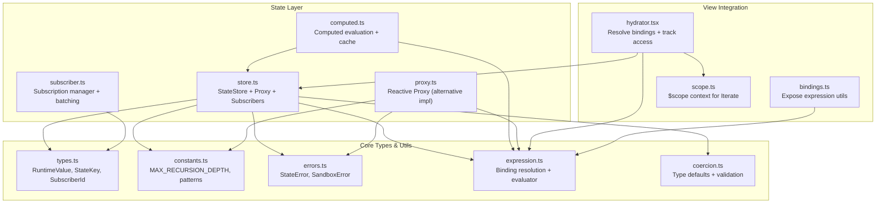
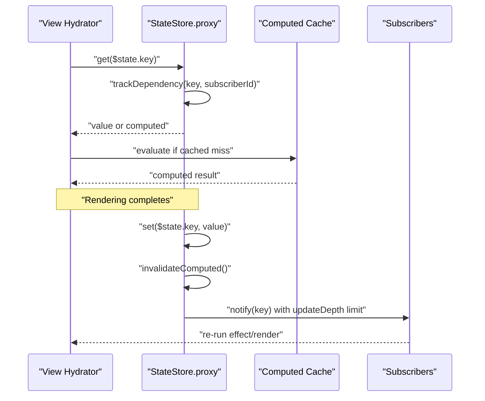
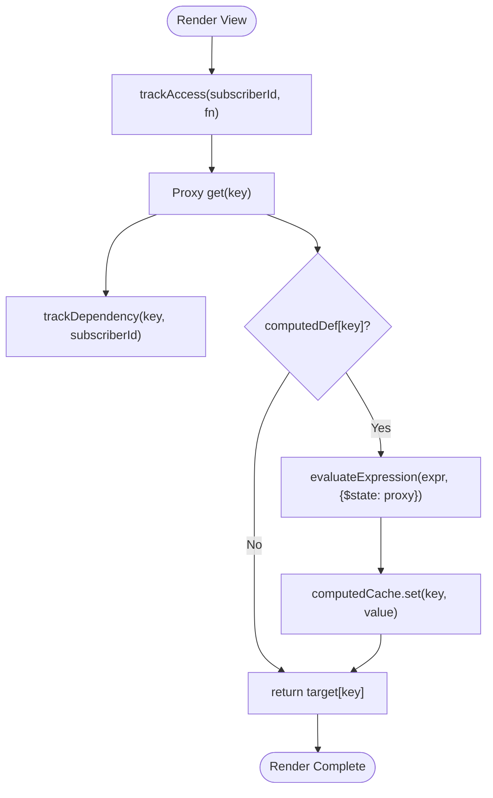
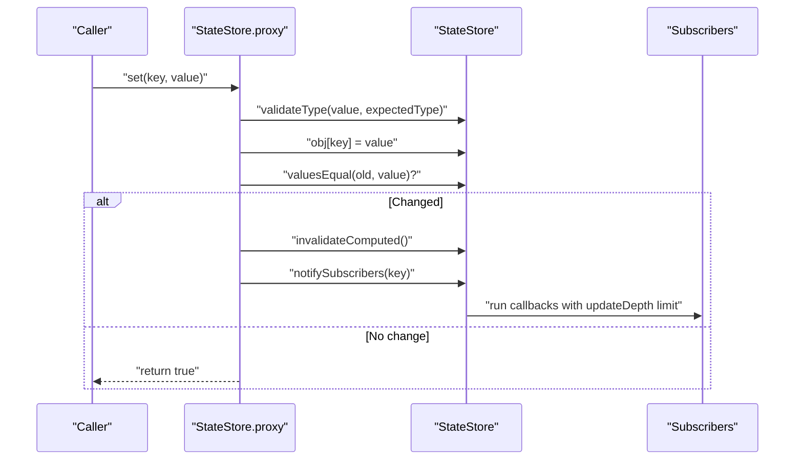
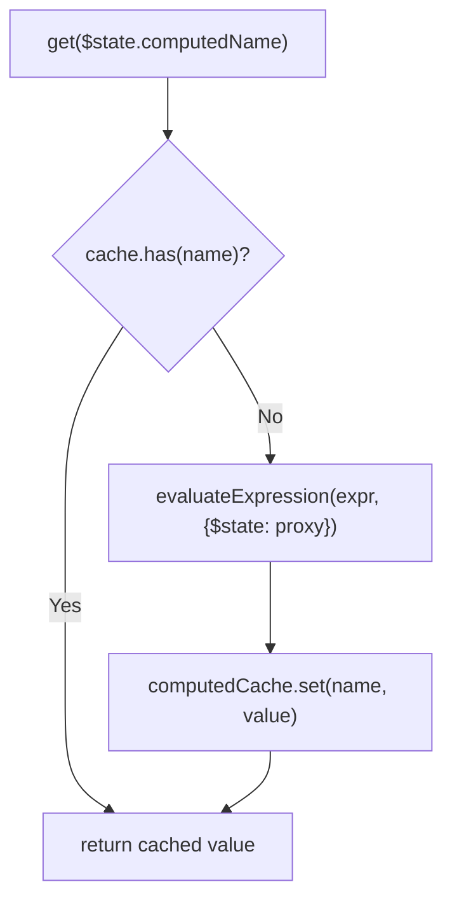
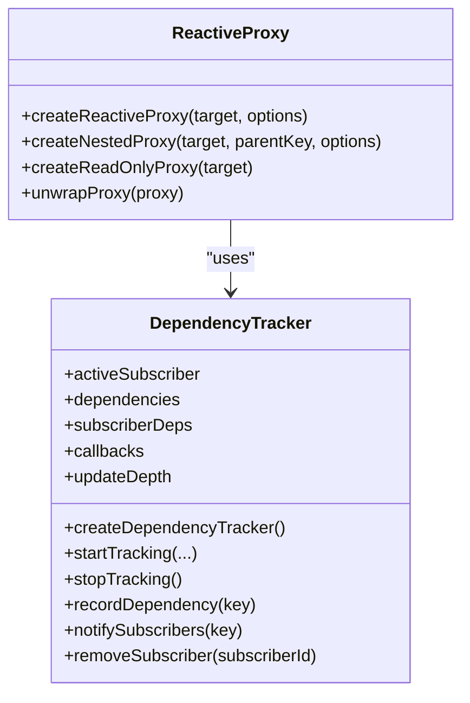
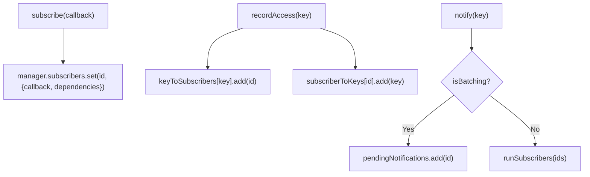
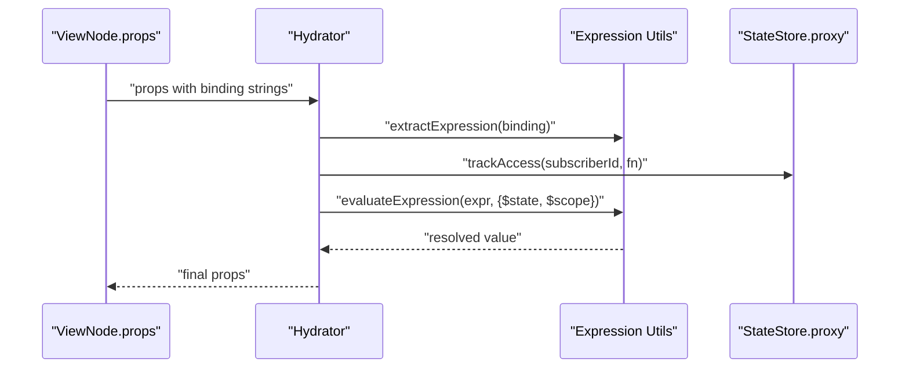
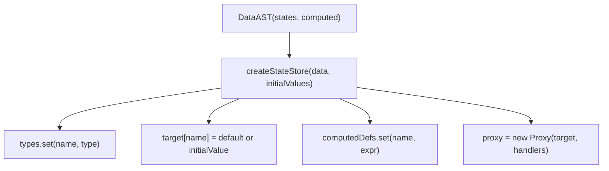
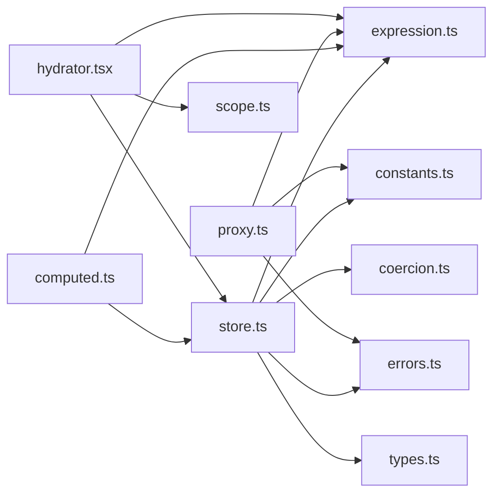

# Reactive State System

<cite>
**Referenced Files in This Document**
- [store.ts](file://packages/nexus-reactor/src/state/store.ts)
- [computed.ts](file://packages/nexus-reactor/src/state/computed.ts)
- [subscriber.ts](file://packages/nexus-reactor/src/state/subscriber.ts)
- [proxy.ts](file://packages/nexus-reactor/src/state/proxy.ts)
- [types.ts](file://packages/nexus-reactor/src/core/types.ts)
- [constants.ts](file://packages/nexus-reactor/src/core/constants.ts)
- [errors.ts](file://packages/nexus-reactor/src/core/errors.ts)
- [expression.ts](file://packages/nexus-reactor/src/utils/expression.ts)
- [coercion.ts](file://packages/nexus-reactor/src/utils/coercion.ts)
- [bindings.ts](file://packages/nexus-reactor/src/view/bindings.ts)
- [scope.ts](file://packages/nexus-reactor/src/view/scope.ts)
- [hydrator.tsx](file://packages/nexus-reactor/src/view/hydrator.tsx)
- [README.md](file://packages/nexus-reactor/README.md)
- [01_protocol_spec.md](file://docs/01_protocol_spec.md)
</cite>

## Table of Contents
1. [Introduction](#introduction)
2. [Project Structure](#project-structure)
3. [Core Components](#core-components)
4. [Architecture Overview](#architecture-overview)
5. [Detailed Component Analysis](#detailed-component-analysis)
6. [Dependency Analysis](#dependency-analysis)
7. [Performance Considerations](#performance-considerations)
8. [Troubleshooting Guide](#troubleshooting-guide)
9. [Conclusion](#conclusion)
10. [Appendices](#appendices)

## Introduction
This document explains the Reactive State System that powers fine-grained reactivity using JavaScript Proxies. It covers the StateStore architecture, dependency tracking during rendering and computed evaluation, update propagation, computed value management, and practical usage patterns for initializing state from NXML, reactive bindings in views, and computed definitions. It also addresses common pitfalls such as infinite loops, recursion depth limits, and performance optimization through selective reactivity.

## Project Structure
The reactive state system lives primarily under packages/nexus-reactor/src/state and integrates with view hydration and expression utilities.



**Diagram sources**
- [store.ts](file://packages/nexus-reactor/src/state/store.ts#L1-L255)
- [computed.ts](file://packages/nexus-reactor/src/state/computed.ts#L1-L96)
- [subscriber.ts](file://packages/nexus-reactor/src/state/subscriber.ts#L1-L351)
- [proxy.ts](file://packages/nexus-reactor/src/state/proxy.ts#L1-L393)
- [types.ts](file://packages/nexus-reactor/src/core/types.ts#L1-L446)
- [constants.ts](file://packages/nexus-reactor/src/core/constants.ts#L1-L283)
- [errors.ts](file://packages/nexus-reactor/src/core/errors.ts#L1-L367)
- [expression.ts](file://packages/nexus-reactor/src/utils/expression.ts#L1-L255)
- [coercion.ts](file://packages/nexus-reactor/src/utils/coercion.ts#L1-L284)
- [bindings.ts](file://packages/nexus-reactor/src/view/bindings.ts#L1-L27)
- [scope.ts](file://packages/nexus-reactor/src/view/scope.ts#L1-L120)
- [hydrator.tsx](file://packages/nexus-reactor/src/view/hydrator.tsx#L115-L157)

**Section sources**
- [store.ts](file://packages/nexus-reactor/src/state/store.ts#L1-L255)
- [types.ts](file://packages/nexus-reactor/src/core/types.ts#L1-L120)
- [constants.ts](file://packages/nexus-reactor/src/core/constants.ts#L120-L130)

## Core Components
- StateStore: central reactive store with a Proxy target, computed definitions/cache, subscribers, and update depth protection.
- Computed: lazy evaluation, caching, and read-only execution context for computed values.
- Subscription Manager: dependency tracking, batching, and subscriber lifecycle.
- Reactive Proxy (alternative): a reusable reactive proxy with onGet/onSet hooks and read-only mode.
- View Hydration: resolves bindings, tracks access, and renders components reactively.

**Section sources**
- [store.ts](file://packages/nexus-reactor/src/state/store.ts#L13-L57)
- [computed.ts](file://packages/nexus-reactor/src/state/computed.ts#L1-L96)
- [subscriber.ts](file://packages/nexus-reactor/src/state/subscriber.ts#L1-L120)
- [proxy.ts](file://packages/nexus-reactor/src/state/proxy.ts#L1-L120)
- [hydrator.tsx](file://packages/nexus-reactor/src/view/hydrator.tsx#L115-L157)

## Architecture Overview
The system uses JavaScript Proxies to intercept state reads/writes and build a dependency graph. During rendering, the hydrator tracks which state keys a component’s bindings read. When state changes, the system notifies only affected subscribers, invalidates computed caches, and batches updates to prevent infinite loops and excessive re-renders.



**Diagram sources**
- [store.ts](file://packages/nexus-reactor/src/state/store.ts#L59-L120)
- [store.ts](file://packages/nexus-reactor/src/state/store.ts#L152-L170)
- [store.ts](file://packages/nexus-reactor/src/state/store.ts#L179-L202)
- [computed.ts](file://packages/nexus-reactor/src/state/computed.ts#L15-L38)
- [subscriber.ts](file://packages/nexus-reactor/src/state/subscriber.ts#L146-L183)
- [hydrator.tsx](file://packages/nexus-reactor/src/view/hydrator.tsx#L115-L157)

## Detailed Component Analysis

### StateStore: Proxy, Target, Subscribers, and Computed Management
- Proxy target holds runtime values; the Proxy wraps reads/writes to enable dependency tracking and nested proxies.
- Computed definitions are registered from NXML; computed values are lazily evaluated and cached.
- Subscribers map state keys to subscriber IDs; update depth prevents infinite loops.
- Type validation ensures writes conform to declared NXML types.

```mermaid
classDiagram
class StateStore {
+proxy : Record<string, RuntimeValue>
+target : Record<string, RuntimeValue>
+types : Map<string, NXMLPrimitiveType>
+computedDefs : Map<string, string>
+computedCache : Map<string, RuntimeValue>
+subscribers : Map<StateKey, Set<SubscriberId>>
+subscriberCallbacks : Map<SubscriberId, () => void>
+currentSubscriber : SubscriberId | null
+updateDepth : number
+createStateStore(data, initialValues)
+subscribe(callback, id?)
+unsubscribe(subscriberId)
+setState(values)
+getSnapshot()
+trackAccess(subscriberId, fn)
}
```

**Diagram sources**
- [store.ts](file://packages/nexus-reactor/src/state/store.ts#L13-L57)
- [store.ts](file://packages/nexus-reactor/src/state/store.ts#L224-L255)

**Section sources**
- [store.ts](file://packages/nexus-reactor/src/state/store.ts#L25-L57)
- [store.ts](file://packages/nexus-reactor/src/state/store.ts#L59-L120)
- [store.ts](file://packages/nexus-reactor/src/state/store.ts#L152-L202)
- [store.ts](file://packages/nexus-reactor/src/state/store.ts#L224-L255)

### Dependency Tracking During Rendering and Computed Evaluation
- During hydration, the hydrator invokes a tracked function around binding resolution. The proxy records dependencies from the current subscriber ID.
- Computed evaluation occurs with a read-only context to prevent mutations; results are cached by name.



**Diagram sources**
- [hydrator.tsx](file://packages/nexus-reactor/src/view/hydrator.tsx#L115-L157)
- [store.ts](file://packages/nexus-reactor/src/state/store.ts#L59-L82)
- [computed.ts](file://packages/nexus-reactor/src/state/computed.ts#L15-L38)

**Section sources**
- [hydrator.tsx](file://packages/nexus-reactor/src/view/hydrator.tsx#L115-L157)
- [store.ts](file://packages/nexus-reactor/src/state/store.ts#L59-L82)
- [computed.ts](file://packages/nexus-reactor/src/state/computed.ts#L15-L38)

### Update Propagation: Type Validation, Mutation, and Notification
- On write, the proxy validates type against declared NXML types, sets the value, and compares with the old value.
- If changed, computed cache is invalidated and subscribers are notified with an update depth guard to prevent infinite loops.



**Diagram sources**
- [store.ts](file://packages/nexus-reactor/src/state/store.ts#L84-L109)
- [store.ts](file://packages/nexus-reactor/src/state/store.ts#L168-L202)
- [coercion.ts](file://packages/nexus-reactor/src/utils/coercion.ts#L193-L218)

**Section sources**
- [store.ts](file://packages/nexus-reactor/src/state/store.ts#L84-L109)
- [store.ts](file://packages/nexus-reactor/src/state/store.ts#L168-L202)
- [coercion.ts](file://packages/nexus-reactor/src/utils/coercion.ts#L193-L218)

### Computed Values: Lazy Evaluation, Caching, and Read-Only Execution
- Computed definitions are stored by name with expression strings.
- On first access, the expression is evaluated with $state in a read-only context and result is cached.
- Cache is invalidated on any state change; callers can force recompute if needed.



**Diagram sources**
- [computed.ts](file://packages/nexus-reactor/src/state/computed.ts#L15-L38)
- [store.ts](file://packages/nexus-reactor/src/state/store.ts#L152-L170)

**Section sources**
- [computed.ts](file://packages/nexus-reactor/src/state/computed.ts#L1-L96)
- [store.ts](file://packages/nexus-reactor/src/state/store.ts#L152-L170)

### Reactive Proxy (Alternative Implementation)
- Provides a reusable reactive proxy with onGet/onSet hooks, nested proxy wrapping, and read-only mode for computed contexts.
- Includes dependency tracking helpers and a notifier with recursion depth protection.



**Diagram sources**
- [proxy.ts](file://packages/nexus-reactor/src/state/proxy.ts#L1-L145)
- [proxy.ts](file://packages/nexus-reactor/src/state/proxy.ts#L166-L323)

**Section sources**
- [proxy.ts](file://packages/nexus-reactor/src/state/proxy.ts#L1-L145)
- [proxy.ts](file://packages/nexus-reactor/src/state/proxy.ts#L166-L323)

### Subscription Management and Batching
- Subscriptions map keys to subscribers and vice versa; supports batching to coalesce notifications.
- Effects can be created to run immediately and re-run when dependencies change.



**Diagram sources**
- [subscriber.ts](file://packages/nexus-reactor/src/state/subscriber.ts#L1-L120)
- [subscriber.ts](file://packages/nexus-reactor/src/state/subscriber.ts#L146-L207)

**Section sources**
- [subscriber.ts](file://packages/nexus-reactor/src/state/subscriber.ts#L1-L120)
- [subscriber.ts](file://packages/nexus-reactor/src/state/subscriber.ts#L146-L207)

### Reactive Binding in Views
- View hydration resolves binding expressions with $state and $scope, tracks access, and merges transient props.
- Two-way bindings (e.g., Input bind) integrate with state updates.



**Diagram sources**
- [hydrator.tsx](file://packages/nexus-reactor/src/view/hydrator.tsx#L115-L157)
- [bindings.ts](file://packages/nexus-reactor/src/view/bindings.ts#L1-L27)
- [expression.ts](file://packages/nexus-reactor/src/utils/expression.ts#L76-L120)
- [scope.ts](file://packages/nexus-reactor/src/view/scope.ts#L1-L120)

**Section sources**
- [hydrator.tsx](file://packages/nexus-reactor/src/view/hydrator.tsx#L115-L157)
- [bindings.ts](file://packages/nexus-reactor/src/view/bindings.ts#L1-L27)
- [expression.ts](file://packages/nexus-reactor/src/utils/expression.ts#L76-L120)
- [scope.ts](file://packages/nexus-reactor/src/view/scope.ts#L1-L120)

### State Initialization from NXML
- The store is created from a DataAST with State and Computed nodes. Defaults and types are derived from NXML; initial values can be provided.
- Computed definitions are registered for lazy evaluation.



**Diagram sources**
- [store.ts](file://packages/nexus-reactor/src/state/store.ts#L25-L57)
- [coercion.ts](file://packages/nexus-reactor/src/utils/coercion.ts#L10-L28)
- [01_protocol_spec.md](file://docs/01_protocol_spec.md#L127-L163)

**Section sources**
- [store.ts](file://packages/nexus-reactor/src/state/store.ts#L25-L57)
- [coercion.ts](file://packages/nexus-reactor/src/utils/coercion.ts#L10-L28)
- [01_protocol_spec.md](file://docs/01_protocol_spec.md#L127-L163)

## Dependency Analysis
- Coupling: StateStore depends on expression evaluation, coercion, and error types. Computed relies on expression evaluation and the store’s proxy.
- Cohesion: Each module encapsulates a distinct concern—store, computed, subscriptions, and proxy—while sharing core types and constants.
- External dependencies: Uses JavaScript Proxy APIs and Function constructor for expression evaluation; guarded by constants and error types.



**Diagram sources**
- [store.ts](file://packages/nexus-reactor/src/state/store.ts#L1-L255)
- [computed.ts](file://packages/nexus-reactor/src/state/computed.ts#L1-L96)
- [proxy.ts](file://packages/nexus-reactor/src/state/proxy.ts#L1-L393)
- [expression.ts](file://packages/nexus-reactor/src/utils/expression.ts#L1-L255)
- [coercion.ts](file://packages/nexus-reactor/src/utils/coercion.ts#L1-L284)
- [types.ts](file://packages/nexus-reactor/src/core/types.ts#L1-L446)
- [constants.ts](file://packages/nexus-reactor/src/core/constants.ts#L1-L283)
- [errors.ts](file://packages/nexus-reactor/src/core/errors.ts#L1-L367)
- [scope.ts](file://packages/nexus-reactor/src/view/scope.ts#L1-L120)
- [hydrator.tsx](file://packages/nexus-reactor/src/view/hydrator.tsx#L115-L157)

**Section sources**
- [store.ts](file://packages/nexus-reactor/src/state/store.ts#L1-L255)
- [computed.ts](file://packages/nexus-reactor/src/state/computed.ts#L1-L96)
- [proxy.ts](file://packages/nexus-reactor/src/state/proxy.ts#L1-L393)
- [expression.ts](file://packages/nexus-reactor/src/utils/expression.ts#L1-L255)
- [coercion.ts](file://packages/nexus-reactor/src/utils/coercion.ts#L1-L284)
- [types.ts](file://packages/nexus-reactor/src/core/types.ts#L1-L446)
- [constants.ts](file://packages/nexus-reactor/src/core/constants.ts#L1-L283)
- [errors.ts](file://packages/nexus-reactor/src/core/errors.ts#L1-L367)
- [scope.ts](file://packages/nexus-reactor/src/view/scope.ts#L1-L120)
- [hydrator.tsx](file://packages/nexus-reactor/src/view/hydrator.tsx#L115-L157)

## Performance Considerations
- Fine-grained notifications: Only subscribers depending on a changed key are notified, minimizing unnecessary re-renders.
- Computed caching: Computed values are cached by name; cache is invalidated on any state change to ensure correctness.
- Nested proxies: Nested objects/arrays are proxied on demand; deep wrapping avoids overhead for unchanged subtrees.
- Batching: Subscription manager supports batching to coalesce multiple updates into a single pass.
- Equality checks: Shallow/JSON-based equality for complex values reduces unnecessary recomputation when values are equal.

[No sources needed since this section provides general guidance]

## Troubleshooting Guide
- Infinite loops and recursion depth:
  - The system enforces a maximum update depth to detect potential infinite loops. Exceeding the limit throws an error.
  - Alternative reactive proxy implementation uses a recursion depth constant and throws a sandbox error on limit exceeded.
- Type mismatches:
  - Writes are validated against declared NXML types; mismatches produce a state error indicating expected vs. received type.
- Computed writes:
  - Attempting to write to computed values throws a read-only computed error.
- Subscriber errors:
  - Errors inside subscriber callbacks are caught and logged; the system continues notifying other subscribers.

**Section sources**
- [store.ts](file://packages/nexus-reactor/src/state/store.ts#L179-L202)
- [constants.ts](file://packages/nexus-reactor/src/core/constants.ts#L120-L129)
- [proxy.ts](file://packages/nexus-reactor/src/state/proxy.ts#L112-L144)
- [errors.ts](file://packages/nexus-reactor/src/core/errors.ts#L243-L283)

## Conclusion
The Reactive State System combines JavaScript Proxies, dependency tracking, and computed caching to deliver fine-grained, efficient reactivity. It integrates tightly with view hydration to resolve bindings and manage scope, while enforcing type safety and preventing infinite loops. By leveraging batching and selective notifications, it scales to complex UIs with minimal overhead.

[No sources needed since this section summarizes without analyzing specific files]

## Appendices

### Practical Usage Patterns
- State initialization from NXML:
  - Create a store from a DataAST with State and Computed nodes; provide initial values if needed.
  - See [README.md](file://packages/nexus-reactor/README.md#L290-L326) and [01_protocol_spec.md](file://docs/01_protocol_spec.md#L127-L163).
- Reactive binding in views:
  - Use binding expressions like "{$state.key}" and "{$scope.item.name}" in props; hydrator resolves them during render.
  - See [hydrator.tsx](file://packages/nexus-reactor/src/view/hydrator.tsx#L115-L157) and [bindings.ts](file://packages/nexus-reactor/src/view/bindings.ts#L1-L27).
- Computed value definitions:
  - Define computed values in NXML Data section; they are lazily evaluated and cached.
  - See [computed.ts](file://packages/nexus-reactor/src/state/computed.ts#L1-L96) and [01_protocol_spec.md](file://docs/01_protocol_spec.md#L127-L163).

**Section sources**
- [README.md](file://packages/nexus-reactor/README.md#L290-L326)
- [01_protocol_spec.md](file://docs/01_protocol_spec.md#L127-L163)
- [hydrator.tsx](file://packages/nexus-reactor/src/view/hydrator.tsx#L115-L157)
- [bindings.ts](file://packages/nexus-reactor/src/view/bindings.ts#L1-L27)
- [computed.ts](file://packages/nexus-reactor/src/state/computed.ts#L1-L96)