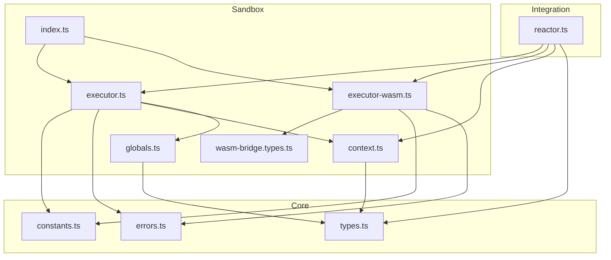
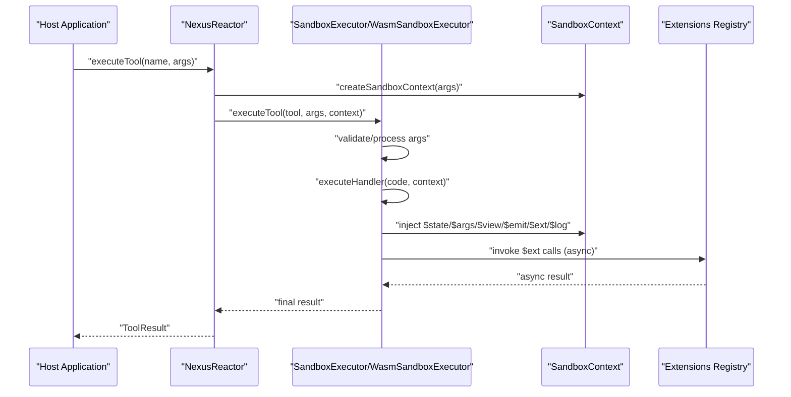
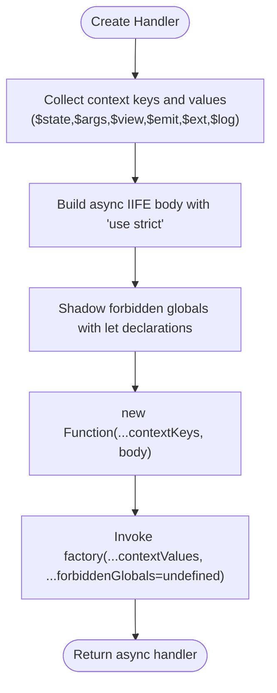
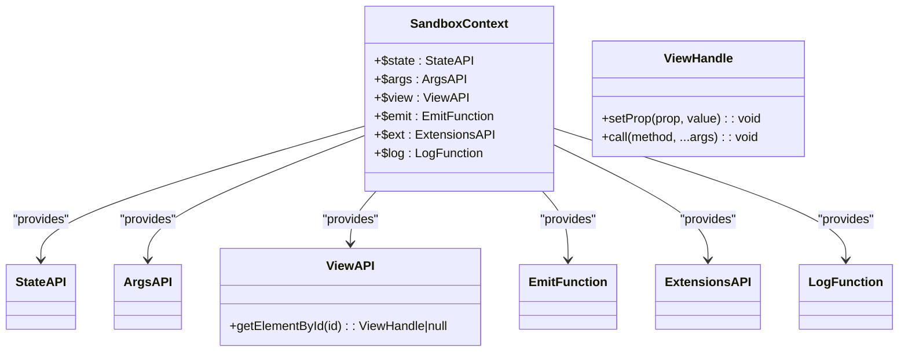
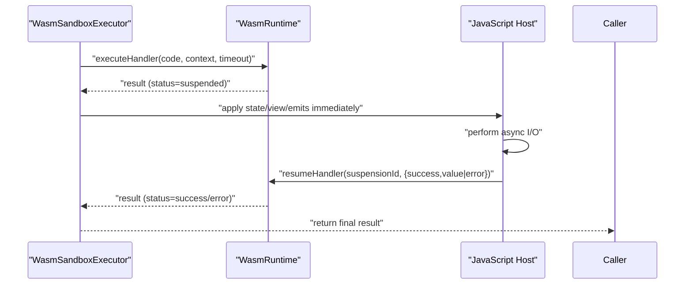
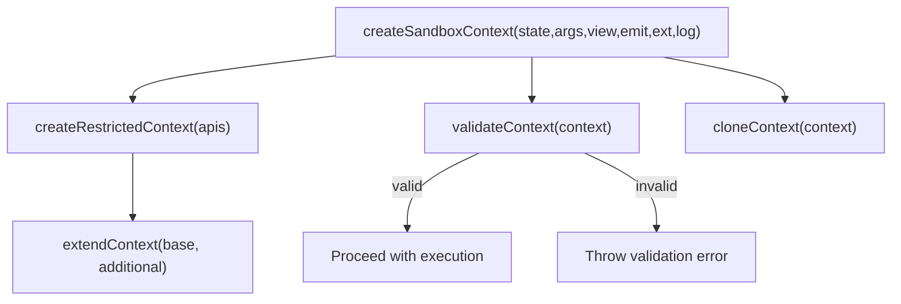
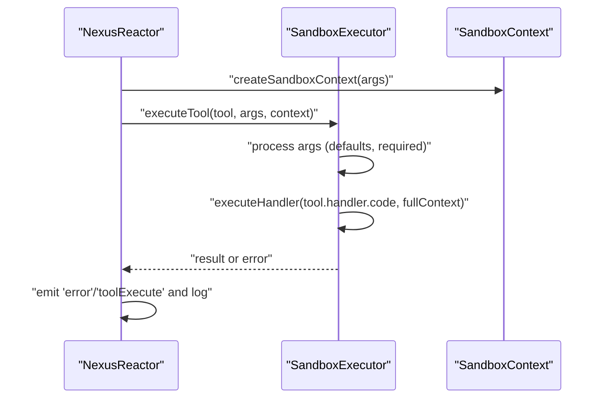
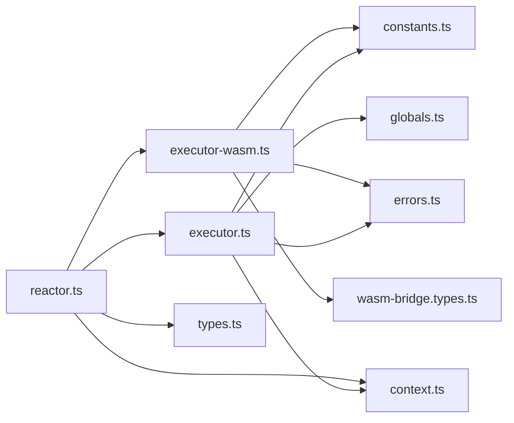

# Sandbox Execution

<cite>
**Referenced Files in This Document**
- [index.ts](file://packages/nexus-reactor/src/sandbox/index.ts)
- [context.ts](file://packages/nexus-reactor/src/sandbox/context.ts)
- [executor.ts](file://packages/nexus-reactor/src/sandbox/executor.ts)
- [globals.ts](file://packages/nexus-reactor/src/sandbox/globals.ts)
- [executor-wasm.ts](file://packages/nexus-reactor/src/sandbox/executor-wasm.ts)
- [wasm-bridge.types.ts](file://packages/nexus-reactor/src/sandbox/wasm-bridge.types.ts)
- [constants.ts](file://packages/nexus-reactor/src/core/constants.ts)
- [types.ts](file://packages/nexus-reactor/src/core/types.ts)
- [errors.ts](file://packages/nexus-reactor/src/core/errors.ts)
- [reactor.ts](file://packages/nexus-reactor/src/reactor.ts)
</cite>

## Table of Contents
1. [Introduction](#introduction)
2. [Project Structure](#project-structure)
3. [Core Components](#core-components)
4. [Architecture Overview](#architecture-overview)
5. [Detailed Component Analysis](#detailed-component-analysis)
6. [Dependency Analysis](#dependency-analysis)
7. [Performance Considerations](#performance-considerations)
8. [Troubleshooting Guide](#troubleshooting-guide)
9. [Conclusion](#conclusion)
10. [Appendices](#appendices)

## Introduction
This document explains the Sandbox Execution system that securely runs logic handlers in an isolated environment. It covers the security model using a Function constructor with a shadowing mechanism to block forbidden globals, the injected sandbox API ($state, $args, $view, $emit, $ext, $log), the async handler implementation via an async IIFE wrapper, and practical examples for handler execution, context creation, and error handling. It also addresses common security concerns, performance implications, debugging techniques, and integration with tool execution and lifecycle hooks.

## Project Structure
The sandbox execution system spans several modules:
- Sandbox entry and exports: exposes executors and types
- Context utilities: create, extend, validate, and clone sandbox contexts
- Executor: JavaScript-based sandbox using Function constructor and Proxy mask
- WASM executor: Rust-backed sandbox with true isolation and async I/O suspension/resume
- Globals and types: typed definitions for the sandbox API and capabilities
- Core constants and types: forbidden globals list, timeouts, and shared types
- Reactor integration: mounting/unmounting lifecycle hooks and tool execution orchestration

**Diagram sources**
- [index.ts](file://packages/nexus-reactor/src/sandbox/index.ts#L1-L34)
- [context.ts](file://packages/nexus-reactor/src/sandbox/context.ts#L1-L113)
- [executor.ts](file://packages/nexus-reactor/src/sandbox/executor.ts#L1-L161)
- [globals.ts](file://packages/nexus-reactor/src/sandbox/globals.ts#L1-L149)
- [executor-wasm.ts](file://packages/nexus-reactor/src/sandbox/executor-wasm.ts#L1-L397)
- [wasm-bridge.types.ts](file://packages/nexus-reactor/src/sandbox/wasm-bridge.types.ts#L1-L332)
- [constants.ts](file://packages/nexus-reactor/src/core/constants.ts#L67-L113)
- [types.ts](file://packages/nexus-reactor/src/core/types.ts#L273-L314)
- [errors.ts](file://packages/nexus-reactor/src/core/errors.ts#L196-L241)
- [reactor.ts](file://packages/nexus-reactor/src/reactor.ts#L1-L260)

**Section sources**
- [index.ts](file://packages/nexus-reactor/src/sandbox/index.ts#L1-L34)
- [reactor.ts](file://packages/nexus-reactor/src/reactor.ts#L1-L260)

## Core Components
- SandboxExecutor (JavaScript): wraps handler code in an async IIFE, shadows forbidden globals, and executes in a controlled context
- WasmSandboxExecutor (Rust/N-API): compiles and runs handlers in WasmEdge with true sandboxing, supports capability tokens, and handles async suspension/resume
- SandboxContext: injects $state, $args, $view, $emit, $ext, $log into handlers
- Globals and types: define the shape and documentation of sandbox globals and capability tokens
- Reactor integration: mounts/unmounts lifecycle hooks and executes tools with validated arguments

**Section sources**
- [executor.ts](file://packages/nexus-reactor/src/sandbox/executor.ts#L12-L161)
- [executor-wasm.ts](file://packages/nexus-reactor/src/sandbox/executor-wasm.ts#L45-L201)
- [context.ts](file://packages/nexus-reactor/src/sandbox/context.ts#L12-L113)
- [globals.ts](file://packages/nexus-reactor/src/sandbox/globals.ts#L13-L114)
- [types.ts](file://packages/nexus-reactor/src/core/types.ts#L273-L314)
- [reactor.ts](file://packages/nexus-reactor/src/reactor.ts#L98-L179)

## Architecture Overview
The system provides two execution paths:
- JavaScript sandbox: fast, suitable for trusted environments; uses Function constructor and a shadowing technique to block forbidden globals
- WASM sandbox: strong isolation, capability-based permissions, and robust async I/O suspension/resume

**Diagram sources**
- [reactor.ts](file://packages/nexus-reactor/src/reactor.ts#L144-L179)
- [executor.ts](file://packages/nexus-reactor/src/sandbox/executor.ts#L37-L67)
- [executor-wasm.ts](file://packages/nexus-reactor/src/sandbox/executor-wasm.ts#L203-L238)
- [context.ts](file://packages/nexus-reactor/src/sandbox/context.ts#L12-L28)

## Detailed Component Analysis

### Security Model: Forbidden Globals and Proxy Mask
- Forbidden globals list: extensive set of browser/node globals and APIs that must be blocked
- Shadowing technique: the JavaScript sandbox wraps handler code in a Function that receives undefined for each forbidden global, effectively masking them
- Reserved words: special handling for reserved identifiers in strict mode
- Async IIFE: ensures handlers can use await and return a Promise

**Diagram sources**
- [executor.ts](file://packages/nexus-reactor/src/sandbox/executor.ts#L69-L114)
- [constants.ts](file://packages/nexus-reactor/src/core/constants.ts#L71-L113)

**Section sources**
- [executor.ts](file://packages/nexus-reactor/src/sandbox/executor.ts#L69-L114)
- [constants.ts](file://packages/nexus-reactor/src/core/constants.ts#L71-L113)

### Injected Sandbox API
The sandbox injects a small, safe API surface into handler execution:
- $state: reactive state proxy (read/write)
- $args: tool arguments (read-only)
- $view: imperative view control (element lookup and basic commands)
- $emit: event emitter to host
- $ext: extension registry (host-provided capabilities)
- $log: safe logging to the panel’s LogStream

**Diagram sources**
- [types.ts](file://packages/nexus-reactor/src/core/types.ts#L279-L314)
- [globals.ts](file://packages/nexus-reactor/src/sandbox/globals.ts#L13-L70)

**Section sources**
- [globals.ts](file://packages/nexus-reactor/src/sandbox/globals.ts#L13-L114)
- [types.ts](file://packages/nexus-reactor/src/core/types.ts#L279-L314)

### Async Handler Implementation
- JavaScript sandbox: wraps handler code in an async IIFE to support await
- WASM sandbox: compiles handlers to WASM, suspends on async extension calls, and resumes with results
- Suspension details: unique IDs, extension/method names, and arguments are tracked for resumption

**Diagram sources**
- [executor-wasm.ts](file://packages/nexus-reactor/src/sandbox/executor-wasm.ts#L88-L171)
- [wasm-bridge.types.ts](file://packages/nexus-reactor/src/sandbox/wasm-bridge.types.ts#L102-L161)

**Section sources**
- [executor-wasm.ts](file://packages/nexus-reactor/src/sandbox/executor-wasm.ts#L88-L171)
- [wasm-bridge.types.ts](file://packages/nexus-reactor/src/sandbox/wasm-bridge.types.ts#L102-L161)

### Context Creation and Validation
- Minimal context for testing
- Restricted context enabling only selected APIs
- Validation to ensure required properties exist
- Cloning for shallow copies of context

**Diagram sources**
- [context.ts](file://packages/nexus-reactor/src/sandbox/context.ts#L12-L113)

**Section sources**
- [context.ts](file://packages/nexus-reactor/src/sandbox/context.ts#L12-L113)

### Tool Execution and Lifecycle Hooks
- Tool execution validates arguments, constructs a full context, and delegates to the sandbox
- Lifecycle hooks (mount/unmount) execute handlers with empty $args and access to state and view
- Error handling emits system events and logs failures without crashing the host

**Diagram sources**
- [reactor.ts](file://packages/nexus-reactor/src/reactor.ts#L144-L179)
- [executor.ts](file://packages/nexus-reactor/src/sandbox/executor.ts#L37-L67)

**Section sources**
- [reactor.ts](file://packages/nexus-reactor/src/reactor.ts#L98-L179)
- [executor.ts](file://packages/nexus-reactor/src/sandbox/executor.ts#L37-L67)

## Dependency Analysis
- SandboxExecutor depends on:
  - Forbidden globals list for shadowing
  - Sandbox context utilities for construction and validation
  - Error types for consistent error reporting
- WasmSandboxExecutor depends on:
  - Runtime types and configuration
  - Capability tokens for permission gating
  - Extension registry building and inference
- Reactor integrates both executors and manages:
  - State store proxy injection
  - View registry and imperative view API
  - Event emission and logging

**Diagram sources**
- [executor.ts](file://packages/nexus-reactor/src/sandbox/executor.ts#L1-L161)
- [executor-wasm.ts](file://packages/nexus-reactor/src/sandbox/executor-wasm.ts#L1-L397)
- [reactor.ts](file://packages/nexus-reactor/src/reactor.ts#L1-L260)
- [constants.ts](file://packages/nexus-reactor/src/core/constants.ts#L67-L113)
- [errors.ts](file://packages/nexus-reactor/src/core/errors.ts#L196-L241)
- [context.ts](file://packages/nexus-reactor/src/sandbox/context.ts#L1-L113)
- [globals.ts](file://packages/nexus-reactor/src/sandbox/globals.ts#L1-L149)
- [types.ts](file://packages/nexus-reactor/src/core/types.ts#L273-L314)
- [wasm-bridge.types.ts](file://packages/nexus-reactor/src/sandbox/wasm-bridge.types.ts#L1-L332)

**Section sources**
- [executor.ts](file://packages/nexus-reactor/src/sandbox/executor.ts#L1-L161)
- [executor-wasm.ts](file://packages/nexus-reactor/src/sandbox/executor-wasm.ts#L1-L397)
- [reactor.ts](file://packages/nexus-reactor/src/reactor.ts#L1-L260)

## Performance Considerations
- JavaScript sandbox:
  - Fast startup and low overhead
  - Suitable for trusted environments
  - Uses a Function constructor with shadowing; avoid heavy reflection
- WASM sandbox:
  - Strong isolation and capability enforcement
  - Precompilation reduces cold-start latency
  - Metrics and stats available for tuning
  - Memory and stack limits configurable
- Async I/O:
  - Immediate application of intermediate state/view/emits prevents “blind intervals”
  - Efficient suspension/resume minimizes idle time

[No sources needed since this section provides general guidance]

## Troubleshooting Guide
Common issues and resolutions:
- Handler throws an error:
  - The sandbox wraps exceptions and rethrows with a consistent error type
  - The host catches and logs the error, emitting a system event
- Missing required arguments:
  - Tool execution validates required arguments and defaults; missing required args raise a sandbox error
- Forbidden global usage:
  - The JavaScript sandbox shadows forbidden globals; usage still raises a validation error
- Timeout:
  - Handlers exceeding the configured timeout raise a sandbox error
- Debugging:
  - Enable debug mode in the reactor
  - Inspect logs and emitted events
  - Use metrics callbacks for WASM executor to monitor performance

**Section sources**
- [errors.ts](file://packages/nexus-reactor/src/core/errors.ts#L196-L241)
- [reactor.ts](file://packages/nexus-reactor/src/reactor.ts#L144-L179)
- [executor.ts](file://packages/nexus-reactor/src/sandbox/executor.ts#L24-L35)

## Conclusion
The Sandbox Execution system provides a secure, flexible, and performant way to run logic handlers. The JavaScript sandbox offers fast execution with strong global masking, while the WASM sandbox delivers true isolation and robust async I/O handling. Together with a well-defined API surface, validation, and lifecycle integration, it enables reliable tool execution and safe user-driven logic.

[No sources needed since this section summarizes without analyzing specific files]

## Appendices

### Example Paths for Handler Execution, Context Creation, and Error Handling
- Handler execution (JavaScript sandbox):
  - [executeHandler](file://packages/nexus-reactor/src/sandbox/executor.ts#L24-L35)
  - [createHandler](file://packages/nexus-reactor/src/sandbox/executor.ts#L69-L114)
- Handler execution (WASM sandbox):
  - [executeHandler](file://packages/nexus-reactor/src/sandbox/executor-wasm.ts#L88-L171)
  - [precompileHandler](file://packages/nexus-reactor/src/sandbox/executor-wasm.ts#L240-L255)
- Context creation and validation:
  - [createSandboxContext](file://packages/nexus-reactor/src/sandbox/context.ts#L12-L28)
  - [createRestrictedContext](file://packages/nexus-reactor/src/sandbox/context.ts#L62-L80)
  - [validateContext](file://packages/nexus-reactor/src/sandbox/context.ts#L82-L98)
- Tool execution and lifecycle:
  - [executeTool](file://packages/nexus-reactor/src/sandbox/executor.ts#L37-L67)
  - [mount/unmount handlers](file://packages/nexus-reactor/src/reactor.ts#L109-L139)
- Error handling:
  - [SandboxError](file://packages/nexus-reactor/src/core/errors.ts#L196-L241)
  - [reactor tool error handling](file://packages/nexus-reactor/src/reactor.ts#L168-L179)