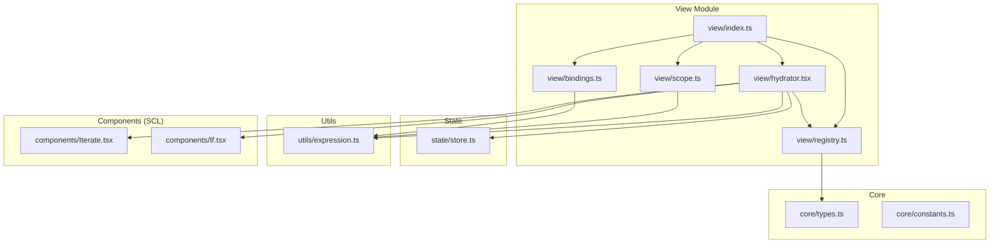
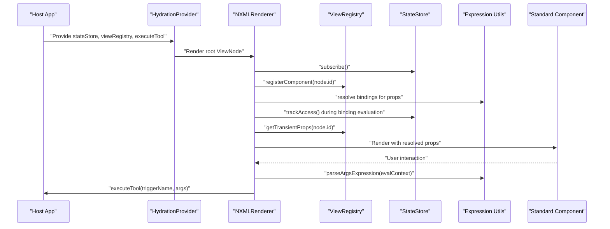
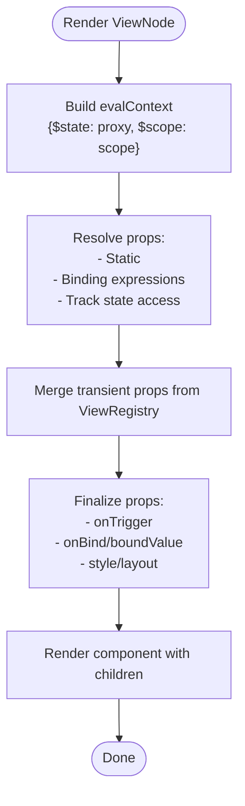
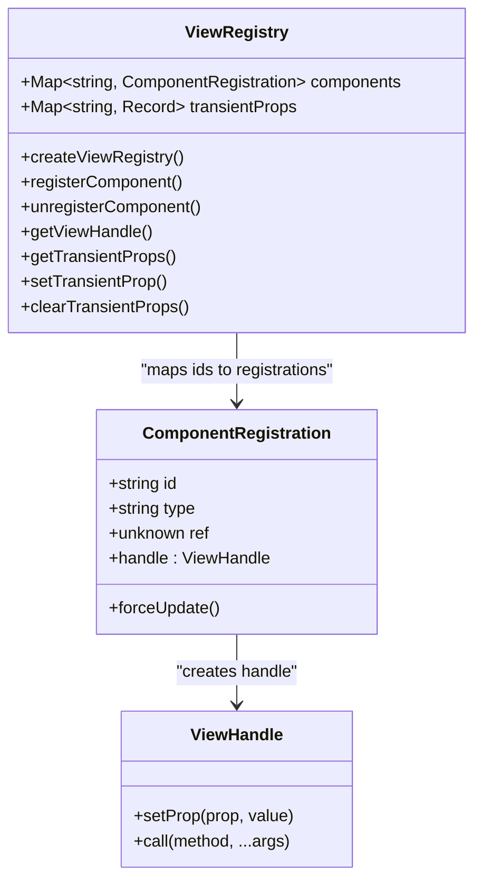
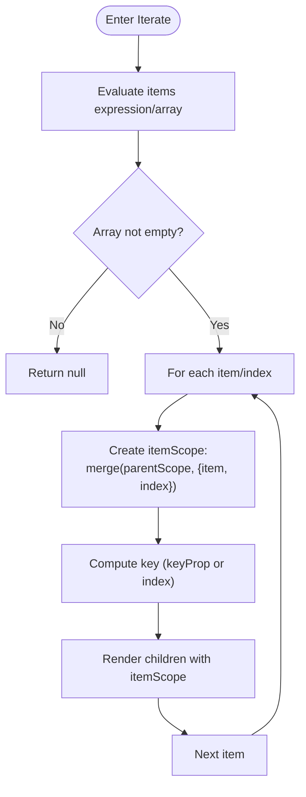
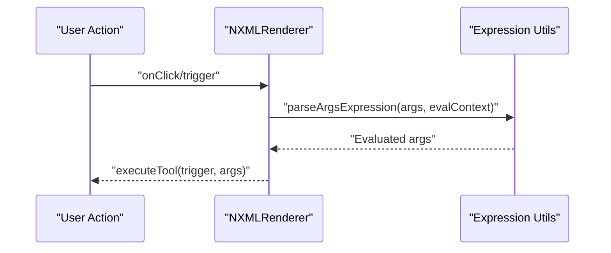
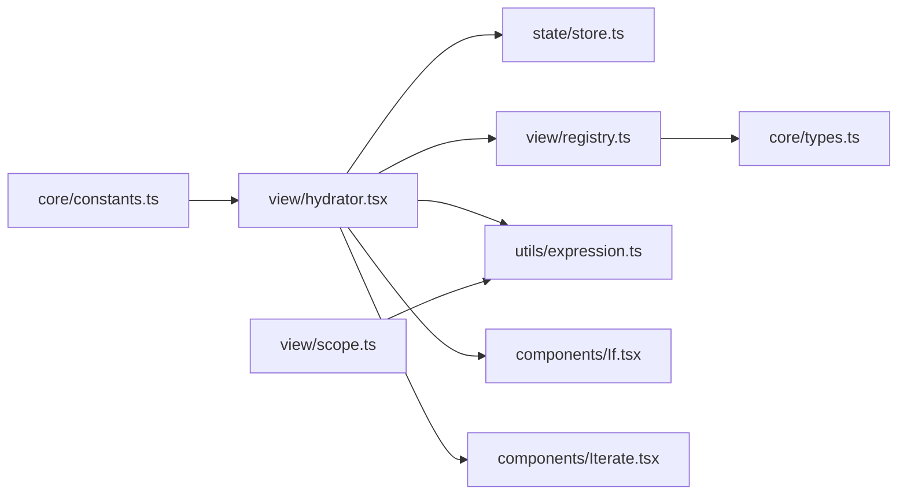

# View Rendering

<cite>
**Referenced Files in This Document**
- [index.ts](file://packages/nexus-reactor/src/view/index.ts)
- [hydrator.tsx](file://packages/nexus-reactor/src/view/hydrator.tsx)
- [registry.ts](file://packages/nexus-reactor/src/view/registry.ts)
- [scope.ts](file://packages/nexus-reactor/src/view/scope.ts)
- [bindings.ts](file://packages/nexus-reactor/src/view/bindings.ts)
- [expression.ts](file://packages/nexus-reactor/src/utils/expression.ts)
- [store.ts](file://packages/nexus-reactor/src/state/store.ts)
- [constants.ts](file://packages/nexus-reactor/src/core/constants.ts)
- [types.ts](file://packages/nexus-reactor/src/core/types.ts)
- [Iterate.tsx](file://packages/nexus-reactor/src/components/Iterate.tsx)
- [If.tsx](file://packages/nexus-reactor/src/components/If.tsx)
</cite>

## Table of Contents
1. [Introduction](#introduction)
2. [Project Structure](#project-structure)
3. [Core Components](#core-components)
4. [Architecture Overview](#architecture-overview)
5. [Detailed Component Analysis](#detailed-component-analysis)
6. [Dependency Analysis](#dependency-analysis)
7. [Performance Considerations](#performance-considerations)
8. [Troubleshooting Guide](#troubleshooting-guide)
9. [Conclusion](#conclusion)
10. [Appendices](#appendices)

## Introduction
This document explains the View Rendering system that transforms the NXML AST into interactive React components. It covers the hydration process, prop resolution cascade (transient overrides, reactive bindings, static values), scope management for Iterate components, dynamic argument resolution (thunk pattern), and the Imperative View Bridge pattern via the ViewRegistry. It also provides guidance on performance optimization, accessibility, and common rendering issues.

## Project Structure
The View Rendering system is organized under the view module and integrates tightly with the Standard Component Library (SCL), state management, and expression utilities.

**Diagram sources**
- [index.ts](file://packages/nexus-reactor/src/view/index.ts#L1-L65)
- [hydrator.tsx](file://packages/nexus-reactor/src/view/hydrator.tsx#L1-L258)
- [registry.ts](file://packages/nexus-reactor/src/view/registry.ts#L1-L187)
- [scope.ts](file://packages/nexus-reactor/src/view/scope.ts#L1-L120)
- [bindings.ts](file://packages/nexus-reactor/src/view/bindings.ts#L1-L27)
- [expression.ts](file://packages/nexus-reactor/src/utils/expression.ts#L1-L255)
- [store.ts](file://packages/nexus-reactor/src/state/store.ts#L1-L255)
- [types.ts](file://packages/nexus-reactor/src/core/types.ts#L1-L446)
- [constants.ts](file://packages/nexus-reactor/src/core/constants.ts#L1-L283)
- [Iterate.tsx](file://packages/nexus-reactor/src/components/Iterate.tsx#L1-L72)
- [If.tsx](file://packages/nexus-reactor/src/components/If.tsx#L1-L41)

**Section sources**
- [index.ts](file://packages/nexus-reactor/src/view/index.ts#L1-L65)

## Core Components
- Hydration Provider and Renderer: Creates a React component tree from a ViewNode, resolves bindings, merges transient props, and wires triggers and two-way bindings.
- View Registry: Provides imperative access to rendered components via $view API, enabling transient prop updates and method invocation.
- Scope Management: Supports nested iteration scopes with $scope.item and $scope.index, and flattening for expression evaluation.
- Binding Utilities: Safe evaluation of binding expressions, parsing of args expressions, and helpers for nested value access.
- State Store: Reactive proxy that tracks dependencies and notifies subscribers for selective re-renders.

**Section sources**
- [hydrator.tsx](file://packages/nexus-reactor/src/view/hydrator.tsx#L1-L258)
- [registry.ts](file://packages/nexus-reactor/src/view/registry.ts#L1-L187)
- [scope.ts](file://packages/nexus-reactor/src/view/scope.ts#L1-L120)
- [bindings.ts](file://packages/nexus-reactor/src/view/bindings.ts#L1-L27)
- [expression.ts](file://packages/nexus-reactor/src/utils/expression.ts#L1-L255)
- [store.ts](file://packages/nexus-reactor/src/state/store.ts#L1-L255)

## Architecture Overview
The system converts NXML ViewAST into React components through a provider-renderer pipeline. The renderer subscribes to state changes, registers itself in the ViewRegistry, evaluates bindings against $state and $scope, merges transient props, and invokes tools with dynamic arguments.

**Diagram sources**
- [hydrator.tsx](file://packages/nexus-reactor/src/view/hydrator.tsx#L1-L258)
- [registry.ts](file://packages/nexus-reactor/src/view/registry.ts#L1-L187)
- [expression.ts](file://packages/nexus-reactor/src/utils/expression.ts#L1-L255)
- [store.ts](file://packages/nexus-reactor/src/state/store.ts#L1-L255)

## Detailed Component Analysis

### Hydration Pipeline and Prop Resolution Cascade
- Registration: Components with an id are registered in the ViewRegistry so they can be targeted imperatively.
- Evaluation Context: $state is the reactive proxy; $scope is the current scope object passed from parents.
- Prop Resolution Order:
  1) Static values
  2) Reactive bindings ({$state.path} or {$scope.path})
  3) Transient overrides from ViewRegistry
- Two-way binding: For Input/Switch, bind="...$state.path..." sets the reactive state on change.
- Trigger handling: trigger prop executes a tool via executeTool with args resolved at interaction time (thunk pattern).
- Layout styles: Child layout metadata is injected via the layout engine.

**Diagram sources**
- [hydrator.tsx](file://packages/nexus-reactor/src/view/hydrator.tsx#L1-L258)
- [expression.ts](file://packages/nexus-reactor/src/utils/expression.ts#L1-L255)
- [store.ts](file://packages/nexus-reactor/src/state/store.ts#L1-L255)
- [registry.ts](file://packages/nexus-reactor/src/view/registry.ts#L1-L187)

**Section sources**
- [hydrator.tsx](file://packages/nexus-reactor/src/view/hydrator.tsx#L90-L239)

### Imperative View Bridge Pattern
- ViewRegistry exposes ViewHandle with:
  - setProp(prop, value): Temporarily overrides a prop for the component without mutating state.
  - call(method, ...args): Invokes a method on the component’s ref if available.
- Transient props are merged into resolved props and cause a re-render when set/cleared.
- Registration/unregistration ensures cleanup and prevents stale references.

**Diagram sources**
- [registry.ts](file://packages/nexus-reactor/src/view/registry.ts#L1-L187)
- [types.ts](file://packages/nexus-reactor/src/core/types.ts#L290-L304)

**Section sources**
- [registry.ts](file://packages/nexus-reactor/src/view/registry.ts#L1-L187)
- [types.ts](file://packages/nexus-reactor/src/core/types.ts#L290-L304)

### Scope Management for Iterate Components
- Iterate creates a child scope with $scope.item and $scope.index, inheriting parent scope.
- Nested Iterate builds a chain; resolveScopeReference searches up the chain.
- Children receive a function that renders with the item-scoped variables.

**Diagram sources**
- [Iterate.tsx](file://packages/nexus-reactor/src/components/Iterate.tsx#L1-L72)
- [scope.ts](file://packages/nexus-reactor/src/view/scope.ts#L1-L120)

**Section sources**
- [Iterate.tsx](file://packages/nexus-reactor/src/components/Iterate.tsx#L1-L72)
- [scope.ts](file://packages/nexus-reactor/src/view/scope.ts#L1-L120)

### Dynamic Argument Resolution (Thunk Pattern)
- Interaction-time evaluation: args prop is parsed at click/time-trigger, not at render time.
- parseArgsExpression supports:
  - Binding expressions: { ... }
  - JSON-like expressions with $state/$scope placeholders
- This defers computation until needed, avoiding unnecessary work during initial render.

**Diagram sources**
- [hydrator.tsx](file://packages/nexus-reactor/src/view/hydrator.tsx#L155-L170)
- [expression.ts](file://packages/nexus-reactor/src/utils/expression.ts#L207-L238)

**Section sources**
- [hydrator.tsx](file://packages/nexus-reactor/src/view/hydrator.tsx#L155-L170)
- [expression.ts](file://packages/nexus-reactor/src/utils/expression.ts#L207-L238)

### Conditional Rendering (If)
- Condition is evaluated as a boolean; children are rendered via a function to support lazy evaluation.

**Section sources**
- [If.tsx](file://packages/nexus-reactor/src/components/If.tsx#L1-L41)

## Dependency Analysis
- Hydrator depends on:
  - StateStore for reactive subscriptions and access tracking
  - ViewRegistry for registration and transient prop merging
  - Expression utilities for binding and args parsing
  - SCL components for rendering
- Registry depends on ViewHandle contract defined in core types
- Scope utilities depend on nested value helpers in expression utilities
- Constants define control-flow and SCL component sets

**Diagram sources**
- [hydrator.tsx](file://packages/nexus-reactor/src/view/hydrator.tsx#L1-L258)
- [registry.ts](file://packages/nexus-reactor/src/view/registry.ts#L1-L187)
- [scope.ts](file://packages/nexus-reactor/src/view/scope.ts#L1-L120)
- [expression.ts](file://packages/nexus-reactor/src/utils/expression.ts#L1-L255)
- [store.ts](file://packages/nexus-reactor/src/state/store.ts#L1-L255)
- [types.ts](file://packages/nexus-reactor/src/core/types.ts#L1-L446)
- [constants.ts](file://packages/nexus-reactor/src/core/constants.ts#L1-L283)
- [If.tsx](file://packages/nexus-reactor/src/components/If.tsx#L1-L41)
- [Iterate.tsx](file://packages/nexus-reactor/src/components/Iterate.tsx#L1-L72)

**Section sources**
- [hydrator.tsx](file://packages/nexus-reactor/src/view/hydrator.tsx#L1-L258)
- [registry.ts](file://packages/nexus-reactor/src/view/registry.ts#L1-L187)
- [scope.ts](file://packages/nexus-reactor/src/view/scope.ts#L1-L120)
- [expression.ts](file://packages/nexus-reactor/src/utils/expression.ts#L1-L255)
- [store.ts](file://packages/nexus-reactor/src/state/store.ts#L1-L255)
- [types.ts](file://packages/nexus-reactor/src/core/types.ts#L1-L446)
- [constants.ts](file://packages/nexus-reactor/src/core/constants.ts#L1-L283)
- [If.tsx](file://packages/nexus-reactor/src/components/If.tsx#L1-L41)
- [Iterate.tsx](file://packages/nexus-reactor/src/components/Iterate.tsx#L1-L72)

## Performance Considerations
- Selective re-renders:
  - Subscriptions are keyed per renderer; updates only trigger the subscribed component.
  - trackAccess associates binding evaluation with the renderer’s subscriber id to minimize unnecessary re-renders.
- Transient props:
  - Using ViewRegistry.setProp avoids mutating state, reducing downstream recomputations.
- Expression evaluation:
  - evaluateExpression uses a Function constructor with restricted context; keep expressions simple and avoid heavy computations.
- Layout and keys:
  - Use appropriate keys (e.g., keyProp) in Iterate to preserve component identity and reduce remounts.
- Infinite loops:
  - StateStore enforces recursion limits and throws on excessive updates to prevent hangs.

**Section sources**
- [store.ts](file://packages/nexus-reactor/src/state/store.ts#L180-L202)
- [hydrator.tsx](file://packages/nexus-reactor/src/view/hydrator.tsx#L90-L113)
- [registry.ts](file://packages/nexus-reactor/src/view/registry.ts#L90-L126)

## Troubleshooting Guide
- Unknown component type:
  - If a ViewNode type is not in the ComponentRegistry, the renderer warns and returns null. Ensure the component is registered or mapped.
- Binding evaluation errors:
  - evaluateExpression catches exceptions and logs; check binding syntax and referenced paths.
- Two-way binding not updating:
  - Ensure bind prop follows the "$state.path" pattern and the path exists in the reactive proxy.
- Trigger not firing:
  - Verify trigger prop is set and executeTool is provided by the HydrationProvider.
- Iterate rendering nothing:
  - Confirm items resolves to a non-empty array; check $scope.item availability.
- Transient prop not applying:
  - Ensure the component has an id and setProp is called on the correct ViewHandle.

**Section sources**
- [hydrator.tsx](file://packages/nexus-reactor/src/view/hydrator.tsx#L115-L121)
- [expression.ts](file://packages/nexus-reactor/src/utils/expression.ts#L76-L100)
- [registry.ts](file://packages/nexus-reactor/src/view/registry.ts#L81-L126)
- [Iterate.tsx](file://packages/nexus-reactor/src/components/Iterate.tsx#L45-L47)

## Conclusion
The View Rendering system provides a robust, reactive pipeline from NXML AST to interactive React components. It combines declarative bindings, imperative transient updates, scoped iteration, and dynamic argument resolution to deliver responsive UIs. By leveraging the ViewRegistry and state subscriptions, it achieves efficient selective re-renders while maintaining a clean separation between state and presentation.

## Appendices

### Example References
- Component rendering and props resolution:
  - [NXMLRenderer props and evaluation](file://packages/nexus-reactor/src/view/hydrator.tsx#L85-L205)
- Binding expressions and evaluation:
  - [Binding utilities](file://packages/nexus-reactor/src/utils/expression.ts#L1-L142)
- Imperative updates via $view API:
  - [ViewRegistry methods](file://packages/nexus-reactor/src/view/registry.ts#L90-L159)
  - [ViewHandle contract](file://packages/nexus-reactor/src/core/types.ts#L290-L304)
- Scope management for Iterate:
  - [Iterate component](file://packages/nexus-reactor/src/components/Iterate.tsx#L1-L72)
  - [Scope utilities](file://packages/nexus-reactor/src/view/scope.ts#L1-L120)
- Dynamic argument resolution (thunk):
  - [Trigger handling and args parsing](file://packages/nexus-reactor/src/view/hydrator.tsx#L155-L170)
  - [parseArgsExpression](file://packages/nexus-reactor/src/utils/expression.ts#L207-L238)