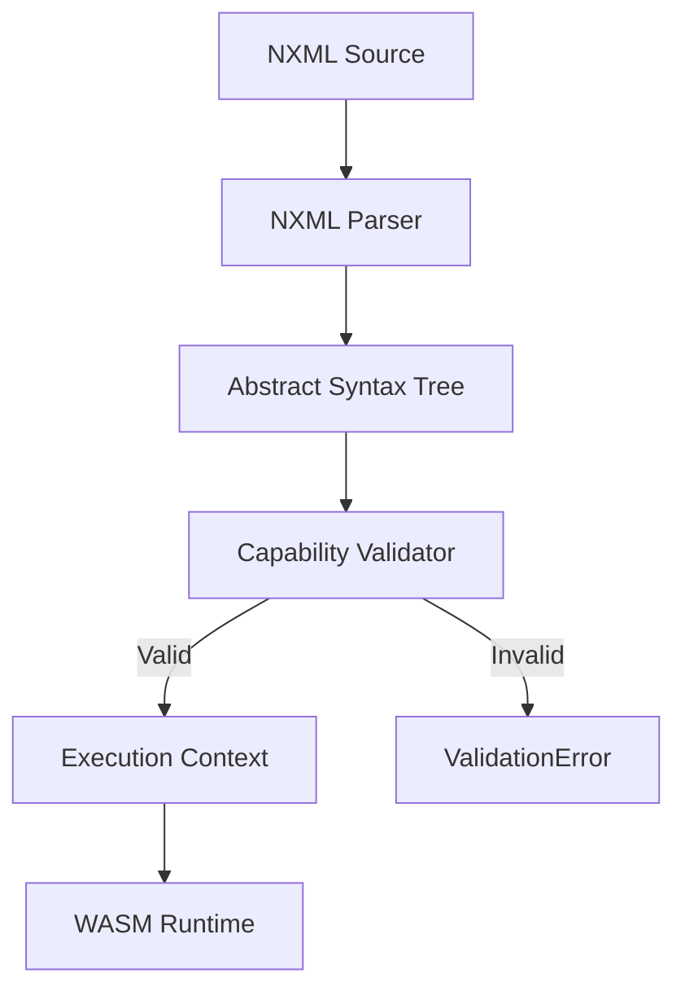
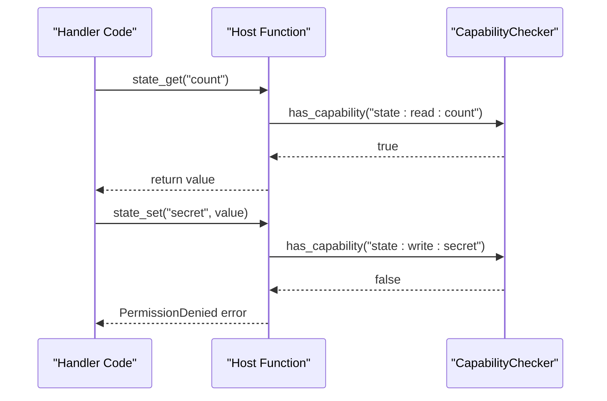
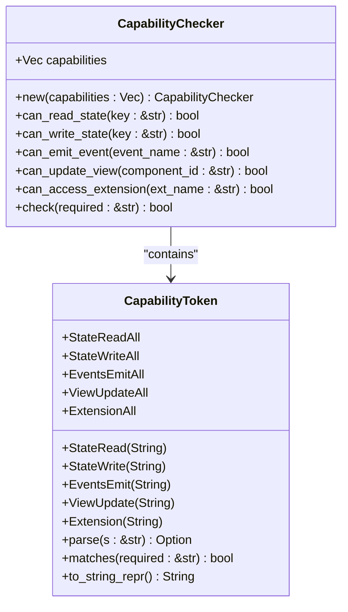

# Capability-Based Security

<cite>
**Referenced Files in This Document**   
- [capability.rs](file://runtime/nexus-wasm-bridge/src/capability.rs)
- [state.rs](file://runtime/nexus-wasm-bridge/src/host_functions/state.rs)
- [events.rs](file://runtime/nexus-wasm-bridge/src/host_functions/events.rs)
- [view.rs](file://runtime/nexus-wasm-bridge/src/host_functions/view.rs)
- [extension.rs](file://runtime/nexus-wasm-bridge/src/host_functions/extension.rs)
- [context.rs](file://runtime/nexus-wasm-bridge/src/context.rs)
- [error.rs](file://runtime/nexus-wasm-bridge/src/error.rs)
- [mod.rs](file://runtime/nexus-wasm-bridge/src/host_functions/mod.rs)
- [01_protocol_spec.md](file://docs/01_protocol_spec.md)
- [wasmedge_migration_strategy.md](file://docs/wasmedge_migration_strategy.md)
- [02_runtime_spec.md](file://docs/02_runtime_spec.md)
- [parser.ts](file://packages/nexus-reactor/src/parser/parser.ts)
- [validator.ts](file://packages/nexus-reactor/src/parser/validator.ts)
</cite>

## Table of Contents
1. [Introduction](#introduction)
2. [Capability Types and Token Format](#capability-types-and-token-format)
3. [Capability Declaration in NXML](#capability-declaration-in-nxml)
4. [Runtime Enforcement Mechanism](#runtime-enforcement-mechanism)
5. [Capability Checker Implementation](#capability-checker-implementation)
6. [Host Function Integration](#host-function-integration)
7. [Capability Inference System](#capability-inference-system)
8. [Security Considerations](#security-considerations)
9. [Error Handling and Diagnostics](#error-handling-and-diagnostics)
10. [Best Practices](#best-practices)

## Introduction

The Nexus platform implements a capability-based security model that enforces fine-grained access control through declarative capability tokens. This system ensures that handlers can only perform operations for which they have explicitly declared and been granted permissions. The security model operates on the principle of least privilege, where each handler must declare its required capabilities in the NXML configuration, and the runtime strictly enforces these declarations during execution.

Capabilities are enforced at every host function call, creating a secure boundary between the sandboxed WASM environment and the host system. The capability system covers five primary domains: state access, event emission, view manipulation, and extension access. Each capability is scoped to specific resources or can use wildcards to grant broader access. This document details the complete capability system, including token formats, declaration syntax, enforcement mechanisms, and security considerations.

**Section sources**
- [01_protocol_spec.md](file://docs/01_protocol_spec.md#L73-L111)
- [wasmedge_migration_strategy.md](file://docs/wasmedge_migration_strategy.md#L737-L760)

## Capability Types and Token Format

The Nexus capability system defines five distinct capability types, each governing access to specific platform resources and operations. These capabilities are represented as structured tokens in the format `domain:action:scope`, where the scope can be a specific resource identifier or a wildcard (`*`) for broad access.

### Capability Types

The five capability types are:

- **state:read**: Grants read access to specific state keys or all state
- **state:write**: Grants write access to specific state keys or all state  
- **events:emit**: Grants permission to emit specific events or any event
- **view:update**: Grants permission to update specific UI components or any component
- **ext:**: Grants access to specific extensions or all extensions

### Token Format and Scoping

Capability tokens follow a hierarchical format that enables precise access control. Each token consists of three parts separated by colons:

```
<domain>:<action>:<scope>
```

Where:
- **domain**: The resource category (state, events, view, ext)
- **action**: The operation type (read, write, emit, update)
- **scope**: The specific resource or wildcard

Examples of valid capability tokens include:
- `state:read:count` - Read access to the "count" state key
- `state:read:*` - Read access to all state keys
- `events:emit:toast` - Permission to emit "toast" events
- `view:update:logs` - Permission to update the "logs" component
- `ext:http` - Access to the HTTP extension
- `ext:*` - Access to all extensions

The system supports both specific and wildcard permissions, allowing developers to balance security and convenience. Wildcard permissions should be used judiciously to maintain the principle of least privilege.

**Section sources**
- [capability.rs](file://runtime/nexus-wasm-bridge/src/capability.rs#L9-L33)
- [wasmedge_migration_strategy.md](file://docs/wasmedge_migration_strategy.md#L749-L753)

## Capability Declaration in NXML

Capabilities must be explicitly declared in the NXML configuration within the `<Capabilities>` element of tool and lifecycle handlers. This declaration serves as a contract between the handler and the runtime, specifying exactly what operations the handler is authorized to perform.

### NXML Syntax

The capability declaration syntax in NXML uses the `<Capability>` element with `type` and `scope` attributes:

```xml
<Tool name="fetchData">
  <Capabilities>
    <Capability type="state:write" scope="data" />
    <Capability type="ext:http" scope="*" />
    <Capability type="events:emit" scope="toast,notification" />
  </Capabilities>
  <Handler>
    const response = await $ext.http.get($args.url);
    $state.data = response.data;
    $emit('toast', 'Data loaded!');
  </Handler>
</Tool>
```

Multiple capabilities can be declared for a single handler, and the scope attribute supports comma-separated values for multiple specific resources or the wildcard character for broad access.

### Validation and Parsing

The NXML parser validates capability declarations during the parsing phase, ensuring that all declared capabilities follow the correct format and that handlers do not request privileges they cannot use. The parser extracts capability declarations and converts them into capability tokens that are stored in the execution context.

The validation process includes:
- Syntax checking of capability type and scope
- Verification that capability types are valid
- Ensuring that handlers do not declare capabilities they cannot use
- Checking for duplicate capability declarations

This static validation provides an additional security layer by catching misconfigurations before execution.



**Diagram sources**
- [parser.ts](file://packages/nexus-reactor/src/parser/parser.ts#L35-L438)
- [validator.ts](file://packages/nexus-reactor/src/parser/validator.ts#L10-L176)

**Section sources**
- [wasmedge_migration_strategy.md](file://docs/wasmedge_migration_strategy.md#L746-L759)
- [02_runtime_spec.md](file://docs/02_runtime_spec.md#L908-L960)

## Runtime Enforcement Mechanism

The capability enforcement system operates at runtime by validating each host function call against the handler's granted capabilities. This enforcement occurs in the host function layer, where the runtime checks whether the requested operation is permitted before allowing it to proceed.

### Enforcement Flow

When a handler attempts to perform a privileged operation, the following enforcement flow occurs:

1. The handler calls a host function (e.g., `$state.get('count')`)
2. The host function extracts the required capability from the operation parameters
3. The capability checker verifies if the handler possesses the required capability
4. If authorized, the operation proceeds; otherwise, a PermissionDenied error is returned

For example, when a handler attempts to read a state value:
1. The `state_get` host function is called with key "count"
2. The required capability `state:read:count` is constructed
3. The capability checker searches the handler's granted capabilities
4. If `state:read:count` or `state:read:*` is present, access is granted

### Permission Denied Errors

When a handler attempts an operation without the required capability, the runtime returns a PermissionDenied error. This error includes details about the missing capability and the attempted operation, aiding in debugging and security analysis.

The error follows the format:
```
[PERMISSION_DENIED] Permission denied: {operation} requires capability '{required_capability}'
```

For example:
```
[PERMISSION_DENIED] Permission denied: write state.secret requires capability 'state:write:secret'
```

This detailed error reporting helps developers understand exactly which capabilities need to be added to their declarations.



**Diagram sources**
- [state.rs](file://runtime/nexus-wasm-bridge/src/host_functions/state.rs#L19-L30)
- [error.rs](file://runtime/nexus-wasm-bridge/src/error.rs#L146-L154)

**Section sources**
- [state.rs](file://runtime/nexus-wasm-bridge/src/host_functions/state.rs#L22-L26)
- [events.rs](file://runtime/nexus-wasm-bridge/src/host_functions/events.rs#L22-L26)
- [view.rs](file://runtime/nexus-wasm-bridge/src/host_functions/view.rs#L22-L30)
- [extension.rs](file://runtime/nexus-wasm-bridge/src/host_functions/extension.rs#L43-L47)

## Capability Checker Implementation

The `CapabilityChecker` struct is the core component responsible for runtime capability validation. It maintains a collection of granted capability tokens and provides methods to check whether specific operations are permitted.

### Data Structure

The `CapabilityChecker` is implemented as a simple struct containing a vector of `CapabilityToken` enums:

```rust
pub struct CapabilityChecker {
    capabilities: Vec<CapabilityToken>,
}
```

The `CapabilityToken` enum represents the different types of capabilities as strongly-typed variants, ensuring type safety and efficient matching:

```rust
pub enum CapabilityToken {
    StateRead(String),
    StateWrite(String),
    StateReadAll,
    StateWriteAll,
    EventsEmit(String),
    EventsEmitAll,
    ViewUpdate(String),
    ViewUpdateAll,
    Extension(String),
    ExtensionAll,
}
```

### Matching Logic

The capability matching system uses a two-tier approach that supports both specific and wildcard permissions. For each capability check, the system evaluates whether the handler possesses either the specific capability or the wildcard equivalent.

The matching logic is implemented in the `matches` method of `CapabilityToken`:

```rust
pub fn matches(&self, required: &str) -> bool {
    let parts: Vec<&str> = required.split(':').collect();
    
    match (self, parts.as_slice()) {
        (Self::StateReadAll, ["state", "read", _]) => true,
        (Self::StateRead(key), ["state", "read", k]) => key == *k,
        // ... other patterns
        _ => false,
    }
}
```

This pattern matching approach allows for efficient capability validation with O(n) complexity, where n is the number of granted capabilities.

### Checker Methods

The `CapabilityChecker` provides specialized methods for each capability type:

- `can_read_state(&self, key: &str) -> bool`
- `can_write_state(&self, key: &str) -> bool` 
- `can_emit_event(&self, event_name: &str) -> bool`
- `can_update_view(&self, component_id: &str) -> bool`
- `can_access_extension(&self, ext_name: &str) -> bool`
- `check(&self, required: &str) -> bool`

These methods abstract the capability string construction and provide a clean API for host functions to perform authorization checks.



**Diagram sources**
- [capability.rs](file://runtime/nexus-wasm-bridge/src/capability.rs#L179-L224)

**Section sources**
- [capability.rs](file://runtime/nexus-wasm-bridge/src/capability.rs#L179-L224)

## Host Function Integration

The capability enforcement system is integrated into all host functions that provide access to privileged resources. Each host function performs capability checks before allowing the requested operation to proceed.

### State Access Functions

The state module host functions enforce both read and write capabilities:

- `state_get`: Requires `state:read:{key}` or `state:read:*`
- `state_set`: Requires `state:write:{key}` or `state:write:*`
- `state_delete`: Requires `state:write:{key}` or `state:write:*`
- `state_has`: Requires `state:read:{key}` or `state:read:*`
- `state_keys`: Requires `state:read:*` (specific read capabilities are insufficient)

```rust
pub fn state_get(ctx: &SharedContext, key: &str) -> HostResult<Option<RuntimeValue>> {
    let required = format!("state:read:{}", key);
    if !context.has_capability(&required) && !context.has_capability("state:read:*") {
        return Err(error_codes::PERMISSION_DENIED);
    }
    // ... proceed with operation
}
```

### Event Emission Functions

The events module enforces emission capabilities:

- `emit_event`: Requires `events:emit:{name}` or `events:emit:*`
- `emit_toast`: Requires `events:emit:toast`

```rust
pub fn emit_event(ctx: &SharedContext, event_name: &str, payload: RuntimeValue) -> HostResult<()> {
    let required = format!("events:emit:{}", event_name);
    if !context.has_capability(&required) && !context.has_capability("events:emit:*") {
        return Err(error_codes::PERMISSION_DENIED);
    }
    // ... proceed with emission
}
```

### View Manipulation Functions

The view module enforces component update capabilities:

- `view_command`: Requires `view:update:{id}` or `view:update:*`
- `view_set_filter`: Requires `view:update:{id}` or `view:update:*`
- `view_scroll_to`: Requires `view:update:{id}` or `view:update:*`
- `view_focus`: Requires `view:update:{id}` or `view:update:*`
- `view_custom`: Requires `view:update:{id}` or `view:update:*`

### Extension Access Functions

The extension module enforces access capabilities:

- `ext_suspend`: Requires `ext:{name}` or `ext:*`
- `ext_exists`: No capability check (safe read operation)
- `ext_methods`: Requires `ext:{name}` or `ext:*`
- `ext_list`: No capability check (safe read operation)

The host function integration ensures that all privileged operations are protected by capability checks, creating a comprehensive security boundary around the handler's execution environment.

**Section sources**
- [state.rs](file://runtime/nexus-wasm-bridge/src/host_functions/state.rs#L19-L129)
- [events.rs](file://runtime/nexus-wasm-bridge/src/host_functions/events.rs#L19-L63)
- [view.rs](file://runtime/nexus-wasm-bridge/src/host_functions/view.rs#L19-L136)
- [extension.rs](file://runtime/nexus-wasm-bridge/src/host_functions/extension.rs#L24-L67)

## Capability Inference System

The Nexus platform includes a static analysis system that can automatically infer required capabilities from handler code. This inference system analyzes the handler's JavaScript code to detect operations that require capabilities, providing suggestions for the necessary declarations.

### Inference Algorithm

The inference system uses pattern matching to detect capability-requiring operations in the handler code:

- **State access**: Detects `$state.key` and `$state['key']` patterns
- **State modification**: Detects `$state.key = value` and `$state['key'] = value` patterns
- **Event emission**: Detects `$emit('event_name', ...)` calls
- **Extension access**: Detects `$ext.name.method(...)` calls

The inference function `infer_capabilities` processes the handler code and returns a list of detected capability tokens:

```rust
pub fn infer_capabilities(handler_code: &str) -> Vec<CapabilityToken> {
    let mut capabilities = Vec::new();
    
    // Detect $state reads and writes
    for cap in find_state_access(handler_code, false) {
        if !capabilities.contains(&cap) {
            capabilities.push(cap);
        }
    }
    
    // Detect $state writes
    for cap in find_state_access(handler_code, true) {
        if !capabilities.contains(&cap) {
            capabilities.push(cap);
        }
    }
    
    // Detect $emit calls
    for cap in find_emit_calls(handler_code) {
        if !capabilities.contains(&cap) {
            capabilities.push(cap);
        }
    }
    
    // Detect $ext access
    for cap in find_extension_access(handler_code) {
        if !capabilities.contains(&cap) {
            capabilities.push(cap);
        }
    }
    
    capabilities
}
```

### Implementation Details

The inference system uses regular expressions to identify capability-requiring patterns in the code:

- State access: `\$state\.(\w+)` and `\$state\.\w+\s*=` patterns
- Event emission: `\$\emit\s*\(\s*['"](\w+)['"]` pattern
- Extension access: `\$ext\.(\w+)` pattern

While the current implementation uses regex-based pattern matching, a production system would benefit from using a proper JavaScript parser (like Babel) for more accurate and robust analysis.

### Usage and Benefits

The capability inference system provides several benefits:

1. **Developer convenience**: Automatically suggests required capabilities
2. **Security auditing**: Identifies potential capability requirements that might be missed
3. **Migration assistance**: Helps convert existing handlers to the capability model
4. **Documentation**: Provides insight into a handler's actual resource usage

Developers can use the inference results as a starting point for their capability declarations, then refine them to follow the principle of least privilege.

**Section sources**
- [capability.rs](file://runtime/nexus-wasm-bridge/src/capability.rs#L226-L327)
- [02_runtime_spec.md](file://docs/02_runtime_spec.md#L908-L960)

## Security Considerations

The capability-based security model in Nexus addresses several critical security concerns through its design and implementation.

### Privilege Escalation Prevention

The system prevents privilege escalation by enforcing capability checks at the host function level. Even if a handler's code is compromised, it cannot perform operations beyond its declared capabilities. This defense-in-depth approach ensures that:

1. Capabilities are checked at the boundary between the sandbox and host
2. Host functions validate capabilities before performing privileged operations
3. The execution context cannot be modified by the handler to gain additional privileges

The use of capability tokens that are validated against a whitelist of granted capabilities prevents common attack vectors like path traversal or resource exhaustion through unauthorized access.

### Capability Minimization Best Practices

To maintain security, developers should follow these best practices:

1. **Principle of Least Privilege**: Only request the minimum capabilities needed
2. **Specific over Wildcard**: Use specific capabilities (e.g., `state:read:count`) instead of wildcards when possible
3. **Regular Auditing**: Periodically review capability declarations to remove unused permissions
4. **Separation of Concerns**: Use different handlers with different capability sets for different tasks

For example, a handler that only needs to read a counter should declare:
```xml
<Capability type="state:read" scope="count" />
```

Rather than the more permissive:
```xml
<Capability type="state:read" scope="*" />
```

### Attack Surface Reduction

The capability system reduces the attack surface by:

1. **Gating access**: All privileged operations require explicit capability declarations
2. **Isolating handlers**: Each handler operates with its own capability set
3. **Preventing lateral movement**: Compromised handlers cannot access resources outside their capabilities
4. **Enabling fine-grained monitoring**: Capability usage can be logged and audited

The system also includes safeguards against denial-of-service attacks by limiting the number of host function calls through the `max_host_calls` parameter in the `HostFunctions` struct.

### Secure Defaults

The system follows secure default principles:

1. **Default Deny**: Handlers start with no capabilities and must explicitly request access
2. **Explicit Declaration**: Capabilities must be declared in NXML, not inferred by default
3. **Runtime Validation**: Capabilities are validated at runtime, not just at deployment
4. **Error Transparency**: Permission denied errors provide clear diagnostic information

These security considerations ensure that the capability system provides robust protection against both accidental misuse and malicious attacks.

**Section sources**
- [capability.rs](file://runtime/nexus-wasm-bridge/src/capability.rs#L1-L384)
- [context.rs](file://runtime/nexus-wasm-bridge/src/context.rs#L120-L189)
- [mod.rs](file://runtime/nexus-wasm-bridge/src/host_functions/mod.rs#L20-L52)

## Error Handling and Diagnostics

The capability system provides comprehensive error handling and diagnostic capabilities to assist developers in troubleshooting permission issues.

### Error Types and Codes

The system defines specific error codes for capability-related failures:

- `PERMISSION_DENIED` (i32: -1): Operation requires a capability that is not granted
- `INVALID_ARGUMENT` (i32: -3): Invalid capability format or declaration
- `NOT_FOUND` (i32: -4): Requested resource not found

The `WasmError` struct provides detailed error information including:

- **Error code**: Categorized error type
- **Message**: Human-readable description
- **Location**: Source location in handler code
- **Snippet**: Code snippet around the error location
- **Context**: Additional debugging information

### Diagnostic Information

When a PermissionDenied error occurs, the system provides specific information about the missing capability:

```rust
pub fn permission_denied(capability: impl Into<String>, operation: impl Into<String>) -> Self {
    Self::new(
        ErrorCode::PermissionDenied,
        format!("Permission denied: {} requires capability '{}'", op, cap),
    )
}
```

This detailed error message helps developers quickly identify and fix capability declaration issues.

### Logging and Monitoring

The execution context includes logging capabilities that can be used to monitor capability usage:

```rust
pub fn add_log(&mut self, level: LogLevel, message: String) {
    self.log_messages.push(LogMessage { level, message });
}
```

This allows for auditing capability checks and identifying potential security issues.

The comprehensive error handling system ensures that capability violations are clearly reported and easily diagnosable, balancing security with developer productivity.

**Section sources**
- [error.rs](file://runtime/nexus-wasm-bridge/src/error.rs#L146-L154)
- [context.rs](file://runtime/nexus-wasm-bridge/src/context.rs#L584-L588)

## Best Practices

To effectively use the capability-based security system, developers should follow these best practices:

### Capability Declaration

1. **Declare minimal capabilities**: Only request the capabilities actually needed
2. **Use specific scopes**: Prefer `state:read:count` over `state:read:*` when possible
3. **Group related capabilities**: Declare all required capabilities in a single `<Capabilities>` block
4. **Document capabilities**: Use comments to explain why each capability is needed

### Security Hygiene

1. **Regular audits**: Periodically review capability declarations to remove unused permissions
2. **Separation of duties**: Use different handlers with different capability sets for different tasks
3. **Avoid wildcards**: Minimize use of `*` scope except when absolutely necessary
4. **Defense in depth**: Assume capabilities might be compromised and design accordingly

### Development Workflow

1. **Use inference as a starting point**: Run the capability inference system to identify required capabilities
2. **Test with minimal capabilities**: Start with minimal capabilities and add as needed
3. **Validate in development**: Use development mode to catch capability issues early
4. **Monitor production usage**: Track capability usage in production to identify anomalies

### Example: Secure Counter Handler

```xml
<Tool name="incrementCounter">
  <Capabilities>
    <!-- Only read and write access to the count state -->
    <Capability type="state:read" scope="count" />
    <Capability type="state:write" scope="count" />
    <!-- Only emit toast notifications -->
    <Capability type="events:emit" scope="toast" />
  </Capabilities>
  <Handler>
    // Increment the counter and show a notification
    const current = $state.count || 0;
    $state.count = current + 1;
    $emit('toast', `Count is now ${$state.count}`);
  </Handler>
</Tool>
```

Following these best practices ensures that handlers are secure, maintainable, and follow the principle of least privilege.

**Section sources**
- [wasmedge_migration_strategy.md](file://docs/wasmedge_migration_strategy.md#L746-L759)
- [02_runtime_spec.md](file://docs/02_runtime_spec.md#L908-L960)