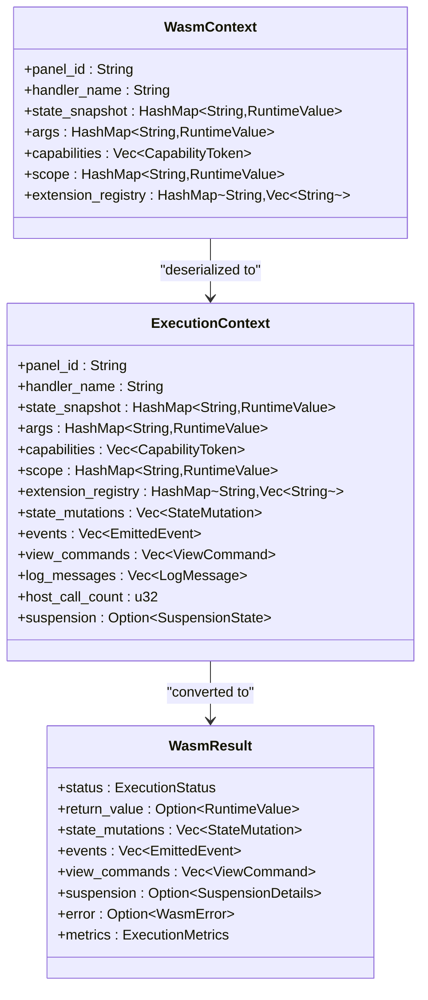
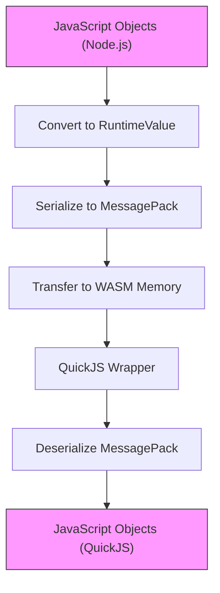
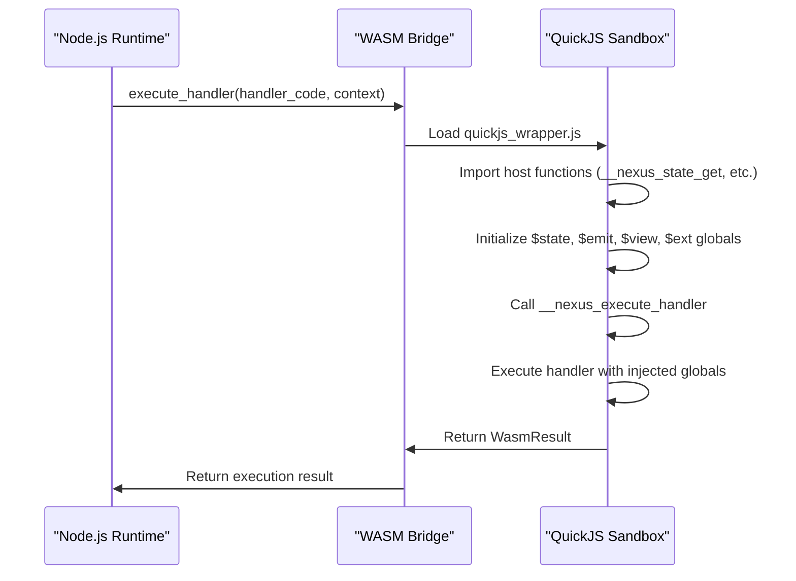
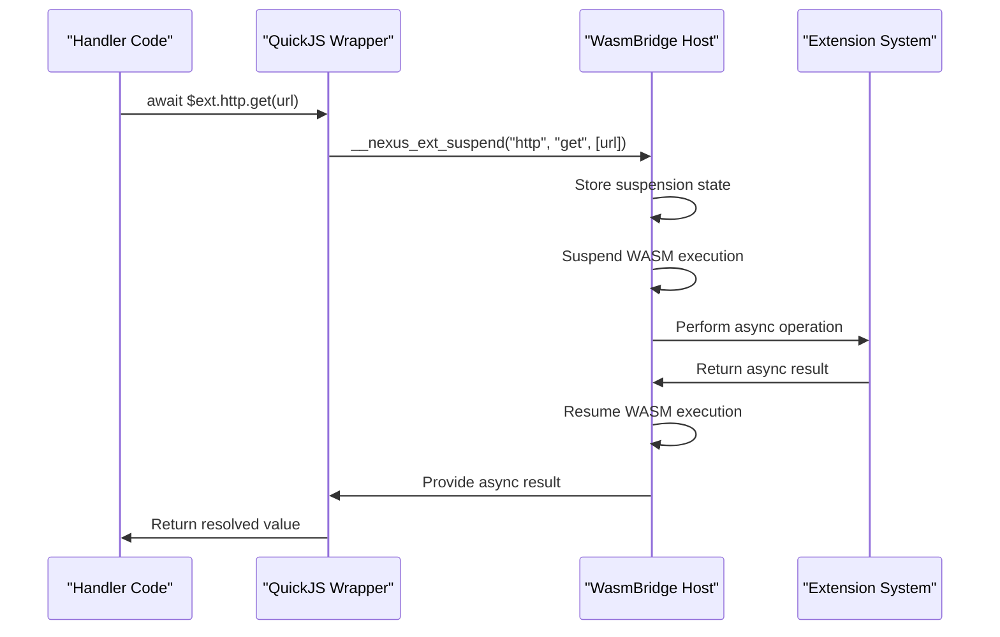
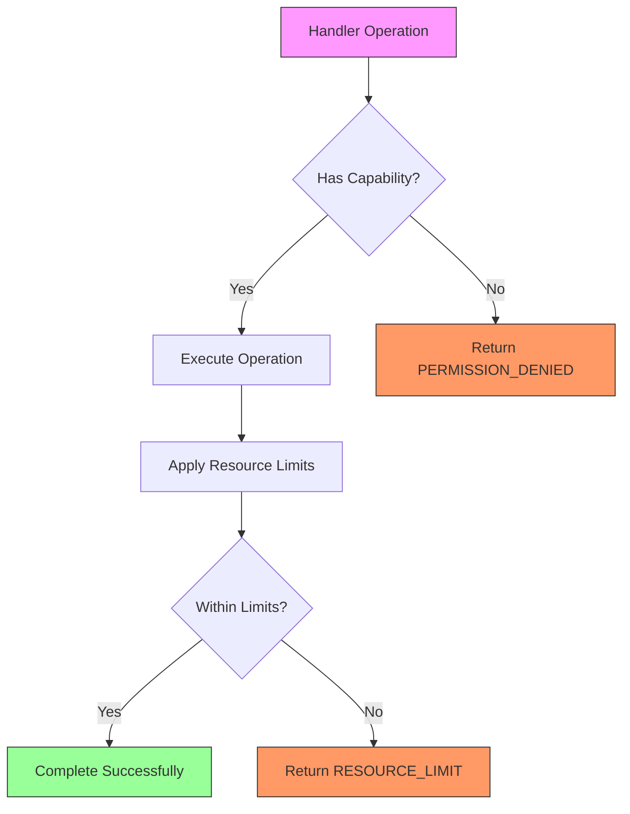

# Execution Context

<cite>
**Referenced Files in This Document**   
- [context.rs](file://runtime/nexus-wasm-bridge/src/context.rs)
- [quickjs_wrapper.js](file://runtime/nexus-wasm-bridge/src/quickjs_wrapper.js)
- [state.rs](file://runtime/nexus-wasm-bridge/src/host_functions/state.rs)
- [proxy.ts](file://packages/nexus-reactor/src/state/proxy.ts)
- [capability.rs](file://runtime/nexus-wasm-bridge/src/capability.rs)
- [events.rs](file://runtime/nexus-wasm-bridge/src/host_functions/events.rs)
- [view.rs](file://runtime/nexus-wasm-bridge/src/host_functions/view.rs)
- [extension.rs](file://runtime/nexus-wasm-bridge/src/host_functions/extension.rs)
- [types.ts](file://packages/nexus-reactor/src/core/types.ts)
- [context.ts](file://packages/nexus-reactor/src/sandbox/context.ts)
</cite>

## Table of Contents
1. [Introduction](#introduction)
2. [ExecutionContext Structure](#executioncontext-structure)
3. [Context Serialization Process](#context-serialization-process)
4. [Global Variable Injection](#global-variable-injection)
5. [State Proxy Implementation](#state-proxy-implementation)
6. [Suspension Context Management](#suspension-context-management)
7. [Security Considerations](#security-considerations)
8. [Conclusion](#conclusion)

## Introduction
The Execution Context system in Nexus provides a secure and efficient mechanism for managing handler invocations within a WebAssembly sandbox. This system maintains state and metadata for each handler execution, enabling reactive state management, event emission, view manipulation, and extension calls while enforcing strict security boundaries through capability-based access control. The context management system bridges the gap between Node.js runtime and WASM execution, allowing seamless data exchange and asynchronous operations through a well-defined interface.

**Section sources**
- [context.rs](file://runtime/nexus-wasm-bridge/src/context.rs#L1-L695)
- [quickjs_wrapper.js](file://runtime/nexus-wasm-bridge/src/quickjs_wrapper.js#L1-L411)

## ExecutionContext Structure
The ExecutionContext struct serves as the central data structure for managing handler execution state and metadata. It contains comprehensive information about the current execution environment, including panel identification, capability tokens, state snapshots, arguments, and various operation queues.

The WasmContext structure represents the serialized form of execution context passed to WASM handlers, containing essential metadata:
- **Panel ID**: Unique identifier for logging and metrics
- **Handler name**: Tool or lifecycle handler identifier
- **State snapshot**: Immutable snapshot of current state values
- **Arguments**: Input parameters for tool handlers
- **Capabilities**: Security tokens granting specific permissions
- **Scope variables**: Context from conditional or iterative components
- **Extension registry**: Available extensions and their methods

During execution, the ExecutionContext maintains mutable collections for operations that need to be applied after handler completion:
- **State mutations**: Queue of state changes to be applied
- **Emitted events**: Events to be propagated to the host system
- **View commands**: UI manipulation instructions
- **Log messages**: Execution logs with severity levels
- **Suspension state**: Async operation context for suspend/resume cycles



**Diagram sources**
- [context.rs](file://runtime/nexus-wasm-bridge/src/context.rs#L120-L536)

**Section sources**
- [context.rs](file://runtime/nexus-wasm-bridge/src/context.rs#L120-L536)

## Context Serialization Process
The context serialization process converts JavaScript objects from Node.js into a format suitable for WASM execution, ensuring type safety and efficient data transfer between the host environment and the sandboxed runtime.

The RuntimeValue enum defines the set of serializable types that can be passed between environments:
- **Null**: Represents null values
- **Bool**: Boolean values
- **Number**: Numeric values (f64 for JS compatibility)
- **String**: String values
- **Array**: Collections of RuntimeValues
- **Object**: Key-value mappings of RuntimeValues

This serialization system ensures type safety through explicit conversion implementations and provides helper methods for type checking and value extraction. The system uses Serde for efficient serialization/deserialization between Rust and JavaScript environments, with MessagePack as the underlying binary format for optimal performance.

The serialization process occurs in multiple stages:
1. JavaScript objects are converted to the RuntimeValue representation
2. RuntimeValues are serialized to MessagePack binary format
3. Binary data is transferred to the WASM memory space
4. QuickJS wrapper deserializes the data back to JavaScript objects



**Diagram sources**
- [context.rs](file://runtime/nexus-wasm-bridge/src/context.rs#L13-L118)
- [quickjs_wrapper.js](file://runtime/nexus-wasm-bridge/src/quickjs_wrapper.js#L50-L67)

**Section sources**
- [context.rs](file://runtime/nexus-wasm-bridge/src/context.rs#L13-L118)
- [quickjs_wrapper.js](file://runtime/nexus-wasm-bridge/src/quickjs_wrapper.js#L50-L67)

## Global Variable Injection
The QuickJS wrapper script implements a sophisticated injection mechanism that initializes global variables within the WASM sandbox environment, providing handlers with access to essential APIs while maintaining security boundaries.

The injection process occurs through the __nexus_execute_handler function, which sets up the global environment before handler execution:
- **$state**: State management API with Proxy-based access
- **$args**: Handler arguments from invocation
- **$emit**: Event emission functions
- **$view**: View manipulation commands
- **$ext**: Extension access with async support
- **$log**: Logging utilities with severity levels
- **$time**: Time utilities for timestamp operations

The wrapper script imports host functions through globalThis references, which are injected by WasmEdge when the module loads. These host functions provide the bridge between JavaScript operations and Rust implementations, enabling secure cross-boundary calls.



**Diagram sources**
- [quickjs_wrapper.js](file://runtime/nexus-wasm-bridge/src/quickjs_wrapper.js#L16-L411)
- [context.rs](file://runtime/nexus-wasm-bridge/src/context.rs#L495-L588)

**Section sources**
- [quickjs_wrapper.js](file://runtime/nexus-wasm-bridge/src/quickjs_wrapper.js#L16-L411)

## State Proxy Implementation
The $state global variable is implemented as a Proxy object that transparently calls host functions for state access, enabling reactive state management with dependency tracking and security enforcement.

The Proxy implementation intercepts property access operations and routes them to appropriate host functions:
- **get**: Routes to __nexus_state_get, returning deserialized values
- **set**: Routes to __nexus_state_set, serializing values before storage
- **delete**: Routes to __nexus_state_delete, enforcing write permissions
- **has**: Routes to __nexus_state_has, checking key existence
- **keys**: Routes to __nexus_state_keys, retrieving all state keys

The implementation includes comprehensive type validation and error handling, ensuring that only valid operations are performed. Each operation includes capability checks to enforce security policies, preventing unauthorized access to state properties.

```mermaid
classDiagram
class StateProxy {
+get(key)
+set(key, value)
+delete(key)
+has(key)
+keys()
+update(key, updater)
}
class HostFunctions {
+__nexus_state_get(key)
+__nexus_state_set(key, value)
+__nexus_state_delete(key)
+__nexus_state_has(key)
+__nexus_state_keys()
}
class Serialization {
+encode(value)
+decode(data)
}
StateProxy --> HostFunctions : "delegates to"
StateProxy --> Serialization : "uses for"
HostFunctions --> "State Storage" : "modifies"
```

**Diagram sources**
- [quickjs_wrapper.js](file://runtime/nexus-wasm-bridge/src/quickjs_wrapper.js#L69-L145)
- [state.rs](file://runtime/nexus-wasm-bridge/src/host_functions/state.rs#L9-L87)

**Section sources**
- [quickjs_wrapper.js](file://runtime/nexus-wasm-bridge/src/quickjs_wrapper.js#L69-L145)
- [proxy.ts](file://packages/nexus-reactor/src/state/proxy.ts#L167-L254)

## Suspension Context Management
The suspension context captures async operation state during Asyncify-based suspend/resume cycles, enabling seamless integration of asynchronous operations within the synchronous WASM execution model.

When a handler calls an async extension method via $ext, the following suspension process occurs:
1. The createExtensionCall function serializes the extension call parameters
2. The __nexus_ext_suspend host function is called, creating suspension state
3. WASM execution is suspended via Asyncify, returning control to the host
4. The host performs the async operation (e.g., HTTP request)
5. The host resumes WASM execution with the async result
6. The QuickJS wrapper returns the result to the original await expression

The SuspensionDetails structure contains all necessary information to resume execution:
- **Suspension ID**: Unique identifier for the suspended operation
- **Extension name**: Target extension (e.g., 'http')
- **Method name**: Target method (e.g., 'get')
- **Arguments**: Method parameters in serialized form

This mechanism allows handlers to use familiar async/await syntax while the underlying implementation handles the complexity of cross-boundary asynchronous operations.



**Diagram sources**
- [quickjs_wrapper.js](file://runtime/nexus-wasm-bridge/src/quickjs_wrapper.js#L218-L235)
- [extension.rs](file://runtime/nexus-wasm-bridge/src/host_functions/extension.rs#L10-L67)
- [context.rs](file://runtime/nexus-wasm-bridge/src/context.rs#L425-L457)

**Section sources**
- [quickjs_wrapper.js](file://runtime/nexus-wasm-bridge/src/quickjs_wrapper.js#L218-L235)
- [extension.rs](file://runtime/nexus-wasm-bridge/src/host_functions/extension.rs#L10-L67)

## Security Considerations
The execution context system implements multiple layers of security to prevent prototype pollution and ensure proper sandboxing of global variables, protecting both the host environment and user data.

The capability-based security model enforces fine-grained access control through capability tokens:
- **State access**: Separate read and write permissions for specific keys or all state
- **Event emission**: Permissions for specific event types or all events
- **View updates**: Permissions for specific components or all components
- **Extension access**: Permissions for specific extensions or all extensions

Each host function call performs capability checks before executing the requested operation, returning PERMISSION_DENIED errors for unauthorized access attempts. The system also enforces resource limits, including maximum host calls per execution to prevent denial-of-service attacks.

The QuickJS wrapper implements additional security measures:
- **Global variable sanitization**: Removal of dangerous globals like eval and Function
- **Input validation**: Type checking for all API parameters
- **Error isolation**: Comprehensive error handling to prevent sandbox escape
- **Prototype protection**: Prevention of prototype pollution attacks



**Diagram sources**
- [capability.rs](file://runtime/nexus-wasm-bridge/src/capability.rs#L9-L83)
- [state.rs](file://runtime/nexus-wasm-bridge/src/host_functions/state.rs#L22-L27)
- [quickjs_wrapper.js](file://runtime/nexus-wasm-bridge/src/quickjs_wrapper.js#L2360-L2364)

**Section sources**
- [capability.rs](file://runtime/nexus-wasm-bridge/src/capability.rs#L9-L83)
- [error.rs](file://runtime/nexus-wasm-bridge/src/error.rs#L146-L154)

## Conclusion
The Execution Context system in Nexus provides a robust and secure foundation for handler execution within a WebAssembly sandbox. By combining a well-structured context model with efficient serialization, transparent proxy implementations, and comprehensive security measures, the system enables powerful reactive applications while maintaining strict isolation and performance guarantees. The integration of async suspension/resume cycles through the Asyncify mechanism allows for natural async/await syntax in handlers, bridging the gap between synchronous WASM execution and asynchronous host operations. This architecture ensures that developers can build complex, interactive applications with confidence in both functionality and security.