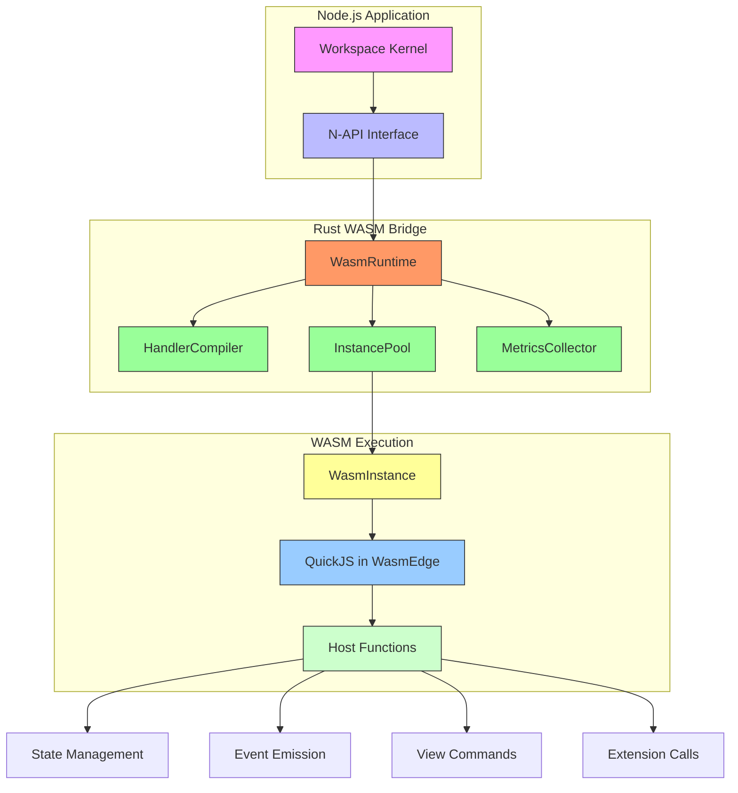
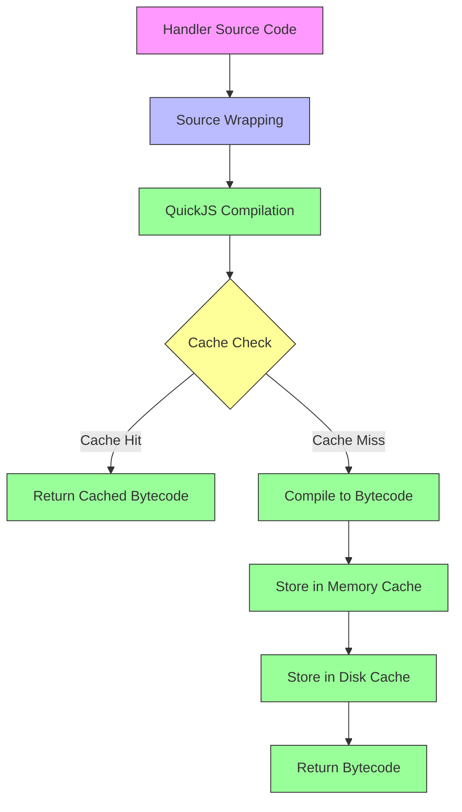
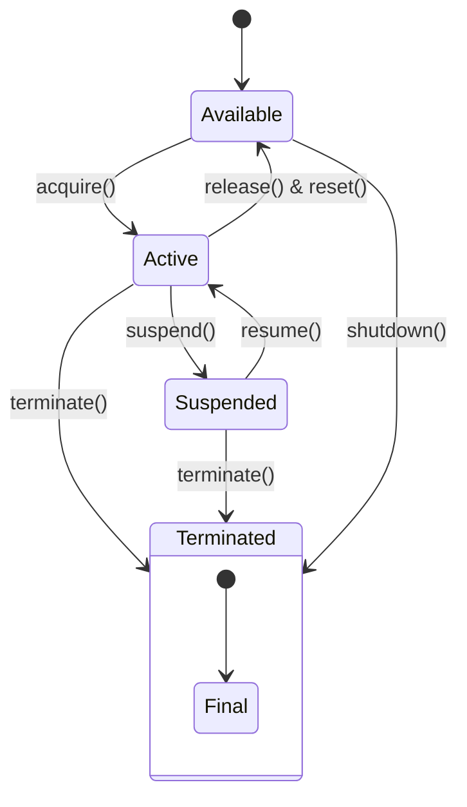
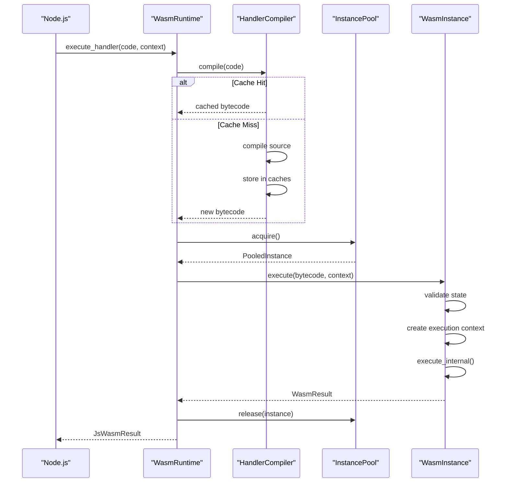
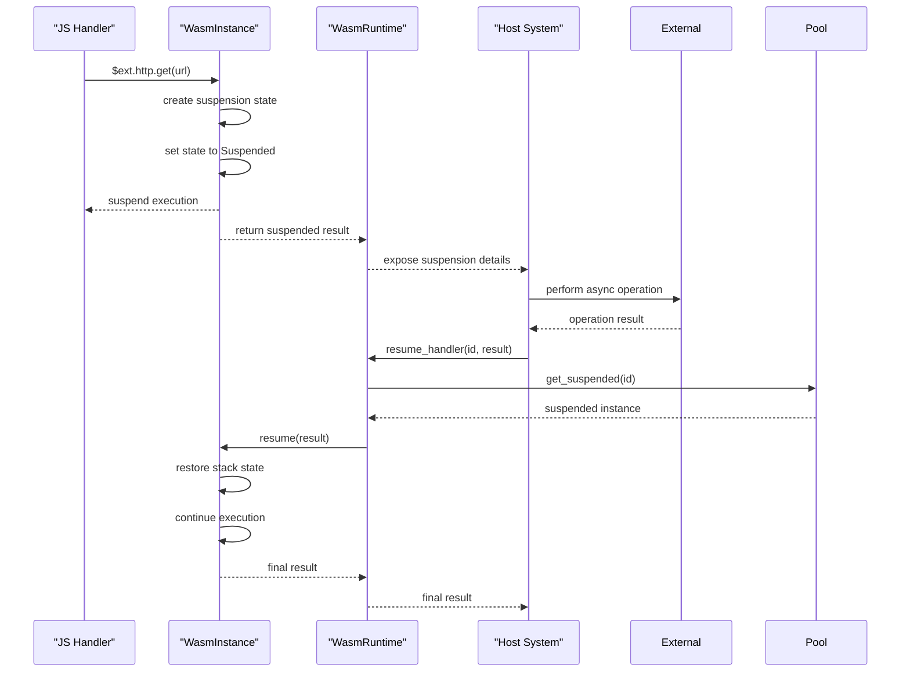
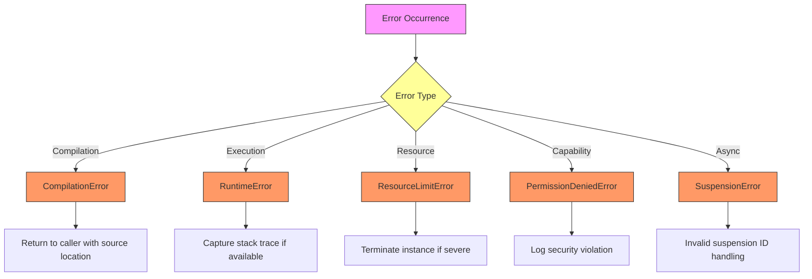
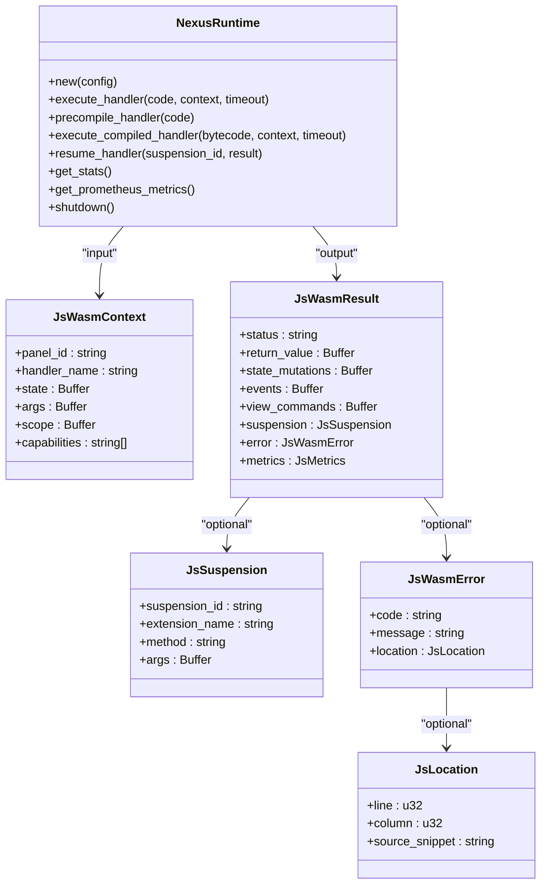
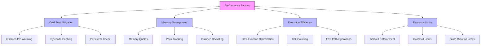

# Execution Engine

<cite>
**Referenced Files in This Document**   
- [lib.rs](file://runtime/nexus-wasm-bridge/src/lib.rs)
- [Cargo.toml](file://runtime/nexus-wasm-bridge/Cargo.toml)
- [engine/mod.rs](file://runtime/nexus-wasm-bridge/src/engine/mod.rs)
- [engine/compiler.rs](file://runtime/nexus-wasm-bridge/src/engine/compiler.rs)
- [engine/pool.rs](file://runtime/nexus-wasm-bridge/src/engine/pool.rs)
- [engine/instance.rs](file://runtime/nexus-wasm-bridge/src/engine/instance.rs)
- [napi.rs](file://runtime/nexus-wasm-bridge/src/napi.rs)
- [context.rs](file://runtime/nexus-wasm-bridge/src/context.rs)
- [config.rs](file://runtime/nexus-wasm-bridge/src/config.rs)
- [host_functions/mod.rs](file://runtime/nexus-wasm-bridge/src/host_functions/mod.rs)
- [quickjs_wrapper.js](file://runtime/nexus-wasm-bridge/src/quickjs_wrapper.js)
</cite>

## Table of Contents
1. [Introduction](#introduction)
2. [Architecture Overview](#architecture-overview)
3. [Compilation Pipeline](#compilation-pipeline)
4. [Instance Pooling Mechanism](#instance-pooling-mechanism)
5. [Handler Execution Lifecycle](#handler-execution-lifecycle)
6. [Asyncify-based Suspend/Resume](#asyncify-based-suspendresume)
7. [Error Handling](#error-handling)
8. [Node.js Integration via N-API](#nodejs-integration-via-napi)
9. [Performance Considerations](#performance-considerations)
10. [Conclusion](#conclusion)

## Introduction

The WASM Execution Engine is a secure, high-performance runtime that enables isolated execution of JavaScript handlers using WasmEdge and QuickJS. This engine provides a robust sandbox for executing untrusted code while maintaining low-latency performance through advanced optimization techniques including bytecode caching and instance pooling. The architecture is designed to support asynchronous operations within a synchronous WASM execution model through Asyncify-based suspend/resume functionality.

The engine serves as a bridge between Node.js applications and WebAssembly, allowing JavaScript handlers to interact with system resources through a capability-based security model. This documentation details the core components, execution flow, and integration points of the WASM Execution Engine.

**Section sources**
- [lib.rs](file://runtime/nexus-wasm-bridge/src/lib.rs#L1-L28)

## Architecture Overview

The WASM Execution Engine follows a layered architecture that separates concerns between compilation, execution management, and host integration. The system is built around WasmEdge as the WebAssembly runtime with QuickJS embedded as the JavaScript interpreter, providing a secure environment for handler execution.

**Diagram sources**
- [lib.rs](file://runtime/nexus-wasm-bridge/src/lib.rs#L9-L19)
- [engine/mod.rs](file://runtime/nexus-wasm-bridge/src/engine/mod.rs#L20-L53)

## Compilation Pipeline

The compilation pipeline transforms JavaScript handler source code into executable Wasm bytecode through a multi-stage process that includes source wrapping, QuickJS compilation, and persistent caching. The pipeline is managed by the `HandlerCompiler` component, which ensures efficient reuse of compiled bytecode across executions.

The process begins with source code transformation, where the original handler is wrapped with a runtime environment that provides access to state, events, and other system capabilities through predefined global variables ($state, $emit, $view, $ext, $log). This wrapper function creates a closure around the handler code, injecting the necessary context parameters.

**Diagram sources**
- [engine/compiler.rs](file://runtime/nexus-wasm-bridge/src/engine/compiler.rs#L320-L337)
- [engine/compiler.rs](file://runtime/nexus-wasm-bridge/src/engine/compiler.rs#L338-L389)

The compilation system implements a two-tier caching strategy with both in-memory and disk-based storage. The cache key is generated using SHA-256 hashing of the source code combined with a version identifier to ensure cache invalidation during runtime upgrades. The in-memory cache uses an LRU (Least Recently Used) eviction policy when the configured memory limit is reached, while the disk cache stores bytecode files with a .qjsc extension in the configured cache directory.

**Section sources**
- [engine/compiler.rs](file://runtime/nexus-wasm-bridge/src/engine/compiler.rs#L1-L567)
- [quickjs_wrapper.js](file://runtime/nexus-wasm-bridge/src/quickjs_wrapper.js)

## Instance Pooling Mechanism

The instance pooling mechanism is a critical performance optimization that manages a collection of pre-initialized Wasm instances for immediate reuse. This approach eliminates the cold start penalty associated with creating new Wasm instances for each handler execution, significantly reducing latency for frequently executed handlers.

The `InstancePool` maintains three distinct states for instances: available (idle), active (executing), and suspended (awaiting async operation completion). The pool operates as a LIFO (Last In, First Out) queue to maximize CPU cache locality, returning the most recently used instances first. This strategy leverages temporal locality principles, as recently used instances are more likely to have their code and data resident in CPU caches.

**Diagram sources**
- [engine/pool.rs](file://runtime/nexus-wasm-bridge/src/engine/pool.rs#L17-L35)
- [engine/instance.rs](file://runtime/nexus-wasm-bridge/src/engine/instance.rs#L22-L32)

The pool is configured with minimum and maximum instance counts, where the minimum represents pre-warmed instances created at startup and the maximum limits concurrent executions. When all instances are in use, acquisition requests block until an instance becomes available, effectively throttling execution to prevent resource exhaustion. The pool also tracks comprehensive metrics including active count, available count, suspended count, and total memory usage across all instances.

**Section sources**
- [engine/pool.rs](file://runtime/nexus-wasm-bridge/src/engine/pool.rs#L1-L395)
- [engine/instance.rs](file://runtime/nexus-wasm-bridge/src/engine/instance.rs#L35-L56)

## Handler Execution Lifecycle

The lifecycle of a handler execution follows a well-defined sequence from request receipt to result return, ensuring consistent behavior and proper resource management. This process is orchestrated by the `WasmRuntime` which coordinates compilation, instance acquisition, execution, and cleanup.

**Diagram sources**
- [engine/mod.rs](file://runtime/nexus-wasm-bridge/src/engine/mod.rs#L55-L109)
- [engine/instance.rs](file://runtime/nexus-wasm-bridge/src/engine/instance.rs#L119-L211)

The execution begins when the Node.js application calls `execute_handler` through the N-API interface. The runtime first compiles the handler source code (or retrieves it from cache), then acquires a Wasm instance from the pool. The instance validates its state, creates an execution context from the provided WasmContext, and executes the handler bytecode. After execution completes, the instance is released back to the pool for reuse, and the result is returned to Node.js in a JavaScript-compatible format.

During execution, the instance tracks various metrics including execution time, memory usage, and host function call count. These metrics are incorporated into the result and used for monitoring and optimization purposes. The execution is also subject to configurable timeouts, with operations that exceed the timeout limit being terminated and reported as errors.

**Section sources**
- [engine/mod.rs](file://runtime/nexus-wasm-bridge/src/engine/mod.rs#L55-L109)
- [engine/instance.rs](file://runtime/nexus-wasm-bridge/src/engine/instance.rs#L119-L211)

## Asyncify-based Suspend/Resume

The Asyncify-based suspend/resume functionality enables asynchronous operations within the synchronous WebAssembly execution model. This mechanism allows handlers to perform non-blocking operations such as HTTP requests, database queries, or extension calls without violating WASM's synchronous execution constraints.

When a handler invokes an asynchronous operation through a host function (e.g., $ext.http.get), the execution is suspended and the instance state is preserved. The suspension includes capturing the current stack state, which is later restored when the async operation completes. This approach leverages WasmEdge's Asyncify implementation to provide a seamless async/await-like experience within the JavaScript handlers.

**Diagram sources**
- [engine/mod.rs](file://runtime/nexus-wasm-bridge/src/engine/mod.rs#L167-L194)
- [engine/instance.rs](file://runtime/nexus-wasm-bridge/src/engine/instance.rs#L213-L289)

The suspend/resume cycle is managed through unique suspension IDs that correlate pending operations with their corresponding instances. When an async operation completes, the host system calls `resume_handler` with the suspension ID and operation result. The runtime locates the suspended instance, injects the result, and resumes execution from the point of suspension. This mechanism effectively bridges the asynchronous JavaScript programming model with the synchronous WebAssembly execution environment.

**Section sources**
- [engine/mod.rs](file://runtime/nexus-wasm-bridge/src/engine/mod.rs#L167-L194)
- [engine/instance.rs](file://runtime/nexus-wasm-bridge/src/engine/instance.rs#L213-L289)
- [context.rs](file://runtime/nexus-wasm-bridge/src/context.rs#L425-L440)

## Error Handling

The execution engine implements comprehensive error handling across both compilation and execution phases, providing detailed diagnostic information while maintaining system stability. Errors are categorized and reported with contextual information to facilitate debugging and monitoring.

During compilation, errors may occur due to syntax issues in the handler code, capability violations, or resource limitations. The compiler performs static analysis to infer required capabilities from the source code, rejecting handlers that request unauthorized access to system resources. Compilation errors include source location information derived from source maps, enabling precise error reporting in development environments.

**Diagram sources**
- [error.rs](file://runtime/nexus-wasm-bridge/src/error.rs)
- [engine/compiler.rs](file://runtime/nexus-wasm-bridge/src/engine/compiler.rs#L184-L203)
- [engine/instance.rs](file://runtime/nexus-wasm-bridge/src/engine/instance.rs#L195-L208)

During execution, errors are caught and transformed into structured `WasmError` objects that include error codes, descriptive messages, and optional source location information. The engine distinguishes between different error categories such as syntax errors, runtime exceptions, resource limits, and capability violations. For security reasons, detailed error information is only exposed when debug mode is enabled, preventing information leakage in production environments.

The error handling system also manages instance state during failures, ensuring that instances in invalid states are properly terminated and removed from the pool. This prevents corrupted instances from being reused, maintaining the integrity of the execution environment.

**Section sources**
- [error.rs](file://runtime/nexus-wasm-bridge/src/error.rs)
- [engine/compiler.rs](file://runtime/nexus-wasm-bridge/src/engine/compiler.rs#L184-L203)
- [engine/instance.rs](file://runtime/nexus-wasm-bridge/src/engine/instance.rs#L195-L208)

## Node.js Integration via N-API

The integration between the Rust execution engine and Node.js is facilitated through N-API, a stable C API that provides binary compatibility across Node.js versions. This integration layer exposes the WASM runtime functionality to JavaScript applications while handling data serialization and threading concerns.

The N-API interface converts JavaScript objects to Rust structures and vice versa using MessagePack for efficient binary serialization. This format provides a compact representation of complex data types including nested objects, arrays, and special values, with better performance than JSON for binary data. The serialization process handles the transformation between JavaScript's dynamic typing and Rust's static type system.

**Diagram sources**
- [napi.rs](file://runtime/nexus-wasm-bridge/src/napi.rs#L277-L438)
- [context.rs](file://runtime/nexus-wasm-bridge/src/context.rs#L123-L144)
- [context.rs](file://runtime/nexus-wasm-bridge/src/context.rs#L206-L233)

The integration layer also handles threading and asynchronous operations, ensuring that long-running WASM executions do not block the Node.js event loop. By leveraging N-API's async worker functionality, the engine can perform computationally intensive tasks on separate threads while maintaining responsiveness in the main JavaScript thread. This design enables the execution of complex handlers without degrading the overall application performance.

**Section sources**
- [napi.rs](file://runtime/nexus-wasm-bridge/src/napi.rs#L1-L491)
- [context.rs](file://runtime/nexus-wasm-bridge/src/context.rs#L50-L111)
- [context.rs](file://runtime/nexus-wasm-bridge/src/context.rs#L114-L132)

## Performance Considerations

The execution engine incorporates several performance optimizations to minimize latency and resource consumption while maintaining security and reliability. These optimizations address cold start penalties, memory overhead, and execution efficiency through various caching and pooling strategies.

Cold start penalties are mitigated through instance pre-warming and bytecode caching. The configuration allows specifying a minimum number of instances to pre-create at startup, ensuring immediate availability for initial requests. The compilation cache stores both in-memory and on-disk bytecode, eliminating the need to recompile frequently used handlers. This dual caching approach provides fast access to recently used handlers while preserving compiled code across process restarts.

**Diagram sources**
- [config.rs](file://runtime/nexus-wasm-bridge/src/config.rs#L34-L86)
- [engine/pool.rs](file://runtime/nexus-wasm-bridge/src/engine/pool.rs#L97-L113)
- [engine/compiler.rs](file://runtime/nexus-wasm-bridge/src/engine/compiler.rs#L122-L125)

Memory overhead is managed through strict resource limits and efficient instance recycling. Each Wasm instance operates within a configured memory quota, preventing individual handlers from consuming excessive resources. The engine tracks peak memory usage per instance and reports this information in execution metrics. Instances are reset rather than destroyed when possible, preserving their allocated memory while clearing execution state, which reduces the garbage collection pressure on the host system.

Execution efficiency is enhanced through optimized host function implementations and call counting. Frequently used operations are implemented in Rust for maximum performance, while the engine monitors host function call counts to prevent infinite loops and excessive resource consumption. The capability system also contributes to performance by enabling fine-grained access control without runtime reflection or dynamic checking in critical paths.

**Section sources**
- [config.rs](file://runtime/nexus-wasm-bridge/src/config.rs#L34-L86)
- [engine/pool.rs](file://runtime/nexus-wasm-bridge/src/engine/pool.rs#L97-L113)
- [engine/compiler.rs](file://runtime/nexus-wasm-bridge/src/engine/compiler.rs#L122-L125)
- [host_functions/mod.rs](file://runtime/nexus-wasm-bridge/src/host_functions/mod.rs#L37-L46)

## Conclusion

The WASM Execution Engine provides a secure, high-performance environment for executing JavaScript handlers in isolated WebAssembly instances. By leveraging WasmEdge and QuickJS, the engine achieves strong security guarantees while maintaining compatibility with the JavaScript ecosystem. The architecture combines several optimization techniques—including bytecode caching, instance pooling, and Asyncify-based suspend/resume—to deliver low-latency execution of both synchronous and asynchronous operations.

Key strengths of the system include its capability-based security model, which enforces least-privilege access to system resources, and its efficient resource management, which minimizes cold start penalties and memory overhead. The integration with Node.js through N-API provides a seamless interface for JavaScript applications while maintaining the performance benefits of native code execution.

The engine is designed for production use with comprehensive error handling, detailed metrics collection, and configurable resource limits. These features make it suitable for a wide range of applications, from serverless function execution to secure plugin systems, where isolation, performance, and reliability are critical requirements.

**Section sources**
- [lib.rs](file://runtime/nexus-wasm-bridge/src/lib.rs#L1-L28)
- [Cargo.toml](file://runtime/nexus-wasm-bridge/Cargo.toml#L1-L63)