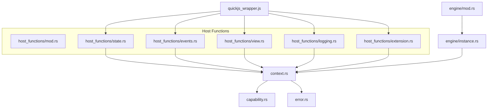
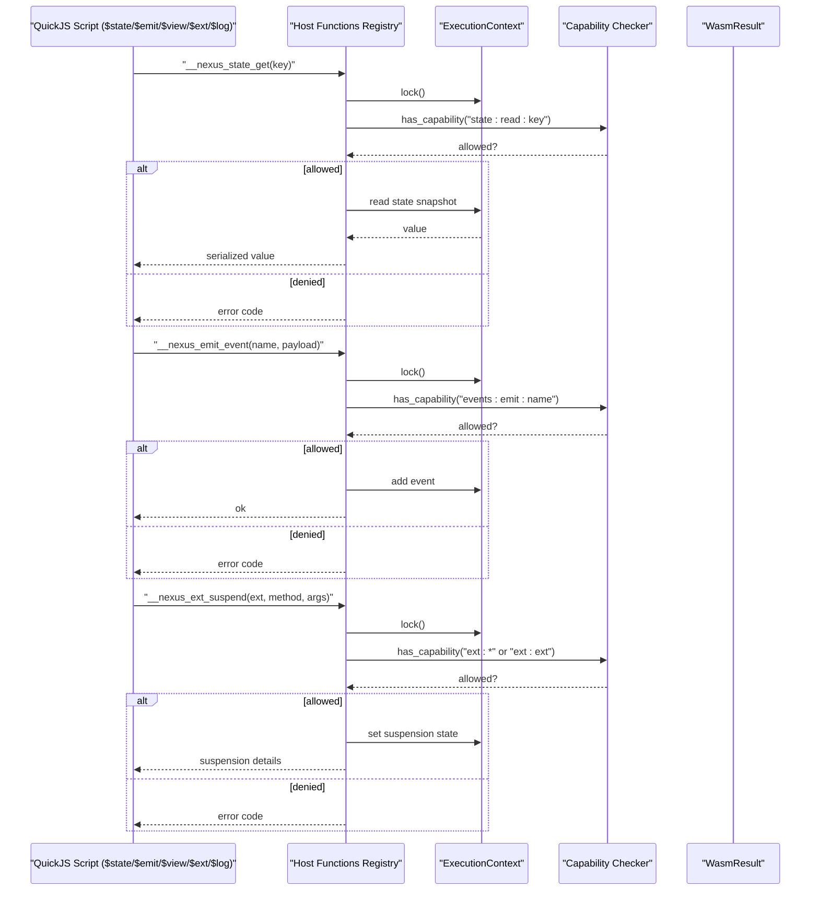
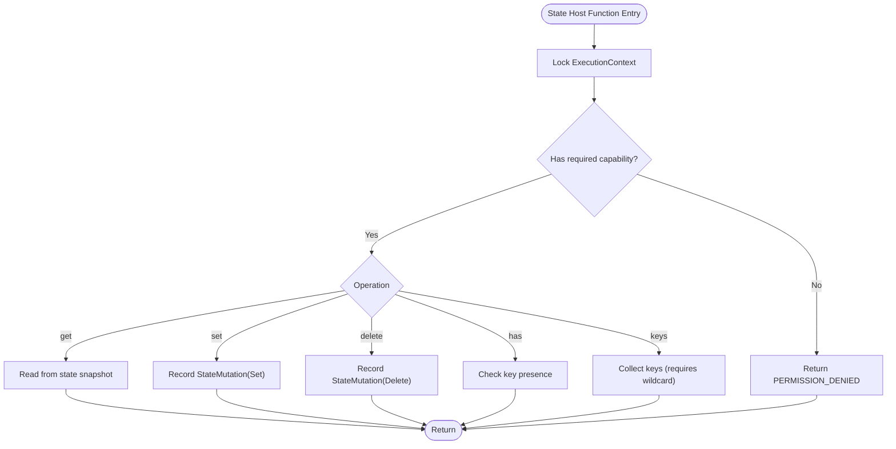
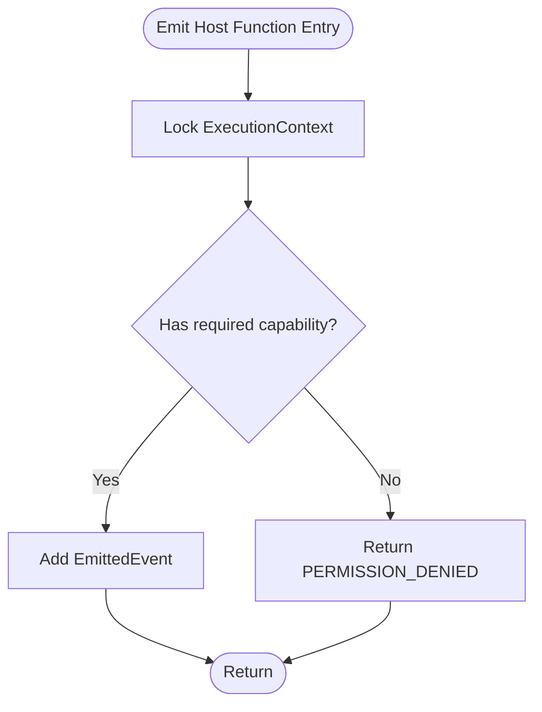
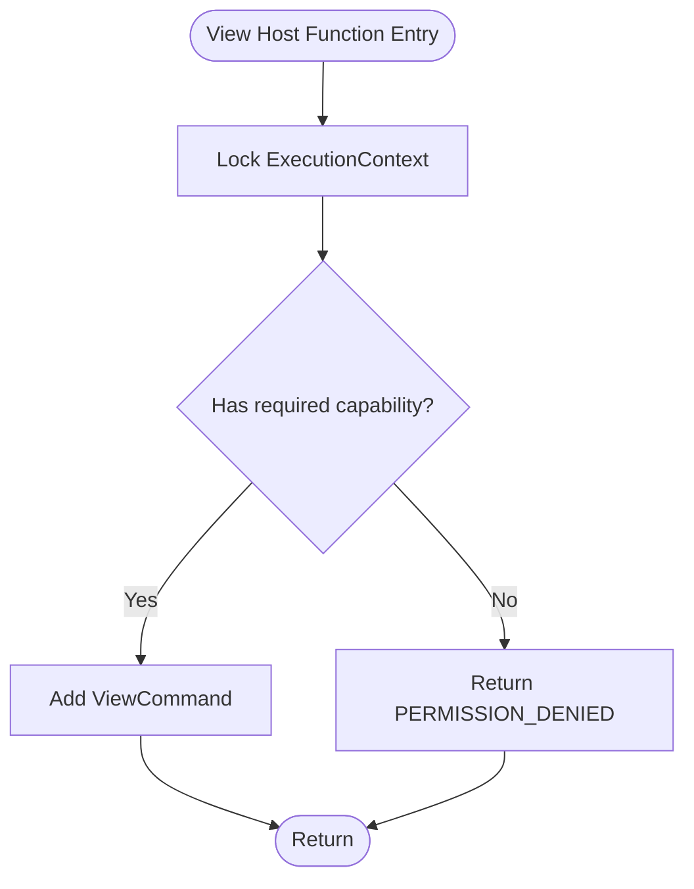
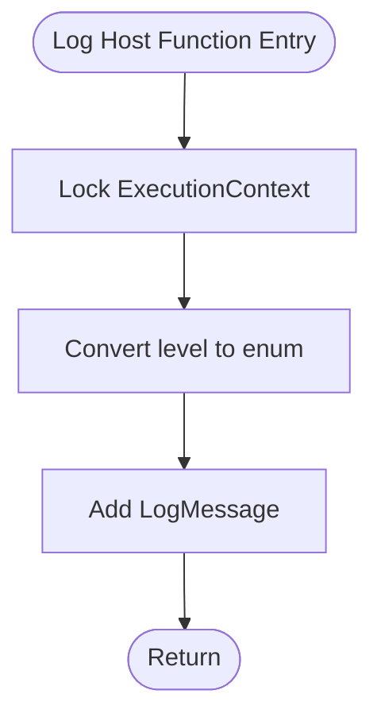
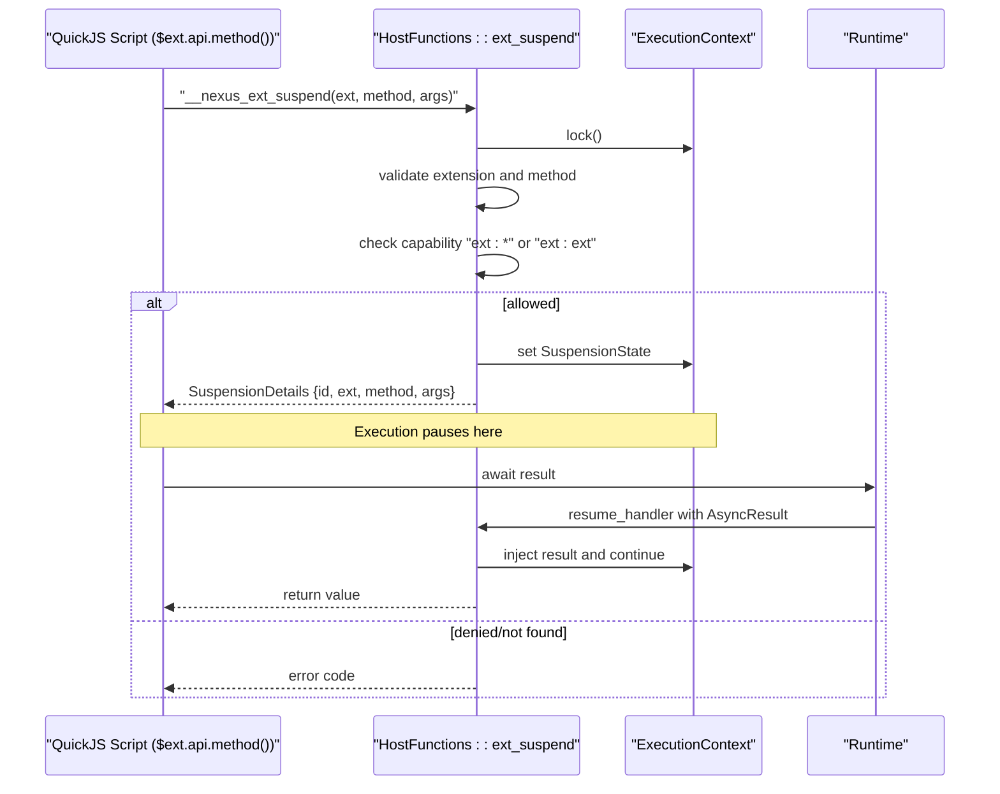
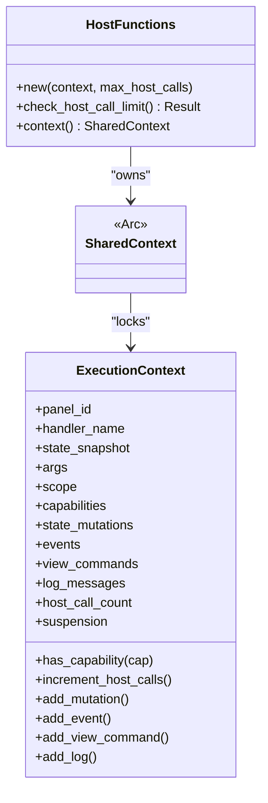
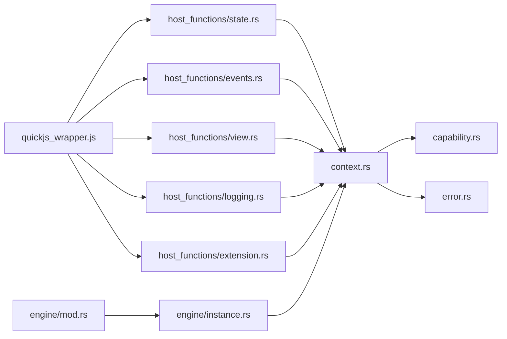

# Host Function Interface

<cite>
**Referenced Files in This Document**
- [lib.rs](file://runtime/nexus-wasm-bridge/src/lib.rs)
- [quickjs_wrapper.js](file://runtime/nexus-wasm-bridge/src/quickjs_wrapper.js)
- [host_functions/mod.rs](file://runtime/nexus-wasm-bridge/src/host_functions/mod.rs)
- [host_functions/state.rs](file://runtime/nexus-wasm-bridge/src/host_functions/state.rs)
- [host_functions/events.rs](file://runtime/nexus-wasm-bridge/src/host_functions/events.rs)
- [host_functions/view.rs](file://runtime/nexus-wasm-bridge/src/host_functions/view.rs)
- [host_functions/logging.rs](file://runtime/nexus-wasm-bridge/src/host_functions/logging.rs)
- [host_functions/extension.rs](file://runtime/nexus-wasm-bridge/src/host_functions/extension.rs)
- [context.rs](file://runtime/nexus-wasm-bridge/src/context.rs)
- [capability.rs](file://runtime/nexus-wasm-bridge/src/capability.rs)
- [error.rs](file://runtime/nexus-wasm-bridge/src/error.rs)
- [engine/mod.rs](file://runtime/nexus-wasm-bridge/src/engine/mod.rs)
- [engine/instance.rs](file://runtime/nexus-wasm-bridge/src/engine/instance.rs)
</cite>

## Table of Contents
1. [Introduction](#introduction)
2. [Project Structure](#project-structure)
3. [Core Components](#core-components)
4. [Architecture Overview](#architecture-overview)
5. [Detailed Component Analysis](#detailed-component-analysis)
6. [Dependency Analysis](#dependency-analysis)
7. [Performance Considerations](#performance-considerations)
8. [Troubleshooting Guide](#troubleshooting-guide)
9. [Conclusion](#conclusion)

## Introduction
This document describes the Host Function Interface that exposes native capabilities from Rust to the WASM JavaScript environment. The interface enables handlers to interact with the Nexus platform through five core host functions:
- __nexus_state_get/set/has/keys for state management
- __nexus_emit for event broadcasting
- __nexus_view_command for UI manipulation
- __nexus_log for logging
- __nexus_ext_suspend for extension access

It explains how WasmEdge’s host function API integrates with the Caller data pattern to access the execution context, outlines function signatures and return conventions, and demonstrates how the QuickJS wrapper script constructs the $state, $emit, $view, and $ext APIs. It also covers error handling strategies for invalid parameters and missing capabilities, and details the asynchronous extension call mechanism using suspension and resumption.

## Project Structure
The Host Function Interface spans several modules:
- Host function implementations under host_functions
- QuickJS wrapper that exposes $state, $emit, $view, $ext, $log, and $time
- Execution context and result types
- Capability-based security model
- Error codes and types
- Engine and instance lifecycle for execution and suspension

**Diagram sources**
- [host_functions/mod.rs](file://runtime/nexus-wasm-bridge/src/host_functions/mod.rs#L1-L92)
- [host_functions/state.rs](file://runtime/nexus-wasm-bridge/src/host_functions/state.rs#L1-L238)
- [host_functions/events.rs](file://runtime/nexus-wasm-bridge/src/host_functions/events.rs#L1-L155)
- [host_functions/view.rs](file://runtime/nexus-wasm-bridge/src/host_functions/view.rs#L1-L251)
- [host_functions/logging.rs](file://runtime/nexus-wasm-bridge/src/host_functions/logging.rs#L1-L170)
- [host_functions/extension.rs](file://runtime/nexus-wasm-bridge/src/host_functions/extension.rs#L1-L233)
- [quickjs_wrapper.js](file://runtime/nexus-wasm-bridge/src/quickjs_wrapper.js#L1-L411)
- [context.rs](file://runtime/nexus-wasm-bridge/src/context.rs#L1-L695)
- [capability.rs](file://runtime/nexus-wasm-bridge/src/capability.rs#L1-L384)
- [error.rs](file://runtime/nexus-wasm-bridge/src/error.rs#L1-L395)
- [engine/mod.rs](file://runtime/nexus-wasm-bridge/src/engine/mod.rs#L1-L244)
- [engine/instance.rs](file://runtime/nexus-wasm-bridge/src/engine/instance.rs#L1-L381)

**Section sources**
- [lib.rs](file://runtime/nexus-wasm-bridge/src/lib.rs#L1-L71)
- [quickjs_wrapper.js](file://runtime/nexus-wasm-bridge/src/quickjs_wrapper.js#L1-L411)
- [host_functions/mod.rs](file://runtime/nexus-wasm-bridge/src/host_functions/mod.rs#L1-L92)
- [context.rs](file://runtime/nexus-wasm-bridge/src/context.rs#L1-L695)
- [capability.rs](file://runtime/nexus-wasm-bridge/src/capability.rs#L1-L384)
- [error.rs](file://runtime/nexus-wasm-bridge/src/error.rs#L1-L395)
- [engine/mod.rs](file://runtime/nexus-wasm-bridge/src/engine/mod.rs#L1-L244)
- [engine/instance.rs](file://runtime/nexus-wasm-bridge/src/engine/instance.rs#L1-L381)

## Core Components
- HostFunctions registry: centralizes host function invocation, tracks host call counts, and provides access to the shared execution context.
- Five host function families:
  - State: get, set, delete, has, keys
  - Events: emit, toast convenience
  - View: setFilter, scrollTo, focus, custom command
  - Logging: log, debug/info/warn/error helpers, now
  - Extension: suspend (async), exists, methods, list
- QuickJS wrapper: injects $state, $emit, $view, $ext, $log, $time into the sandbox and serializes values using a minimal encoder/decoder.
- Execution context: holds state snapshot, mutations, events, view commands, logs, and suspension state; provides capability checks and counters.
- Capability system: token-based permissions scoped to state keys, event names, view components, and extension names.
- Error codes and types: unified error codes and structured error reporting.

**Section sources**
- [host_functions/mod.rs](file://runtime/nexus-wasm-bridge/src/host_functions/mod.rs#L1-L92)
- [host_functions/state.rs](file://runtime/nexus-wasm-bridge/src/host_functions/state.rs#L1-L238)
- [host_functions/events.rs](file://runtime/nexus-wasm-bridge/src/host_functions/events.rs#L1-L155)
- [host_functions/view.rs](file://runtime/nexus-wasm-bridge/src/host_functions/view.rs#L1-L251)
- [host_functions/logging.rs](file://runtime/nexus-wasm-bridge/src/host_functions/logging.rs#L1-L170)
- [host_functions/extension.rs](file://runtime/nexus-wasm-bridge/src/host_functions/extension.rs#L1-L233)
- [quickjs_wrapper.js](file://runtime/nexus-wasm-bridge/src/quickjs_wrapper.js#L1-L411)
- [context.rs](file://runtime/nexus-wasm-bridge/src/context.rs#L1-L695)
- [capability.rs](file://runtime/nexus-wasm-bridge/src/capability.rs#L1-L384)
- [error.rs](file://runtime/nexus-wasm-bridge/src/error.rs#L1-L395)

## Architecture Overview
The Host Function Interface operates within a WasmEdge-based runtime. The QuickJS wrapper script runs inside the WASM sandbox and invokes host functions exported by Rust. The Caller data pattern provides access to a shared execution context that enforces capabilities and collects side effects (mutations, events, view commands, logs).

**Diagram sources**
- [host_functions/mod.rs](file://runtime/nexus-wasm-bridge/src/host_functions/mod.rs#L1-L92)
- [host_functions/state.rs](file://runtime/nexus-wasm-bridge/src/host_functions/state.rs#L1-L238)
- [host_functions/events.rs](file://runtime/nexus-wasm-bridge/src/host_functions/events.rs#L1-L155)
- [host_functions/extension.rs](file://runtime/nexus-wasm-bridge/src/host_functions/extension.rs#L1-L233)
- [context.rs](file://runtime/nexus-wasm-bridge/src/context.rs#L538-L640)
- [capability.rs](file://runtime/nexus-wasm-bridge/src/capability.rs#L1-L384)

## Detailed Component Analysis

### State Host Functions
- Purpose: Provide read/write access to the panel’s reactive state snapshot and record mutations for later application.
- Functions:
  - __nexus_state_get(key): returns serialized value or null if not found
  - __nexus_state_set(key, value): records a set mutation
  - __nexus_state_delete(key): records a delete mutation
  - __nexus_state_has(key): checks presence
  - __nexus_state_keys(): lists keys (requires wildcard read capability)
- Capability enforcement:
  - Read: state:read:{key} or state:read:*
  - Write: state:write:{key} or state:write:*
- Return convention:
  - Success: ok (no explicit value)
  - Failure: error code (permission denied, resource limit)
- Error handling:
  - Permission denied when capability check fails
  - Host call limit enforced by HostFunctions::check_host_call_limit

**Diagram sources**
- [host_functions/state.rs](file://runtime/nexus-wasm-bridge/src/host_functions/state.rs#L1-L238)
- [context.rs](file://runtime/nexus-wasm-bridge/src/context.rs#L538-L640)
- [capability.rs](file://runtime/nexus-wasm-bridge/src/capability.rs#L1-L384)
- [host_functions/mod.rs](file://runtime/nexus-wasm-bridge/src/host_functions/mod.rs#L1-L92)

**Section sources**
- [host_functions/state.rs](file://runtime/nexus-wasm-bridge/src/host_functions/state.rs#L1-L238)
- [context.rs](file://runtime/nexus-wasm-bridge/src/context.rs#L297-L361)
- [capability.rs](file://runtime/nexus-wasm-bridge/src/capability.rs#L1-L384)
- [host_functions/mod.rs](file://runtime/nexus-wasm-bridge/src/host_functions/mod.rs#L1-L92)

### Event Host Functions
- Purpose: Allow handlers to emit events that propagate to the host system.
- Functions:
  - __nexus_emit_event(name, payload): records an emitted event
  - Convenience: emit_toast(message, type) builds a toast event payload
- Capability enforcement:
  - events:emit:{name} or events:emit:*
- Return convention:
  - Success: ok
  - Failure: error code (permission denied)
- Error handling:
  - Permission denied when capability check fails

**Diagram sources**
- [host_functions/events.rs](file://runtime/nexus-wasm-bridge/src/host_functions/events.rs#L1-L155)
- [context.rs](file://runtime/nexus-wasm-bridge/src/context.rs#L341-L361)
- [capability.rs](file://runtime/nexus-wasm-bridge/src/capability.rs#L1-L384)

**Section sources**
- [host_functions/events.rs](file://runtime/nexus-wasm-bridge/src/host_functions/events.rs#L1-L155)
- [context.rs](file://runtime/nexus-wasm-bridge/src/context.rs#L341-L361)
- [capability.rs](file://runtime/nexus-wasm-bridge/src/capability.rs#L1-L384)

### View Host Functions
- Purpose: Enable imperative UI manipulation by sending view commands.
- Functions:
  - __nexus_view_command(component_id?, command_type, args): records a view command
  - Helpers: setFilter, scrollTo, focus, custom
- Capability enforcement:
  - view:update:{component_id} or view:update:*
- Return convention:
  - Success: ok
  - Failure: error code (permission denied)
- Error handling:
  - Permission denied when capability check fails

**Diagram sources**
- [host_functions/view.rs](file://runtime/nexus-wasm-bridge/src/host_functions/view.rs#L1-L251)
- [context.rs](file://runtime/nexus-wasm-bridge/src/context.rs#L362-L424)
- [capability.rs](file://runtime/nexus-wasm-bridge/src/capability.rs#L1-L384)

**Section sources**
- [host_functions/view.rs](file://runtime/nexus-wasm-bridge/src/host_functions/view.rs#L1-L251)
- [context.rs](file://runtime/nexus-wasm-bridge/src/context.rs#L362-L424)
- [capability.rs](file://runtime/nexus-wasm-bridge/src/capability.rs#L1-L384)

### Logging Host Functions
- Purpose: Provide safe logging without requiring capabilities; captures logs in the execution context.
- Functions:
  - __nexus_log(level, message): records a log message
  - Helpers: __nexus_log_debug/info/warn/error
  - __nexus_now(): returns current timestamp in milliseconds
- Capability enforcement:
  - None required
- Return convention:
  - Success: ok
  - Failure: error code (not applicable; logging is always allowed)
- Error handling:
  - Always succeeds; logs are captured for downstream consumption

**Diagram sources**
- [host_functions/logging.rs](file://runtime/nexus-wasm-bridge/src/host_functions/logging.rs#L1-L170)
- [context.rs](file://runtime/nexus-wasm-bridge/src/context.rs#L606-L640)

**Section sources**
- [host_functions/logging.rs](file://runtime/nexus-wasm-bridge/src/host_functions/logging.rs#L1-L170)
- [context.rs](file://runtime/nexus-wasm-bridge/src/context.rs#L606-L640)

### Extension Host Functions (Async)
- Purpose: Enable async extension calls using suspension and resumption.
- Functions:
  - __nexus_ext_suspend(ext_name, method, args): creates a suspension and returns suspension details
  - __nexus_ext_exists(ext_name): checks availability
  - __nexus_ext_methods(ext_name): lists methods
  - __nexus_ext_list(): lists extensions
- Capability enforcement:
  - ext:* or ext:{ext_name}
- Return convention:
  - Success: ok or suspension details
  - Failure: error code (permission denied or not found)
- Error handling:
  - Permission denied when capability check fails
  - Not found when extension or method is unknown

**Diagram sources**
- [host_functions/extension.rs](file://runtime/nexus-wasm-bridge/src/host_functions/extension.rs#L1-L233)
- [context.rs](file://runtime/nexus-wasm-bridge/src/context.rs#L425-L494)
- [engine/mod.rs](file://runtime/nexus-wasm-bridge/src/engine/mod.rs#L167-L194)

**Section sources**
- [host_functions/extension.rs](file://runtime/nexus-wasm-bridge/src/host_functions/extension.rs#L1-L233)
- [context.rs](file://runtime/nexus-wasm-bridge/src/context.rs#L425-L494)
- [engine/mod.rs](file://runtime/nexus-wasm-bridge/src/engine/mod.rs#L167-L194)

### QuickJS Wrapper APIs
- $state: get, set, delete, has, keys, update
- $emit: emit(name, payload) with toast convenience
- $view: setFilter, scrollTo, focus, command
- $ext: dynamic proxy that resolves to extension methods; async calls suspend execution until resumed
- $log: debug, info, warn, error
- $time.now(): timestamp utility

The wrapper injects host function imports and serializes values using a minimal encoder/decoder. It validates parameter types and throws typed errors for invalid inputs.

**Section sources**
- [quickjs_wrapper.js](file://runtime/nexus-wasm-bridge/src/quickjs_wrapper.js#L1-L411)

### Caller Data Pattern and WasmEdge Integration
- The Caller data pattern allows host functions to access the shared execution context stored in the WasmEdge Caller.
- The HostFunctions registry wraps the shared context and enforces host call limits.
- During execution, the engine sets up the execution context and transitions instances between Idle, Executing, and Suspended states.

**Diagram sources**
- [host_functions/mod.rs](file://runtime/nexus-wasm-bridge/src/host_functions/mod.rs#L1-L92)
- [context.rs](file://runtime/nexus-wasm-bridge/src/context.rs#L495-L640)

**Section sources**
- [host_functions/mod.rs](file://runtime/nexus-wasm-bridge/src/host_functions/mod.rs#L1-L92)
- [context.rs](file://runtime/nexus-wasm-bridge/src/context.rs#L495-L640)
- [engine/instance.rs](file://runtime/nexus-wasm-bridge/src/engine/instance.rs#L118-L211)

## Dependency Analysis
- Host functions depend on:
  - ExecutionContext for state snapshot, mutations, events, view commands, logs, and suspension
  - Capability tokens for enforcing permissions
  - Error codes for consistent error signaling
- QuickJS wrapper depends on host function exports and provides a typed API surface to handlers.
- Engine and instance manage lifecycle, suspension, and resumption.

**Diagram sources**
- [quickjs_wrapper.js](file://runtime/nexus-wasm-bridge/src/quickjs_wrapper.js#L1-L411)
- [host_functions/state.rs](file://runtime/nexus-wasm-bridge/src/host_functions/state.rs#L1-L238)
- [host_functions/events.rs](file://runtime/nexus-wasm-bridge/src/host_functions/events.rs#L1-L155)
- [host_functions/view.rs](file://runtime/nexus-wasm-bridge/src/host_functions/view.rs#L1-L251)
- [host_functions/logging.rs](file://runtime/nexus-wasm-bridge/src/host_functions/logging.rs#L1-L170)
- [host_functions/extension.rs](file://runtime/nexus-wasm-bridge/src/host_functions/extension.rs#L1-L233)
- [context.rs](file://runtime/nexus-wasm-bridge/src/context.rs#L1-L695)
- [capability.rs](file://runtime/nexus-wasm-bridge/src/capability.rs#L1-L384)
- [error.rs](file://runtime/nexus-wasm-bridge/src/error.rs#L1-L395)
- [engine/mod.rs](file://runtime/nexus-wasm-bridge/src/engine/mod.rs#L1-L244)
- [engine/instance.rs](file://runtime/nexus-wasm-bridge/src/engine/instance.rs#L1-L381)

**Section sources**
- [quickjs_wrapper.js](file://runtime/nexus-wasm-bridge/src/quickjs_wrapper.js#L1-L411)
- [host_functions/state.rs](file://runtime/nexus-wasm-bridge/src/host_functions/state.rs#L1-L238)
- [host_functions/events.rs](file://runtime/nexus-wasm-bridge/src/host_functions/events.rs#L1-L155)
- [host_functions/view.rs](file://runtime/nexus-wasm-bridge/src/host_functions/view.rs#L1-L251)
- [host_functions/logging.rs](file://runtime/nexus-wasm-bridge/src/host_functions/logging.rs#L1-L170)
- [host_functions/extension.rs](file://runtime/nexus-wasm-bridge/src/host_functions/extension.rs#L1-L233)
- [context.rs](file://runtime/nexus-wasm-bridge/src/context.rs#L1-L695)
- [capability.rs](file://runtime/nexus-wasm-bridge/src/capability.rs#L1-L384)
- [error.rs](file://runtime/nexus-wasm-bridge/src/error.rs#L1-L395)
- [engine/mod.rs](file://runtime/nexus-wasm-bridge/src/engine/mod.rs#L1-L244)
- [engine/instance.rs](file://runtime/nexus-wasm-bridge/src/engine/instance.rs#L1-L381)

## Performance Considerations
- Host call limiting: HostFunctions::check_host_call_limit prevents excessive host calls per execution.
- Resource limits: The engine enforces timeouts and tracks memory usage; consider configuring limits appropriately.
- Serialization overhead: The wrapper uses a minimal encoder/decoder; keep payloads compact.
- Suspension minimizes blocking: Async extension calls suspend execution and resume efficiently.

[No sources needed since this section provides general guidance]

## Troubleshooting Guide
Common issues and resolutions:
- Permission denied:
  - Ensure the handler has the appropriate capability token (e.g., state:read:{key}, events:emit:{name}, view:update:{id}, ext:{name}).
  - Verify capability parsing and matching logic.
- Not found:
  - Extension or method not registered; confirm extension registry and method lists.
- Resource limit exceeded:
  - Host call limit reached; reduce host calls or increase limits.
- Invalid argument:
  - Parameter types must match expectations (e.g., string keys for state).
- Execution errors:
  - Inspect WasmError for code, stack, and location; adjust handler code accordingly.

**Section sources**
- [capability.rs](file://runtime/nexus-wasm-bridge/src/capability.rs#L1-L384)
- [error.rs](file://runtime/nexus-wasm-bridge/src/error.rs#L1-L395)
- [host_functions/mod.rs](file://runtime/nexus-wasm-bridge/src/host_functions/mod.rs#L1-L92)
- [host_functions/extension.rs](file://runtime/nexus-wasm-bridge/src/host_functions/extension.rs#L1-L233)

## Conclusion
The Host Function Interface provides a secure, capability-gated bridge between the WASM JavaScript environment and the Nexus platform. Through the Caller data pattern, host functions access a shared execution context to enforce permissions, collect side effects, and coordinate asynchronous extension calls. The QuickJS wrapper exposes ergonomic APIs ($state, $emit, $view, $ext, $log, $time) that serialize values and integrate seamlessly with the host function ecosystem. Proper capability configuration and error handling ensure predictable and safe interactions.