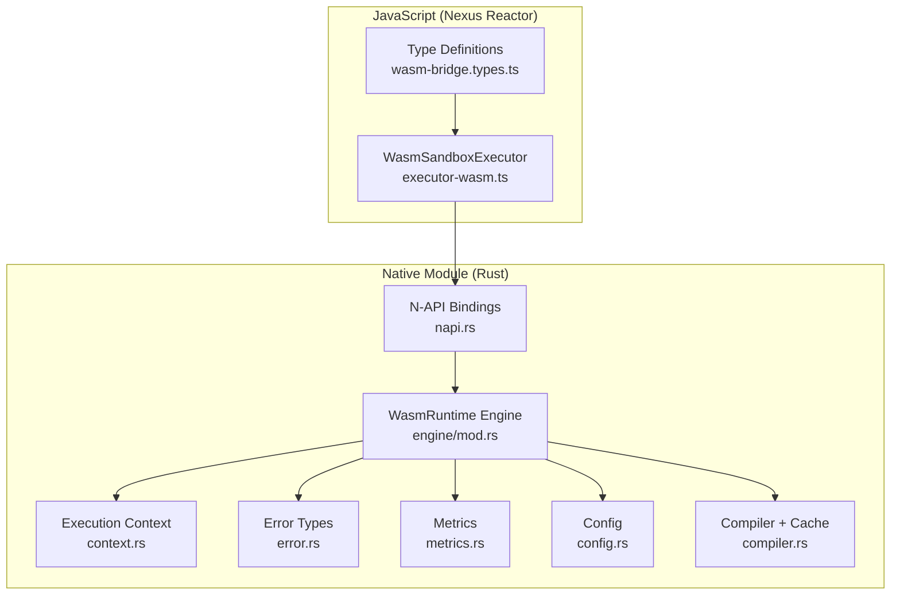
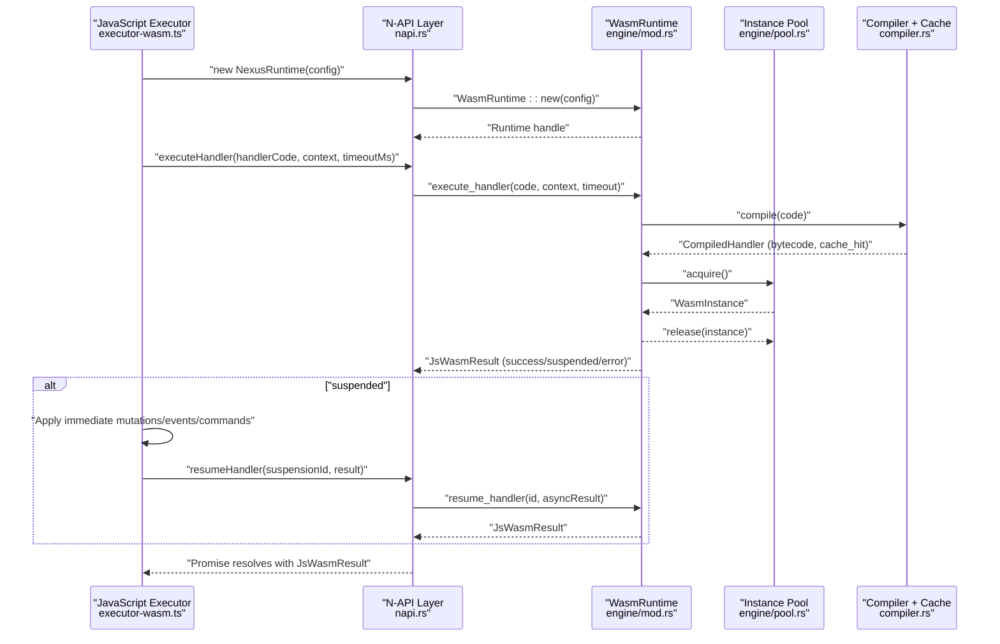
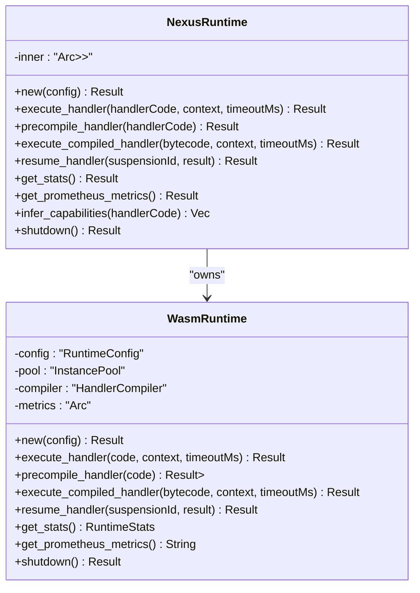
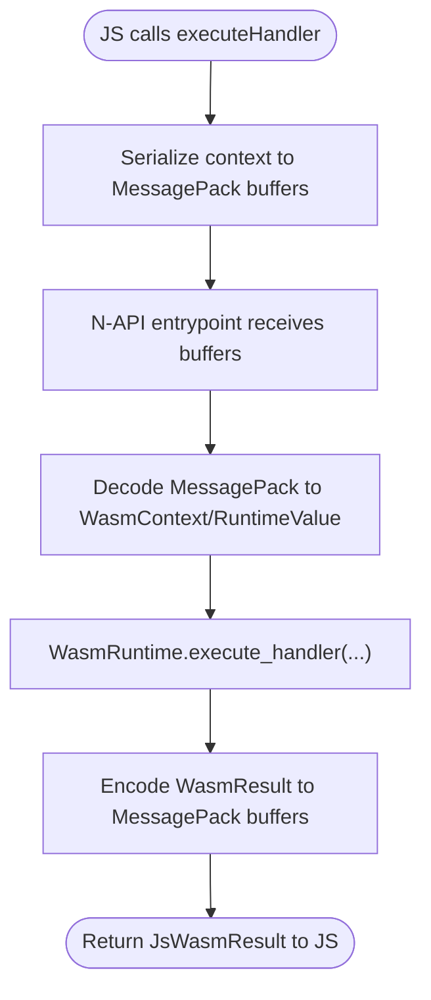
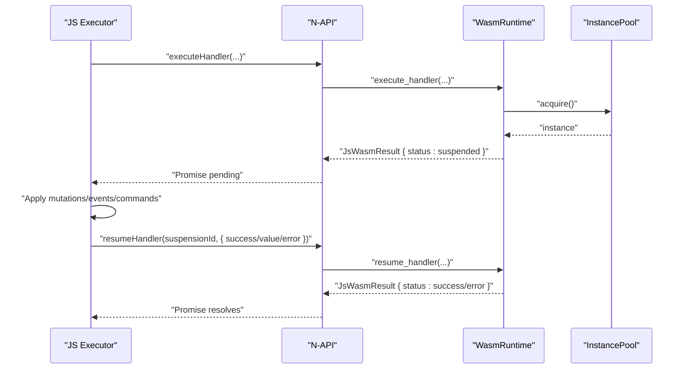
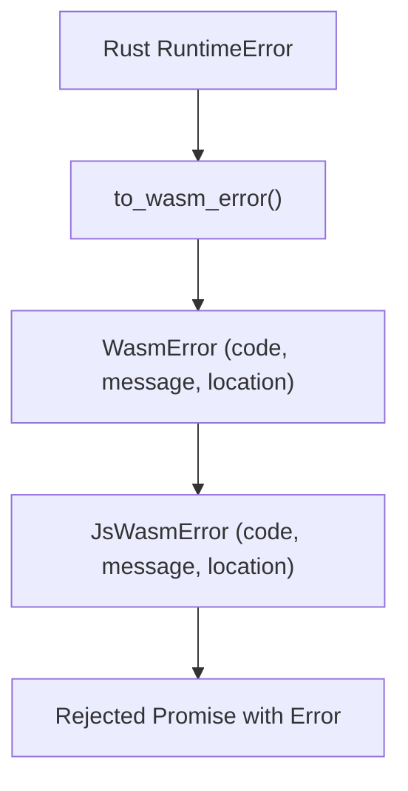
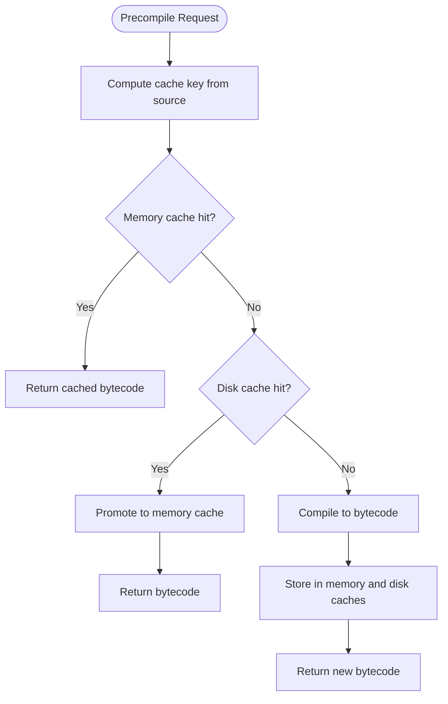
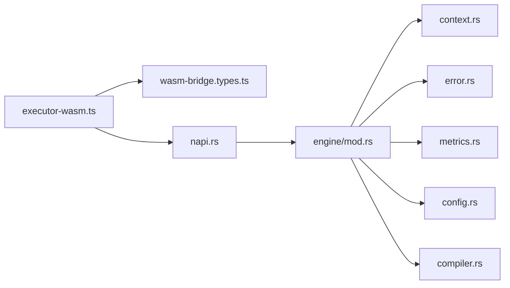

# N-API Integration

<cite>
**Referenced Files in This Document**
- [lib.rs](file://runtime/nexus-wasm-bridge/src/lib.rs)
- [napi.rs](file://runtime/nexus-wasm-bridge/src/napi.rs)
- [Cargo.toml](file://runtime/nexus-wasm-bridge/Cargo.toml)
- [mod.rs](file://runtime/nexus-wasm-bridge/src/engine/mod.rs)
- [compiler.rs](file://runtime/nexus-wasm-bridge/src/engine/compiler.rs)
- [context.rs](file://runtime/nexus-wasm-bridge/src/context.rs)
- [error.rs](file://runtime/nexus-wasm-bridge/src/error.rs)
- [metrics.rs](file://runtime/nexus-wasm-bridge/src/metrics.rs)
- [config.rs](file://runtime/nexus-wasm-bridge/src/config.rs)
- [executor-wasm.ts](file://packages/nexus-reactor/src/sandbox/executor-wasm.ts)
- [wasm-bridge.types.ts](file://packages/nexus-reactor/src/sandbox/wasm-bridge.types.ts)
- [02_runtime_spec.md](file://docs/02_runtime_spec.md)
- [wasmedge_migration_strategy.md](file://docs/wasmedge_migration_strategy.md)
- [quickjs_wrapper.js](file://runtime/nexus-wasm-bridge/src/quickjs_wrapper.js)
</cite>

## Table of Contents
1. [Introduction](#introduction)
2. [Project Structure](#project-structure)
3. [Core Components](#core-components)
4. [Architecture Overview](#architecture-overview)
5. [Detailed Component Analysis](#detailed-component-analysis)
6. [Dependency Analysis](#dependency-analysis)
7. [Performance Considerations](#performance-considerations)
8. [Troubleshooting Guide](#troubleshooting-guide)
9. [Conclusion](#conclusion)
10. [Appendices](#appendices)

## Introduction
This document explains the N-API Integration layer that enables the Nexus Reactor to invoke WASM execution from JavaScript. The napi-rs crate provides a Node.js-compatible Foreign Function Interface (FFI) that exposes a Rust-backed WasmRuntime to JavaScript. The integration focuses on:
- The public FFI interface: NexusRuntime struct and its methods for initialization, async execution, and ahead-of-time compilation.
- Data flow across the N-API boundary: argument marshaling and result serialization using MessagePack buffers.
- Async/await pattern using a Tokio runtime in Rust and Promise resolution in Node.js.
- Error mapping from Rust Result types to JavaScript Error objects.
- Memory management considerations at the N-API boundary, including buffer handling and object lifetime management.
- Performance optimization techniques such as zero-copy data transfer and efficient context switching.

## Project Structure
The N-API integration spans two primary areas:
- Rust side: runtime/nexus-wasm-bridge exposes the FFI surface via napi-rs and implements the WasmRuntime engine.
- JavaScript side: packages/nexus-reactor consumes the native module and orchestrates handler execution.

**Diagram sources**
- [napi.rs](file://runtime/nexus-wasm-bridge/src/napi.rs#L277-L438)
- [mod.rs](file://runtime/nexus-wasm-bridge/src/engine/mod.rs#L20-L219)
- [context.rs](file://runtime/nexus-wasm-bridge/src/context.rs#L120-L233)
- [error.rs](file://runtime/nexus-wasm-bridge/src/error.rs#L1-L120)
- [metrics.rs](file://runtime/nexus-wasm-bridge/src/metrics.rs#L1-L120)
- [config.rs](file://runtime/nexus-wasm-bridge/src/config.rs#L34-L88)
- [compiler.rs](file://runtime/nexus-wasm-bridge/src/engine/compiler.rs#L1-L84)
- [executor-wasm.ts](file://packages/nexus-reactor/src/sandbox/executor-wasm.ts#L1-L120)
- [wasm-bridge.types.ts](file://packages/nexus-reactor/src/sandbox/wasm-bridge.types.ts#L258-L330)

**Section sources**
- [lib.rs](file://runtime/nexus-wasm-bridge/src/lib.rs#L1-L71)
- [Cargo.toml](file://runtime/nexus-wasm-bridge/Cargo.toml#L1-L63)

## Core Components
- NexusRuntime (N-API): Exposes the public FFI surface to Node.js, including constructor, async methods for execution and compilation, and lifecycle controls.
- WasmRuntime (Rust engine): Manages instance pooling, compilation caching, execution timeouts, and metrics collection.
- Context and Result types: Define the shape of data exchanged across boundaries and the outcomes of execution.
- Error mapping: Converts Rust errors into JavaScript-friendly error objects with codes and locations.
- Metrics and configuration: Provide runtime statistics and tunable limits.

**Section sources**
- [napi.rs](file://runtime/nexus-wasm-bridge/src/napi.rs#L277-L438)
- [mod.rs](file://runtime/nexus-wasm-bridge/src/engine/mod.rs#L20-L219)
- [context.rs](file://runtime/nexus-wasm-bridge/src/context.rs#L120-L233)
- [error.rs](file://runtime/nexus-wasm-bridge/src/error.rs#L1-L120)
- [metrics.rs](file://runtime/nexus-wasm-bridge/src/metrics.rs#L1-L120)
- [config.rs](file://runtime/nexus-wasm-bridge/src/config.rs#L34-L88)

## Architecture Overview
The integration follows a layered architecture:
- JavaScript layer constructs a WasmContext and invokes NexusRuntime methods.
- N-API layer marshals JavaScript values into Rust types and serializes results back to JavaScript using MessagePack buffers.
- Rust engine executes handlers inside pooled WASM instances, with optional precompilation and caching.
- Async operations are modeled as suspension/resume cycles, enabling JavaScript to perform I/O and resume execution.

**Diagram sources**
- [napi.rs](file://runtime/nexus-wasm-bridge/src/napi.rs#L298-L360)
- [mod.rs](file://runtime/nexus-wasm-bridge/src/engine/mod.rs#L55-L165)
- [compiler.rs](file://runtime/nexus-wasm-bridge/src/engine/compiler.rs#L168-L214)
- [executor-wasm.ts](file://packages/nexus-reactor/src/sandbox/executor-wasm.ts#L88-L171)

## Detailed Component Analysis

### Public FFI Interface: NexusRuntime
NexusRuntime is the primary N-API surface exposed to Node.js. It wraps an internal WasmRuntime behind an Arc<RwLock<Option<WasmRuntime>>> to support safe async access and graceful shutdown.

Key methods:
- Constructor: Initializes the runtime with a JavaScript-friendly configuration and converts it to Rust’s RuntimeConfig.
- execute_handler: Asynchronously compiles and executes a handler, marshaling context and returning a structured result.
- precompile_handler: Produces compiled bytecode for later execution.
- execute_compiled_handler: Executes pre-compiled bytecode with a given context.
- resume_handler: Resumes a suspended execution with the result of an async operation.
- get_stats/get_prometheus_metrics: Provides runtime statistics and Prometheus-formatted metrics.
- infer_capabilities: Static analysis to infer required capabilities from handler code.
- shutdown: Safely shuts down the runtime and releases resources.

**Diagram sources**
- [napi.rs](file://runtime/nexus-wasm-bridge/src/napi.rs#L277-L438)
- [mod.rs](file://runtime/nexus-wasm-bridge/src/engine/mod.rs#L20-L219)

**Section sources**
- [napi.rs](file://runtime/nexus-wasm-bridge/src/napi.rs#L277-L438)
- [wasmedge_migration_strategy.md](file://docs/wasmedge_migration_strategy.md#L205-L231)

### Data Flow Across N-API: Marshaling and Serialization
The integration uses MessagePack-encoded buffers for efficient cross-boundary data transfer:
- JavaScript values are serialized to MessagePack buffers before crossing into Rust.
- Rust deserializes buffers into typed structures (e.g., WasmContext, RuntimeValue).
- Results are serialized back to MessagePack buffers for JavaScript consumption.

Marshaling highlights:
- JsWasmContext fields (state, args, scope) are Buffer-typed and decoded via rmp-serde.
- WasmResult fields (return_value, state_mutations, events, view_commands) are encoded to Buffer arrays.
- Suspension details and AsyncResult are also MessagePack-encoded for resume flows.

**Diagram sources**
- [napi.rs](file://runtime/nexus-wasm-bridge/src/napi.rs#L50-L174)
- [context.rs](file://runtime/nexus-wasm-bridge/src/context.rs#L120-L233)

**Section sources**
- [napi.rs](file://runtime/nexus-wasm-bridge/src/napi.rs#L50-L174)
- [context.rs](file://runtime/nexus-wasm-bridge/src/context.rs#L120-L233)
- [quickjs_wrapper.js](file://runtime/nexus-wasm-bridge/src/quickjs_wrapper.js#L50-L67)

### Async/Await Pattern and Suspension/Resume
The Reactor’s executor implements a suspend/resume loop:
- On success, the handler returns a result with immediate effects applied locally.
- On suspension, the executor applies intermediate state mutations, emits events, and executes view commands immediately.
- JavaScript performs the awaited I/O and calls resumeHandler with either success or error.
- The engine resumes execution and continues until completion or another suspension.

**Diagram sources**
- [executor-wasm.ts](file://packages/nexus-reactor/src/sandbox/executor-wasm.ts#L132-L171)
- [napi.rs](file://runtime/nexus-wasm-bridge/src/napi.rs#L362-L382)
- [mod.rs](file://runtime/nexus-wasm-bridge/src/engine/mod.rs#L167-L194)

**Section sources**
- [executor-wasm.ts](file://packages/nexus-reactor/src/sandbox/executor-wasm.ts#L132-L171)
- [napi.rs](file://runtime/nexus-wasm-bridge/src/napi.rs#L362-L382)
- [mod.rs](file://runtime/nexus-wasm-bridge/src/engine/mod.rs#L167-L194)

### Error Mapping from Rust to JavaScript
Errors are represented consistently across boundaries:
- Rust RuntimeError is converted to WasmError for transport.
- WasmError includes code, message, optional stack, location, snippet, and context.
- The N-API layer surfaces errors as JavaScript Error objects with mapped details.

**Diagram sources**
- [error.rs](file://runtime/nexus-wasm-bridge/src/error.rs#L293-L315)
- [napi.rs](file://runtime/nexus-wasm-bridge/src/napi.rs#L176-L222)

**Section sources**
- [error.rs](file://runtime/nexus-wasm-bridge/src/error.rs#L1-L120)
- [error.rs](file://runtime/nexus-wasm-bridge/src/error.rs#L293-L315)
- [napi.rs](file://runtime/nexus-wasm-bridge/src/napi.rs#L176-L222)

### Memory Management and Buffer Handling
- Buffer ownership: N-API Buffer objects are passed across the boundary as raw bytes. Rust re-encodes results into Buffer instances for return.
- Lifetime: The N-API layer holds references to buffers only for the duration of marshaling/unmarshaling. No long-lived shared pointers are maintained.
- Zero-copy considerations: While the current implementation encodes/decodes via MessagePack, minimizing copies is constrained by the need for structured serialization. The engine avoids unnecessary cloning of large payloads by passing buffers directly where possible.

**Section sources**
- [napi.rs](file://runtime/nexus-wasm-bridge/src/napi.rs#L50-L174)
- [napi.rs](file://runtime/nexus-wasm-bridge/src/napi.rs#L134-L174)

### Ahead-of-Time Compilation and Caching
- Precompilation: The engine compiles handler code to bytecode and caches it in memory and on disk.
- Cache keys: Derived from source hash plus versioning to invalidate on upgrades.
- LRU eviction: Ensures cache size remains within configured limits.
- Precompiled execution: Skips compilation and marks cache_hit=true for improved latency.

**Diagram sources**
- [compiler.rs](file://runtime/nexus-wasm-bridge/src/engine/compiler.rs#L168-L214)
- [compiler.rs](file://runtime/nexus-wasm-bridge/src/engine/compiler.rs#L228-L318)

**Section sources**
- [compiler.rs](file://runtime/nexus-wasm-bridge/src/engine/compiler.rs#L1-L84)
- [compiler.rs](file://runtime/nexus-wasm-bridge/src/engine/compiler.rs#L168-L214)
- [compiler.rs](file://runtime/nexus-wasm-bridge/src/engine/compiler.rs#L228-L318)

## Dependency Analysis
The N-API layer depends on the engine, context, error, metrics, and configuration modules. The Reactor’s executor depends on the N-API module and type definitions.

**Diagram sources**
- [executor-wasm.ts](file://packages/nexus-reactor/src/sandbox/executor-wasm.ts#L1-L120)
- [wasm-bridge.types.ts](file://packages/nexus-reactor/src/sandbox/wasm-bridge.types.ts#L258-L330)
- [napi.rs](file://runtime/nexus-wasm-bridge/src/napi.rs#L277-L438)
- [mod.rs](file://runtime/nexus-wasm-bridge/src/engine/mod.rs#L20-L219)
- [context.rs](file://runtime/nexus-wasm-bridge/src/context.rs#L120-L233)
- [error.rs](file://runtime/nexus-wasm-bridge/src/error.rs#L1-L120)
- [metrics.rs](file://runtime/nexus-wasm-bridge/src/metrics.rs#L1-L120)
- [config.rs](file://runtime/nexus-wasm-bridge/src/config.rs#L34-L88)
- [compiler.rs](file://runtime/nexus-wasm-bridge/src/engine/compiler.rs#L1-L84)

**Section sources**
- [Cargo.toml](file://runtime/nexus-wasm-bridge/Cargo.toml#L1-L63)
- [lib.rs](file://runtime/nexus-wasm-bridge/src/lib.rs#L32-L48)

## Performance Considerations
- Instance pooling: Reuse WASM instances to reduce startup overhead and improve throughput.
- Compilation caching: Persist bytecode to disk and memory to minimize repeated compilation costs.
- Timeout enforcement: Prevent runaway handlers with configurable time limits.
- Metrics and observability: Track execution time, memory usage, host calls, and cache hit rates.
- Minimize copies: Prefer buffer-based transfers and avoid unnecessary deep cloning in JavaScript before sending to Rust.

[No sources needed since this section provides general guidance]

## Troubleshooting Guide
Common issues and remedies:
- Runtime creation failures: Validate configuration values and ensure cache directories are writable.
- Execution timeouts: Increase timeoutMs or optimize handler logic; inspect metrics for cache hit rates.
- Serialization errors: Verify MessagePack buffers are non-empty and correctly formatted.
- Capability denials: Review inferred or declared capabilities and adjust grants accordingly.
- Suspension not found: Ensure suspensionId is preserved and passed correctly to resumeHandler.

**Section sources**
- [config.rs](file://runtime/nexus-wasm-bridge/src/config.rs#L145-L168)
- [error.rs](file://runtime/nexus-wasm-bridge/src/error.rs#L293-L315)
- [metrics.rs](file://runtime/nexus-wasm-bridge/src/metrics.rs#L284-L339)
- [executor-wasm.ts](file://packages/nexus-reactor/src/sandbox/executor-wasm.ts#L132-L171)

## Conclusion
The N-API Integration layer provides a robust, high-performance bridge between Node.js and Rust-backed WASM execution. It offers a clean FFI surface, structured data exchange via MessagePack, resilient async handling with suspension/resume, and comprehensive error mapping. With instance pooling, compilation caching, and detailed metrics, it supports scalable and observable handler execution suitable for interactive UI scenarios.

[No sources needed since this section summarizes without analyzing specific files]

## Appendices

### API Reference: NexusRuntime Methods
- Constructor: Creates a new runtime with optional configuration.
- execute_handler: Executes a handler with a given context and timeout.
- precompile_handler: Produces compiled bytecode for a handler.
- execute_compiled_handler: Executes precompiled bytecode with a given context and timeout.
- resume_handler: Resumes a suspended execution with the result of an async operation.
- get_stats: Returns runtime statistics.
- get_prometheus_metrics: Returns Prometheus-formatted metrics.
- infer_capabilities: Infers required capabilities from handler code.
- shutdown: Shuts down the runtime and releases resources.

**Section sources**
- [napi.rs](file://runtime/nexus-wasm-bridge/src/napi.rs#L277-L438)
- [wasmedge_migration_strategy.md](file://docs/wasmedge_migration_strategy.md#L205-L231)

### Data Contracts: Context and Results
- WasmContext: Includes panelId, handlerName, stateSnapshot, args, capabilities, scope, and extensionRegistry.
- WasmResult: Includes status, returnValue, stateMutations, events, viewCommands, suspension, error, and metrics.
- RuntimeValue: Supports null, boolean, number, string, array, and object variants.

**Section sources**
- [context.rs](file://runtime/nexus-wasm-bridge/src/context.rs#L120-L233)
- [context.rs](file://runtime/nexus-wasm-bridge/src/context.rs#L1-L76)
- [02_runtime_spec.md](file://docs/02_runtime_spec.md#L63-L296)