# WASM Bridge

<cite>
**Referenced Files in This Document**
- [lib.rs](file://runtime/nexus-wasm-bridge/src/lib.rs)
- [mod.rs](file://runtime/nexus-wasm-bridge/src/engine/mod.rs)
- [compiler.rs](file://runtime/nexus-wasm-bridge/src/engine/compiler.rs)
- [instance.rs](file://runtime/nexus-wasm-bridge/src/engine/instance.rs)
- [pool.rs](file://runtime/nexus-wasm-bridge/src/engine/pool.rs)
- [capability.rs](file://runtime/nexus-wasm-bridge/src/capability.rs)
- [context.rs](file://runtime/nexus-wasm-bridge/src/context.rs)
- [napi.rs](file://runtime/nexus-wasm-bridge/src/napi.rs)
- [quickjs_wrapper.js](file://runtime/nexus-wasm-bridge/src/quickjs_wrapper.js)
- [metrics.rs](file://runtime/nexus-wasm-bridge/src/metrics.rs)
- [error.rs](file://runtime/nexus-wasm-bridge/src/error.rs)
- [state.rs](file://runtime/nexus-wasm-bridge/src/host_functions/state.rs)
- [events.rs](file://runtime/nexus-wasm-bridge/src/host_functions/events.rs)
- [view.rs](file://runtime/nexus-wasm-bridge/src/host_functions/view.rs)
- [extension.rs](file://runtime/nexus-wasm-bridge/src/host_functions/extension.rs)
- [logging.rs](file://runtime/nexus-wasm-bridge/src/host_functions/logging.rs)
- [Cargo.toml](file://runtime/nexus-wasm-bridge/Cargo.toml)
</cite>

## Table of Contents
1. [Introduction](#introduction)
2. [Project Structure](#project-structure)
3. [Core Components](#core-components)
4. [Architecture Overview](#architecture-overview)
5. [Detailed Component Analysis](#detailed-component-analysis)
6. [Dependency Analysis](#dependency-analysis)
7. [Performance Considerations](#performance-considerations)
8. [Troubleshooting Guide](#troubleshooting-guide)
9. [Conclusion](#conclusion)

## Introduction
This document explains the WASM Bridge that powers secure, isolated execution of JavaScript handlers using WasmEdge and QuickJS. It covers the N-API interface enabling Node.js to invoke Rust functions, the capability-based security model, instance pooling and compilation caching, Asyncify-based suspend/resume for async operations, embedded QuickJS wrapper behavior, performance metrics, and error handling strategies.

## Project Structure
The WASM Bridge is implemented as a Rust library with:
- Engine orchestration (runtime, compiler, instance, pool)
- Capability and context models
- Host functions for state, events, view, extension, and logging
- N-API bindings for Node.js integration
- Embedded QuickJS wrapper script injected into the sandbox
- Metrics and error systems

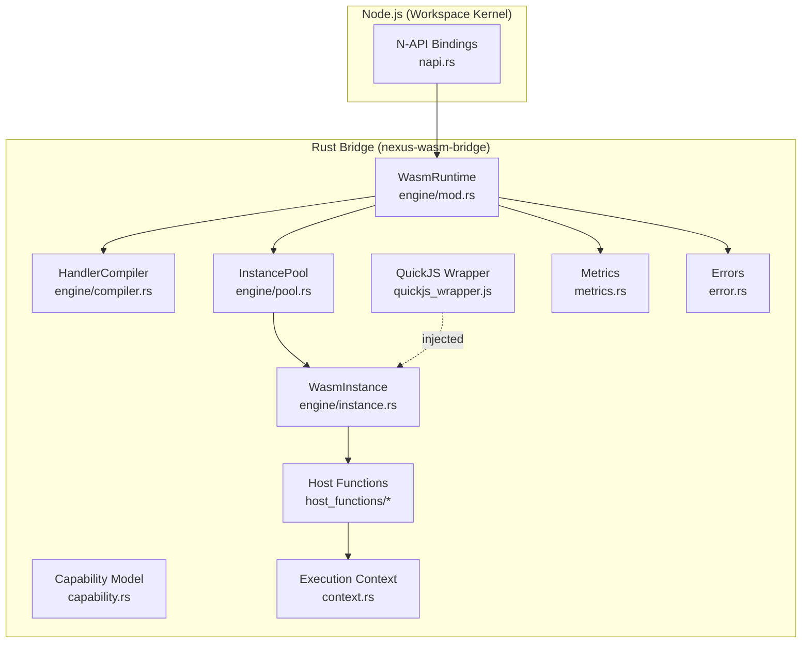

**Diagram sources**
- [napi.rs](file://runtime/nexus-wasm-bridge/src/napi.rs#L277-L438)
- [mod.rs](file://runtime/nexus-wasm-bridge/src/engine/mod.rs#L20-L219)
- [compiler.rs](file://runtime/nexus-wasm-bridge/src/engine/compiler.rs#L117-L214)
- [instance.rs](file://runtime/nexus-wasm-bridge/src/engine/instance.rs#L118-L211)
- [pool.rs](file://runtime/nexus-wasm-bridge/src/engine/pool.rs#L71-L217)
- [capability.rs](file://runtime/nexus-wasm-bridge/src/capability.rs#L1-L120)
- [context.rs](file://runtime/nexus-wasm-bridge/src/context.rs#L120-L233)
- [state.rs](file://runtime/nexus-wasm-bridge/src/host_functions/state.rs#L1-L128)
- [events.rs](file://runtime/nexus-wasm-bridge/src/host_functions/events.rs#L1-L35)
- [view.rs](file://runtime/nexus-wasm-bridge/src/host_functions/view.rs#L1-L36)
- [extension.rs](file://runtime/nexus-wasm-bridge/src/host_functions/extension.rs#L1-L67)
- [logging.rs](file://runtime/nexus-wasm-bridge/src/host_functions/logging.rs#L1-L59)
- [quickjs_wrapper.js](file://runtime/nexus-wasm-bridge/src/quickjs_wrapper.js#L1-L120)
- [metrics.rs](file://runtime/nexus-wasm-bridge/src/metrics.rs#L1-L120)
- [error.rs](file://runtime/nexus-wasm-bridge/src/error.rs#L1-L60)

**Section sources**
- [lib.rs](file://runtime/nexus-wasm-bridge/src/lib.rs#L1-L71)
- [Cargo.toml](file://runtime/nexus-wasm-bridge/Cargo.toml#L1-L63)

## Core Components
- WasmRuntime orchestrates execution, compiles handlers, manages instance pooling, records metrics, and handles timeouts and resumptions.
- HandlerCompiler compiles JavaScript to bytecode, caches results, and supports disk caching.
- InstancePool maintains a semaphore-controlled pool of reusable WasmInstance objects, with pre-warming and LIFO reuse.
- WasmInstance encapsulates a single QuickJS runtime in WasmEdge, tracks memory usage, and supports suspend/resume.
- Capability model defines capability tokens and checks permissions for state, events, view updates, and extensions.
- ExecutionContext carries handler inputs, collects mutations, events, view commands, logs, and suspension state.
- Host functions enforce capability checks and record side effects for state, events, view, extensions, and logging.
- N-API exposes a JavaScript-friendly API to Node.js, including execution, precompilation, resumption, and metrics.
- Embedded QuickJS wrapper injects $state, $args, $emit, $view, $ext, $log, and $time into the sandbox.
- Metrics and error systems provide observability and structured error reporting.

**Section sources**
- [mod.rs](file://runtime/nexus-wasm-bridge/src/engine/mod.rs#L20-L219)
- [compiler.rs](file://runtime/nexus-wasm-bridge/src/engine/compiler.rs#L117-L214)
- [pool.rs](file://runtime/nexus-wasm-bridge/src/engine/pool.rs#L71-L217)
- [instance.rs](file://runtime/nexus-wasm-bridge/src/engine/instance.rs#L118-L211)
- [capability.rs](file://runtime/nexus-wasm-bridge/src/capability.rs#L1-L120)
- [context.rs](file://runtime/nexus-wasm-bridge/src/context.rs#L120-L233)
- [napi.rs](file://runtime/nexus-wasm-bridge/src/napi.rs#L277-L438)
- [quickjs_wrapper.js](file://runtime/nexus-wasm-bridge/src/quickjs_wrapper.js#L1-L120)
- [metrics.rs](file://runtime/nexus-wasm-bridge/src/metrics.rs#L1-L120)
- [error.rs](file://runtime/nexus-wasm-bridge/src/error.rs#L1-L60)

## Architecture Overview
The bridge integrates Node.js via N-API with a Rust runtime that executes handlers in isolated QuickJS contexts inside WasmEdge. Handlers receive a sandboxed API ($state, $args, $emit, $view, $ext, $log, $time) and can suspend execution for async extension calls. The runtime enforces capability-based permissions and tracks performance.

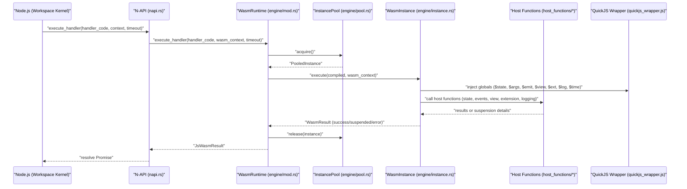

**Diagram sources**
- [napi.rs](file://runtime/nexus-wasm-bridge/src/napi.rs#L298-L360)
- [mod.rs](file://runtime/nexus-wasm-bridge/src/engine/mod.rs#L55-L117)
- [pool.rs](file://runtime/nexus-wasm-bridge/src/engine/pool.rs#L118-L217)
- [instance.rs](file://runtime/nexus-wasm-bridge/src/engine/instance.rs#L118-L211)
- [state.rs](file://runtime/nexus-wasm-bridge/src/host_functions/state.rs#L1-L128)
- [events.rs](file://runtime/nexus-wasm-bridge/src/host_functions/events.rs#L1-L35)
- [view.rs](file://runtime/nexus-wasm-bridge/src/host_functions/view.rs#L1-L36)
- [extension.rs](file://runtime/nexus-wasm-bridge/src/host_functions/extension.rs#L1-L67)
- [logging.rs](file://runtime/nexus-wasm-bridge/src/host_functions/logging.rs#L1-L59)
- [quickjs_wrapper.js](file://runtime/nexus-wasm-bridge/src/quickjs_wrapper.js#L357-L410)

## Detailed Component Analysis

### Capability-Based Security Model
Handlers must declare required capabilities in NXML. The runtime parses and converts them into capability tokens and enforces checks at host function boundaries.

- CapabilityToken variants represent scoped permissions for state read/write, events emit, view updates, and extension access.
- CapabilityChecker evaluates whether a required capability string matches granted tokens.
- Capability inference scans handler code for $state, $emit, and $ext usage to suggest grants.

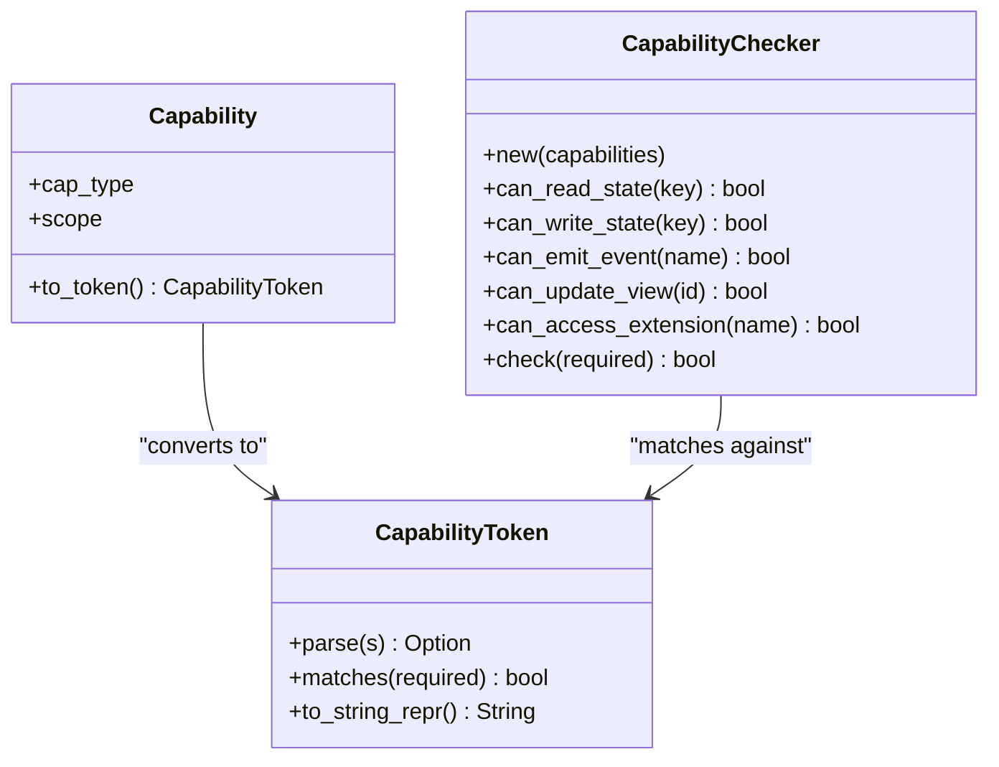

**Diagram sources**
- [capability.rs](file://runtime/nexus-wasm-bridge/src/capability.rs#L1-L120)
- [capability.rs](file://runtime/nexus-wasm-bridge/src/capability.rs#L180-L224)

Examples of capability tokens:
- state:read:count
- state:write:*
- events:emit:toast
- view:update:logs
- ext:http

Usage patterns:
- Granting state:read:* allows reading any key.
- Granting state:write:count allows writing only that key.
- Granting events:emit:* allows emitting any event.
- Granting view:update:* allows updating any component.
- Granting ext:* allows calling any extension.

**Section sources**
- [capability.rs](file://runtime/nexus-wasm-bridge/src/capability.rs#L1-L120)
- [capability.rs](file://runtime/nexus-wasm-bridge/src/capability.rs#L180-L224)
- [capability.rs](file://runtime/nexus-wasm-bridge/src/capability.rs#L226-L327)

### N-API Interface for Node.js
The N-API layer exposes a JavaScript-friendly API to Node.js:
- NexusRuntime constructor accepts a configuration object.
- Methods: execute_handler, precompile_handler, execute_compiled_handler, resume_handler, get_stats, get_prometheus_metrics, infer_capabilities, shutdown.
- Context and results are serialized/deserialized using MessagePack buffers.

Key conversions:
- JsRuntimeConfig -> RuntimeConfig
- JsWasmContext -> WasmContext (MessagePack decoding)
- WasmResult -> JsWasmResult (MessagePack encoding)
- JsAsyncResult -> AsyncResult

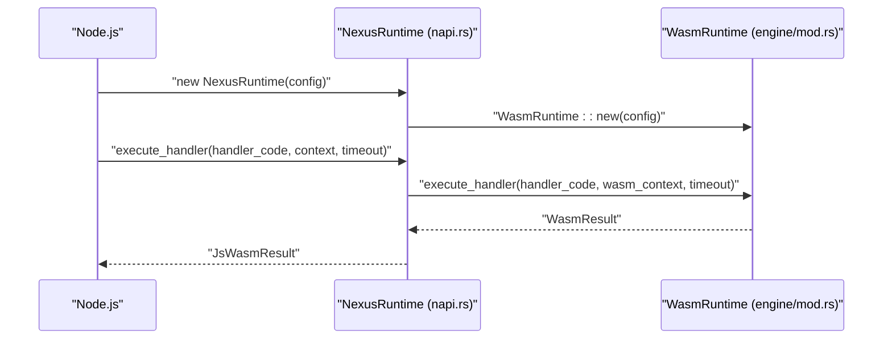

**Diagram sources**
- [napi.rs](file://runtime/nexus-wasm-bridge/src/napi.rs#L277-L438)
- [mod.rs](file://runtime/nexus-wasm-bridge/src/engine/mod.rs#L55-L117)

**Section sources**
- [napi.rs](file://runtime/nexus-wasm-bridge/src/napi.rs#L18-L112)
- [napi.rs](file://runtime/nexus-wasm-bridge/src/napi.rs#L113-L174)
- [napi.rs](file://runtime/nexus-wasm-bridge/src/napi.rs#L176-L222)
- [napi.rs](file://runtime/nexus-wasm-bridge/src/napi.rs#L223-L276)
- [napi.rs](file://runtime/nexus-wasm-bridge/src/napi.rs#L277-L438)

### Instance Pooling and Resource Management
- Semaphore controls concurrency; acquire blocks when at capacity.
- LIFO reuse improves cache locality; available queue stores idle instances.
- Suspended instances are tracked separately by suspension ID.
- Memory accounting tracks total memory across instances.
- Shutdown terminates all instances and closes the semaphore.

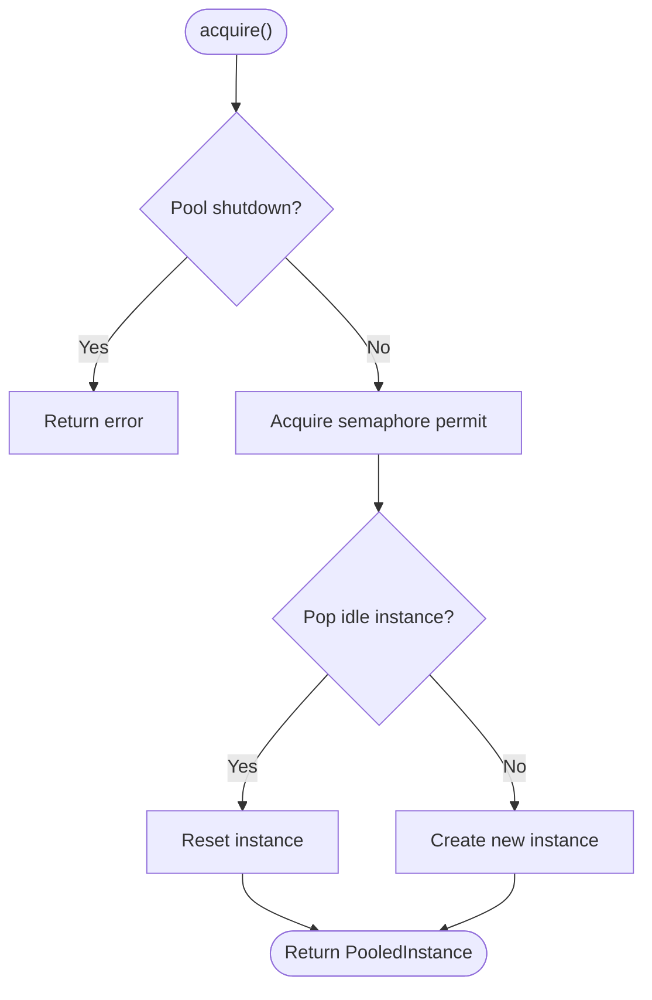

**Diagram sources**
- [pool.rs](file://runtime/nexus-wasm-bridge/src/engine/pool.rs#L118-L171)

**Section sources**
- [pool.rs](file://runtime/nexus-wasm-bridge/src/engine/pool.rs#L71-L217)

### Compilation Caching Strategy
- HandlerCompiler wraps handler code and compiles to bytecode.
- Cache key is derived from source plus version to invalidate on upgrades.
- Memory cache with LRU eviction; disk cache stored under cache_dir with .qjsc files.
- Stats include cache entries, size, hits, misses, and total compilations.

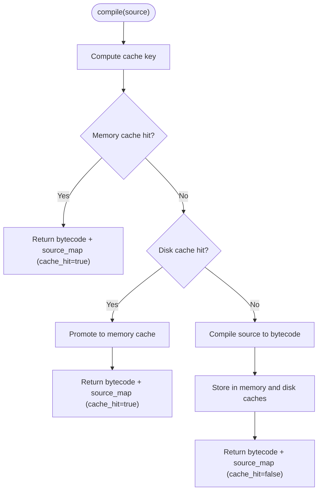

**Diagram sources**
- [compiler.rs](file://runtime/nexus-wasm-bridge/src/engine/compiler.rs#L168-L214)
- [compiler.rs](file://runtime/nexus-wasm-bridge/src/engine/compiler.rs#L228-L319)

**Section sources**
- [compiler.rs](file://runtime/nexus-wasm-bridge/src/engine/compiler.rs#L117-L214)
- [compiler.rs](file://runtime/nexus-wasm-bridge/src/engine/compiler.rs#L228-L319)
- [compiler.rs](file://runtime/nexus-wasm-bridge/src/engine/compiler.rs#L320-L391)

### Asyncify-Based Suspend/Resume
- Handlers can await $ext.name.method(...) which triggers a host function to suspend execution.
- Suspension details include suspension_id, extension_name, method, and args.
- The runtime returns a suspended result; Node.js resumes later with AsyncResult.
- On resume, the runtime continues execution and may suspend again.

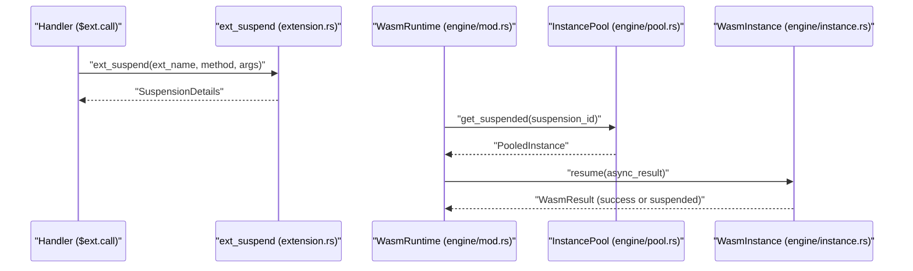

**Diagram sources**
- [extension.rs](file://runtime/nexus-wasm-bridge/src/host_functions/extension.rs#L1-L67)
- [mod.rs](file://runtime/nexus-wasm-bridge/src/engine/mod.rs#L167-L194)
- [pool.rs](file://runtime/nexus-wasm-bridge/src/engine/pool.rs#L219-L233)
- [instance.rs](file://runtime/nexus-wasm-bridge/src/engine/instance.rs#L213-L289)

**Section sources**
- [extension.rs](file://runtime/nexus-wasm-bridge/src/host_functions/extension.rs#L1-L67)
- [context.rs](file://runtime/nexus-wasm-bridge/src/context.rs#L425-L457)
- [mod.rs](file://runtime/nexus-wasm-bridge/src/engine/mod.rs#L167-L194)
- [instance.rs](file://runtime/nexus-wasm-bridge/src/engine/instance.rs#L213-L289)

### Embedded QuickJS Wrapper and Context Variables
The embedded wrapper injects:
- $state: get/set/delete/has/keys/update
- $args: handler arguments
- $emit: emit events
- $view: setFilter/scrollTo/focus/command
- $ext: dynamic proxy to registered extensions with async calls
- $log: debug/info/warn/error
- $time.now(): current timestamp

It also wraps handler execution and encodes/decodes values using MessagePack placeholders.

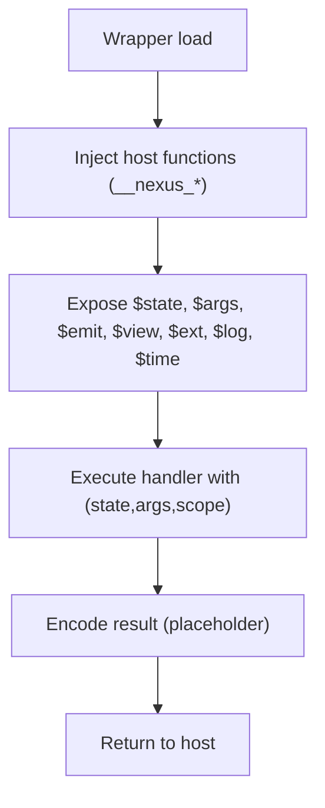

**Diagram sources**
- [quickjs_wrapper.js](file://runtime/nexus-wasm-bridge/src/quickjs_wrapper.js#L1-L120)
- [quickjs_wrapper.js](file://runtime/nexus-wasm-bridge/src/quickjs_wrapper.js#L357-L410)

**Section sources**
- [quickjs_wrapper.js](file://runtime/nexus-wasm-bridge/src/quickjs_wrapper.js#L1-L120)
- [quickjs_wrapper.js](file://runtime/nexus-wasm-bridge/src/quickjs_wrapper.js#L357-L410)

### Host Function Registration and Enforcement
Host functions are grouped under a registry that:
- Tracks shared execution context
- Enforces host call limits
- Provides capability checks for state, events, view, extension, and logging

Examples:
- state_get/state_set/state_delete/state_has/state_keys
- emit_event/emit_toast
- view_command/view_set_filter/view_scroll_to/view_focus/view_custom
- ext_suspend/ext_exists/ext_methods/ext_list
- log/log_debug/log_info/log_warn/log_error/now

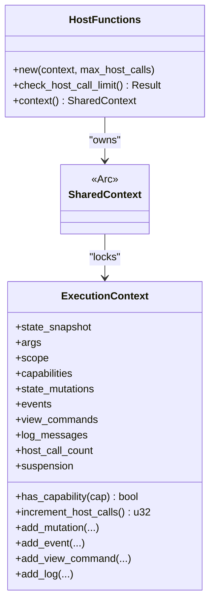

**Diagram sources**
- [host_functions/mod.rs](file://runtime/nexus-wasm-bridge/src/host_functions/mod.rs#L1-L53)
- [context.rs](file://runtime/nexus-wasm-bridge/src/context.rs#L495-L588)

**Section sources**
- [host_functions/mod.rs](file://runtime/nexus-wasm-bridge/src/host_functions/mod.rs#L1-L53)
- [state.rs](file://runtime/nexus-wasm-bridge/src/host_functions/state.rs#L1-L128)
- [events.rs](file://runtime/nexus-wasm-bridge/src/host_functions/events.rs#L1-L35)
- [view.rs](file://runtime/nexus-wasm-bridge/src/host_functions/view.rs#L1-L36)
- [extension.rs](file://runtime/nexus-wasm-bridge/src/host_functions/extension.rs#L1-L67)
- [logging.rs](file://runtime/nexus-wasm-bridge/src/host_functions/logging.rs#L1-L59)
- [context.rs](file://runtime/nexus-wasm-bridge/src/context.rs#L495-L588)

### Performance Metrics Collection
- ExecutionMetrics captures duration, memory usage, host calls, instruction count, compilation time, and cache hit.
- MetricsCollector aggregates totals, averages, cache hit rates, peak memory, host call counts, and error counts.
- Prometheus export includes counters/gauges for executions, cache hit rate, peak memory, host calls, and error counts.

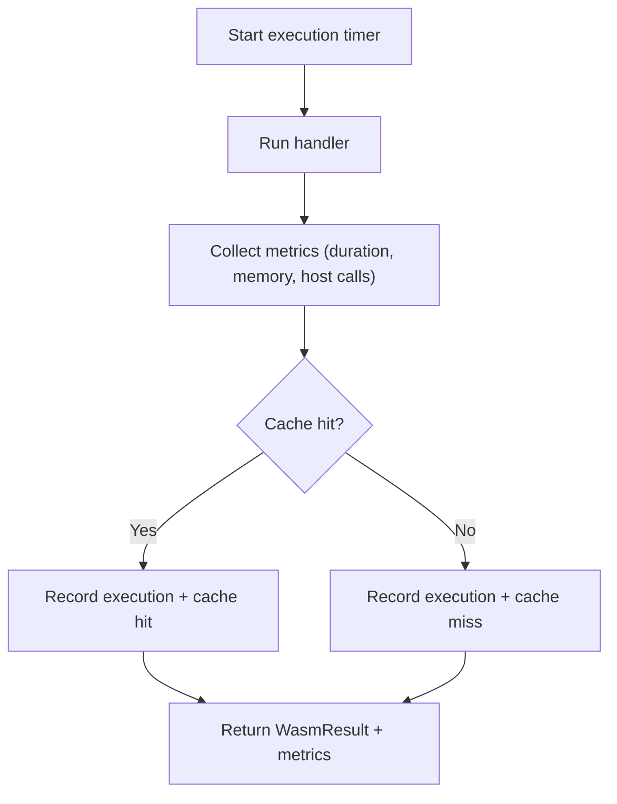

**Diagram sources**
- [metrics.rs](file://runtime/nexus-wasm-bridge/src/metrics.rs#L1-L120)
- [metrics.rs](file://runtime/nexus-wasm-bridge/src/metrics.rs#L137-L211)
- [metrics.rs](file://runtime/nexus-wasm-bridge/src/metrics.rs#L284-L339)
- [mod.rs](file://runtime/nexus-wasm-bridge/src/engine/mod.rs#L71-L117)

**Section sources**
- [metrics.rs](file://runtime/nexus-wasm-bridge/src/metrics.rs#L1-L120)
- [metrics.rs](file://runtime/nexus-wasm-bridge/src/metrics.rs#L137-L211)
- [metrics.rs](file://runtime/nexus-wasm-bridge/src/metrics.rs#L284-L339)
- [mod.rs](file://runtime/nexus-wasm-bridge/src/engine/mod.rs#L71-L117)

### Error Handling Strategies
- ErrorCode enumerates categories: timeout, memory limit, permission denied, execution error, compilation error, invalid handler, internal error, resource limit, WASM error, serialization error, invalid argument, extension not found, method not found.
- WasmError carries code, message, stack, location, snippet, and context.
- RuntimeError maps lower-level errors to WasmError for transport to JavaScript.
- Host functions return negative error codes for permission/resource limits/not found/internal errors.

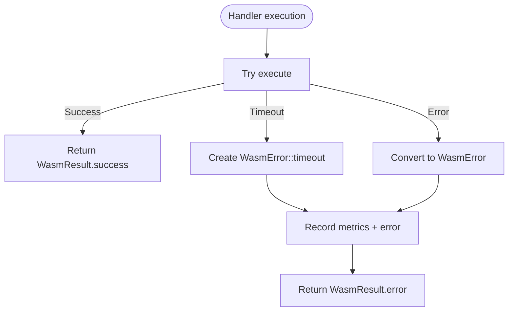

**Diagram sources**
- [error.rs](file://runtime/nexus-wasm-bridge/src/error.rs#L1-L60)
- [error.rs](file://runtime/nexus-wasm-bridge/src/error.rs#L60-L120)
- [error.rs](file://runtime/nexus-wasm-bridge/src/error.rs#L237-L316)
- [mod.rs](file://runtime/nexus-wasm-bridge/src/engine/mod.rs#L83-L117)

**Section sources**
- [error.rs](file://runtime/nexus-wasm-bridge/src/error.rs#L1-L60)
- [error.rs](file://runtime/nexus-wasm-bridge/src/error.rs#L60-L120)
- [error.rs](file://runtime/nexus-wasm-bridge/src/error.rs#L237-L316)
- [mod.rs](file://runtime/nexus-wasm-bridge/src/engine/mod.rs#L83-L117)

## Dependency Analysis
- N-API depends on WasmRuntime and serializes/deserializes context/results.
- WasmRuntime depends on Compiler, Pool, Metrics, and Error.
- Pool depends on Instance and configuration.
- Instance depends on HostFunctions and ExecutionContext.
- HostFunctions depend on CapabilityChecker and ExecutionContext.
- Capability and Context define cross-cutting models.

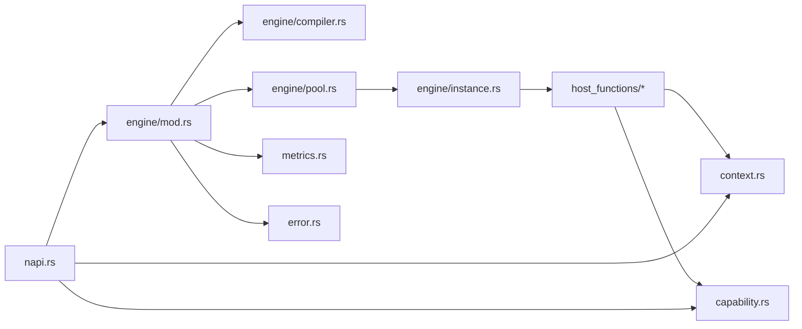

**Diagram sources**
- [napi.rs](file://runtime/nexus-wasm-bridge/src/napi.rs#L277-L438)
- [mod.rs](file://runtime/nexus-wasm-bridge/src/engine/mod.rs#L20-L117)
- [compiler.rs](file://runtime/nexus-wasm-bridge/src/engine/compiler.rs#L117-L214)
- [pool.rs](file://runtime/nexus-wasm-bridge/src/engine/pool.rs#L71-L217)
- [instance.rs](file://runtime/nexus-wasm-bridge/src/engine/instance.rs#L118-L211)
- [host_functions/mod.rs](file://runtime/nexus-wasm-bridge/src/host_functions/mod.rs#L1-L53)
- [context.rs](file://runtime/nexus-wasm-bridge/src/context.rs#L120-L233)
- [capability.rs](file://runtime/nexus-wasm-bridge/src/capability.rs#L1-L120)
- [metrics.rs](file://runtime/nexus-wasm-bridge/src/metrics.rs#L1-L120)
- [error.rs](file://runtime/nexus-wasm-bridge/src/error.rs#L1-L60)

**Section sources**
- [napi.rs](file://runtime/nexus-wasm-bridge/src/napi.rs#L277-L438)
- [mod.rs](file://runtime/nexus-wasm-bridge/src/engine/mod.rs#L20-L117)
- [host_functions/mod.rs](file://runtime/nexus-wasm-bridge/src/host_functions/mod.rs#L1-L53)

## Performance Considerations
- Instance pooling reduces creation overhead; pre-warming minimizes latency.
- Compilation caching avoids repeated parsing/compilation; disk cache persists across restarts.
- Metrics capture execution time, memory usage, host call counts, and cache hit rates for tuning.
- Asyncify-based suspend/resume prevents blocking and allows efficient concurrency.

[No sources needed since this section provides general guidance]

## Troubleshooting Guide
Common issues and remedies:
- Permission denied: Verify handler capabilities for state, events, view, or extensions.
- Timeout: Increase timeout or optimize handler logic; check host call limits.
- Extension not found: Ensure extension is registered and handler has appropriate ext:* or ext:name capability.
- Resource limit exceeded: Reduce host calls or handler complexity; adjust limits.
- Serialization errors: Validate MessagePack encoding/decoding paths in N-API conversions.

**Section sources**
- [error.rs](file://runtime/nexus-wasm-bridge/src/error.rs#L1-L60)
- [error.rs](file://runtime/nexus-wasm-bridge/src/error.rs#L237-L316)
- [napi.rs](file://runtime/nexus-wasm-bridge/src/napi.rs#L67-L111)
- [napi.rs](file://runtime/nexus-wasm-bridge/src/napi.rs#L200-L221)

## Conclusion
The WASM Bridge provides a secure, observable, and efficient runtime for executing JavaScript handlers in isolation. Through capability-based permissions, instance pooling, compilation caching, and Asyncify-based suspend/resume, it balances safety, performance, and developer ergonomics. The N-API layer enables seamless integration with Node.js, while the embedded QuickJS wrapper supplies a familiar handler API surface.