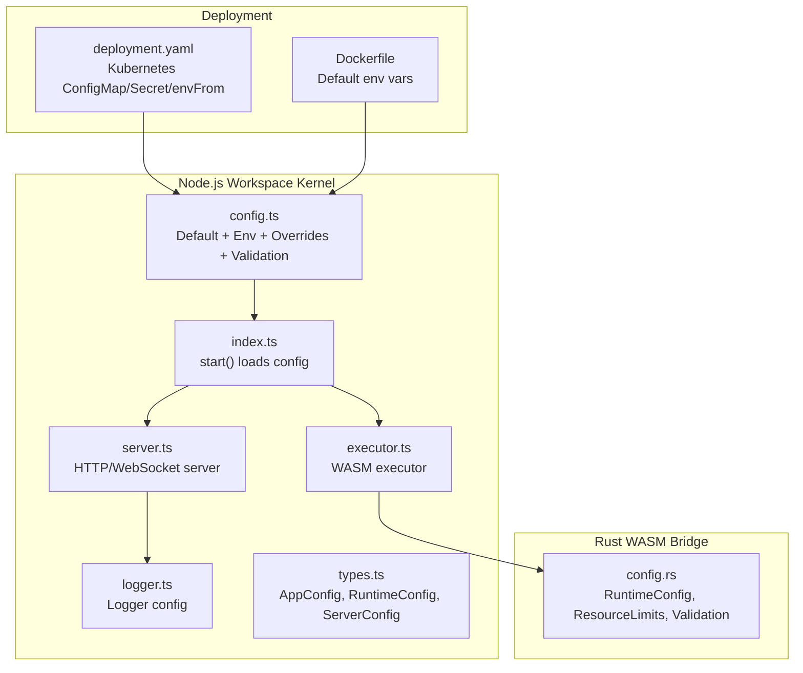
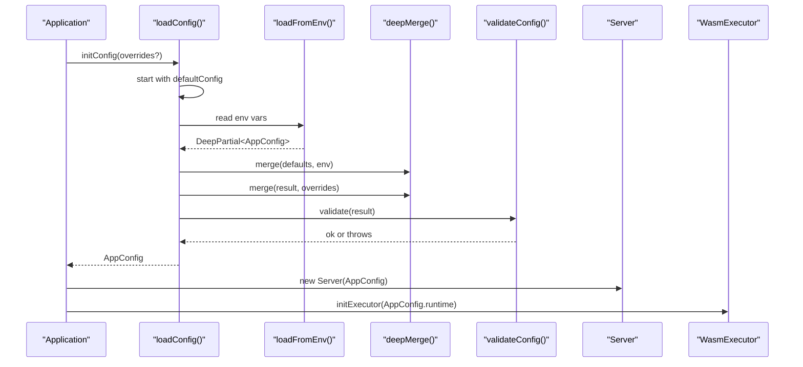
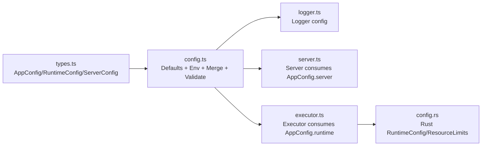

# Configuration

<cite>
**Referenced Files in This Document**
- [config.ts](file://runtime/workspace-kernel/src/config.ts)
- [index.ts](file://runtime/workspace-kernel/src/index.ts)
- [types.ts](file://runtime/workspace-kernel/src/types.ts)
- [server.ts](file://runtime/workspace-kernel/src/server.ts)
- [logger.ts](file://runtime/workspace-kernel/src/logger.ts)
- [executor.ts](file://runtime/workspace-kernel/src/executor.ts)
- [deployment.yaml](file://runtime/k8s/deployment.yaml)
- [Dockerfile](file://runtime/images/Dockerfile)
- [config.rs](file://runtime/nexus-wasm-bridge/src/config.rs)
</cite>

## Table of Contents
1. [Introduction](#introduction)
2. [Project Structure](#project-structure)
3. [Core Components](#core-components)
4. [Architecture Overview](#architecture-overview)
5. [Detailed Component Analysis](#detailed-component-analysis)
6. [Dependency Analysis](#dependency-analysis)
7. [Performance Considerations](#performance-considerations)
8. [Troubleshooting Guide](#troubleshooting-guide)
9. [Conclusion](#conclusion)
10. [Appendices](#appendices)

## Introduction
This document explains the configuration system for the Workspace Kernel, covering how configuration is structured, loaded, validated, and applied across the runtime. It details environment variable support, configuration precedence, validation rules, defaults, and operational guidance for development, staging, and production. It also covers security policies, resource limits, logging levels, and runtime reconfiguration patterns.

## Project Structure
The configuration system spans the Node.js Workspace Kernel and the Rust WASM bridge. The Node layer defines application-level configuration (ports, auth, logging, runtime limits, extensions) and loads it from environment variables. The Rust layer defines runtime configuration for the WASM executor and enforces resource limits.

**Diagram sources**
- [config.ts](file://runtime/workspace-kernel/src/config.ts#L1-L233)
- [index.ts](file://runtime/workspace-kernel/src/index.ts#L1-L149)
- [server.ts](file://runtime/workspace-kernel/src/server.ts#L1-L703)
- [logger.ts](file://runtime/workspace-kernel/src/logger.ts#L1-L90)
- [executor.ts](file://runtime/workspace-kernel/src/executor.ts#L1-L200)
- [types.ts](file://runtime/workspace-kernel/src/types.ts#L303-L368)
- [config.rs](file://runtime/nexus-wasm-bridge/src/config.rs#L1-L320)
- [deployment.yaml](file://runtime/k8s/deployment.yaml#L1-L299)
- [Dockerfile](file://runtime/images/Dockerfile#L80-L103)

**Section sources**
- [config.ts](file://runtime/workspace-kernel/src/config.ts#L1-L233)
- [index.ts](file://runtime/workspace-kernel/src/index.ts#L1-L149)
- [types.ts](file://runtime/workspace-kernel/src/types.ts#L303-L368)
- [deployment.yaml](file://runtime/k8s/deployment.yaml#L1-L299)
- [Dockerfile](file://runtime/images/Dockerfile#L80-L103)

## Core Components
- Application configuration model and defaults
  - AppConfig includes server, runtime, extensions, and logging sections.
  - Defaults are defined for ports, auth, CORS, body limits, runtime limits, cache, and logging.
- Environment variable loader
  - Loads and coerces environment variables into typed configuration fragments.
- Configuration merger and validation
  - Deep merges defaults, environment variables, and explicit overrides.
  - Validates numeric bounds, port ranges, and required secrets.
- Logger configuration
  - Supports log level and pretty-print toggles, with lazy initialization and reconfigure capability.
- WASM runtime configuration
  - Rust-side RuntimeConfig and ResourceLimits define instance limits, timeouts, memory, and host-call quotas.
- Kubernetes and Docker deployment
  - Provides environment defaults and secret injection for production-ready configuration.

**Section sources**
- [config.ts](file://runtime/workspace-kernel/src/config.ts#L1-L233)
- [types.ts](file://runtime/workspace-kernel/src/types.ts#L303-L368)
- [logger.ts](file://runtime/workspace-kernel/src/logger.ts#L1-L90)
- [config.rs](file://runtime/nexus-wasm-bridge/src/config.rs#L1-L320)
- [deployment.yaml](file://runtime/k8s/deployment.yaml#L1-L299)
- [Dockerfile](file://runtime/images/Dockerfile#L80-L103)

## Architecture Overview
The configuration pipeline is layered:
- Defaults are established in the Node layer.
- Environment variables are loaded and merged.
- Explicit overrides (programmatic) are merged last.
- Validation ensures safe runtime behavior.
- The server and executor consume the final configuration.

**Diagram sources**
- [config.ts](file://runtime/workspace-kernel/src/config.ts#L147-L201)
- [index.ts](file://runtime/workspace-kernel/src/index.ts#L22-L58)
- [server.ts](file://runtime/workspace-kernel/src/server.ts#L46-L64)
- [executor.ts](file://runtime/workspace-kernel/src/executor.ts#L165-L187)

## Detailed Component Analysis

### Configuration Model and Defaults
- AppConfig structure
  - server: HTTP port, WebSocket port, host, authEnabled, jwtSecret, corsOrigins, bodyLimit.
  - runtime: maxInstances, minInstances, memoryLimitBytes, timeoutMs, maxHostCalls, cacheDir, maxCacheSizeBytes.
  - extensions.http: maxConcurrent, defaultTimeout, userAgent, allowedDomains.
  - logging: level, pretty.
- Defaults
  - Ports bound to 3000/3001, host 0.0.0.0, auth disabled, CORS wildcard, body limit 1mb.
  - Runtime defaults include small memory footprint suitable for development.
  - Logging defaults adapt to NODE_ENV for pretty printing in non-production.

**Section sources**
- [types.ts](file://runtime/workspace-kernel/src/types.ts#L303-L368)
- [config.ts](file://runtime/workspace-kernel/src/config.ts#L7-L37)

### Environment Variables and Loading Mechanism
- Supported environment variables
  - Server: HTTP_PORT, WS_PORT, HOST, JWT_SECRET, AUTH_ENABLED, CORS_ORIGINS (comma-separated), BODY_LIMIT.
  - Runtime: MAX_INSTANCES, MIN_INSTANCES, MEMORY_LIMIT_MB, TIMEOUT_MS, MAX_HOST_CALLS, CACHE_DIR.
  - Extensions.http: HTTP_MAX_CONCURRENT, HTTP_TIMEOUT, HTTP_ALLOWED_DOMAINS (comma-separated).
  - Logging: LOG_LEVEL, LOG_PRETTY.
- Loading order and precedence
  - Defaults → Environment variables → Explicit overrides (DeepPartial).
  - Undefined values are removed before merging to keep the final config clean.
- Kubernetes and Docker
  - Kubernetes ConfigMap sets defaults for runtime and HTTP extension settings.
  - Secrets inject JWT_SECRET.
  - envFrom and env directives populate environment variables in the container.
  - Dockerfile sets default environment variables for development and production.

**Section sources**
- [config.ts](file://runtime/workspace-kernel/src/config.ts#L76-L123)
- [config.ts](file://runtime/workspace-kernel/src/config.ts#L125-L167)
- [deployment.yaml](file://runtime/k8s/deployment.yaml#L18-L96)
- [Dockerfile](file://runtime/images/Dockerfile#L86-L103)

### Validation Rules and Default Values
- Validation enforced by the Node layer:
  - Port ranges: 1–65535 for HTTP and WebSocket.
  - When authEnabled is true, jwtSecret must be present.
  - maxInstances must be ≥ 1.
  - memoryLimitBytes must be ≥ 1MB.
  - timeoutMs must be ≥ 100ms.
  - log level must be one of debug, info, warn, error.
- Rust WASM runtime validation:
  - max_instances must be > 0.
  - memory_limit_bytes must be ≥ 1MB.
  - stack_size_bytes must be ≥ 64KB.
- Defaults:
  - Node defaults align with development-friendly settings.
  - Rust defaults set conservative limits for safety and performance.

**Section sources**
- [config.ts](file://runtime/workspace-kernel/src/config.ts#L172-L200)
- [config.rs](file://runtime/nexus-wasm-bridge/src/config.rs#L144-L169)

### Logging Configuration
- Logger configuration
  - Level and pretty toggles are supported.
  - Pretty printing is enabled by default in non-production environments.
  - Logger supports dynamic reconfiguration by resetting the logger instance.
- Usage
  - The logger is lazily initialized and proxied for safe early imports.

**Section sources**
- [logger.ts](file://runtime/workspace-kernel/src/logger.ts#L1-L90)

### Security Policies
- Authentication
  - When authEnabled is true, requests require a Bearer token verified against jwtSecret.
  - WebSocket upgrade requires a token query parameter when auth is enabled.
- CORS
  - Origins are configurable via CORS_ORIGINS; default is wildcard.
- Secrets management
  - JWT_SECRET is injected via Kubernetes Secrets and should never be hardcoded.
  - Prefer environment injection and secret managers in production.

**Section sources**
- [server.ts](file://runtime/workspace-kernel/src/server.ts#L99-L129)
- [server.ts](file://runtime/workspace-kernel/src/server.ts#L178-L194)
- [deployment.yaml](file://runtime/k8s/deployment.yaml#L28-L37)

### Resource Limits and Runtime Behavior
- Node runtime limits
  - maxInstances, minInstances, memoryLimitBytes, timeoutMs, maxHostCalls, cacheDir, maxCacheSizeBytes.
- WASM runtime limits (Rust)
  - max_instances, memory_limit_bytes, stack_size_bytes, enable_simd, enable_bulk_memory, quickjs_module_path, enable_aot, cache_dir, debug.
- ResourceLimits (Rust)
  - timeout_ms, memory_limit_bytes, stack_size_bytes, max_host_calls, max_state_mutations, max_events.

**Section sources**
- [types.ts](file://runtime/workspace-kernel/src/types.ts#L323-L339)
- [config.rs](file://runtime/nexus-wasm-bridge/src/config.rs#L34-L88)
- [config.rs](file://runtime/nexus-wasm-bridge/src/config.rs#L171-L211)

### Configuration Inheritance, Override Patterns, and Runtime Reconfiguration
- Inheritance and override order
  - Defaults → Environment variables → Programmatic overrides.
  - Deep merge preserves nested structures; undefined values are pruned.
- Runtime reconfiguration
  - The logger supports dynamic reconfiguration by resetting the logger instance.
  - There is no public API to reload AppConfig at runtime; restart the process to apply new configuration.
  - The executor does not expose a reconfiguration API; initialize with new config and restart.

**Section sources**
- [config.ts](file://runtime/workspace-kernel/src/config.ts#L147-L167)
- [logger.ts](file://runtime/workspace-kernel/src/logger.ts#L57-L73)

### Example Environments

- Development
  - Typical settings:
    - LOG_LEVEL=debug
    - LOG_PRETTY=true
    - HTTP_PORT=3000
    - WS_PORT=3001
    - HOST=0.0.0.0
    - AUTH_ENABLED=false
    - MAX_INSTANCES=10
    - MIN_INSTANCES=2
    - MEMORY_LIMIT_MB=32
    - TIMEOUT_MS=5000
    - MAX_HOST_CALLS=1000
    - HTTP_MAX_CONCURRENT=10
    - HTTP_TIMEOUT=30000
    - CACHE_DIR=/tmp/nexus-cache
  - Dockerfile sets development defaults including debug logging.

- Staging
  - Typical settings:
    - LOG_LEVEL=info
    - AUTH_ENABLED=true
    - JWT_SECRET from Secrets
    - CORS_ORIGINS configured to trusted hosts
    - MAX_INSTANCES scaled up moderately
    - TIMEOUT_MS increased cautiously
    - HTTP_MAX_CONCURRENT tuned for expected load

- Production
  - Typical settings:
    - LOG_LEVEL=warn or error
    - AUTH_ENABLED=true
    - JWT_SECRET from Secrets
    - CORS_ORIGINS restricted
    - MAX_INSTANCES sized for workload
    - TIMEOUT_MS appropriate for SLA
    - HTTP_MAX_CONCURRENT and HTTP_TIMEOUT aligned with upstream limits
    - CACHE_DIR mounted to persistent or ephemeral storage as appropriate

**Section sources**
- [Dockerfile](file://runtime/images/Dockerfile#L141-L150)
- [deployment.yaml](file://runtime/k8s/deployment.yaml#L18-L96)

## Dependency Analysis
The configuration system depends on:
- Types for shape and validation.
- Server and executor consuming configuration.
- Logger consuming logging configuration.
- Kubernetes and Docker providing environment variables.

**Diagram sources**
- [types.ts](file://runtime/workspace-kernel/src/types.ts#L303-L368)
- [config.ts](file://runtime/workspace-kernel/src/config.ts#L1-L233)
- [logger.ts](file://runtime/workspace-kernel/src/logger.ts#L1-L90)
- [server.ts](file://runtime/workspace-kernel/src/server.ts#L46-L64)
- [executor.ts](file://runtime/workspace-kernel/src/executor.ts#L165-L187)
- [config.rs](file://runtime/nexus-wasm-bridge/src/config.rs#L34-L88)

**Section sources**
- [types.ts](file://runtime/workspace-kernel/src/types.ts#L303-L368)
- [config.ts](file://runtime/workspace-kernel/src/config.ts#L1-L233)
- [server.ts](file://runtime/workspace-kernel/src/server.ts#L46-L64)
- [executor.ts](file://runtime/workspace-kernel/src/executor.ts#L165-L187)
- [config.rs](file://runtime/nexus-wasm-bridge/src/config.rs#L34-L88)

## Performance Considerations
- Instance sizing
  - Increase maxInstances for higher concurrency; ensure memoryLimitBytes is adequate.
- Timeouts
  - Set timeoutMs to balance responsiveness and long-running tasks.
- Host calls
  - Limit maxHostCalls to prevent excessive host function overhead.
- Logging
  - Reduce pretty printing in production to minimize overhead.
- Cache
  - Tune cacheDir and maxCacheSizeBytes to improve cold-start performance.

[No sources needed since this section provides general guidance]

## Troubleshooting Guide
- Invalid port or auth configuration
  - Symptom: startup/validation error indicating invalid port or missing jwtSecret.
  - Action: Verify HTTP_PORT/WS_PORT and ensure AUTH_ENABLED=true pairs with JWT_SECRET.
- Memory or timeout violations
  - Symptom: errors indicating memory limit too low or timeout too small.
  - Action: Increase MEMORY_LIMIT_MB/TIMEOUT_MS and ensure Rust-side memory_limit_bytes and stack_size_bytes meet minimums.
- Unexpected logging output
  - Symptom: logs too verbose or not pretty in production.
  - Action: Adjust LOG_LEVEL and LOG_PRETTY; remember logger resets on reconfigure.

**Section sources**
- [config.ts](file://runtime/workspace-kernel/src/config.ts#L172-L200)
- [config.rs](file://runtime/nexus-wasm-bridge/src/config.rs#L144-L169)
- [logger.ts](file://runtime/workspace-kernel/src/logger.ts#L57-L73)

## Conclusion
The Workspace Kernel’s configuration system combines environment-driven defaults with explicit overrides and strict validation. It supports secure authentication, flexible logging, and tunable runtime limits. For production, inject secrets via Kubernetes Secrets, restrict CORS, and tune instance sizes and timeouts to match workload characteristics. Restart the process to apply configuration changes.

## Appendices

### Configuration Reference

- Server
  - httpPort: number (default 3000)
  - wsPort: number (default 3001)
  - host: string (default 0.0.0.0)
  - authEnabled: boolean (default false)
  - jwtSecret: string (required when authEnabled=true)
  - corsOrigins: string[] (default ['*'])
  - bodyLimit: string (default '1mb')

- Runtime
  - maxInstances: number (default 10)
  - minInstances: number (optional)
  - memoryLimitBytes: number (default ~32MB)
  - timeoutMs: number (default 5000)
  - maxHostCalls: number (default 1000)
  - cacheDir: string (default '/tmp/nexus-cache')
  - maxCacheSizeBytes: number (default 64MB)

- Extensions.http
  - maxConcurrent: number (default 10)
  - defaultTimeout: number (default 30000)
  - userAgent: string (default 'Nexus-Runtime/1.0')
  - allowedDomains: string[] (optional)

- Logging
  - level: 'debug' | 'info' | 'warn' | 'error' (default 'info')
  - pretty: boolean (default true in non-production)

- Environment variables
  - HTTP_PORT, WS_PORT, HOST, JWT_SECRET, AUTH_ENABLED, CORS_ORIGINS, BODY_LIMIT
  - MAX_INSTANCES, MIN_INSTANCES, MEMORY_LIMIT_MB, TIMEOUT_MS, MAX_HOST_CALLS, CACHE_DIR
  - HTTP_MAX_CONCURRENT, HTTP_TIMEOUT, HTTP_ALLOWED_DOMAINS
  - LOG_LEVEL, LOG_PRETTY

**Section sources**
- [types.ts](file://runtime/workspace-kernel/src/types.ts#L303-L368)
- [config.ts](file://runtime/workspace-kernel/src/config.ts#L7-L37)
- [config.ts](file://runtime/workspace-kernel/src/config.ts#L76-L123)
- [deployment.yaml](file://runtime/k8s/deployment.yaml#L18-L96)
- [Dockerfile](file://runtime/images/Dockerfile#L86-L103)