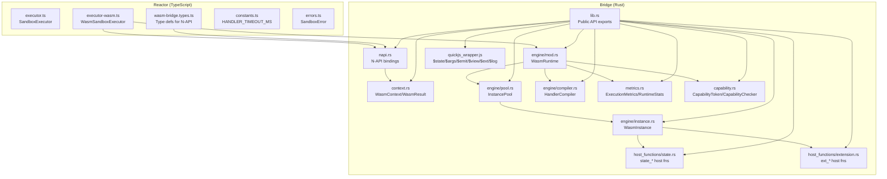
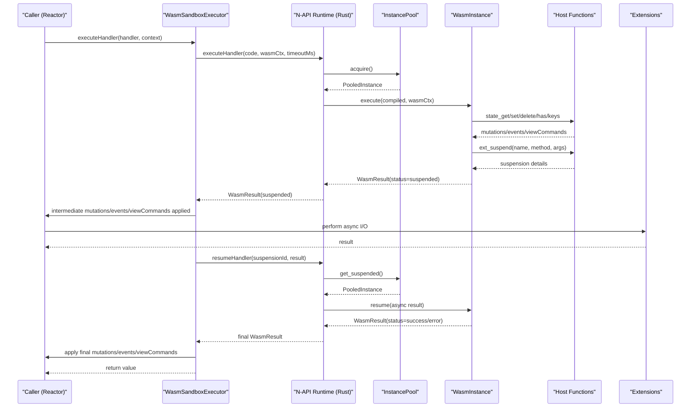
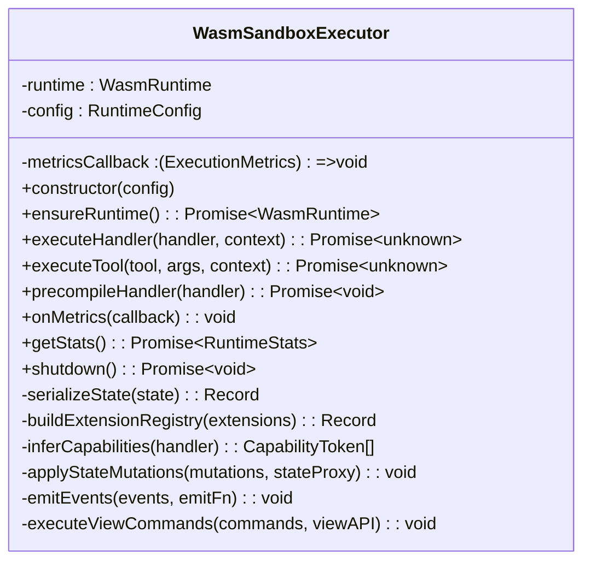
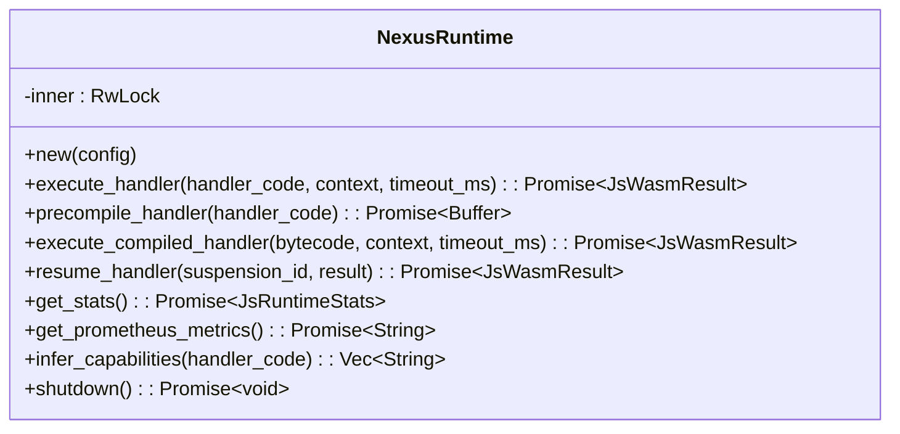
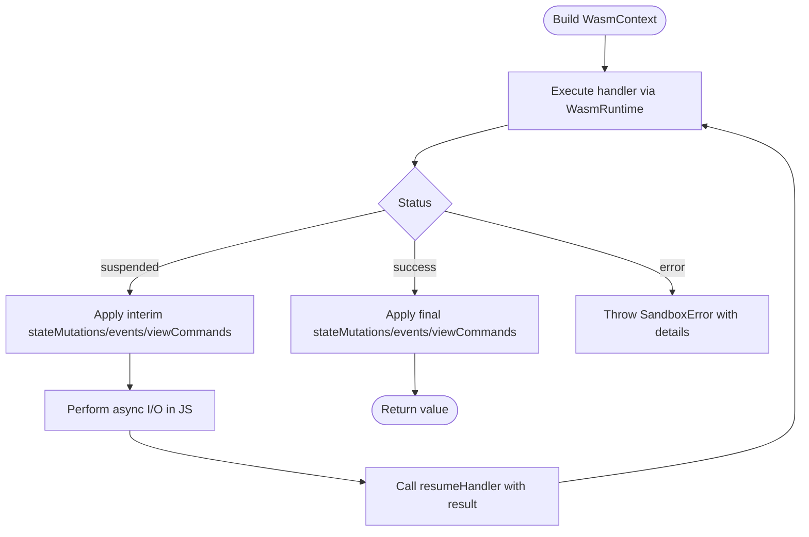
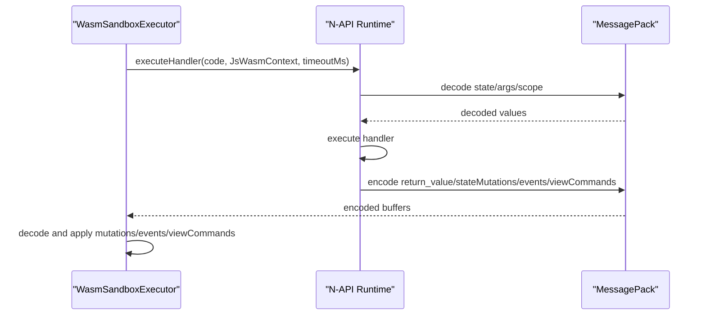
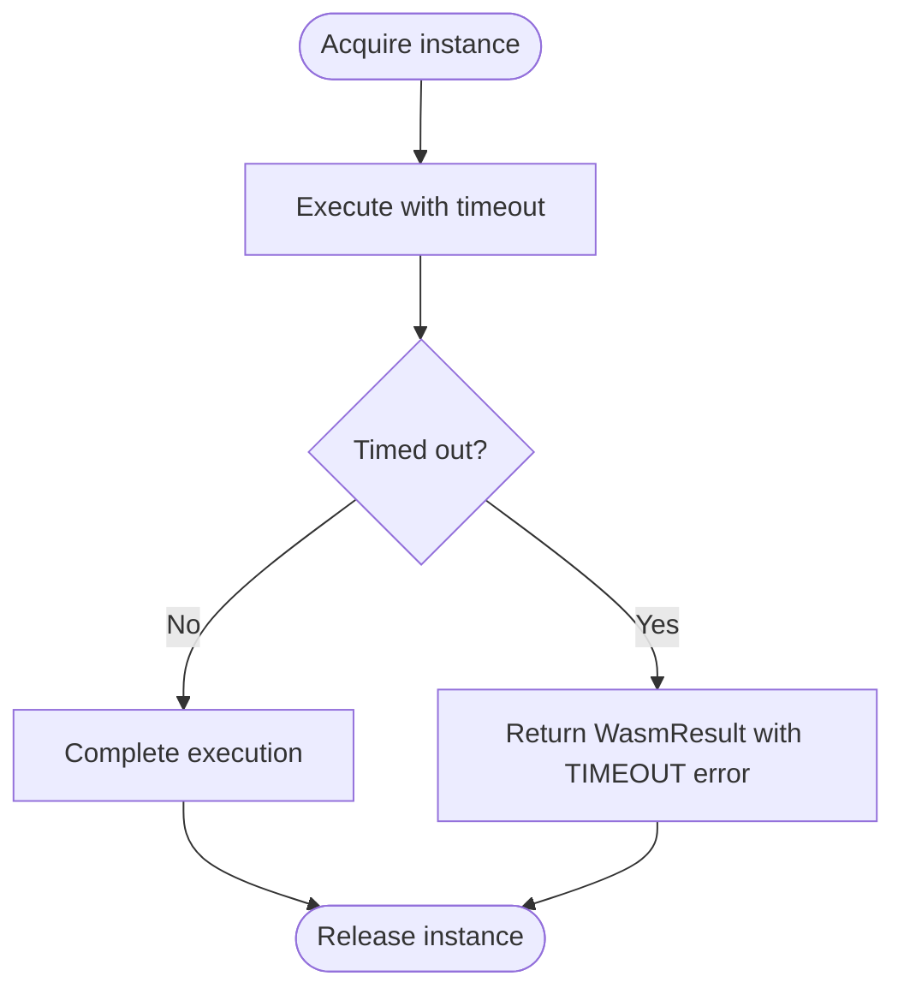
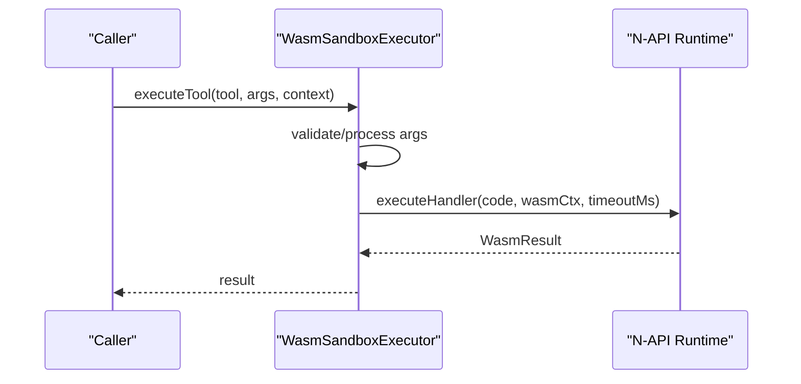
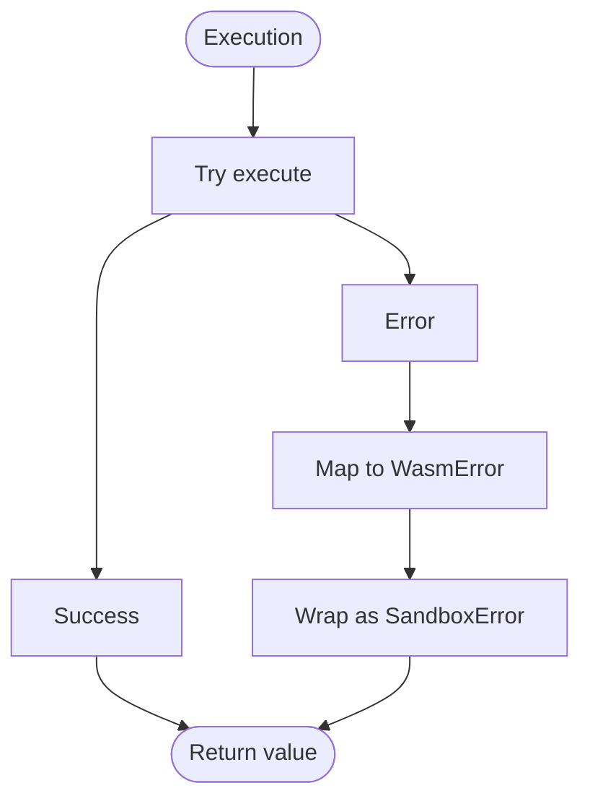
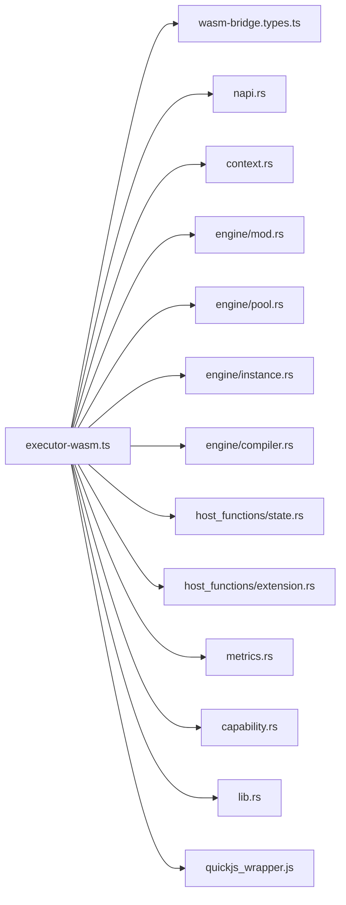

# Executor

<cite>
**Referenced Files in This Document**
- [executor.ts](file://packages/nexus-reactor/src/sandbox/executor.ts)
- [executor-wasm.ts](file://packages/nexus-reactor/src/sandbox/executor-wasm.ts)
- [wasm-bridge.types.ts](file://packages/nexus-reactor/src/sandbox/wasm-bridge.types.ts)
- [constants.ts](file://packages/nexus-reactor/src/core/constants.ts)
- [errors.ts](file://packages/nexus-reactor/src/core/errors.ts)
- [lib.rs](file://runtime/nexus-wasm-bridge/src/lib.rs)
- [napi.rs](file://runtime/nexus-wasm-bridge/src/napi.rs)
- [context.rs](file://runtime/nexus-wasm-bridge/src/context.rs)
- [engine/mod.rs](file://runtime/nexus-wasm-bridge/src/engine/mod.rs)
- [engine/instance.rs](file://runtime/nexus-wasm-bridge/src/engine/instance.rs)
- [engine/pool.rs](file://runtime/nexus-wasm-bridge/src/engine/pool.rs)
- [engine/compiler.rs](file://runtime/nexus-wasm-bridge/src/engine/compiler.rs)
- [host_functions/state.rs](file://runtime/nexus-wasm-bridge/src/host_functions/state.rs)
- [host_functions/extension.rs](file://runtime/nexus-wasm-bridge/src/host_functions/extension.rs)
- [metrics.rs](file://runtime/nexus-wasm-bridge/src/metrics.rs)
- [capability.rs](file://runtime/nexus-wasm-bridge/src/capability.rs)
- [quickjs_wrapper.js](file://runtime/nexus-wasm-bridge/src/quickjs_wrapper.js)
</cite>

## Table of Contents
1. [Introduction](#introduction)
2. [Project Structure](#project-structure)
3. [Core Components](#core-components)
4. [Architecture Overview](#architecture-overview)
5. [Detailed Component Analysis](#detailed-component-analysis)
6. [Dependency Analysis](#dependency-analysis)
7. [Performance Considerations](#performance-considerations)
8. [Troubleshooting Guide](#troubleshooting-guide)
9. [Conclusion](#conclusion)
10. [Appendices](#appendices)

## Introduction
This document explains the Executor component responsible for securely executing panel logic handlers. It covers how the Reactor’s JavaScript sandbox coordinates with the nexus-wasm-bridge via N-API, the data marshaling between Node.js and Rust, and the execution context, capability enforcement, and resource limitations. It also details error handling, timeouts, invocation patterns, security considerations, performance implications, debugging techniques, and monitoring strategies.

## Project Structure
The Executor spans two layers:
- Reactor sandbox layer (TypeScript): orchestrates execution, builds contexts, applies mutations/events/view commands, and integrates with the native WASM runtime.
- Bridge layer (Rust + N-API): provides the WASM runtime, instance pooling, compilation caching, capability enforcement, and host function hooks.



**Diagram sources**
- [executor.ts](file://packages/nexus-reactor/src/sandbox/executor.ts#L1-L161)
- [executor-wasm.ts](file://packages/nexus-reactor/src/sandbox/executor-wasm.ts#L1-L397)
- [wasm-bridge.types.ts](file://packages/nexus-reactor/src/sandbox/wasm-bridge.types.ts#L1-L332)
- [constants.ts](file://packages/nexus-reactor/src/core/constants.ts#L115-L120)
- [errors.ts](file://packages/nexus-reactor/src/core/errors.ts#L196-L241)
- [lib.rs](file://runtime/nexus-wasm-bridge/src/lib.rs#L1-L71)
- [napi.rs](file://runtime/nexus-wasm-bridge/src/napi.rs#L1-L491)
- [context.rs](file://runtime/nexus-wasm-bridge/src/context.rs#L120-L234)
- [engine/mod.rs](file://runtime/nexus-wasm-bridge/src/engine/mod.rs#L20-L219)
- [engine/pool.rs](file://runtime/nexus-wasm-bridge/src/engine/pool.rs#L1-L395)
- [engine/instance.rs](file://runtime/nexus-wasm-bridge/src/engine/instance.rs#L1-L381)
- [engine/compiler.rs](file://runtime/nexus-wasm-bridge/src/engine/compiler.rs#L1-L567)
- [host_functions/state.rs](file://runtime/nexus-wasm-bridge/src/host_functions/state.rs#L1-L238)
- [host_functions/extension.rs](file://runtime/nexus-wasm-bridge/src/host_functions/extension.rs#L1-L233)
- [metrics.rs](file://runtime/nexus-wasm-bridge/src/metrics.rs#L1-L474)
- [capability.rs](file://runtime/nexus-wasm-bridge/src/capability.rs#L1-L384)
- [quickjs_wrapper.js](file://runtime/nexus-wasm-bridge/src/quickjs_wrapper.js#L1-L200)

**Section sources**
- [executor.ts](file://packages/nexus-reactor/src/sandbox/executor.ts#L1-L161)
- [executor-wasm.ts](file://packages/nexus-reactor/src/sandbox/executor-wasm.ts#L1-L397)
- [wasm-bridge.types.ts](file://packages/nexus-reactor/src/sandbox/wasm-bridge.types.ts#L1-L332)
- [lib.rs](file://runtime/nexus-wasm-bridge/src/lib.rs#L1-L71)

## Core Components
- SandboxExecutor (legacy): compiles and executes inline JavaScript in a restricted global environment with argument validation and logging/emission helpers.
- WasmSandboxExecutor (primary): integrates with the nexus-wasm-bridge N-API module to execute handlers in isolated WASM instances with capability enforcement, suspension/resume for async I/O, and metrics collection.
- N-API Runtime (Rust): exposes a Node-compatible API for handler execution, precompilation, suspension resumption, and runtime statistics.
- Engine: manages instance pools, compilation caching, execution timeouts, and metrics aggregation.
- Host Functions: enforce capabilities for state, events, view commands, and extension calls.
- Context and Types: define the execution context, results, mutations, events, view commands, and suspension details.

**Section sources**
- [executor.ts](file://packages/nexus-reactor/src/sandbox/executor.ts#L1-L161)
- [executor-wasm.ts](file://packages/nexus-reactor/src/sandbox/executor-wasm.ts#L1-L397)
- [wasm-bridge.types.ts](file://packages/nexus-reactor/src/sandbox/wasm-bridge.types.ts#L1-L332)
- [napi.rs](file://runtime/nexus-wasm-bridge/src/napi.rs#L277-L438)
- [engine/mod.rs](file://runtime/nexus-wasm-bridge/src/engine/mod.rs#L20-L219)
- [host_functions/state.rs](file://runtime/nexus-wasm-bridge/src/host_functions/state.rs#L1-L238)
- [host_functions/extension.rs](file://runtime/nexus-wasm-bridge/src/host_functions/extension.rs#L1-L233)
- [context.rs](file://runtime/nexus-wasm-bridge/src/context.rs#L120-L234)

## Architecture Overview
The Executor coordinates secure execution across the bridge:



**Diagram sources**
- [executor-wasm.ts](file://packages/nexus-reactor/src/sandbox/executor-wasm.ts#L88-L201)
- [napi.rs](file://runtime/nexus-wasm-bridge/src/napi.rs#L299-L382)
- [engine/mod.rs](file://runtime/nexus-wasm-bridge/src/engine/mod.rs#L55-L110)
- [engine/pool.rs](file://runtime/nexus-wasm-bridge/src/engine/pool.rs#L118-L217)
- [engine/instance.rs](file://runtime/nexus-wasm-bridge/src/engine/instance.rs#L118-L211)
- [host_functions/state.rs](file://runtime/nexus-wasm-bridge/src/host_functions/state.rs#L1-L129)
- [host_functions/extension.rs](file://runtime/nexus-wasm-bridge/src/host_functions/extension.rs#L1-L112)

## Detailed Component Analysis

### WasmSandboxExecutor
Responsibilities:
- Initialize and lazily construct the WASM runtime via N-API.
- Build the execution context (state snapshot, args, capabilities, scope, extension registry).
- Execute handlers with optional precompiled bytecode and timeout.
- Manage suspension/resume loops for async extension calls.
- Apply state mutations, emit events, and execute view commands immediately upon suspension or completion.
- Collect and expose execution metrics and runtime statistics.
- Precompile handlers to improve cold-start latency.

Key behaviors:
- Serialization of state snapshots using structuredClone or JSON fallback.
- Capability inference fallback when handlers do not declare capabilities.
- Metrics callback registration and runtime stats retrieval.
- Graceful shutdown of the runtime.



**Diagram sources**
- [executor-wasm.ts](file://packages/nexus-reactor/src/sandbox/executor-wasm.ts#L48-L388)
- [wasm-bridge.types.ts](file://packages/nexus-reactor/src/sandbox/wasm-bridge.types.ts#L13-L41)
- [wasm-bridge.types.ts](file://packages/nexus-reactor/src/sandbox/wasm-bridge.types.ts#L257-L332)

**Section sources**
- [executor-wasm.ts](file://packages/nexus-reactor/src/sandbox/executor-wasm.ts#L48-L388)
- [wasm-bridge.types.ts](file://packages/nexus-reactor/src/sandbox/wasm-bridge.types.ts#L13-L41)
- [wasm-bridge.types.ts](file://packages/nexus-reactor/src/sandbox/wasm-bridge.types.ts#L257-L332)

### N-API Runtime (Rust)
Responsibilities:
- Expose a Node-compatible API for handler execution, precompilation, suspension resumption, and runtime stats.
- Convert between JS-friendly types and Rust-native types (MessagePack encoding/decoding).
- Provide capability inference from handler code.
- Initialize tracing and logging.

Integration highlights:
- JsRuntimeConfig and JsWasmContext map to RuntimeConfig and WasmContext.
- JsWasmResult maps to WasmResult and carries metrics and suspension details.
- JsAsyncResult maps to AsyncResult for resuming suspended execution.



**Diagram sources**
- [napi.rs](file://runtime/nexus-wasm-bridge/src/napi.rs#L277-L438)

**Section sources**
- [napi.rs](file://runtime/nexus-wasm-bridge/src/napi.rs#L1-L491)

### Execution Context and Results
- WasmContext includes panelId, handlerName, stateSnapshot, args, capabilities, scope, and extensionRegistry.
- WasmResult includes status, returnValue, stateMutations, events, viewCommands, suspension, error, and metrics.
- Intermediate mutations/events/view commands are applied immediately upon suspension to avoid “Blind Interval.”



**Diagram sources**
- [context.rs](file://runtime/nexus-wasm-bridge/src/context.rs#L120-L234)
- [executor-wasm.ts](file://packages/nexus-reactor/src/sandbox/executor-wasm.ts#L132-L199)

**Section sources**
- [context.rs](file://runtime/nexus-wasm-bridge/src/context.rs#L120-L234)
- [executor-wasm.ts](file://packages/nexus-reactor/src/sandbox/executor-wasm.ts#L88-L201)

### Capability Enforcement and Security
- CapabilityToken model supports scoped permissions for state read/write, events emit, view updates, and extension access.
- CapabilityChecker enforces permissions at host function boundaries.
- Host functions validate capabilities before performing state mutations, emitting events, or suspending extension calls.
- Capability inference from code is available but marked as unsafe fallback in the current implementation.

```mermaid
classDiagram
class CapabilityToken {
<<enum>>
+StateRead(key)
+StateWrite(key)
+StateReadAll
+StateWriteAll
+EventsEmit(name)
+EventsEmitAll
+ViewUpdate(id)
+ViewUpdateAll
+Extension(name)
+ExtensionAll
+matches(required) : bool
+to_string() : string
}
class CapabilityChecker {
-capabilities : Vec~CapabilityToken~
+new(caps)
+can_read_state(key) : bool
+can_write_state(key) : bool
+can_emit_event(name) : bool
+can_update_view(component_id) : bool
+can_access_extension(ext_name) : bool
+check(required) : bool
}
class state_get/state_set/state_delete {
+enforce state : read/state : write
}
class ext_suspend {
+enforce ext : *
}
CapabilityToken <.. CapabilityChecker
CapabilityChecker --> state_get
CapabilityChecker --> state_set
CapabilityChecker --> state_delete
CapabilityChecker --> ext_suspend
```

**Diagram sources**
- [capability.rs](file://runtime/nexus-wasm-bridge/src/capability.rs#L1-L119)
- [capability.rs](file://runtime/nexus-wasm-bridge/src/capability.rs#L179-L225)
- [host_functions/state.rs](file://runtime/nexus-wasm-bridge/src/host_functions/state.rs#L1-L129)
- [host_functions/extension.rs](file://runtime/nexus-wasm-bridge/src/host_functions/extension.rs#L1-L112)

**Section sources**
- [capability.rs](file://runtime/nexus-wasm-bridge/src/capability.rs#L1-L384)
- [host_functions/state.rs](file://runtime/nexus-wasm-bridge/src/host_functions/state.rs#L1-L238)
- [host_functions/extension.rs](file://runtime/nexus-wasm-bridge/src/host_functions/extension.rs#L1-L233)

### Marshaling Between Node.js and Rust (N-API)
- MessagePack encoding/decoding is used for values passed to/from the host environment.
- JsRuntimeConfig and JsWasmContext map to RuntimeConfig and WasmContext.
- JsWasmResult maps to WasmResult and includes metrics and suspension details.
- JsAsyncResult maps to AsyncResult for resuming suspended execution.



**Diagram sources**
- [napi.rs](file://runtime/nexus-wasm-bridge/src/napi.rs#L50-L175)
- [napi.rs](file://runtime/nexus-wasm-bridge/src/napi.rs#L176-L222)
- [napi.rs](file://runtime/nexus-wasm-bridge/src/napi.rs#L299-L382)

**Section sources**
- [napi.rs](file://runtime/nexus-wasm-bridge/src/napi.rs#L50-L175)
- [napi.rs](file://runtime/nexus-wasm-bridge/src/napi.rs#L176-L222)

### Timeout Management and Resource Limitations
- Execution timeout enforced via tokio::time::timeout in the engine.
- Instance pooling limits concurrency and reuses instances efficiently.
- Memory and stack limits configured via RuntimeConfig.
- Metrics capture execution time, memory usage, host calls, and cache hit rates.



**Diagram sources**
- [engine/mod.rs](file://runtime/nexus-wasm-bridge/src/engine/mod.rs#L55-L110)
- [engine/pool.rs](file://runtime/nexus-wasm-bridge/src/engine/pool.rs#L118-L217)
- [metrics.rs](file://runtime/nexus-wasm-bridge/src/metrics.rs#L1-L123)

**Section sources**
- [engine/mod.rs](file://runtime/nexus-wasm-bridge/src/engine/mod.rs#L55-L110)
- [engine/pool.rs](file://runtime/nexus-wasm-bridge/src/engine/pool.rs#L118-L217)
- [metrics.rs](file://runtime/nexus-wasm-bridge/src/metrics.rs#L1-L123)

### Invocation Patterns and Parameter Passing
- Tools: argument validation and coercion occur before invoking the underlying handler.
- Handlers: context includes $state, $args, $view, $emit, $ext, $log; execution uses a sandboxed function factory.
- N-API: handlers are passed as strings; precompiled bytecode can be reused.



**Diagram sources**
- [executor-wasm.ts](file://packages/nexus-reactor/src/sandbox/executor-wasm.ts#L203-L238)
- [executor.ts](file://packages/nexus-reactor/src/sandbox/executor.ts#L37-L67)

**Section sources**
- [executor-wasm.ts](file://packages/nexus-reactor/src/sandbox/executor-wasm.ts#L203-L238)
- [executor.ts](file://packages/nexus-reactor/src/sandbox/executor.ts#L37-L67)

### Error Handling and Failure Modes
- SandboxError wraps execution failures with toolName and handlerCode details.
- WasmError includes code, message, stack, location, and snippet.
- Engine returns WasmResult with error status and metrics; Executor translates to SandboxError.



**Diagram sources**
- [errors.ts](file://packages/nexus-reactor/src/core/errors.ts#L196-L241)
- [context.rs](file://runtime/nexus-wasm-bridge/src/context.rs#L235-L295)
- [engine/mod.rs](file://runtime/nexus-wasm-bridge/src/engine/mod.rs#L83-L109)

**Section sources**
- [errors.ts](file://packages/nexus-reactor/src/core/errors.ts#L196-L241)
- [context.rs](file://runtime/nexus-wasm-bridge/src/context.rs#L235-L295)
- [engine/mod.rs](file://runtime/nexus-wasm-bridge/src/engine/mod.rs#L83-L109)

### Security Considerations
- True isolation via separate WASM instances per execution.
- Capability-based enforcement prevents unauthorized state, events, view, and extension access.
- Restricted globals in the legacy sandbox and wrapper injection in the WASM sandbox.
- Extension registry ensures only registered methods can be invoked.

**Section sources**
- [capability.rs](file://runtime/nexus-wasm-bridge/src/capability.rs#L1-L119)
- [host_functions/state.rs](file://runtime/nexus-wasm-bridge/src/host_functions/state.rs#L1-L129)
- [host_functions/extension.rs](file://runtime/nexus-wasm-bridge/src/host_functions/extension.rs#L1-L112)
- [executor.ts](file://packages/nexus-reactor/src/sandbox/executor.ts#L69-L114)
- [quickjs_wrapper.js](file://runtime/nexus-wasm-bridge/src/quickjs_wrapper.js#L1-L200)

### Performance Implications
- Serialization overhead: MessagePack/JSON conversion for values crossing the bridge; structuredClone fallback for deep cloning.
- Compilation caching: HandlerCompiler caches bytecode and source maps; disk cache supported.
- Instance pooling: Reduces creation costs; semaphore limits concurrency.
- Metrics: Host call counts, cache hit rates, and memory usage aid tuning.

**Section sources**
- [napi.rs](file://runtime/nexus-wasm-bridge/src/napi.rs#L50-L175)
- [engine/compiler.rs](file://runtime/nexus-wasm-bridge/src/engine/compiler.rs#L168-L214)
- [engine/pool.rs](file://runtime/nexus-wasm-bridge/src/engine/pool.rs#L118-L217)
- [metrics.rs](file://runtime/nexus-wasm-bridge/src/metrics.rs#L1-L123)

## Dependency Analysis


**Diagram sources**
- [executor-wasm.ts](file://packages/nexus-reactor/src/sandbox/executor-wasm.ts#L1-L397)
- [wasm-bridge.types.ts](file://packages/nexus-reactor/src/sandbox/wasm-bridge.types.ts#L1-L332)
- [napi.rs](file://runtime/nexus-wasm-bridge/src/napi.rs#L1-L491)
- [context.rs](file://runtime/nexus-wasm-bridge/src/context.rs#L1-L234)
- [engine/mod.rs](file://runtime/nexus-wasm-bridge/src/engine/mod.rs#L1-L219)
- [engine/pool.rs](file://runtime/nexus-wasm-bridge/src/engine/pool.rs#L1-L395)
- [engine/instance.rs](file://runtime/nexus-wasm-bridge/src/engine/instance.rs#L1-L381)
- [engine/compiler.rs](file://runtime/nexus-wasm-bridge/src/engine/compiler.rs#L1-L567)
- [host_functions/state.rs](file://runtime/nexus-wasm-bridge/src/host_functions/state.rs#L1-L238)
- [host_functions/extension.rs](file://runtime/nexus-wasm-bridge/src/host_functions/extension.rs#L1-L233)
- [metrics.rs](file://runtime/nexus-wasm-bridge/src/metrics.rs#L1-L474)
- [capability.rs](file://runtime/nexus-wasm-bridge/src/capability.rs#L1-L384)
- [lib.rs](file://runtime/nexus-wasm-bridge/src/lib.rs#L1-L71)
- [quickjs_wrapper.js](file://runtime/nexus-wasm-bridge/src/quickjs_wrapper.js#L1-L200)

**Section sources**
- [executor-wasm.ts](file://packages/nexus-reactor/src/sandbox/executor-wasm.ts#L1-L397)
- [engine/mod.rs](file://runtime/nexus-wasm-bridge/src/engine/mod.rs#L1-L219)

## Performance Considerations
- Prefer precompilation for frequently used handlers to reduce cold-start latency.
- Tune instance pool size and memory limits to balance throughput and resource usage.
- Monitor cache hit rate and compilation time to optimize handler reuse.
- Track host call counts and memory usage to identify hotspots.

[No sources needed since this section provides general guidance]

## Troubleshooting Guide
Common issues and remedies:
- Initialization failures: Ensure the native module is built and installed; check error hints for build steps.
- Permission denials: Verify handler capabilities and extension registry entries.
- Timeouts: Increase timeoutMs or optimize handler logic; review metrics for long-running operations.
- Serialization errors: Confirm MessagePack decoding paths and buffer handling.
- Suspension mismatches: Ensure suspensionId is preserved and resume is called with the correct result.

Debugging techniques:
- Enable tracing in the bridge runtime and inspect logs.
- Use metrics and Prometheus output to monitor execution health.
- Inspect WasmError details (code, location, snippet) for precise failure locations.

**Section sources**
- [executor-wasm.ts](file://packages/nexus-reactor/src/sandbox/executor-wasm.ts#L60-L83)
- [host_functions/state.rs](file://runtime/nexus-wasm-bridge/src/host_functions/state.rs#L1-L129)
- [host_functions/extension.rs](file://runtime/nexus-wasm-bridge/src/host_functions/extension.rs#L1-L112)
- [metrics.rs](file://runtime/nexus-wasm-bridge/src/metrics.rs#L284-L339)

## Conclusion
The Executor component provides a robust, secure, and observable execution pipeline for panel logic handlers. By leveraging the nexus-wasm-bridge via N-API, it achieves true isolation, capability enforcement, and efficient resource management. The suspension/resume mechanism enables responsive async I/O, while comprehensive metrics and error handling support operational reliability.

[No sources needed since this section summarizes without analyzing specific files]

## Appendices

### Example Invocation and Processing
- Invoke a tool with validated arguments and receive a typed result.
- Apply state mutations, emit events, and execute view commands immediately upon suspension.
- Resume execution with the result of external I/O and finalize with the handler’s return value.

**Section sources**
- [executor-wasm.ts](file://packages/nexus-reactor/src/sandbox/executor-wasm.ts#L132-L201)
- [executor-wasm.ts](file://packages/nexus-reactor/src/sandbox/executor-wasm.ts#L203-L238)