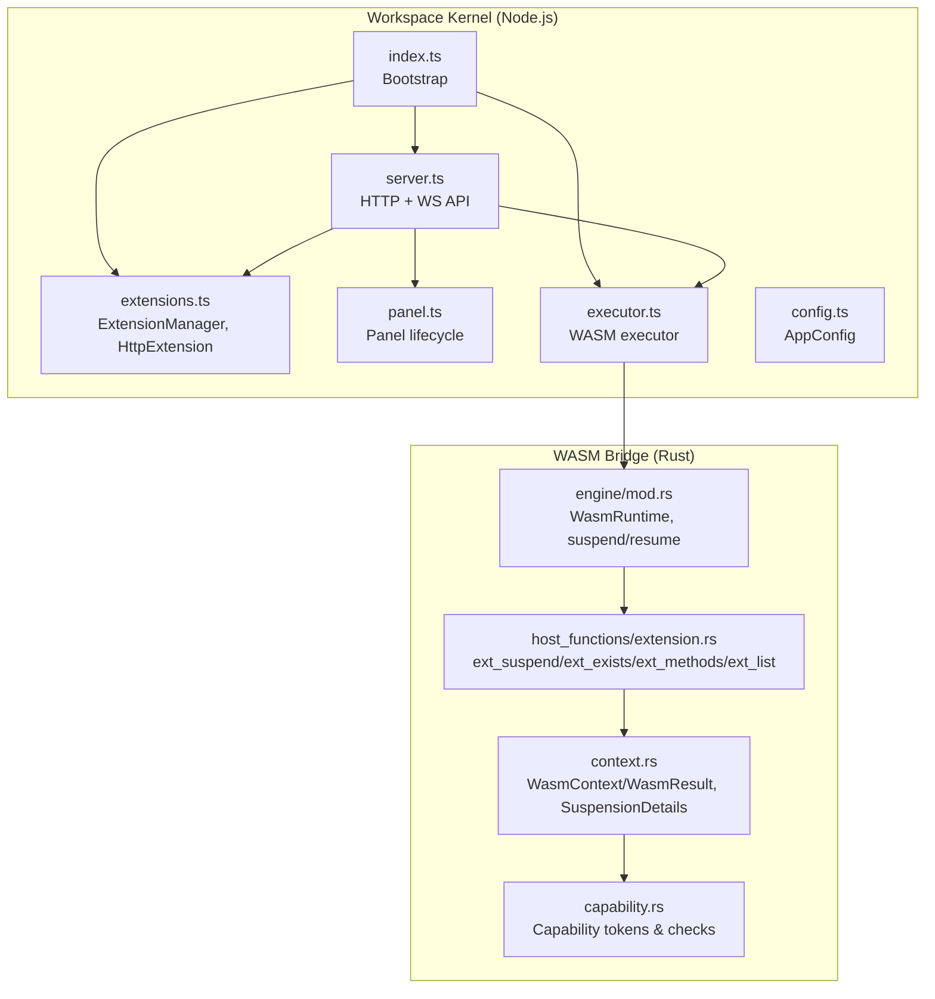
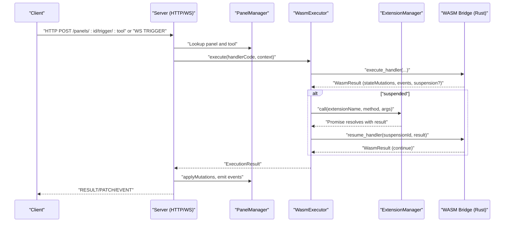
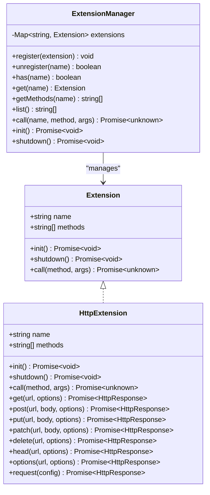
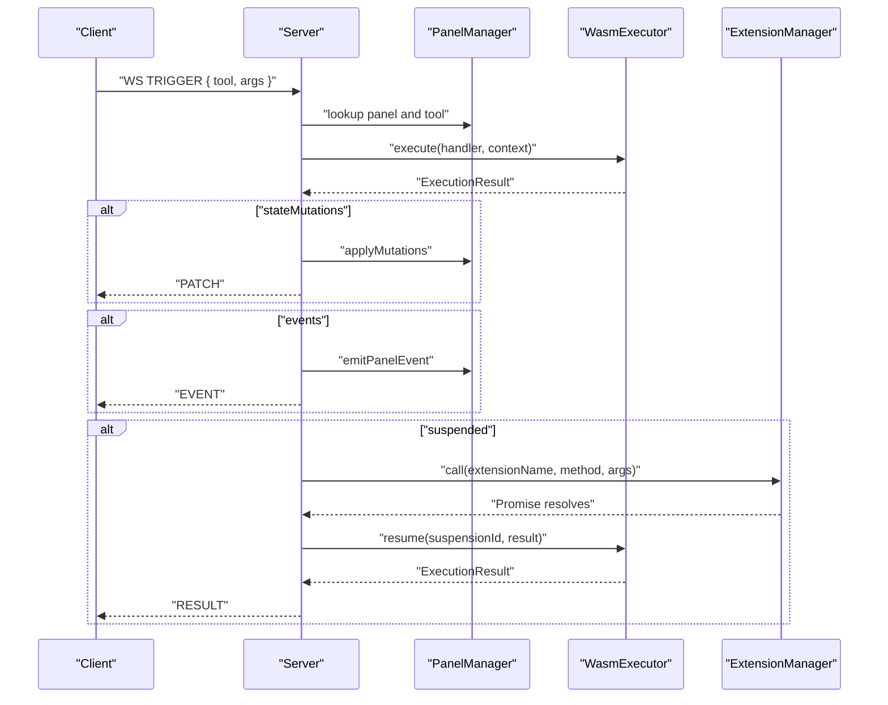
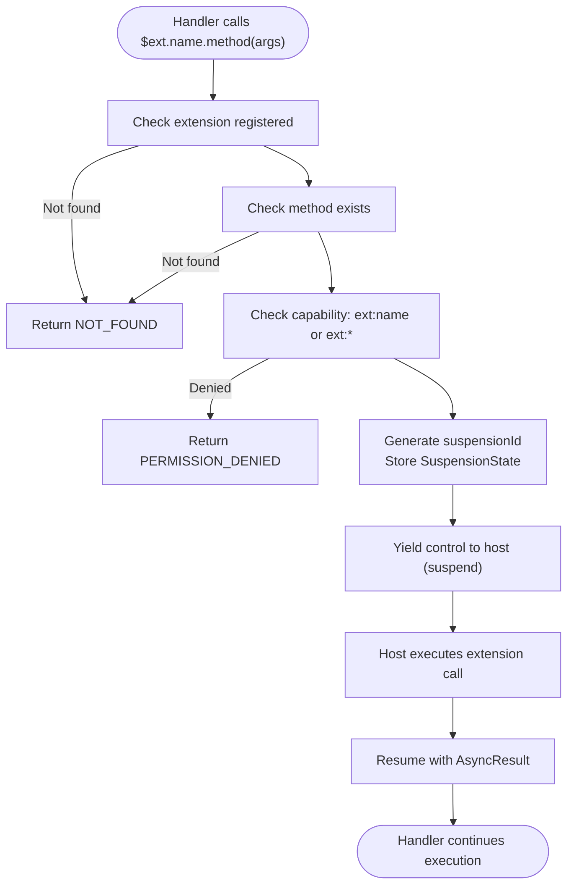
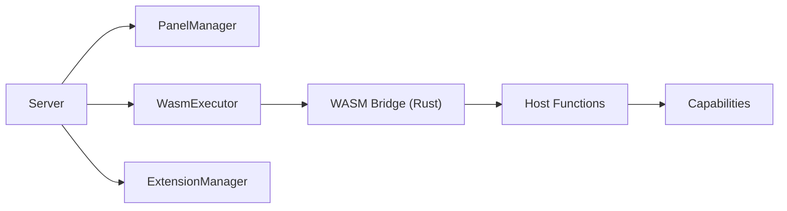

# Extensions

<cite>
**Referenced Files in This Document**
- [extensions.ts](file://runtime/workspace-kernel/src/extensions.ts)
- [types.ts](file://runtime/workspace-kernel/src/types.ts)
- [index.ts](file://runtime/workspace-kernel/src/index.ts)
- [server.ts](file://runtime/workspace-kernel/src/server.ts)
- [panel.ts](file://runtime/workspace-kernel/src/panel.ts)
- [executor.ts](file://runtime/workspace-kernel/src/executor.ts)
- [config.ts](file://runtime/workspace-kernel/src/config.ts)
- [extension.rs](file://runtime/nexus-wasm-bridge/src/host_functions/extension.rs)
- [context.rs](file://runtime/nexus-wasm-bridge/src/context.rs)
- [engine/mod.rs](file://runtime/nexus-wasm-bridge/src/engine/mod.rs)
- [capability.rs](file://runtime/nexus-wasm-bridge/src/capability.rs)
- [README.md](file://runtime/README.md)
- [02_runtime_spec.md](file://docs/02_runtime_spec.md)
</cite>

## Table of Contents
1. [Introduction](#introduction)
2. [Project Structure](#project-structure)
3. [Core Components](#core-components)
4. [Architecture Overview](#architecture-overview)
5. [Detailed Component Analysis](#detailed-component-analysis)
6. [Dependency Analysis](#dependency-analysis)
7. [Performance Considerations](#performance-considerations)
8. [Troubleshooting Guide](#troubleshooting-guide)
9. [Conclusion](#conclusion)
10. [Appendices](#appendices)

## Introduction
This document explains the Extensions system that enables external services and custom functionality to integrate into the Workspace Kernel. It covers how extensions are registered, how lifecycle hooks operate, and how the system communicates with the core runtime. It also describes how extensions can expose new HTTP endpoints, handle WebSocket messages, and interact with panel instances. Practical examples illustrate implementing common extension types such as authentication providers, monitoring integrations, and storage backends. Security considerations, sandboxing, and best practices for extension development and debugging are included.

## Project Structure
The Extensions system spans both the Node.js Workspace Kernel and the Rust WASM Bridge:
- Workspace Kernel (Node.js): Registration, lifecycle, HTTP/WebSocket orchestration, and extension invocation.
- WASM Bridge (Rust): Capability enforcement, suspend/resume for async calls, and host function integration.

**Diagram sources**
- [index.ts](file://runtime/workspace-kernel/src/index.ts#L1-L149)
- [extensions.ts](file://runtime/workspace-kernel/src/extensions.ts#L1-L397)
- [server.ts](file://runtime/workspace-kernel/src/server.ts#L1-L703)
- [panel.ts](file://runtime/workspace-kernel/src/panel.ts#L1-L437)
- [executor.ts](file://runtime/workspace-kernel/src/executor.ts#L1-L541)
- [config.ts](file://runtime/workspace-kernel/src/config.ts#L1-L233)
- [extension.rs](file://runtime/nexus-wasm-bridge/src/host_functions/extension.rs#L1-L233)
- [context.rs](file://runtime/nexus-wasm-bridge/src/context.rs#L1-L695)
- [engine/mod.rs](file://runtime/nexus-wasm-bridge/src/engine/mod.rs#L1-L244)
- [capability.rs](file://runtime/nexus-wasm-bridge/src/capability.rs#L1-L384)

**Section sources**
- [README.md](file://runtime/README.md#L1-L210)
- [index.ts](file://runtime/workspace-kernel/src/index.ts#L1-L149)

## Core Components
- ExtensionManager: Registers, lists, validates, and dispatches extension methods. Supports init/shutdown lifecycle.
- HttpExtension: Built-in extension providing HTTP client capabilities with concurrency control, timeouts, and domain restrictions.
- Server: Exposes HTTP endpoints and WebSocket channels; triggers handler execution; executes extension calls and resumes suspended handlers.
- PanelManager: Tracks panel state, clients, and suspensions; applies state mutations and emits events.
- WasmExecutor: Bridges Node.js to the Rust WASM runtime via N-API; executes handlers, resumes suspended executions, and decodes results.
- WASM Bridge (Rust): Host functions enforce capabilities and manage suspend/resume; WasmRuntime pools instances and compiles handlers.

**Section sources**
- [extensions.ts](file://runtime/workspace-kernel/src/extensions.ts#L1-L397)
- [types.ts](file://runtime/workspace-kernel/src/types.ts#L275-L368)
- [server.ts](file://runtime/workspace-kernel/src/server.ts#L1-L703)
- [panel.ts](file://runtime/workspace-kernel/src/panel.ts#L1-L437)
- [executor.ts](file://runtime/workspace-kernel/src/executor.ts#L1-L541)
- [extension.rs](file://runtime/nexus-wasm-bridge/src/host_functions/extension.rs#L1-L233)
- [context.rs](file://runtime/nexus-wasm-bridge/src/context.rs#L1-L695)
- [engine/mod.rs](file://runtime/nexus-wasm-bridge/src/engine/mod.rs#L1-L244)
- [capability.rs](file://runtime/nexus-wasm-bridge/src/capability.rs#L1-L384)

## Architecture Overview
The Extensions system integrates with the handler execution pipeline and the WebSocket transport:

**Diagram sources**
- [server.ts](file://runtime/workspace-kernel/src/server.ts#L297-L451)
- [executor.ts](file://runtime/workspace-kernel/src/executor.ts#L214-L303)
- [extensions.ts](file://runtime/workspace-kernel/src/extensions.ts#L67-L111)
- [extension.rs](file://runtime/nexus-wasm-bridge/src/host_functions/extension.rs#L1-L112)
- [context.rs](file://runtime/nexus-wasm-bridge/src/context.rs#L425-L494)

## Detailed Component Analysis

### ExtensionManager and HttpExtension
- Registration and dispatch:
  - register(name, methods, call): Validates uniqueness and logs registration.
  - getMethods(name): Lists available methods.
  - call(name, method, args): Validates existence and invokes extension.
  - init()/shutdown(): Iterates registered extensions to initialize or tear down.
- HttpExtension:
  - Provides HTTP client methods: get, post, put, patch, delete, head, options, request.
  - Concurrency control via acquire/release slots and a pending queue.
  - Domain restriction via allowedDomains.
  - Timeout handling via AbortController and error propagation.
  - Response parsing for JSON/text and structured headers/data.

**Diagram sources**
- [extensions.ts](file://runtime/workspace-kernel/src/extensions.ts#L1-L397)
- [types.ts](file://runtime/workspace-kernel/src/types.ts#L275-L368)

**Section sources**
- [extensions.ts](file://runtime/workspace-kernel/src/extensions.ts#L1-L397)
- [types.ts](file://runtime/workspace-kernel/src/types.ts#L275-L368)

### Server: HTTP and WebSocket Integration
- HTTP routes:
  - /health, /metrics, /panels, /panels/:id, /panels/:id/state, /panels/:id/trigger/:tool.
- WebSocket:
  - Upgrade handler validates panel existence and optional JWT.
  - Client message types: TRIGGER, SUBSCRIBE, UNSUBSCRIBE, PING.
  - Server message types: CONNECTED, RESULT, PATCH, EVENT, PROGRESS, ERROR, PONG.
- Execution flow:
  - On TRIGGER, builds ExecutionContext, executes handler via WasmExecutor.
  - Applies state mutations immediately and broadcasts PATCH.
  - Emits events and broadcasts EVENT.
  - If suspended, executes extension call and resumes with result.

**Diagram sources**
- [server.ts](file://runtime/workspace-kernel/src/server.ts#L250-L451)
- [panel.ts](file://runtime/workspace-kernel/src/panel.ts#L143-L211)
- [executor.ts](file://runtime/workspace-kernel/src/executor.ts#L282-L303)
- [extensions.ts](file://runtime/workspace-kernel/src/extensions.ts#L67-L111)

**Section sources**
- [server.ts](file://runtime/workspace-kernel/src/server.ts#L1-L703)
- [panel.ts](file://runtime/workspace-kernel/src/panel.ts#L1-L437)
- [executor.ts](file://runtime/workspace-kernel/src/executor.ts#L1-L541)

### WASM Bridge: Host Functions and Suspend/Resume
- Host function ext_suspend:
  - Validates extension/method existence.
  - Enforces capability (ext:name or ext:*).
  - Stores suspension state and returns SuspensionDetails.
- Host function ext_exists/ext_methods/ext_list:
  - Query extension availability and methods.
- Rust WasmRuntime:
  - Compiles and caches handlers.
  - Executes with timeout and resource enforcement.
  - Suspend/resume for async operations.
- Context types:
  - WasmContext carries stateSnapshot, args, capabilities, extension registry.
  - WasmResult carries status, mutations, events, view commands, suspension, error, metrics.

**Diagram sources**
- [extension.rs](file://runtime/nexus-wasm-bridge/src/host_functions/extension.rs#L1-L112)
- [context.rs](file://runtime/nexus-wasm-bridge/src/context.rs#L425-L494)
- [engine/mod.rs](file://runtime/nexus-wasm-bridge/src/engine/mod.rs#L167-L195)

**Section sources**
- [extension.rs](file://runtime/nexus-wasm-bridge/src/host_functions/extension.rs#L1-L233)
- [context.rs](file://runtime/nexus-wasm-bridge/src/context.rs#L1-L695)
- [engine/mod.rs](file://runtime/nexus-wasm-bridge/src/engine/mod.rs#L1-L244)
- [capability.rs](file://runtime/nexus-wasm-bridge/src/capability.rs#L1-L384)

### Implementation Patterns and Best Practices
- Implementing a custom extension:
  - Define an Extension class with name, methods, and call implementation.
  - Optionally implement init/shutdown for resource setup/cleanup.
  - Register via ExtensionManager.register().
- HTTP endpoint exposure:
  - The Workspace Kernel does not expose new HTTP endpoints directly through extensions. Instead, handlers can call extensions (e.g., $ext.http.get) to perform HTTP operations. For custom HTTP endpoints, implement a handler tool that uses the HTTP extension and expose it via the panel’s Logic namespace.
- WebSocket message handling:
  - The Server handles WebSocket messages (TRIGGER, SUBSCRIBE, UNSUBSCRIBE, PING). Extensions are invoked from handler execution; they do not directly receive WebSocket messages.
- Interacting with panel instances:
  - Use PanelManager to track clients, apply state mutations, emit events, and manage suspensions.
  - WasmExecutor executes handlers and resumes suspended executions.
- Security and sandboxing:
  - Capability-based enforcement ensures handlers cannot access unauthorized resources.
  - Extension access requires ext:name or ext:* capability.
  - HTTP extension supports allowedDomains and timeouts to mitigate risks.
- Configuration:
  - AppConfig.extensions.http controls HTTP extension behavior (maxConcurrent, defaultTimeout, allowedDomains, userAgent).
  - RuntimeConfig controls WASM instance limits, memory, and timeouts.

**Section sources**
- [extensions.ts](file://runtime/workspace-kernel/src/extensions.ts#L1-L397)
- [server.ts](file://runtime/workspace-kernel/src/server.ts#L1-L703)
- [panel.ts](file://runtime/workspace-kernel/src/panel.ts#L1-L437)
- [executor.ts](file://runtime/workspace-kernel/src/executor.ts#L1-L541)
- [config.ts](file://runtime/workspace-kernel/src/config.ts#L1-L233)
- [capability.rs](file://runtime/nexus-wasm-bridge/src/capability.rs#L1-L384)

### Example Scenarios

#### Authentication Provider Extension
- Goal: Provide an authentication provider that handlers can call via $ext.auth.login.
- Steps:
  - Implement an Extension with methods like login, logout, whoami.
  - In init(), load secrets and configure client.
  - In call(), route to appropriate method and return structured result.
  - Register the extension with ExtensionManager.register().
  - In handler code, call $ext.auth.login(args) and handle result.
- Security:
  - Require capability ext:auth or ext:*.
  - Enforce allowedDomains for external identity providers.
  - Use timeouts and concurrency limits.

**Section sources**
- [extensions.ts](file://runtime/workspace-kernel/src/extensions.ts#L1-L397)
- [extension.rs](file://runtime/nexus-wasm-bridge/src/host_functions/extension.rs#L1-L112)
- [capability.rs](file://runtime/nexus-wasm-bridge/src/capability.rs#L1-L384)

#### Monitoring Integration Extension
- Goal: Expose metrics collection via $ext.monitor.health.
- Steps:
  - Implement Extension with methods like health, metrics.
  - In call(), perform internal checks and return structured data.
  - Handlers can call $ext.monitor.health and render results in the View.
- Observability:
  - Use WasmExecutor.getMetrics() for runtime metrics.
  - Leverage Server /metrics endpoint for Prometheus scraping.

**Section sources**
- [executor.ts](file://runtime/workspace-kernel/src/executor.ts#L304-L339)
- [server.ts](file://runtime/workspace-kernel/src/server.ts#L478-L509)

#### Storage Backend Extension
- Goal: Provide storage operations via $ext.storage.get and $ext.storage.put.
- Steps:
  - Implement Extension with methods get(key), put(key, value).
  - In init(), connect to storage backend (e.g., local cache, remote DB).
  - In call(), route to get/put and handle errors.
- Constraints:
  - Enforce capability ext:storage or ext:*.
  - Respect allowedDomains for remote storage endpoints.

**Section sources**
- [extensions.ts](file://runtime/workspace-kernel/src/extensions.ts#L1-L397)
- [extension.rs](file://runtime/nexus-wasm-bridge/src/host_functions/extension.rs#L1-L112)
- [capability.rs](file://runtime/nexus-wasm-bridge/src/capability.rs#L1-L384)

## Dependency Analysis
- Coupling:
  - Server depends on PanelManager, WasmExecutor, and ExtensionManager.
  - WasmExecutor depends on the Rust WASM Bridge (N-API).
  - WASM Bridge depends on host functions and capability enforcement.
- Cohesion:
  - ExtensionManager encapsulates extension lifecycle and dispatch.
  - HttpExtension encapsulates HTTP client behavior.
- External dependencies:
  - Node.js HTTP/WebSocket stack.
  - Rust WASM runtime (WasmEdge) and host functions.
  - MessagePack for cross-language serialization.

**Diagram sources**
- [server.ts](file://runtime/workspace-kernel/src/server.ts#L1-L703)
- [executor.ts](file://runtime/workspace-kernel/src/executor.ts#L1-L541)
- [extension.rs](file://runtime/nexus-wasm-bridge/src/host_functions/extension.rs#L1-L233)
- [capability.rs](file://runtime/nexus-wasm-bridge/src/capability.rs#L1-L384)

**Section sources**
- [server.ts](file://runtime/workspace-kernel/src/server.ts#L1-L703)
- [executor.ts](file://runtime/workspace-kernel/src/executor.ts#L1-L541)
- [extension.rs](file://runtime/nexus-wasm-bridge/src/host_functions/extension.rs#L1-L233)
- [capability.rs](file://runtime/nexus-wasm-bridge/src/capability.rs#L1-L384)

## Performance Considerations
- Instance pooling and compilation caching reduce cold-start latency.
- Concurrency control in HttpExtension prevents overload.
- Immediate mutation application during suspension improves UI responsiveness.
- Prefer precompiling hot handlers to minimize compile overhead.

[No sources needed since this section provides general guidance]

## Troubleshooting Guide
- Extension not found:
  - Verify extension is registered and methods are declared.
  - Check capability tokens (ext:name or ext:*).
- Permission denied:
  - Ensure handler has required capability tokens.
  - Confirm extension registry matches context.
- HTTP failures:
  - Check allowedDomains and timeouts.
  - Inspect response headers/data and error messages.
- Suspension issues:
  - Confirm suspensionId is tracked and resume is called with AsyncResult.
  - Validate that mutations/events are applied after resume.

**Section sources**
- [extension.rs](file://runtime/nexus-wasm-bridge/src/host_functions/extension.rs#L1-L112)
- [capability.rs](file://runtime/nexus-wasm-bridge/src/capability.rs#L1-L384)
- [extensions.ts](file://runtime/workspace-kernel/src/extensions.ts#L1-L397)
- [server.ts](file://runtime/workspace-kernel/src/server.ts#L384-L451)

## Conclusion
The Extensions system provides a secure, capability-enforced mechanism for integrating external services and custom functionality into the Workspace Kernel. Handlers can call extensions asynchronously, enabling immediate UI updates and robust error handling. The system’s design balances performance with safety, leveraging WASM isolation, capability checks, and suspend/resume semantics. By following the patterns outlined here, developers can implement reliable extensions for authentication, monitoring, storage, and more.

[No sources needed since this section summarizes without analyzing specific files]

## Appendices

### API and Communication Patterns
- HTTP API:
  - /health, /metrics, /panels, /panels/:id, /panels/:id/state, /panels/:id/trigger/:tool.
- WebSocket API:
  - Connect to ws://host:port/panels/{panelId}/ws.
  - Client messages: TRIGGER, SUBSCRIBE, UNSUBSCRIBE, PING.
  - Server messages: CONNECTED, RESULT, PATCH, EVENT, PROGRESS, ERROR, PONG.

**Section sources**
- [server.ts](file://runtime/workspace-kernel/src/server.ts#L120-L201)
- [README.md](file://runtime/README.md#L115-L142)

### Security and Sandboxing
- Capability tokens define access to state, events, view updates, and extensions.
- Host functions enforce capability checks before mutating state or emitting events.
- HTTP extension enforces allowedDomains and timeouts.

**Section sources**
- [capability.rs](file://runtime/nexus-wasm-bridge/src/capability.rs#L1-L384)
- [extension.rs](file://runtime/nexus-wasm-bridge/src/host_functions/extension.rs#L1-L112)
- [extensions.ts](file://runtime/workspace-kernel/src/extensions.ts#L1-L397)

### Best Practices for Extension Development
- Define minimal, focused methods and validate inputs.
- Use capability tokens to restrict access.
- Implement init/shutdown for resource management.
- Provide timeouts and concurrency limits.
- Log and emit structured errors for diagnostics.

**Section sources**
- [extensions.ts](file://runtime/workspace-kernel/src/extensions.ts#L1-L397)
- [config.ts](file://runtime/workspace-kernel/src/config.ts#L1-L233)
- [02_runtime_spec.md](file://docs/02_runtime_spec.md#L1-L2882)