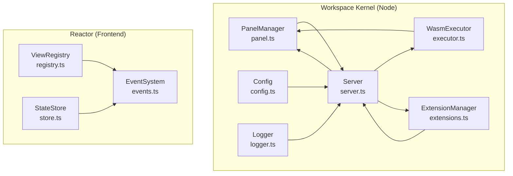
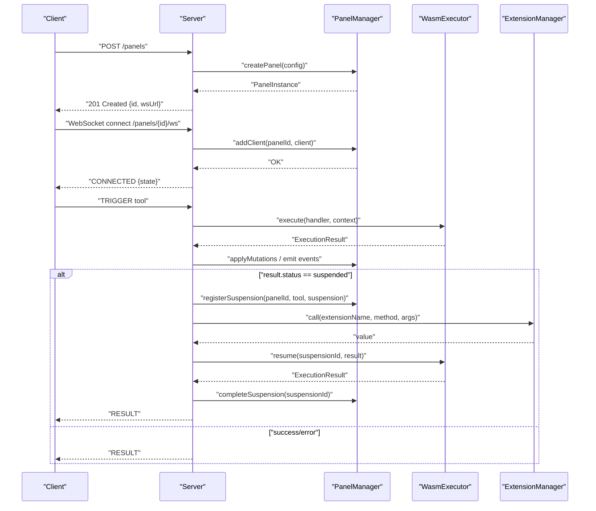
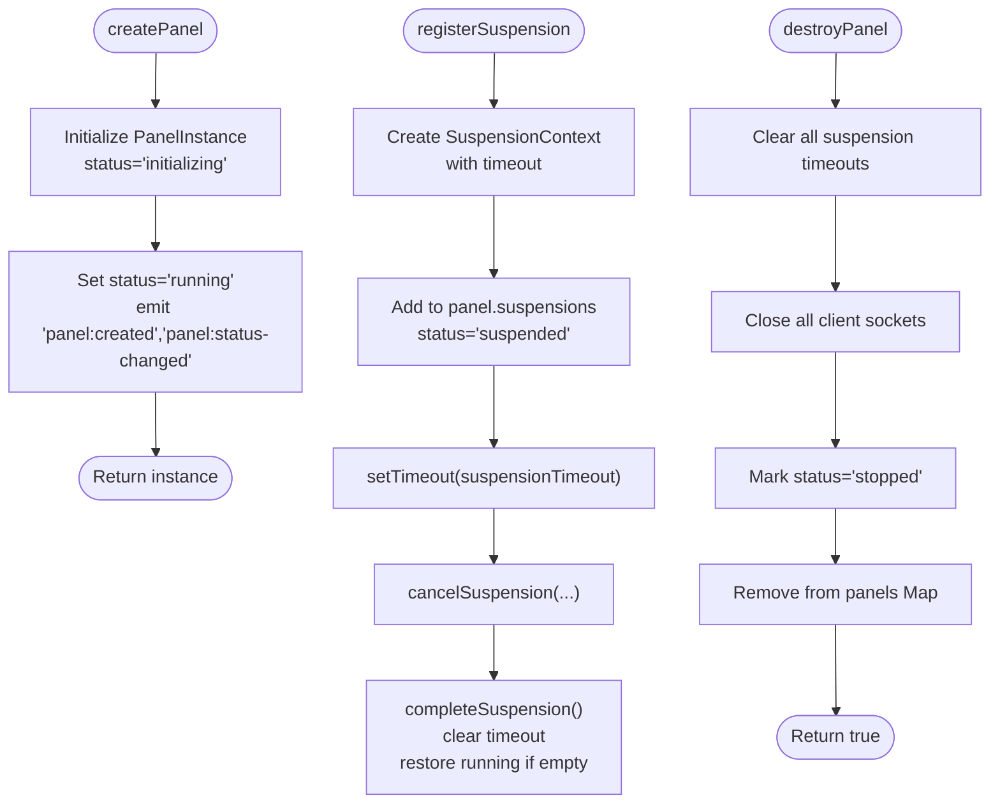
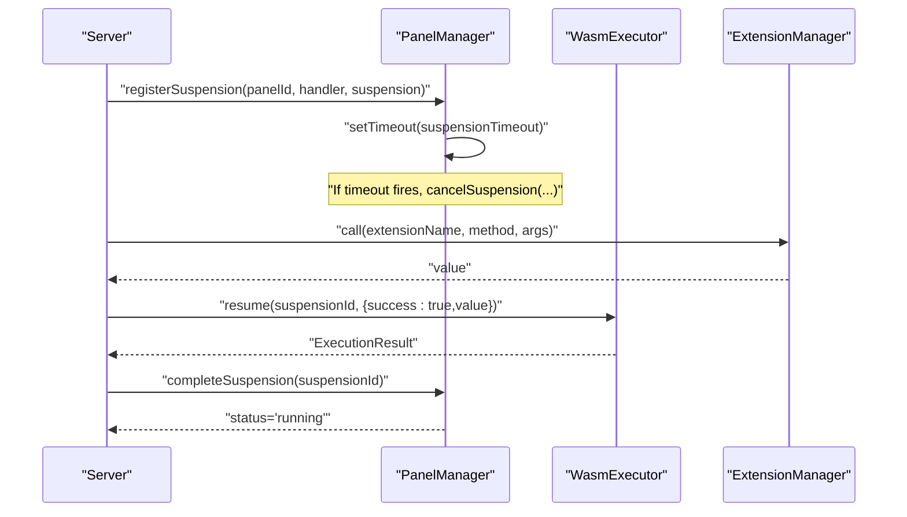
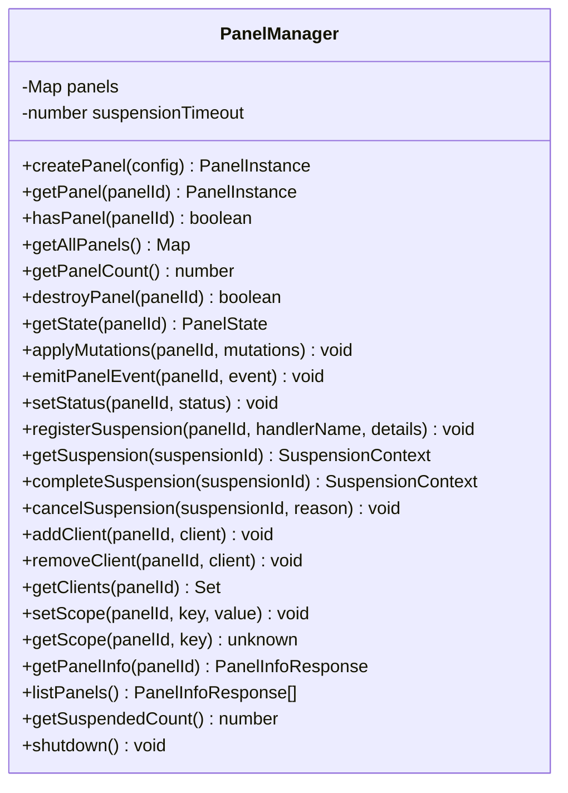
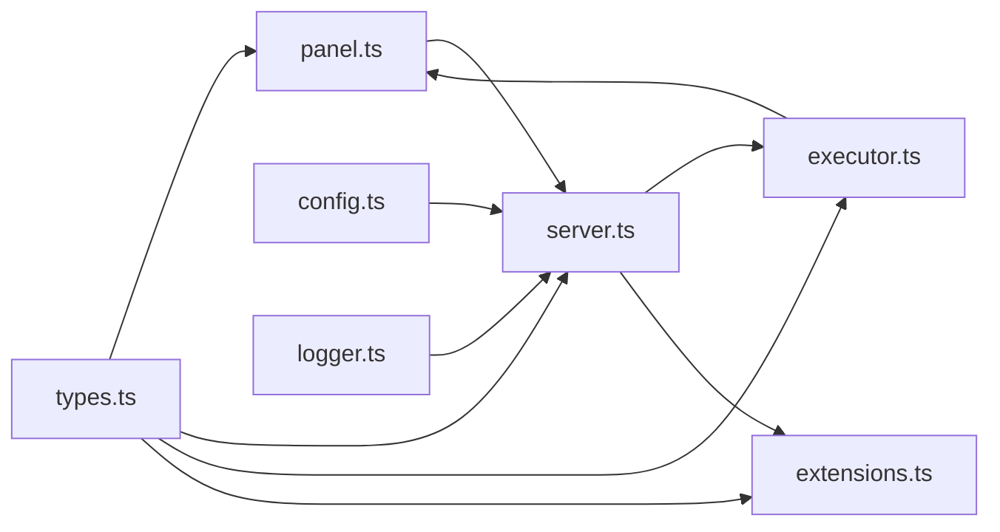

# Panel Management

<cite>
**Referenced Files in This Document**
- [panel.ts](file://runtime/workspace-kernel/src/panel.ts)
- [types.ts](file://runtime/workspace-kernel/src/types.ts)
- [server.ts](file://runtime/workspace-kernel/src/server.ts)
- [index.ts](file://runtime/workspace-kernel/src/index.ts)
- [executor.ts](file://runtime/workspace-kernel/src/executor.ts)
- [extensions.ts](file://runtime/workspace-kernel/src/extensions.ts)
- [logger.ts](file://runtime/workspace-kernel/src/logger.ts)
- [config.ts](file://runtime/workspace-kernel/src/config.ts)
- [registry.ts](file://packages/nexus-reactor/src/view/registry.ts)
- [store.ts](file://packages/nexus-reactor/src/state/store.ts)
- [events.ts](file://packages/nexus-reactor/src/core/events.ts)
</cite>

## Table of Contents
1. [Introduction](#introduction)
2. [Project Structure](#project-structure)
3. [Core Components](#core-components)
4. [Architecture Overview](#architecture-overview)
5. [Detailed Component Analysis](#detailed-component-analysis)
6. [Dependency Analysis](#dependency-analysis)
7. [Performance Considerations](#performance-considerations)
8. [Troubleshooting Guide](#troubleshooting-guide)
9. [Conclusion](#conclusion)
10. [Appendices](#appendices)

## Introduction
This document explains the Panel Management system in the Nexus Workspace Kernel. It covers how the kernel manages the lifecycle of Nexus panels: creation, initialization, suspension, and termination. It also documents the suspension timeout mechanism that conserves resources for inactive panels, the state persistence and context restoration workflow, and how panel instances are tracked, accessed, and cleaned up. Practical examples show how to programmatically control panel lifecycle and handle lifecycle events. Finally, it addresses common issues such as memory leaks, zombie processes, and race conditions during state transitions, and outlines best practices for resource cleanup and graceful degradation under load.

## Project Structure
The Panel Management system spans the Workspace Kernel runtime and the Reactor frontend:

- Workspace Kernel (Node.js):
  - Panel lifecycle and state management
  - HTTP/WebSocket server and API endpoints
  - WASM executor bridging to Rust runtime
  - Extension system for external integrations
  - Logging and configuration
- Reactor (frontend):
  - View registry and imperative component access
  - Reactive state store and computed values
  - Event system for panel-scoped and global events

**Diagram sources**
- [panel.ts](file://runtime/workspace-kernel/src/panel.ts#L1-L437)
- [server.ts](file://runtime/workspace-kernel/src/server.ts#L1-L703)
- [executor.ts](file://runtime/workspace-kernel/src/executor.ts#L1-L541)
- [extensions.ts](file://runtime/workspace-kernel/src/extensions.ts#L1-L397)
- [config.ts](file://runtime/workspace-kernel/src/config.ts#L1-L233)
- [logger.ts](file://runtime/workspace-kernel/src/logger.ts#L1-L90)
- [registry.ts](file://packages/nexus-reactor/src/view/registry.ts#L1-L187)
- [store.ts](file://packages/nexus-reactor/src/state/store.ts#L1-L255)
- [events.ts](file://packages/nexus-reactor/src/core/events.ts#L1-L276)

**Section sources**
- [panel.ts](file://runtime/workspace-kernel/src/panel.ts#L1-L120)
- [server.ts](file://runtime/workspace-kernel/src/server.ts#L1-L120)
- [executor.ts](file://runtime/workspace-kernel/src/executor.ts#L1-L120)
- [extensions.ts](file://runtime/workspace-kernel/src/extensions.ts#L1-L120)
- [config.ts](file://runtime/workspace-kernel/src/config.ts#L1-L120)
- [logger.ts](file://runtime/workspace-kernel/src/logger.ts#L1-L90)
- [registry.ts](file://packages/nexus-reactor/src/view/registry.ts#L1-L80)
- [store.ts](file://packages/nexus-reactor/src/state/store.ts#L1-L80)
- [events.ts](file://packages/nexus-reactor/src/core/events.ts#L1-L80)

## Core Components
- PanelManager: central orchestrator for panel lifecycle, state mutations, events, and suspension tracking.
- Server: HTTP and WebSocket endpoints for panel CRUD, triggers, and client connections.
- WasmExecutor: bridges Node.js to the Rust WASM runtime via N-API, executes handlers, resumes suspended executions, and exposes runtime stats/metrics.
- ExtensionManager: registers and dispatches built-in and custom extensions (e.g., HTTP client).
- Reactor ViewRegistry and StateStore: manage imperative component access and reactive state updates in the UI.

Key responsibilities:
- Creation and initialization: createPanel sets status to running and emits lifecycle events.
- Suspension: registerSuspension tracks timeouts and transitions panel to suspended; completion restores running.
- Termination: destroyPanel cleans up clients, timeouts, and removes panel from storage.
- State mutations: applyMutations updates panel state and emits state-changed events.
- Events: emitPanelEvent updates lastActivity and broadcasts events to subscribed clients.
- Clients: add/removeClient track WebSocket connections per panel.

**Section sources**
- [panel.ts](file://runtime/workspace-kernel/src/panel.ts#L46-L141)
- [panel.ts](file://runtime/workspace-kernel/src/panel.ts#L143-L210)
- [panel.ts](file://runtime/workspace-kernel/src/panel.ts#L212-L294)
- [panel.ts](file://runtime/workspace-kernel/src/panel.ts#L296-L344)
- [panel.ts](file://runtime/workspace-kernel/src/panel.ts#L346-L380)
- [panel.ts](file://runtime/workspace-kernel/src/panel.ts#L382-L405)
- [server.ts](file://runtime/workspace-kernel/src/server.ts#L297-L451)
- [executor.ts](file://runtime/workspace-kernel/src/executor.ts#L150-L350)
- [extensions.ts](file://runtime/workspace-kernel/src/extensions.ts#L1-L120)
- [registry.ts](file://packages/nexus-reactor/src/view/registry.ts#L1-L120)
- [store.ts](file://packages/nexus-reactor/src/state/store.ts#L1-L120)

## Architecture Overview
The system integrates HTTP/WebSocket APIs with the WASM executor and extension system. Panels are created via HTTP, connected via WebSocket, and executed via the executor. Suspensions are coordinated between the server, executor, and extension manager.

**Diagram sources**
- [server.ts](file://runtime/workspace-kernel/src/server.ts#L140-L201)
- [server.ts](file://runtime/workspace-kernel/src/server.ts#L203-L247)
- [server.ts](file://runtime/workspace-kernel/src/server.ts#L297-L451)
- [panel.ts](file://runtime/workspace-kernel/src/panel.ts#L212-L294)
- [executor.ts](file://runtime/workspace-kernel/src/executor.ts#L214-L303)
- [extensions.ts](file://runtime/workspace-kernel/src/extensions.ts#L69-L87)

**Section sources**
- [server.ts](file://runtime/workspace-kernel/src/server.ts#L130-L201)
- [panel.ts](file://runtime/workspace-kernel/src/panel.ts#L212-L294)
- [executor.ts](file://runtime/workspace-kernel/src/executor.ts#L214-L303)
- [extensions.ts](file://runtime/workspace-kernel/src/extensions.ts#L69-L87)

## Detailed Component Analysis

### Panel Lifecycle and Suspension
- Creation: createPanel validates uniqueness, initializes state/scope/clients/suspensions, sets status to running, and emits events.
- Destruction: destroyPanel clears timeouts, closes client sockets, marks stopped, and deletes panel.
- Suspension: registerSuspension stores a SuspensionContext with a timeout; when triggered, the server executes the extension call and resumes the handler; completeSuspension cancels the timeout and restores running status.
- State mutations: applyMutations updates state and emits state-changed events; lastActivity is updated.
- Events: emitPanelEvent updates lastActivity and emits panel:event.
- Status: setStatus updates status and lastActivity, emitting status-changed.

**Diagram sources**
- [panel.ts](file://runtime/workspace-kernel/src/panel.ts#L46-L141)
- [panel.ts](file://runtime/workspace-kernel/src/panel.ts#L212-L294)
- [panel.ts](file://runtime/workspace-kernel/src/panel.ts#L296-L344)
- [panel.ts](file://runtime/workspace-kernel/src/panel.ts#L346-L380)
- [panel.ts](file://runtime/workspace-kernel/src/panel.ts#L382-L405)

**Section sources**
- [panel.ts](file://runtime/workspace-kernel/src/panel.ts#L46-L141)
- [panel.ts](file://runtime/workspace-kernel/src/panel.ts#L143-L210)
- [panel.ts](file://runtime/workspace-kernel/src/panel.ts#L212-L294)
- [panel.ts](file://runtime/workspace-kernel/src/panel.ts#L296-L344)
- [panel.ts](file://runtime/workspace-kernel/src/panel.ts#L346-L405)

### Suspension Timeout Mechanism
- Suspension timeout is configurable and derived from runtime configuration.
- When a handler returns a suspension, the server registers it with a timeout.
- If the timeout fires, the suspension is canceled and cleaned up.
- On successful completion, the extension call is resumed and the suspension is completed, restoring the panel to running.

**Diagram sources**
- [index.ts](file://runtime/workspace-kernel/src/index.ts#L36-L45)
- [panel.ts](file://runtime/workspace-kernel/src/panel.ts#L212-L294)
- [server.ts](file://runtime/workspace-kernel/src/server.ts#L384-L451)
- [executor.ts](file://runtime/workspace-kernel/src/executor.ts#L282-L303)

**Section sources**
- [index.ts](file://runtime/workspace-kernel/src/index.ts#L36-L45)
- [panel.ts](file://runtime/workspace-kernel/src/panel.ts#L212-L294)
- [server.ts](file://runtime/workspace-kernel/src/server.ts#L384-L451)
- [executor.ts](file://runtime/workspace-kernel/src/executor.ts#L282-L303)

### State Persistence and Context Restoration
- Panel state is stored in-memory per PanelInstance.state and updated via applyMutations.
- There is no explicit persistence layer in the referenced code; state is ephemeral and lost on restart.
- Context restoration occurs when a suspended handler is resumed with the original suspensionId and captured context (state, args, scope) passed to the executor.

Best practice:
- For persistent state, integrate a storage layer (e.g., database or file system) and persist state on mutations and shutdown.
- For context restoration, ensure the executor preserves state and scope across resumptions.

**Section sources**
- [panel.ts](file://runtime/workspace-kernel/src/panel.ts#L143-L180)
- [server.ts](file://runtime/workspace-kernel/src/server.ts#L384-L451)
- [executor.ts](file://runtime/workspace-kernel/src/executor.ts#L304-L350)

### Tracking, Access, and Cleanup
- Tracking: PanelManager maintains a Map of PanelInstance keyed by PanelId.
- Access: Methods provide getPanel, hasPanel, getAllPanels, getClients, getPanelInfo, listPanels.
- Cleanup: destroyPanel clears timeouts, closes client sockets, and deletes the panel.

**Diagram sources**
- [panel.ts](file://runtime/workspace-kernel/src/panel.ts#L1-L405)

**Section sources**
- [panel.ts](file://runtime/workspace-kernel/src/panel.ts#L80-L141)
- [panel.ts](file://runtime/workspace-kernel/src/panel.ts#L296-L344)
- [panel.ts](file://runtime/workspace-kernel/src/panel.ts#L346-L405)

### Programmatic Control and Lifecycle Events
- Create a panel: use the HTTP endpoint or call the PanelManager API directly.
- Listen to events: PanelManager emits 'panel:created', 'panel:destroyed', 'panel:state-changed', 'panel:event', 'panel:status-changed'.
- Trigger handlers: via HTTP or WebSocket; results propagate state mutations and events.
- Manage clients: add/removeClient to track connections.

Example references:
- Create panel HTTP route: [server.ts](file://runtime/workspace-kernel/src/server.ts#L510-L530)
- WebSocket upgrade and connection: [server.ts](file://runtime/workspace-kernel/src/server.ts#L154-L201)
- PanelManager events: [panel.ts](file://runtime/workspace-kernel/src/panel.ts#L25-L32)

**Section sources**
- [server.ts](file://runtime/workspace-kernel/src/server.ts#L130-L201)
- [server.ts](file://runtime/workspace-kernel/src/server.ts#L510-L577)
- [panel.ts](file://runtime/workspace-kernel/src/panel.ts#L25-L32)

### Frontend State and View Integration
- ViewRegistry: provides imperative access to rendered components via handles and transient props.
- StateStore: reactive state with computed values, type checking, and subscription model.
- EventSystem: panel-scoped and global event emitters for cross-panel communication.

These components complement the backend PanelManager by enabling UI-driven state updates and component interactions.

**Section sources**
- [registry.ts](file://packages/nexus-reactor/src/view/registry.ts#L1-L120)
- [store.ts](file://packages/nexus-reactor/src/state/store.ts#L1-L120)
- [events.ts](file://packages/nexus-reactor/src/core/events.ts#L1-L120)

## Dependency Analysis
- PanelManager depends on types for PanelInstance, SuspensionContext, and WebSocketClient.
- Server depends on PanelManager, WasmExecutor, ExtensionManager, and types for HTTP/WebSocket messages.
- WasmExecutor depends on native bridge and MessagePack encoding/decoding.
- ExtensionManager provides HTTP extension and dispatches calls.
- Config and Logger support runtime configuration and structured logging.

**Diagram sources**
- [types.ts](file://runtime/workspace-kernel/src/types.ts#L1-L200)
- [panel.ts](file://runtime/workspace-kernel/src/panel.ts#L1-L120)
- [server.ts](file://runtime/workspace-kernel/src/server.ts#L1-L120)
- [executor.ts](file://runtime/workspace-kernel/src/executor.ts#L1-L120)
- [extensions.ts](file://runtime/workspace-kernel/src/extensions.ts#L1-L120)
- [config.ts](file://runtime/workspace-kernel/src/config.ts#L1-L120)
- [logger.ts](file://runtime/workspace-kernel/src/logger.ts#L1-L90)

**Section sources**
- [types.ts](file://runtime/workspace-kernel/src/types.ts#L1-L200)
- [panel.ts](file://runtime/workspace-kernel/src/panel.ts#L1-L120)
- [server.ts](file://runtime/workspace-kernel/src/server.ts#L1-L120)
- [executor.ts](file://runtime/workspace-kernel/src/executor.ts#L1-L120)
- [extensions.ts](file://runtime/workspace-kernel/src/extensions.ts#L1-L120)
- [config.ts](file://runtime/workspace-kernel/src/config.ts#L1-L120)
- [logger.ts](file://runtime/workspace-kernel/src/logger.ts#L1-L90)

## Performance Considerations
- Suspension timeout: set to twice the runtime timeout to balance responsiveness and resource conservation.
- Concurrency: ExtensionManager’s HTTP extension controls max concurrent requests and uses AbortController for timeouts.
- Instance pooling: the Rust WASM bridge includes instance pool termination and cleanup hooks; ensure proper shutdown to prevent zombie instances.
- Logging overhead: use appropriate log levels and avoid excessive event emission.

[No sources needed since this section provides general guidance]

## Troubleshooting Guide
Common issues and mitigations:
- Memory leaks
  - Ensure all timeouts created by registerSuspension are cleared in completeSuspension/cancelSuspension.
  - Verify WebSocket client cleanup in destroyPanel and server stop.
  - Confirm executor shutdown clears native runtime references.
  - References: [panel.ts](file://runtime/workspace-kernel/src/panel.ts#L117-L131), [panel.ts](file://runtime/workspace-kernel/src/panel.ts#L265-L283), [server.ts](file://runtime/workspace-kernel/src/server.ts#L667-L694), [executor.ts](file://runtime/workspace-kernel/src/executor.ts#L340-L350)
- Zombie processes
  - Use graceful shutdown signals and ensure shutdownExecutor and shutdownExtensions are called.
  - References: [index.ts](file://runtime/workspace-kernel/src/index.ts#L60-L94), [executor.ts](file://runtime/workspace-kernel/src/executor.ts#L340-L350), [extensions.ts](file://runtime/workspace-kernel/src/extensions.ts#L99-L110)
- Race conditions during state transitions
  - PanelManager updates lastActivity on mutations and events; ensure handlers do not mutate state concurrently without synchronization.
  - References: [panel.ts](file://runtime/workspace-kernel/src/panel.ts#L172-L179), [panel.ts](file://runtime/workspace-kernel/src/panel.ts#L192-L194)
- WebSocket client disconnects
  - Server removes clients on close and logs errors; ensure clients reconnect and re-subscribe.
  - References: [server.ts](file://runtime/workspace-kernel/src/server.ts#L236-L247), [server.ts](file://runtime/workspace-kernel/src/server.ts#L244-L247)
- Suspension timeout misconfiguration
  - Tune suspensionTimeoutMs to exceed typical extension call durations; monitor logs for timeout cancellations.
  - References: [index.ts](file://runtime/workspace-kernel/src/index.ts#L36-L45), [panel.ts](file://runtime/workspace-kernel/src/panel.ts#L225-L229)

**Section sources**
- [panel.ts](file://runtime/workspace-kernel/src/panel.ts#L117-L141)
- [panel.ts](file://runtime/workspace-kernel/src/panel.ts#L265-L294)
- [server.ts](file://runtime/workspace-kernel/src/server.ts#L667-L694)
- [executor.ts](file://runtime/workspace-kernel/src/executor.ts#L340-L350)
- [extensions.ts](file://runtime/workspace-kernel/src/extensions.ts#L99-L110)
- [index.ts](file://runtime/workspace-kernel/src/index.ts#L60-L94)

## Conclusion
The Panel Management system provides robust lifecycle control for Nexus panels, including creation, suspension, and termination. The suspension timeout mechanism conserves resources by automatically cleaning up inactive suspensions. While state is currently in-memory, the architecture supports integrating persistence and context restoration. Proper cleanup of timeouts, client sockets, and native runtime resources ensures stability and prevents memory leaks and zombie processes. Following the best practices outlined here will help maintain reliability and performance under load.

## Appendices

### API and Event Reference
- HTTP endpoints
  - POST /panels: create panel
  - GET /panels: list panels
  - GET /panels/:id: get panel info
  - GET /panels/:id/state: get panel state
  - DELETE /panels/:id: destroy panel
  - POST /panels/:id/trigger/:tool: trigger handler
  - GET /health: health and runtime stats
  - GET /metrics: Prometheus metrics
  - References: [server.ts](file://runtime/workspace-kernel/src/server.ts#L133-L201), [server.ts](file://runtime/workspace-kernel/src/server.ts#L478-L577)
- WebSocket endpoints
  - /panels/:id/ws: connect to panel
  - Messages: TRIGGER, SUBSCRIBE, UNSUBSCRIBE, PING
  - References: [server.ts](file://runtime/workspace-kernel/src/server.ts#L154-L201), [server.ts](file://runtime/workspace-kernel/src/server.ts#L250-L295)
- PanelManager events
  - panel:created, panel:destroyed, panel:state-changed, panel:event, panel:status-changed
  - References: [panel.ts](file://runtime/workspace-kernel/src/panel.ts#L25-L32)

### Best Practices
- Resource cleanup
  - Always clear timeouts and close sockets in destroyPanel and server stop.
  - Ensure graceful shutdown sequences call shutdownExecutor and shutdownExtensions.
  - References: [panel.ts](file://runtime/workspace-kernel/src/panel.ts#L117-L141), [server.ts](file://runtime/workspace-kernel/src/server.ts#L667-L694), [index.ts](file://runtime/workspace-kernel/src/index.ts#L60-L94)
- Graceful degradation under load
  - Limit max concurrent HTTP requests in ExtensionManager.
  - Monitor runtime stats and adjust maxInstances and timeouts.
  - References: [extensions.ts](file://runtime/workspace-kernel/src/extensions.ts#L304-L333), [config.ts](file://runtime/workspace-kernel/src/config.ts#L1-L120)