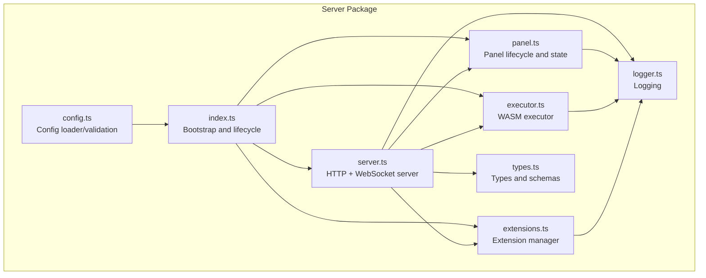
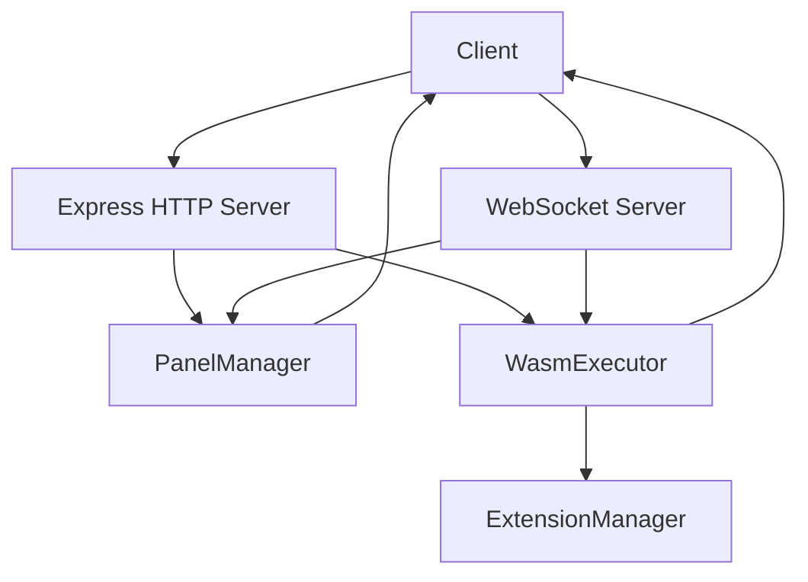
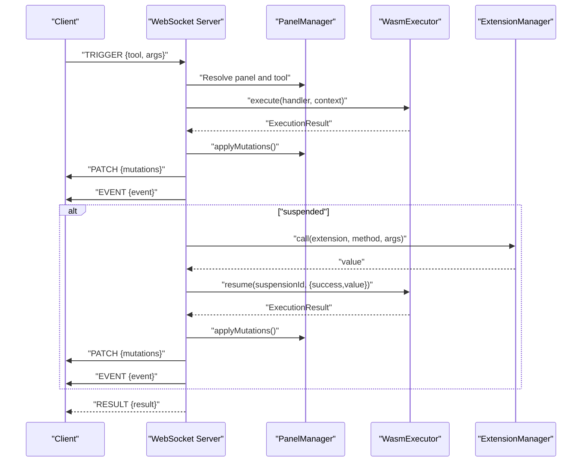
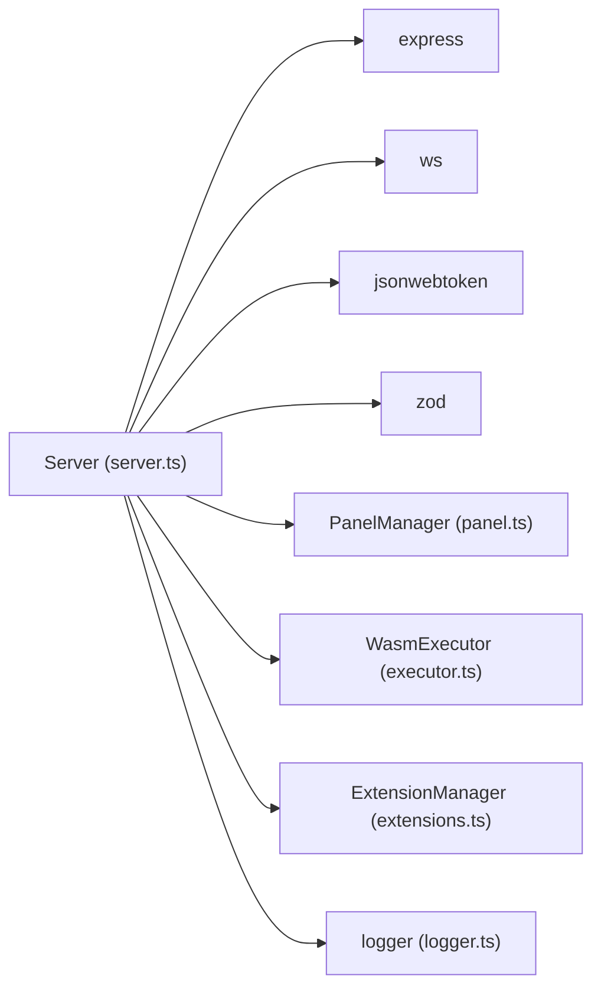

# Server

<cite>
**Referenced Files in This Document**
- [server.ts](file://runtime/workspace-kernel/src/server.ts)
- [index.ts](file://runtime/workspace-kernel/src/index.ts)
- [types.ts](file://runtime/workspace-kernel/src/types.ts)
- [panel.ts](file://runtime/workspace-kernel/src/panel.ts)
- [executor.ts](file://runtime/workspace-kernel/src/executor.ts)
- [extensions.ts](file://runtime/workspace-kernel/src/extensions.ts)
- [config.ts](file://runtime/workspace-kernel/src/config.ts)
- [logger.ts](file://runtime/workspace-kernel/src/logger.ts)
- [package.json](file://runtime/workspace-kernel/package.json)
</cite>

## Table of Contents
1. [Introduction](#introduction)
2. [Project Structure](#project-structure)
3. [Core Components](#core-components)
4. [Architecture Overview](#architecture-overview)
5. [Detailed Component Analysis](#detailed-component-analysis)
6. [Dependency Analysis](#dependency-analysis)
7. [Performance Considerations](#performance-considerations)
8. [Troubleshooting Guide](#troubleshooting-guide)
9. [Conclusion](#conclusion)
10. [Appendices](#appendices)

## Introduction
This document describes the Server component of the Workspace Kernel. It explains how the server handles HTTP and WebSocket connections for panel lifecycle management and real-time client interaction. It documents the REST API endpoints for panel creation, retrieval, and deletion, including request/response schemas and error handling. It also details the WebSocket message protocol for state updates, event broadcasting, and client-server synchronization, along with connection management, authentication considerations, and message routing logic. Finally, it provides examples of client integration, connection handling, error recovery, and performance considerations for high-concurrency scenarios.

## Project Structure
The Server component is implemented in the runtime/workspace-kernel package. Key files include:
- Server entrypoint and HTTP/WebSocket server logic
- Application bootstrap and lifecycle management
- Type definitions for HTTP/WebSocket messages and API schemas
- Panel lifecycle management and state/event broadcasting
- WASM executor integration and extension system
- Configuration loading and validation
- Logging infrastructure

**Diagram sources**
- [index.ts](file://runtime/workspace-kernel/src/index.ts#L1-L149)
- [server.ts](file://runtime/workspace-kernel/src/server.ts#L1-L703)
- [types.ts](file://runtime/workspace-kernel/src/types.ts#L1-L368)
- [panel.ts](file://runtime/workspace-kernel/src/panel.ts#L1-L437)
- [executor.ts](file://runtime/workspace-kernel/src/executor.ts#L1-L541)
- [extensions.ts](file://runtime/workspace-kernel/src/extensions.ts#L1-L397)
- [config.ts](file://runtime/workspace-kernel/src/config.ts#L1-L233)
- [logger.ts](file://runtime/workspace-kernel/src/logger.ts#L1-L90)

**Section sources**
- [index.ts](file://runtime/workspace-kernel/src/index.ts#L1-L149)
- [server.ts](file://runtime/workspace-kernel/src/server.ts#L1-L703)
- [types.ts](file://runtime/workspace-kernel/src/types.ts#L1-L368)
- [panel.ts](file://runtime/workspace-kernel/src/panel.ts#L1-L437)
- [executor.ts](file://runtime/workspace-kernel/src/executor.ts#L1-L541)
- [extensions.ts](file://runtime/workspace-kernel/src/extensions.ts#L1-L397)
- [config.ts](file://runtime/workspace-kernel/src/config.ts#L1-L233)
- [logger.ts](file://runtime/workspace-kernel/src/logger.ts#L1-L90)

## Core Components
- Server: Express-based HTTP server plus WebSocket server for panel lifecycle and real-time messaging.
- PanelManager: Manages panel instances, state, clients, and event emission.
- WasmExecutor: Bridges to the Rust WASM runtime via N-API, executes handlers, and resumes suspended executions.
- ExtensionManager: Registers and dispatches extension methods (e.g., HTTP) invoked by handlers.
- Config: Loads and validates configuration from defaults, environment variables, and overrides.
- Logger: Centralized logging with configurable levels and pretty printing.

Key responsibilities:
- HTTP endpoints for panel CRUD and triggers
- WebSocket upgrade and per-panel subscription routing
- Execution orchestration and state mutation propagation
- Suspension/resumption for asynchronous operations
- Graceful startup/shutdown and signal handling

**Section sources**
- [server.ts](file://runtime/workspace-kernel/src/server.ts#L1-L703)
- [panel.ts](file://runtime/workspace-kernel/src/panel.ts#L1-L437)
- [executor.ts](file://runtime/workspace-kernel/src/executor.ts#L1-L541)
- [extensions.ts](file://runtime/workspace-kernel/src/extensions.ts#L1-L397)
- [config.ts](file://runtime/workspace-kernel/src/config.ts#L1-L233)
- [logger.ts](file://runtime/workspace-kernel/src/logger.ts#L1-L90)

## Architecture Overview
The Server composes several subsystems:
- HTTP layer: Express app with CORS, body parsing, request logging, authentication, and routes.
- WebSocket layer: Upgrade handler validates tokens and panel existence, then upgrades to ws.
- Panel lifecycle: PanelManager tracks panels, clients, and emits state-change and event events.
- Execution: WasmExecutor executes handlers and returns results with state mutations and events.
- Extensions: ExtensionManager exposes methods callable from handlers (e.g., HTTP).
- Config and logging: Centralized configuration and structured logging.

**Diagram sources**
- [server.ts](file://runtime/workspace-kernel/src/server.ts#L1-L703)
- [panel.ts](file://runtime/workspace-kernel/src/panel.ts#L1-L437)
- [executor.ts](file://runtime/workspace-kernel/src/executor.ts#L1-L541)
- [extensions.ts](file://runtime/workspace-kernel/src/extensions.ts#L1-L397)

## Detailed Component Analysis

### HTTP API Endpoints
The server exposes the following REST endpoints for panel management and runtime metrics:

- GET /health
  - Purpose: Health and runtime statistics.
  - Response: HealthResponse with status, version, uptime, panel counts, and runtime metrics.
  - Notes: Uses executor stats and panel manager counts.

- GET /metrics
  - Purpose: Prometheus-compatible metrics.
  - Response: Plain text metrics from the executor.

- POST /panels
  - Purpose: Create a new panel.
  - Request body: CreatePanelRequest (validated by Zod schema).
  - Response: CreatePanelResponse with id, status, and wsUrl.
  - Errors: 400 for invalid request body; otherwise thrown.

- GET /panels
  - Purpose: List all panels.
  - Response: ListPanelsResponse with panels and total count.

- GET /panels/:id
  - Purpose: Retrieve panel info.
  - Path param: id.
  - Response: PanelInfoResponse.
  - Errors: 404 if not found.

- GET /panels/:id/state
  - Purpose: Retrieve current panel state.
  - Path param: id.
  - Response: Panel state object.
  - Errors: 404 if not found.

- DELETE /panels/:id
  - Purpose: Destroy a panel.
  - Path param: id.
  - Response: 204 No Content on success; 404 if not found.

- POST /panels/:id/trigger/:tool
  - Purpose: Execute a tool handler synchronously.
  - Path params: id (panel), tool (handler name).
  - Request body: Arbitrary JSON args passed to handler.
  - Response: ExecutionResult (with stateMutations, events, suspension, metrics).
  - Errors: 404 if panel or tool not found; 500 on execution failure.

Error handling:
- Validation errors return 400 with error details.
- Not found returns 404.
- Execution failures return 500 with error message.
- Unhandled errors route to a centralized error handler returning 500.

**Section sources**
- [server.ts](file://runtime/workspace-kernel/src/server.ts#L478-L648)
- [types.ts](file://runtime/workspace-kernel/src/types.ts#L206-L274)

### WebSocket Message Protocol
The server supports a simple JSON-based protocol over WebSocket for each panel.

Client-to-server messages:
- TRIGGER: { type: "TRIGGER"; tool: string; args?: unknown; requestId?: string }
  - Executes a tool handler and returns RESULT to the triggering client.
- SUBSCRIBE: { type: "SUBSCRIBE"; topics: string[] }
  - Adds topics to the client’s subscriptions (e.g., "state", "events").
- UNSUBSCRIBE: { type: "UNSUBSCRIBE"; topics: string[] }
  - Removes topics from subscriptions.
- PING: { type: "PING" }
  - Responds with PONG.

Server-to-client messages:
- CONNECTED: { type: "CONNECTED"; panelId: string; state: PanelState }
  - Sent upon successful connection with current panel state.
- RESULT: { type: "RESULT"; requestId?: string; result: ExecutionResult }
  - Sent after TRIGGER completion.
- PATCH: { type: "PATCH"; mutations: StateMutation[] }
  - Broadcast to all subscribed clients when stateMutations occur.
- EVENT: { type: "EVENT"; event: EmittedEvent }
  - Broadcast to all subscribed clients when events are emitted.
- PROGRESS: { type: "PROGRESS"; suspensionId: string; status: string; data?: unknown }
  - Used by extension calls to report progress (sent by extension manager).
- ERROR: { type: "ERROR"; code: string; message: string }
  - Sent for parse errors, unknown message types, or execution errors.
- PONG: { type: "PONG" }
  - Response to PING.

Message routing logic:
- On upgrade, the server validates the panel exists and optionally verifies a Bearer token from query parameters.
- Each WebSocket connection is associated with a panel and tracked in PanelManager.
- Clients receive CONNECTED with initial state, then PATCH and EVENT broadcasts for subsequent mutations and events.
- TRIGGER messages are executed via WasmExecutor; results are sent back to the requesting client and broadcasts are propagated to all subscribers.

**Section sources**
- [server.ts](file://runtime/workspace-kernel/src/server.ts#L154-L247)
- [server.ts](file://runtime/workspace-kernel/src/server.ts#L249-L382)
- [server.ts](file://runtime/workspace-kernel/src/server.ts#L384-L450)
- [types.ts](file://runtime/workspace-kernel/src/types.ts#L176-L204)

### Connection Management and Authentication
- HTTP authentication:
  - When enabled, requests must include Authorization: Bearer <token>.
  - Token is validated against the configured JWT secret.
  - Health endpoint bypasses auth.

- WebSocket authentication:
  - Upgrade URL must match /panels/:id/ws.
  - If auth is enabled, a token must be provided as query parameter token.
  - Token is verified against the configured JWT secret.
  - Only existing panels can accept WebSocket connections.

- Client lifecycle:
  - On connect, a client record is created with default subscriptions ("state", "events").
  - On disconnect, the client is removed from PanelManager and the panel’s client set.
  - On error, the server logs and continues.

- Graceful shutdown:
  - On stop, the server closes all WebSocket connections, stops the WebSocket server, and closes the HTTP server.

**Section sources**
- [server.ts](file://runtime/workspace-kernel/src/server.ts#L99-L128)
- [server.ts](file://runtime/workspace-kernel/src/server.ts#L154-L201)
- [server.ts](file://runtime/workspace-kernel/src/server.ts#L203-L247)
- [server.ts](file://runtime/workspace-kernel/src/server.ts#L649-L694)

### Execution Flow and State Synchronization
When a client sends TRIGGER:
1. Resolve panel and tool definition.
2. Build ExecutionContext with state, args, scope, and capabilities.
3. Execute via WasmExecutor:
   - Apply stateMutations immediately to the panel state.
   - Broadcast PATCH to all panel clients.
   - Emit events and broadcast EVENT to all panel clients.
   - If suspension is present, register suspension and execute extension call.
4. Send RESULT to the triggering client.

On extension call completion:
1. Resume the suspended handler with the extension result.
2. Apply new stateMutations and broadcast updates.
3. Broadcast RESULT to all panel clients.

**Diagram sources**
- [server.ts](file://runtime/workspace-kernel/src/server.ts#L297-L450)
- [executor.ts](file://runtime/workspace-kernel/src/executor.ts#L214-L303)
- [extensions.ts](file://runtime/workspace-kernel/src/extensions.ts#L114-L170)
- [panel.ts](file://runtime/workspace-kernel/src/panel.ts#L143-L180)

### Configuration and Environment
Default configuration includes:
- Server: httpPort, wsPort, host, authEnabled, jwtSecret, corsOrigins, bodyLimit
- Runtime: maxInstances, memoryLimitBytes, timeoutMs, maxHostCalls, cacheDir, maxCacheSizeBytes
- Extensions: HTTP extension defaults (maxConcurrent, defaultTimeout, allowedDomains, userAgent)
- Logging: level, pretty

Environment variables override defaults. Validation ensures ports, auth, runtime limits, and log level are valid.

**Section sources**
- [config.ts](file://runtime/workspace-kernel/src/config.ts#L1-L233)
- [package.json](file://runtime/workspace-kernel/package.json#L1-L50)

## Dependency Analysis
The Server depends on:
- Express for HTTP routing and middleware
- ws for WebSocket upgrade and messaging
- jsonwebtoken for JWT verification
- zod for request schema validation
- PanelManager for panel lifecycle and state
- WasmExecutor for handler execution and resumption
- ExtensionManager for extension method invocation
- Logger for structured logging

**Diagram sources**
- [server.ts](file://runtime/workspace-kernel/src/server.ts#L1-L703)
- [panel.ts](file://runtime/workspace-kernel/src/panel.ts#L1-L437)
- [executor.ts](file://runtime/workspace-kernel/src/executor.ts#L1-L541)
- [extensions.ts](file://runtime/workspace-kernel/src/extensions.ts#L1-L397)
- [logger.ts](file://runtime/workspace-kernel/src/logger.ts#L1-L90)

**Section sources**
- [server.ts](file://runtime/workspace-kernel/src/server.ts#L1-L703)
- [panel.ts](file://runtime/workspace-kernel/src/panel.ts#L1-L437)
- [executor.ts](file://runtime/workspace-kernel/src/executor.ts#L1-L541)
- [extensions.ts](file://runtime/workspace-kernel/src/extensions.ts#L1-L397)
- [logger.ts](file://runtime/workspace-kernel/src/logger.ts#L1-L90)

## Performance Considerations
- Concurrency limits:
  - HTTP body size is bounded by bodyLimit.
  - WebSocket connections are per-panel; ensure panel counts align with resource budgets.
  - Extension HTTP client enforces maxConcurrent requests to prevent overload.
- Execution timeouts:
  - WasmExecutor uses timeoutMs to bound handler execution.
  - Suspension timeout is derived from runtime timeout and used to cancel long-pending suspensions.
- Resource pooling:
  - WasmExecutor maintains a pool of instances with memory limits and caching to reduce cold-start overhead.
- Broadcasting:
  - PATCH and EVENT are broadcast to all panel clients; keep subscriptions minimal to reduce fan-out.
- Logging:
  - Structured logging avoids expensive string interpolation in hot paths.
- Scaling strategies:
  - Horizontal scale by running multiple server instances behind a load balancer.
  - Use sticky sessions if maintaining persistent WebSocket connections per instance is required.
  - Offload heavy tasks to extensions and rely on suspension/resume to keep UI responsive.
  - Monitor /metrics for CPU, memory, and cache hit rate.

[No sources needed since this section provides general guidance]

## Troubleshooting Guide
Common issues and resolutions:
- 401 Unauthorized on HTTP or WebSocket:
  - Ensure Authorization header is present and valid when authEnabled is true.
  - Verify JWT secret is configured and tokens are issued by a trusted issuer.
- 404 Not Found:
  - Panel does not exist or path is incorrect (/panels/:id or /panels/:id/ws).
- 400 Bad Request:
  - Request body fails Zod validation for panel creation.
- 500 Internal Server Error:
  - Handler execution failed; inspect logs for error details.
- WebSocket parse errors:
  - Client sent malformed JSON; server responds with ERROR and logs the issue.
- Suspension timeout:
  - If a suspended handler does not resume within the configured timeout, it is canceled and logged.

Operational tips:
- Use /health to verify server status and runtime stats.
- Use /metrics to monitor performance and resource usage.
- Enable debug logging for detailed traces during development.

**Section sources**
- [server.ts](file://runtime/workspace-kernel/src/server.ts#L99-L128)
- [server.ts](file://runtime/workspace-kernel/src/server.ts#L154-L201)
- [server.ts](file://runtime/workspace-kernel/src/server.ts#L249-L295)
- [server.ts](file://runtime/workspace-kernel/src/server.ts#L478-L648)
- [panel.ts](file://runtime/workspace-kernel/src/panel.ts#L212-L247)
- [config.ts](file://runtime/workspace-kernel/src/config.ts#L170-L201)

## Conclusion
The Server component provides a robust foundation for panel lifecycle management and real-time interaction. It integrates HTTP and WebSocket protocols, validates requests, authenticates clients, executes handlers via a WASM runtime, and coordinates state updates and events across clients. With built-in configuration, logging, and graceful shutdown, it is suitable for production environments. For high-concurrency scenarios, tune runtime limits, extension concurrency, and consider horizontal scaling.

[No sources needed since this section summarizes without analyzing specific files]

## Appendices

### API Definitions and Schemas
- CreatePanelRequest (POST /panels):
  - Fields: id (optional), kind, title (optional), tools (array), initialState (optional), capabilities (optional), metadata (optional).
  - Validation: Zod schema enforces tool trigger types and field constraints.

- CreatePanelResponse:
  - Fields: id, status, wsUrl.

- PanelInfoResponse:
  - Fields: id, kind, title (optional), status, state, tools, createdAt, lastActivity, clientCount.

- ListPanelsResponse:
  - Fields: panels (array of PanelInfoResponse), total.

- HealthResponse:
  - Fields: status, version, uptime, panels (active, suspended), runtime (activeInstances, availableInstances, cacheHitRate, memoryBytes).

- ExecutionResult (from handler execution):
  - Fields: status, returnValue (optional), stateMutations (array), events (array), viewCommands (array), suspension (optional), error (optional), metrics.

**Section sources**
- [types.ts](file://runtime/workspace-kernel/src/types.ts#L206-L368)

### Client Integration Examples
- Creating a panel:
  - Send POST /panels with a valid CreatePanelRequest.
  - Use the returned wsUrl to establish a WebSocket connection.

- Subscribing to updates:
  - On connect, send SUBSCRIBE with topics ["state","events"] to receive PATCH and EVENT messages.

- Triggering a handler:
  - Send TRIGGER with tool name and args; expect RESULT with execution outcome.

- Handling suspension:
  - If suspension appears, the extension call will resume automatically; watch for PROGRESS and RESULT messages.

- Error handling:
  - Listen for ERROR messages and surface actionable feedback to users.

**Section sources**
- [server.ts](file://runtime/workspace-kernel/src/server.ts#L154-L247)
- [server.ts](file://runtime/workspace-kernel/src/server.ts#L249-L382)
- [types.ts](file://runtime/workspace-kernel/src/types.ts#L176-L204)