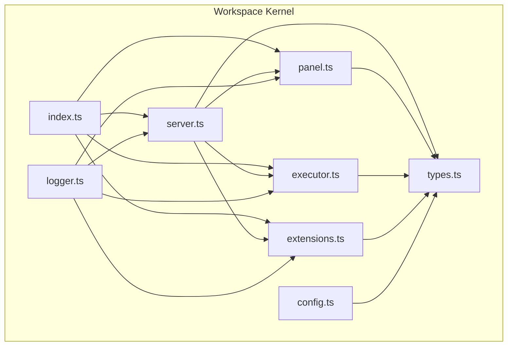
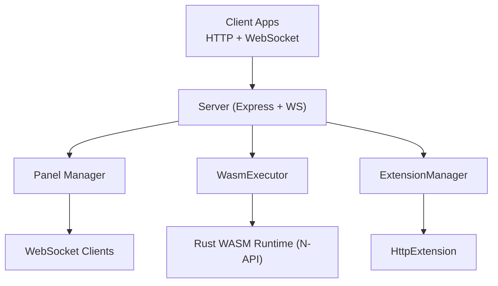
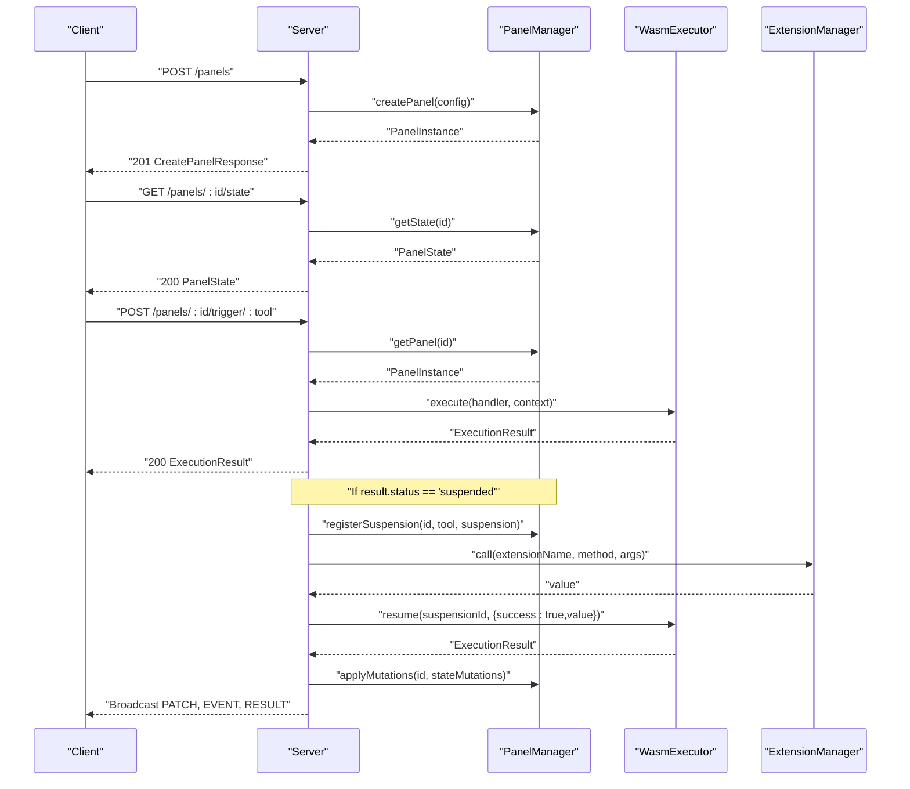
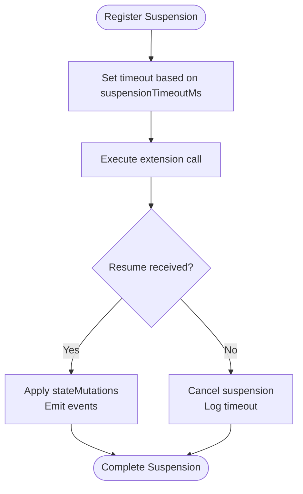
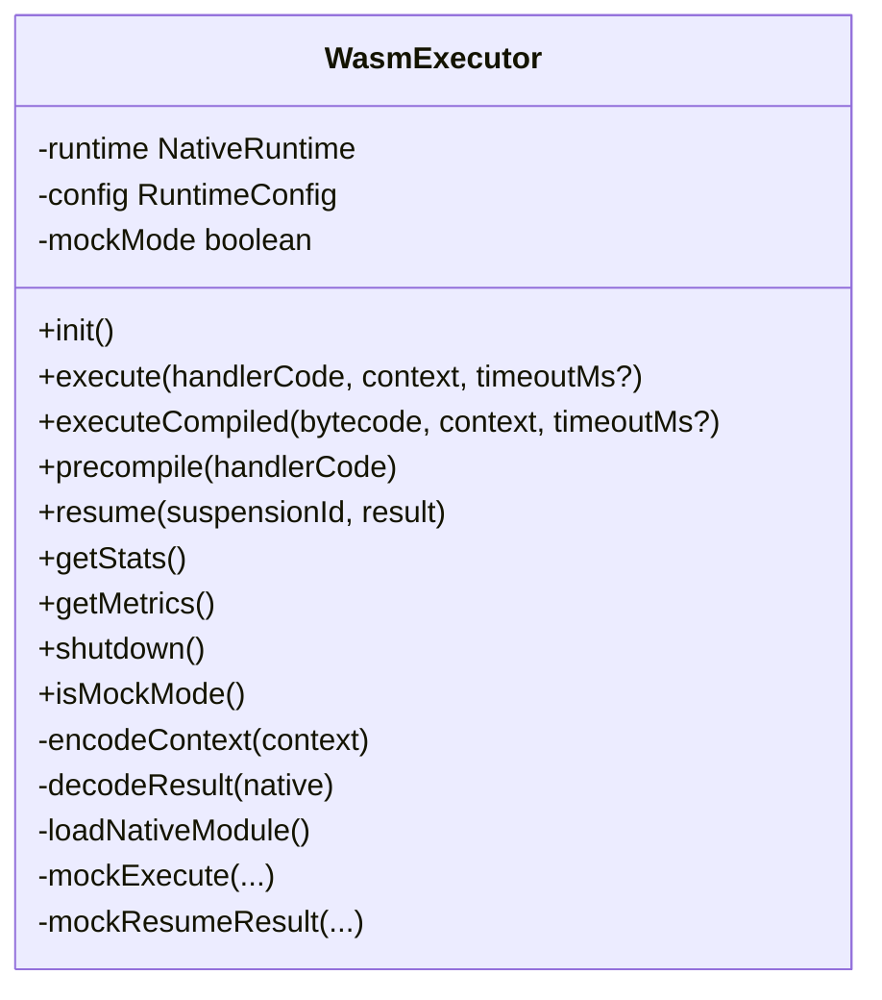
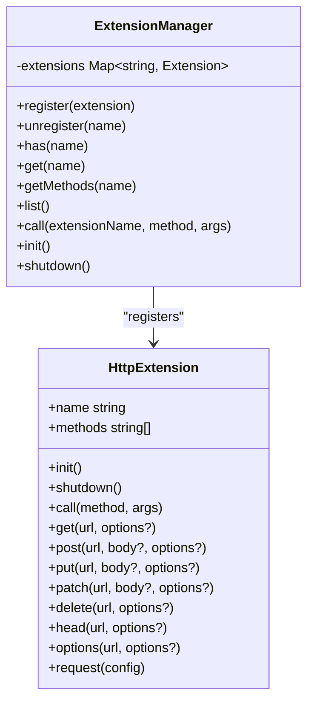
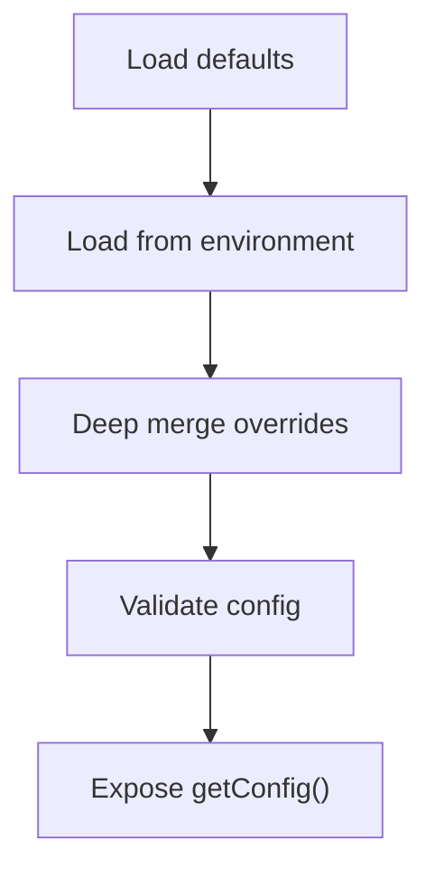
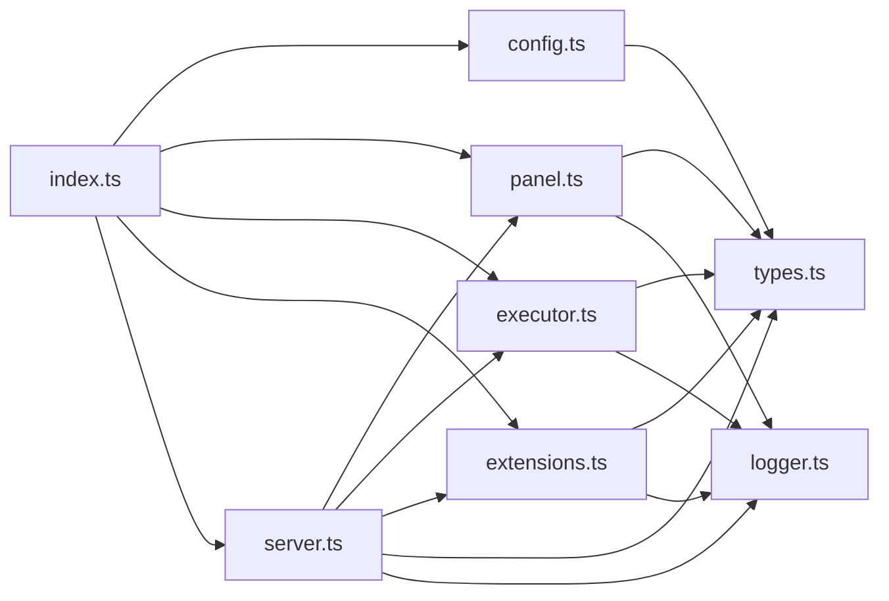

# Workspace Kernel

<cite>
**Referenced Files in This Document**
- [index.ts](file://runtime/workspace-kernel/src/index.ts)
- [server.ts](file://runtime/workspace-kernel/src/server.ts)
- [panel.ts](file://runtime/workspace-kernel/src/panel.ts)
- [executor.ts](file://runtime/workspace-kernel/src/executor.ts)
- [extensions.ts](file://runtime/workspace-kernel/src/extensions.ts)
- [config.ts](file://runtime/workspace-kernel/src/config.ts)
- [types.ts](file://runtime/workspace-kernel/src/types.ts)
- [logger.ts](file://runtime/workspace-kernel/src/logger.ts)
- [package.json](file://runtime/workspace-kernel/package.json)
</cite>

## Table of Contents
1. [Introduction](#introduction)
2. [Project Structure](#project-structure)
3. [Core Components](#core-components)
4. [Architecture Overview](#architecture-overview)
5. [Detailed Component Analysis](#detailed-component-analysis)
6. [Dependency Analysis](#dependency-analysis)
7. [Performance Considerations](#performance-considerations)
8. [Troubleshooting Guide](#troubleshooting-guide)
9. [Conclusion](#conclusion)
10. [Appendices](#appendices)

## Introduction
The Workspace Kernel is the Node.js server that orchestrates panel lifecycle, client communication, and execution coordination for the Nexus runtime. It exposes HTTP and WebSocket APIs for panel management, real-time state synchronization, and handler execution. It integrates with a WASM-based executor for secure handler execution and provides an extension system for adding external services. The kernel also manages configuration, logging, and graceful shutdown.

## Project Structure
The Workspace Kernel resides under runtime/workspace-kernel and is organized into cohesive modules:
- Entry point and lifecycle: index.ts
- HTTP/WebSocket server: server.ts
- Panel lifecycle and state: panel.ts
- WASM executor integration: executor.ts
- Extension system: extensions.ts
- Configuration management: config.ts
- Shared types: types.ts
- Logging: logger.ts
- Package metadata: package.json

**Diagram sources**
- [index.ts](file://runtime/workspace-kernel/src/index.ts#L1-L149)
- [server.ts](file://runtime/workspace-kernel/src/server.ts#L1-L703)
- [panel.ts](file://runtime/workspace-kernel/src/panel.ts#L1-L437)
- [executor.ts](file://runtime/workspace-kernel/src/executor.ts#L1-L541)
- [extensions.ts](file://runtime/workspace-kernel/src/extensions.ts#L1-L397)
- [config.ts](file://runtime/workspace-kernel/src/config.ts#L1-L233)
- [types.ts](file://runtime/workspace-kernel/src/types.ts#L1-L368)
- [logger.ts](file://runtime/workspace-kernel/src/logger.ts#L1-L90)

**Section sources**
- [index.ts](file://runtime/workspace-kernel/src/index.ts#L1-L149)
- [package.json](file://runtime/workspace-kernel/package.json#L1-L50)

## Core Components
- Entry point and lifecycle control: Initializes configuration, subsystems, starts the server, and sets up graceful shutdown.
- HTTP/WebSocket server: Exposes REST endpoints for panel CRUD and state retrieval, and a WebSocket endpoint for real-time interaction.
- Panel manager: Manages panel lifecycle, state mutations, client subscriptions, and suspension timeouts.
- WASM executor: Bridges to the Rust WASM runtime via N-API, executes handlers, resumes suspended handlers, and reports metrics.
- Extension system: Registers and dispatches built-in and custom extensions (e.g., HTTP client).
- Configuration: Loads defaults, merges environment variables, validates, and exposes typed configuration.
- Logging: Centralized logger with configurable level and pretty printing.

**Section sources**
- [index.ts](file://runtime/workspace-kernel/src/index.ts#L1-L149)
- [server.ts](file://runtime/workspace-kernel/src/server.ts#L1-L703)
- [panel.ts](file://runtime/workspace-kernel/src/panel.ts#L1-L437)
- [executor.ts](file://runtime/workspace-kernel/src/executor.ts#L1-L541)
- [extensions.ts](file://runtime/workspace-kernel/src/extensions.ts#L1-L397)
- [config.ts](file://runtime/workspace-kernel/src/config.ts#L1-L233)
- [logger.ts](file://runtime/workspace-kernel/src/logger.ts#L1-L90)

## Architecture Overview
The Workspace Kernel composes several subsystems:
- Server: Express app with CORS, body parsing, JWT auth, and route registration.
- WebSocket: Upgrade handler validates tokens, authenticates, and attaches clients to panels.
- Panel Manager: Tracks panels, state, clients, and suspension contexts with timeouts.
- Executor: Encodes contexts, calls native WASM runtime, decodes results, and resumes suspended handlers.
- Extension Manager: Dispatches extension calls for suspension resolution.

**Diagram sources**
- [server.ts](file://runtime/workspace-kernel/src/server.ts#L1-L703)
- [panel.ts](file://runtime/workspace-kernel/src/panel.ts#L1-L437)
- [executor.ts](file://runtime/workspace-kernel/src/executor.ts#L1-L541)
- [extensions.ts](file://runtime/workspace-kernel/src/extensions.ts#L1-L397)

## Detailed Component Analysis

### HTTP and WebSocket APIs
The server exposes:
- Health and metrics endpoints
- Panel CRUD and state retrieval
- Trigger handler execution via HTTP and WebSocket
- WebSocket upgrade with authentication and subscription support

Key behaviors:
- Authentication middleware enforces JWT when enabled.
- WebSocket upgrade validates panel existence and token; attaches client to panel.
- Real-time messaging supports TRIGGER, SUBSCRIBE, UNSUBSCRIBE, PING, and emits CONNECTED, RESULT, PATCH, EVENT, PROGRESS, ERROR.

**Diagram sources**
- [server.ts](file://runtime/workspace-kernel/src/server.ts#L134-L200)
- [server.ts](file://runtime/workspace-kernel/src/server.ts#L479-L641)
- [server.ts](file://runtime/workspace-kernel/src/server.ts#L296-L449)
- [panel.ts](file://runtime/workspace-kernel/src/panel.ts#L212-L293)
- [executor.ts](file://runtime/workspace-kernel/src/executor.ts#L214-L303)
- [extensions.ts](file://runtime/workspace-kernel/src/extensions.ts#L69-L86)

**Section sources**
- [server.ts](file://runtime/workspace-kernel/src/server.ts#L134-L200)
- [server.ts](file://runtime/workspace-kernel/src/server.ts#L479-L641)
- [server.ts](file://runtime/workspace-kernel/src/server.ts#L296-L449)
- [types.ts](file://runtime/workspace-kernel/src/types.ts#L195-L204)

### Panel Manager: Lifecycle and Suspension Timeout
Responsibilities:
- Create/destroy panels, track state, clients, and scope.
- Apply state mutations and emit events.
- Manage suspension lifecycles with a configurable timeout.
- Track panel counts and status transitions.

Suspension timeout mechanism:
- On registration, a timer is set based on configured suspensionTimeoutMs.
- If the suspension is not completed within the timeout, it is canceled and logged.
- When all suspensions are completed, the panel status returns to running.

**Diagram sources**
- [panel.ts](file://runtime/workspace-kernel/src/panel.ts#L212-L293)

**Section sources**
- [panel.ts](file://runtime/workspace-kernel/src/panel.ts#L1-L437)

### WASM Executor Integration
Integration details:
- Encodes execution context (state, args, scope) using MessagePack.
- Attempts to load a native N-API module; falls back to mock mode if unavailable.
- Executes handlers and pre-compiled bytecode, returning structured results.
- Resumes suspended handlers with either success or error payloads.
- Exposes runtime statistics and Prometheus metrics.

**Diagram sources**
- [executor.ts](file://runtime/workspace-kernel/src/executor.ts#L152-L507)

**Section sources**
- [executor.ts](file://runtime/workspace-kernel/src/executor.ts#L1-L541)

### Extension System
Capabilities:
- Registers and dispatches extensions by name and method.
- Built-in HTTP extension supports GET, POST, PUT, PATCH, DELETE, HEAD, OPTIONS, and a generic request method.
- Enforces allowed domains when configured and manages concurrency with a slot acquisition mechanism.

**Diagram sources**
- [extensions.ts](file://runtime/workspace-kernel/src/extensions.ts#L13-L110)
- [extensions.ts](file://runtime/workspace-kernel/src/extensions.ts#L113-L334)

**Section sources**
- [extensions.ts](file://runtime/workspace-kernel/src/extensions.ts#L1-L397)

### Configuration Management
Features:
- Defaults for server, runtime, extensions, and logging.
- Environment variable overrides with deep merge and validation.
- Validation ensures ports, auth, memory limits, and timeouts are sane.

**Diagram sources**
- [config.ts](file://runtime/workspace-kernel/src/config.ts#L1-L233)

**Section sources**
- [config.ts](file://runtime/workspace-kernel/src/config.ts#L1-L233)
- [types.ts](file://runtime/workspace-kernel/src/types.ts#L303-L352)

### Logging
- Uses pino with configurable level and pretty printing in non-production environments.
- Lazy initialization and child loggers for contextual logs.

**Section sources**
- [logger.ts](file://runtime/workspace-kernel/src/logger.ts#L1-L90)

## Dependency Analysis
High-level dependencies:
- index.ts depends on config, panel, executor, extensions, server, and logger.
- server.ts depends on panel, executor, extensions, types, and logger.
- panel.ts depends on types and logger.
- executor.ts depends on types, logger, and @msgpack/msgpack.
- extensions.ts depends on types and logger.
- config.ts depends on types.
- logger.ts depends on pino.

**Diagram sources**
- [index.ts](file://runtime/workspace-kernel/src/index.ts#L1-L149)
- [server.ts](file://runtime/workspace-kernel/src/server.ts#L1-L703)
- [panel.ts](file://runtime/workspace-kernel/src/panel.ts#L1-L437)
- [executor.ts](file://runtime/workspace-kernel/src/executor.ts#L1-L541)
- [extensions.ts](file://runtime/workspace-kernel/src/extensions.ts#L1-L397)
- [config.ts](file://runtime/workspace-kernel/src/config.ts#L1-L233)
- [types.ts](file://runtime/workspace-kernel/src/types.ts#L1-L368)
- [logger.ts](file://runtime/workspace-kernel/src/logger.ts#L1-L90)

**Section sources**
- [index.ts](file://runtime/workspace-kernel/src/index.ts#L1-L149)
- [server.ts](file://runtime/workspace-kernel/src/server.ts#L1-L703)
- [panel.ts](file://runtime/workspace-kernel/src/panel.ts#L1-L437)
- [executor.ts](file://runtime/workspace-kernel/src/executor.ts#L1-L541)
- [extensions.ts](file://runtime/workspace-kernel/src/extensions.ts#L1-L397)
- [config.ts](file://runtime/workspace-kernel/src/config.ts#L1-L233)
- [types.ts](file://runtime/workspace-kernel/src/types.ts#L1-L368)
- [logger.ts](file://runtime/workspace-kernel/src/logger.ts#L1-L90)

## Performance Considerations
- Concurrency and resource limits:
  - Runtime configuration controls maxInstances, memoryLimitBytes, timeoutMs, and maxHostCalls.
  - HTTP extension enforces maxConcurrent requests and default timeout.
- Efficient serialization:
  - MessagePack encoding reduces overhead for context and result payloads.
- Suspension-driven UI responsiveness:
  - Immediate state mutation flushing during suspend/resume prevents “blind intervals.”
- Scalability:
  - Horizontal scaling across nodes is supported by separating state and persistence concerns.
  - Consider sharding panels by tenant or workspace and using external state stores for shared state.
- Observability:
  - Health and metrics endpoints expose runtime statistics and Prometheus metrics.

[No sources needed since this section provides general guidance]

## Troubleshooting Guide
Common scenarios and remedies:
- Authentication failures:
  - Ensure authEnabled is configured and JWT secret is present when required.
  - Verify Authorization header format and token validity.
- WebSocket upgrade failures:
  - Confirm panel exists and token is present/valid when auth is enabled.
- Handler execution errors:
  - Inspect ExecutionResult.error and logs for details.
  - Validate handler code and tool definitions.
- Suspension timeouts:
  - Increase suspensionTimeoutMs or ensure extension calls complete promptly.
- Graceful shutdown:
  - Verify SIGTERM/SIGINT/SIGUSR2 handlers and that all subsystems are shut down in order.

**Section sources**
- [server.ts](file://runtime/workspace-kernel/src/server.ts#L104-L128)
- [server.ts](file://runtime/workspace-kernel/src/server.ts#L157-L200)
- [server.ts](file://runtime/workspace-kernel/src/server.ts#L296-L449)
- [panel.ts](file://runtime/workspace-kernel/src/panel.ts#L212-L293)
- [executor.ts](file://runtime/workspace-kernel/src/executor.ts#L214-L303)
- [extensions.ts](file://runtime/workspace-kernel/src/extensions.ts#L148-L302)
- [index.ts](file://runtime/workspace-kernel/src/index.ts#L59-L94)

## Conclusion
The Workspace Kernel provides a robust foundation for panel lifecycle management, real-time client interaction, and secure handler execution via a WASM bridge. Its modular design enables extensibility through the extension system, predictable configuration, and resilient operation with graceful shutdown. By tuning runtime and HTTP extension settings, teams can scale to manage numerous panel instances while maintaining responsive UIs and strong observability.

[No sources needed since this section summarizes without analyzing specific files]

## Appendices

### Starting the Kernel
- Use the main entrypoint to initialize configuration, subsystems, and start the server.
- The entrypoint sets up graceful shutdown hooks and exposes helpers to retrieve the server, panel manager, executor, and extension manager.

**Section sources**
- [index.ts](file://runtime/workspace-kernel/src/index.ts#L22-L58)

### Handling Client Connections
- WebSocket upgrade validates panel existence and token (when enabled).
- Clients receive CONNECTED with initial state and can subscribe/unsubscribe to topics.
- Real-time messages include RESULT, PATCH, EVENT, PROGRESS, and ERROR.

**Section sources**
- [server.ts](file://runtime/workspace-kernel/src/server.ts#L157-L200)
- [server.ts](file://runtime/workspace-kernel/src/server.ts#L203-L247)
- [types.ts](file://runtime/workspace-kernel/src/types.ts#L195-L204)

### Implementing Graceful Shutdown
- The kernel listens for SIGTERM, SIGINT, SIGUSR2 and initiates orderly shutdown.
- Shutdown sequence: stop server, shutdown extensions, shutdown executor, and shutdown panel manager.

**Section sources**
- [index.ts](file://runtime/workspace-kernel/src/index.ts#L59-L94)
- [server.ts](file://runtime/workspace-kernel/src/server.ts#L663-L693)
- [executor.ts](file://runtime/workspace-kernel/src/executor.ts#L340-L350)
- [panel.ts](file://runtime/workspace-kernel/src/panel.ts#L394-L404)
- [extensions.ts](file://runtime/workspace-kernel/src/extensions.ts#L388-L396)

### HTTP API Reference
- Health: GET /health
- Metrics: GET /metrics
- Create panel: POST /panels
- List panels: GET /panels
- Get panel: GET /panels/:id
- Get panel state: GET /panels/:id/state
- Delete panel: DELETE /panels/:id
- Trigger handler: POST /panels/:id/trigger/:tool

**Section sources**
- [server.ts](file://runtime/workspace-kernel/src/server.ts#L134-L151)
- [server.ts](file://runtime/workspace-kernel/src/server.ts#L479-L641)
- [types.ts](file://runtime/workspace-kernel/src/types.ts#L205-L256)

### WebSocket Protocol Reference
- Client messages: TRIGGER, SUBSCRIBE, UNSUBSCRIBE, PING
- Server messages: CONNECTED, RESULT, PATCH, EVENT, PROGRESS, ERROR, PONG

**Section sources**
- [types.ts](file://runtime/workspace-kernel/src/types.ts#L195-L204)

### Configuration Options
- Server: httpPort, wsPort, host, authEnabled, jwtSecret, corsOrigins, bodyLimit
- Runtime: maxInstances, minInstances, memoryLimitBytes, timeoutMs, maxHostCalls, cacheDir, maxCacheSizeBytes
- Extensions: http.maxConcurrent, http.defaultTimeout, http.allowedDomains, http.userAgent
- Logging: level, pretty

**Section sources**
- [config.ts](file://runtime/workspace-kernel/src/config.ts#L1-L233)
- [types.ts](file://runtime/workspace-kernel/src/types.ts#L303-L352)