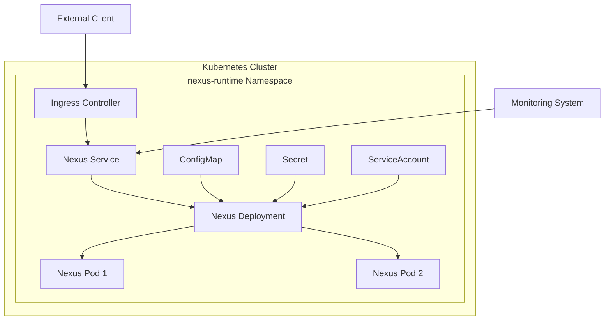

# Deployment

<cite>
**Referenced Files in This Document**   
- [Dockerfile](file://runtime/images/Dockerfile)
- [deployment.yaml](file://runtime/k8s/deployment.yaml)
- [config.ts](file://runtime/workspace-kernel/src/config.ts)
- [logger.ts](file://runtime/workspace-kernel/src/logger.ts)
- [server.ts](file://runtime/workspace-kernel/src/server.ts)
- [types.ts](file://runtime/workspace-kernel/src/types.ts)
- [metrics.rs](file://runtime/nexus-wasm-bridge/src/metrics.rs)
- [02_runtime_spec.md](file://docs/02_runtime_spec.md)
</cite>

## Table of Contents
1. [Containerization](#containerization)
2. [Kubernetes Deployment](#kubernetes-deployment)
3. [Configuration Management](#configuration-management)
4. [Scaling and Load Balancing](#scaling-and-load-balancing)
5. [Monitoring and Logging](#monitoring-and-logging)
6. [Zero-Downtime Deployment and Rollback](#zero-downtime-deployment-and-rollback)
7. [Cloud Provider Considerations](#cloud-provider-considerations)

## Containerization

The Nexus runtime is containerized using a multi-stage Docker build process defined in the Dockerfile. This approach ensures a minimal production image size while maintaining build efficiency.

The Dockerfile consists of four stages:
1. **Rust Builder**: Builds the native WASM bridge component using Rust
2. **Node.js Builder**: Compiles the TypeScript source code for the workspace kernel
3. **Production Runtime**: Creates the final production image with only necessary runtime dependencies
4. **Development**: Provides a full development environment with all build tools

The production image is based on `node:20-bookworm-slim` and includes the WasmEdge runtime for executing WASM modules. Key environment variables are defined with default values, including `HTTP_PORT=3000`, `WS_PORT=3001`, and `LOG_LEVEL=info`. The image exposes both HTTP and WebSocket ports and includes a health check that verifies the `/health` endpoint.

Volume mounting is configured for the cache directory at `/tmp/nexus-cache`, which is mounted as a memory-based emptyDir volume in the Kubernetes deployment to ensure high-performance caching. The container runs as a non-root user for security, with appropriate file permissions set during the build process.

**Section sources**
- [Dockerfile](file://runtime/images/Dockerfile#L54-L102)

## Kubernetes Deployment

The Nexus runtime is deployed to Kubernetes using a comprehensive set of manifests that define the complete deployment architecture. The deployment.yaml file contains all necessary Kubernetes resources for a production-ready deployment.

The core component is a Deployment resource that manages the Nexus runtime pods with an initial replica count of 2. The pod specification includes strict security context settings, running as a non-root user with dropped privileges and a read-only root filesystem. Resource requests and limits are defined to ensure stable performance, with CPU and memory constraints preventing resource exhaustion.

The deployment includes several critical Kubernetes resources:
- **ConfigMap**: Stores configuration values such as log levels, instance limits, and timeout settings
- **Secret**: Manages sensitive data like the JWT secret for authentication
- **Service**: Exposes the application internally within the cluster
- **Ingress**: Configures external access with WebSocket support and appropriate timeouts
- **HorizontalPodAutoscaler**: Enables automatic scaling based on CPU and memory utilization
- **PodDisruptionBudget**: Ensures minimum availability during maintenance operations
- **NetworkPolicy**: Controls network traffic to and from the pods

The Ingress configuration includes extended timeouts (3600 seconds) to accommodate long-running WebSocket connections and explicitly enables WebSocket services. The NetworkPolicy restricts ingress traffic to only the ingress controller and monitoring namespace, while allowing egress to DNS services and external HTTP/HTTPS endpoints for extension calls.



**Diagram sources **
- [deployment.yaml](file://runtime/k8s/deployment.yaml#L39-L299)

**Section sources**
- [deployment.yaml](file://runtime/k8s/deployment.yaml#L39-L299)

## Configuration Management

Nexus employs a hierarchical configuration management system that combines environment variables, ConfigMaps, and default values to provide flexible configuration across different environments.

The configuration is structured around the `AppConfig` interface defined in config.ts, which organizes settings into logical groups:
- **Server**: HTTP/HTTPS and WebSocket settings, authentication, and CORS
- **Runtime**: WASM execution limits, memory constraints, and caching
- **Extensions**: Configuration for external service integrations
- **Logging**: Log level and formatting options

Configuration values are loaded in the following priority order:
1. Environment variables (highest priority)
2. ConfigMap values
3. Default values (lowest priority)

This allows environment-specific overrides while maintaining consistent defaults. For example, the `LOG_LEVEL` can be set to "debug" in development environments through environment variables while maintaining "info" as the default for production.

Key configuration parameters include:
- `MAX_INSTANCES`: Maximum number of concurrent WASM instances
- `MEMORY_LIMIT_MB`: Memory limit per WASM instance in megabytes
- `TIMEOUT_MS`: Execution timeout in milliseconds
- `HTTP_MAX_CONCURRENT`: Maximum concurrent HTTP requests from extensions
- `HTTP_TIMEOUT`: Default timeout for HTTP extension calls

Authentication is configured through the `AUTH_ENABLED` flag and `JWT_SECRET` environment variable, with the secret stored in a Kubernetes Secret for security. The configuration system includes validation to ensure settings are within acceptable ranges, such as verifying port numbers and minimum memory limits.

**Section sources**
- [config.ts](file://runtime/workspace-kernel/src/config.ts#L8-L233)
- [deployment.yaml](file://runtime/k8s/deployment.yaml#L18-L26)

## Scaling and Load Balancing

The Nexus deployment is designed to scale efficiently to handle increased load through multiple mechanisms.

The HorizontalPodAutoscaler (HPA) automatically adjusts the number of pod replicas based on CPU and memory utilization metrics. The HPA is configured with a minimum of 2 replicas and a maximum of 10, scaling when CPU utilization exceeds 70% or memory utilization exceeds 80%. This ensures high availability while optimizing resource usage.

Within each pod, the application manages its own internal scaling through a pool of pre-warmed WASM instances. The `maxInstances` and `minInstances` configuration parameters control the size of this pool, allowing the runtime to handle multiple concurrent requests without the overhead of initializing WASM instances for each request.

The pod anti-affinity rule in the deployment specification ensures that pods are distributed across different nodes when possible, improving availability and resilience. This prevents all instances from being scheduled on the same node, which could create a single point of failure.

Load balancing is handled by the Kubernetes Service and Ingress controller, which distribute traffic across all available pods. The Service uses a ClusterIP type for internal communication, while the Ingress provides external access with round-robin load balancing. The WebSocket support in the Ingress configuration ensures that long-lived connections are properly handled and distributed.

For environments with predictable traffic patterns, vertical scaling can be achieved by adjusting the resource limits in the deployment specification. The current configuration requests 256Mi of memory and 100m CPU per pod, with limits set at 1Gi memory and 1000m CPU.


**Diagram sources **
- [deployment.yaml](file://runtime/k8s/deployment.yaml#L208-L233)
- [config.ts](file://runtime/workspace-kernel/src/config.ts#L18-L25)

**Section sources**
- [deployment.yaml](file://runtime/k8s/deployment.yaml#L208-L233)
- [config.ts](file://runtime/workspace-kernel/src/config.ts#L18-L25)

## Monitoring and Logging

Nexus provides comprehensive monitoring and logging capabilities through integration with Prometheus and pino.

The application exposes a `/metrics` endpoint that returns Prometheus-formatted metrics, automatically scraped by monitoring systems due to the `prometheus.io/scrape: "true"` annotation in the pod specification. The metrics collector in the Rust WASM bridge component tracks key performance indicators including:
- Handler execution counts (success and error)
- Average execution time
- Cache hit rate
- Peak memory usage
- Host function call counts
- Error counts by code

These metrics are collected at both the WASM execution level and the application level, providing detailed insights into performance and resource utilization. The health endpoint (`/health`) provides a comprehensive system status including uptime, active panels, and runtime statistics.

For logging, Nexus uses the pino logger with different configurations based on the environment. In production, logs are output in a compact JSON format suitable for log aggregation systems. In development, the `LOG_PRETTY=true` environment variable enables formatted, human-readable output using pino-pretty.

The logging system is configurable through environment variables:
- `LOG_LEVEL`: Controls the verbosity (debug, info, warn, error)
- `LOG_PRETTY`: Enables formatted output for development

Log entries include structured data such as request methods, URLs, response status codes, and duration, enabling detailed analysis and troubleshooting. The server middleware automatically logs all HTTP requests with timing information.


**Diagram sources **
- [logger.ts](file://runtime/workspace-kernel/src/logger.ts#L5-L90)
- [metrics.rs](file://runtime/nexus-wasm-bridge/src/metrics.rs#L285-L338)
- [server.ts](file://runtime/workspace-kernel/src/server.ts#L137-L138)

**Section sources**
- [logger.ts](file://runtime/workspace-kernel/src/logger.ts#L5-L90)
- [metrics.rs](file://runtime/nexus-wasm-bridge/src/metrics.rs#L285-L338)
- [server.ts](file://runtime/workspace-kernel/src/server.ts#L137-L138)

## Zero-Downtime Deployment and Rollback

The Nexus deployment supports zero-downtime deployments and rollback procedures through Kubernetes deployment strategies and health checks.

The deployment uses the default RollingUpdate strategy, which gradually replaces old pods with new ones while ensuring the specified minimum availability. The readiness and liveness probes ensure that only healthy pods receive traffic and that unhealthy pods are restarted.

The readiness probe checks the `/health` endpoint every 10 seconds, with a 5-second timeout and 3 failure threshold. This ensures that pods are only added to the service endpoints when they are fully ready to handle requests. The liveness probe checks the same endpoint every 30 seconds, allowing for restart if the application becomes unresponsive.

For zero-downtime deployments, the sequence is:
1. New pods are created and initialized
2. Readiness probe verifies the new pods are healthy
3. New pods are added to the service endpoints
4. Old pods are terminated gracefully
5. The `stop()` method in the Server class ensures clean shutdown by closing WebSocket connections and the HTTP server

Rollback can be performed using standard Kubernetes commands:
```bash
kubectl rollout undo deployment/nexus-runtime -n nexus-runtime
```

The deployment history is maintained by Kubernetes, allowing rollback to any previous revision. The PodDisruptionBudget ensures that at least one pod remains available during the rollback process.

Blue-green deployments can be implemented by maintaining two separate deployments and switching the service selector, though this requires additional configuration outside the provided manifests.

**Section sources**
- [deployment.yaml](file://runtime/k8s/deployment.yaml#L104-L119)
- [server.ts](file://runtime/workspace-kernel/src/server.ts#L664-L694)

## Cloud Provider Considerations

The Nexus deployment can be adapted for major cloud providers with specific considerations for each platform.

For **AWS**, the deployment should be integrated with Amazon EKS for managed Kubernetes. The Ingress can be configured to use the AWS Load Balancer Controller, creating an Application Load Balancer with WebSocket support. For storage, Amazon EBS volumes can be used for the workspace data, with appropriate IOPS settings for performance. AWS CloudWatch can be used for log aggregation, and Amazon CloudWatch Metrics for monitoring, though the existing Prometheus integration may require additional setup with Amazon Managed Service for Prometheus.

For **GCP**, the deployment works with Google Kubernetes Engine (GKE). The Ingress can leverage Google Cloud Load Balancing with WebSocket support. For monitoring, the Prometheus metrics can be exported to Google Cloud Operations (formerly Stackdriver) using the Prometheus collector. Google Cloud Storage can be used for persistent data, with appropriate bucket policies and lifecycle management. The deployment should consider using preemptible VMs for cost optimization, though this requires careful configuration of pod disruption budgets.

For **Azure**, the deployment integrates with Azure Kubernetes Service (AKS). The Ingress can use Azure Application Gateway or Azure Load Balancer with WebSocket support. For monitoring, the metrics can be exported to Azure Monitor using the Prometheus integration. Azure Blob Storage or Azure Files can be used for persistent storage, with appropriate access controls. Azure Managed Identities can be used for secure access to other Azure services.

In all cloud environments, network security groups or firewall rules must be configured to allow traffic on ports 3000 (HTTP) and 3001 (WebSocket) from the ingress controller and monitoring systems. Additionally, the egress rules must allow outbound HTTPS traffic for extension calls to external services.

**Section sources**
- [deployment.yaml](file://runtime/k8s/deployment.yaml#L247-L299)
- [02_runtime_spec.md](file://docs/02_runtime_spec.md#L1666-L1726)