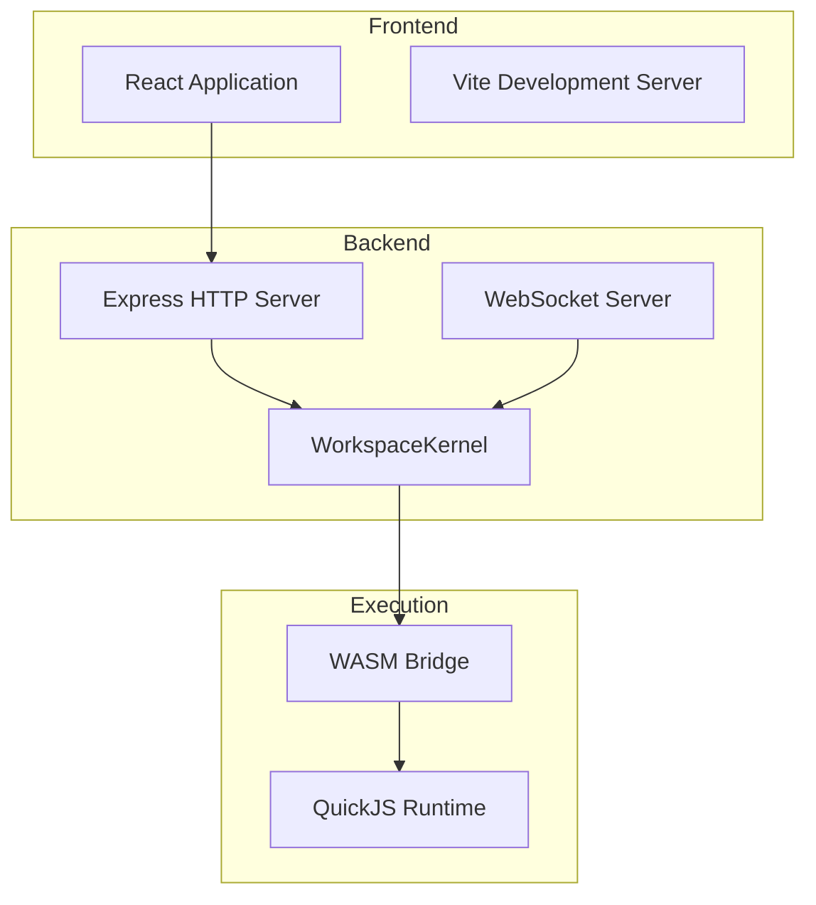

# Getting Started

<cite>
**Referenced Files in This Document**   
- [nexus-reactor/README.md](file://packages/nexus-reactor/README.md)
- [nexus-protocol/README.md](file://packages/nexus-protocol/README.md)
- [runtime/README.md](file://runtime/README.md)
- [nexus-reactor/package.json](file://packages/nexus-reactor/package.json)
- [nexus-reactor/vite.config.ts](file://packages/nexus-reactor/vite.config.ts)
- [workspace-kernel/package.json](file://runtime/workspace-kernel/package.json)
- [workspace-kernel/src/server.ts](file://runtime/workspace-kernel/src/server.ts)
- [workspace-kernel/src/config.ts](file://runtime/workspace-kernel/src/config.ts)
- [nexus-reactor/src/reactor.ts](file://packages/nexus-reactor/src/reactor.ts)
- [nexus-wasm-bridge/Cargo.toml](file://runtime/nexus-wasm-bridge/Cargo.toml)
- [nexus-wasm-bridge/src/lib.rs](file://runtime/nexus-wasm-bridge/src/lib.rs)
- [workspace-kernel/src/executor.ts](file://runtime/workspace-kernel/src/executor.ts)
</cite>

## Table of Contents
1. [Introduction](#introduction)
2. [Environment Setup](#environment-setup)
3. [Frontend Configuration](#frontend-configuration)
4. [Backend Configuration](#backend-configuration)
5. [Creating Your First Panel](#creating-your-first-panel)
6. [Deploying Panels with Reactor Engine](#deploying-panels-with-reactor-engine)
7. [Initializing WorkspaceKernel Server](#initializing-workspacekernel-server)
8. [Connecting to WebSocket API](#connecting-to-websocket-api)
9. [Troubleshooting Common Issues](#troubleshooting-common-issues)
10. [Prerequisite Knowledge](#prerequisite-knowledge)

## Introduction

Welcome to the Nexus platform onboarding guide. This document provides a comprehensive walkthrough for setting up a local development environment for the Nexus platform, which combines Node.js, Rust, and WasmEdge technologies to create interactive panels using NXML syntax. The platform consists of three main components:

- **Frontend**: Built with React and Vite, responsible for rendering panels
- **Backend**: Node.js server (WorkspaceKernel) managing panel lifecycle
- **Execution Engine**: Rust-based WASM bridge providing secure handler execution

This guide will walk you through the complete setup process, from installing dependencies to creating and deploying your first panel, and connecting to the WebSocket API for real-time interaction.

**Section sources**
- [nexus-reactor/README.md](file://packages/nexus-reactor/README.md#L1-L80)
- [runtime/README.md](file://runtime/README.md#L1-L10)

## Environment Setup

### System Requirements
Before beginning installation, ensure your system meets these requirements:
- Node.js 20+ 
- Rust 1.70+
- WasmEdge 0.13+ (optional for native execution)
- npm or pnpm package manager

### Installing Node.js Dependencies
The Nexus platform uses a monorepo structure with multiple packages. Install the core dependencies:

```bash
# Navigate to the Nexus repository root
cd 

# Install dependencies for the reactor (frontend engine)
cd packages/nexus-reactor
npm install

# Install dependencies for the workspace kernel (backend server)
cd ../../runtime/workspace-kernel
npm install
```

The `nexus-reactor` package provides the frontend execution engine, while `workspace-kernel` contains the Node.js server components.

### Installing Rust and WasmEdge
The runtime component requires Rust for the WASM bridge:

```bash
# Install Rust if not already installed
curl --proto '=https' --tlsv1.2 -sSf https://sh.rustup.rs | sh

# Build the WASM bridge
cd runtime/nexus-wasm-bridge
cargo build --release
```

The `nexus-wasm-bridge` is a Rust library that enables secure JavaScript execution in WasmEdge containers, providing true isolation for handler code.

**Section sources**
- [runtime/README.md](file://runtime/README.md#L145-L155)
- [nexus-reactor/package.json](file://packages/nexus-reactor/package.json#L1-L44)
- [workspace-kernel/package.json](file://runtime/workspace-kernel/package.json#L1-L50)
- [nexus-wasm-bridge/Cargo.toml](file://runtime/nexus-wasm-bridge/Cargo.toml#L1-L63)

## Frontend Configuration

### Setting up Vite and React
The frontend development environment uses Vite as the build tool with React for rendering components. The configuration is defined in `vite.config.ts`:

```typescript
import { defineConfig } from 'vite';
import react from '@vitejs/plugin-react';
import { resolve } from 'path';

export default defineConfig({
  plugins: [react()],
  root: 'test',
  resolve: {
    alias: {
      '@': resolve(__dirname, 'src'),
    },
  },
  build: {
    lib: {
      entry: resolve(__dirname, 'src/index.ts'),
      name: 'NexusReactor',
      fileName: 'index',
      formats: ['es'],
    },
    rollupOptions: {
      external: ['react', 'react-dom'],
      output: {
        globals: {
          react: 'React',
          'react-dom': 'ReactDOM',
        },
      },
    },
  },
  server: {
    port: 3000,
  },
});
```

Key configuration points:
- **Port**: Development server runs on port 3000
- **Aliases**: `@` alias points to the `src` directory
- **Library Build**: Configured to build as an ES module library
- **Externals**: React and ReactDOM are excluded from the bundle

### Running the Development Server
Start the frontend development server:

```bash
# From the nexus-reactor directory
npm run dev
```

This command launches Vite's development server, which provides:
- Hot module replacement (HMR)
- Fast refresh for React components
- Built-in development server on port 3000
- Test harness for panel development

The test harness includes example panels like Server Monitor and Todo List for development and testing purposes.

**Section sources**
- [nexus-reactor/vite.config.ts](file://packages/nexus-reactor/vite.config.ts#L1-L33)
- [nexus-reactor/package.json](file://packages/nexus-reactor/package.json#L15-L19)
- [nexus-reactor/README.md](file://packages/nexus-reactor/README.md#L697-L712)

## Backend Configuration

### Setting up Express Server
The backend uses Express.js for HTTP API endpoints and WebSocket communication. The server configuration is managed in the `workspace-kernel` package:

```typescript
// Server configuration (from config.ts)
const defaultConfig: AppConfig = {
  server: {
    httpPort: 3000,
    wsPort: 3001,
    host: '0.0.0.0',
    authEnabled: false,
    corsOrigins: ['*'],
    bodyLimit: '1mb',
  },
  // ... other configurations
};
```

The server provides two main interfaces:
- **HTTP API** on port 3000 for panel management
- **WebSocket API** on port 3001 for real-time communication

### Starting the Workspace Kernel
Initialize the backend server:

```bash
# Navigate to workspace-kernel directory
cd runtime/workspace-kernel

# Build and start the server
npm run build
npm start
```

Alternatively, use the development mode with automatic reloading:

```bash
npm run dev
```

The server will start and listen for connections on the configured ports.

### Configuration Options
The server supports configuration through environment variables:

| Environment Variable | Default | Description |
|----------------------|---------|-------------|
| `PORT` | `3000` | HTTP server port |
| `WS_PORT` | `3001` | WebSocket server port |
| `NODE_ENV` | `development` | Environment mode |
| `JWT_SECRET` | - | Secret for JWT authentication |
| `AUTH_ENABLED` | `false` | Enable authentication |
| `MAX_PANELS` | `10` | Maximum concurrent panels |

These can be set in a `.env` file or directly in the terminal.

**Section sources**
- [workspace-kernel/src/config.ts](file://runtime/workspace-kernel/src/config.ts#L8-L37)
- [workspace-kernel/src/server.ts](file://runtime/workspace-kernel/src/server.ts#L35-L70)
- [runtime/README.md](file://runtime/README.md#L117-L143)
- [workspace-kernel/package.json](file://runtime/workspace-kernel/package.json#L7-L14)

## Creating Your First Panel

### Understanding NXML Syntax
NXML (Nexus Extensible Markup Language) is a semantic markup language that separates concerns into three isolated namespaces:

- **Data**: Reactive state and computed values
- **Logic**: Sandboxed tools, handlers, and lifecycle hooks  
- **View**: Semantic UI component tree

Here's a basic counter panel example:

```xml
<NexusPanel title="Counter">
  <Data>
    <State name="count" type="number" default="0" />
  </Data>

  <Logic>
    <Tool name="increment">
      <Handler>$state.count++</Handler>
    </Tool>
    <Tool name="decrement">
      <Handler>$state.count--</Handler>
    </Tool>
  </Logic>

  <View>
    <Layout strategy="stack" gap="md">
      <Text content="Count: {$state.count}" variant="h2" />
      <Layout strategy="row" gap="sm">
        <Button label="-" trigger="decrement" variant="secondary" />
        <Button label="+" trigger="increment" variant="primary" />
      </Layout>
    </Layout>
  </View>
</NexusPanel>
```

### Key NXML Components
The Nexus platform provides a standard component library:

**Layout Components:**
- `Layout`: Arranges children in grid or stack
- `Container`: Groups content with optional title

**Display Components:**
- `Text`: Displays text with various styles
- `Metric`: Shows metrics with units
- `StatusBadge`: Displays status with color coding
- `Chart`: Renders data visualizations
- `LogStream`: Scrollable log viewer

**Input Components:**
- `Input`: Text input with two-way binding
- `Button`: Clickable button that triggers tools
- `Switch`: Toggle switch with two-way binding

**Control Flow Components:**
- `If`: Conditional rendering
- `Iterate`: Loop over arrays

### Data Binding and Expressions
NXML supports reactive data binding using the `$state` prefix:

```xml
<Text content="Hello {$state.username}" />
<Input bind="$state.username" placeholder="Enter name" />
```

Computed values can be defined to derive data from state:

```xml
<Computed name="doubleCount" value="$state.count * 2" />
<Computed name="itemCount" value="$state.items.length" />
```

**Section sources**
- [nexus-reactor/README.md](file://packages/nexus-reactor/README.md#L36-L63)
- [nexus-reactor/README.md](file://packages/nexus-reactor/README.md#L409-L539)
- [nexus-protocol/README.md](file://packages/nexus-protocol/README.md#L63-L127)

## Deploying Panels with Reactor Engine

### Initializing the Reactor
The NexusReactor is the execution engine that transforms NXML definitions into interactive React applications:

```typescript
import { NexusReactor } from '@nexus/reactor';

const nxmlSource = `
<NexusPanel title="Hello World">
  <Data>
    <State name="message" type="string" default="Hello, Nexus!" />
  </Data>
  <View>
    <Text content="{$state.message}" variant="h1" />
  </View>
</NexusPanel>
`;

// Create reactor instance
const reactor = new NexusReactor({
  source: nxmlSource,
  debug: true,
});
```

### Mounting and Rendering Panels
After creating a reactor instance, mount it and retrieve the React component:

```typescript
// Mount the reactor (runs lifecycle hooks)
await reactor.mount();

// Get the React component
const PanelComponent = reactor.getComponent();

// Render in your React app
function App() {
  return <PanelComponent />;
}
```

### Advanced Reactor Configuration
The reactor supports additional configuration options:

```typescript
const reactor = new NexusReactor({
  source: nxmlSource,
  
  // Provide external capabilities
  extensions: {
    http: {
      get: async (url: string) => {
        const response = await fetch(url);
        return { json: await response.json(), status: response.status };
      },
    },
  },
  
  // Restore previous state
  initialState: {
    count: 42,
    username: 'Alice',
  },
  
  // Enable debug logging
  debug: true,
});
```

The `extensions` property allows you to provide external capabilities to the sandboxed environment, while `initialState` enables state restoration.

**Section sources**
- [nexus-reactor/README.md](file://packages/nexus-reactor/README.md#L100-L165)
- [nexus-reactor/src/reactor.ts](file://packages/nexus-reactor/src/reactor.ts#L42-L96)
- [nexus-reactor/src/reactor.ts](file://packages/nexus-reactor/src/reactor.ts#L101-L119)

## Initializing WorkspaceKernel Server

### Server Architecture
The WorkspaceKernel server manages panel lifecycle and coordinates execution between the frontend and the WASM bridge:



**Diagram sources**
- [workspace-kernel/src/server.ts](file://runtime/workspace-kernel/src/server.ts#L7-L703)
- [runtime/README.md](file://runtime/README.md#L16-L47)

### Starting the Server Programmatically
You can initialize the server programmatically:

```typescript
import { Server } from '@nexus/workspace-kernel';

// Create server instance
const server = new Server(config);

// Start the server
await server.start();

// Stop the server
await server.stop();
```

### Server Lifecycle Management
The server provides methods for managing its lifecycle:

```typescript
// Start the server
await server.start();

// Gracefully shutdown
await server.stop();

// Get Express app (for testing)
const app = server.getApp();
```

The server handles HTTP and WebSocket connections, panel management, and coordinates with the WASM executor for handler execution.

**Section sources**
- [workspace-kernel/src/server.ts](file://runtime/workspace-kernel/src/server.ts#L35-L703)
- [workspace-kernel/src/config.ts](file://runtime/workspace-kernel/src/config.ts#L8-L37)

## Connecting to WebSocket API

### WebSocket Connection Setup
The WebSocket API enables real-time communication between clients and panels:

```javascript
// Connect to WebSocket API
const panelId = 'your-panel-id';
const socket = new WebSocket(`ws://localhost:3001/panels/${panelId}/ws`);

socket.onopen = () => {
  console.log('Connected to panel');
};

socket.onmessage = (event) => {
  const message = JSON.parse(event.data);
  console.log('Received message:', message);
};
```

### WebSocket Message Types
The WebSocket API supports several message types for bidirectional communication:

**Client → Server Messages:**
- `TRIGGER`: Execute a tool
- `SUBSCRIBE`: Subscribe to state changes
- `UNSUBSCRIBE`: Unsubscribe from topics
- `PING`: Check connection health

**Server → Client Messages:**
- `CONNECTED`: Connection established with current state
- `RESULT`: Tool execution result
- `PATCH`: State update notification
- `EVENT`: Event notification (e.g., toast messages)
- `PROGRESS`: Async operation progress
- `ERROR`: Error notification

### Example WebSocket Interaction
```javascript
// Trigger a tool execution
socket.send(JSON.stringify({
  type: 'TRIGGER',
  tool: 'fetchData',
  args: { url: 'https://api.example.com/data' },
  requestId: 'req-123'
}));

// Subscribe to state changes
socket.send(JSON.stringify({
  type: 'SUBSCRIBE',
  topics: ['state', 'events']
}));
```

The server will respond with a `RESULT` message containing the execution result, or a `PATCH` message when the state changes.

**Section sources**
- [workspace-kernel/src/server.ts](file://runtime/workspace-kernel/src/server.ts#L157-L247)
- [workspace-kernel/src/types.ts](file://runtime/workspace-kernel/src/types.ts#L189-L203)
- [runtime/README.md](file://runtime/README.md#L128-L142)

## Troubleshooting Common Issues

### Dependency Conflicts
When installing dependencies, you may encounter version conflicts:

**Issue**: Peer dependency warnings for React
**Solution**: Ensure compatible versions:
```bash
npm install react@^18.0.0 react-dom@^18.0.0
```

**Issue**: TypeScript version conflicts
**Solution**: The `nexus-protocol` package requires TypeScript 5.0+ with strict mode. Update your `tsconfig.json`:
```json
{
  "compilerOptions": {
    "strict": true,
    "exactOptionalPropertyTypes": true,
    "noUncheckedIndexedAccess": true
  }
}
```

### Port Binding Errors
Common port-related issues and solutions:

**Issue**: Port 3000 already in use
**Solution**: Change the Vite development server port in `vite.config.ts`:
```typescript
server: {
  port: 3002, // Change from default 3000
}
```

**Issue**: WebSocket port 3001 unavailable
**Solution**: Modify the server configuration in `workspace-kernel/src/config.ts`:
```typescript
const defaultConfig: AppConfig = {
  server: {
    httpPort: 3000,
    wsPort: 3002, // Change from default 3001
    // ... other settings
  }
};
```

### WASM Bridge Compilation Issues
**Issue**: Rust compilation fails
**Solution**: Ensure you have the latest Rust version:
```bash
rustup update
cd runtime/nexus-wasm-bridge
cargo clean
cargo build --release
```

**Issue**: Native module not found
**Solution**: The executor will fall back to mock mode if the native module isn't found. Ensure the compiled library is in the correct path:
```bash
# Check if the compiled library exists
ls -la runtime/nexus-wasm-bridge/target/release/libnexus_wasm_bridge.node
```

### Debugging Tips
Enable debug mode to get detailed logs:
```typescript
const reactor = new NexusReactor({
  source: nxmlSource,
  debug: true, // Enable debug logging
});
```

Monitor the server logs for WebSocket connection issues:
```bash
# In workspace-kernel directory
npm run dev
```

Use the test harness to verify your setup:
```bash
# In nexus-reactor directory
npm run dev
# Open http://localhost:3000 to access the test harness
```

**Section sources**
- [nexus-reactor/README.md](file://packages/nexus-reactor/README.md#L750-L784)
- [workspace-kernel/src/server.ts](file://runtime/workspace-kernel/src/server.ts#L108-L127)
- [workspace-kernel/src/executor.ts](file://runtime/workspace-kernel/src/executor.ts#L170-L212)

## Prerequisite Knowledge

To effectively work with the Nexus platform, familiarity with the following technologies is recommended:

### JavaScript/TypeScript
Understanding of modern JavaScript features including:
- ES6+ syntax (classes, modules, destructuring)
- Asynchronous programming (Promises, async/await)
- TypeScript type system
- Module bundlers and build tools

### React Fundamentals
Key React concepts you should understand:
- Component lifecycle
- State management
- JSX syntax
- Hooks (useState, useEffect, etc.)
- Context API
- Component composition

### Containerization Basics
Understanding of containerization concepts:
- Isolated execution environments
- Resource limits and constraints
- Container networking
- Image building and deployment
- Orchestration basics (Docker, Kubernetes)

These foundational skills will help you understand the Nexus platform's architecture, particularly how the Reactor engine transforms NXML into React components, how the WorkspaceKernel manages panel lifecycles, and how the WASM bridge provides secure, isolated execution environments for handler code.

**Section sources**
- [nexus-reactor/README.md](file://packages/nexus-reactor/README.md#L29-L35)
- [runtime/README.md](file://runtime/README.md#L9-L14)
- [nexus-protocol/README.md](file://packages/nexus-protocol/README.md#L9-L12)