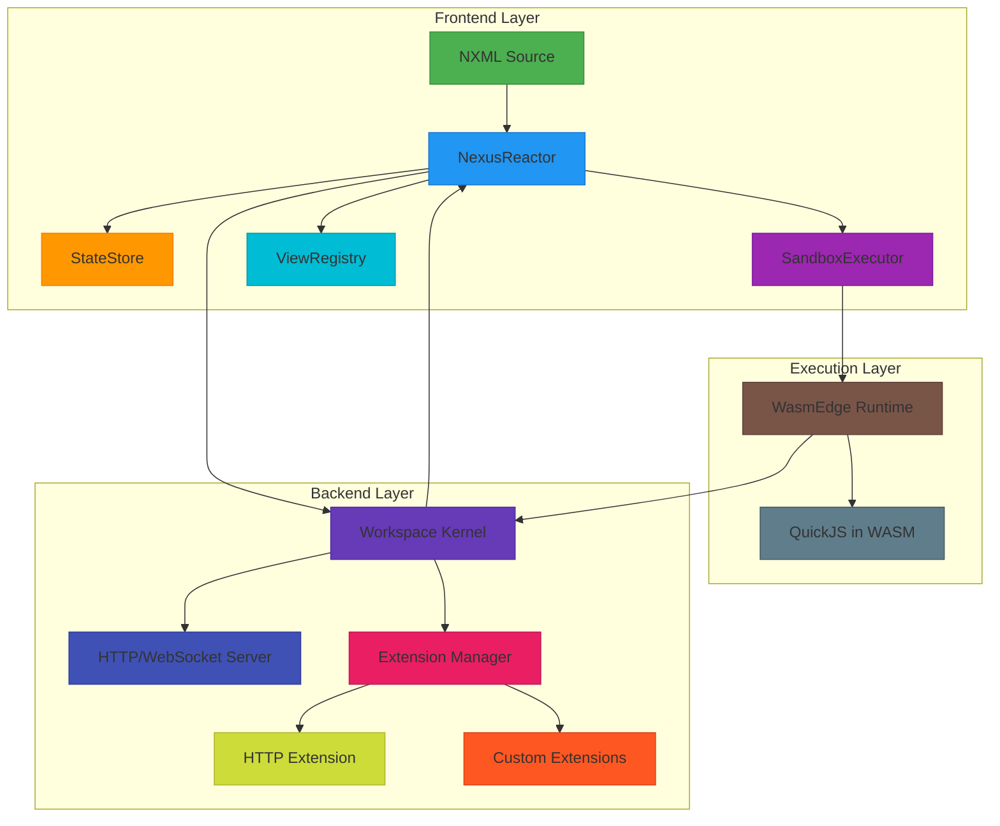
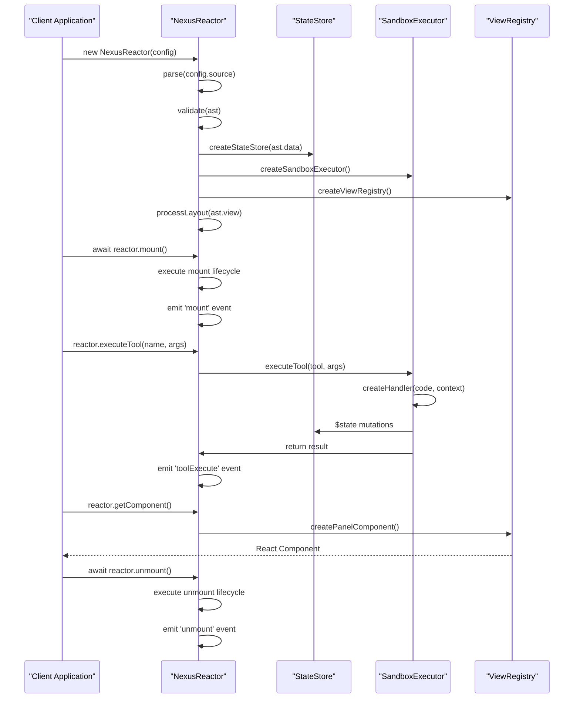
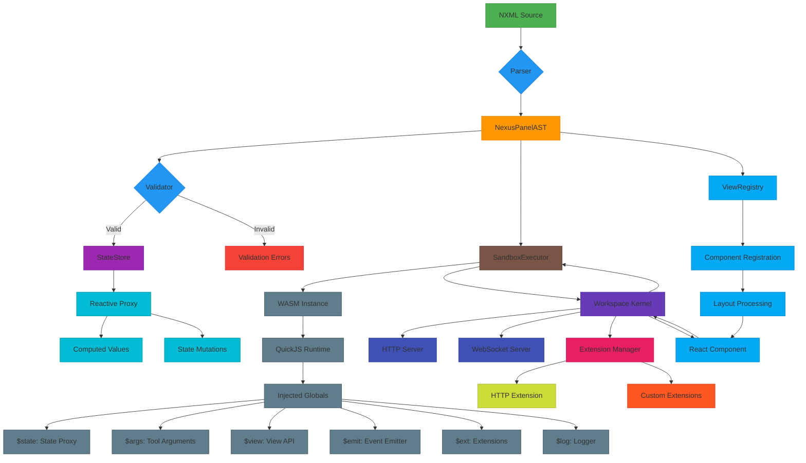
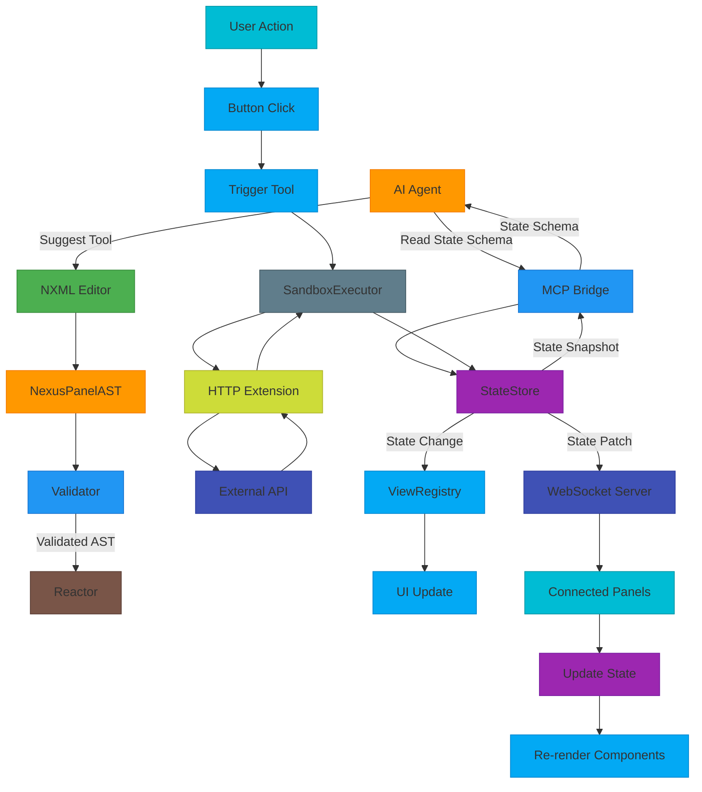

# Introduction

<cite>
**Referenced Files in This Document**   
- [nexus-reactor/src/index.ts](file://packages/nexus-reactor/src/index.ts)
- [nexus-reactor/src/reactor.ts](file://packages/nexus-reactor/src/reactor.ts)
- [nexus-reactor/src/state/store.ts](file://packages/nexus-reactor/src/state/store.ts)
- [nexus-reactor/src/sandbox/executor.ts](file://packages/nexus-reactor/src/sandbox/executor.ts)
- [nexus-reactor/src/mcp/bridge.ts](file://packages/nexus-reactor/src/mcp/bridge.ts)
- [nexus-protocol/src/index.ts](file://packages/nexus-protocol/src/index.ts)
- [nexus-protocol/src/ast/index.ts](file://packages/nexus-protocol/src/ast/index.ts)
- [runtime/workspace-kernel/src/index.ts](file://runtime/workspace-kernel/src/index.ts)
- [runtime/workspace-kernel/src/executor.ts](file://runtime/workspace-kernel/src/executor.ts)
- [runtime/workspace-kernel/src/extensions.ts](file://runtime/workspace-kernel/src/extensions.ts)
- [runtime/nexus-wasm-bridge/src/lib.rs](file://runtime/nexus-wasm-bridge/src/lib.rs)
- [runtime/README.md](file://runtime/README.md)
- [packages/nexus-reactor/README.md](file://packages/nexus-reactor/README.md)
- [packages/nexus-protocol/README.md](file://packages/nexus-protocol/README.md)
</cite>

## Table of Contents
1. [Introduction](#introduction)
2. [Architecture Overview](#architecture-overview)
3. [Core Concepts](#core-concepts)
4. [System Components and Interactions](#system-components-and-interactions)
5. [Practical Use Cases](#practical-use-cases)
6. [Architectural Trade-offs and Constraints](#architectural-trade-offs-and-constraints)
7. [Conclusion](#conclusion)

## Architecture Overview

The Nexus Platform is an AI-assisted prototyping system designed for rapid development of interactive panels with cross-panel synchronization and secure execution. The architecture follows a microkernel design with extension support, integrating frontend, backend, and WASM execution layers into a cohesive full-stack application.

The system implements a unidirectional data flow where NXML source code is parsed into an Abstract Syntax Tree (NexusPanelAST), validated, and then processed through various subsystems including state management, sandboxed execution, and view rendering. The reactive programming model is based on proxy-based fine-grained reactivity, where state changes automatically trigger updates to dependent computed values and UI components.

Security is implemented through a capability-based model where handler code runs in isolated WASM containers with no default access to external resources. Handlers must explicitly declare required capabilities (such as HTTP access) through extension declarations in the NXML specification. This approach ensures that all external interactions are visible in the source code and subject to user approval.

**Diagram sources**
- [nexus-reactor/src/reactor.ts](file://packages/nexus-reactor/src/reactor.ts)
- [runtime/workspace-kernel/src/index.ts](file://runtime/workspace-kernel/src/index.ts)
- [runtime/nexus-wasm-bridge/src/lib.rs](file://runtime/nexus-wasm-bridge/src/lib.rs)

**Section sources**
- [nexus-reactor/src/reactor.ts](file://packages/nexus-reactor/src/reactor.ts)
- [runtime/README.md](file://runtime/README.md)

## Core Concepts

### NXML (Nexus Extensible Markup Language)
NXML is a semantic markup language that separates concerns into three isolated namespaces: Data, Logic, and View. This separation ensures clear boundaries between application state, behavior, and presentation. The NexusPanelAST represents the parsed structure of an NXML document, containing all three namespaces in a type-safe format.

### Reactor
The NexusReactor is the isomorphic execution engine that transforms NXML definitions into living, interactive applications. It orchestrates the entire lifecycle from parsing and validation to state management and view rendering. The reactor maintains a StateStore for reactive state management, a SandboxExecutor for secure handler execution, and a ViewRegistry for UI component management.

### MCP (Model Context Protocol) Integration
MCP integration exposes panel tools and state to AI agents, enabling AI collaboration in the development process. The MCP bridge converts NXML tools into a format that AI systems can understand and interact with, allowing AI to suggest changes, execute tools, and inspect state.

### Panel Lifecycle
The Panel lifecycle consists of initialization, mounting, execution, and unmounting phases. During initialization, the NXML source is parsed and validated. On mounting, lifecycle hooks are executed and the React component is created. The execution phase handles tool invocations and state changes. On unmounting, cleanup operations are performed and resources are released.

**Diagram sources**
- [nexus-reactor/src/reactor.ts](file://packages/nexus-reactor/src/reactor.ts)
- [nexus-reactor/src/state/store.ts](file://packages/nexus-reactor/src/state/store.ts)
- [nexus-reactor/src/sandbox/executor.ts](file://packages/nexus-reactor/src/sandbox/executor.ts)

**Section sources**
- [nexus-reactor/src/index.ts](file://packages/nexus-reactor/src/index.ts)
- [nexus-protocol/src/ast/index.ts](file://packages/nexus-protocol/src/ast/index.ts)

## System Components and Interactions

The Nexus Platform integrates multiple execution layers into a cohesive system. The frontend layer handles NXML parsing and React component generation, the execution layer provides secure WASM-based JavaScript execution, and the backend layer manages panels and coordinates execution across multiple instances.

The Workspace Kernel serves as the central coordination point, exposing HTTP and WebSocket APIs for panel management and real-time communication. It manages a pool of WASM instances through the nexus-wasm-bridge, which provides N-API bindings between Node.js and the Rust-based WASM runtime. This architecture enables efficient resource utilization while maintaining strong isolation between handler executions.

The extension system provides capability-based access to external resources. Handlers declare required capabilities in the NXML specification, and the extension manager enforces these declarations at runtime. This approach ensures that all external interactions are explicit and auditable, supporting the platform's security model.

**Diagram sources**
- [nexus-reactor/src/reactor.ts](file://packages/nexus-reactor/src/reactor.ts)
- [runtime/workspace-kernel/src/executor.ts](file://runtime/workspace-kernel/src/executor.ts)
- [runtime/workspace-kernel/src/extensions.ts](file://runtime/workspace-kernel/src/extensions.ts)

**Section sources**
- [runtime/workspace-kernel/src/index.ts](file://runtime/workspace-kernel/src/index.ts)
- [runtime/nexus-wasm-bridge/src/lib.rs](file://runtime/nexus-wasm-bridge/src/lib.rs)

## Practical Use Cases

### AI Collaboration
The MCP integration enables seamless AI collaboration in the development process. AI agents can inspect panel state, understand available tools, and suggest modifications to the NXML source. For example, an AI assistant could analyze a panel's state schema and suggest additional validation rules or propose new tools to enhance functionality.

### Real-time Panel Interaction
The reactive programming model and WebSocket-based communication enable real-time interaction between panels. When state changes in one panel, related panels can be automatically updated through the NOG (Nexus Object Graph) system. This allows for coordinated dashboards where changes in one component immediately reflect in others, creating a cohesive user experience.

### Secure Execution of User-Provided Code
The capability-based security model allows safe execution of user-provided code. Handlers run in isolated WASM containers with no default access to external resources. Any external interaction must be explicitly declared in the NXML specification, ensuring that all potentially dangerous operations are visible and subject to user approval.

**Diagram sources**
- [nexus-reactor/src/mcp/bridge.ts](file://packages/nexus-reactor/src/mcp/bridge.ts)
- [runtime/workspace-kernel/src/executor.ts](file://runtime/workspace-kernel/src/executor.ts)
- [runtime/workspace-kernel/src/extensions.ts](file://runtime/workspace-kernel/src/extensions.ts)

**Section sources**
- [packages/nexus-reactor/README.md](file://packages/nexus-reactor/README.md)
- [packages/nexus-protocol/README.md](file://packages/nexus-protocol/README.md)

## Architectural Trade-offs and Constraints

The Nexus Platform architecture involves several key trade-offs and constraints. The microkernel design with extension support provides flexibility and security but adds complexity to the system. The use of WASM for sandboxed execution ensures strong isolation but introduces performance overhead compared to direct JavaScript execution.

The unidirectional data flow and reactive programming model simplify state management but require careful consideration of performance implications for large state trees. The proxy-based reactivity system automatically tracks dependencies but may have memory overhead for applications with extensive state.

The capability-based security model enhances security by making all external interactions explicit, but it requires developers to think carefully about the capabilities their handlers need. This approach prevents accidental data leaks but may be less convenient than more permissive security models.

The integration of multiple execution layers (frontend, backend, WASM) creates a cohesive full-stack application but increases the complexity of debugging and monitoring. The system must carefully manage serialization and deserialization between these layers, particularly when passing state and context between Node.js and WASM runtimes.

**Section sources**
- [runtime/README.md](file://runtime/README.md)
- [packages/nexus-reactor/README.md](file://packages/nexus-reactor/README.md)

## Conclusion

The Nexus Platform provides a comprehensive solution for AI-assisted prototyping of interactive panels with cross-panel synchronization and secure execution. By combining a declarative NXML language with a reactive programming model and capability-based security, the platform enables rapid development while maintaining strong security guarantees.

The architecture successfully integrates frontend, backend, and WASM execution layers into a cohesive system, allowing developers to create rich interactive applications with AI collaboration. The microkernel design with extension support provides flexibility for future growth, while the unidirectional data flow and reactive state management simplify application development.

While the architecture involves some trade-offs in terms of complexity and performance, these are justified by the enhanced security and developer experience the platform provides. As AI-assisted development becomes increasingly important, the Nexus Platform offers a robust foundation for building the next generation of interactive applications.