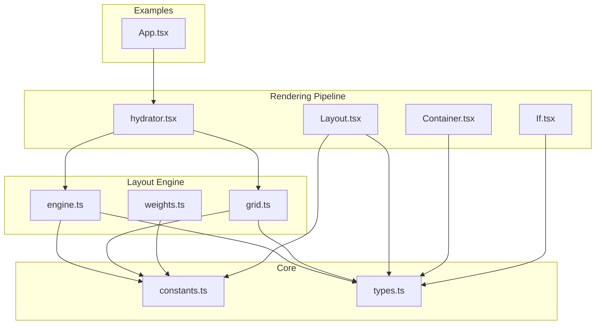
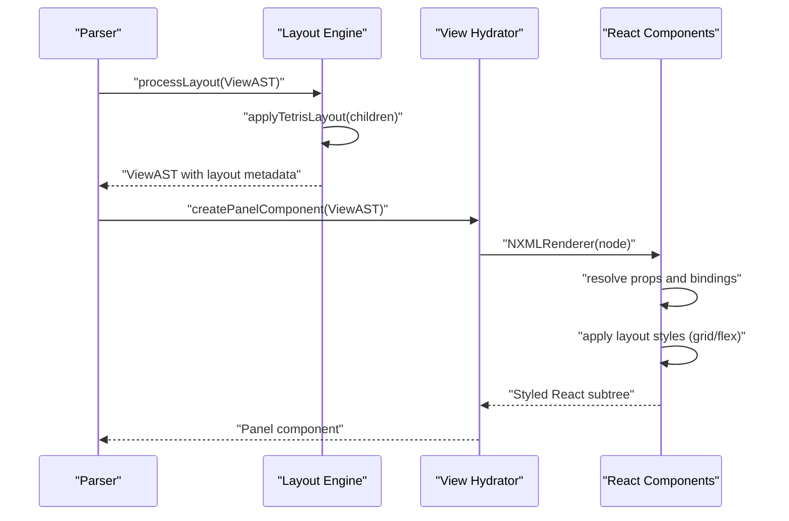
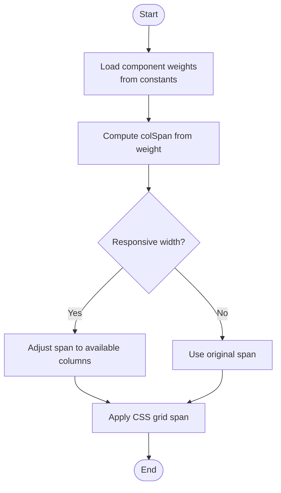
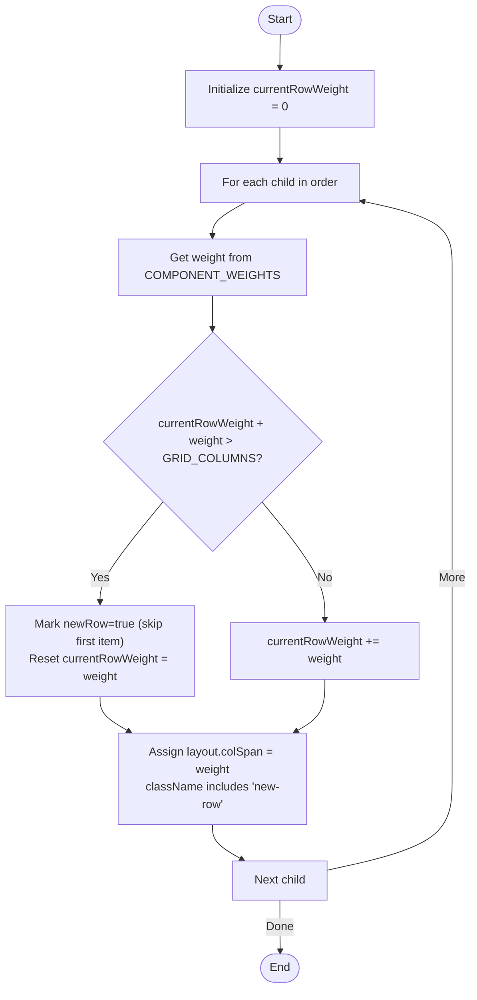
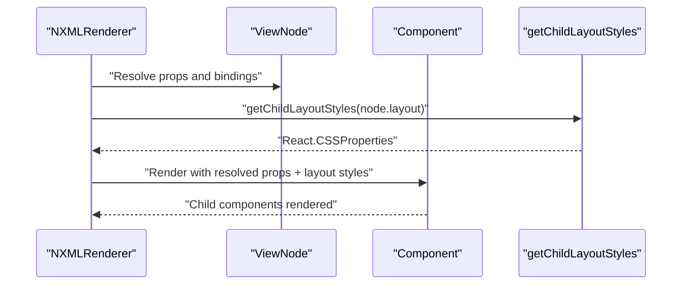
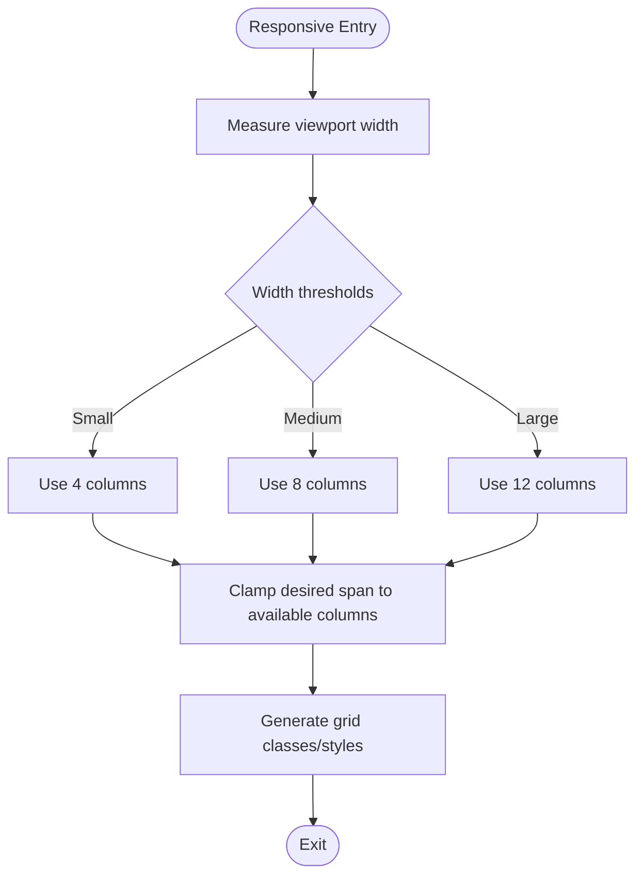
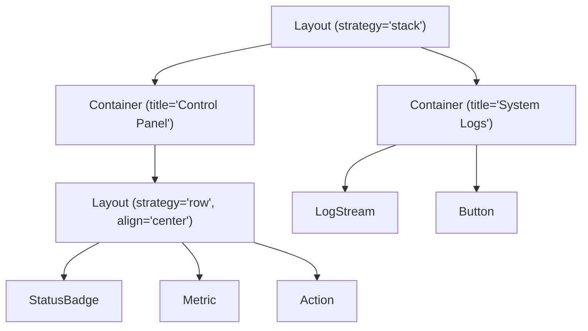
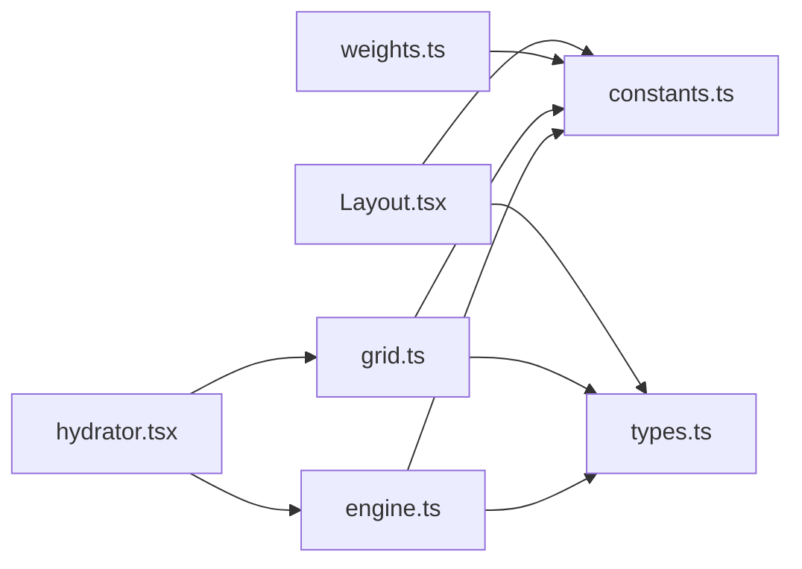

# Layout Engine

<cite>
**Referenced Files in This Document**
- [engine.ts](file://packages/nexus-reactor/src/layout/engine.ts)
- [grid.ts](file://packages/nexus-reactor/src/layout/grid.ts)
- [weights.ts](file://packages/nexus-reactor/src/layout/weights.ts)
- [constants.ts](file://packages/nexus-reactor/src/core/constants.ts)
- [types.ts](file://packages/nexus-reactor/src/core/types.ts)
- [hydrator.tsx](file://packages/nexus-reactor/src/view/hydrator.tsx)
- [Layout.tsx](file://packages/nexus-reactor/src/components/Layout.tsx)
- [Container.tsx](file://packages/nexus-reactor/src/components/Container.tsx)
- [If.tsx](file://packages/nexus-reactor/src/components/If.tsx)
- [App.tsx](file://packages/nexus-reactor/test/App.tsx)
- [01_protocol_spec.md](file://docs/01_protocol_spec.md)
- [01_reactor_spec_VERIFICATION.md](file://docs/01_reactor_spec_VERIFICATION.md)
</cite>

## Table of Contents
1. [Introduction](#introduction)
2. [Project Structure](#project-structure)
3. [Core Components](#core-components)
4. [Architecture Overview](#architecture-overview)
5. [Detailed Component Analysis](#detailed-component-analysis)
6. [Dependency Analysis](#dependency-analysis)
7. [Performance Considerations](#performance-considerations)
8. [Troubleshooting Guide](#troubleshooting-guide)
9. [Conclusion](#conclusion)
10. [Appendices](#appendices)

## Introduction
This document describes the Nexus layout engine that powers the 12-column grid system and integrates with the view rendering pipeline. It explains the Tetris algorithm for automatic component placement, the weighting system for responsive design, and the end-to-end layout processing from NXML weight attributes to final CSS calculations. It also covers the roles of grid.ts and weights.ts utilities, demonstrates complex layouts using nested containers and conditional rendering, and provides performance and accessibility guidance.

## Project Structure
The layout engine resides under packages/nexus-reactor/src/layout and collaborates with the view hydration pipeline and core constants/types.

**Diagram sources**
- [engine.ts](file://packages/nexus-reactor/src/layout/engine.ts#L1-L232)
- [grid.ts](file://packages/nexus-reactor/src/layout/grid.ts#L1-L87)
- [weights.ts](file://packages/nexus-reactor/src/layout/weights.ts#L1-L14)
- [constants.ts](file://packages/nexus-reactor/src/core/constants.ts#L1-L283)
- [types.ts](file://packages/nexus-reactor/src/core/types.ts#L50-L120)
- [hydrator.tsx](file://packages/nexus-reactor/src/view/hydrator.tsx#L1-L258)
- [Layout.tsx](file://packages/nexus-reactor/src/components/Layout.tsx#L1-L62)
- [Container.tsx](file://packages/nexus-reactor/src/components/Container.tsx#L1-L85)
- [If.tsx](file://packages/nexus-reactor/src/components/If.tsx#L1-L41)
- [App.tsx](file://packages/nexus-reactor/test/App.tsx#L1-L363)

**Section sources**
- [engine.ts](file://packages/nexus-reactor/src/layout/engine.ts#L1-L232)
- [grid.ts](file://packages/nexus-reactor/src/layout/grid.ts#L1-L87)
- [weights.ts](file://packages/nexus-reactor/src/layout/weights.ts#L1-L14)
- [constants.ts](file://packages/nexus-reactor/src/core/constants.ts#L1-L283)
- [types.ts](file://packages/nexus-reactor/src/core/types.ts#L50-L120)
- [hydrator.tsx](file://packages/nexus-reactor/src/view/hydrator.tsx#L1-L258)
- [Layout.tsx](file://packages/nexus-reactor/src/components/Layout.tsx#L1-L62)
- [Container.tsx](file://packages/nexus-reactor/src/components/Container.tsx#L1-L85)
- [If.tsx](file://packages/nexus-reactor/src/components/If.tsx#L1-L41)
- [App.tsx](file://packages/nexus-reactor/test/App.tsx#L1-L363)

## Core Components
- Layout Engine (engine.ts): Computes layout for ViewAST nodes, applies the Tetris algorithm for auto layout, and generates CSS classes/styles.
- Grid Utilities (grid.ts): Provides responsive column calculation helpers and CSS utilities for grid containers and spans.
- Weight Utilities (weights.ts): Re-exports component weights and grid column constants from core constants.
- Core Constants and Types: Define component weights, grid columns, gap sizes, and layout-related types.
- Rendering Pipeline (hydrator.tsx): Consumes layout metadata to apply CSS grid/flex styles to rendered components.
- Layout Component (Layout.tsx): Exposes strategy, gap, and alignment props to drive container layout.
- Container and If Components: Structural and conditional rendering primitives used in complex layouts.

**Section sources**
- [engine.ts](file://packages/nexus-reactor/src/layout/engine.ts#L1-L232)
- [grid.ts](file://packages/nexus-reactor/src/layout/grid.ts#L1-L87)
- [weights.ts](file://packages/nexus-reactor/src/layout/weights.ts#L1-L14)
- [constants.ts](file://packages/nexus-reactor/src/core/constants.ts#L13-L63)
- [types.ts](file://packages/nexus-reactor/src/core/types.ts#L50-L120)
- [hydrator.tsx](file://packages/nexus-reactor/src/view/hydrator.tsx#L1-L258)
- [Layout.tsx](file://packages/nexus-reactor/src/components/Layout.tsx#L1-L62)
- [Container.tsx](file://packages/nexus-reactor/src/components/Container.tsx#L1-L85)
- [If.tsx](file://packages/nexus-reactor/src/components/If.tsx#L1-L41)

## Architecture Overview
The layout engine transforms a ViewAST into a styled component tree by:
1. Computing layout metadata (column spans, new-row markers) using component weights and the Tetris algorithm.
2. Injecting layout info into nodes.
3. Rendering components that read layout metadata to apply CSS grid/flex styles.

**Diagram sources**
- [engine.ts](file://packages/nexus-reactor/src/layout/engine.ts#L13-L102)
- [hydrator.tsx](file://packages/nexus-reactor/src/view/hydrator.tsx#L196-L205)
- [Layout.tsx](file://packages/nexus-reactor/src/components/Layout.tsx#L18-L52)

## Detailed Component Analysis

### 12-Column Grid System and Weighting
- Component weights define default column spans for each component type. These weights are used by the layout engine to compute spans and determine row wrapping.
- The engine reads weights from constants and assigns them to each node’s layout metadata.
- The grid utilities provide responsive helpers to adapt to different viewport widths and to compute spans safely within available columns.

**Diagram sources**
- [constants.ts](file://packages/nexus-reactor/src/core/constants.ts#L22-L46)
- [engine.ts](file://packages/nexus-reactor/src/layout/engine.ts#L89-L102)
- [grid.ts](file://packages/nexus-reactor/src/layout/grid.ts#L30-L48)

**Section sources**
- [constants.ts](file://packages/nexus-reactor/src/core/constants.ts#L13-L63)
- [engine.ts](file://packages/nexus-reactor/src/layout/engine.ts#L89-L102)
- [grid.ts](file://packages/nexus-reactor/src/layout/grid.ts#L30-L48)

### Tetris Algorithm for Auto Placement
The Tetris algorithm places children in a row until adding the next child would exceed the grid width. When overflow occurs, it starts a new row and continues placing items accordingly.

**Diagram sources**
- [engine.ts](file://packages/nexus-reactor/src/layout/engine.ts#L58-L84)
- [01_protocol_spec.md](file://docs/01_protocol_spec.md#L1577-L1595)
- [01_reactor_spec_VERIFICATION.md](file://docs/01_reactor_spec_VERIFICATION.md#L419-L456)

**Section sources**
- [engine.ts](file://packages/nexus-reactor/src/layout/engine.ts#L58-L84)
- [01_protocol_spec.md](file://docs/01_protocol_spec.md#L1577-L1595)
- [01_reactor_spec_VERIFICATION.md](file://docs/01_reactor_spec_VERIFICATION.md#L419-L456)

### Integration with View Rendering Pipeline
- The hydrator resolves bindings and passes layout metadata to components via inline styles.
- The Layout component applies grid/flex styles based on strategy and props.
- Conditional and iterative rendering components integrate seamlessly with layout metadata.

**Diagram sources**
- [hydrator.tsx](file://packages/nexus-reactor/src/view/hydrator.tsx#L196-L205)
- [engine.ts](file://packages/nexus-reactor/src/layout/engine.ts#L165-L173)
- [Layout.tsx](file://packages/nexus-reactor/src/components/Layout.tsx#L18-L52)

**Section sources**
- [hydrator.tsx](file://packages/nexus-reactor/src/view/hydrator.tsx#L196-L205)
- [engine.ts](file://packages/nexus-reactor/src/layout/engine.ts#L165-L173)
- [Layout.tsx](file://packages/nexus-reactor/src/components/Layout.tsx#L18-L52)

### Grid Utilities and Responsive Behavior
- Grid utilities compute responsive column counts and adjust spans to fit available columns.
- They also provide CSS classes and inline styles for grid spans and container configuration.

**Diagram sources**
- [grid.ts](file://packages/nexus-reactor/src/layout/grid.ts#L30-L48)

**Section sources**
- [grid.ts](file://packages/nexus-reactor/src/layout/grid.ts#L30-L48)

### Weight Utilities and Exported Types
- weights.ts re-exports component weights and grid columns for convenience.
- types.ts defines ColumnSpan and other layout-related types.

**Section sources**
- [weights.ts](file://packages/nexus-reactor/src/layout/weights.ts#L1-L14)
- [types.ts](file://packages/nexus-reactor/src/core/types.ts#L68-L81)

### Complex Layouts: Nested Containers and Conditional Rendering
- Nested containers and stacked layouts demonstrate hierarchical structure and alignment.
- Conditional rendering with If and iterative rendering with Iterate showcase dynamic content composition.

**Diagram sources**
- [App.tsx](file://packages/nexus-reactor/test/App.tsx#L62-L86)
- [If.tsx](file://packages/nexus-reactor/src/components/If.tsx#L1-L41)

**Section sources**
- [App.tsx](file://packages/nexus-reactor/test/App.tsx#L62-L86)
- [If.tsx](file://packages/nexus-reactor/src/components/If.tsx#L1-L41)

## Dependency Analysis
The layout engine depends on core constants for weights and grid columns, and on types for layout metadata. The hydrator consumes layout metadata to produce styled components.

**Diagram sources**
- [engine.ts](file://packages/nexus-reactor/src/layout/engine.ts#L1-L20)
- [grid.ts](file://packages/nexus-reactor/src/layout/grid.ts#L1-L18)
- [weights.ts](file://packages/nexus-reactor/src/layout/weights.ts#L1-L14)
- [constants.ts](file://packages/nexus-reactor/src/core/constants.ts#L13-L63)
- [types.ts](file://packages/nexus-reactor/src/core/types.ts#L50-L120)
- [hydrator.tsx](file://packages/nexus-reactor/src/view/hydrator.tsx#L196-L205)
- [Layout.tsx](file://packages/nexus-reactor/src/components/Layout.tsx#L18-L52)

**Section sources**
- [engine.ts](file://packages/nexus-reactor/src/layout/engine.ts#L1-L20)
- [grid.ts](file://packages/nexus-reactor/src/layout/grid.ts#L1-L18)
- [weights.ts](file://packages/nexus-reactor/src/layout/weights.ts#L1-L14)
- [constants.ts](file://packages/nexus-reactor/src/core/constants.ts#L13-L63)
- [types.ts](file://packages/nexus-reactor/src/core/types.ts#L50-L120)
- [hydrator.tsx](file://packages/nexus-reactor/src/view/hydrator.tsx#L196-L205)
- [Layout.tsx](file://packages/nexus-reactor/src/components/Layout.tsx#L18-L52)

## Performance Considerations
- Layout recomputation: The engine computes layout once per ViewAST pass. When state changes occur, the hydrator triggers re-rendering of affected components. To minimize re-renders:
  - Keep layout metadata immutable where possible.
  - Use memoization for expensive prop computations in components.
  - Prefer stack or row strategies for dense grids to reduce DOM nesting.
- Responsive adjustments: Responsive column count changes should be throttled to avoid frequent reflows.
- Subscription model: The hydrator subscribes to state updates and forces targeted re-renders. Limit unnecessary subscriptions and batch updates when possible.

[No sources needed since this section provides general guidance]

## Troubleshooting Guide
- Unexpected wrapping: Verify component weights and ensure the parent strategy is set appropriately. The Tetris algorithm wraps when cumulative weight exceeds the grid width.
- Misaligned content: Confirm alignment props on Layout components and ensure CSS grid/flex styles are applied as expected.
- Conditional rendering issues: Ensure conditions are expressed as binding expressions and evaluated correctly in the hydration context.

**Section sources**
- [engine.ts](file://packages/nexus-reactor/src/layout/engine.ts#L58-L84)
- [Layout.tsx](file://packages/nexus-reactor/src/components/Layout.tsx#L18-L52)
- [If.tsx](file://packages/nexus-reactor/src/components/If.tsx#L18-L41)

## Conclusion
The Nexus layout engine provides a robust, declarative 12-column grid system powered by component weights and the Tetris algorithm. It integrates tightly with the rendering pipeline to produce efficient, responsive layouts. The grid.ts and weights.ts utilities enable dynamic, responsive behavior while maintaining predictable placement semantics.

[No sources needed since this section summarizes without analyzing specific files]

## Appendices

### API and Props Summary
- Layout component props:
  - strategy: 'auto' | 'stack' | 'row'
  - gap: 'sm' | 'md' | 'lg'
  - align: 'start' | 'center' | 'end' | 'stretch'
  - justify: 'start' | 'center' | 'end' | 'stretch'

**Section sources**
- [Layout.tsx](file://packages/nexus-reactor/src/components/Layout.tsx#L9-L16)
- [01_protocol_spec.md](file://docs/01_protocol_spec.md#L259-L273)

### Accessibility Guidelines
- Semantic structure: Use containers and headings to group content for assistive technologies.
- Contrast and spacing: Ensure adequate gap sizes and readable typography.
- Focus management: Maintain logical tab order within grid/flex layouts.
- ARIA: Add roles and labels where necessary for complex controls.

[No sources needed since this section provides general guidance]