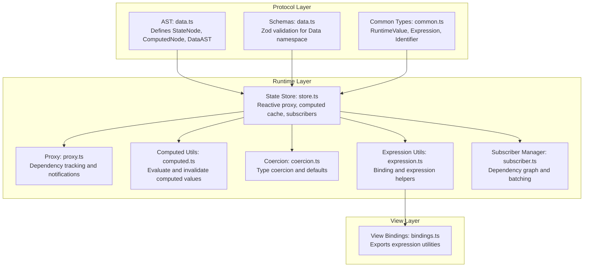
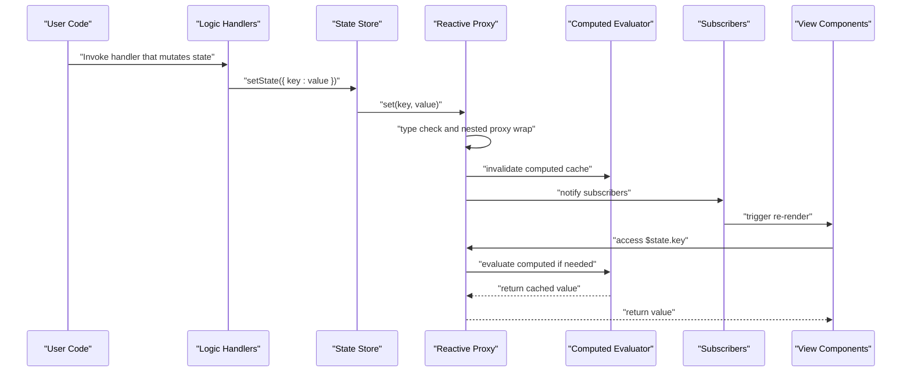
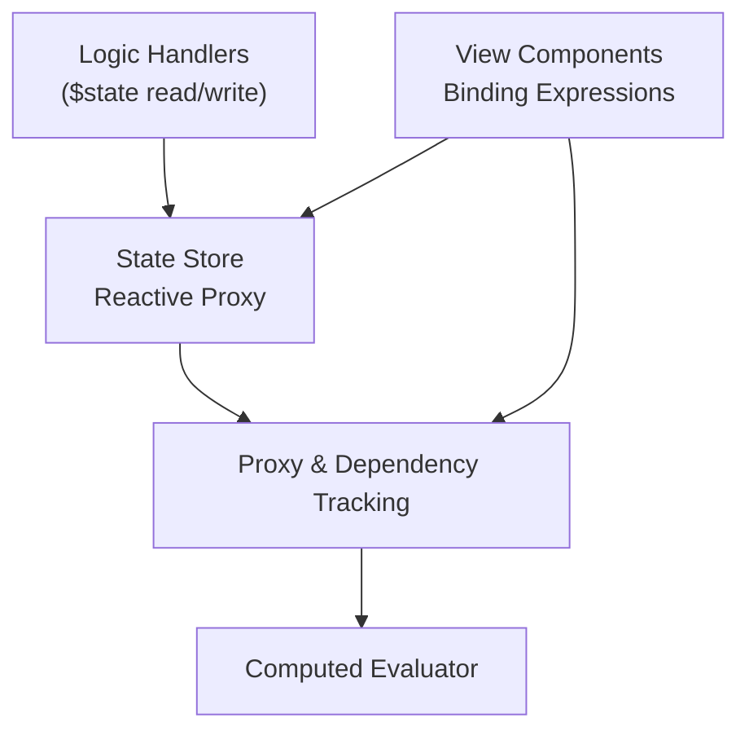

# Data Namespace

<cite>
**Referenced Files in This Document**
- [data.ts](file://packages/nexus-protocol/src/ast/data.ts)
- [data.ts](file://packages/nexus-protocol/src/schemas/data.ts)
- [common.ts](file://packages/nexus-protocol/src/ast/common.ts)
- [types.ts](file://packages/nexus-reactor/src/core/types.ts)
- [constants.ts](file://packages/nexus-reactor/src/core/constants.ts)
- [store.ts](file://packages/nexus-reactor/src/state/store.ts)
- [proxy.ts](file://packages/nexus-reactor/src/state/proxy.ts)
- [computed.ts](file://packages/nexus-reactor/src/state/computed.ts)
- [coercion.ts](file://packages/nexus-reactor/src/utils/coercion.ts)
- [expression.ts](file://packages/nexus-reactor/src/utils/expression.ts)
- [bindings.ts](file://packages/nexus-reactor/src/view/bindings.ts)
- [subscriber.ts](file://packages/nexus-reactor/src/state/subscriber.ts)
</cite>

## Table of Contents
1. [Introduction](#introduction)
2. [Project Structure](#project-structure)
3. [Core Components](#core-components)
4. [Architecture Overview](#architecture-overview)
5. [Detailed Component Analysis](#detailed-component-analysis)
6. [Dependency Analysis](#dependency-analysis)
7. [Performance Considerations](#performance-considerations)
8. [Troubleshooting Guide](#troubleshooting-guide)
9. [Conclusion](#conclusion)
10. [Appendices](#appendices)

## Introduction
The Data namespace defines the reactive state model for a NexusPanel. It enables declarative state and computed properties, with a robust validation pipeline and a reactive engine that propagates changes to views automatically. This document explains the AST definitions, schema validation, runtime state store, computed evaluation, and how the Data namespace integrates with Logic handlers (mutations) and View components (bindings).

## Project Structure
The Data namespace spans protocol-level AST definitions and runtime implementations:
- Protocol AST and schemas define the canonical structure and validation rules for State and Computed nodes.
- Runtime state store and proxy implement reactive updates, computed caching, and dependency tracking.
- Utilities provide type coercion, expression evaluation, and binding resolution.
- View bindings expose evaluation helpers for rendering.

**Diagram sources**
- [data.ts](file://packages/nexus-protocol/src/ast/data.ts#L1-L242)
- [data.ts](file://packages/nexus-protocol/src/schemas/data.ts#L1-L198)
- [common.ts](file://packages/nexus-protocol/src/ast/common.ts#L1-L239)
- [store.ts](file://packages/nexus-reactor/src/state/store.ts#L1-L255)
- [proxy.ts](file://packages/nexus-reactor/src/state/proxy.ts#L1-L393)
- [computed.ts](file://packages/nexus-reactor/src/state/computed.ts#L1-L96)
- [coercion.ts](file://packages/nexus-reactor/src/utils/coercion.ts#L1-L284)
- [expression.ts](file://packages/nexus-reactor/src/utils/expression.ts#L1-L255)
- [bindings.ts](file://packages/nexus-reactor/src/view/bindings.ts#L1-L27)
- [subscriber.ts](file://packages/nexus-reactor/src/state/subscriber.ts#L1-L351)

**Section sources**
- [data.ts](file://packages/nexus-protocol/src/ast/data.ts#L1-L242)
- [data.ts](file://packages/nexus-protocol/src/schemas/data.ts#L1-L198)
- [common.ts](file://packages/nexus-protocol/src/ast/common.ts#L1-L239)
- [store.ts](file://packages/nexus-reactor/src/state/store.ts#L1-L255)
- [proxy.ts](file://packages/nexus-reactor/src/state/proxy.ts#L1-L393)
- [computed.ts](file://packages/nexus-reactor/src/state/computed.ts#L1-L96)
- [coercion.ts](file://packages/nexus-reactor/src/utils/coercion.ts#L1-L284)
- [expression.ts](file://packages/nexus-reactor/src/utils/expression.ts#L1-L255)
- [bindings.ts](file://packages/nexus-reactor/src/view/bindings.ts#L1-L27)
- [subscriber.ts](file://packages/nexus-reactor/src/state/subscriber.ts#L1-L351)

## Core Components
- StateNode: Declares a mutable state variable with a name, type, and optional default. Defaults are coerced to the declared type.
- ComputedNode: Declares a read-only derived value computed from $state via a JavaScript expression.
- DataAST: Aggregates all State and Computed declarations for a panel.
- Runtime Store: Creates a reactive proxy around state, tracks dependencies, caches computed values, and notifies subscribers on changes.
- Validation: Zod schemas enforce type enums, identifiers, expression syntax, and uniqueness of names.

**Section sources**
- [data.ts](file://packages/nexus-protocol/src/ast/data.ts#L30-L133)
- [data.ts](file://packages/nexus-protocol/src/schemas/data.ts#L54-L138)
- [store.ts](file://packages/nexus-reactor/src/state/store.ts#L25-L120)
- [computed.ts](file://packages/nexus-reactor/src/state/computed.ts#L1-L96)

## Architecture Overview
The Data namespace participates in a three-layer architecture:
- Declarative layer: NXML declares State and Computed nodes.
- Validation layer: Zod schemas validate structure and types.
- Reactive runtime: A Proxy-based store manages state, computed values, and subscriptions.

**Diagram sources**
- [store.ts](file://packages/nexus-reactor/src/state/store.ts#L84-L120)
- [computed.ts](file://packages/nexus-reactor/src/state/computed.ts#L1-L96)
- [proxy.ts](file://packages/nexus-reactor/src/state/proxy.ts#L170-L254)
- [subscriber.ts](file://packages/nexus-reactor/src/state/subscriber.ts#L149-L183)

## Detailed Component Analysis

### StateNode and ComputedNode AST
StateNode and ComputedNode define the declarative contract for reactive state:
- StateNode fields:
  - name: Identifier (JS identifier)
  - type: NXMLPrimitiveType ('string' | 'number' | 'boolean' | 'list' | 'object')
  - default: RuntimeValue (optional)
- ComputedNode fields:
  - name: Identifier (JS identifier)
  - value: Expression (JavaScript expression string referencing $state)

Default value parsing and type enforcement:
- Parser-side coercion converts string defaults to the declared type.
- Runtime type checks ensure writes match declared types.

Computed evaluation:
- Computed values are cached and invalidated on state changes.
- Expressions are evaluated against a read-only $state proxy.

**Section sources**
- [data.ts](file://packages/nexus-protocol/src/ast/data.ts#L30-L133)
- [common.ts](file://packages/nexus-protocol/src/ast/common.ts#L10-L36)
- [data.ts](file://packages/nexus-protocol/src/schemas/data.ts#L54-L138)
- [coercion.ts](file://packages/nexus-reactor/src/utils/coercion.ts#L34-L83)
- [store.ts](file://packages/nexus-reactor/src/state/store.ts#L152-L170)

### DataAST and Factory Functions
DataAST aggregates all state and computed declarations. Factory functions simplify construction of nodes and the container.

Key utilities:
- getStateNames: Collects all declared names (states and computed).
- findDataNode: Locates a node by name.
- getDefaultForType: Provides default values per type.
- parseDefaultValue: Parses string defaults into typed values.

**Section sources**
- [data.ts](file://packages/nexus-protocol/src/ast/data.ts#L121-L201)
- [data.ts](file://packages/nexus-protocol/src/ast/data.ts#L205-L242)

### Schema Validation (Zod)
Validation ensures correctness and uniqueness:
- IdentifierSchema enforces JS identifier rules.
- NXMLPrimitiveTypeSchema restricts types to supported primitives.
- StateNodeSchema validates kind, name, type, optional default, and optional source location.
- ComputedNodeSchema validates kind, name, non-empty expression with basic bracket balancing, and optional source location.
- DataASTSchema validates arrays of states and computed, and enforces unique names across both lists.

Validation helpers:
- validateStateNode, validateComputedNode, validateDataAST return safeParse results.
- validateDefaultValueType checks that provided defaults match declared types.

**Section sources**
- [data.ts](file://packages/nexus-protocol/src/schemas/data.ts#L12-L138)
- [data.ts](file://packages/nexus-protocol/src/schemas/data.ts#L144-L198)

### Runtime State Store and Reactive Proxy
The state store initializes values, registers computed definitions, and creates a reactive proxy:
- Initialization: Types are recorded; defaults are applied or coerced.
- Proxy behavior:
  - get: Tracks dependencies, wraps nested objects/arrays, and resolves computed values.
  - set: Prevents writing to computed keys, validates types, triggers recomputation, and notifies subscribers.
  - has and ownKeys: Ensures computed keys appear present.
- Nested proxies: Deep mutation triggers recomputation and notifies subscribers on the parent key.
- Computed evaluation: Cached per name; cleared on state changes.
- Dependency tracking: Maintains subscriber-to-key and key-to-subscriber mappings.
- Loop protection: Update depth limit prevents infinite loops.

**Section sources**
- [store.ts](file://packages/nexus-reactor/src/state/store.ts#L25-L120)
- [store.ts](file://packages/nexus-reactor/src/state/store.ts#L122-L202)
- [store.ts](file://packages/nexus-reactor/src/state/store.ts#L204-L255)
- [proxy.ts](file://packages/nexus-reactor/src/state/proxy.ts#L170-L323)
- [proxy.ts](file://packages/nexus-reactor/src/state/proxy.ts#L325-L393)
- [subscriber.ts](file://packages/nexus-reactor/src/state/subscriber.ts#L149-L183)

### Computed Evaluation Utilities
- evaluateComputed: Evaluates a computed expression against the reactive $state proxy and caches the result.
- invalidateComputedCache: Clears computed cache on state changes.
- getComputedValues: Returns current computed values by evaluating all registered expressions.

**Section sources**
- [computed.ts](file://packages/nexus-reactor/src/state/computed.ts#L1-L96)

### Type Coercion and Equality
- getDefaultForType: Returns canonical defaults for each primitive type.
- parseDefaultValue: Converts string defaults to typed values with robust fallbacks.
- coerceToType: Converts runtime values to a specified type with sensible defaults.
- validateValueType: Checks runtime values against declared types.
- valuesEqual: Deep equality for arrays and objects, shallow for primitives.

**Section sources**
- [coercion.ts](file://packages/nexus-reactor/src/utils/coercion.ts#L1-L284)

### Expression Utilities and View Bindings
- isBindingExpression, extractExpression, resolveBinding, resolveBindings: Parse and evaluate binding expressions.
- evaluateExpression: Safely evaluates expressions with $state and $scope contexts.
- extractStateRefs, extractScopeRefs: Detect dependencies in expressions.
- interpolateString: String interpolation with bindings.
- View bindings re-export expression utilities for convenience.

**Section sources**
- [expression.ts](file://packages/nexus-reactor/src/utils/expression.ts#L1-L255)
- [bindings.ts](file://packages/nexus-reactor/src/view/bindings.ts#L1-L27)

## Dependency Analysis
The Data namespace interacts with other namespaces as follows:
- Logic handlers mutate state via the reactive store. They receive a sandboxed context with $state for read/write operations.
- View components bind to state using binding expressions. The expression utilities resolve $state references and compute values at render time.
- The proxy layer tracks dependencies and batches updates to minimize redundant renders.

**Diagram sources**
- [types.ts](file://packages/nexus-reactor/src/core/types.ts#L279-L309)
- [store.ts](file://packages/nexus-reactor/src/state/store.ts#L84-L120)
- [proxy.ts](file://packages/nexus-reactor/src/state/proxy.ts#L170-L254)
- [expression.ts](file://packages/nexus-reactor/src/utils/expression.ts#L76-L142)

**Section sources**
- [types.ts](file://packages/nexus-reactor/src/core/types.ts#L279-L309)
- [expression.ts](file://packages/nexus-reactor/src/utils/expression.ts#L1-L255)
- [store.ts](file://packages/nexus-reactor/src/state/store.ts#L1-L255)

## Performance Considerations
- Computed caching: Computed values are cached per name and invalidated on state changes to avoid repeated evaluations.
- Nested proxies: Deep mutation triggers recomputation on the parent key, minimizing unnecessary recomputations.
- Dependency batching: Subscriber notifications can be batched to reduce churn during bulk updates.
- Equality checks: valuesEqual uses shallow comparisons for arrays and objects to balance accuracy and performance.
- Infinite loop protection: Update depth limits prevent runaway recomputation.

[No sources needed since this section provides general guidance]

## Troubleshooting Guide
Common issues and resolutions:
- Invalid identifier names:
  - Symptom: Validation fails with identifier errors.
  - Cause: name does not match JS identifier rules.
  - Fix: Use valid JS identifiers for state and computed names.
  - Reference: IdentifierSchema and constants for identifier patterns.
- Unsupported or mismatched types:
  - Symptom: Type mismatch warnings or runtime errors.
  - Cause: Writing incompatible values or declaring wrong types.
  - Fix: Ensure default and runtime values match the declared type; rely on coercion utilities.
  - References: validateDefaultValueType, validateValueType, coerceToType.
- Duplicate names:
  - Symptom: Validation error indicating duplicate state/computed names.
  - Cause: Same name appears in both states and computed lists.
  - Fix: Rename duplicates to be unique across the Data namespace.
  - Reference: DataASTSchema uniqueness check.
- Malformed expressions:
  - Symptom: Expression validation fails or runtime evaluation errors.
  - Cause: Unbalanced brackets or invalid syntax.
  - Fix: Ensure balanced parentheses/brackets and valid JS expressions.
  - Reference: ExpressionSchema and evaluateExpression.
- Infinite loops:
  - Symptom: Maximum update depth exceeded error.
  - Cause: Mutations inside computed or effects that cause self-reinforcing updates.
  - Fix: Break cycles by avoiding mutating the same keys in computed or effects.
  - Reference: Update depth checks in store and proxy.
- Debugging tips:
  - Use source locations attached to AST nodes for precise error reporting.
  - Inspect computed dependencies via expression utilities and dependency tracking.
  - Leverage subscriber management to isolate which components react to specific keys.

**Section sources**
- [data.ts](file://packages/nexus-protocol/src/schemas/data.ts#L54-L138)
- [coercion.ts](file://packages/nexus-reactor/src/utils/coercion.ts#L193-L218)
- [store.ts](file://packages/nexus-reactor/src/state/store.ts#L182-L202)
- [proxy.ts](file://packages/nexus-reactor/src/state/proxy.ts#L112-L144)
- [constants.ts](file://packages/nexus-reactor/src/core/constants.ts#L134-L158)

## Conclusion
The Data namespace provides a strongly-typed, validated foundation for reactive state in NexusPanels. Through AST definitions, Zod schemas, and a Proxy-based runtime, it ensures correctness, efficient updates, and seamless integration with Logic handlers and View components. By following the validation rules, leveraging computed caching, and adhering to dependency tracking, developers can build responsive and maintainable panels.

[No sources needed since this section summarizes without analyzing specific files]

## Appendices

### Practical Usage Patterns
- Declare states with appropriate types and defaults; rely on coercion for string defaults.
- Use computed properties to derive values from $state and keep them read-only.
- Bind view props to $state using binding expressions; avoid mutating state directly in views.
- Keep computed expressions pure and free of side effects.

[No sources needed since this section provides general guidance]

### Example NXML Syntax (by reference)
- State declarations with various types and defaults:
  - See factory functions and default value helpers for correct structure.
  - References: [data.ts](file://packages/nexus-protocol/src/ast/data.ts#L142-L178), [coercion.ts](file://packages/nexus-reactor/src/utils/coercion.ts#L34-L83)
- Computed properties referencing $state:
  - See ComputedNode value field and evaluation utilities.
  - References: [data.ts](file://packages/nexus-protocol/src/ast/data.ts#L77-L92), [expression.ts](file://packages/nexus-reactor/src/utils/expression.ts#L76-L101)

### Relationship Between Namespaces
- Data namespace: Defines state and computed values.
- Logic namespace: Mutates state via handlers with $state.
- View namespace: Binds to state via expressions and renders updates.

**Section sources**
- [types.ts](file://packages/nexus-reactor/src/core/types.ts#L121-L140)
- [types.ts](file://packages/nexus-reactor/src/core/types.ts#L143-L211)
- [types.ts](file://packages/nexus-reactor/src/core/types.ts#L213-L244)