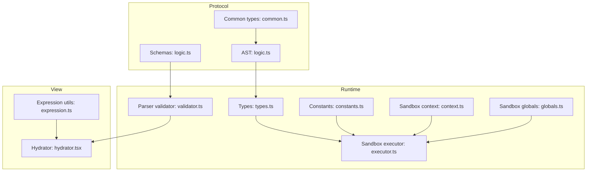
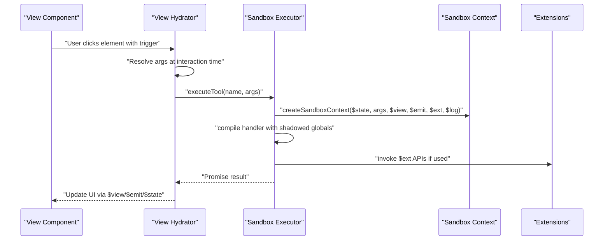
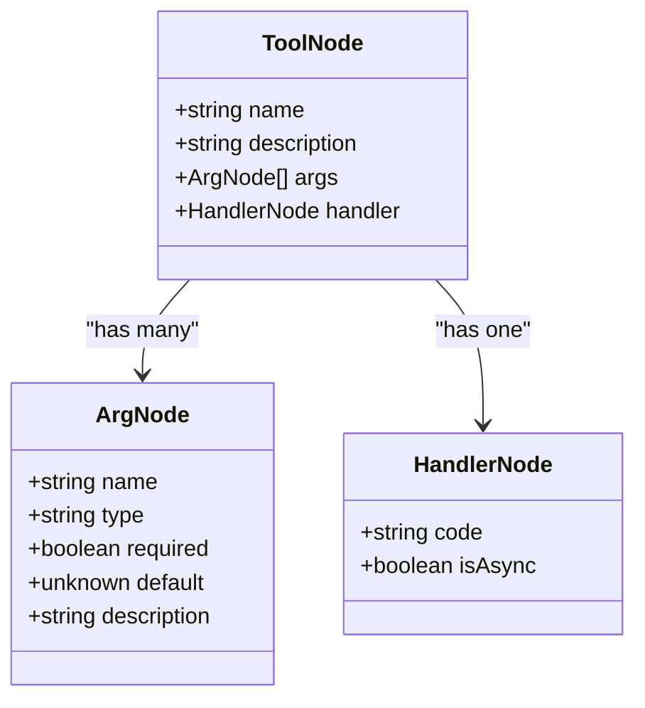
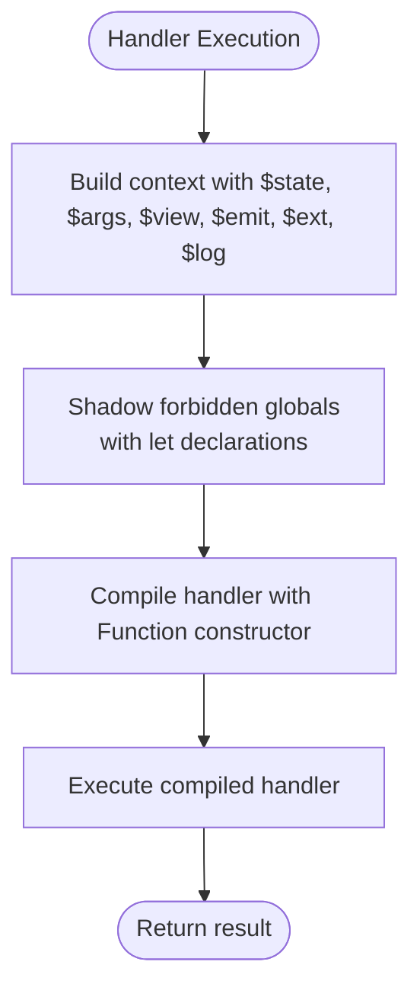
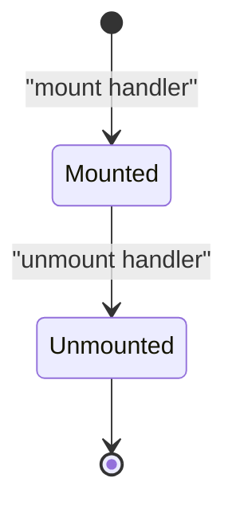
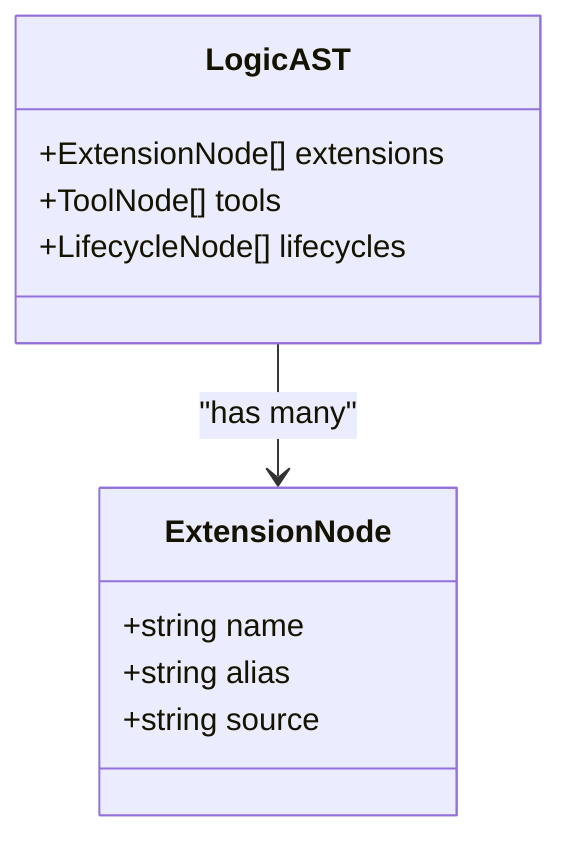
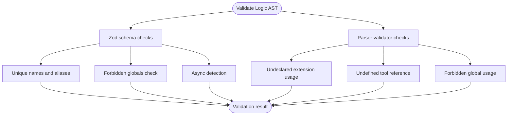
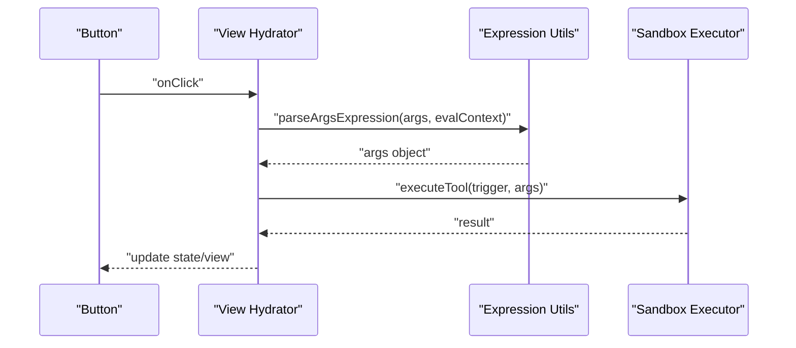
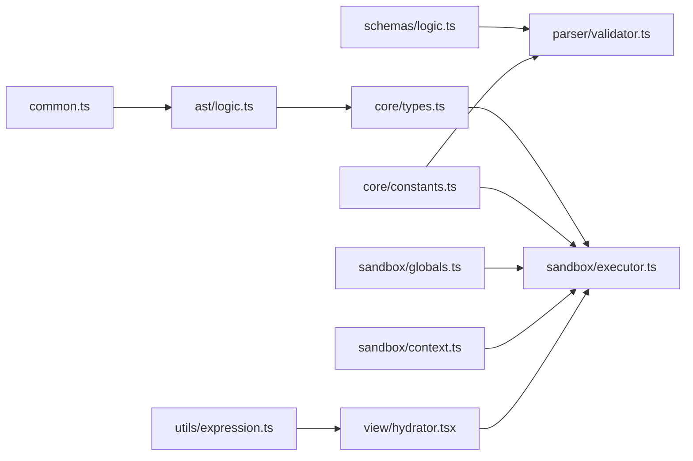

# Logic Namespace

<cite>
**Referenced Files in This Document**
- [logic.ts](file://packages/nexus-protocol/src/ast/logic.ts)
- [logic.ts](file://packages/nexus-protocol/src/schemas/logic.ts)
- [common.ts](file://packages/nexus-protocol/src/ast/common.ts)
- [types.ts](file://packages/nexus-reactor/src/core/types.ts)
- [constants.ts](file://packages/nexus-reactor/src/core/constants.ts)
- [context.ts](file://packages/nexus-reactor/src/sandbox/context.ts)
- [globals.ts](file://packages/nexus-reactor/src/sandbox/globals.ts)
- [executor.ts](file://packages/nexus-reactor/src/sandbox/executor.ts)
- [validator.ts](file://packages/nexus-reactor/src/parser/validator.ts)
- [hydrator.tsx](file://packages/nexus-reactor/src/view/hydrator.tsx)
- [expression.ts](file://packages/nexus-reactor/src/utils/expression.ts)
</cite>

## Table of Contents
1. [Introduction](#introduction)
2. [Project Structure](#project-structure)
3. [Core Components](#core-components)
4. [Architecture Overview](#architecture-overview)
5. [Detailed Component Analysis](#detailed-component-analysis)
6. [Dependency Analysis](#dependency-analysis)
7. [Performance Considerations](#performance-considerations)
8. [Troubleshooting Guide](#troubleshooting-guide)
9. [Conclusion](#conclusion)

## Introduction
The Logic Namespace defines panel behavior in NXML using sandboxed JavaScript functions (Tools and Handlers) and lifecycle hooks (mount/unmount). It enables declarative UI-to-behavior wiring, AI-friendly descriptions for tools, and a restricted execution environment that prevents access to unsafe globals. This document explains the structure of ToolNode and HandlerNode, the sandbox execution context, available sandbox APIs, lifecycle constraints, extension declarations, validation rules, and how UI triggers invoke tools with dynamic arguments.

## Project Structure
The Logic Namespace spans protocol-level AST definitions and runtime validation/execution:

- Protocol AST and schemas define typed structures and validation rules.
- Runtime types and constants define the sandbox execution model and security boundaries.
- Sandbox utilities construct and validate the execution context and enforce restrictions.
- Parser validation enforces uniqueness, forbidden globals, and cross-references.
- View hydration resolves dynamic arguments at interaction time and triggers tools.

**Diagram sources**
- [logic.ts](file://packages/nexus-protocol/src/ast/logic.ts#L1-L414)
- [logic.ts](file://packages/nexus-protocol/src/schemas/logic.ts#L1-L283)
- [common.ts](file://packages/nexus-protocol/src/ast/common.ts#L1-L239)
- [types.ts](file://packages/nexus-reactor/src/core/types.ts#L1-L446)
- [constants.ts](file://packages/nexus-reactor/src/core/constants.ts#L1-L283)
- [context.ts](file://packages/nexus-reactor/src/sandbox/context.ts#L1-L113)
- [globals.ts](file://packages/nexus-reactor/src/sandbox/globals.ts#L1-L149)
- [executor.ts](file://packages/nexus-reactor/src/sandbox/executor.ts#L1-L161)
- [validator.ts](file://packages/nexus-reactor/src/parser/validator.ts#L1-L176)
- [hydrator.tsx](file://packages/nexus-reactor/src/view/hydrator.tsx#L150-L258)
- [expression.ts](file://packages/nexus-reactor/src/utils/expression.ts#L1-L200)

**Section sources**
- [logic.ts](file://packages/nexus-protocol/src/ast/logic.ts#L1-L414)
- [logic.ts](file://packages/nexus-protocol/src/schemas/logic.ts#L1-L283)
- [common.ts](file://packages/nexus-protocol/src/ast/common.ts#L1-L239)
- [types.ts](file://packages/nexus-reactor/src/core/types.ts#L1-L446)
- [constants.ts](file://packages/nexus-reactor/src/core/constants.ts#L1-L283)
- [context.ts](file://packages/nexus-reactor/src/sandbox/context.ts#L1-L113)
- [globals.ts](file://packages/nexus-reactor/src/sandbox/globals.ts#L1-L149)
- [executor.ts](file://packages/nexus-reactor/src/sandbox/executor.ts#L1-L161)
- [validator.ts](file://packages/nexus-reactor/src/parser/validator.ts#L1-L176)
- [hydrator.tsx](file://packages/nexus-reactor/src/view/hydrator.tsx#L150-L258)
- [expression.ts](file://packages/nexus-reactor/src/utils/expression.ts#L1-L200)

## Core Components
- ToolNode: Atomic operation with a name, optional description, argument list, and a handler.
- HandlerNode: JavaScript code executed in the sandbox with optional async flag.
- LifecycleNode: Hook for mount/unmount events with a handler.
- ExtensionNode: Declares external capabilities with a namespace-like name and alias.

These structures are defined in the protocol AST and mirrored in runtime types. Validation ensures uniqueness and safety.

**Section sources**
- [logic.ts](file://packages/nexus-protocol/src/ast/logic.ts#L107-L235)
- [types.ts](file://packages/nexus-reactor/src/core/types.ts#L142-L210)
- [validator.ts](file://packages/nexus-reactor/src/parser/validator.ts#L51-L102)

## Architecture Overview
The Logic Namespace orchestrates UI triggers to sandboxed handlers with a controlled execution context.

**Diagram sources**
- [hydrator.tsx](file://packages/nexus-reactor/src/view/hydrator.tsx#L150-L258)
- [executor.ts](file://packages/nexus-reactor/src/sandbox/executor.ts#L1-L161)
- [context.ts](file://packages/nexus-reactor/src/sandbox/context.ts#L1-L113)
- [globals.ts](file://packages/nexus-reactor/src/sandbox/globals.ts#L1-L149)

## Detailed Component Analysis

### ToolNode and HandlerNode
- ToolNode structure:
  - name: Unique identifier used as the trigger reference.
  - description: AI-friendly description for NexusOS tool selection.
  - args: Array of ArgNode entries with type, required/default, and description.
  - handler: HandlerNode containing the code to execute.
- HandlerNode structure:
  - code: JavaScript string executed in the sandbox.
  - isAsync: Optional flag; auto-detected if code contains async/await.

Execution flow:
- The view hydrator resolves dynamic arguments at interaction time and invokes the runtime tool executor.
- The executor validates and coerces arguments, constructs a sandbox context, compiles the handler with shadowed globals, and executes it.

**Diagram sources**
- [logic.ts](file://packages/nexus-protocol/src/ast/logic.ts#L107-L185)
- [types.ts](file://packages/nexus-reactor/src/core/types.ts#L142-L194)

**Section sources**
- [logic.ts](file://packages/nexus-protocol/src/ast/logic.ts#L107-L185)
- [types.ts](file://packages/nexus-reactor/src/core/types.ts#L142-L194)
- [executor.ts](file://packages/nexus-reactor/src/sandbox/executor.ts#L37-L67)

### Sandbox Execution Context and Restricted Environment
- Sandbox context keys ($state, $args, $view, $emit, $ext, $log) are provided to handlers.
- Forbidden globals are shadowed using strict-mode compilation to prevent access to unsafe APIs.
- The executor compiles handler code with a factory that injects only the allowed globals and shadows forbidden ones.

**Diagram sources**
- [executor.ts](file://packages/nexus-reactor/src/sandbox/executor.ts#L69-L114)
- [context.ts](file://packages/nexus-reactor/src/sandbox/context.ts#L1-L113)
- [globals.ts](file://packages/nexus-reactor/src/sandbox/globals.ts#L1-L149)
- [constants.ts](file://packages/nexus-reactor/src/core/constants.ts#L67-L113)

**Section sources**
- [executor.ts](file://packages/nexus-reactor/src/sandbox/executor.ts#L1-L161)
- [context.ts](file://packages/nexus-reactor/src/sandbox/context.ts#L1-L113)
- [globals.ts](file://packages/nexus-reactor/src/sandbox/globals.ts#L1-L149)
- [constants.ts](file://packages/nexus-reactor/src/core/constants.ts#L67-L113)

### Sandbox APIs: $state, $args, $view, $emit, $ext, $log
- $state: Reactive state proxy for read/write access to panel state.
- $args: Read-only object containing arguments passed to the tool.
- $view: Imperative view API to access registered components by ID and call methods.
- $emit: Event emitter to send events to the host system (e.g., toast, modal, navigate).
- $ext: Extensions API to access registered capabilities (e.g., http/fs).
- $log: Safe logging function to write to the panel’s LogStream.

Usage examples are provided conceptually:
- Update state: modify $state fields.
- Read arguments: access $args by name.
- Imperative view: call $view.getElementById(...).call(...) or setProp(...).
- Emit events: $emit('toast', { message: 'Saved' }).
- Use extensions: $ext.http.get(...).
- Log safely: $log('message', data).

**Section sources**
- [globals.ts](file://packages/nexus-reactor/src/sandbox/globals.ts#L1-L149)
- [context.ts](file://packages/nexus-reactor/src/sandbox/context.ts#L1-L113)

### LifecycleNode: Mount and Unmount Events
- LifecycleNode supports mount and unmount events.
- Only one mount and one unmount are allowed per panel.
- Handlers run in the sandbox with the same restricted context.

**Diagram sources**
- [logic.ts](file://packages/nexus-protocol/src/ast/logic.ts#L155-L193)
- [logic.ts](file://packages/nexus-protocol/src/schemas/logic.ts#L92-L109)

**Section sources**
- [logic.ts](file://packages/nexus-protocol/src/ast/logic.ts#L155-L193)
- [logic.ts](file://packages/nexus-protocol/src/schemas/logic.ts#L92-L109)
- [validator.ts](file://packages/nexus-reactor/src/parser/validator.ts#L76-L81)

### ExtensionNode Declarations
- ExtensionNode declares external capabilities with a name in the form {namespace}.{capability}.
- An alias is used inside handlers to access the capability (defaults to the last segment of the name).
- Extensions must be declared before use; handlers referencing undeclared extensions are flagged.

**Diagram sources**
- [logic.ts](file://packages/nexus-protocol/src/ast/logic.ts#L195-L235)
- [logic.ts](file://packages/nexus-protocol/src/schemas/logic.ts#L112-L132)

**Section sources**
- [logic.ts](file://packages/nexus-protocol/src/ast/logic.ts#L195-L235)
- [logic.ts](file://packages/nexus-protocol/src/schemas/logic.ts#L112-L132)
- [validator.ts](file://packages/nexus-reactor/src/parser/validator.ts#L88-L102)

### Validation Rules from Logic Schema and Parser
- Argument typing and handler safety checks:
  - Handler code is validated to disallow forbidden globals (e.g., window, document, eval, Function, fetch, XMLHttpRequest).
  - Async handlers are detected by presence of await/async keywords.
- Uniqueness constraints:
  - No duplicate tool names.
  - No duplicate extension aliases.
  - At most one mount and one unmount lifecycle.
- Cross-reference checks:
  - All extension usages in handlers must be declared.
  - All tool triggers referenced from the view must exist.

**Diagram sources**
- [logic.ts](file://packages/nexus-protocol/src/schemas/logic.ts#L1-L283)
- [validator.ts](file://packages/nexus-reactor/src/parser/validator.ts#L51-L102)

**Section sources**
- [logic.ts](file://packages/nexus-protocol/src/schemas/logic.ts#L41-L109)
- [logic.ts](file://packages/nexus-protocol/src/schemas/logic.ts#L135-L169)
- [validator.ts](file://packages/nexus-reactor/src/parser/validator.ts#L51-L102)

### UI Triggers and Dynamic Arguments (Thunks)
- UI components declare a trigger attribute referencing a tool name.
- Dynamic arguments are resolved at interaction time using binding expressions, not render time.
- The hydrator evaluates args expressions against the current $state/$scope context and passes them to the tool executor.

**Diagram sources**
- [hydrator.tsx](file://packages/nexus-reactor/src/view/hydrator.tsx#L150-L258)
- [expression.ts](file://packages/nexus-reactor/src/utils/expression.ts#L1-L200)

**Section sources**
- [hydrator.tsx](file://packages/nexus-reactor/src/view/hydrator.tsx#L150-L258)
- [expression.ts](file://packages/nexus-reactor/src/utils/expression.ts#L1-L200)

### Async Handler Detection and Execution Implications
- Auto-detection: Handlers are marked async if they contain await or async keywords.
- Execution: The executor compiles handlers in strict mode and shadows forbidden globals. Async handlers run within the same sandboxed environment.

**Section sources**
- [logic.ts](file://packages/nexus-protocol/src/ast/logic.ts#L75-L101)
- [logic.ts](file://packages/nexus-protocol/src/schemas/logic.ts#L218-L223)
- [executor.ts](file://packages/nexus-reactor/src/sandbox/executor.ts#L69-L114)

## Dependency Analysis
- Protocol AST types depend on common primitives and HandlerCode.
- Runtime types mirror AST structures and add WASM-specific fields.
- Parser validator depends on constants for forbidden globals and identifiers.
- Sandbox executor depends on constants and types for security and execution.
- View hydrator depends on expression utilities and runtime types.

**Diagram sources**
- [common.ts](file://packages/nexus-protocol/src/ast/common.ts#L1-L239)
- [logic.ts](file://packages/nexus-protocol/src/ast/logic.ts#L1-L414)
- [types.ts](file://packages/nexus-reactor/src/core/types.ts#L1-L446)
- [logic.ts](file://packages/nexus-protocol/src/schemas/logic.ts#L1-L283)
- [validator.ts](file://packages/nexus-reactor/src/parser/validator.ts#L1-L176)
- [constants.ts](file://packages/nexus-reactor/src/core/constants.ts#L1-L283)
- [globals.ts](file://packages/nexus-reactor/src/sandbox/globals.ts#L1-L149)
- [context.ts](file://packages/nexus-reactor/src/sandbox/context.ts#L1-L113)
- [executor.ts](file://packages/nexus-reactor/src/sandbox/executor.ts#L1-L161)
- [expression.ts](file://packages/nexus-reactor/src/utils/expression.ts#L1-L200)
- [hydrator.tsx](file://packages/nexus-reactor/src/view/hydrator.tsx#L150-L258)

**Section sources**
- [common.ts](file://packages/nexus-protocol/src/ast/common.ts#L1-L239)
- [logic.ts](file://packages/nexus-protocol/src/ast/logic.ts#L1-L414)
- [types.ts](file://packages/nexus-reactor/src/core/types.ts#L1-L446)
- [logic.ts](file://packages/nexus-protocol/src/schemas/logic.ts#L1-L283)
- [validator.ts](file://packages/nexus-reactor/src/parser/validator.ts#L1-L176)
- [constants.ts](file://packages/nexus-reactor/src/core/constants.ts#L1-L283)
- [globals.ts](file://packages/nexus-reactor/src/sandbox/globals.ts#L1-L149)
- [context.ts](file://packages/nexus-reactor/src/sandbox/context.ts#L1-L113)
- [executor.ts](file://packages/nexus-reactor/src/sandbox/executor.ts#L1-L161)
- [expression.ts](file://packages/nexus-reactor/src/utils/expression.ts#L1-L200)
- [hydrator.tsx](file://packages/nexus-reactor/src/view/hydrator.tsx#L150-L258)

## Performance Considerations
- Handler timeouts: Synchronous handlers have a maximum execution time configured in constants.
- Recursion limits and update throttling: Controlled via constants to prevent runaway updates.
- Async handlers: Prefer async/await to avoid blocking the main thread; ensure extensions are initialized during mount to avoid repeated initialization overhead.

[No sources needed since this section provides general guidance]

## Troubleshooting Guide
Common validation and security issues:
- Forbidden globals in handlers: Detected by schema and parser validators; remove window/document/fetch/eval/etc.
- Undeclared extension usage: Ensure all $ext.alias references are declared in extensions.
- Duplicate tool names or extension aliases: Fix duplicates to satisfy uniqueness constraints.
- Missing required arguments: Provide defaults or ensure caller supplies required values.
- Undefined tool references from view: Confirm trigger attributes reference existing tools.

**Section sources**
- [logic.ts](file://packages/nexus-protocol/src/schemas/logic.ts#L41-L109)
- [validator.ts](file://packages/nexus-reactor/src/parser/validator.ts#L51-L102)
- [constants.ts](file://packages/nexus-reactor/src/core/constants.ts#L115-L129)

## Conclusion
The Logic Namespace provides a secure, declarative way to define panel behavior. Tools and handlers execute in a sandboxed environment with restricted globals, while lifecycle hooks manage initialization and cleanup. Extensions enable external capabilities, and validation ensures safety and correctness. UI triggers connect to tools with dynamic arguments resolved at interaction time, enabling responsive and context-aware behavior.