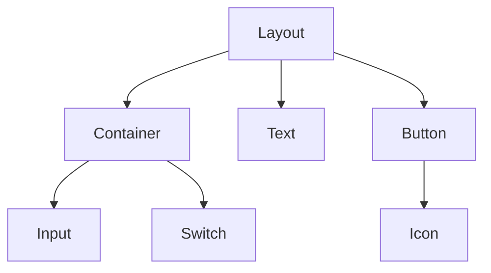
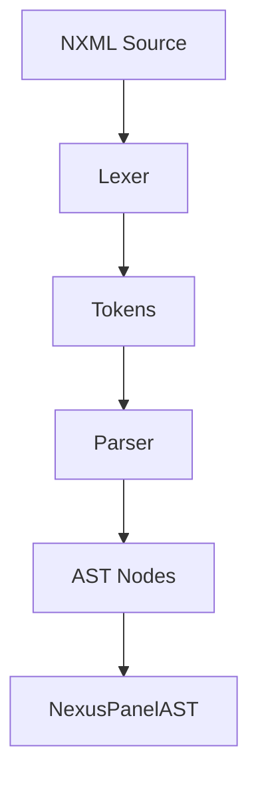
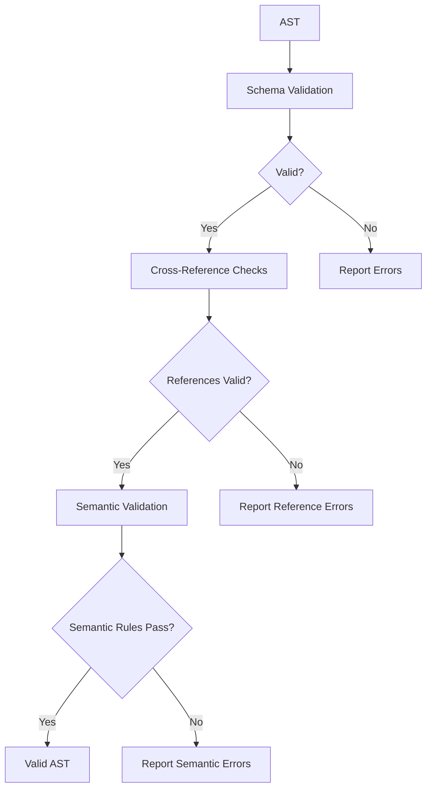
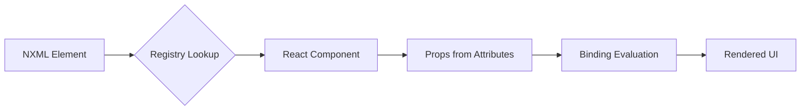

# NXML Specification

<cite>
**Referenced Files in This Document**   
- [panel.ts](file://packages/nexus-protocol/src/ast/panel.ts)
- [view.ts](file://packages/nexus-protocol/src/ast/view.ts)
- [data.ts](file://packages/nexus-protocol/src/ast/data.ts)
- [logic.ts](file://packages/nexus-protocol/src/ast/logic.ts)
- [parser.ts](file://packages/nexus-reactor/src/parser/parser.ts)
- [validator.ts](file://packages/nexus-reactor/src/parser/validator.ts)
- [registry.ts](file://packages/nexus-reactor/src/view/registry.ts)
- [Button.tsx](file://packages/nexus-reactor/src/components/Button.tsx)
- [Input.tsx](file://packages/nexus-reactor/src/components/Input.tsx)
- [Iterate.tsx](file://packages/nexus-reactor/src/components/Iterate.tsx)
</cite>

## Table of Contents
1. [Introduction](#introduction)
2. [NXML Syntax and Structure](#nxml-syntax-and-structure)
3. [Namespace Structure](#namespace-structure)
4. [Component Composition](#component-composition)
5. [AST Generation Process](#ast-generation-process)
6. [Validation Rules](#validation-rules)
7. [Common NXML Examples](#common-nxml-examples)
8. [Mapping to React Components](#mapping-to-react-components)
9. [Best Practices and Pitfalls](#best-practices-and-pitfalls)
10. [Error Handling and Source Tracking](#error-handling-and-source-tracking)

## Introduction

NXML (Nexus Extensible Markup Language) is a declarative markup language designed for defining interactive panels in the Nexus platform. It provides a structured way to define user interfaces and their behaviors through a hierarchical XML-based syntax. NXML serves as the source language that is parsed into an Abstract Syntax Tree (AST), which is then used to render React components and manage application state. This document outlines the complete NXML specification, covering its syntax, structure, validation rules, and implementation details.

## NXML Syntax and Structure

NXML follows a strict XML-based syntax with specific rules for element naming, attribute usage, and nesting. The root element of any NXML document is the `<NexusPanel>` tag, which encapsulates the entire panel definition. Within this root element, three primary namespaces are defined: `<Data>`, `<Logic>`, and `<View>`. Each namespace serves a distinct purpose in defining the panel's behavior and appearance.

The syntax enforces several key principles:
- All elements must be properly closed, either with self-closing tags or matching end tags
- Element names are case-sensitive and must match the defined component library
- Attributes use kebab-case naming convention
- Binding expressions are enclosed in curly braces `{}` and can reference state variables using the `$state` prefix
- Comments follow standard XML syntax `<!-- comment -->`

The parser processes NXML documents in a single pass, tokenizing the input and constructing the AST incrementally. Source location tracking is maintained throughout the parsing process, allowing for precise error reporting with line and column numbers.

**Section sources**
- [parser.ts](file://packages/nexus-reactor/src/parser/parser.ts#L35-L438)

## Namespace Structure

NXML organizes panel definitions into three distinct namespaces: data, logic, and view. This separation of concerns ensures a clean architecture where state management, behavior definition, and UI rendering are clearly delineated.

### Data Namespace

The data namespace, defined within the `<Data>` element, contains declarations of reactive state variables and computed properties. State variables are defined using the `<State>` element with attributes for name, type, and optional default value. Computed properties are defined using the `<Computed>` element, which includes a JavaScript expression that derives its value from other state variables.

```xml
<Data>
  <State name="count" type="number" default="0" />
  <Computed name="doubleCount" value="$state.count * 2" />
</Data>
```

**Section sources**
- [data.ts](file://packages/nexus-protocol/src/ast/data.ts#L20-L242)

### Logic Namespace

The logic namespace, contained within the `<Logic>` element, defines the behavioral aspects of the panel. It includes three main constructs: `<Tool>`, `<Lifecycle>`, and `<Extension>`. Tools represent atomic operations that can be triggered by user interactions or programmatically. Lifecycle hooks allow code execution at specific points in the panel's lifecycle, such as mount and unmount events. Extensions declare dependencies on external capabilities like filesystem access or AI services.

```xml
<Logic>
  <Tool name="increment">
    <Handler>
      $state.count += 1;
    </Handler>
  </Tool>
  <Lifecycle on="mount">
    <Handler>
      console.log("Panel mounted");
    </Handler>
  </Lifecycle>
</Logic>
```

**Section sources**
- [logic.ts](file://packages/nexus-protocol/src/ast/logic.ts#L21-L414)

### View Namespace

The view namespace, enclosed in the `<View>` element, defines the user interface structure. It uses semantic components rather than raw HTML elements, promoting consistency and reusability. The view tree is hierarchical, with layout components organizing content and interactive components providing user functionality. Binding expressions allow dynamic data flow from the data namespace to the UI.

```xml
<View>
  <Layout strategy="auto">
    <Text content="Count: {$state.count}" />
    <Button label="Increment" trigger="increment" />
  </Layout>
</View>
```

**Section sources**
- [view.ts](file://packages/nexus-protocol/src/ast/view.ts#L30-L800)

## Component Composition

NXML components are composed hierarchically, with parent components containing and organizing child components. This composition model follows the principles of React's component architecture, enabling reusable and maintainable UI code. Components are categorized into several types based on their functionality:

- **Layout Components**: `Layout`, `Container` - Organize content spatially
- **Control Flow Components**: `If`, `Iterate` - Conditionally render content
- **Display Components**: `Text`, `Metric`, `StatusBadge` - Present information
- **Input Components**: `Input`, `Button`, `Switch` - Capture user input
- **Visualization Components**: `Chart`, `LogStream` - Display complex data

Each component accepts properties that configure its behavior and appearance. Some properties accept binding expressions, enabling reactive updates when state changes. The composition model supports nesting components to any depth, allowing complex UIs to be built from simple building blocks.



**Diagram sources**
- [view.ts](file://packages/nexus-protocol/src/ast/view.ts#L87-L626)

**Section sources**
- [view.ts](file://packages/nexus-protocol/src/ast/view.ts#L87-L626)

## AST Generation Process

The transformation from NXML source code to a validated AST involves several stages: lexical analysis, parsing, and tree construction. The process begins with the lexer, which converts the character stream into a sequence of tokens representing elements, attributes, and text content. These tokens are then processed by the parser, which applies grammar rules to construct the AST according to the NexusPanelAST model.

The AST generation follows a recursive descent approach, with dedicated functions for parsing each element type. The root `parseNexusPanel` function orchestrates the parsing of the three main namespaces. As each element is processed, corresponding AST nodes are created and linked in a hierarchical structure that mirrors the document's organization.

Source location information is captured at each node, enabling precise error reporting and debugging. The resulting AST is a complete representation of the panel definition, ready for validation and subsequent processing.



**Diagram sources**
- [parser.ts](file://packages/nexus-reactor/src/parser/parser.ts#L35-L438)

**Section sources**
- [parser.ts](file://packages/nexus-reactor/src/parser/parser.ts#L35-L438)

## Validation Rules

NXML documents undergo rigorous validation to ensure structural integrity and semantic correctness. The validation process occurs at multiple levels, from basic syntax checking to complex cross-reference analysis.

### Schema Compliance

The AST is first validated against Zod schemas that define the structure and data types of each node. These schemas enforce:
- Required properties are present
- Data types match expected formats
- Enumerated values are valid
- String lengths and patterns comply with constraints

### Cross-Reference Checks

After schema validation, the system performs cross-reference validation to ensure all references are valid:
- View bindings must reference existing state variables
- Tool triggers must point to defined tools
- Extension usages must correspond to declared extensions
- Duplicate names are prohibited within the same namespace

### Semantic Validation

Additional semantic rules are enforced:
- State names must be valid JavaScript identifiers
- Computed expressions must be syntactically correct JavaScript
- Handler code cannot use forbidden globals
- View component IDs must be unique within the panel

Validation errors include detailed information about the issue, including error codes, descriptive messages, and source locations for easy debugging.



**Diagram sources**
- [validator.ts](file://packages/nexus-reactor/src/parser/validator.ts#L10-L176)

**Section sources**
- [panel.ts](file://packages/nexus-protocol/src/ast/panel.ts#L148-L221)
- [validator.ts](file://packages/nexus-reactor/src/parser/validator.ts#L10-L176)

## Common NXML Examples

This section provides practical examples of NXML usage for common components, demonstrating attribute usage and event binding patterns.

### Button Component

The Button component is used for user interactions that trigger actions. It supports various visual variants and can pass arguments to the triggered tool.

```xml
<Button 
  label="Submit" 
  variant="primary" 
  trigger="submitForm" 
  args="[$state.formData]" 
  disabled="{$state.isSubmitting}" 
/>
```

**Section sources**
- [Button.tsx](file://packages/nexus-reactor/src/components/Button.tsx#L1-L75)

### Input Component

The Input component provides two-way binding between user input and state variables, automatically updating the state as the user types.

```xml
<Input 
  bind="$state.username" 
  placeholder="Enter username" 
  inputType="text" 
  disabled="{$state.isReadOnly}" 
/>
```

**Section sources**
- [Input.tsx](file://packages/nexus-reactor/src/components/Input.tsx#L1-L66)

### Iterate Component

The Iterate component enables dynamic rendering of lists by iterating over array data, creating instances of child components for each item.

```xml
<Iterate items="{$state.items}" as="item" key="id">
  <Text content="{$scope.item.name}" />
  <Button label="Delete" trigger="deleteItem" args="[$scope.item.id]" />
</Iterate>
```

**Section sources**
- [Iterate.tsx](file://packages/nexus-reactor/src/components/Iterate.tsx#L1-L72)

## Mapping to React Components

NXML components are mapped to React components through a view registry system. Each NXML element corresponds to a specific React component that implements its behavior and rendering logic. The mapping is facilitated by the component registry, which maintains a lookup table of component types to their React implementations.

During rendering, the AST is traversed, and for each view node, the corresponding React component is instantiated with props derived from the node's attributes. Binding expressions are evaluated in the context of the current state, ensuring reactive updates. The view registry also supports imperative access to components through the `$view` API, allowing direct manipulation of component instances when necessary.

The mapping process preserves the hierarchical structure of the NXML, resulting in a React component tree that mirrors the original markup. This approach enables the full power of React's rendering engine while maintaining the declarative simplicity of NXML.



**Diagram sources**
- [registry.ts](file://packages/nexus-reactor/src/view/registry.ts#L1-L187)

**Section sources**
- [registry.ts](file://packages/nexus-reactor/src/view/registry.ts#L1-L187)

## Best Practices and Pitfalls

Adhering to best practices ensures maintainable and performant NXML code. Key recommendations include:

### Best Practices

- Use descriptive names for state variables and tools
- Group related components within Container elements
- Leverage computed properties to avoid redundant calculations
- Use appropriate layout strategies for different content types
- Minimize direct DOM manipulation through the `$view` API
- Organize complex logic into multiple focused tools rather than monolithic handlers

### Common Pitfalls

- Creating circular dependencies in computed properties
- Using expensive operations in frequently updated bindings
- Overusing imperative `$view` calls when reactive bindings would suffice
- Nesting too many layout components, impacting performance
- Forgetting to declare extensions before using them in handlers
- Using duplicate component IDs, breaking imperative access

Following these guidelines helps create NXML that is both effective and maintainable, reducing bugs and improving development efficiency.

**Section sources**
- [view.ts](file://packages/nexus-protocol/src/ast/view.ts#L30-L800)
- [logic.ts](file://packages/nexus-protocol/src/ast/logic.ts#L21-L414)

## Error Handling and Source Tracking

The NXML system provides comprehensive error handling with detailed source location tracking. When validation or parsing errors occur, the system generates error objects containing:
- A unique error code for programmatic identification
- A human-readable message describing the issue
- The path to the problematic element in the AST
- Source location information (line and column numbers)

This information enables precise error reporting in development tools, helping users quickly identify and fix issues. The parser captures source locations for all AST nodes during construction, ensuring that even semantic errors can be traced back to their origin in the source document.

The validation system distinguishes between errors and warnings, with errors preventing panel execution and warnings providing advisory feedback about potential issues like unused state variables or tools. This tiered approach helps maintain strict correctness while providing helpful guidance for code quality improvement.

**Section sources**
- [parser.ts](file://packages/nexus-reactor/src/parser/parser.ts#L9-L438)
- [validator.ts](file://packages/nexus-reactor/src/parser/validator.ts#L10-L176)