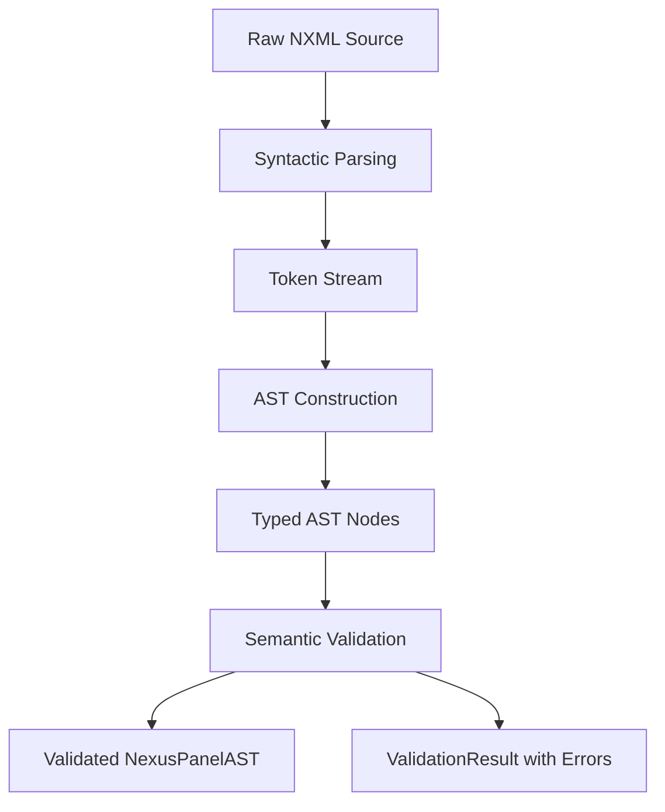
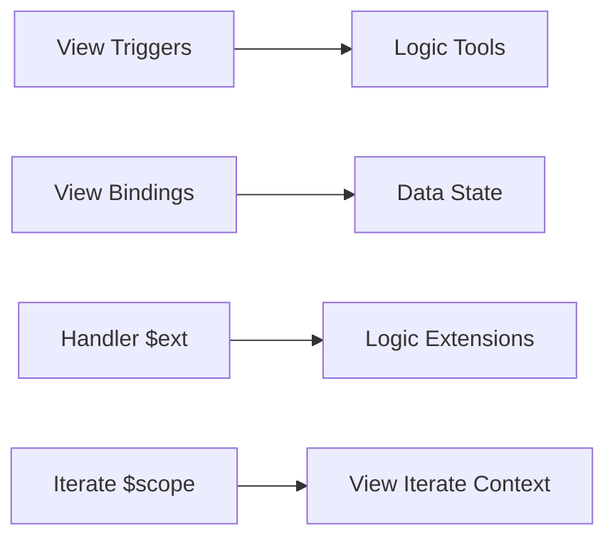
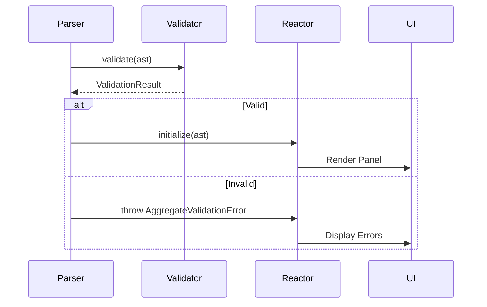

# Validation Rules

<cite>
**Referenced Files in This Document**   
- [validator.ts](file://packages/nexus-reactor/src/parser/validator.ts)
- [data.ts](file://packages/nexus-protocol/src/schemas/data.ts)
- [logic.ts](file://packages/nexus-protocol/src/schemas/logic.ts)
- [view.ts](file://packages/nexus-protocol/src/schemas/view.ts)
- [panel.ts](file://packages/nexus-protocol/src/schemas/panel.ts)
- [data.ts](file://packages/nexus-protocol/src/ast/data.ts)
- [logic.ts](file://packages/nexus-protocol/src/ast/logic.ts)
- [view.ts](file://packages/nexus-protocol/src/ast/view.ts)
- [panel.ts](file://packages/nexus-protocol/src/ast/panel.ts)
- [types.ts](file://packages/nexus-reactor/src/core/types.ts)
- [errors.ts](file://packages/nexus-reactor/src/core/errors.ts)
- [constants.ts](file://packages/nexus-reactor/src/core/constants.ts)
</cite>

## Table of Contents
1. [Introduction](#introduction)
2. [Multi-Stage Validation Process](#multi-stage-validation-process)
3. [ValidationResult and ValidationError Interfaces](#validationresult-and-validationerror-interfaces)
4. [Schema Compliance Checks by Namespace](#schema-compliance-checks-by-namespace)
5. [Cross-Reference Validation](#cross-reference-validation)
6. [Panel-Level Validation Rules](#panel-level-validation-rules)
7. [Integration with Parser and Reactor Initialization](#integration-with-parser-and-reactor-initialization)
8. [Common Validation Errors and Fixes](#common-validation-errors-and-fixes)
9. [Implementation Details and Developer Tooling](#implementation-details-and-developer-tooling)
10. [Conclusion](#conclusion)

## Introduction
The NXML validation system ensures structural integrity, semantic correctness, and runtime safety of NexusPanel definitions. It operates through a multi-stage process that combines syntactic parsing, AST construction, and semantic validation using Zod schemas. This document details the comprehensive validation rules applied across the Data, Logic, and View namespaces, including cross-reference checks, panel-level constraints, and integration with the parser and reactor initialization pipeline.

**Section sources**
- [validator.ts](file://packages/nexus-reactor/src/parser/validator.ts#L1-L176)
- [panel.ts](file://packages/nexus-protocol/src/ast/panel.ts#L1-L302)

## Multi-Stage Validation Process
The NXML validation process consists of three distinct stages: syntactic parsing, AST construction, and semantic validation. The syntactic parsing stage uses a lexer and parser to convert raw NXML into tokens and an initial tree structure. During AST construction, these tokens are transformed into typed AST nodes defined in the `@nexus/protocol/ast` module. Finally, semantic validation applies Zod schemas from the `@nexus/protocol/schemas` module to enforce type correctness, structural constraints, and cross-namespace references. This staged approach enables precise error reporting with source location information and supports both quick schema-only validation and strict cross-reference validation.

**Diagram sources**
- [validator.ts](file://packages/nexus-reactor/src/parser/validator.ts#L10-L18)
- [panel.ts](file://packages/nexus-protocol/src/ast/panel.ts#L157-L221)

## ValidationResult and ValidationError Interfaces
The validation system uses the `ValidationResult` interface to encapsulate validation outcomes, containing a boolean `valid` flag, an array of `ValidationError` objects, and optional `ValidationWarning` entries. Each `ValidationError` includes a machine-readable `code`, human-readable `message`, `path` indicating the location within the AST, and optional `loc` with source position. The `ValidationError` class extends `NexusError` and supports severity levels, enabling differentiated handling of errors versus warnings. These interfaces facilitate structured error reporting, IDE integration, and automated tooling by providing consistent error metadata.

**Section sources**
- [types.ts](file://packages/nexus-reactor/src/core/types.ts#L396-L400)
- [errors.ts](file://packages/nexus-reactor/src/core/errors.ts#L104-L193)

## Schema Compliance Checks by Namespace
### Data Namespace Validation
The Data namespace validation ensures type validity and default value coercion. The `StateNodeSchema` enforces valid identifiers and primitive types (string, number, boolean, list, object), while the `DataASTSchema` prevents duplicate state names. Default values are automatically coerced to their declared types: string "true" becomes boolean true, "123" becomes number 123, and JSON-like strings are parsed into arrays or objects. The `validateDefaultValueType` function verifies type compatibility during validation.

**Section sources**
- [data.ts](file://packages/nexus-protocol/src/schemas/data.ts#L54-L186)
- [data.ts](file://packages/nexus-protocol/src/ast/data.ts#L218-L241)

### Logic Namespace Validation
The Logic namespace enforces tool argument safety and handler sandboxing. The `ArgNodeSchema` validates argument types and optionality, while the `HandlerCodeSchema` prohibits forbidden globals like `window`, `document`, `eval`, and `fetch`. The `LogicASTSchema` ensures unique tool names and extension aliases, and limits lifecycle hooks to one mount and one unmount handler. The `validateExtensionUsage` function confirms that all `$ext.alias` references correspond to declared extensions.

**Section sources**
- [logic.ts](file://packages/nexus-protocol/src/schemas/logic.ts#L27-L169)
- [logic.ts](file://packages/nexus-protocol/src/ast/logic.ts#L79-L94)

### View Namespace Validation
The View namespace validates component prop correctness using type-specific schemas. Each component (Text, Button, Chart, etc.) has a corresponding props schema (e.g., `TextPropsSchema`, `ButtonPropsSchema`) that validates required fields, types, and defaults. The `ViewNodeSchema` uses a recursive definition to validate the entire component tree, while `BindingExpressionSchema` ensures binding syntax correctness. The validation process checks prop types against component requirements and verifies binding expressions follow the `{expression}` format.

**Section sources**
- [view.ts](file://packages/nexus-protocol/src/schemas/view.ts#L72-L240)
- [view.ts](file://packages/nexus-protocol/src/ast/view.ts#L254-L625)

## Cross-Reference Validation
Cross-reference validation ensures referential integrity between namespaces. The system verifies that trigger attributes in View components reference existing Tools in the Logic namespace, and that binding expressions (`$state.name`) reference valid state variables in the Data namespace. It also validates that `$scope.ref` usage occurs only within `<Iterate>` contexts. The `validateCrossReferences` function identifies unused state variables and tools, generating warnings for potential dead code. Extension usage in handlers is checked against declared extensions to prevent runtime errors.

**Diagram sources**
- [validator.ts](file://packages/nexus-reactor/src/parser/validator.ts#L142-L163)
- [panel.ts](file://packages/nexus-protocol/src/schemas/panel.ts#L57-L94)

## Panel-Level Validation Rules
Panel-level validation enforces structural constraints at the NexusPanel root. It requires unique state and computed names within the Data namespace, and unique tool names in the Logic namespace. The system allows only one mount and one unmount lifecycle hook. Required meta fields include a non-empty title, with optional description, author, and tags. View component IDs must be unique to enable imperative manipulation via `$view.getElementById()`. The `NexusPanelASTSchemaStrict` combines schema validation with cross-reference checks to ensure panel integrity.

**Section sources**
- [panel.ts](file://packages/nexus-protocol/src/schemas/panel.ts#L45-L94)
- [panel.ts](file://packages/nexus-protocol/src/ast/panel.ts#L169-L215)

## Integration with Parser and Reactor Initialization
Validation integrates tightly with the parser and reactor initialization pipeline. The `validate` function in `validator.ts` is called during AST construction, returning a `ValidationResult` used to determine parsing success. The `validateOrThrow` variant throws an `AggregateValidationError` containing all issues, which is caught during reactor initialization to prevent launching invalid panels. Quick validation (`validateQuick`) performs only schema checks for performance-critical scenarios, while full validation includes cross-reference analysis. The reactor uses validation outcomes to enable developer tooling, such as error highlighting in the editor.

**Diagram sources**
- [validator.ts](file://packages/nexus-reactor/src/parser/validator.ts#L10-L27)
- [panel.ts](file://packages/nexus-protocol/src/ast/panel.ts#L157-L221)

## Common Validation Errors and Fixes
Common validation errors include `DUPLICATE_STATE` (conflicting state names), `UNDEFINED_TOOL_REFERENCE` (trigger pointing to non-existent tool), and `FORBIDDEN_GLOBAL` (handler using `window` or `fetch`). To fix `DUPLICATE_STATE`, rename one of the conflicting state variables. For `UNDEFINED_TOOL_REFERENCE`, ensure the tool exists in the Logic namespace with a matching name. The `FORBIDDEN_GLOBAL` error requires replacing browser APIs with extension calls (e.g., using `$ext.http` instead of `fetch`). Unused state warnings (`UNUSED_STATE`) can be resolved by either using the state in bindings or removing it. Duplicate view ID errors require unique `id` attributes for components needing imperative access.

**Section sources**
- [validator.ts](file://packages/nexus-reactor/src/parser/validator.ts#L32-L36)
- [errors.ts](file://packages/nexus-reactor/src/core/errors.ts#L122-L160)

## Implementation Details and Developer Tooling
The validation implementation leverages Zod schemas in `schemas/` for type-safe validation and AST utilities in `ast/` for tree traversal. Error recovery strategies include graceful degradation—allowing partial AST construction even with validation errors—enabling editors to provide feedback while users correct issues. Developer tooling uses validation results for real-time error highlighting, linting, and auto-suggestions. The `validateNexusPanelAST` function in `panel.ts` orchestrates multi-stage validation, while constants in `constants.ts` define error codes and validation patterns. The system supports both synchronous validation for immediate feedback and asynchronous deep validation for complex cross-reference analysis.

**Section sources**
- [panel.ts](file://packages/nexus-protocol/src/schemas/panel.ts#L129-L250)
- [constants.ts](file://packages/nexus-reactor/src/core/constants.ts#L219-L249)

## Conclusion
The NXML validation system provides a robust framework for ensuring the correctness and safety of NexusPanel definitions. By combining syntactic parsing, AST-based analysis, and semantic validation with Zod schemas, it enforces structural integrity across the Data, Logic, and View namespaces. The detailed error reporting through `ValidationResult` and `ValidationError` interfaces enables effective debugging and developer tooling integration. This comprehensive validation approach is essential for maintaining reliability in the Nexus AI-assisted prototyping platform.