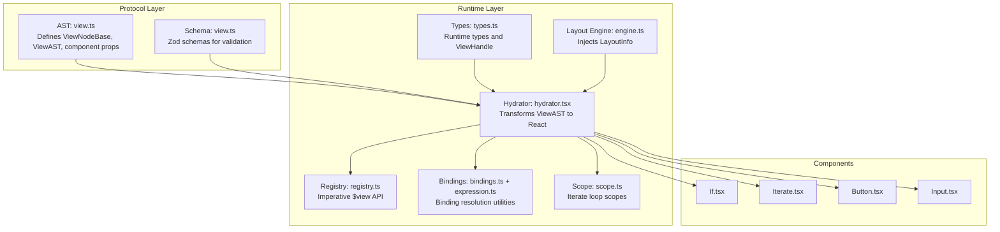
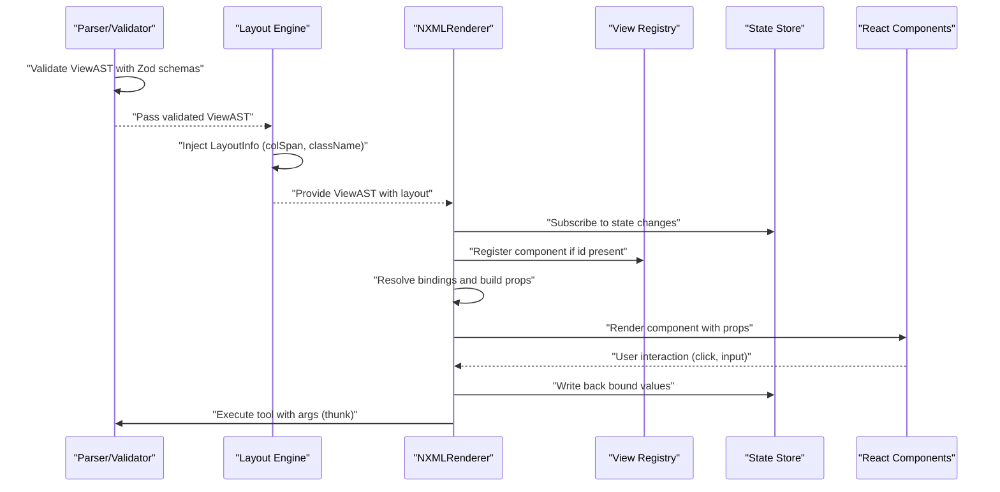
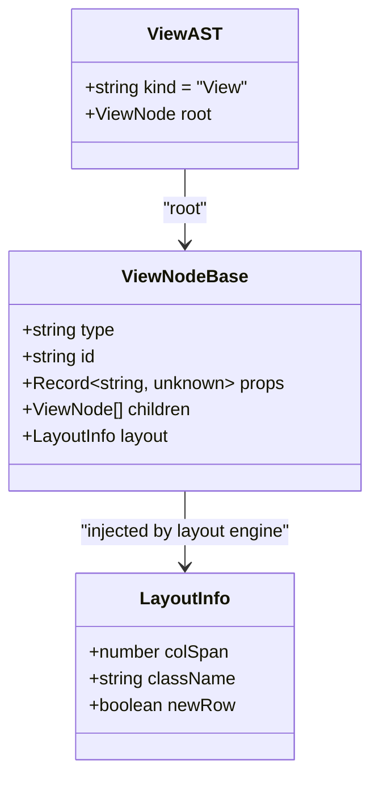
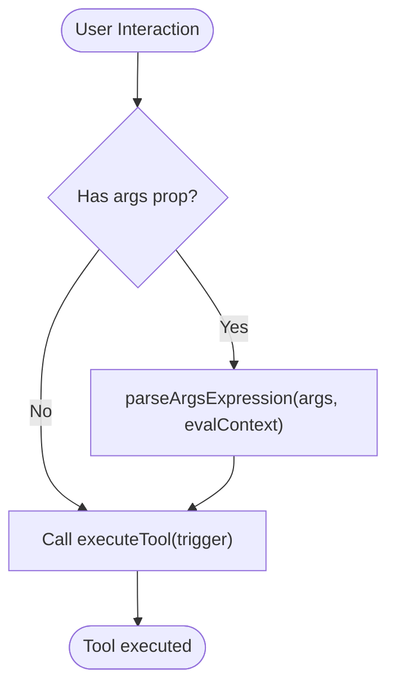
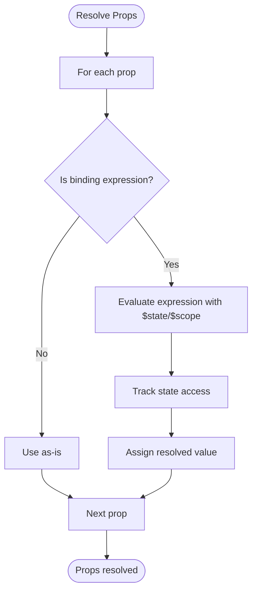
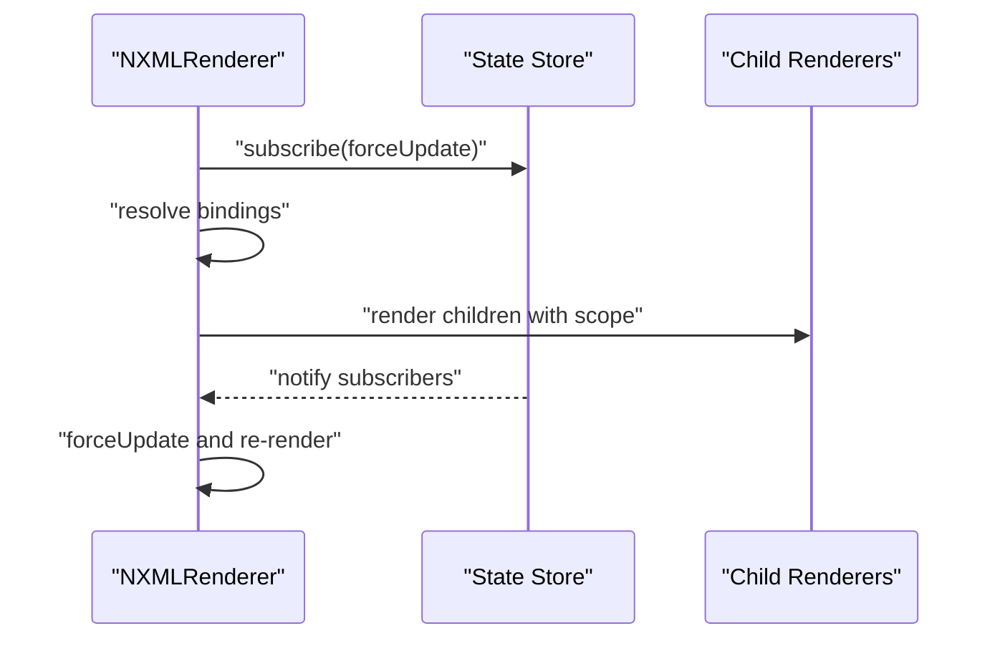
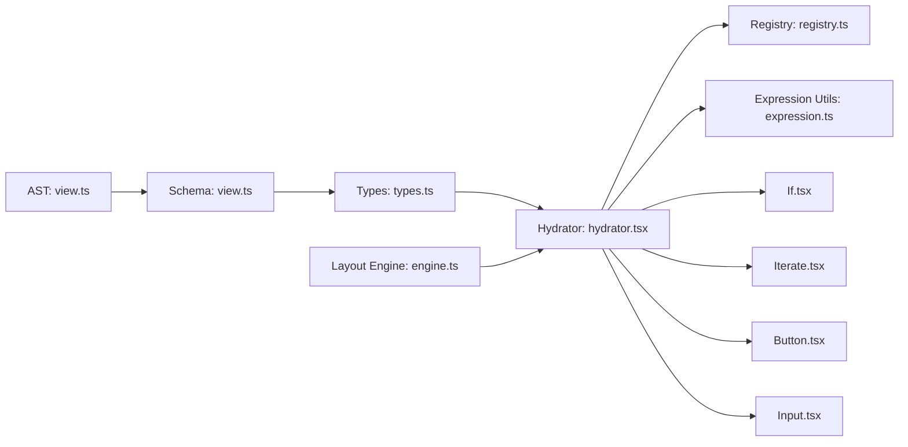

# View Namespace

<cite>
**Referenced Files in This Document**
- [view.ts](file://packages/nexus-protocol/src/ast/view.ts)
- [view.ts](file://packages/nexus-protocol/src/schemas/view.ts)
- [types.ts](file://packages/nexus-reactor/src/core/types.ts)
- [engine.ts](file://packages/nexus-reactor/src/layout/engine.ts)
- [registry.ts](file://packages/nexus-reactor/src/view/registry.ts)
- [bindings.ts](file://packages/nexus-reactor/src/view/bindings.ts)
- [expression.ts](file://packages/nexus-reactor/src/utils/expression.ts)
- [scope.ts](file://packages/nexus-reactor/src/view/scope.ts)
- [hydrator.tsx](file://packages/nexus-reactor/src/view/hydrator.tsx)
- [index.ts](file://packages/nexus-reactor/src/view/index.ts)
- [If.tsx](file://packages/nexus-reactor/src/components/If.tsx)
- [Iterate.tsx](file://packages/nexus-reactor/src/components/Iterate.tsx)
- [Button.tsx](file://packages/nexus-reactor/src/components/Button.tsx)
- [Input.tsx](file://packages/nexus-reactor/src/components/Input.tsx)
</cite>

## Table of Contents
1. [Introduction](#introduction)
2. [Project Structure](#project-structure)
3. [Core Components](#core-components)
4. [Architecture Overview](#architecture-overview)
5. [Detailed Component Analysis](#detailed-component-analysis)
6. [Dependency Analysis](#dependency-analysis)
7. [Performance Considerations](#performance-considerations)
8. [Troubleshooting Guide](#troubleshooting-guide)
9. [Conclusion](#conclusion)

## Introduction
This document explains the View Namespace in NXML, focusing on how it defines UI structure using the Standard Component Library (SCL), how the view tree is transformed into React components via the view registry, and how reactive bindings and imperative APIs enable dynamic UI updates. It covers the ViewNodeBase interface, LayoutInfo injection by the layout engine, component categories, props and behaviors, global attributes (id, trigger, args), the thunk pattern for dynamic arguments, binding expressions and scope resolution, validation rules, and the traversal/rendering pipeline.

## Project Structure
The View Namespace spans protocol-level AST definitions and runtime hydration logic:
- Protocol AST and schemas define typed view nodes and validation rules.
- Reactor runtime transforms the AST into React components, manages scope, resolves bindings, and wires events.
- The layout engine injects LayoutInfo into nodes for responsive grid layout.

**Diagram sources**
- [view.ts](file://packages/nexus-protocol/src/ast/view.ts#L1-L120)
- [view.ts](file://packages/nexus-protocol/src/schemas/view.ts#L1-L120)
- [types.ts](file://packages/nexus-reactor/src/core/types.ts#L212-L225)
- [engine.ts](file://packages/nexus-reactor/src/layout/engine.ts#L1-L120)
- [hydrator.tsx](file://packages/nexus-reactor/src/view/hydrator.tsx#L1-L120)
- [registry.ts](file://packages/nexus-reactor/src/view/registry.ts#L1-L80)
- [bindings.ts](file://packages/nexus-reactor/src/view/bindings.ts#L1-L27)
- [expression.ts](file://packages/nexus-reactor/src/utils/expression.ts#L1-L120)
- [scope.ts](file://packages/nexus-reactor/src/view/scope.ts#L1-L60)
- [If.tsx](file://packages/nexus-reactor/src/components/If.tsx#L1-L41)
- [Iterate.tsx](file://packages/nexus-reactor/src/components/Iterate.tsx#L1-L72)
- [Button.tsx](file://packages/nexus-reactor/src/components/Button.tsx#L1-L75)
- [Input.tsx](file://packages/nexus-reactor/src/components/Input.tsx#L1-L66)

**Section sources**
- [view.ts](file://packages/nexus-protocol/src/ast/view.ts#L1-L120)
- [view.ts](file://packages/nexus-protocol/src/schemas/view.ts#L1-L120)
- [types.ts](file://packages/nexus-reactor/src/core/types.ts#L212-L225)
- [engine.ts](file://packages/nexus-reactor/src/layout/engine.ts#L1-L120)
- [hydrator.tsx](file://packages/nexus-reactor/src/view/hydrator.tsx#L1-L120)

## Core Components
- ViewNodeBase: Base interface for all view nodes with type, id, props, children, and optional layout.
- LayoutInfo: Injected by the layout engine with colSpan, className, and newRow flags.
- ViewAST: Root container holding the ViewNode tree.
- Runtime types: ViewNode, ViewAST, and ViewHandle define the runtime shape and imperative API.

Key responsibilities:
- AST and schemas define component props and enforce validation.
- Layout engine computes grid layout and injects LayoutInfo.
- Hydrator transforms nodes to React, resolves bindings, and wires events.
- Registry enables imperative access via $view API.
- Scope manages Iterate loop variables and nested scoping.

**Section sources**
- [view.ts](file://packages/nexus-protocol/src/ast/view.ts#L33-L84)
- [view.ts](file://packages/nexus-protocol/src/schemas/view.ts#L60-L120)
- [types.ts](file://packages/nexus-reactor/src/core/types.ts#L212-L225)
- [types.ts](file://packages/nexus-reactor/src/core/types.ts#L291-L304)

## Architecture Overview
The View Namespace orchestrates declarative UI construction, reactive binding, and imperative control:

**Diagram sources**
- [view.ts](file://packages/nexus-protocol/src/schemas/view.ts#L210-L278)
- [engine.ts](file://packages/nexus-reactor/src/layout/engine.ts#L1-L120)
- [hydrator.tsx](file://packages/nexus-reactor/src/view/hydrator.tsx#L85-L239)
- [registry.ts](file://packages/nexus-reactor/src/view/registry.ts#L40-L120)
- [expression.ts](file://packages/nexus-reactor/src/utils/expression.ts#L1-L120)

## Detailed Component Analysis

### ViewNodeBase and LayoutInfo
- ViewNodeBase: type, id, props, children, optional layout.
- LayoutInfo: colSpan (1–12), className (grid classes), newRow flag.
- Layout engine injects layout into nodes; hydrator reads layout to compute child styles.

**Diagram sources**
- [view.ts](file://packages/nexus-protocol/src/ast/view.ts#L33-L84)
- [view.ts](file://packages/nexus-protocol/src/ast/view.ts#L640-L651)
- [engine.ts](file://packages/nexus-reactor/src/layout/engine.ts#L134-L173)

**Section sources**
- [view.ts](file://packages/nexus-protocol/src/ast/view.ts#L33-L84)
- [view.ts](file://packages/nexus-protocol/src/ast/view.ts#L640-L651)
- [engine.ts](file://packages/nexus-reactor/src/layout/engine.ts#L134-L173)

### Layout Components
- Layout: Arranges children with strategy (auto, stack, row), gap, align, justify. Generates grid/flex styles.
- Container: Groups content with optional title and variant.

Props and behavior:
- Layout: strategy defaults to auto; gap defaults to md; align/jusitfy optional.
- Container: title optional; variant defaults to card.

Validation:
- LayoutPropsSchema enforces strategy/gap/align/jusitfy enums and optional id/title/variant.

**Section sources**
- [view.ts](file://packages/nexus-protocol/src/ast/view.ts#L90-L173)
- [view.ts](file://packages/nexus-protocol/src/schemas/view.ts#L72-L101)
- [engine.ts](file://packages/nexus-reactor/src/layout/engine.ts#L131-L173)

### Control Flow Components
- If: Renders children only when condition evaluates to truthy.
- Iterate: Iterates over items, exposes loop variable (as) and index, supports key extraction.

Props and behavior:
- If: condition must be a binding expression; children rendered via function call.
- Iterate: items must be a binding expression; as is required; optional key; creates child scope with as and asIndex.

Scope resolution:
- $scope.item, $scope.index, and nested Iterate scopes resolved via scope chain.

**Section sources**
- [view.ts](file://packages/nexus-protocol/src/ast/view.ts#L178-L246)
- [view.ts](file://packages/nexus-protocol/src/schemas/view.ts#L88-L101)
- [scope.ts](file://packages/nexus-reactor/src/view/scope.ts#L1-L120)
- [If.tsx](file://packages/nexus-reactor/src/components/If.tsx#L1-L41)
- [Iterate.tsx](file://packages/nexus-reactor/src/components/Iterate.tsx#L1-L72)

### Display Components (SCL)
- Text: content supports plain string or binding; variant enum.
- Metric: label/value/trend/unit; trend and unit optional.
- StatusBadge: label/value/status; status supports enum or binding.
- LogStream: data binding; height optional; autoScroll default true.

Validation:
- TextPropsSchema, MetricPropsSchema, StatusBadgePropsSchema, LogStreamPropsSchema enforce required fields and types.

**Section sources**
- [view.ts](file://packages/nexus-protocol/src/ast/view.ts#L252-L383)
- [view.ts](file://packages/nexus-protocol/src/schemas/view.ts#L102-L133)

### Input Components (SCL)
- Input: bind to state path; placeholder; inputType; disabled (boolean or binding).
- Button: label; trigger; variant; args/payload; disabled.
- Switch: bind to boolean state; label; disabled.
- Action: alias for Button with trigger; args/payload.

Two-way binding:
- Hydrator writes bound values back to state via stateStore.proxy.

**Section sources**
- [view.ts](file://packages/nexus-protocol/src/ast/view.ts#L389-L603)
- [view.ts](file://packages/nexus-protocol/src/schemas/view.ts#L134-L181)
- [hydrator.tsx](file://packages/nexus-reactor/src/view/hydrator.tsx#L172-L195)
- [Input.tsx](file://packages/nexus-reactor/src/components/Input.tsx#L1-L66)
- [Button.tsx](file://packages/nexus-reactor/src/components/Button.tsx#L1-L75)

### Visualization Components (SCL)
- Chart: type enum; data binding; xKey/yKey; height.

Validation:
- ChartPropsSchema enforces type and optional keys.

**Section sources**
- [view.ts](file://packages/nexus-protocol/src/ast/view.ts#L513-L554)
- [view.ts](file://packages/nexus-protocol/src/schemas/view.ts#L162-L171)

### Global Attributes and Imperative Access
- id: Unique identifier enabling imperative access via $view API.
- trigger: Tool name invoked on user interaction; combined with args for dynamic arguments.
- args: Binding expression evaluated at interaction time (thunk pattern).

Imperative API:
- ViewRegistry stores component registrations and exposes ViewHandle with setProp and call methods.
- Hydrator registers/unregisters components and merges transient props.

**Section sources**
- [view.ts](file://packages/nexus-protocol/src/ast/view.ts#L33-L64)
- [registry.ts](file://packages/nexus-reactor/src/view/registry.ts#L40-L120)
- [hydrator.tsx](file://packages/nexus-reactor/src/view/hydrator.tsx#L107-L171)

### Thunk Pattern for Dynamic Arguments
- args are parsed at interaction time using parseArgsExpression, allowing expressions like [$scope.item.id] or { id: $scope.item.id }.
- Hydrator passes resolved args to executeTool.

**Diagram sources**
- [hydrator.tsx](file://packages/nexus-reactor/src/view/hydrator.tsx#L155-L171)
- [expression.ts](file://packages/nexus-reactor/src/utils/expression.ts#L206-L238)

**Section sources**
- [hydrator.tsx](file://packages/nexus-reactor/src/view/hydrator.tsx#L155-L171)
- [expression.ts](file://packages/nexus-reactor/src/utils/expression.ts#L206-L238)

### Binding Expressions and Scope Resolution
- Binding syntax: {$state.path} and {$scope.var}.
- Hydrator tracks state access and resolves bindings with evaluation context.
- Scope chain supports nested Iterate loops and variable lookup.

**Diagram sources**
- [hydrator.tsx](file://packages/nexus-reactor/src/view/hydrator.tsx#L122-L152)
- [expression.ts](file://packages/nexus-reactor/src/utils/expression.ts#L76-L120)
- [scope.ts](file://packages/nexus-reactor/src/view/scope.ts#L52-L72)

**Section sources**
- [hydrator.tsx](file://packages/nexus-reactor/src/view/hydrator.tsx#L122-L152)
- [expression.ts](file://packages/nexus-reactor/src/utils/expression.ts#L76-L120)
- [scope.ts](file://packages/nexus-reactor/src/view/scope.ts#L52-L72)

### Validation Rules from the View Schema
- Zod schemas validate component props, enforce required fields, and type checks.
- validateViewNode validates base node and type-specific props.
- extractBindingReferences and extractTriggerReferences help static analysis.

Common validations:
- Required props enforced per component (e.g., label/value for Metric, items/as for Iterate).
- Enum types enforced (strategy, gap, align, variant, status, chart type).
- BindingExpressionSchema ensures binding syntax.

**Section sources**
- [view.ts](file://packages/nexus-protocol/src/schemas/view.ts#L210-L278)
- [view.ts](file://packages/nexus-protocol/src/schemas/view.ts#L280-L359)

### Traversal and Reactive Rendering
- traverseViewTree and findViewNodes utilities enable tree walking.
- Hydrator renders children recursively; NXMLRenderer subscribes to state changes and re-renders on updates.
- LayoutInfo is read to compute child styles; layout engine injects grid classes.

**Diagram sources**
- [hydrator.tsx](file://packages/nexus-reactor/src/view/hydrator.tsx#L90-L121)
- [hydrator.tsx](file://packages/nexus-reactor/src/view/hydrator.tsx#L206-L239)
- [engine.ts](file://packages/nexus-reactor/src/layout/engine.ts#L164-L173)

**Section sources**
- [view.ts](file://packages/nexus-protocol/src/ast/view.ts#L758-L800)
- [hydrator.tsx](file://packages/nexus-reactor/src/view/hydrator.tsx#L90-L121)
- [hydrator.tsx](file://packages/nexus-reactor/src/view/hydrator.tsx#L206-L239)
- [engine.ts](file://packages/nexus-reactor/src/layout/engine.ts#L164-L173)

## Dependency Analysis
- AST and schemas define component contracts; runtime hydrator depends on these contracts.
- Layout engine depends on component weights and constants to compute layout.
- Hydrator depends on state store, registry, and expression utilities.
- Components depend on hydrated props and evaluation context.

**Diagram sources**
- [view.ts](file://packages/nexus-protocol/src/ast/view.ts#L608-L651)
- [view.ts](file://packages/nexus-protocol/src/schemas/view.ts#L210-L278)
- [types.ts](file://packages/nexus-reactor/src/core/types.ts#L212-L225)
- [engine.ts](file://packages/nexus-reactor/src/layout/engine.ts#L1-L120)
- [hydrator.tsx](file://packages/nexus-reactor/src/view/hydrator.tsx#L1-L120)
- [registry.ts](file://packages/nexus-reactor/src/view/registry.ts#L1-L80)
- [expression.ts](file://packages/nexus-reactor/src/utils/expression.ts#L1-L120)
- [If.tsx](file://packages/nexus-reactor/src/components/If.tsx#L1-L41)
- [Iterate.tsx](file://packages/nexus-reactor/src/components/Iterate.tsx#L1-L72)
- [Button.tsx](file://packages/nexus-reactor/src/components/Button.tsx#L1-L75)
- [Input.tsx](file://packages/nexus-reactor/src/components/Input.tsx#L1-L66)

**Section sources**
- [view.ts](file://packages/nexus-protocol/src/ast/view.ts#L608-L651)
- [view.ts](file://packages/nexus-protocol/src/schemas/view.ts#L210-L278)
- [types.ts](file://packages/nexus-reactor/src/core/types.ts#L212-L225)
- [engine.ts](file://packages/nexus-reactor/src/layout/engine.ts#L1-L120)
- [hydrator.tsx](file://packages/nexus-reactor/src/view/hydrator.tsx#L1-L120)
- [registry.ts](file://packages/nexus-reactor/src/view/registry.ts#L1-L80)
- [expression.ts](file://packages/nexus-reactor/src/utils/expression.ts#L1-L120)

## Performance Considerations
- Binding evaluation occurs per render; memoization via useMemo in components reduces recomputation.
- State subscription uses a subscriber ID to limit re-renders to affected components.
- Layout engine computes grid classes once per node; hydrator reads layout to avoid repeated calculations.
- Iterate components create child scopes; avoid heavy computations inside children to minimize re-renders.

[No sources needed since this section provides general guidance]

## Troubleshooting Guide
- Validation errors: Use validateViewNode/validateViewAST to identify invalid props or missing required fields.
- Binding errors: Ensure binding expressions are properly formatted and reference existing $state/$scope variables.
- Imperative API: Verify component registration via id and that ViewHandle methods are called on registered components.
- Layout issues: Confirm layout strategy and gap values are valid enums; check that colSpan does not exceed 12.

**Section sources**
- [view.ts](file://packages/nexus-protocol/src/schemas/view.ts#L242-L278)
- [registry.ts](file://packages/nexus-reactor/src/view/registry.ts#L73-L120)
- [expression.ts](file://packages/nexus-reactor/src/utils/expression.ts#L1-L120)

## Conclusion
The View Namespace in NXML provides a strongly-typed, reactive UI framework. The protocol defines AST and schemas; the runtime hydrator transforms nodes into React components, resolves bindings, and wires events. The layout engine injects responsive grid metadata, while the registry enables imperative control. Together, these pieces deliver a flexible, validated, and interactive UI system.